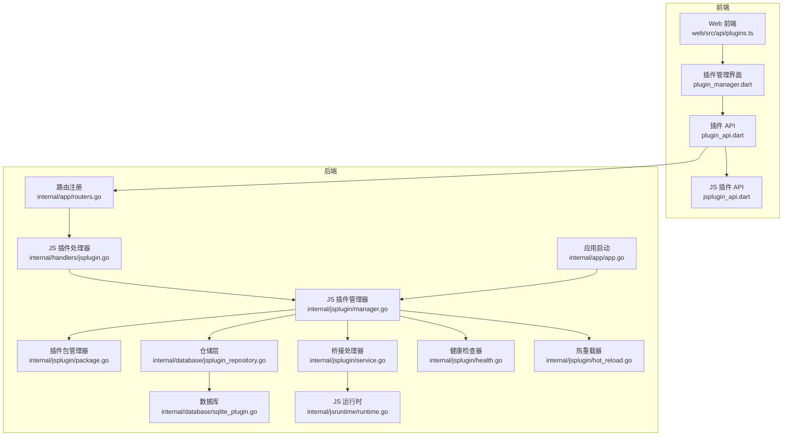
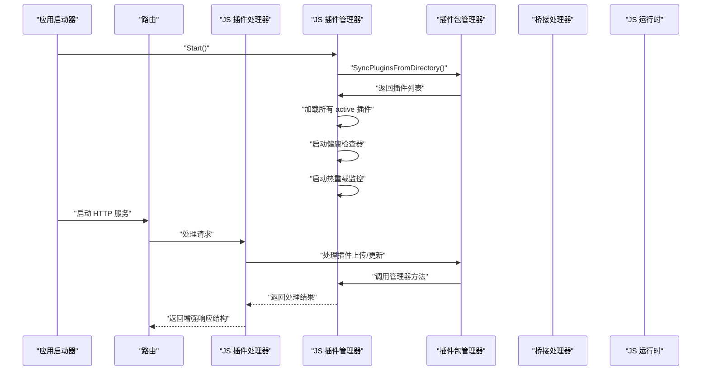
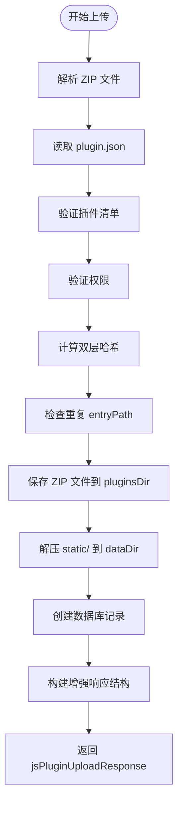
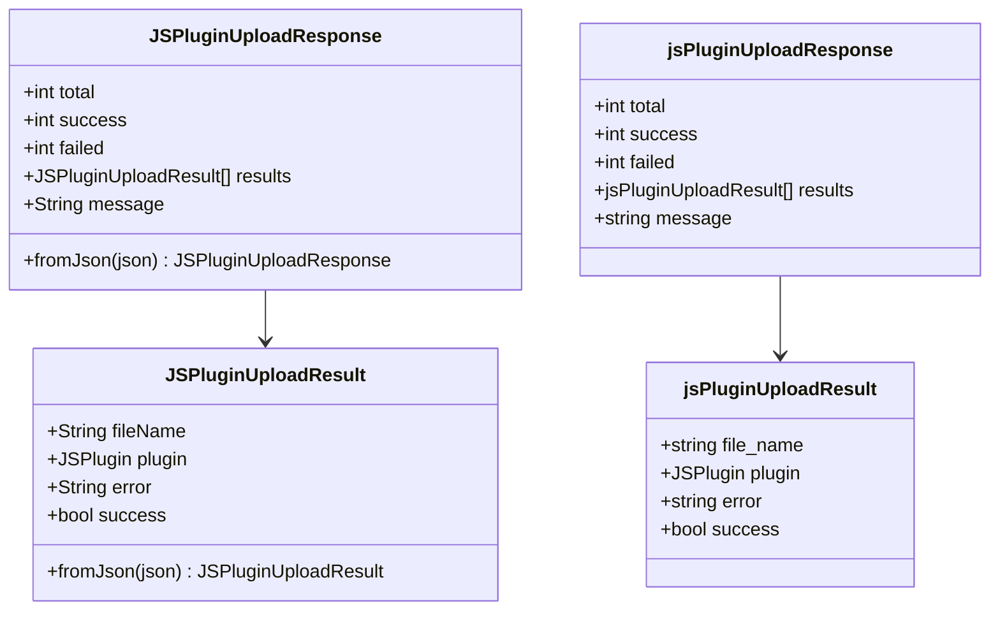
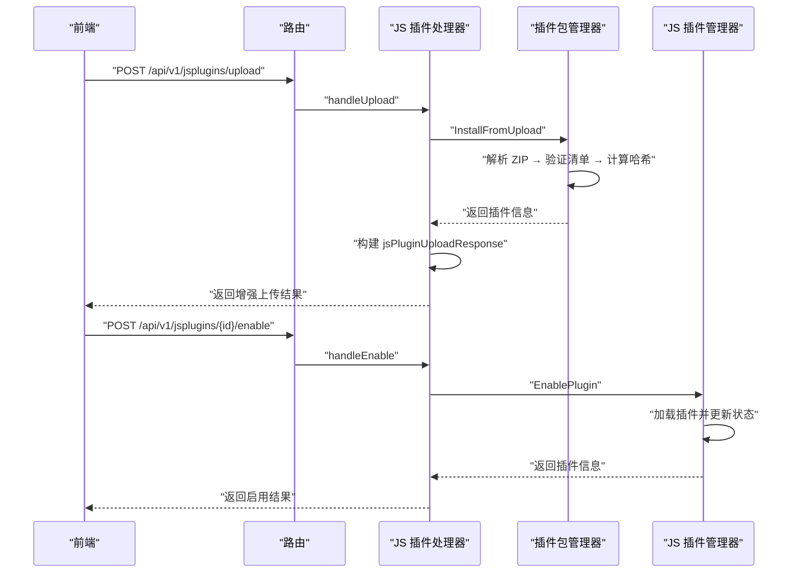
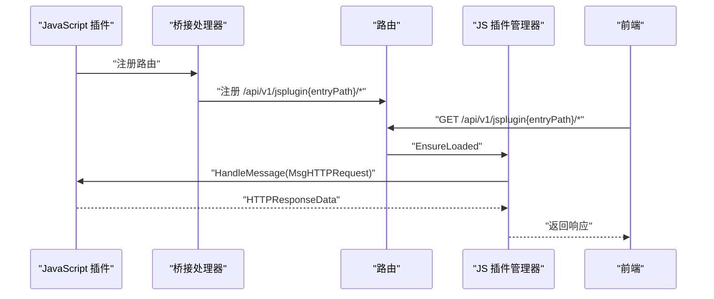
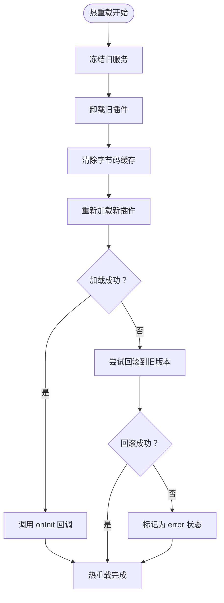
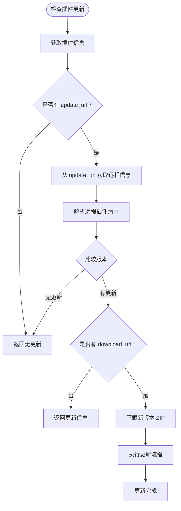
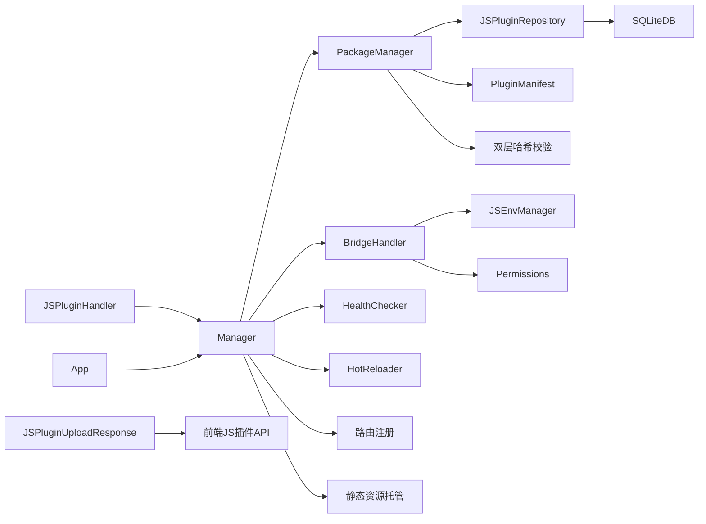

# 插件管理 API

<cite>
**本文档引用的文件**
- [internal/handlers/jsplugin.go](file://internal/handlers/jsplugin.go)
- [internal/jsplugin/manager.go](file://internal/jsplugin/manager.go)
- [internal/jsplugin/package.go](file://internal/jsplugin/package.go)
- [internal/jsplugin/service.go](file://internal/jsplugin/service.go)
- [internal/jsplugin/routes.go](file://internal/jsplugin/routes.go)
- [internal/jsplugin/permissions.go](file://internal/jsplugin/permissions.go)
- [internal/jsplugin/health.go](file://internal/jsplugin/health.go)
- [internal/jsplugin/hot_reload.go](file://internal/jsplugin/hot_reload.go)
- [internal/database/jsplugin_repository.go](file://internal/database/jsplugin_repository.go)
- [internal/models/models.go](file://internal/models/models.go)
- [internal/app/routers.go](file://internal/app/routers.go)
- [internal/app/app.go](file://internal/app/app.go)
- [internal/jsruntime/runtime.go](file://internal/jsruntime/runtime.go)
- [docs/js-plugin-development-guide.md](file://docs/js-plugin-development-guide.md)
- [frontend/lib/features/jsplugin/data/jsplugin_api.dart](file://frontend/lib/features/jsplugin/data/jsplugin_api.dart)
- [docs/swagger.yaml](file://docs/swagger.yaml)
- [go.mod](file://go.mod)
</cite>

## 更新摘要
**变更内容**
- JavaScript插件上传接口增强了响应结构，新增了jsPluginUploadResponse和jsPluginUploadResult结构，支持批量上传结果跟踪和错误报告
- 响应结构包含total、success、failed计数器和results数组，提供详细的上传状态反馈
- 单个插件上传结果包含文件名、插件信息、错误信息和成功标志
- 批量上传响应提供整体统计信息和每个文件的详细结果
- 新的系统使用不同的路由和接口，原有的WASM插件系统已被完全替换

## 目录
1. [简介](#简介)
2. [项目结构](#项目结构)
3. [核心组件](#核心组件)
4. [架构总览](#架构总览)
5. [详细组件分析](#详细组件分析)
6. [依赖分析](#依赖分析)
7. [性能考虑](#性能考虑)
8. [故障排查指南](#故障排查指南)
9. [结论](#结论)
10. [附录](#附录)

## 简介
本文件为 Songloft JavaScript 插件管理 API 的完整接口文档，覆盖插件上传（单个与批量）、插件 CRUD 操作、插件状态管理、插件路由注册、插件模型定义、JavaScript 运行时与宿主函数、以及安全与资源限制等关键能力。文档同时提供面向前端的 API 使用说明与面向插件开发者的协议规范。

**更新** 插件管理API已从WASM插件系统完全迁移到新的JavaScript插件系统。JavaScript插件系统采用.zip压缩包格式，支持.js和.jsc字节码文件，提供更丰富的插件功能和更好的性能表现。新增JSPluginHandler和完整的RESTful端点，支持插件上传、状态管理、更新检查等功能。JavaScript插件系统包含权限管理、健康检查、热重载等高级特性，提供更完善的插件生命周期管理能力。

## 项目结构
Songloft 的 JavaScript 插件系统由后端 Handler、插件管理器、JavaScript 运行时、权限管理、健康检查与热重载等核心组件组成。核心路由在应用启动时注册到 /api/v1 下，JavaScript 插件相关路由包括：
- GET /api/v1/jsplugins：列出所有 JavaScript 插件
- POST /api/v1/jsplugins/upload：上传 JavaScript 插件（.jsplugin.zip 压缩包）
- GET /api/v1/jsplugins/{id}：获取插件详情
- PUT /api/v1/jsplugins/{id}：更新插件（上传新 ZIP）
- DELETE /api/v1/jsplugins/{id}：删除插件
- POST /api/v1/jsplugins/{id}/enable：启用插件
- POST /api/v1/jsplugins/{id}/disable：禁用插件
- GET /api/v1/jsplugins/{id}/check-update：检查插件更新
- POST /api/v1/jsplugins/{id}/update：执行插件更新
- GET /api/v1/jsplugin/{entryPath}：插件静态资源访问
- GET /api/v1/jsplugin/{entryPath}/static/*：插件静态资源文件
- GET /api/v1/jsplugin/{entryPath}/*：插件API路由转发

**图表来源**
- [internal/app/routers.go:123-124](file://internal/app/routers.go#L123-L124)
- [internal/handlers/jsplugin.go:31-44](file://internal/handlers/jsplugin.go#L31-L44)
- [internal/jsplugin/manager.go:32-53](file://internal/jsplugin/manager.go#L32-L53)
- [internal/jsplugin/package.go:25-40](file://internal/jsplugin/package.go#L25-L40)
- [internal/database/jsplugin_repository.go:12-21](file://internal/database/jsplugin_repository.go#L12-L21)
- [internal/jsplugin/service.go:60-82](file://internal/jsplugin/service.go#L60-L82)
- [internal/jsruntime/runtime.go:54-800](file://internal/jsruntime/runtime.go#L54-L800)
- [internal/jsplugin/health.go:55-71](file://internal/jsplugin/health.go#L55-L71)
- [internal/jsplugin/hot_reload.go:13-24](file://internal/jsplugin/hot_reload.go#L13-L24)
- [internal/app/app.go:220-240](file://internal/app/app.go#L220-L240)

**章节来源**
- [internal/app/routers.go:115-124](file://internal/app/routers.go#L115-L124)

## 核心组件
- JS 插件处理器（JSPluginHandler）：负责接收 HTTP 请求，进行参数解析、文件验证、调用插件管理器并返回标准化响应。支持插件上传、更新、状态管理、更新检查等完整功能。
- JS 插件管理器（Manager）：负责 JavaScript 插件生命周期管理（加载/卸载/初始化/反初始化）、JS 实例管理、懒加载机制、按需加载、服务注册与注销。
- 插件包管理器（PackageManager）：负责 .jsplugin.zip 包的安装、更新、发现、远程更新检查与下载，支持双层哈希校验和规范化处理。
- 仓储层（JSPluginRepository）：封装数据库操作，提供 JavaScript 插件的增删改查与状态更新。
- 数据库（SQLite）：持久化 JavaScript 插件元数据与状态。
- JS 运行时（JSEnvManager）：进程内 JavaScript 环境管理，支持事件派发、桥接函数、字节码缓存、超时控制。
- 权限管理（Permissions）：提供细粒度权限控制，支持通配符匹配和权限验证。
- 健康检查器（HealthChecker）：监控插件运行状态，支持自动恢复、指数退避、空闲卸载等机制。
- 热重载器（HotReloader）：支持插件热更新，提供零停机更新能力。
- 桥接处理器（BridgeHandler）：实现 Go 服务与 JavaScript 插件之间的通信桥接。
- 前端 API（web/src/api/plugins.ts）：封装 JavaScript 插件管理相关请求。
- 前端 JS 插件 API（frontend/lib/features/jsplugin/data/jsplugin_api.dart）：提供增强的上传响应结构，支持批量上传结果跟踪。
- 应用启动器（App）：负责应用初始化，使用异步加载机制避免阻塞 HTTP 服务启动。

**更新** 插件管理API已从WASM插件系统完全迁移到新的JavaScript插件系统。JavaScript插件系统包含权限管理、健康检查、热重载等高级特性，提供更完善的插件生命周期管理能力。新增JSPluginHandler和完整的RESTful端点，支持插件上传、状态管理、更新检查等功能。前端JS插件API提供增强的上传响应结构，支持批量上传结果跟踪和错误报告。

**章节来源**
- [internal/handlers/jsplugin.go:15-30](file://internal/handlers/jsplugin.go#L15-L30)
- [internal/jsplugin/manager.go:32-68](file://internal/jsplugin/manager.go#L32-L68)
- [internal/jsplugin/package.go:25-40](file://internal/jsplugin/package.go#L25-L40)
- [internal/database/jsplugin_repository.go:12-21](file://internal/database/jsplugin_repository.go#L12-L21)
- [internal/jsruntime/runtime.go:54-800](file://internal/jsruntime/runtime.go#L54-L800)
- [internal/jsplugin/permissions.go:8-38](file://internal/jsplugin/permissions.go#L8-L38)
- [internal/jsplugin/health.go:55-122](file://internal/jsplugin/health.go#L55-L122)
- [internal/jsplugin/hot_reload.go:13-24](file://internal/jsplugin/hot_reload.go#L13-L24)
- [web/src/api/plugins.ts:10-54](file://web/src/api/plugins.ts#L10-L54)
- [frontend/lib/features/jsplugin/data/jsplugin_api.dart:81-139](file://frontend/lib/features/jsplugin/data/jsplugin_api.dart#L81-L139)
- [internal/app/app.go:220-240](file://internal/app/app.go#L220-L240)

## 架构总览
JavaScript 插件系统采用"HTTP 路由 + JavaScript 插件 + 权限管理 + 健康检查 + 热重载 + JS 运行时"的组合架构。前端通过 /api/v1 路由调用后端，后端通过插件管理器加载 JavaScript 插件，插件通过桥接处理器与后端交互，必要时使用 JS 运行时执行脚本。

**更新** JavaScript插件系统采用全新的架构设计，包含权限管理、健康检查、热重载等高级特性。插件上传采用.zip压缩包格式，支持.js和.jsc字节码文件，提供更好的性能和安全性。新增JSPluginHandler和完整的RESTful端点，支持插件上传、状态管理、更新检查等功能。前端JS插件API提供增强的上传响应结构，支持批量上传结果跟踪和错误报告。

**图表来源**
- [internal/app/app.go:92-129](file://internal/app/app.go#L92-L129)
- [internal/jsplugin/manager.go:92-129](file://internal/jsplugin/manager.go#L92-L129)
- [internal/jsplugin/package.go:281-374](file://internal/jsplugin/package.go#L281-L374)
- [internal/handlers/jsplugin.go:31-44](file://internal/handlers/jsplugin.go#L31-L44)
- [internal/jsplugin/manager.go:316-368](file://internal/jsplugin/manager.go#L316-L368)

## 详细组件分析

### JavaScript 插件上传接口（单个与批量）
**更新** JavaScript插件上传接口现已支持.zip压缩包格式，包含完整的哈希校验和权限验证，并提供增强的响应结构。

- 支持上传 .jsplugin.zip 压缩包格式的 JavaScript 插件。
- 文件验证：仅接受 .jsplugin.zip 格式；解析 plugin.json，验证插件清单。
- 权限验证：检查插件声明的权限是否在合法权限列表中。
- 哈希校验：验证 zip_hash 和 entry_hash，确保插件完整性。
- 增强响应结构：返回jsPluginUploadResponse和jsPluginUploadResult结构，支持批量上传结果跟踪和错误报告。
- 上传流程：
  - 解析 ZIP 文件，读取 plugin.json
  - 验证插件清单和权限
  - 计算双层哈希（zip_hash和entry_hash）
  - 保存 ZIP 到 pluginsDir
  - 解压 static/ 到 dataDir
  - 创建数据库记录，返回增强上传结果
- 安全措施：路径安全检查、哈希校验、权限验证、失败回滚。

**图表来源**
- [internal/handlers/jsplugin.go:86-119](file://internal/handlers/jsplugin.go#L86-L119)
- [internal/handlers/jsplugin.go:133-181](file://internal/handlers/jsplugin.go#L133-L181)
- [internal/jsplugin/package.go:41-143](file://internal/jsplugin/package.go#L41-L143)
- [internal/jsplugin/package.go:154-248](file://internal/jsplugin/package.go#L154-L248)

**章节来源**
- [internal/handlers/jsplugin.go:86-119](file://internal/handlers/jsplugin.go#L86-L119)
- [internal/handlers/jsplugin.go:133-181](file://internal/handlers/jsplugin.go#L133-L181)
- [internal/jsplugin/package.go:41-143](file://internal/jsplugin/package.go#L41-L143)
- [internal/jsplugin/package.go:154-248](file://internal/jsplugin/package.go#L154-L248)

### JavaScript 插件上传响应结构
**新增** JavaScript插件上传接口提供增强的响应结构，支持批量上传结果跟踪和错误报告。

- jsPluginUploadResult结构：
  - fileName：上传文件的原始文件名
  - plugin：安装成功的插件信息（可能为null）
  - error：错误信息（可能为null）
  - success：布尔值，表示上传是否成功
- jsPluginUploadResponse结构：
  - total：总上传数量
  - success：成功上传数量
  - failed：失败上传数量
  - results：JSPluginUploadResult对象数组
  - message：上传操作的总体消息
- 前端JSPluginUploadResponse类：
  - 与后端响应结构完全对齐
  - 提供fromJson工厂构造函数
  - 支持results数组的嵌套解析

**图表来源**
- [frontend/lib/features/jsplugin/data/jsplugin_api.dart:81-139](file://frontend/lib/features/jsplugin/data/jsplugin_api.dart#L81-L139)
- [internal/handlers/jsplugin.go:17-32](file://internal/handlers/jsplugin.go#L17-L32)

**章节来源**
- [frontend/lib/features/jsplugin/data/jsplugin_api.dart:81-139](file://frontend/lib/features/jsplugin/data/jsplugin_api.dart#L81-L139)
- [internal/handlers/jsplugin.go:17-32](file://internal/handlers/jsplugin.go#L17-L32)

### JavaScript 插件 CRUD 操作
- 列表：获取所有 JavaScript 插件，返回插件数组。
- 详情：根据 ID 获取插件信息。
- 上传：POST /api/v1/jsplugins/upload，上传新的 .jsplugin.zip 文件，返回增强的上传响应结构。
- 更新：PUT /api/v1/jsplugins/{id}，上传新的 ZIP 文件以更新现有插件。
- 删除：DELETE /api/v1/jsplugins/{id}，删除插件并清理相关资源。
- 启用：POST /api/v1/jsplugins/{id}/enable，启用指定的 JavaScript 插件。
- 禁用：POST /api/v1/jsplugins/{id}/disable，禁用指定的 JavaScript 插件。
- 更新检查：GET /api/v1/jsplugins/{id}/check-update，检查指定插件的远程更新。
- 执行更新：POST /api/v1/jsplugins/{id}/update，从远程下载并更新指定的 JavaScript 插件。

**图表来源**
- [internal/handlers/jsplugin.go:31-44](file://internal/handlers/jsplugin.go#L31-L44)
- [internal/handlers/jsplugin.go:86-119](file://internal/handlers/jsplugin.go#L86-L119)
- [internal/handlers/jsplugin.go:133-181](file://internal/handlers/jsplugin.go#L133-L181)
- [internal/handlers/jsplugin.go:255-297](file://internal/handlers/jsplugin.go#L255-L297)
- [internal/jsplugin/manager.go:250-276](file://internal/jsplugin/manager.go#L250-L276)

**章节来源**
- [internal/handlers/jsplugin.go:46-210](file://internal/handlers/jsplugin.go#L46-L210)
- [internal/jsplugin/manager.go:250-294](file://internal/jsplugin/manager.go#L250-L294)

### JavaScript 插件状态管理接口
- 状态枚举：active、inactive、error。
- 状态更新：启用/禁用时更新数据库状态并加载/卸载实例。
- 实例健康：通过健康检查器监控插件状态，支持自动恢复和指数退避。
- 懒加载机制：按需加载插件，支持空闲卸载和恢复加载。
- 状态转换：支持 error 状态的自动恢复和手动恢复。

**更新** JavaScript插件系统包含完整的健康检查机制，支持自动恢复、指数退避、空闲卸载等高级特性。插件状态管理更加完善，支持 error 状态的自动恢复和手动恢复。

**章节来源**
- [internal/models/models.go:452-459](file://internal/models/models.go#L452-L459)
- [internal/jsplugin/manager.go:316-368](file://internal/jsplugin/manager.go#L316-L368)
- [internal/jsplugin/health.go:160-215](file://internal/jsplugin/health.go#L160-L215)

### JavaScript 插件路由注册接口
- 插件通过桥接处理器动态注册路由，宿主自动拼接 /api/v1/jsplugin 前缀。
- 路由转发：宿主将 HTTP 请求序列化后调用插件 onHTTPRequest，插件返回响应后写回。
- 认证：支持 requireAuth，若开启则校验 Bearer Token 或 URL 查询参数 access_token。
- 路由清理：卸载插件时清除其注册的所有路由。
- 静态资源：支持插件静态资源托管，包括 HTML、CSS、JS 等文件。
- SPA 支持：支持单页应用的路由回退到 index.html。

**图表来源**
- [internal/jsplugin/routes.go:46-59](file://internal/jsplugin/routes.go#L46-L59)
- [internal/jsplugin/routes.go:102-146](file://internal/jsplugin/routes.go#L102-L146)
- [internal/jsplugin/service.go:370-424](file://internal/jsplugin/service.go#L370-L424)

**章节来源**
- [internal/jsplugin/routes.go:46-146](file://internal/jsplugin/routes.go#L46-L146)
- [internal/jsplugin/service.go:370-424](file://internal/jsplugin/service.go#L370-L424)

### JavaScript 插件模型定义
- 插件模型包含名称、版本、描述、作者、主页、许可证、入口路径、主文件、最小宿主版本、权限、更新URL、下载URL、状态、哈希值、文件路径等字段。
- 响应模型包含插件信息与上传结果列表，支持批量上传统计。
- 权限模型：支持存储、歌曲、歌单、插件间通信、命令执行、JS环境等权限。
- 更新信息模型：包含当前版本、最新版本、是否有更新、下载地址、变更日志等。
- 插件清单模型：对应 plugin.json 文件结构，包含必填字段和验证规则。

**章节来源**
- [internal/models/models.go:461-483](file://internal/models/models.go#L461-L483)
- [internal/jsplugin/plugin.go:23-46](file://internal/jsplugin/plugin.go#L23-L46)
- [internal/jsplugin/permissions.go:8-38](file://internal/jsplugin/permissions.go#L8-L38)

### JavaScript 运行时管理与桥接函数
- JavaScript 加载：使用内置的 JavaScript 运行时，支持字节码缓存和源码模式。
- 桥接能力：
  - 路由调用：CallRouter，支持 GET/HEAD/POST/PUT/DELETE，自动注入插件专用 JWT。
  - 定时器：RegisterDelayTimer/CancelDelayTimer，支持超时回调。
  - 路由注册：RegisterRouter，自动拼接 /api/v1/jsplugin 前缀。
  - 数据访问：songloft.storage/songs/playlists 等 API 访问 Go 服务。
  - JS 环境：CreateJSEnv/ExecuteJS/DestroyJSEnv，支持事件派发与桥接函数。
- 超时控制：插件初始化/回调/反初始化/关闭均有超时保护，防止阻塞。
- 字节码缓存：支持 .jsc 字节码文件，提升加载性能。
- 单页应用支持：自动处理 SPA 路由回退到 index.html。

**更新** JavaScript插件系统采用全新的运行时架构，支持字节码缓存、源码模式、单页应用支持等特性。新增桥接处理器实现 Go 服务与 JavaScript 插件之间的通信桥接。

**章节来源**
- [internal/jsplugin/service.go:84-214](file://internal/jsplugin/service.go#L84-L214)
- [internal/jsplugin/service.go:216-292](file://internal/jsplugin/service.go#L216-L292)
- [internal/jsplugin/service.go:370-424](file://internal/jsplugin/service.go#L370-L424)
- [internal/jsplugin/routes.go:351-430](file://internal/jsplugin/routes.go#L351-L430)
- [internal/jsruntime/runtime.go:71-126](file://internal/jsruntime/runtime.go#L71-L126)

### JavaScript 插件间通信与安全沙箱
- 插件间通信：通过桥接处理器调用宿主或其他插件路由，实现跨插件调用。
- 权限控制：支持细粒度权限管理，包括存储、歌曲、歌单、插件间通信、命令执行、JS环境等权限。
- 安全沙箱：JS 运行时隔离、路径安全检查、超时中断、健康状态标记、路由认证开关。
- 资源限制：JS 执行超时、定时器与事件队列容量限制、字节码缓存管理。
- 版本兼容性：插件清单包含版本字段，便于后续兼容性判断与升级策略。
- 故障隔离：不健康实例跳过 Deinit、卸载时清理路由与 JS 环境、异常捕获与日志记录。

**更新** JavaScript插件系统包含完整的权限管理机制，支持细粒度权限控制和通配符匹配。新增健康检查器提供故障隔离和自动恢复能力。

**章节来源**
- [internal/jsplugin/permissions.go:8-70](file://internal/jsplugin/permissions.go#L8-L70)
- [internal/jsplugin/service.go:426-476](file://internal/jsplugin/service.go#L426-L476)
- [internal/jsplugin/health.go:248-292](file://internal/jsplugin/health.go#L248-L292)

### JavaScript 插件热重载与健康检查
**新增** JavaScript 插件系统包含完整的热重载和健康检查机制。

- 热重载机制：
  - 冻结消息：在热重载期间冻结旧服务，停止接收新消息
  - 卸载旧插件：调用 onDeinit 回调，销毁旧 JS VM
  - 重新加载：从 ZIP 重新加载插件，创建新 VM
  - 解冻恢复：调用 onInit 回调，恢复服务
  - 错误回滚：如果新版本加载失败，尝试恢复旧版本
- 健康检查机制：
  - 定期检查：默认 60 秒检查一次插件健康状态
  - 空闲卸载：超过 10 分钟空闲自动卸载释放资源
  - 自动恢复：error 状态插件按指数退避自动恢复
  - 连续失败：超过 3 次失败标记为 error 状态并禁用插件
- 监控机制：
  - 文件监控：每 30 秒检查 ZIP 文件修改时间变化
  - VM 探针：直接对 JS 运行时做健康检查，避免队列阻塞
  - Busy 状态：连续 5 分钟 Busy 视为不健康

**图表来源**
- [internal/jsplugin/hot_reload.go:26-89](file://internal/jsplugin/hot_reload.go#L26-L89)
- [internal/jsplugin/health.go:160-215](file://internal/jsplugin/health.go#L160-L215)
- [internal/jsplugin/health.go:328-396](file://internal/jsplugin/health.go#L328-L396)

**章节来源**
- [internal/jsplugin/hot_reload.go:26-89](file://internal/jsplugin/hot_reload.go#L26-L89)
- [internal/jsplugin/hot_reload.go:106-151](file://internal/jsplugin/hot_reload.go#L106-L151)
- [internal/jsplugin/health.go:160-215](file://internal/jsplugin/health.go#L160-L215)
- [internal/jsplugin/health.go:328-396](file://internal/jsplugin/health.go#L328-L396)

### JavaScript 插件远程更新机制
**新增** JavaScript 插件系统包含完整的远程更新机制。

- 更新检查：
  - 通过 plugin.json 中的 update_url 或 download_url 获取远程信息
  - 比较当前版本与远程版本，判断是否有更新
  - 支持下载地址和变更日志信息
- 远程下载：
  - 从远程下载新版本 ZIP 文件
  - 自动执行更新流程，包括哈希校验和状态保持
  - 支持超时控制（60 秒）
- 更新流程：
  1. 检查更新信息
  2. 下载新 ZIP 文件
  3. 验证新插件文件
  4. 记录插件之前的状态
  5. 如之前启用则禁用旧插件
  6. 覆盖旧 ZIP 文件
  7. 更新数据库中的插件信息
  8. 如之前是启用状态则重新启用

**图表来源**
- [internal/jsplugin/package.go:376-427](file://internal/jsplugin/package.go#L376-L427)
- [internal/jsplugin/package.go:429-465](file://internal/jsplugin/package.go#L429-L465)

**章节来源**
- [internal/jsplugin/package.go:376-427](file://internal/jsplugin/package.go#L376-L427)
- [internal/jsplugin/package.go:429-465](file://internal/jsplugin/package.go#L429-L465)

## 依赖分析
- Handler 依赖 Manager；Manager 依赖 PackageManager 与数据库；BridgeHandler 依赖 Manager 与 JS 运行时。
- 插件清单（plugin.json）定义了 JavaScript 插件与宿主之间的协议，包括名称、版本、入口路径、权限等。
- 应用启动器依赖插件管理器，使用异步加载机制提升启动性能。
- 权限管理依赖插件权限声明和验证机制。
- 健康检查依赖 JS 运行时健康探针和指数退避算法。
- 热重载依赖插件状态管理和错误回滚机制。
- JS 运行时依赖内置的 JavaScript 引擎和字节码缓存。
- 前端JS插件API依赖增强的上传响应结构，提供更好的用户体验。

**更新** JavaScript插件系统包含完整的依赖关系，从 Handler 到 Manager，再到 PackageManager 和数据库层。新增权限管理、健康检查、热重载等依赖模块，形成完整的插件生态系统。前端JS插件API提供增强的上传响应结构，支持批量上传结果跟踪和错误报告。

**图表来源**
- [internal/handlers/jsplugin.go:22-30](file://internal/handlers/jsplugin.go#L22-L30)
- [internal/jsplugin/manager.go:55-68](file://internal/jsplugin/manager.go#L55-L68)
- [internal/jsplugin/package.go:32-40](file://internal/jsplugin/package.go#L32-L40)
- [internal/database/jsplugin_repository.go:17-21](file://internal/database/jsplugin_repository.go#L17-L21)
- [internal/jsplugin/permissions.go:8-38](file://internal/jsplugin/permissions.go#L8-L38)
- [internal/jsplugin/health.go:104-122](file://internal/jsplugin/health.go#L104-L122)
- [internal/jsplugin/hot_reload.go:19-24](file://internal/jsplugin/hot_reload.go#L19-L24)
- [frontend/lib/features/jsplugin/data/jsplugin_api.dart:109-139](file://frontend/lib/features/jsplugin/data/jsplugin_api.dart#L109-L139)

**章节来源**
- [internal/jsplugin/plugin.go:23-46](file://internal/jsplugin/plugin.go#L23-L46)

## 性能考虑
- JavaScript 执行超时与上下文取消：通过超时控制避免长时间阻塞。
- 字节码缓存：支持 .jsc 字节码文件，提升加载性能，避免重复编译。
- 源码模式：首次加载时编译并缓存字节码，后续加载直接使用缓存。
- 定时器与事件：事件通道容量有限，注意事件消费节奏，避免阻塞。
- 路由回调并发：通过互斥锁保护 JS 环境，避免并发访问导致栈溢出。
- 压缩传输：后端启用 gzip 压缩，减少传输体积。
- 懒加载性能：按需加载插件，支持空闲卸载释放资源。
- 健康检查优化：直接对 JS 运行时做健康检查，避免队列阻塞。
- 热重载优化：冻结消息期间停止接收新消息，避免状态不一致。
- 文件监控：使用轮询机制检查文件变化，避免频繁系统调用。
- 增强响应结构：jsPluginUploadResponse提供批量上传统计，减少前端处理复杂度。

**更新** JavaScript插件系统包含多项性能优化措施，包括字节码缓存、懒加载、健康检查优化、热重载优化等。新增源码模式和字节码缓存机制，显著提升插件加载性能。增强的上传响应结构提供批量上传统计，减少前端处理复杂度。

**章节来源**
- [internal/jsplugin/service.go:144-214](file://internal/jsplugin/service.go#L144-L214)
- [internal/jsplugin/health.go:217-246](file://internal/jsplugin/health.go#L217-L246)
- [internal/jsplugin/hot_reload.go:26-89](file://internal/jsplugin/hot_reload.go#L26-L89)
- [internal/handlers/jsplugin.go:133-181](file://internal/handlers/jsplugin.go#L133-L181)

## 故障排查指南
- 上传失败：检查 .jsplugin.zip 格式、磁盘空间、权限；查看哈希校验和权限验证错误；确认获取插件清单失败后的回滚逻辑。
- 启用失败：查看初始化超时、JS 环境创建错误、健康状态标记；确认 Deinit 与实例清理。
- 路由不可用：确认路由前缀拼接、认证开关、Token 校验；检查路由是否被禁用。
- JS 执行异常：检查超时设置、事件通道满载、桥接函数参数；查看日志与错误返回。
- 数据库异常：确认 SQL 语句、事务一致性、唯一约束冲突。
- 权限验证失败：检查插件声明的权限是否在合法权限列表中；确认权限通配符匹配。
- 健康检查异常：检查 JS 运行时健康探针、指数退避算法、空闲卸载机制。
- 热重载失败：检查冻结消息、卸载旧插件、重新加载新插件流程；确认错误回滚机制。
- 远程更新失败：检查 update_url 配置、网络连接、远程版本信息获取；确认下载超时设置。
- 静态资源访问失败：检查 static 目录存在性、路径穿越防护、SPA 回退机制。
- 字节码缓存问题：检查缓存文件完整性、哈希验证、重新编译机制。
- 错误日志问题：检查 slog 日志输出配置，确认日志级别设置是否正确。
- 增强响应结构问题：检查 jsPluginUploadResponse 和 jsPluginUploadResult 的字段映射；确认前端解析逻辑。

**更新** JavaScript插件系统包含完整的故障排查指导，涵盖上传、启用、路由、JS执行、数据库、权限验证、健康检查、热重载、远程更新、静态资源访问、字节码缓存等多个方面的问题排查。新增增强响应结构的故障排查指导，帮助开发者更好地处理批量上传结果。

**章节来源**
- [internal/handlers/jsplugin.go:86-119](file://internal/handlers/jsplugin.go#L86-L119)
- [internal/jsplugin/package.go:41-143](file://internal/jsplugin/package.go#L41-L143)
- [internal/jsplugin/permissions.go:57-69](file://internal/jsplugin/permissions.go#L57-L69)
- [internal/jsplugin/health.go:248-292](file://internal/jsplugin/health.go#L248-L292)
- [internal/jsplugin/hot_reload.go:72-89](file://internal/jsplugin/hot_reload.go#L72-L89)
- [internal/jsplugin/routes.go:194-248](file://internal/jsplugin/routes.go#L194-L248)
- [frontend/lib/features/jsplugin/data/jsplugin_api.dart:109-139](file://frontend/lib/features/jsplugin/data/jsplugin_api.dart#L109-L139)

## 结论
Songloft JavaScript 插件管理 API 提供了完善的 JavaScript 插件生命周期管理、安全的 JavaScript 执行环境、灵活的路由与定时器机制，以及进程内 JS 运行时支持。通过标准化的协议与严格的超时与安全控制，系统在保证稳定性的同时，为插件开发者提供了丰富的扩展能力。

**更新** JavaScript插件系统已完全替代WASM插件系统，提供更强大的功能和更好的性能表现。系统包含权限管理、健康检查、热重载、远程更新、静态资源托管等高级特性，形成完整的插件生态系统。新增JSPluginHandler和完整的RESTful端点，支持插件上传、状态管理、更新检查等功能。JavaScript插件系统采用.zip压缩包格式，支持.js和.jsc字节码文件，提供更好的性能和安全性。前端JS插件API提供增强的上传响应结构，支持批量上传结果跟踪和错误报告，显著提升用户体验。

## 附录

### JavaScript 插件 API 使用示例
- 列表：GET /api/v1/jsplugins
- 详情：GET /api/v1/jsplugins/{id}
- 上传：POST /api/v1/jsplugins/upload（multipart/form-data，字段 file）
- 更新：PUT /api/v1/jsplugins/{id}
- 删除：DELETE /api/v1/jsplugins/{id}
- 启用：POST /api/v1/jsplugins/{id}/enable
- 禁用：POST /api/v1/jsplugins/{id}/disable
- 检查更新：GET /api/v1/jsplugins/{id}/check-update
- 执行更新：POST /api/v1/jsplugins/{id}/update
- 插件静态资源：GET /api/v1/jsplugin/{entryPath}
- 插件静态文件：GET /api/v1/jsplugin/{entryPath}/static/*
- 插件API路由：GET /api/v1/jsplugin/{entryPath}/*

**章节来源**
- [web/src/api/plugins.ts:10-54](file://web/src/api/plugins.ts#L10-L54)
- [frontend/lib/features/settings/data/plugin_api.dart:221-265](file://frontend/lib/features/settings/data/plugin_api.dart#L221-L265)
- [frontend/lib/features/jsplugin/data/jsplugin_api.dart:171-313](file://frontend/lib/features/jsplugin/data/jsplugin_api.dart#L171-L313)

### JavaScript 插件开发规范要点
- 构建格式：必须使用 .jsplugin.zip 压缩包格式。
- 清单文件：必须包含 plugin.json，包含 name、version、entryPath、main、permissions 等字段。
- 权限声明：必须在 plugin.json 中声明所需权限，支持通配符匹配。
- 入口文件：main 字段必须指向 .js 或 .jsc 文件，支持字节码文件。
- 哈希校验：必须提供正确的 entryHash 和 zipHash，用于完整性验证。
- 路由前缀：插件注册使用 entryPath，前端访问需加上 /api/v1/jsplugin/ 前缀。
- 认证：路由注册时可设置 requireAuth，API 接口通常需要认证。
- 并发：插件环境不支持 goroutine，后台任务使用定时器实现。
- 静态资源：支持 HTML、CSS、JS 等静态资源托管，支持 SPA 路由回退。
- 错误处理：插件应提供详细的错误日志记录，便于故障排查和系统监控。
- 增强响应结构：前端JS插件API提供增强的上传响应结构，支持批量上传结果跟踪和错误报告。

**更新** JavaScript插件开发规范包含完整的清单文件要求、权限声明、哈希校验、静态资源托管等规范。新增字节码文件支持和 SPA 路由回退机制，为插件开发者提供更丰富的功能支持。前端JS插件API提供增强的上传响应结构，支持批量上传结果跟踪和错误报告，提升开发体验。

**章节来源**
- [docs/js-plugin-development-guide.md:25-35](file://docs/js-plugin-development-guide.md#L25-L35)
- [docs/js-plugin-development-guide.md:37-67](file://docs/js-plugin-development-guide.md#L37-L67)
- [internal/jsplugin/plugin.go:23-107](file://internal/jsplugin/plugin.go#L23-L107)
- [internal/jsplugin/permissions.go:8-38](file://internal/jsplugin/permissions.go#L8-L38)
- [internal/jsplugin/routes.go:301-349](file://internal/jsplugin/routes.go#L301-L349)
- [frontend/lib/features/jsplugin/data/jsplugin_api.dart:109-139](file://frontend/lib/features/jsplugin/data/jsplugin_api.dart#L109-L139)