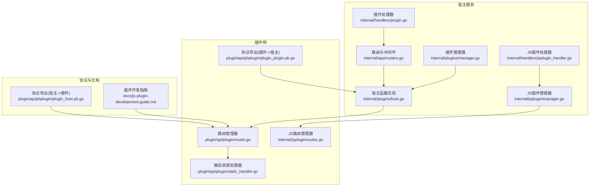
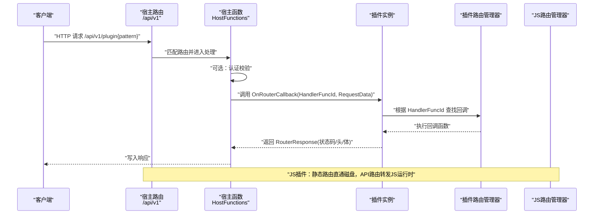
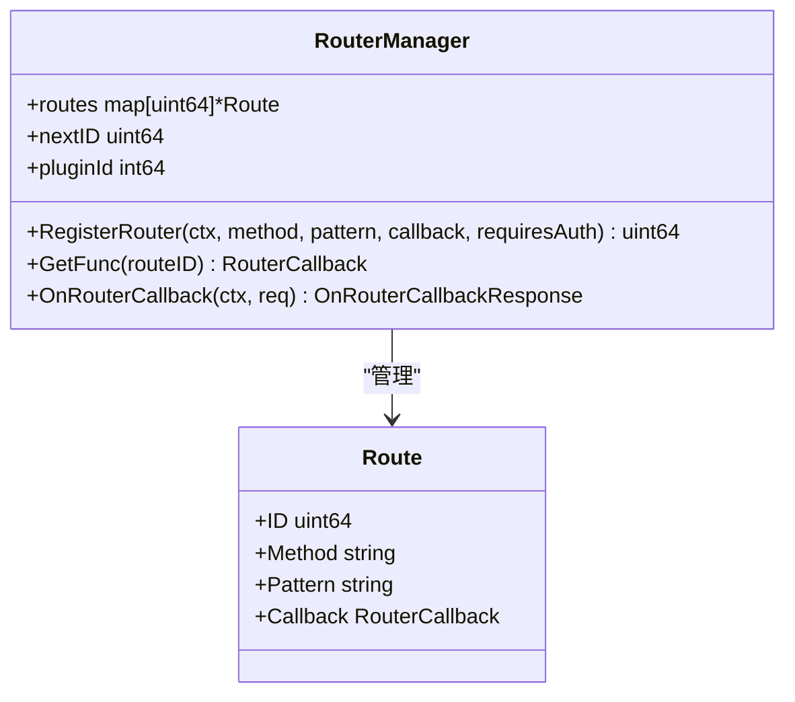
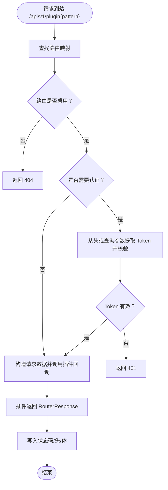
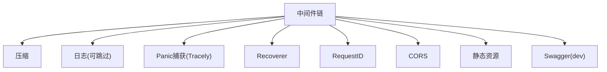
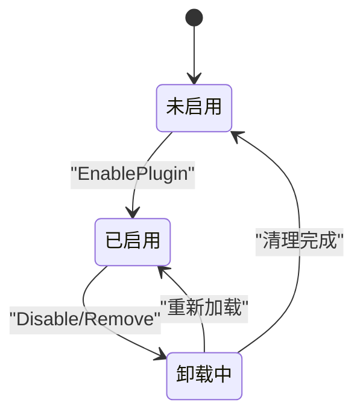
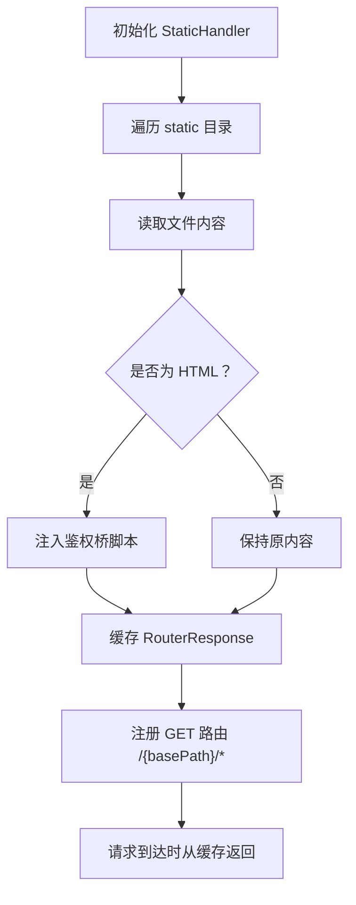
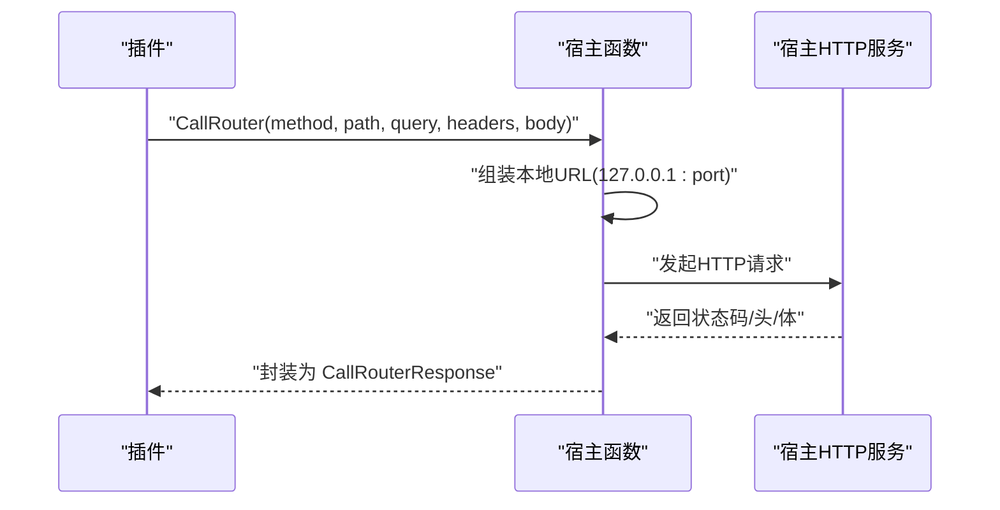
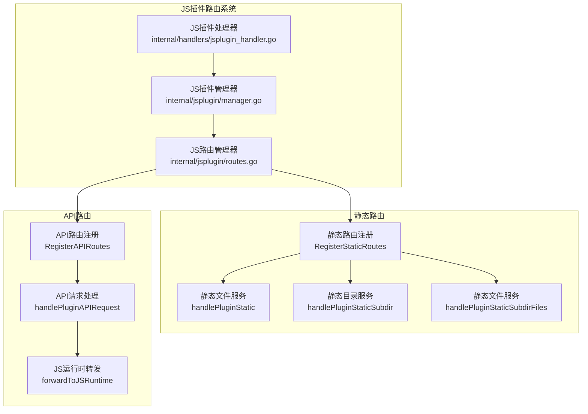
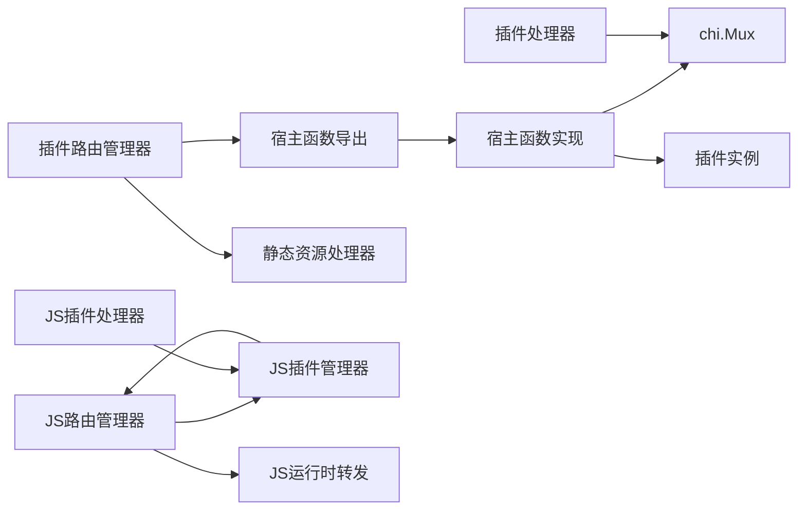

# 插件路由注册

<cite>
**本文引用的文件**
- [internal/app/routers.go](file://internal/app/routers.go)
- [internal/app/router_dev.go](file://internal/app/router_dev.go)
- [internal/app/router_prod.go](file://internal/app/router_prod.go)
- [internal/plugins/manager.go](file://internal/plugins/manager.go)
- [internal/plugins/host.go](file://internal/plugins/host.go)
- [internal/handlers/plugin.go](file://internal/handlers/plugin.go)
- [plugin/api/plugin/router.go](file://plugin/api/plugin/router.go)
- [plugin/api/plugin/static_handler.go](file://plugin/api/plugin/static_handler.go)
- [plugin/api/pbplugin/plugin_host.pb.go](file://plugin/api/pbplugin/plugin_host.pb.go)
- [plugin/api/pbplugin/plugin_plugin.pb.go](file://plugin/api/pbplugin/plugin_plugin.pb.go)
- [docs/js-plugin-development-guide.md](file://docs/js-plugin-development-guide.md)
- [internal/jsplugin/routes.go](file://internal/jsplugin/routes.go)
- [internal/jsplugin/manager.go](file://internal/jsplugin/manager.go)
- [internal/handlers/jsplugin_handler.go](file://internal/handlers/jsplugin_handler.go)
- [internal/jsplugin/package.go](file://internal/jsplugin/package.go)
</cite>

## 更新摘要
**变更内容**
- 新增 JavaScript 插件路由系统架构分析
- 更新静态路由和 API 路由分离处理机制
- 增强路由处理逻辑和性能优化策略
- 添加 JS 插件静态资源直通服务机制
- 完善跨插件通信协议和安全控制

## 目录
1. [简介](#简介)
2. [项目结构](#项目结构)
3. [核心组件](#核心组件)
4. [架构总览](#架构总览)
5. [详细组件分析](#详细组件分析)
6. [JavaScript 插件路由系统](#javascript-插件路由系统)
7. [依赖分析](#依赖分析)
8. [性能考量](#性能考量)
9. [故障排查指南](#故障排查指南)
10. [结论](#结论)
11. [附录](#附录)

## 简介
本文件面向 Songloft 插件系统的路由注册与运行机制，系统性阐述以下主题：
- 动态路由注册：插件如何向宿主注册路由，并由宿主统一调度。
- URL 模式匹配与请求分发：宿主如何将请求路由到对应插件回调。
- RESTful API、静态资源与跨插件调用：三类路由形态的设计与实现要点。
- 路由冲突检测与解决：命名空间隔离、前缀规则与优先级管理。
- 跨插件通信协议：插件通过宿主发起 HTTP 调用，参数传递与响应处理。
- 安全控制：认证要求、Token 校验与访问限制策略。
- JavaScript 插件路由系统：静态路由和 API 路由分离处理，增强的路由处理逻辑。
- 示例、最佳实践与故障排查。

## 项目结构
围绕路由注册与运行的关键目录与文件：
- 宿主路由与中间件：internal/app/routers.go、internal/app/router_dev.go、internal/app/router_prod.go
- 插件管理与宿主函数：internal/plugins/manager.go、internal/plugins/host.go
- 插件侧路由与静态资源：plugin/api/plugin/router.go、plugin/api/plugin/static_handler.go
- JavaScript 插件路由系统：internal/jsplugin/routes.go、internal/jsplugin/manager.go
- 插件与宿主交互协议：plugin/api/pbplugin/plugin_host.pb.go、plugin/api/pbplugin/plugin_plugin.pb.go
- 插件开发指南与示例：docs/js-plugin-development-guide.md

**图表来源**
- [internal/app/routers.go:20-116](file://internal/app/routers.go#L20-L116)
- [internal/plugins/manager.go:138-156](file://internal/plugins/manager.go#L138-L156)
- [internal/plugins/host.go:23-38](file://internal/plugins/host.go#L23-L38)
- [plugin/api/plugin/router.go:26-80](file://plugin/api/plugin/router.go#L26-L80)
- [plugin/api/plugin/static_handler.go:57-150](file://plugin/api/plugin/static_handler.go#L57-L150)
- [internal/jsplugin/routes.go:20-49](file://internal/jsplugin/routes.go#L20-L49)
- [internal/jsplugin/manager.go:19-37](file://internal/jsplugin/manager.go#L19-L37)
- [plugin/api/pbplugin/plugin_host.pb.go:651-753](file://plugin/api/pbplugin/plugin_host.pb.go#L651-L753)
- [plugin/api/pbplugin/plugin_plugin.pb.go:95-141](file://plugin/api/pbplugin/plugin_plugin.pb.go#L95-L141)

## 核心组件
- 路由管理器（插件侧）：负责注册路由、回调函数映射与回调执行。
- 宿主路由与中间件：提供全局中间件链、CORS、静态资源与 Swagger 路由。
- 宿主函数（HostFunctions）：实现插件与宿主之间的桥接，包括路由注册、认证校验、跨插件 HTTP 调用、定时器与 JS 环境管理。
- 插件管理器：加载/卸载插件实例、生命周期管理、资源清理。
- 插件处理器：对外暴露插件管理的 RESTful API。
- JavaScript 插件路由系统：实现静态路由和 API 路由分离处理，提供静态资源直通服务。

**章节来源**
- [plugin/api/plugin/router.go:26-80](file://plugin/api/plugin/router.go#L26-L80)
- [internal/app/routers.go:136-248](file://internal/app/routers.go#L136-L248)
- [internal/plugins/host.go:23-38](file://internal/plugins/host.go#L23-L38)
- [internal/plugins/manager.go:34-71](file://internal/plugins/manager.go#L34-L71)
- [internal/handlers/plugin.go:21-33](file://internal/handlers/plugin.go#L21-L33)
- [internal/jsplugin/routes.go:20-49](file://internal/jsplugin/routes.go#L20-L49)

## 架构总览
Songloft 的插件路由采用"插件注册 + 宿主分发"的双层架构：
- 插件侧：通过路由管理器注册路由，声明是否需要认证；静态资源由静态处理器自动扫描并注册。
- 宿主侧：将插件注册的路由统一挂载到 /api/v1/plugin 前缀下，按方法与模式进行匹配；对需要认证的路由执行 Token 校验；将请求转发至插件回调，插件返回状态码、头与响应体。
- JavaScript 插件：采用静态路由和 API 路由分离架构，静态资源由宿主直接从磁盘提供，API 路由通过 JS 运行时处理。

**图表来源**
- [internal/plugins/host.go:217-310](file://internal/plugins/host.go#L217-L310)
- [plugin/api/plugin/router.go:82-129](file://plugin/api/plugin/router.go#L82-L129)
- [internal/app/routers.go:40-115](file://internal/app/routers.go#L40-L115)
- [internal/jsplugin/routes.go:92-135](file://internal/jsplugin/routes.go#L92-L135)

## 详细组件分析

### 插件路由管理器（RouterManager）
- 职责：维护插件内部路由 ID 到回调函数的映射；注册路由并通知宿主；按需执行回调。
- 关键点：
  - 注册路由时可声明是否需要认证（默认需要）。
  - 通过宿主函数将路由注册到 /api/v1/plugin 前缀下。
  - 回调执行时，将 HTTP 请求序列化后传递给插件。

**图表来源**
- [plugin/api/plugin/router.go:26-80](file://plugin/api/plugin/router.go#L26-L80)
- [plugin/api/plugin/router.go:91-129](file://plugin/api/plugin/router.go#L91-L129)

**章节来源**
- [plugin/api/plugin/router.go:26-80](file://plugin/api/plugin/router.go#L26-L80)
- [plugin/api/plugin/router.go:91-129](file://plugin/api/plugin/router.go#L91-L129)

### 宿主函数与路由注册（HostFunctions）
- 职责：接收插件注册请求，将路由挂载到 chi.Mux；在请求到来时执行认证校验与回调分发。
- 关键点：
  - 路由前缀统一为 /api/v1/plugin，方法支持 GET/POST/PUT/DELETE。
  - 认证校验优先从 Authorization 头获取 Bearer Token，其次从 URL 查询参数 access_token 获取。
  - 回调超时控制，WASM 执行超时通过上下文与 CloseOnContextDone 机制保障。
  - 提供 ClearPluginRoutes 清理插件路由，避免残留。

**图表来源**
- [internal/plugins/host.go:156-197](file://internal/plugins/host.go#L156-L197)
- [internal/plugins/host.go:217-310](file://internal/plugins/host.go#L217-L310)

**章节来源**
- [internal/plugins/host.go:156-197](file://internal/plugins/host.go#L156-L197)
- [internal/plugins/host.go:217-310](file://internal/plugins/host.go#L217-L310)

### 宿主路由与中间件（基础路由）
- 职责：全局中间件链、CORS、静态资源与 Swagger 路由。
- 关键点：
  - 压缩中间件对 JS/WASM/CSS/JSON 等资源启用压缩。
  - 自定义日志中间件可对特定路径跳过记录。
  - Recoverer、RequestID、Tracely Panic 捕获中间件保证稳定性。
  - CORS 允许本地、局域网与特定域名来源。
  - Swagger 路由在 dev 构建下注册，在 prod 下空实现。

**图表来源**
- [internal/app/routers.go:136-248](file://internal/app/routers.go#L136-L248)
- [internal/app/router_dev.go:13-18](file://internal/app/router_dev.go#L13-L18)
- [internal/app/router_prod.go:6-9](file://internal/app/router_prod.go#L6-L9)

**章节来源**
- [internal/app/routers.go:136-248](file://internal/app/routers.go#L136-L248)
- [internal/app/router_dev.go:13-18](file://internal/app/router_dev.go#L13-L18)
- [internal/app/router_prod.go:6-9](file://internal/app/router_prod.go#L6-L9)

### 插件管理器与生命周期
- 职责：加载/卸载插件实例、初始化/反初始化、定时器与资源清理。
- 关键点：
  - 插件实例健康状态原子标记，异常时跳过 Deinit。
  - 卸载时调用宿主 ClearPluginRoutes 清理插件路由。
  - JS 环境管理器按插件隔离，支持创建/销毁/等待事件执行。

**图表来源**
- [internal/plugins/manager.go:391-451](file://internal/plugins/manager.go#L391-L451)
- [internal/plugins/manager.go:488-524](file://internal/plugins/manager.go#L488-L524)
- [internal/plugins/manager.go:86-135](file://internal/plugins/manager.go#L86-L135)

**章节来源**
- [internal/plugins/manager.go:391-451](file://internal/plugins/manager.go#L391-L451)
- [internal/plugins/manager.go:488-524](file://internal/plugins/manager.go#L488-L524)
- [internal/plugins/manager.go:86-135](file://internal/plugins/manager.go#L86-L135)

### 静态资源路由（插件侧）
- 职责：自动扫描 static 目录，预加载文件到内存，注册 GET 路由，注入鉴权桥脚本到 HTML。
- 关键点：
  - 自动识别 Content-Type，支持 CSS/JS/JSON/字体/图片等。
  - index.html 映射到插件基础路径；其他文件映射到 basePath/static/...。
  - 对 HTML 注入 auth-bridge 脚本，从 URL 查询参数读取 access_token 并写入 localStorage。

**图表来源**
- [plugin/api/plugin/static_handler.go:57-150](file://plugin/api/plugin/static_handler.go#L57-L150)
- [plugin/api/plugin/static_handler.go:178-196](file://plugin/api/plugin/static_handler.go#L178-L196)

**章节来源**
- [plugin/api/plugin/static_handler.go:57-150](file://plugin/api/plugin/static_handler.go#L57-L150)
- [plugin/api/plugin/static_handler.go:178-196](file://plugin/api/plugin/static_handler.go#L178-L196)

### 跨插件调用协议（插件 -> 宿主）
- 职责：插件通过宿主函数发起 HTTP 请求到宿主内部路由，实现跨插件调用。
- 关键点：
  - 插件设置 Authorization: Bearer {插件专用 JWT Token}。
  - 宿主根据端口构造本地 URL，转发请求并返回响应。
  - 超时控制与错误处理标准化。

**图表来源**
- [internal/plugins/host.go:40-138](file://internal/plugins/host.go#L40-L138)

**章节来源**
- [internal/plugins/host.go:40-138](file://internal/plugins/host.go#L40-L138)

## JavaScript 插件路由系统

### JS 插件路由架构
JavaScript 插件路由系统采用静态路由和 API 路由分离的架构设计，实现了高性能的静态资源服务和灵活的 API 路由处理。

**图表来源**
- [internal/jsplugin/routes.go:20-49](file://internal/jsplugin/routes.go#L20-L49)
- [internal/jsplugin/routes.go:58-90](file://internal/jsplugin/routes.go#L58-L90)
- [internal/jsplugin/routes.go:92-135](file://internal/jsplugin/routes.go#L92-L135)

### 静态路由处理机制
JS 插件的静态路由处理完全由宿主直接从磁盘提供，不依赖 JS 运行时，确保即使插件初始化期间也能正常访问静态资源。

- **路由结构**：
  - GET /api/v1/jsplugin/{entryPath} → 直接服务 index.html（注入 <base> 标签）
  - GET /api/v1/jsplugin/{entryPath}/ → 同上（带尾斜杠）
  - GET /api/v1/jsplugin/{entryPath}/static → 静态目录根（服务 index.html）
  - GET /api/v1/jsplugin/{entryPath}/static/* → 静态资源文件

- **关键特性**：
  - 静态文件服务不依赖插件 JS 运行时是否就绪
  - 支持 SPA fallback：未命中的路由回退到 index.html
  - HTML 文件注入 <base> 标签和 auth-bridge 脚本
  - 强缓存策略：其他资源强缓存，HTML 文件 no-cache

**章节来源**
- [internal/jsplugin/routes.go:20-49](file://internal/jsplugin/routes.go#L20-L49)
- [internal/jsplugin/routes.go:58-90](file://internal/jsplugin/routes.go#L58-L90)
- [internal/jsplugin/routes.go:137-191](file://internal/jsplugin/routes.go#L137-L191)

### API 路由处理机制
JS 插件的 API 路由采用 catch-all 模式，通过 chi 的路由优先级机制确保静态路由优先匹配，API 路由仅处理非静态请求。

- **路由结构**：
  - HandleFunc /api/v1/jsplugin/{entryPath}/* → catch-all，处理 API 转发

- **分发逻辑**：
  1. 子路径为空（尾部斜杠）→ 服务 static/index.html
  2. 子路径以 "static/" 开头或等于 "static" → 静态文件直通（POST/PUT 等非 GET 方法的兜底）
  3. 其他子路径 → 转发到 JS 运行时处理（API 路由）

- **安全与性能**：
  - 非 GET 方法访问 static/ 路径时的安全处理
  - JS 运行时存在性检查，避免未就绪的服务
  - 路径规范化：确保始终带前导斜杠

**章节来源**
- [internal/jsplugin/routes.go:36-49](file://internal/jsplugin/routes.go#L36-L49)
- [internal/jsplugin/routes.go:92-135](file://internal/jsplugin/routes.go#L92-L135)
- [internal/jsplugin/routes.go:294-352](file://internal/jsplugin/routes.go#L294-L352)

### JS 插件管理器
JS 插件管理器负责 JS 插件的生命周期管理、服务注册和路由处理。

- **核心功能**：
  - 插件加载与卸载：创建 JSService、加载插件、初始化服务
  - 服务注册：在 scheduler 中注册 JS 运行时服务
  - 路由注册：注册静态路由和 API 路由
  - 热重载：监控插件文件变化，自动重载插件

- **关键流程**：
  - Start：启动健康检查和热重载监控
  - LoadPlugin：创建服务、加载插件、注册服务
  - UnloadPlugin：注销服务、停止服务、清理资源
  - ReloadPlugin：卸载 + 清除字节码缓存 + 重新加载

**章节来源**
- [internal/jsplugin/manager.go:19-37](file://internal/jsplugin/manager.go#L19-L37)
- [internal/jsplugin/manager.go:76-113](file://internal/jsplugin/manager.go#L76-L113)
- [internal/jsplugin/manager.go:142-185](file://internal/jsplugin/manager.go#L142-L185)
- [internal/jsplugin/manager.go:187-232](file://internal/jsplugin/manager.go#L187-L232)

### JS 插件包管理器
JS 插件包管理器负责 JS 插件的安装、更新和版本管理。

- **安装流程**：
  1. 解析 ZIP → 读 plugin.json → 验证 manifest
  2. 验证权限 → 检查 entryPath 是否已存在
  3. 读取入口文件并计算 entry_hash → 规范化计算 zip_hash
  4. 保存 ZIP 到 pluginsDir → 写入数据库
  5. 解压 static/ 到 dataDir

- **更新流程**：
  - 验证新 ZIP → 覆盖旧 ZIP → 更新数据库
  - 支持活跃状态插件的自动重载

**章节来源**
- [internal/jsplugin/package.go:41-143](file://internal/jsplugin/package.go#L41-L143)
- [internal/jsplugin/package.go:154-200](file://internal/jsplugin/package.go#L154-L200)

### JS 插件处理器
JS 插件处理器提供完整的 RESTful API 来管理 JS 插件的生命周期。

- **管理接口**：
  - 列出插件：GET /api/v1/jsplugins/
  - 上传安装：POST /api/v1/jsplugins/upload
  - 获取插件：GET /api/v1/jsplugins/{id}
  - 更新插件：PUT /api/v1/jsplugins/{id}
  - 删除插件：DELETE /api/v1/jsplugins/{id}
  - 启用插件：POST /api/v1/jsplugins/{id}/enable
  - 禁用插件：POST /api/v1/jsplugins/{id}/disable
  - 检查更新：GET /api/v1/jsplugins/{id}/check-update
  - 下载更新：POST /api/v1/jsplugins/{id}/update

**章节来源**
- [internal/handlers/jsplugin_handler.go:31-44](file://internal/handlers/jsplugin_handler.go#L31-L44)
- [internal/handlers/jsplugin_handler.go:46-97](file://internal/handlers/jsplugin_handler.go#L46-L97)
- [internal/handlers/jsplugin_handler.go:196-257](file://internal/handlers/jsplugin_handler.go#L196-L257)

## 依赖分析
- 插件侧依赖宿主函数导出的协议（RegisterRouter、OnRouterCallback 等），通过 WASM 导出/导入实现双向调用。
- 宿主侧依赖插件管理器与 chi 路由器，统一管理插件路由映射与回调执行。
- 插件处理器对外暴露 RESTful API，供宿主管理插件生命周期。
- JS 插件系统独立于 WASM 插件系统，采用不同的路由架构和处理机制。

**图表来源**
- [plugin/api/pbplugin/plugin_host.pb.go:651-753](file://plugin/api/pbplugin/plugin_host.pb.go#L651-L753)
- [plugin/api/pbplugin/plugin_plugin.pb.go:95-141](file://plugin/api/pbplugin/plugin_plugin.pb.go#L95-L141)
- [internal/plugins/host.go:156-197](file://internal/plugins/host.go#L156-L197)
- [internal/app/routers.go:40-115](file://internal/app/routers.go#L40-L115)
- [internal/jsplugin/routes.go:294-352](file://internal/jsplugin/routes.go#L294-L352)

**章节来源**
- [plugin/api/pbplugin/plugin_host.pb.go:651-753](file://plugin/api/pbplugin/plugin_host.pb.go#L651-L753)
- [plugin/api/pbplugin/plugin_plugin.pb.go:95-141](file://plugin/api/pbplugin/plugin_plugin.pb.go#L95-L141)
- [internal/plugins/host.go:156-197](file://internal/plugins/host.go#L156-L197)
- [internal/app/routers.go:40-115](file://internal/app/routers.go#L40-L115)

## 性能考量
- 静态资源预加载：插件侧静态处理器在初始化时将文件内容缓存到内存，避免每次请求重复读取，显著降低 I/O 开销。
- JS 插件静态资源直通：JS 插件的静态资源由宿主直接从磁盘提供，不经过 JS 运行时，大幅提升响应速度。
- 压缩中间件：对常见前端资源启用压缩，减少传输体积。
- 超时与并发保护：插件回调与 WASM 执行设置超时，宿主在并发回调时加锁，避免栈溢出与竞态。
- 路由前缀与映射：统一前缀 + 映射表，便于快速定位与禁用。
- SPA fallback 机制：JS 插件支持前端路由的 SPA fallback，提升用户体验。

**章节来源**
- [internal/jsplugin/routes.go:137-191](file://internal/jsplugin/routes.go#L137-L191)
- [internal/jsplugin/routes.go:193-242](file://internal/jsplugin/routes.go#L193-L242)

## 故障排查指南
- 路由未生效
  - 检查插件是否已启用并成功初始化。
  - 确认路由前缀为 /api/v1/plugin，方法与模式正确。
  - 使用宿主日志确认路由是否注册成功。
- 认证失败
  - 确认请求头 Authorization: Bearer {token} 或 URL 查询参数 access_token 是否正确传递。
  - 检查宿主认证中间件是否启用，Token 是否有效。
- 跨插件调用失败
  - 确认插件已注入插件专用 JWT Token。
  - 检查宿主端口配置与本地 URL 组装逻辑。
- 静态资源 404
  - 确认 basePath 与请求路径一致，index.html 映射到基础路径。
  - 检查 HTML 是否正确注入鉴权桥脚本。
- JS 插件静态资源问题
  - 确认 static 目录结构正确，index.html 存在。
  - 检查磁盘路径权限，确保宿主可读取插件数据目录。
  - 验证 <base> 标签注入是否正确。
- JS 插件 API 路由问题
  - 确认 JS 插件服务已正确加载和初始化。
  - 检查 JS 运行时是否正常工作。
  - 验证路由前缀是否正确（/api/v1/jsplugin/{entryPath}/*）。

**章节来源**
- [internal/plugins/host.go:217-310](file://internal/plugins/host.go#L217-L310)
- [plugin/api/plugin/static_handler.go:152-176](file://plugin/api/plugin/static_handler.go#L152-L176)
- [internal/plugins/host.go:40-138](file://internal/plugins/host.go#L40-L138)
- [internal/jsplugin/routes.go:58-90](file://internal/jsplugin/routes.go#L58-L90)
- [internal/jsplugin/routes.go:92-135](file://internal/jsplugin/routes.go#L92-L135)

## 结论
Songloft 的插件路由体系通过"插件注册 + 宿主分发"实现高内聚、低耦合的动态路由机制。插件侧以 RouterManager 为核心，结合静态资源自动注册与鉴权桥脚本，简化开发复杂度；宿主侧以 HostFunctions 为桥梁，统一认证、超时与资源管理，保障稳定性与安全性。通过前缀隔离与映射表，系统具备良好的扩展性与可维护性。

JavaScript 插件路由系统进一步增强了路由处理能力，采用静态路由和 API 路由分离架构，实现了高性能的静态资源服务和灵活的 API 路由处理。静态资源直通磁盘服务确保了即使在插件初始化期间也能正常访问，API 路由通过 JS 运行时处理提供了强大的扩展能力。这种架构设计既保持了与 WASM 插件系统的兼容性，又为 JS 插件提供了更好的性能和开发体验。

## 附录

### 路由注册示例与最佳实践
- 插件注册路由
  - 使用路由管理器注册路由，声明是否需要认证。
  - 静态资源推荐使用静态处理器自动注册，避免手工逐条注册。
- 命名空间与前缀
  - 所有插件路由统一挂载于 /api/v1/plugin 下，避免与宿主路由冲突。
  - JS 插件路由统一挂载于 /api/v1/jsplugin 下。
- 认证策略
  - 对涉及敏感操作的路由开启 requiresAuth；对公开静态资源可关闭。
  - JS 插件的静态路由无需认证，API 路由需要认证。
- 跨插件调用
  - 使用宿主函数的 CallRouter，自动携带插件专用 JWT Token。
- JS 插件开发最佳实践
  - 静态资源目录结构：static/css/、static/js/、static/images/
  - 使用 <base> 标签确保相对路径正确解析
  - SPA 应用支持：利用 SPA fallback 机制
  - 路径规范化：确保 API 路由路径带前导斜杠
- 最佳实践
  - 明确路由职责边界，避免重复注册。
  - 对高频静态资源启用缓存与压缩。
  - 严格设置超时与错误处理，避免阻塞宿主。
  - JS 插件静态资源无需经过 WASM，直接从磁盘提供。

**章节来源**
- [plugin/api/plugin/router.go:53-80](file://plugin/api/plugin/router.go#L53-L80)
- [plugin/api/plugin/static_handler.go:57-150](file://plugin/api/plugin/static_handler.go#L57-L150)
- [internal/plugins/host.go:156-197](file://internal/plugins/host.go#L156-L197)
- [docs/js-plugin-development-guide.md:424-484](file://docs/js-plugin-development-guide.md#L424-L484)
- [internal/jsplugin/routes.go:20-49](file://internal/jsplugin/routes.go#L20-L49)
- [internal/jsplugin/routes.go:137-191](file://internal/jsplugin/routes.go#L137-L191)