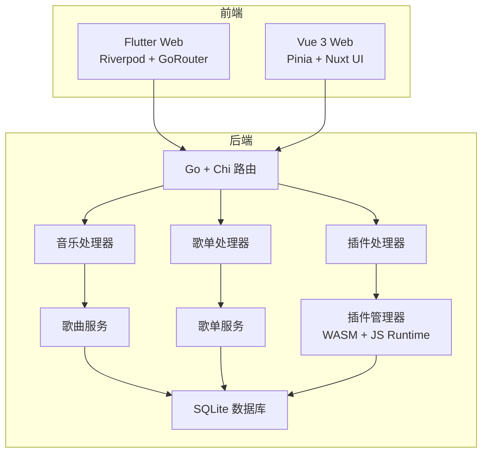
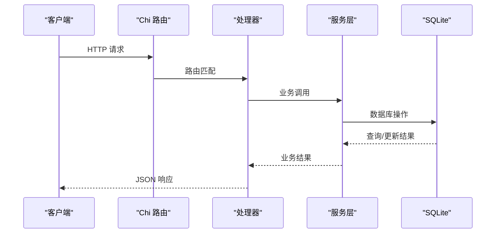
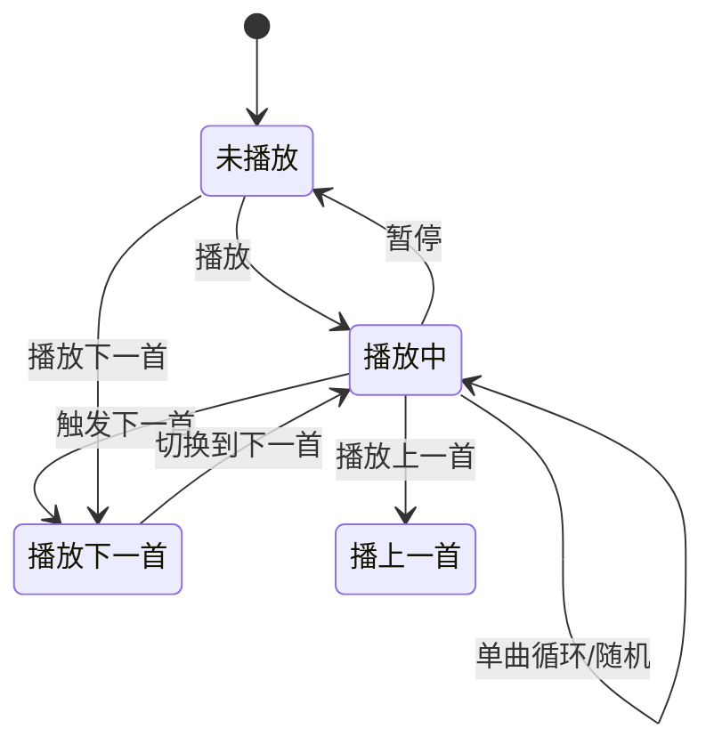
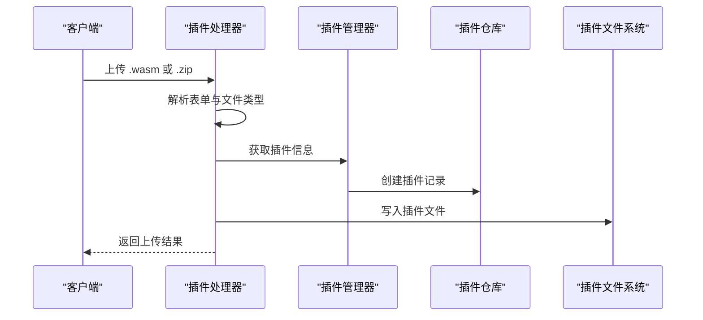
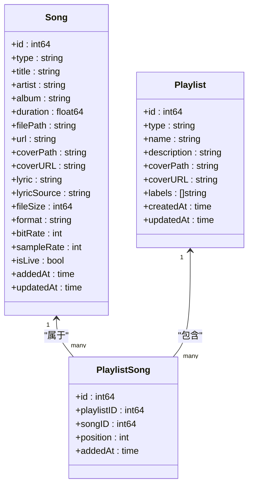
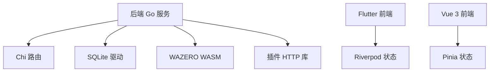

# 待办功能

<cite>
**本文引用的文件**
- [todo.md](file://todo.md)
- [README.md](file://README.md)
- [main.go](file://main.go)
- [internal/app/app.go](file://internal/app/app.go)
- [internal/handlers/music.go](file://internal/handlers/music.go)
- [internal/handlers/playlist.go](file://internal/handlers/playlist.go)
- [internal/handlers/plugin.go](file://internal/handlers/plugin.go)
- [internal/services/song_service.go](file://internal/services/song_service.go)
- [internal/services/playlist_service.go](file://internal/services/playlist_service.go)
- [internal/plugins/manager.go](file://internal/plugins/manager.go)
- [internal/models/models.go](file://internal/models/models.go)
- [frontend/lib/main.dart](file://frontend/lib/main.dart)
- [frontend/lib/core/utils/cover_url.dart](file://frontend/lib/core/utils/cover_url.dart)
- [frontend/lib/shared/widgets/cover_image.dart](file://frontend/lib/shared/widgets/cover_image.dart)
- [frontend/lib/features/player/presentation/widgets/lyrics_view.dart](file://frontend/lib/features/player/presentation/widgets/lyrics_view.dart)
- [frontend/lib/core/storage/lyric_cache_service.dart](file://frontend/lib/core/storage/lyric_cache_service.dart)
- [frontend/test/widget_test.dart](file://frontend/test/widget_test.dart)
- [web/src/main.ts](file://web/src/main.ts)
- [web/src/router/index.ts](file://web/src/router/index.ts)
- [web/src/stores/player.ts](file://web/src/stores/player.ts)
- [docs/architecture.md](file://docs/architecture.md)
</cite>

## 目录
1. [简介](#简介)
2. [项目结构](#项目结构)
3. [核心组件](#核心组件)
4. [架构总览](#架构总览)
5. [详细组件分析](#详细组件分析)
6. [依赖关系分析](#依赖关系分析)
7. [性能考虑](#性能考虑)
8. [故障排查指南](#故障排查指南)
9. [结论](#结论)
10. [附录](#附录)

## 简介
本文件聚焦于 Songloft 项目的待办事项与功能特性，结合后端 Go 服务、前端 Flutter Web 与 Vue 3 前端、以及 WASM 插件系统，系统化梳理当前实现与待完善的功能点。重点包括：
- 歌曲库播放逻辑与网络源适配
- 歌单批量导入与封面处理
- 插件上传与 JS 运行时稳定性
- 前端播放器状态与跨平台通知权限

## 项目结构
项目采用前后端分离架构，后端基于 Go + Chi，提供 RESTful API；前端包含 Flutter Web（主要前端）与 Vue 3 Web（旧版）。插件系统基于 WebAssembly，支持动态扩展。

**图表来源**
- [docs/architecture.md](file://docs/architecture.md)
- [internal/app/app.go](file://internal/app/app.go)
- [internal/handlers/music.go](file://internal/handlers/music.go)
- [internal/handlers/playlist.go](file://internal/handlers/playlist.go)
- [internal/handlers/plugin.go](file://internal/handlers/plugin.go)
- [internal/plugins/manager.go](file://internal/plugins/manager.go)

**章节来源**
- [docs/architecture.md](file://docs/architecture.md)
- [README.md](file://README.md)

## 核心组件
- 应用入口与配置解析：负责解析命令行与环境变量，初始化数据库、服务层、插件管理器与路由。
- 处理器层：音乐、歌单、插件三大处理器，提供 RESTful 接口。
- 服务层：歌曲服务与歌单服务封装业务逻辑，包含扫描、元数据提取、批量导入等。
- 插件管理器：负责 WASM 插件的加载、生命周期管理、路由注册与 JS 环境管理。
- 前端播放器：Flutter Web 与 Vue 3 Web 均提供播放器状态管理与 UI 控件。

**章节来源**
- [main.go](file://main.go)
- [internal/app/app.go](file://internal/app/app.go)
- [internal/handlers/music.go](file://internal/handlers/music.go)
- [internal/handlers/playlist.go](file://internal/handlers/playlist.go)
- [internal/handlers/plugin.go](file://internal/handlers/plugin.go)
- [internal/services/song_service.go](file://internal/services/song_service.go)
- [internal/services/playlist_service.go](file://internal/services/playlist_service.go)
- [internal/plugins/manager.go](file://internal/plugins/manager.go)
- [frontend/lib/main.dart](file://frontend/lib/main.dart)
- [web/src/stores/player.ts](file://web/src/stores/player.ts)

## 架构总览
后端采用分层架构：Handlers -> Services -> Database，配合插件系统实现动态扩展。前端通过同域访问后端 API，Flutter Web 与 Vue 3 Web 分别提供跨平台与现代 UI 能力。

**图表来源**
- [internal/app/app.go](file://internal/app/app.go)
- [internal/handlers/music.go](file://internal/handlers/music.go)
- [internal/handlers/playlist.go](file://internal/handlers/playlist.go)
- [internal/handlers/plugin.go](file://internal/handlers/plugin.go)
- [internal/services/song_service.go](file://internal/services/song_service.go)
- [internal/services/playlist_service.go](file://internal/services/playlist_service.go)

## 详细组件分析

### 已完成任务与当前状态
根据项目中的待办清单和实际代码变更，已完成以下任务：

**已完成：GetSongCover 自动代理网络图片，客户端不再需要 cover_url.dart**
- 现状：后端已统一处理封面 URL，前端直接使用后端返回的 coverUrl 字段
- 影响范围：前端封面显示与代理逻辑简化
- 相关文件：[frontend/lib/core/utils/cover_url.dart](file://frontend/lib/core/utils/cover_url.dart)

**已完成：修复 Flutter 客户端歌曲封面和歌词显示问题**
- 现状：封面组件统一处理，歌词缓存机制完善，播放器 UI 改进
- 影响范围：前端播放器状态管理与 UI 显示
- 相关文件：[frontend/lib/shared/widgets/cover_image.dart](file://frontend/lib/shared/widgets/cover_image.dart)，[frontend/lib/features/player/presentation/widgets/lyrics_view.dart](file://frontend/lib/features/player/presentation/widgets/lyrics_view.dart)

**已完成：前端测试更新与 UI 改进**
- 现状：新增 Flutter Widget 测试，播放器 UI 组件优化
- 影响范围：前端测试覆盖率与用户体验
- 相关文件：[frontend/test/widget_test.dart](file://frontend/test/widget_test.dart)

**待办事项与功能现状**
根据项目中的待办清单，当前仍需关注以下事项：

- 歌曲库点第二次之后的歌曲播放异常
  - 现状：播放队列与播放模式逻辑需进一步验证，确保重复点击同一首歌时行为一致。
  - 影响范围：前端播放器状态管理与后端播放接口。
  - 相关文件：[web/src/stores/player.ts](file://web/src/stores/player.ts)

- 加入网络歌单改为批量导入接口
  - 现状：当前支持单首网络歌曲添加，批量导入接口尚未实现。
  - 影响范围：前端批量选择与后端批量导入处理。
  - 相关文件：[internal/handlers/music.go](file://internal/handlers/music.go)

- 加入网络歌曲带上图片
  - 现状：网络歌曲封面 URL 字段存在，但批量导入时图片处理逻辑需完善。
  - 影响范围：前端封面上传与后端封面保存。
  - 相关文件：[internal/handlers/music.go](file://internal/handlers/music.go)

- 无法加载 洛雪音乐源
  - 现状：日志显示 JS 环境创建与执行失败，提示中断错误。
  - 影响范围：插件 JS 运行时与网络源插件。
  - 相关文件：[todo.md](file://todo.md)，[internal/plugins/manager.go](file://internal/plugins/manager.go)

**章节来源**
- [todo.md](file://todo.md)
- [internal/handlers/music.go](file://internal/handlers/music.go)
- [internal/plugins/manager.go](file://internal/plugins/manager.go)
- [web/src/stores/player.ts](file://web/src/stores/player.ts)
- [frontend/lib/core/utils/cover_url.dart](file://frontend/lib/core/utils/cover_url.dart)
- [frontend/lib/shared/widgets/cover_image.dart](file://frontend/lib/shared/widgets/cover_image.dart)
- [frontend/lib/features/player/presentation/widgets/lyrics_view.dart](file://frontend/lib/features/player/presentation/widgets/lyrics_view.dart)
- [frontend/test/widget_test.dart](file://frontend/test/widget_test.dart)

### 播放器状态与播放模式
播放器状态管理涵盖当前歌曲、播放列表、播放模式（顺序/循环/单曲/随机）、音量与进度等。播放模式影响"上一首/下一首"的行为。

**图表来源**
- [web/src/stores/player.ts](file://web/src/stores/player.ts)

**章节来源**
- [web/src/stores/player.ts](file://web/src/stores/player.ts)

### 插件上传与 JS 运行时
插件上传支持 .wasm 与 .zip 批量导入，内部会解析插件元信息并保存至数据库。JS 运行时管理器负责为插件创建与销毁 JS 环境，处理网络源等动态逻辑。

**图表来源**
- [internal/handlers/plugin.go](file://internal/handlers/plugin.go)
- [internal/plugins/manager.go](file://internal/plugins/manager.go)

**章节来源**
- [internal/handlers/plugin.go](file://internal/handlers/plugin.go)
- [internal/plugins/manager.go](file://internal/plugins/manager.go)

### 歌曲与歌单管理
- 歌曲管理：支持本地扫描、元数据提取、封面保存、远程歌曲与电台添加、批量删除与无效歌曲清理。
- 歌单管理：支持普通歌单与电台歌单、自动按目录创建歌单、批量添加歌曲、重新排序与移除歌曲。

**图表来源**
- [internal/models/models.go](file://internal/models/models.go)
- [internal/services/song_service.go](file://internal/services/song_service.go)
- [internal/services/playlist_service.go](file://internal/services/playlist_service.go)

**章节来源**
- [internal/handlers/music.go](file://internal/handlers/music.go)
- [internal/handlers/playlist.go](file://internal/handlers/playlist.go)
- [internal/services/song_service.go](file://internal/services/song_service.go)
- [internal/services/playlist_service.go](file://internal/services/playlist_service.go)
- [internal/models/models.go](file://internal/models/models.go)

## 依赖关系分析
- 后端依赖：Chi 路由、SQLite 驱动、WAZERO WASM 运行时、插件 HTTP 库。
- 前端依赖：Flutter Riverpod、GoRouter、just_audio/audio_service；Vue 3 Pinia、Nuxt UI。
- 插件系统：WASM 实例隔离、定时器与路由注册、JS 环境生命周期管理。

**图表来源**
- [internal/app/app.go](file://internal/app/app.go)
- [internal/plugins/manager.go](file://internal/plugins/manager.go)
- [frontend/lib/main.dart](file://frontend/lib/main.dart)
- [web/src/main.ts](file://web/src/main.ts)

**章节来源**
- [internal/app/app.go](file://internal/app/app.go)
- [internal/plugins/manager.go](file://internal/plugins/manager.go)
- [frontend/lib/main.dart](file://frontend/lib/main.dart)
- [web/src/main.ts](file://web/src/main.ts)

## 性能考虑
- 扫描与导入：采用并发元数据提取与批量数据库写入，减少磁盘 IO 与锁竞争。
- 插件执行：WASM 实例隔离与超时控制，避免阻塞主程序。
- 前端状态：Pinia 持久化与组件懒加载，提升首屏性能。

**章节来源**
- [internal/services/song_service.go](file://internal/services/song_service.go)
- [internal/plugins/manager.go](file://internal/plugins/manager.go)
- [web/src/main.ts](file://web/src/main.ts)

## 故障排查指南
- 插件 JS 环境中断：检查 JS 环境创建与执行日志，确认插件代码与网络请求稳定性。
- CORS 问题：确认前端与后端同域部署，避免跨域导致的请求失败。
- 通知权限：Android 13+ 需要运行时请求通知权限，否则播放器通知栏不可用。
- 播放模式异常：检查播放器状态计算逻辑，确保顺序/循环/单曲/随机模式下的边界行为正确。
- 封面显示问题：检查 CoverUrl 工具类的代理逻辑，确认外部 URL 已正确代理。

**章节来源**
- [todo.md](file://todo.md)
- [frontend/lib/main.dart](file://frontend/lib/main.dart)
- [frontend/lib/core/utils/cover_url.dart](file://frontend/lib/core/utils/cover_url.dart)
- [web/src/router/index.ts](file://web/src/router/index.ts)

## 结论
本项目在后端 RESTful API、前端跨平台播放器与 WASM 插件系统方面具备良好架构与扩展性。针对已完成的任务，前端封面代理、歌词缓存与播放器 UI 已得到显著改善。对于剩余待办事项，建议优先完善播放器状态一致性、网络歌单批量导入与封面处理、以及插件 JS 运行时稳定性，以提升用户体验与系统健壮性。

## 附录
- 快速开始与 API 文档参见项目自述文件与 Swagger UI。
- 架构设计与技术栈说明参见架构文档。

**章节来源**
- [README.md](file://README.md)
- [docs/architecture.md](file://docs/architecture.md)