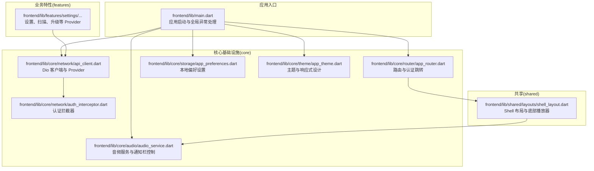
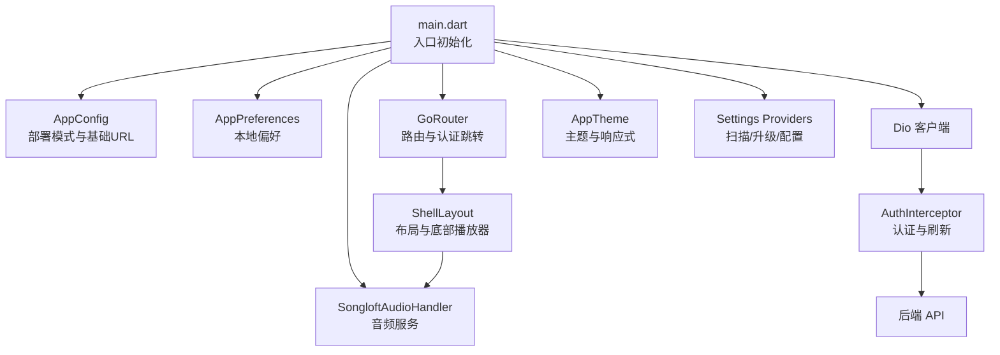
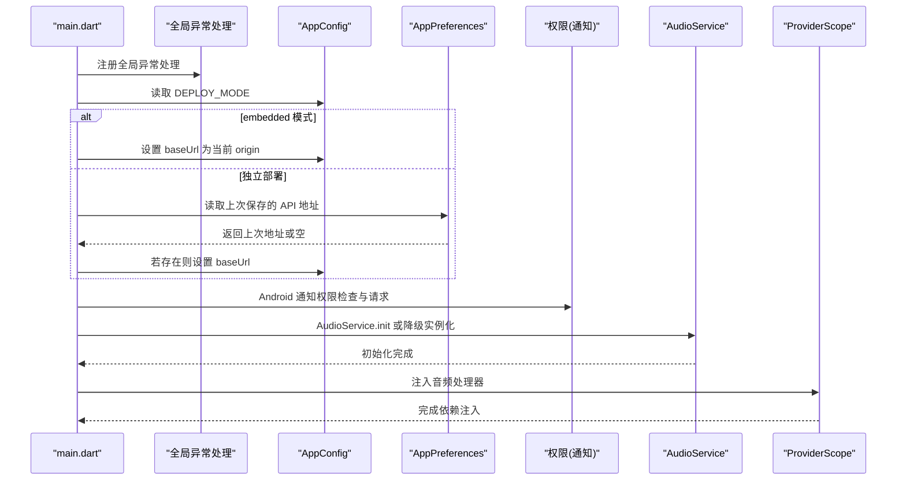
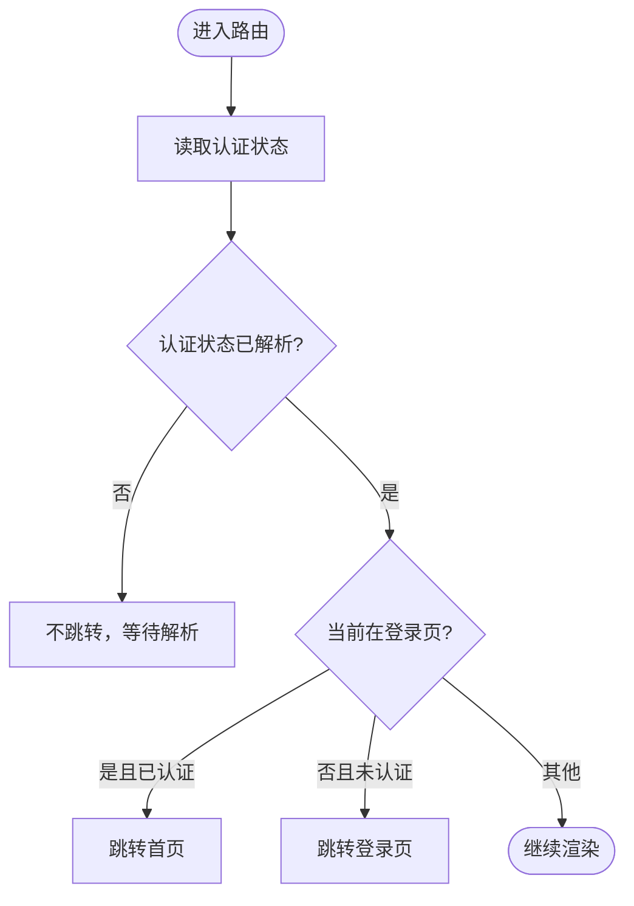
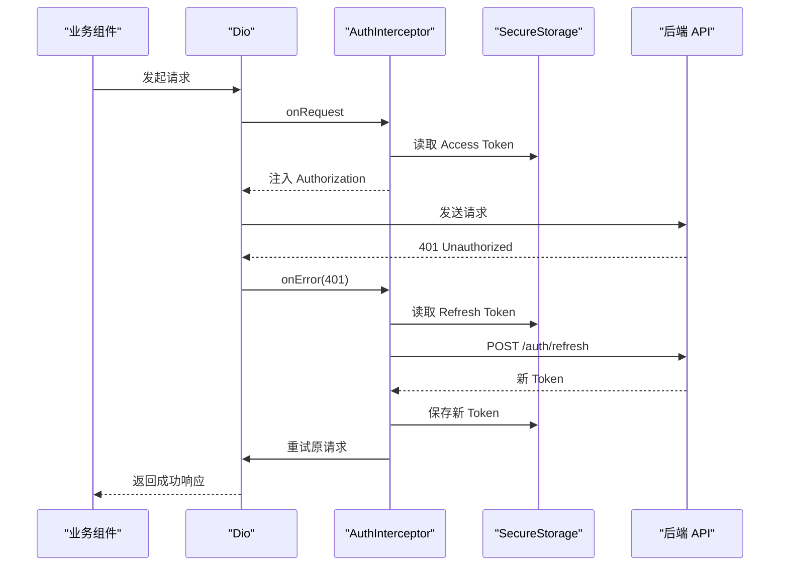
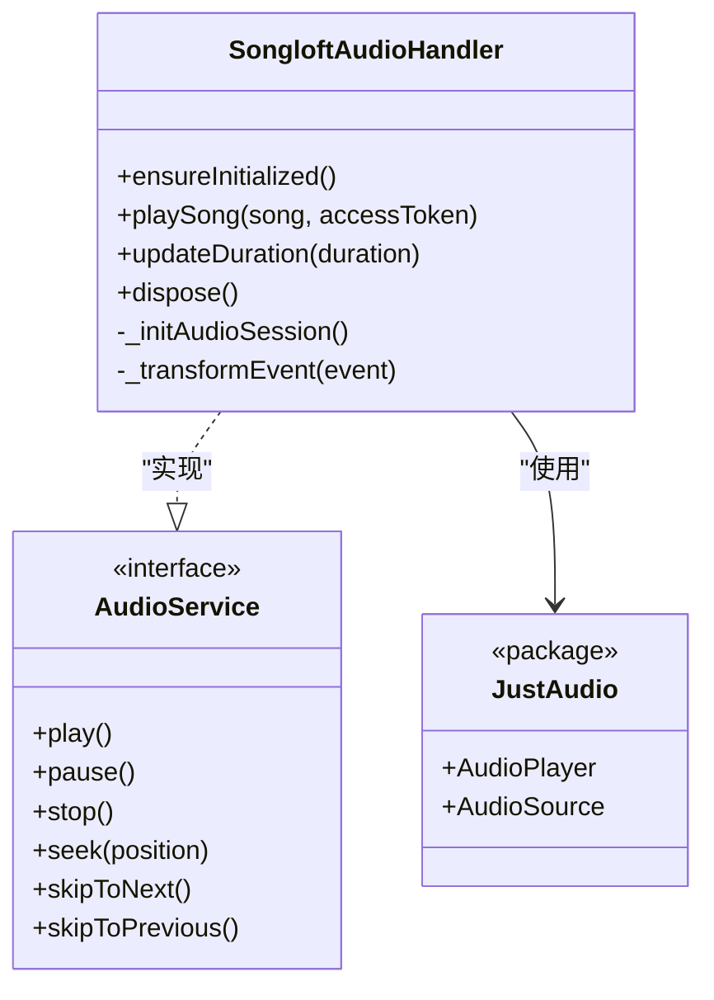
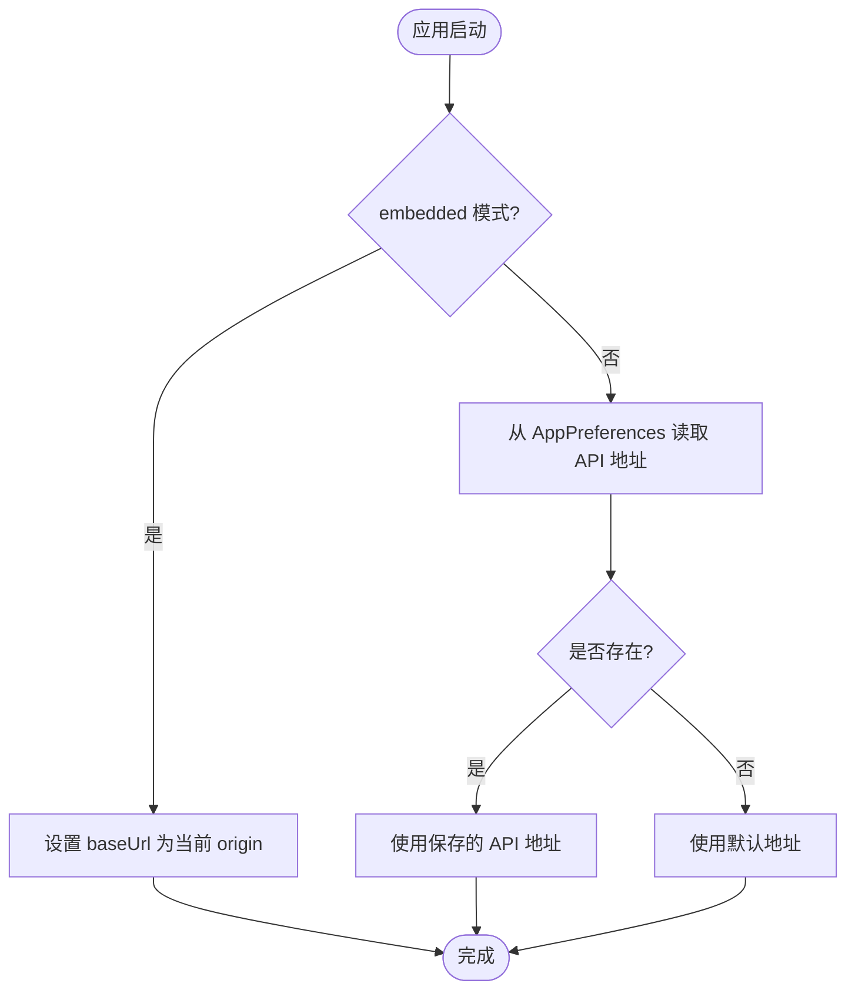
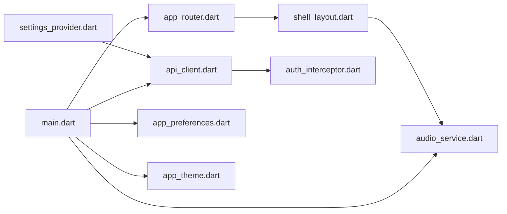

# Flutter 应用架构

<cite>
**本文引用的文件**
- [frontend/lib/main.dart](file://frontend/lib/main.dart)
- [frontend/lib/config/app_config.dart](file://frontend/lib/config/app_config.dart)
- [frontend/lib/core/router/app_router.dart](file://frontend/lib/core/router/app_router.dart)
- [frontend/lib/core/audio/audio_service.dart](file://frontend/lib/core/audio/audio_service.dart)
- [frontend/lib/core/network/api_client.dart](file://frontend/lib/core/network/api_client.dart)
- [frontend/lib/core/network/auth_interceptor.dart](file://frontend/lib/core/network/auth_interceptor.dart)
- [frontend/lib/core/storage/app_preferences.dart](file://frontend/lib/core/storage/app_preferences.dart)
- [frontend/lib/core/theme/app_theme.dart](file://frontend/lib/core/theme/app_theme.dart)
- [frontend/lib/shared/layouts/shell_layout.dart](file://frontend/lib/shared/layouts/shell_layout.dart)
- [frontend/lib/features/settings/presentation/providers/settings_provider.dart](file://frontend/lib/features/settings/presentation/providers/settings_provider.dart)
- [docs/architecture.md](file://docs/architecture.md)
- [README.md](file://README.md)
</cite>

## 目录
1. [简介](#简介)
2. [项目结构](#项目结构)
3. [核心组件](#核心组件)
4. [架构总览](#架构总览)
5. [详细组件分析](#详细组件分析)
6. [依赖分析](#依赖分析)
7. [性能考虑](#性能考虑)
8. [故障排除指南](#故障排除指南)
9. [结论](#结论)
10. [附录](#附录)

## 简介
本设计文档面向 Songloft Flutter 前端应用，聚焦于应用入口 main.dart 的初始化流程、依赖注入配置、环境变量加载与应用启动序列；梳理核心模块组织结构（core 目录下的路由、中间件、配置管理等）；阐述应用生命周期管理（启动、运行、关闭阶段）；说明配置管理策略（开发/生产环境切换、动态配置加载与验证机制）；并提供架构图与模块依赖关系，帮助开发者快速理解整体架构设计。

## 项目结构
前端工程位于 frontend/lib，采用按功能域分层的组织方式：
- config：全局配置与常量（如部署模式、基础 URL、超时等）
- core：核心基础设施（路由、网络、音频、存储、主题、工具）
- features：业务特性（如设置、播放器、歌单、库等）
- shared：共享组件与布局（如 ShellLayout、适配布局等）

图表来源
- [frontend/lib/main.dart:23-108](file://frontend/lib/main.dart#L23-L108)
- [frontend/lib/core/router/app_router.dart:37-170](file://frontend/lib/core/router/app_router.dart#L37-L170)
- [frontend/lib/core/audio/audio_service.dart:16-307](file://frontend/lib/core/audio/audio_service.dart#L16-L307)
- [frontend/lib/core/network/api_client.dart:8-116](file://frontend/lib/core/network/api_client.dart#L8-L116)
- [frontend/lib/core/network/auth_interceptor.dart:16-169](file://frontend/lib/core/network/auth_interceptor.dart#L16-L169)
- [frontend/lib/core/storage/app_preferences.dart:5-83](file://frontend/lib/core/storage/app_preferences.dart#L5-L83)
- [frontend/lib/core/theme/app_theme.dart:6-117](file://frontend/lib/core/theme/app_theme.dart#L6-L117)
- [frontend/lib/shared/layouts/shell_layout.dart:16-102](file://frontend/lib/shared/layouts/shell_layout.dart#L16-L102)
- [frontend/lib/features/settings/presentation/providers/settings_provider.dart:17-273](file://frontend/lib/features/settings/presentation/providers/settings_provider.dart#L17-L273)

章节来源
- [frontend/lib/main.dart:23-108](file://frontend/lib/main.dart#L23-L108)
- [frontend/lib/core/router/app_router.dart:37-170](file://frontend/lib/core/router/app_router.dart#L37-L170)
- [frontend/lib/core/audio/audio_service.dart:16-307](file://frontend/lib/core/audio/audio_service.dart#L16-L307)
- [frontend/lib/core/network/api_client.dart:8-116](file://frontend/lib/core/network/api_client.dart#L8-L116)
- [frontend/lib/core/network/auth_interceptor.dart:16-169](file://frontend/lib/core/network/auth_interceptor.dart#L16-L169)
- [frontend/lib/core/storage/app_preferences.dart:5-83](file://frontend/lib/core/storage/app_preferences.dart#L5-L83)
- [frontend/lib/core/theme/app_theme.dart:6-117](file://frontend/lib/core/theme/app_theme.dart#L6-L117)
- [frontend/lib/shared/layouts/shell_layout.dart:16-102](file://frontend/lib/shared/layouts/shell_layout.dart#L16-L102)
- [frontend/lib/features/settings/presentation/providers/settings_provider.dart:17-273](file://frontend/lib/features/settings/presentation/providers/settings_provider.dart#L17-L273)

## 核心组件
- 应用入口与初始化
  - 全局异常处理：注册 FlutterError.onError 与 PlatformDispatcher.onError，避免未捕获异常导致白屏
  - 部署模式判断：通过构建时注入的 DEPLOY_MODE 判断是否为 embedded 模式（Flutter Web 嵌入后端）
  - API 基础地址加载：embedded 模式使用当前页面 origin；独立部署模式从本地偏好恢复上次配置
  - Android 通知权限：Android 13+ 运行时请求通知权限，并处理永久拒绝场景
  - 音频服务初始化：优先使用 AudioService.init，失败则降级为直接实例化，确保播放功能可用
  - 依赖注入：通过 ProviderScope 将音频处理器注入到 Riverpod，供全局消费

- 配置管理
  - AppConfig：集中管理 baseUrl、apiPrefix、超时等；支持编译时常量 isEmbedded
  - AppPreferences：主题模式、API 地址、设备 ID 等本地持久化

- 路由与认证
  - GoRouter：定义路径常量、ShellRoute、错误页；通过 refreshListenable 监听认证状态变化，实现登录/登出跳转

- 网络与认证
  - Dio 客户端：统一超时、头信息；提供公共与认证 Dio Provider
  - AuthInterceptor：自动注入 Authorization 头、401 自动刷新 Token、并发刷新保护、重试原请求

- 音频服务
  - SongloftAudioHandler：基于 audio_service + just_audio，实现通知栏控制、媒体元数据、播放源切换与降级处理

- 主题与响应式
  - AppTheme：基于 Material3，支持亮/暗/系统主题；响应式尺寸与控件样式

章节来源
- [frontend/lib/main.dart:23-108](file://frontend/lib/main.dart#L23-L108)
- [frontend/lib/config/app_config.dart:8-20](file://frontend/lib/config/app_config.dart#L8-L20)
- [frontend/lib/core/storage/app_preferences.dart:5-83](file://frontend/lib/core/storage/app_preferences.dart#L5-L83)
- [frontend/lib/core/router/app_router.dart:37-170](file://frontend/lib/core/router/app_router.dart#L37-L170)
- [frontend/lib/core/network/api_client.dart:8-116](file://frontend/lib/core/network/api_client.dart#L8-L116)
- [frontend/lib/core/network/auth_interceptor.dart:16-169](file://frontend/lib/core/network/auth_interceptor.dart#L16-L169)
- [frontend/lib/core/audio/audio_service.dart:16-307](file://frontend/lib/core/audio/audio_service.dart#L16-L307)
- [frontend/lib/core/theme/app_theme.dart:6-117](file://frontend/lib/core/theme/app_theme.dart#L6-L117)

## 架构总览
应用采用“入口初始化 + 核心基础设施 + 业务特性 + 共享布局”的分层架构。入口负责环境探测、权限与音频服务初始化；核心模块提供路由、网络、音频、存储、主题等通用能力；业务特性通过 Riverpod Provider 组织数据与状态；共享布局整合导航与播放器，适配多端响应式体验。

图表来源
- [frontend/lib/main.dart:23-108](file://frontend/lib/main.dart#L23-L108)
- [frontend/lib/config/app_config.dart:8-20](file://frontend/lib/config/app_config.dart#L8-L20)
- [frontend/lib/core/storage/app_preferences.dart:5-83](file://frontend/lib/core/storage/app_preferences.dart#L5-L83)
- [frontend/lib/core/audio/audio_service.dart:16-307](file://frontend/lib/core/audio/audio_service.dart#L16-L307)
- [frontend/lib/core/router/app_router.dart:37-170](file://frontend/lib/core/router/app_router.dart#L37-L170)
- [frontend/lib/core/network/api_client.dart:8-116](file://frontend/lib/core/network/api_client.dart#L8-L116)
- [frontend/lib/core/network/auth_interceptor.dart:16-169](file://frontend/lib/core/network/auth_interceptor.dart#L16-L169)
- [frontend/lib/core/theme/app_theme.dart:6-117](file://frontend/lib/core/theme/app_theme.dart#L6-L117)
- [frontend/lib/shared/layouts/shell_layout.dart:16-102](file://frontend/lib/shared/layouts/shell_layout.dart#L16-L102)
- [frontend/lib/features/settings/presentation/providers/settings_provider.dart:17-273](file://frontend/lib/features/settings/presentation/providers/settings_provider.dart#L17-L273)

## 详细组件分析

### 应用入口与初始化流程（main.dart）
- 初始化步骤
  - 全局异常处理：注册 FlutterError.onError 与 PlatformDispatcher.onError，保证错误可诊断且不崩溃
  - 部署模式判断：读取构建时注入的 DEPLOY_MODE，embedded 模式直接使用当前页面 origin 作为后端地址
  - 独立部署恢复：从 AppPreferences 读取上次保存的 API 基础地址，若为空则使用默认值
  - Android 通知权限：针对 Android 13+ 请求通知权限，记录状态并在永久拒绝时提示用户
  - 音频服务初始化：优先 AudioService.init，失败则降级为直接实例化，确保播放功能可用
  - 依赖注入：通过 ProviderScope 注入音频处理器，供全局消费

图表来源
- [frontend/lib/main.dart:23-108](file://frontend/lib/main.dart#L23-L108)
- [frontend/lib/config/app_config.dart:8-20](file://frontend/lib/config/app_config.dart#L8-L20)
- [frontend/lib/core/storage/app_preferences.dart:5-83](file://frontend/lib/core/storage/app_preferences.dart#L5-L83)

章节来源
- [frontend/lib/main.dart:23-108](file://frontend/lib/main.dart#L23-L108)

### 路由与认证（app_router.dart）
- 路由定义
  - 路径常量：登录、首页、库、歌单、歌单详情、设置、插件 WebView
  - 登录页与插件页为独立路由，主应用使用 ShellRoute 包裹
- 认证跳转
  - 通过 refreshListenable 监听认证状态变化，redirect 回调在未解析时不做跳转，未认证且不在登录页跳转登录，已认证且在登录页跳转首页
- 错误页
  - 未找到页面时展示错误页并提供返回首页按钮

图表来源
- [frontend/lib/core/router/app_router.dart:45-74](file://frontend/lib/core/router/app_router.dart#L45-L74)

章节来源
- [frontend/lib/core/router/app_router.dart:37-170](file://frontend/lib/core/router/app_router.dart#L37-L170)

### 网络与认证拦截（api_client.dart、auth_interceptor.dart）
- Dio 客户端
  - 统一超时与头信息；提供公共 Dio（无需认证）与认证 Dio（带 AuthInterceptor）
  - ApiClient 封装 baseUrl 更新能力
- 认证拦截器
  - onRequest：对非公开路径自动注入 Authorization 头
  - onError：仅处理 401；对刷新接口失败直接回调过期；并发刷新保护；刷新成功后重试原请求
  - 刷新失败：清理本地 Token 并回调外部 onTokenExpired

图表来源
- [frontend/lib/core/network/api_client.dart:8-116](file://frontend/lib/core/network/api_client.dart#L8-L116)
- [frontend/lib/core/network/auth_interceptor.dart:16-169](file://frontend/lib/core/network/auth_interceptor.dart#L16-L169)

章节来源
- [frontend/lib/core/network/api_client.dart:8-116](file://frontend/lib/core/network/api_client.dart#L8-L116)
- [frontend/lib/core/network/auth_interceptor.dart:16-169](file://frontend/lib/core/network/auth_interceptor.dart#L16-L169)

### 音频服务（audio_service.dart）
- 核心职责
  - 集成 audio_service 与 just_audio，实现通知栏控制、媒体元数据、播放状态同步
  - 使用 .pipe() 直接绑定 playbackState，避免中间状态丢失
  - 播放歌曲：本地歌曲通过服务器 URL + access_token，网络歌曲通过代理 URL
  - 自动切歌修复：先更新 mediaItem，再 setAudioSource，最后 play，确保通知栏元数据正确
- 初始化与降级
  - 异步初始化 AudioSession；ensureInitialized 确保初始化完成
  - 失败安全：初始化失败时降级为直接实例化，保证播放功能可用

图表来源
- [frontend/lib/core/audio/audio_service.dart:16-307](file://frontend/lib/core/audio/audio_service.dart#L16-L307)

章节来源
- [frontend/lib/core/audio/audio_service.dart:16-307](file://frontend/lib/core/audio/audio_service.dart#L16-L307)

### 配置管理（AppConfig 与 AppPreferences）
- AppConfig
  - 编译时常量 isEmbedded 控制部署模式；baseUrl 与 apiPrefix 统一 API 基础地址
  - 支持运行时更新 baseUrl（通过 ApiClient.updateBaseUrl）
- AppPreferences
  - 主题模式、API 地址、设备 ID 等本地持久化；提供清除方法

图表来源
- [frontend/lib/main.dart:36-47](file://frontend/lib/main.dart#L36-L47)
- [frontend/lib/config/app_config.dart:8-20](file://frontend/lib/config/app_config.dart#L8-L20)
- [frontend/lib/core/storage/app_preferences.dart:48-61](file://frontend/lib/core/storage/app_preferences.dart#L48-L61)

章节来源
- [frontend/lib/config/app_config.dart:8-20](file://frontend/lib/config/app_config.dart#L8-L20)
- [frontend/lib/core/storage/app_preferences.dart:5-83](file://frontend/lib/core/storage/app_preferences.dart#L5-L83)
- [frontend/lib/main.dart:36-47](file://frontend/lib/main.dart#L36-L47)

### 主题与响应式（AppTheme）
- 基于 Material3 的主题构建，支持亮/暗/系统主题
- 响应式设计：根据屏幕类型（mobile/tablet/desktop/tv）调整控件尺寸、间距与样式

章节来源
- [frontend/lib/core/theme/app_theme.dart:6-117](file://frontend/lib/core/theme/app_theme.dart#L6-L117)

### 共享布局（ShellLayout）
- 整合 AdaptiveScaffold、路由导航与底部播放器
- 根据屏幕类型与目标平台选择合适的播放器组件（MiniPlayer、DesktopPlayer、TvMiniPlayer）

章节来源
- [frontend/lib/shared/layouts/shell_layout.dart:16-102](file://frontend/lib/shared/layouts/shell_layout.dart#L16-L102)

### 设置与后台任务（Settings Providers）
- API Providers：ConfigApi、ScanApi、PluginApi、UpgradeApi
- 主题模式：ThemeModeNotifier 与 NotifierProvider
- 扫描进度：ScanProgressNotifier，周期轮询进度，自动停止
- 升级进度：UpgradeProgressNotifier，周期轮询进度，自动停止

章节来源
- [frontend/lib/features/settings/presentation/providers/settings_provider.dart:17-273](file://frontend/lib/features/settings/presentation/providers/settings_provider.dart#L17-L273)

## 依赖分析
- 组件耦合
  - main.dart 依赖 core 与 features 的 Provider，形成“入口 -> 基础设施 -> 业务”的单向依赖
  - 路由依赖认证 Provider，认证状态变化通过 refreshListenable 触发跳转
  - 网络层通过 Dio 与 AuthInterceptor 解耦认证逻辑
  - 音频服务通过 Riverpod 注入，避免全局单例耦合
- 外部依赖
  - audio_service、just_audio：音频播放与通知栏控制
  - dio：HTTP 客户端
  - go_router：声明式路由
  - flutter_riverpod：状态与依赖注入

图表来源
- [frontend/lib/main.dart:23-108](file://frontend/lib/main.dart#L23-L108)
- [frontend/lib/core/router/app_router.dart:37-170](file://frontend/lib/core/router/app_router.dart#L37-L170)
- [frontend/lib/core/audio/audio_service.dart:16-307](file://frontend/lib/core/audio/audio_service.dart#L16-L307)
- [frontend/lib/core/network/api_client.dart:8-116](file://frontend/lib/core/network/api_client.dart#L8-L116)
- [frontend/lib/core/network/auth_interceptor.dart:16-169](file://frontend/lib/core/network/auth_interceptor.dart#L16-L169)
- [frontend/lib/core/storage/app_preferences.dart:5-83](file://frontend/lib/core/storage/app_preferences.dart#L5-L83)
- [frontend/lib/core/theme/app_theme.dart:6-117](file://frontend/lib/core/theme/app_theme.dart#L6-L117)
- [frontend/lib/shared/layouts/shell_layout.dart:16-102](file://frontend/lib/shared/layouts/shell_layout.dart#L16-L102)
- [frontend/lib/features/settings/presentation/providers/settings_provider.dart:17-273](file://frontend/lib/features/settings/presentation/providers/settings_provider.dart#L17-L273)

章节来源
- [frontend/lib/main.dart:23-108](file://frontend/lib/main.dart#L23-L108)
- [frontend/lib/core/router/app_router.dart:37-170](file://frontend/lib/core/router/app_router.dart#L37-L170)
- [frontend/lib/core/audio/audio_service.dart:16-307](file://frontend/lib/core/audio/audio_service.dart#L16-L307)
- [frontend/lib/core/network/api_client.dart:8-116](file://frontend/lib/core/network/api_client.dart#L8-L116)
- [frontend/lib/core/network/auth_interceptor.dart:16-169](file://frontend/lib/core/network/auth_interceptor.dart#L16-L169)
- [frontend/lib/core/storage/app_preferences.dart:5-83](file://frontend/lib/core/storage/app_preferences.dart#L5-L83)
- [frontend/lib/core/theme/app_theme.dart:6-117](file://frontend/lib/core/theme/app_theme.dart#L6-L117)
- [frontend/lib/shared/layouts/shell_layout.dart:16-102](file://frontend/lib/shared/layouts/shell_layout.dart#L16-L102)
- [frontend/lib/features/settings/presentation/providers/settings_provider.dart:17-273](file://frontend/lib/features/settings/presentation/providers/settings_provider.dart#L17-L273)

## 性能考虑
- 音频播放
  - 使用 .pipe() 直接绑定 playbackState，避免手动监听与状态同步带来的延迟
  - 自动切歌顺序优化，确保通知栏元数据及时更新
- 网络请求
  - 并发刷新保护，避免多个 401 触发多次刷新
  - 日志拦截器仅在调试模式启用，减少生产环境开销
- 响应式主题
  - 根据屏幕类型动态调整控件尺寸与间距，提升多端体验一致性

## 故障排除指南
- 未捕获异常导致白屏
  - 确认已在入口注册全局异常处理；查看日志定位异常来源
- Android 通知权限
  - 若权限被永久拒绝，引导用户前往系统设置手动开启
- 音频服务初始化失败
  - 降级路径会继续工作；检查日志定位具体失败原因（如权限、平台限制）
- 认证失败或频繁刷新
  - 检查 AuthInterceptor 的 401 处理与刷新流程；确认刷新接口返回的 Token 有效
- API 地址错误
  - embedded 模式应使用同域 origin；独立部署模式检查 AppPreferences 中保存的地址

章节来源
- [frontend/lib/main.dart:26-34](file://frontend/lib/main.dart#L26-L34)
- [frontend/lib/main.dart:49-63](file://frontend/lib/main.dart#L49-L63)
- [frontend/lib/main.dart:67-97](file://frontend/lib/main.dart#L67-L97)
- [frontend/lib/core/network/auth_interceptor.dart:63-93](file://frontend/lib/core/network/auth_interceptor.dart#L63-L93)
- [frontend/lib/core/storage/app_preferences.dart:48-61](file://frontend/lib/core/storage/app_preferences.dart#L48-L61)

## 结论
Songloft Flutter 前端通过清晰的入口初始化、模块化的 core 基础设施、基于 Riverpod 的依赖注入与 Provider 管理、以及完善的网络与音频能力，实现了跨平台的一致体验。embedded 与独立部署两种模式通过 AppConfig 与 AppPreferences 灵活切换，满足不同部署场景需求。建议在后续迭代中持续优化错误处理与性能监控，进一步提升稳定性与用户体验。

## 附录
- 架构背景参考：前端架构与嵌入式部署说明
- 项目总体架构：前后端分离、Flutter Web 嵌入 Go 后端、同域访问与 SPA 回退

章节来源
- [docs/architecture.md:13-37](file://docs/architecture.md#L13-L37)
- [README.md:10-17](file://README.md#L10-L17)