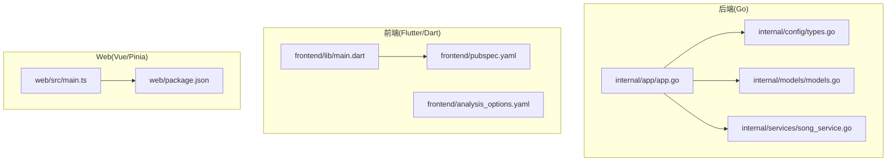
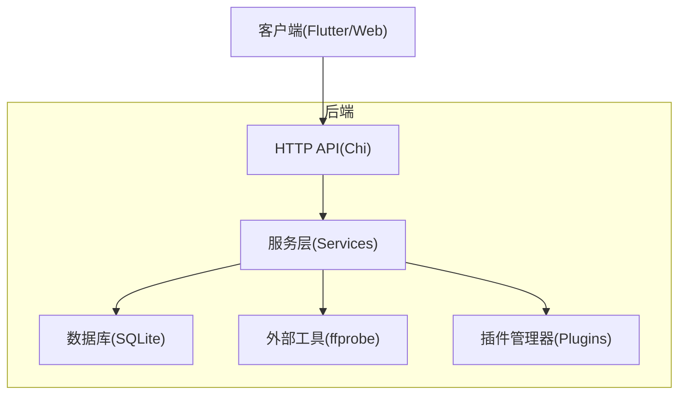
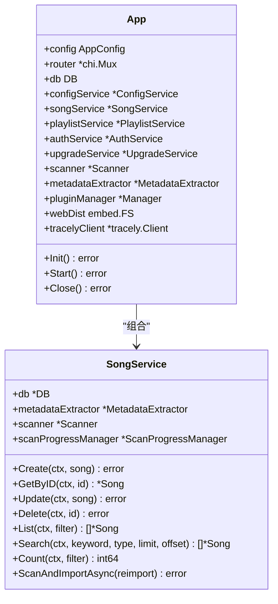
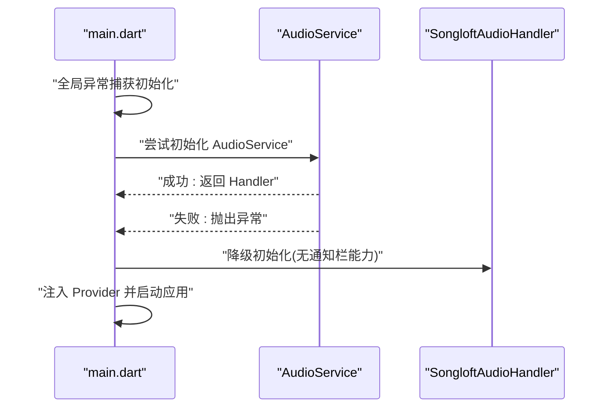
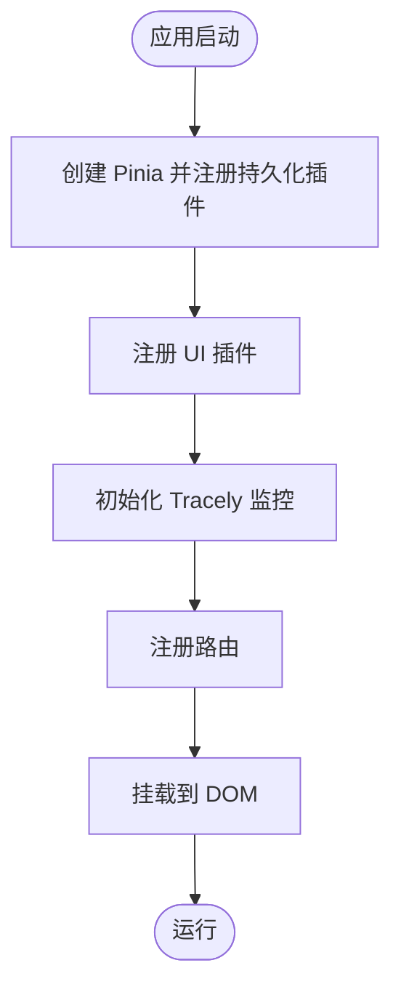
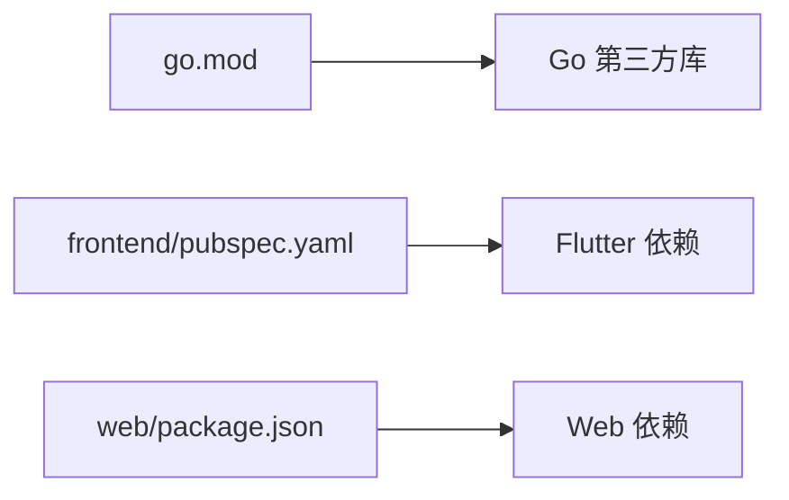

# 代码规范

<cite>
**本文引用的文件**   
- [go.mod](file://go.mod)
- [internal/app/app.go](file://internal/app/app.go)
- [internal/config/types.go](file://internal/config/types.go)
- [internal/models/models.go](file://internal/models/models.go)
- [internal/services/song_service.go](file://internal/services/song_service.go)
- [frontend/pubspec.yaml](file://frontend/pubspec.yaml)
- [frontend/analysis_options.yaml](file://frontend/analysis_options.yaml)
- [frontend/lib/main.dart](file://frontend/lib/main.dart)
- [web/package.json](file://web/package.json)
- [web/src/main.ts](file://web/src/main.ts)
- [.github/workflows/lint.yml](file://.github/workflows/lint.yml)
- [frontend/.gitignore](file://frontend/.gitignore)
- [web/.gitignore](file://web/.gitignore)
- [docs/quick-start.md](file://docs/quick-start.md)
</cite>

## 目录
1. [简介](#简介)
2. [项目结构](#项目结构)
3. [核心组件](#核心组件)
4. [架构总览](#架构总览)
5. [详细组件分析](#详细组件分析)
6. [依赖分析](#依赖分析)
7. [性能考虑](#性能考虑)
8. [故障排查指南](#故障排查指南)
9. [结论](#结论)
10. [附录](#附录)

## 简介
本指南面向 Songloft 项目，提供统一的代码规范与最佳实践，覆盖 Go 后端、Dart/Flutter 前端以及 Web/Vue 前端三部分。内容包括命名约定、代码格式、注释规范、错误处理模式、包组织结构、代码审查清单与自动化工具配置方法，帮助团队在多语言协作下保持一致的代码质量。

## 项目结构
Songloft 采用多模块分层组织：
- 后端（Go）：内部模块按职责拆分（app、config、database、handlers、middleware、models、plugins、services、version），遵循清晰的分层与接口边界。
- 前端（Flutter/Dart）：lib 下按功能域划分（config、core、features、shared），主入口集中于 lib/main.dart。
- Web 前端（Vue 3/Pinia）：src 下按功能域划分（api、components、composables、layouts、router、stores、types、utils、views），主入口集中于 src/main.ts。
- 插件生态：songloft-plugin 与 plugins 子项目提供插件协议与示例实现。

**图示来源**
- [internal/app/app.go:1-353](file://internal/app/app.go#L1-L353)
- [internal/config/types.go:1-10](file://internal/config/types.go#L1-L10)
- [internal/models/models.go:1-436](file://internal/models/models.go#L1-L436)
- [internal/services/song_service.go:1-200](file://internal/services/song_service.go#L1-L200)
- [frontend/lib/main.dart:1-147](file://frontend/lib/main.dart#L1-L147)
- [frontend/pubspec.yaml:1-60](file://frontend/pubspec.yaml#L1-L60)
- [frontend/analysis_options.yaml:1-16](file://frontend/analysis_options.yaml#L1-L16)
- [web/src/main.ts:1-45](file://web/src/main.ts#L1-L45)
- [web/package.json:1-35](file://web/package.json#L1-L35)

**章节来源**
- [internal/app/app.go:1-353](file://internal/app/app.go#L1-L353)
- [frontend/lib/main.dart:1-147](file://frontend/lib/main.dart#L1-L147)
- [web/src/main.ts:1-45](file://web/src/main.ts#L1-L45)

## 核心组件
- 应用入口与生命周期：后端通过 App 结构体统一初始化数据库、服务、插件管理器与路由；前端在 main.dart 中进行全局异常处理、音频服务初始化与路由注入；Web 前端在 main.ts 中初始化 Pinia、UI 插件与监控 SDK。
- 配置与模型：AppConfig 与各类业务模型（Song、Playlist、Plugin、Token 等）定义了统一的数据契约与校验规则。
- 服务层：SongService 展示了典型的 CRUD 与业务流程封装，包含错误包装与日志记录。

**章节来源**
- [internal/app/app.go:27-53](file://internal/app/app.go#L27-L53)
- [internal/config/types.go:3-9](file://internal/config/types.go#L3-L9)
- [internal/models/models.go:64-122](file://internal/models/models.go#L64-L122)
- [internal/services/song_service.go:44-82](file://internal/services/song_service.go#L44-L82)
- [frontend/lib/main.dart:23-108](file://frontend/lib/main.dart#L23-L108)
- [web/src/main.ts:20-44](file://web/src/main.ts#L20-L44)

## 架构总览
后端采用分层架构：入口层负责解析配置与初始化，服务层封装业务逻辑，数据层负责持久化与外部工具集成（如 ffprobe）。前端通过 Riverpod/Pinia 管理状态，路由驱动视图切换，并与后端 API 交互。

**图示来源**
- [internal/app/app.go:64-227](file://internal/app/app.go#L64-L227)
- [internal/services/song_service.go:16-32](file://internal/services/song_service.go#L16-L32)

## 详细组件分析

### Go 后端代码规范
- 命名约定
  - 包名使用小写、简洁且语义明确，避免复数与缩写。
  - 结构体与导出类型首字母大写；字段遵循“驼峰”命名；常量使用 UPPER_SNAKE_CASE。
  - 函数与方法遵循“动词+名词”或“名词+动作”的组合，保持一致性。
- 代码格式
  - 使用 gofmt 格式化，配合 gofmt -s 进行复合字面量简化；在 CI 中通过 golangci-lint 与 go fmt job 强制执行。
- 注释规范
  - 包注释位于包声明上方，简洁说明用途。
  - 导出类型与方法需提供简明注释，说明用途、输入输出与注意事项。
  - 复杂逻辑处补充行内注释，解释关键分支与边界条件。
- 错误处理模式
  - 统一使用 fmt.Errorf 包装错误，携带上下文信息；返回错误前确保日志记录。
  - 业务校验使用显式的错误变量（如 ErrMissingTitle），便于调用方判断。
- 包组织结构
  - 按职责拆分模块（app、config、database、handlers、middleware、models、plugins、services、version），接口与实现分离，避免循环依赖。
  - 外部依赖通过 go.mod 管理，必要时使用 replace 指向本地子模块。

**图示来源**
- [internal/app/app.go:27-53](file://internal/app/app.go#L27-L53)
- [internal/services/song_service.go:16-32](file://internal/services/song_service.go#L16-L32)

**章节来源**
- [internal/app/app.go:64-227](file://internal/app/app.go#L64-L227)
- [internal/models/models.go:34-62](file://internal/models/models.go#L34-L62)
- [internal/services/song_service.go:44-145](file://internal/services/song_service.go#L44-L145)
- [.github/workflows/lint.yml:25-73](file://.github/workflows/lint.yml#L25-L73)

### Dart/Flutter 代码规范
- 命名约定
  - 文件命名：小写加下划线，如 main.dart、app_router.dart。
  - 类名：帕斯卡命名，如 SongloftApp、SongloftAudioHandler。
  - 方法与变量：驼峰命名，如 baseUrl、ensureInitialized。
  - 常量：UPPER_SNAKE_CASE，如 TV、DESKTOP。
- 代码格式
  - 使用 flutter_lints 的 prefer_const_constructors、prefer_const_declarations、avoid_print、prefer_single_quotes 等规则。
  - 生成文件（.g.dart、.freezed.dart）排除在分析之外。
- 注释规范
  - 导出类与方法提供简要注释；复杂逻辑补充行内注释。
  - 主入口与异常处理逻辑需标注关键行为与降级策略。
- 错误处理模式
  - 全局异常捕获：FlutterError.onError 与 PlatformDispatcher.instance.onError，防止白屏。
  - 音频服务初始化降级：初始化失败时回退到非前台通知能力的处理器。
- 状态管理与组件开发
  - 使用 Riverpod 管理全局状态与音频句柄注入；在 ProviderScope.overrides 中注入音频处理器。
  - 组件按功能域划分，路由驱动页面切换，主题与响应式布局在应用层统一配置。

**图示来源**
- [frontend/lib/main.dart:23-108](file://frontend/lib/main.dart#L23-L108)

**章节来源**
- [frontend/lib/main.dart:1-147](file://frontend/lib/main.dart#L1-L147)
- [frontend/analysis_options.yaml:3-16](file://frontend/analysis_options.yaml#L3-L16)
- [frontend/pubspec.yaml:11-52](file://frontend/pubspec.yaml#L11-L52)

### Web 前端（Vue 3/Pinia）代码规范
- 命名约定
  - 文件命名：小写加连字符或按功能域目录组织，如 api/request.ts、stores/app.ts。
  - 组件：帕斯卡命名，如 Player.vue、BottomTabs.vue。
  - 状态：Store 名称使用名词短语，如 auth、player、theme。
- 代码格式
  - 使用 TypeScript 与 Vite 构建；Pinia 与持久化插件统一状态管理。
- 注释规范
  - API 请求与拦截器需标注用途与错误处理策略；组件注释说明 props、事件与行为。
- 错误处理模式
  - 在 main.ts 中初始化 Tracely 监控，捕获全局错误与路由变化，便于问题定位。
- 国际化与主题
  - 通过主题 Provider 与响应式断点适配多端；组件按需引入 UI 库样式。

**图示来源**
- [web/src/main.ts:20-44](file://web/src/main.ts#L20-L44)

**章节来源**
- [web/src/main.ts:1-45](file://web/src/main.ts#L1-L45)
- [web/package.json:1-35](file://web/package.json#L1-L35)

## 依赖分析
- Go 依赖管理
  - go.mod 指定 Go 版本与第三方库，使用 replace 将子模块指向本地路径，保证开发与发布一致性。
- 前端依赖管理
  - Flutter 依赖集中在 pubspec.yaml，包含状态管理、路由、音频、权限、HTTP、WebView 等；Web 依赖集中在 package.json，包含 Vue、Pinia、路由、PWA、TailwindCSS 等。

**图示来源**
- [go.mod:3-21](file://go.mod#L3-L21)
- [frontend/pubspec.yaml:11-52](file://frontend/pubspec.yaml#L11-L52)
- [web/package.json:14-33](file://web/package.json#L14-L33)

**章节来源**
- [go.mod:1-58](file://go.mod#L1-L58)
- [frontend/pubspec.yaml:1-60](file://frontend/pubspec.yaml#L1-L60)
- [web/package.json:1-35](file://web/package.json#L1-L35)

## 性能考虑
- 后端
  - 数据库连接与文件系统操作需在初始化阶段完成，避免运行时重复 IO。
  - 扫描任务异步执行并提供取消机制，减少阻塞。
- 前端
  - Flutter 使用 Riverpod 精准订阅，避免不必要的重建。
  - Web 使用 Pinia 持久化插件减少刷新丢失状态。
- 监控与可观测性
  - 后端集成 Tracely 客户端，前端集成 Tracely SDK，统一上报错误与性能指标。

**章节来源**
- [internal/app/app.go:206-217](file://internal/app/app.go#L206-L217)
- [web/src/main.ts:30-41](file://web/src/main.ts#L30-L41)

## 故障排查指南
- 常见问题定位
  - 后端：查看日志输出与错误包装信息，确认数据库初始化、JWT 密钥生成、插件加载与路由设置是否成功。
  - 前端：检查全局异常捕获日志与音频服务初始化降级路径。
  - Web：确认 Tracely 初始化参数与路由注册顺序。
- 配置与环境
  - 环境变量与命令行参数优先级已在应用入口解析，确保 ADMIN_USERNAME、ADMIN_PASSWORD、LISTEN_PORT、DB_PATH 等正确设置。
- 依赖与构建
  - CI 中通过 golangci-lint、go vet、go fmt、go mod tidy 检查代码质量与依赖一致性。

**章节来源**
- [internal/app/app.go:287-352](file://internal/app/app.go#L287-L352)
- [frontend/lib/main.dart:26-34](file://frontend/lib/main.dart#L26-L34)
- [web/src/main.ts:30-41](file://web/src/main.ts#L30-L41)
- [.github/workflows/lint.yml:25-94](file://.github/workflows/lint.yml#L25-L94)
- [docs/quick-start.md:177-206](file://docs/quick-start.md#L177-L206)

## 结论
本规范基于项目现有实现总结而来，建议在后续迭代中持续完善：统一注释模板、细化错误码与 API 文档、加强单元测试覆盖率与静态检查规则。通过 CI 强制执行格式化与静态检查，结合监控体系，持续提升代码质量与可维护性。

## 附录

### 代码审查检查清单（Go）
- 命名与结构
  - 包名、类型、函数、常量命名是否符合约定？
  - 结构体内字段是否按职责分组，注解是否完整？
- 错误处理
  - 是否使用 fmt.Errorf 包装错误并携带上下文？
  - 是否对关键路径进行日志记录？
- 格式与依赖
  - 是否通过 gofmt -s 格式化？
  - go.mod 是否整洁，依赖是否最小化？

**章节来源**
- [.github/workflows/lint.yml:25-94](file://.github/workflows/lint.yml#L25-L94)
- [internal/models/models.go:34-62](file://internal/models/models.go#L34-L62)

### 代码审查检查清单（Dart/Flutter）
- 命名与结构
  - 文件与类命名是否符合约定？
  - Provider、组件与路由命名是否清晰？
- 错误处理
  - 是否存在全局异常捕获与降级逻辑？
  - 音频服务初始化是否具备降级保护？
- 规范与生成
  - 是否遵循 flutter_lints 规则？
  - 生成文件是否排除在分析之外？

**章节来源**
- [frontend/analysis_options.yaml:3-16](file://frontend/analysis_options.yaml#L3-L16)
- [frontend/lib/main.dart:26-34](file://frontend/lib/main.dart#L26-L34)

### 代码审查检查清单（Web/Vue）
- 命名与结构
  - 文件与组件命名是否符合约定？
  - Store、API 与路由命名是否清晰？
- 错误处理
  - 是否初始化 Tracely 并捕获全局错误与路由变化？
- 规范与依赖
  - 是否使用 TypeScript 与 Vite？
  - 依赖是否最小化，构建脚本是否清晰？

**章节来源**
- [web/src/main.ts:30-41](file://web/src/main.ts#L30-L41)
- [web/package.json:1-35](file://web/package.json#L1-L35)

### 自动化工具配置方法
- Go
  - 使用 golangci-lint-action、go vet、gofmt、go mod tidy 在 CI 中强制执行。
- Flutter
  - 使用 flutter_lints 与自定义 lint 规则，生成文件排除在分析范围外。
- Web
  - 使用 Vite 与 TypeScript，按需启用 PWA 与 TailwindCSS，确保构建脚本与依赖版本一致。

**章节来源**
- [.github/workflows/lint.yml:10-94](file://.github/workflows/lint.yml#L10-L94)
- [frontend/analysis_options.yaml:1-16](file://frontend/analysis_options.yaml#L1-L16)
- [web/package.json:5-12](file://web/package.json#L5-L12)