# 开发指南

<cite>
**本文引用的文件**
- [README.md](file://README.md)
- [go.mod](file://go.mod)
- [main.go](file://main.go)
- [Makefile](file://Makefile)
- [Dockerfile](file://Dockerfile)
- [scripts/docker-entrypoint.sh](file://scripts/docker-entrypoint.sh)
- [scripts/submodule-update.sh](file://scripts/submodule-update.sh)
- [scripts/bump-version.sh](file://scripts/bump-version.sh)
- [scripts/release.sh](file://scripts/release.sh)
- [scripts/build-release.sh](file://scripts/build-release.sh)
- [frontend/BUILD_FRONTEND_GUIDE.md](file://frontend/BUILD_FRONTEND_GUIDE.md)
- [frontend/pubspec.yaml](file://frontend/pubspec.yaml)
- [frontend/analysis_options.yaml](file://frontend/analysis_options.yaml)
- [docs/js-plugin-development-guide.md](file://docs/js-plugin-development-guide.md)
- [plugin/README.md](file://plugin/README.md)
- [plugin/pkg/go-plugin-http/README.md](file://plugin/pkg/go-plugin-http/README.md)
- [plugin/pkg/go-plugin-http/go.mod](file://plugin/pkg/go-plugin-http/go.mod)
- [plugin/pkg/go-plugin-http/example/go.mod](file://plugin/pkg/go-plugin-http/example/go.mod)
- [plugin/pkg/go-plugin-http/example/host/main.go](file://plugin/pkg/go-plugin-http/example/host/main.go)
- [internal/config/types.go](file://internal/config/types.go)
- [internal/version/version.go](file://internal/version/version.go)
- [docs/architecture.md](file://docs/architecture.md)
- [docs/quick-start.md](file://docs/quick-start.md)
- [.gitmodules](file://.gitmodules)
- [CHANGELOG.md](file://CHANGELOG.md)
- [build/version.json](file://build/version.json)
- [.github/workflows/release.yml](file://.github/workflows/release.yml)
- [.github/workflows/build-and-docker.yml](file://.github/workflows/build-and-docker.yml)
</cite>

## 更新摘要
**所做更改**
- 更新版本信息至 1.3.13，反映最新的维护性更新
- 新增版本管理自动化脚本的详细说明
- 完善 CI/CD 流程，包含 GitHub Actions 工作流
- 更新构建流程，涵盖多平台交叉编译和 Docker 镜像构建
- 新增版本发布和升级机制的说明

## 目录
1. [简介](#简介)
2. [项目结构](#项目结构)
3. [核心组件](#核心组件)
4. [架构总览](#架构总览)
5. [详细组件分析](#详细组件分析)
6. [子模块管理系统](#子模块管理系统)
7. [版本管理与发布](#版本管理与发布)
8. [依赖分析](#依赖分析)
9. [性能考虑](#性能考虑)
10. [故障排查指南](#故障排查指南)
11. [结论](#结论)
12. [附录](#附录)

## 简介
本指南面向 Songloft 项目的开发者，提供从环境搭建、代码规范、测试策略、构建与部署到调试与性能分析的全流程说明。Songloft 是一个基于 Go + Chi 的轻量级音乐服务器，支持本地音乐扫描、元数据提取、歌单管理、JWT 双 Token 认证、SQLite 数据持久化以及基于 WebAssembly 的插件系统；同时提供 Flutter 跨平台前端与 Web 控制台。

**更新** 当前版本为 1.3.13，这是一个维护性更新版本，包含多个功能改进和 bug 修复。

## 项目结构
项目采用前后端分离架构，后端为核心服务，前端包含 Flutter 主前端与旧版 Web 前端（已逐步被 Flutter Web 替代）。根目录提供统一的构建与发布流程，Dockerfile 与入口脚本支持容器化部署与热升级。项目使用 Git 子模块管理多个独立的子模块，包括插件系统、前端框架和第三方库。

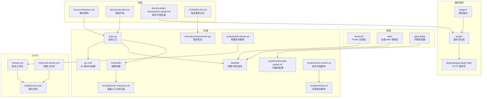

**图示来源**
- [main.go:1-64](file://main.go#L1-L64)
- [go.mod:1-58](file://go.mod#L1-L58)
- [Makefile:1-325](file://Makefile#L1-L325)
- [Dockerfile:1-77](file://Dockerfile#L1-L77)
- [scripts/docker-entrypoint.sh:1-127](file://scripts/docker-entrypoint.sh#L1-L127)
- [scripts/submodule-update.sh:1-69](file://scripts/submodule-update.sh#L1-L69)
- [internal/version/version.go:1-19](file://internal/version/version.go#L1-L19)
- [scripts/bump-version.sh:1-265](file://scripts/bump-version.sh#L1-L265)
- [scripts/release.sh:1-1063](file://scripts/release.sh#L1-L1063)
- [scripts/build-release.sh:1-475](file://scripts/build-release.sh#L1-L475)
- [docs/architecture.md:1-248](file://docs/architecture.md#L1-L248)
- [docs/quick-start.md:1-333](file://docs/quick-start.md#L1-L333)
- [docs/js-plugin-development-guide.md:1-891](file://docs/js-plugin-development-guide.md#L1-L891)
- [plugin/README.md:1-63](file://plugin/README.md#L1-L63)
- [plugin/pkg/go-plugin-http/README.md:1-147](file://plugin/pkg/go-plugin-http/README.md#L1-L147)
- [.gitmodules:1-28](file://.gitmodules#L1-L28)
- [CHANGELOG.md:1-220](file://CHANGELOG.md#L1-L220)
- [build/version.json:1-8](file://build/version.json#L1-L8)
- [.github/workflows/release.yml:1-525](file://.github/workflows/release.yml#L1-L525)
- [.github/workflows/build-and-docker.yml:1-355](file://.github/workflows/build-and-docker.yml#L1-L355)

**章节来源**
- [README.md:398-452](file://README.md#L398-L452)
- [docs/architecture.md:13-37](file://docs/architecture.md#L13-L37)

## 核心组件
- 应用入口与配置
  - 应用入口负责解析配置、初始化应用、启动服务并优雅退出。
  - 配置结构体包含端口、数据库路径、用户名、密码等关键参数。
- 构建与发布
  - Makefile 提供统一的构建、测试、覆盖率、Swagger 生成、Docker 构建与发布命令。
  - Dockerfile 支持多阶段构建与缓存优化，镜像内嵌 ffprobe 以支持音频技术参数提取。
  - 容器入口脚本实现"二进制热替换升级"，保障运行时平滑升级。
- 前端构建
  - Flutter 前端提供并行构建脚本，支持 Web、Linux、Windows、macOS、Android、iOS 多平台产物。
  - Web 控制台使用 Vue 3 + Vite + TypeScript，提供现代化开发体验与 PWA 能力。
- 插件系统
  - 基于 WASM 的插件架构，支持动态扩展功能。
  - go-plugin-http 提供 HTTP 请求能力，解决 WASM 环境下网络请求限制。
- 子模块管理
  - Git 子模块系统管理项目依赖的外部模块，包括插件、前端框架和第三方库。
  - 动态智能子模块更新脚本支持自动检测默认分支并进行更新。
- 版本管理
  - 内置版本信息管理，支持编译时注入版本、Git 提交和构建时间。
  - 自动化版本升级脚本，支持语义化版本控制和发布流程。

**章节来源**
- [main.go:30-63](file://main.go#L30-L63)
- [internal/config/types.go:3-9](file://internal/config/types.go#L3-L9)
- [Makefile:80-116](file://Makefile#L80-L116)
- [Dockerfile:45-77](file://Dockerfile#L45-L77)
- [scripts/docker-entrypoint.sh:76-114](file://scripts/docker-entrypoint.sh#L76-L114)
- [frontend/BUILD_FRONTEND_GUIDE.md:19-55](file://frontend/BUILD_FRONTEND_GUIDE.md#L19-L55)
- [web/package.json:1-35](file://web/package.json#L1-L35)
- [scripts/submodule-update.sh:1-69](file://scripts/submodule-update.sh#L1-L69)
- [internal/version/version.go:1-19](file://internal/version/version.go#L1-L19)
- [scripts/bump-version.sh:1-265](file://scripts/bump-version.sh#L1-L265)

## 架构总览
后端采用"Handlers -> Services -> Database"分层，结合中间件与插件系统；前端通过 Flutter Web 嵌入静态资源并与后端同域通信；数据库使用 modernc.org/sqlite 的纯 Go 实现，避免 CGO 依赖。子模块系统提供灵活的依赖管理机制，支持动态分支检测和智能更新。CI/CD 流程自动化处理版本管理、构建、测试和发布。

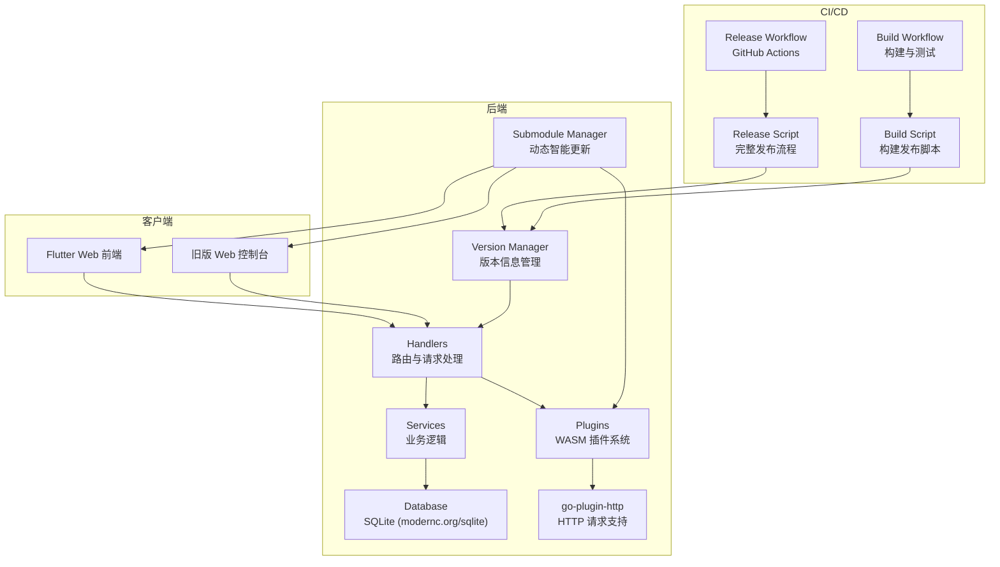

**图示来源**
- [docs/architecture.md:13-37](file://docs/architecture.md#L13-L37)
- [docs/architecture.md:97-200](file://docs/architecture.md#L97-L200)
- [plugin/pkg/go-plugin-http/README.md:1-147](file://plugin/pkg/go-plugin-http/README.md#L1-L147)
- [scripts/submodule-update.sh:10-27](file://scripts/submodule-update.sh#L10-L27)
- [internal/version/version.go:10-18](file://internal/version/version.go#L10-L18)
- [.github/workflows/release.yml:1-525](file://.github/workflows/release.yml#L1-L525)
- [.github/workflows/build-and-docker.yml:1-355](file://.github/workflows/build-and-docker.yml#L1-L355)

**章节来源**
- [docs/architecture.md:13-37](file://docs/architecture.md#L13-L37)
- [docs/architecture.md:97-200](file://docs/architecture.md#L97-L200)

## 详细组件分析

### 应用入口与配置解析
- 入口负责解析配置、初始化应用、启动服务并在收到信号时优雅关闭。
- 配置项包括端口、数据库路径、管理员用户名与密码，支持命令行参数与环境变量。

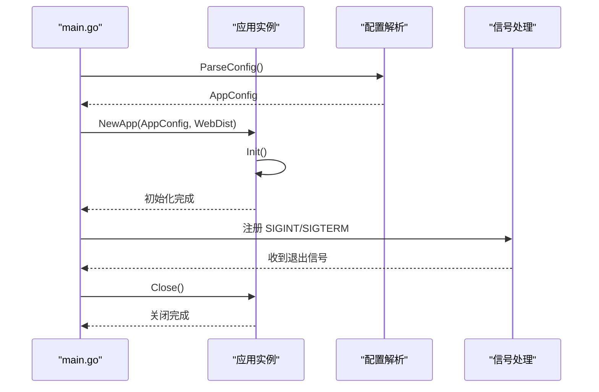

**图示来源**
- [main.go:30-63](file://main.go#L30-L63)

**章节来源**
- [main.go:30-63](file://main.go#L30-L63)
- [internal/config/types.go:3-9](file://internal/config/types.go#L3-L9)

### Docker 部署与热升级
- Dockerfile 使用多阶段构建，先在构建阶段下载依赖并编译，再拷贝到最小化 Alpine 镜像。
- 容器入口脚本在启动时比较镜像与数据卷中二进制版本，若镜像版本更新则进行热替换升级，否则保持现有版本不变。

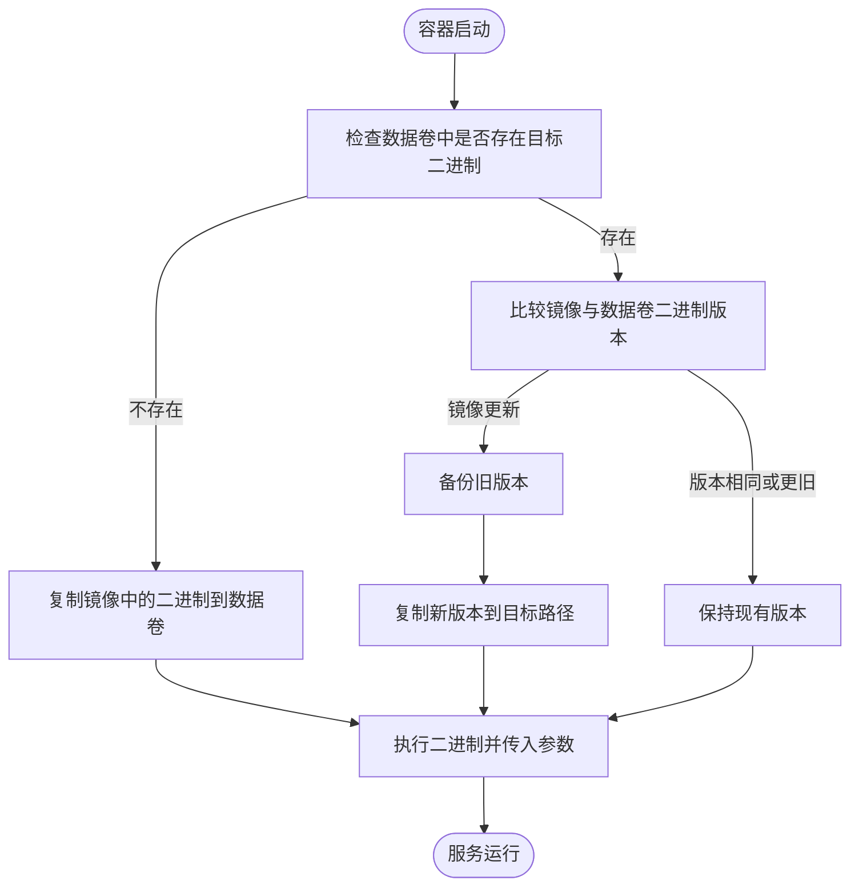

**图示来源**
- [Dockerfile:36-43](file://Dockerfile#L36-L43)
- [scripts/docker-entrypoint.sh:76-114](file://scripts/docker-entrypoint.sh#L76-L114)

**章节来源**
- [Dockerfile:1-77](file://Dockerfile#L1-L77)
- [scripts/docker-entrypoint.sh:1-127](file://scripts/docker-entrypoint.sh#L1-L127)

### 前端并行构建与产物
- Flutter 前端构建脚本支持并行构建多平台产物，日志独立输出，失败时统一汇总。
- 支持在 CI/CD 中按矩阵并行构建，或在 Docker 容器中按需选择平台构建。

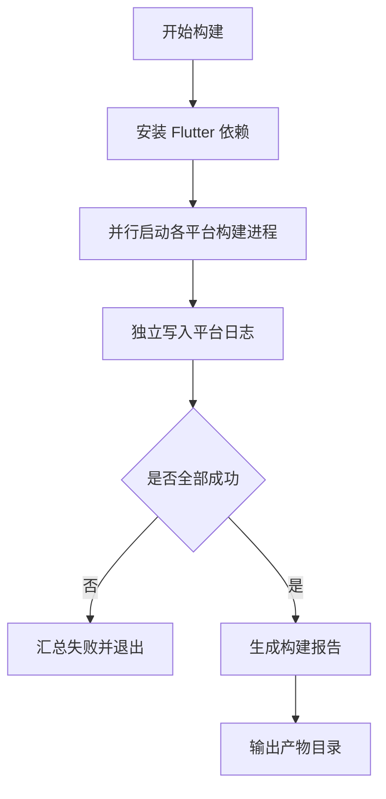

**图示来源**
- [frontend/BUILD_FRONTEND_GUIDE.md:59-77](file://frontend/BUILD_FRONTEND_GUIDE.md#L59-L77)
- [frontend/BUILD_FRONTEND_GUIDE.md:137-192](file://frontend/BUILD_FRONTEND_GUIDE.md#L137-L192)

**章节来源**
- [frontend/BUILD_FRONTEND_GUIDE.md:1-348](file://frontend/BUILD_FRONTEND_GUIDE.md#L1-L348)

### Web 控制台与 TypeScript 配置
- Web 控制台使用 Vue 3 + Vite + TypeScript，严格模式下开启多项 Lint 规则，路径别名配置为 @/*。
- 依赖包括 axios、pinia、vue-router、vite-plugin-pwa 等，支持 PWA 与图标生成脚本。

**章节来源**
- [web/package.json:1-35](file://web/package.json#L1-L35)
- [web/tsconfig.json:1-38](file://web/tsconfig.json#L1-L38)

### 本地开发替换指令配置
**更新** 新增本地开发替换指令配置说明

Songloft 项目支持通过 Go 模块替换指令进行本地开发，特别是针对插件开发场景。项目中包含以下替换指令：

```go
// replace github.com/songloft-org/plugin/pkg/go-plugin-http => ./plugin/pkg/go-plugin-http
```

该指令的作用：
- **本地开发支持**：允许开发者在本地修改 go-plugin-http 模块而不影响主项目的依赖
- **插件开发调试**：便于调试和测试插件相关的 HTTP 功能
- **快速迭代**：无需发布到远程仓库即可测试本地修改

**使用场景**：
1. 当需要修改 go-plugin-http 模块但又不想发布到远程仓库时
2. 在开发插件功能时需要调试 HTTP 请求处理逻辑
3. 进行插件系统相关的功能测试和验证

**章节来源**
- [go.mod:57-58](file://go.mod#L57-L58)
- [plugin/pkg/go-plugin-http/example/go.mod:14](file://plugin/pkg/go-plugin-http/example/go.mod#L14)

### 版本信息管理
**新增** 版本信息管理系统的详细说明

Songloft 项目采用集中式的版本管理机制，确保所有组件使用统一的版本信息：

#### 版本信息结构
- **编译时注入**：版本、Git 提交哈希、构建时间在编译时通过 -ldflags 注入
- **版本格式**：语义化版本号（如 1.3.13），支持主版本、次版本、补丁版本
- **版本来源**：Makefile 中的 VERSION 变量，通过 LDFLAGS 注入到二进制文件

#### 版本信息使用
- **API 文档**：Swagger 注解中包含版本信息
- **健康检查**：版本信息可通过 API 查询
- **升级检测**：客户端可查询可用版本进行升级

**章节来源**
- [internal/version/version.go:1-19](file://internal/version/version.go#L1-L19)
- [Makefile:7-16](file://Makefile#L7-L16)
- [main.go:11-12](file://main.go#L11-L12)

## 子模块管理系统

### 动态智能子模块管理
Songloft 项目采用了全新的动态智能子模块管理系统，替代了传统的静态硬编码方式。该系统能够自动检测和更新各个子模块到其默认远程分支的最新提交。

#### 核心功能特性
- **自动分支检测**：智能检测子模块的默认分支（优先级：origin/HEAD → main → master）
- **递归更新**：支持多层嵌套子模块的递归初始化和更新
- **错误处理机制**：完善的失败模块记录和错误报告
- **路径验证**：自动验证子模块路径的有效性

#### 分支检测算法
系统使用以下智能算法来确定子模块的默认分支：

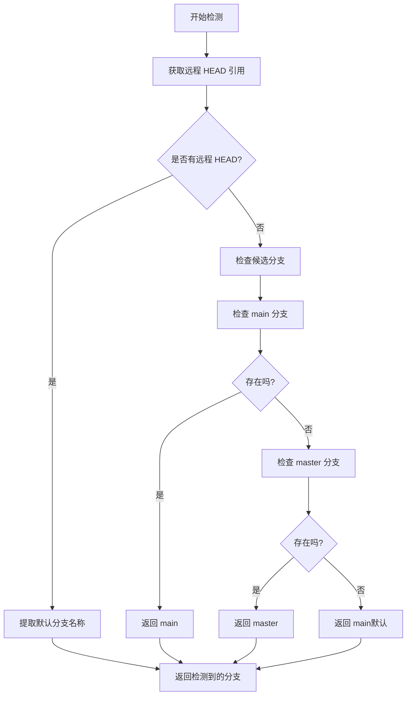

**图示来源**
- [scripts/submodule-update.sh:10-27](file://scripts/submodule-update.sh#L10-L27)

#### 子模块配置管理
项目使用 `.gitmodules` 文件管理所有子模块的配置信息，包括路径、URL 和其他属性。

**章节来源**
- [scripts/submodule-update.sh:1-69](file://scripts/submodule-update.sh#L1-L69)
- [.gitmodules:1-28](file://.gitmodules#L1-L28)

### 子模块更新脚本详解

#### 脚本架构
子模块更新脚本采用 Bash 编写，具备以下核心组件：

1. **环境初始化**：设置错误处理和环境变量
2. **子模块发现**：通过 `git submodule status --recursive` 自动发现所有子模块
3. **分支检测**：智能确定每个子模块的默认分支
4. **更新执行**：切换到指定分支并拉取最新代码
5. **错误处理**：记录失败的子模块并提供详细错误信息

#### 错误处理机制
脚本实现了完善的错误处理和恢复机制：

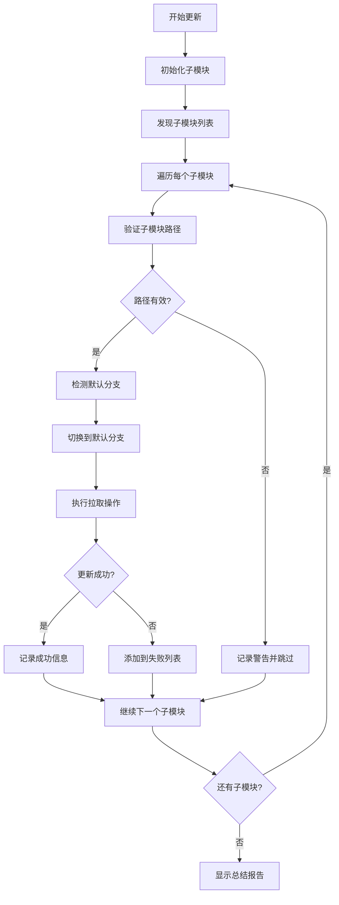

**图示来源**
- [scripts/submodule-update.sh:39-68](file://scripts/submodule-update.sh#L39-L68)

#### 使用示例
```bash
# 基本使用
./scripts/submodule-update.sh

# 输出示例
==> Initializing and updating all submodules...
==> Updating pkg/tag (branch: main)...
    ✓ pkg/tag updated successfully.
==> Updating frontend (branch: main)...
    ✓ frontend updated successfully.
All submodules updated successfully.
```

**章节来源**
- [scripts/submodule-update.sh:1-69](file://scripts/submodule-update.sh#L1-L69)

### 子模块管理最佳实践

#### 开发环境配置
1. **首次初始化**：运行子模块更新脚本初始化所有依赖
2. **定期同步**：定期更新子模块以获取最新功能和修复
3. **分支管理**：根据项目需求选择合适的分支进行开发

#### 生产环境部署
1. **锁定版本**：在生产环境中固定子模块版本以确保稳定性
2. **验证兼容性**：更新前验证子模块的向后兼容性
3. **备份策略**：更新前备份重要数据和配置

**章节来源**
- [scripts/submodule-update.sh:29-37](file://scripts/submodule-update.sh#L29-L37)
- [scripts/submodule-update.sh:41-57](file://scripts/submodule-update.sh#L41-L57)

## 版本管理与发布

### 版本升级自动化
**新增** Songloft 项目提供了完整的版本升级自动化流程，支持语义化版本控制和自动化发布。

#### 版本升级脚本
项目包含两个主要的版本管理脚本：

1. **bump-version.sh** - 无交互版本升级脚本
2. **release.sh** - 完整发布流程脚本

#### 版本升级流程
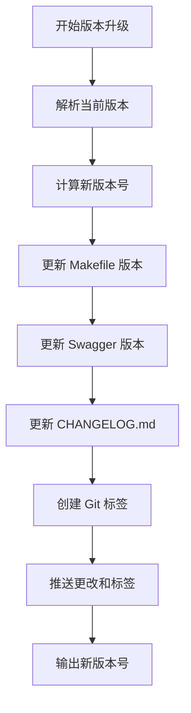

**图示来源**
- [scripts/bump-version.sh:96-125](file://scripts/bump-version.sh#L96-L125)
- [scripts/bump-version.sh:191-250](file://scripts/bump-version.sh#L191-L250)

#### 版本升级类型
支持三种版本升级类型：
- **major**：主版本升级（1.0.0 → 2.0.0）
- **minor**：次版本升级（1.0.0 → 1.1.0）
- **patch**：补丁版本升级（1.0.0 → 1.0.1，默认）

#### 使用示例
```bash
# 补丁版本升级（推荐用于维护性更新）
./scripts/bump-version.sh patch

# 次版本升级（功能更新）
./scripts/bump-version.sh minor

# 主版本升级（重大更新）
./scripts/bump-version.sh major

# 无交互模式
./scripts/bump-version.sh patch --dry-run
```

**章节来源**
- [scripts/bump-version.sh:1-265](file://scripts/bump-version.sh#L1-L265)

### CI/CD 自动化发布
**更新** 新增 CI/CD 自动化发布流程的详细说明

Songloft 项目使用 GitHub Actions 实现完整的自动化发布流程，支持多平台构建、Docker 镜像构建和发布。

#### 发布工作流
项目包含两个主要的 GitHub Actions 工作流：

1. **release.yml** - 完整发布工作流
2. **build-and-docker.yml** - 构建和 Docker 工作流

#### 发布流程
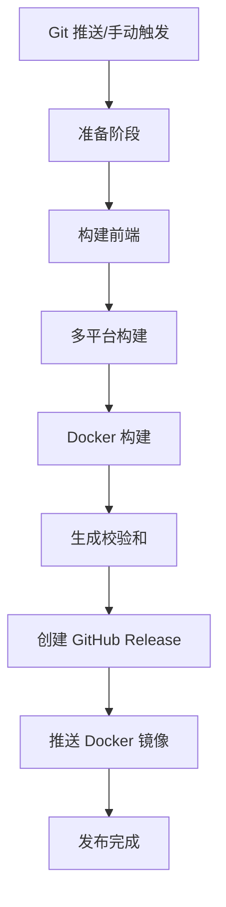

**图示来源**
- [.github/workflows/release.yml:20-82](file://.github/workflows/release.yml#L20-L82)
- [.github/workflows/release.yml:119-227](file://.github/workflows/release.yml#L119-L227)
- [.github/workflows/release.yml:229-424](file://.github/workflows/release.yml#L229-L424)

#### 多平台支持
发布工作流支持以下平台：
- **Linux**：amd64, arm64, armv7
- **macOS**：amd64, arm64  
- **Windows**：amd64, arm64

#### Docker 多架构支持
- **架构支持**：linux/amd64, linux/arm64, linux/arm/v7
- **标签管理**：版本号标签、latest 标签、full 标签
- **镜像导出**：支持 tar 包导出用于离线部署

**章节来源**
- [.github/workflows/release.yml:1-525](file://.github/workflows/release.yml#L1-L525)
- [.github/workflows/build-and-docker.yml:1-355](file://.github/workflows/build-and-docker.yml#L1-L355)

### 版本发布脚本
**新增** 详细的版本发布脚本使用指南

项目提供了两个版本发布脚本，分别用于不同的发布场景：

#### build-release.sh
- **用途**：构建发布到 GitHub Release
- **特点**：完全自动化，适合 CI/CD 环境
- **支持**：多平台构建、Docker 镜像、校验和生成

#### release.sh
- **用途**：交互式完整发布流程
- **特点**：用户友好，适合本地开发环境
- **功能**：版本升级、Changelog 生成、发布到多个平台

**章节来源**
- [scripts/build-release.sh:1-475](file://scripts/build-release.sh#L1-L475)
- [scripts/release.sh:1-1063](file://scripts/release.sh#L1-L1063)

## 依赖分析
- 后端依赖
  - 路由与中间件：Chi v5、CORS
  - 认证：JWT v5
  - 元数据提取：hanxi/tag（dhowden/tag fork）
  - 数据库：modernc.org/sqlite（纯 Go）
  - Swagger：swaggo/http-swagger、swaggo/swag
  - 插件系统：knqyf263/go-plugin、wazero
  - 监控：Tracely SDK
- 前端依赖
  - Flutter：Riverpod、GoRouter、just_audio、dio、permission_handler 等
  - Web 控制台：Vue 3、TypeScript、Tailwind CSS、Vite、Pinia 等
- 插件系统依赖
  - go-plugin-http：提供 HTTP 请求能力，解决 WASM 环境限制
  - 插件协议：基于 Protocol Buffers 的插件通信协议
- 子模块依赖
  - Git 子模块：管理项目外部依赖，支持动态分支检测和智能更新
- 版本管理依赖
  - Go 版本：1.25.6+
  - Flutter 版本：3.41.5
  - Docker：支持多架构构建

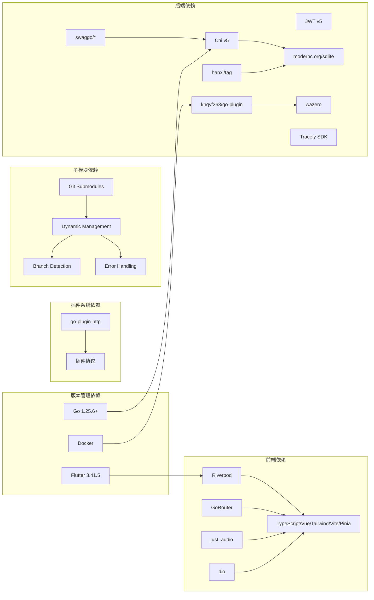

**图示来源**
- [go.mod:5-21](file://go.mod#L5-L21)
- [frontend/pubspec.yaml:11-42](file://frontend/pubspec.yaml#L11-L42)
- [web/package.json:14-32](file://web/package.json#L14-L32)
- [plugin/pkg/go-plugin-http/README.md:1-147](file://plugin/pkg/go-plugin-http/README.md#L1-L147)
- [scripts/submodule-update.sh:10-27](file://scripts/submodule-update.sh#L10-L27)
- [.github/workflows/release.yml:9-14](file://.github/workflows/release.yml#L9-L14)

**章节来源**
- [go.mod:1-58](file://go.mod#L1-L58)
- [frontend/pubspec.yaml:1-60](file://frontend/pubspec.yaml#L1-L60)
- [web/package.json:1-35](file://web/package.json#L1-L35)
- [scripts/submodule-update.sh:1-69](file://scripts/submodule-update.sh#L1-L69)
- [.github/workflows/release.yml:9-14](file://.github/workflows/release.yml#L9-L14)

## 性能考虑
- 构建性能
  - 使用 Makefile 的并行构建与缓存挂载，显著缩短构建时间。
  - Docker 多阶段构建与依赖层缓存，减少重复下载与编译。
  - GitHub Actions 缓存机制，加速依赖下载和构建过程。
- 运行性能
  - SQLite 纯 Go 实现，避免 CGO 依赖，部署更简单且性能稳定。
  - ffprobe 仅用于精确音频技术参数，未安装也可正常运行。
- 前端性能
  - Vite + Bun 的极速开发体验，生产构建自动代码分割与按需加载。
  - Pinia + 持久化插件减少状态丢失与重复请求。
- 插件性能
  - WASM 环境下的单线程执行特性，避免并发开销但需注意性能优化。
- 子模块管理性能
  - 动态智能更新减少了手动维护的工作量，提高了开发效率。
  - 递归更新机制避免了遗漏子模块的风险。
- 版本管理性能
  - 自动化版本升级脚本减少人为错误，提高发布效率。
  - CI/CD 流程自动化处理重复性任务，节省开发时间。

**章节来源**
- [Makefile:176-186](file://Makefile#L176-L186)
- [Dockerfile:33-43](file://Dockerfile#L33-L43)
- [docs/architecture.md:97-116](file://docs/architecture.md#L97-L116)
- [frontend/BUILD_FRONTEND_GUIDE.md:67-76](file://frontend/BUILD_FRONTEND_GUIDE.md#L67-L76)
- [web/package.json:14-32](file://web/package.json#L14-L32)
- [scripts/submodule-update.sh:32-37](file://scripts/submodule-update.sh#L32-L37)
- [scripts/bump-version.sh:128-134](file://scripts/bump-version.sh#L128-L134)

## 故障排查指南
- 构建失败
  - 检查 Flutter 环境与平台依赖（Linux/Windows/macOS/Android/iOS）。
  - 查看各平台独立日志文件定位问题。
  - 验证 Go 版本是否满足要求（1.25.6+）。
- Docker 启动异常
  - 确认数据卷挂载路径与权限，检查容器内二进制版本与镜像版本比较结果。
  - 验证 Docker 版本和 buildx 支持情况。
- 前端开发问题
  - 使用 Vite 的热更新与 TypeScript 类型检查，定位组件与路由问题。
  - 检查 Flutter 版本兼容性（3.41.5）。
- API 认证问题
  - 使用 Swagger UI 进行登录与授权，确认 Access Token 与 Refresh Token 的有效期与撤销状态。
- 插件开发问题
  - 检查 go-plugin-http 模块的本地替换配置是否正确。
  - 验证 WASM 插件的构建参数和运行时环境。
- 子模块管理问题
  - 检查子模块路径的有效性和可访问性。
  - 验证网络连接和 Git 凭据配置。
  - 查看失败模块列表并逐个排查问题。
- 版本管理问题
  - 检查版本号格式是否符合语义化版本规范。
  - 验证 Git 标签创建和推送是否成功。
  - 确认 CI/CD 工作流权限配置。
- CI/CD 发布问题
  - 检查 GitHub Actions 权限和 secrets 配置。
  - 验证 Docker Hub 登录状态和权限。
  - 确认发布仓库的访问权限。

**章节来源**
- [frontend/BUILD_FRONTEND_GUIDE.md:228-269](file://frontend/BUILD_FRONTEND_GUIDE.md#L228-L269)
- [scripts/docker-entrypoint.sh:14-64](file://scripts/docker-entrypoint.sh#L14-L64)
- [README.md:251-352](file://README.md#L251-L352)
- [scripts/submodule-update.sh:43-46](file://scripts/submodule-update.sh#L43-L46)
- [scripts/submodule-update.sh:63-68](file://scripts/submodule-update.sh#L63-L68)
- [scripts/bump-version.sh:146-156](file://scripts/bump-version.sh#L146-L156)
- [.github/workflows/release.yml:482-525](file://.github/workflows/release.yml#L482-L525)

## 结论
本指南提供了 Songloft 项目的开发与运维全景视图：从环境搭建、代码规范、测试策略到构建与部署、调试与性能分析均有明确路径。项目引入了全新的动态智能子模块管理系统，替代了传统的静态硬编码方式，提供了自动分支检测、智能更新和完善的错误处理机制。项目还实现了完整的版本管理自动化和 CI/CD 流程，支持多平台构建、Docker 镜像构建和自动化发布。

**更新** 当前版本 1.3.13 是一个维护性更新版本，包含多个功能改进和 bug 修复。建议开发者遵循 Makefile 提供的一致化命令、Go 与 Dart 的代码风格与测试规范，并充分利用 Docker、并行构建能力、智能子模块管理和自动化版本管理提升开发效率与交付质量。

## 附录

### 开发环境搭建
- 系统要求
  - Go 1.25.6+、ffprobe（可选）、SQLite（内置）
  - Flutter 3.41.5+（用于前端开发）
  - Docker（可选，用于容器化部署）
- 快速启动
  - 使用 Makefile 的 run/run-prod 目标快速启动开发或生产环境。
  - 使用 scripts/bump-version.sh 进行版本升级。
- Docker 部署
  - 使用 Makefile 的 docker-build/docker-run 或直接使用 Dockerfile 构建镜像并运行。
- 插件开发环境
  - 支持本地替换指令进行插件模块的本地开发和测试。
- 子模块管理
  - 使用子模块更新脚本自动管理项目依赖，支持动态分支检测和智能更新。
- 版本管理
  - 使用版本升级脚本进行语义化版本控制和发布流程。

**章节来源**
- [README.md:19-24](file://README.md#L19-L24)
- [README.md:87-93](file://README.md#L87-L93)
- [Makefile:280-290](file://Makefile#L280-L290)
- [Dockerfile:1-77](file://Dockerfile#L1-L77)
- [scripts/submodule-update.sh:1-69](file://scripts/submodule-update.sh#L1-L69)
- [scripts/bump-version.sh:1-265](file://scripts/bump-version.sh#L1-L265)

### 代码规范
- Go 代码规范
  - 使用 Makefile 的 fmt、vet、lint 目标统一格式化、静态检查与 Lint。
  - 遵循 Go 社区标准与内部包命名（internal/）。
- Dart 代码规范
  - Flutter 项目使用 analysis_options.yaml，启用 prefer_const_constructors、avoid_print、prefer_single_quotes 等规则。
- 命名与注释
  - 包命名与接口设计遵循"面向接口、低耦合"的最佳实践。
  - Swagger 注解用于 API 文档生成，确保接口变更后及时更新文档。
- 版本管理规范
  - 使用语义化版本控制（MAJOR.MINOR.PATCH）。
  - 遵循 Conventional Commits 规范编写提交信息。

**章节来源**
- [Makefile:242-260](file://Makefile#L242-L260)
- [frontend/analysis_options.yaml:3-16](file://frontend/analysis_options.yaml#L3-L16)
- [README.md:201-215](file://README.md#L201-L215)
- [README.md:280-285](file://README.md#L280-L285)
- [CHANGELOG.md:1-220](file://CHANGELOG.md#L1-L220)

### 测试策略
- 单元测试与集成测试
  - 使用 Makefile 的 test、test-short、test-unit、test-coverage、bench 目标。
  - 覆盖数据库层、服务层、元数据提取、文件扫描等模块。
- 端到端测试
  - 通过 Swagger UI 与 API 接口进行手动冒烟测试。
- 性能测试
  - 使用 bench 目标运行基准测试，关注内存分配与吞吐量指标。
- CI/CD 测试
  - GitHub Actions 自动化测试，确保每次提交的质量。
  - 多平台测试覆盖不同操作系统和架构。

**章节来源**
- [Makefile:188-217](file://Makefile#L188-L217)
- [README.md:174-200](file://README.md#L174-L200)
- [.github/workflows/release.yml:464-475](file://.github/workflows/release.yml#L464-L475)

### 构建与部署流程
- 构建流程
  - 使用 Makefile 的 build/build-full/build-prod/build-prod-full 等目标，支持多平台与完整版嵌入前端。
  - 支持交叉编译，使用 build-cross 目标进行多平台构建。
- Docker 部署
  - Dockerfile 支持 FULL_BUILD 参数选择完整版或精简版；入口脚本实现热升级。
  - 支持多架构 Docker 镜像构建和推送。
- CI/CD 与版本发布
  - Makefile 提供 release 与 publish 目标，配合脚本完成版本号更新、打包与发布。
  - GitHub Actions 自动化处理版本管理、构建、测试和发布。
  - 支持稳定版和开发版两种发布模式。

**章节来源**
- [Makefile:80-116](file://Makefile#L80-L116)
- [Makefile:305-311](file://Makefile#L305-L311)
- [Dockerfile:36-43](file://Dockerfile#L36-L43)
- [scripts/docker-entrypoint.sh:76-114](file://scripts/docker-entrypoint.sh#L76-L114)
- [scripts/release.sh:1-1063](file://scripts/release.sh#L1-L1063)
- [scripts/build-release.sh:1-475](file://scripts/build-release.sh#L1-L475)

### 开发工具与调试
- Go 工具链
  - 使用 go fmt、go vet、golangci-lint 与测试命令。
- 前端工具链
  - 使用 Vite、TypeScript、Tailwind CSS、Pinia 等，结合 PWA 插件与图标生成脚本。
- 调试方法
  - Swagger UI 认证与接口测试；容器日志与构建日志定位问题。
- 插件开发调试
  - 利用本地替换指令进行插件模块的实时调试。
  - 使用示例项目验证插件功能的正确性。
- 子模块管理调试
  - 使用子模块更新脚本进行依赖问题排查。
  - 检查分支检测逻辑和错误处理机制。
- 版本管理调试
  - 使用版本升级脚本进行版本问题排查。
  - 检查 Git 标签和发布流程。
- CI/CD 调试
  - 使用 GitHub Actions 日志进行问题定位。
  - 检查工作流权限和环境变量配置。

**章节来源**
- [Makefile:242-260](file://Makefile#L242-L260)
- [web/package.json:14-32](file://web/package.json#L14-L32)
- [README.md:251-352](file://README.md#L251-L352)
- [plugin/pkg/go-plugin-http/example/host/main.go:1-84](file://plugin/pkg/go-plugin-http/example/host/main.go#L1-L84)
- [scripts/submodule-update.sh:10-27](file://scripts/submodule-update.sh#L10-L27)
- [scripts/bump-version.sh:128-134](file://scripts/bump-version.sh#L128-L134)
- [.github/workflows/release.yml:482-525](file://.github/workflows/release.yml#L482-L525)

### 插件开发环境配置
**新增** 详细的插件开发环境配置指南

Songloft 的插件开发环境支持多种配置方式，特别针对本地开发进行了优化：

#### 本地替换指令配置
项目提供了灵活的本地开发配置选项：

1. **主项目配置**（go.mod）
   - 通过替换指令指向本地插件模块
   - 适用于需要同时开发主项目和插件的情况

2. **示例项目配置**（example/go.mod）
   - 使用相对路径进行模块替换
   - 便于示例项目的独立开发和测试

#### 插件开发工作流
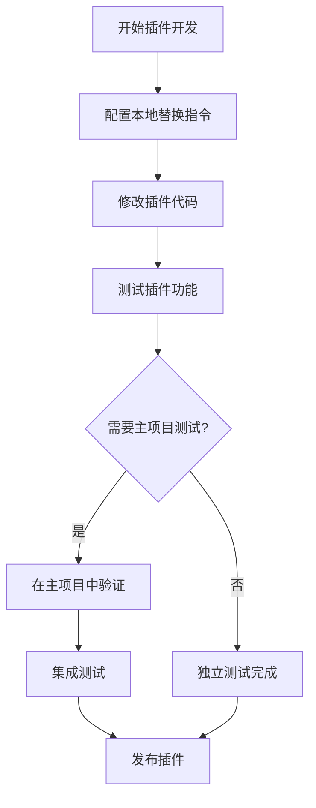

#### 开发工具支持
- **IDE 集成**：支持 GoLand、VS Code 等主流 IDE 的本地替换配置
- **调试支持**：可直接调试本地替换的插件模块
- **热重载**：支持插件代码的热重载和实时测试

**章节来源**
- [plugin/pkg/go-plugin-http/README.md:1-147](file://plugin/pkg/go-plugin-http/README.md#L1-L147)
- [plugin/pkg/go-plugin-http/example/go.mod:14](file://plugin/pkg/go-plugin-http/example/go.mod#L14)
- [plugin/pkg/go-plugin-http/example/host/main.go:1-84](file://plugin/pkg/go-plugin-http/example/host/main.go#L1-L84)
- [docs/js-plugin-development-guide.md:1-891](file://docs/js-plugin-development-guide.md#L1-L891)

### 子模块管理使用指南

#### 基本使用
1. **初始化子模块**
   ```bash
   ./scripts/submodule-update.sh
   ```

2. **更新所有子模块**
   - 脚本会自动检测每个子模块的默认分支
   - 支持递归更新嵌套子模块
   - 提供详细的进度和错误信息

#### 高级配置
1. **自定义分支检测**
   - 支持优先检测 `origin/HEAD` 引用
   - 回退到 `main` 和 `master` 分支
   - 默认使用 `main` 作为最终回退选项

2. **错误处理配置**
   - 失败的子模块会被记录到列表中
   - 提供详细的错误信息和建议
   - 支持部分失败的继续执行

#### 最佳实践
1. **开发环境**
   - 定期运行子模块更新脚本保持依赖最新
   - 使用动态分支检测获取最新功能
   - 监控失败模块列表及时处理问题

2. **生产环境**
   - 固定子模块版本确保稳定性
   - 在部署前验证子模块兼容性
   - 建立子模块更新的审批流程

**章节来源**
- [scripts/submodule-update.sh:1-69](file://scripts/submodule-update.sh#L1-L69)
- [scripts/submodule-update.sh:10-27](file://scripts/submodule-update.sh#L10-L27)
- [scripts/submodule-update.sh:39-68](file://scripts/submodule-update.sh#L39-L68)

### 版本管理最佳实践
**新增** 版本管理的最佳实践指南

#### 版本升级策略
1. **维护性更新**（Patch）
   - 用于 bug 修复和小功能改进
   - 自动化升级，适合日常维护
   - 保持向后兼容性

2. **功能更新**（Minor）
   - 用于新功能添加
   - 可能包含破坏性变更
   - 需要充分测试

3. **重大更新**（Major）
   - 用于重大架构变更
   - 破坏性变更较多
   - 需要详细的迁移指南

#### 版本发布流程
1. **本地测试**
   - 在本地环境验证版本升级
   - 运行完整的测试套件
   - 检查兼容性问题

2. **CI/CD 流程**
   - GitHub Actions 自动化测试
   - 多平台构建验证
   - Docker 镜像构建

3. **发布验证**
   - 手动测试关键功能
   - 验证 API 兼容性
   - 检查文档更新

#### 版本回滚策略
1. **快速回滚**
   - 使用 Docker 标签管理
   - 支持版本回滚到上一个稳定版本
   - 自动化回滚脚本

2. **数据迁移**
   - 数据库迁移脚本
   - 配置文件兼容性检查
   - 插件兼容性验证

**章节来源**
- [scripts/bump-version.sh:96-125](file://scripts/bump-version.sh#L96-L125)
- [scripts/bump-version.sh:191-250](file://scripts/bump-version.sh#L191-L250)
- [scripts/release.sh:175-182](file://scripts/release.sh#L175-L182)
- [.github/workflows/release.yml:482-525](file://.github/workflows/release.yml#L482-L525)