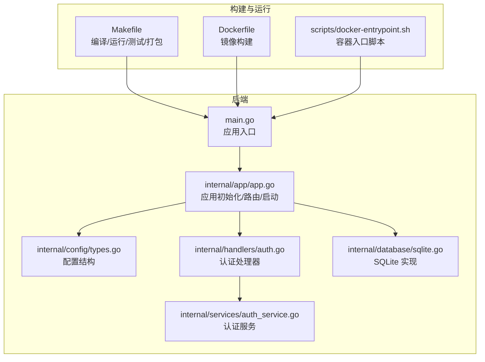
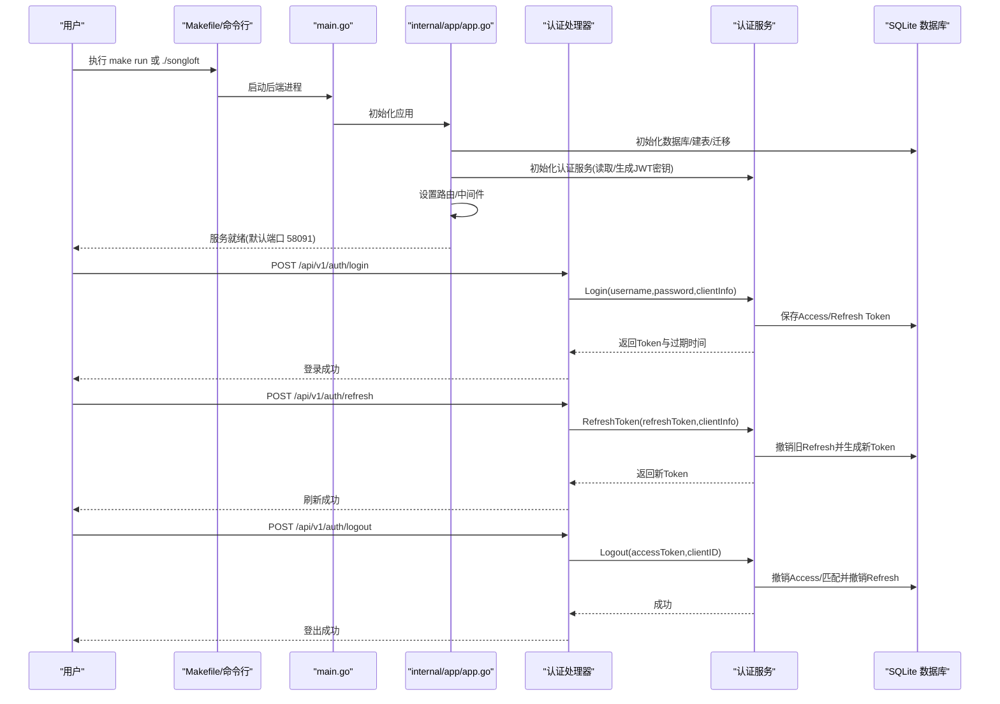
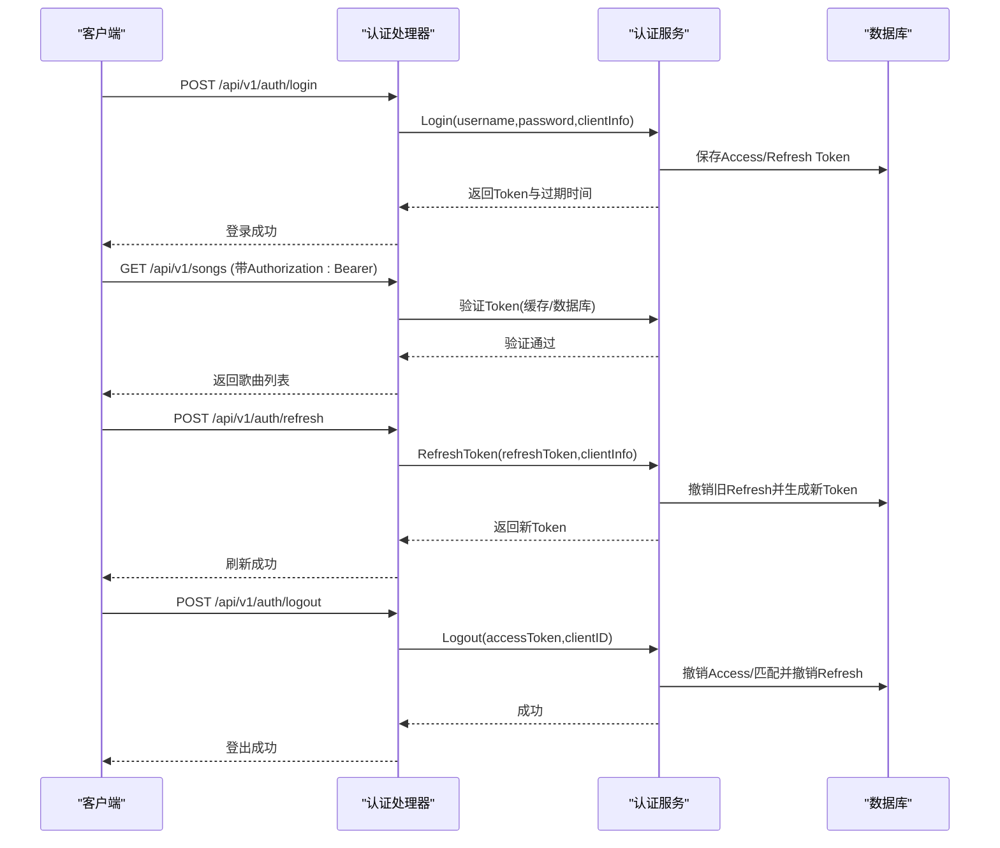
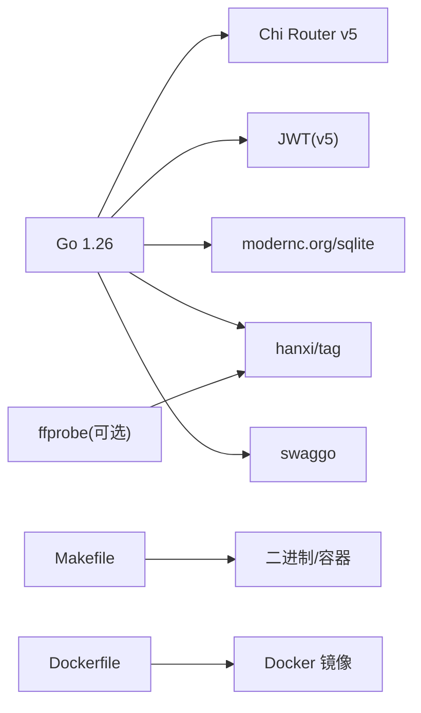

# 快速开始

<cite>
**本文引用的文件**
- [README.md](file://README.md)
- [docs/quick-start.md](file://docs/quick-start.md)
- [Makefile](file://Makefile)
- [go.mod](file://go.mod)
- [main.go](file://main.go)
- [internal/app/app.go](file://internal/app/app.go)
- [internal/config/types.go](file://internal/config/types.go)
- [internal/handlers/auth.go](file://internal/handlers/auth.go)
- [internal/services/auth_service.go](file://internal/services/auth_service.go)
- [internal/database/sqlite.go](file://internal/database/sqlite.go)
- [Dockerfile](file://Dockerfile)
- [scripts/docker-entrypoint.sh](file://scripts/docker-entrypoint.sh)
- [docs/FAQ.md](file://docs/FAQ.md)
</cite>

## 目录
1. [简介](#简介)
2. [项目结构](#项目结构)
3. [核心组件](#核心组件)
4. [架构总览](#架构总览)
5. [详细组件分析](#详细组件分析)
6. [依赖关系分析](#依赖关系分析)
7. [性能注意事项](#性能注意事项)
8. [故障排除指南](#故障排除指南)
9. [结论](#结论)
10. [附录](#附录)

## 简介
本指南面向首次接触 Songloft 的用户，帮助你在最短时间内完成环境准备、安装与运行，并掌握基础认证流程（登录获取 Token、使用 Access Token 访问受保护接口、刷新 Token、登出）。同时提供 Docker 部署、常见启动问题排查与故障排除方法，确保你能顺利体验核心功能。

## 项目结构
Songloft 采用 Go 语言开发，后端提供 RESTful API，内置 SQLite 存储，支持 JWT 双 Token 认证，提供 Swagger 文档与 Docker 镜像。前端可独立部署或嵌入后端，亦可配合 Flutter 客户端使用。

**图示来源**
- [main.go:30-63](file://main.go#L30-L63)
- [internal/app/app.go:44-226](file://internal/app/app.go#L44-L226)
- [internal/config/types.go:3-9](file://internal/config/types.go#L3-L9)
- [internal/handlers/auth.go:15-254](file://internal/handlers/auth.go#L15-L254)
- [internal/services/auth_service.go:24-461](file://internal/services/auth_service.go#L24-L461)
- [internal/database/sqlite.go:12-53](file://internal/database/sqlite.go#L12-L53)
- [Makefile:80-116](file://Makefile#L80-L116)
- [Dockerfile:45-77](file://Dockerfile#L45-L77)
- [scripts/docker-entrypoint.sh:76-127](file://scripts/docker-entrypoint.sh#L76-L127)

**章节来源**
- [README.md:19-479](file://README.md#L19-L479)
- [docs/quick-start.md:1-333](file://docs/quick-start.md#L1-L333)
- [Makefile:1-325](file://Makefile#L1-L325)
- [Dockerfile:1-77](file://Dockerfile#L1-L77)

## 核心组件
- 应用入口与启动
  - main.go 负责解析配置、初始化应用并启动 HTTP 服务。
- 应用初始化与配置
  - internal/app/app.go 负责解析命令行与环境变量、初始化数据库、服务层、插件管理器、Tracely 监控，并设置路由。
  - internal/config/types.go 定义 AppConfig 结构，包含端口、数据库路径、管理员用户名与密码。
- 认证与 Token 管理
  - internal/handlers/auth.go 提供登录、登出、刷新 Token、列出与撤销 Token 的接口。
  - internal/services/auth_service.go 实现登录、登出、刷新 Token、验证 Token、列出与撤销 Token 等逻辑，使用 JWT 双 Token（Access/Refresh）。
- 数据库
  - internal/database/sqlite.go 使用 modernc.org/sqlite 驱动，开启 WAL、超时与缓存优化，自动建表与迁移。
- 构建与运行
  - Makefile 提供 build/run/test 等常用命令，支持开发/生产环境、跨平台编译与 Docker 构建。
  - Dockerfile 基于 Alpine，内置 ffprobe，ENTRYPOINT 支持热替换升级。
  - scripts/docker-entrypoint.sh 实现镜像版本与数据目录版本对比与热更新。

**章节来源**
- [main.go:30-63](file://main.go#L30-L63)
- [internal/app/app.go:27-352](file://internal/app/app.go#L27-L352)
- [internal/config/types.go:3-9](file://internal/config/types.go#L3-L9)
- [internal/handlers/auth.go:15-254](file://internal/handlers/auth.go#L15-L254)
- [internal/services/auth_service.go:24-461](file://internal/services/auth_service.go#L24-L461)
- [internal/database/sqlite.go:12-53](file://internal/database/sqlite.go#L12-L53)
- [Makefile:80-116](file://Makefile#L80-L116)
- [Dockerfile:45-77](file://Dockerfile#L45-L77)
- [scripts/docker-entrypoint.sh:76-127](file://scripts/docker-entrypoint.sh#L76-L127)

## 架构总览
下面的时序图展示了从启动到认证的关键流程，以及 Docker 部署的入口脚本如何处理版本与热替换。

**图示来源**
- [main.go:30-63](file://main.go#L30-L63)
- [internal/app/app.go:64-226](file://internal/app/app.go#L64-L226)
- [internal/handlers/auth.go:27-134](file://internal/handlers/auth.go#L27-L134)
- [internal/services/auth_service.go:94-164](file://internal/services/auth_service.go#L94-L164)
- [internal/services/auth_service.go:245-324](file://internal/services/auth_service.go#L245-L324)
- [internal/services/auth_service.go:212-243](file://internal/services/auth_service.go#L212-L243)

## 详细组件分析

### 环境准备与安装
- Go 版本要求
  - 项目要求 Go 1.26+，Makefile 中也声明了 GO_VERSION=1.26。
- ffprobe 工具
  - 可选依赖，用于获取音频技术参数；Docker 镜像内已包含，本地开发需自行安装 ffmpeg 工具集。
- SQLite 环境
  - 内置支持，使用 modernc.org/sqlite（纯 Go，无需 CGO），自动建表与迁移。
- Docker 镜像
  - Dockerfile 基于 Alpine，COPY ffprobe，ENTRYPOINT 支持热替换升级。

**章节来源**
- [README.md:19-23](file://README.md#L19-L23)
- [go.mod:3](file://go.mod#L3)
- [Makefile:4](file://Makefile#L4)
- [Dockerfile:54-55](file://Dockerfile#L54-L55)
- [internal/database/sqlite.go:24-50](file://internal/database/sqlite.go#L24-L50)

### 多种安装与运行方式
- 使用 Makefile（推荐）
  - 开发环境：make run（默认管理员 admin/admin，端口 58091）
  - 生产环境：make run-prod（不含 Swagger）
  - 编译：make build / build-prod / build-all-prod
  - 测试：make test / test-coverage
- 直接编译运行
  - go run . -username admin -password admin -port 58091
- Docker 部署
  - 构建镜像：make docker-build
  - 运行容器：make docker-run（或 docker run -p 58091:58091 songloft/songloft:latest）
  - 容器入口脚本支持热替换升级，自动比较镜像与数据目录版本并决定是否升级。

**章节来源**
- [README.md:40-96](file://README.md#L40-L96)
- [Makefile:231-241](file://Makefile#L231-L241)
- [Makefile:280-289](file://Makefile#L280-L289)
- [Dockerfile:45-77](file://Dockerfile#L45-L77)
- [scripts/docker-entrypoint.sh:76-127](file://scripts/docker-entrypoint.sh#L76-L127)

### 认证使用示例（登录/访问/刷新/登出）
- 登录获取 Token
  - POST /api/v1/auth/login
  - 请求体包含用户名与密码
  - 成功返回 access_token、refresh_token、expires_in、token_type
- 使用 Access Token 访问受保护接口
  - 在请求头 Authorization: Bearer <access_token>
  - 示例：GET /api/v1/songs
- 刷新 Token
  - POST /api/v1/auth/refresh
  - 请求体包含 refresh_token
  - 成功返回新的 access_token 与 refresh_token
- 登出
  - POST /api/v1/auth/logout
  - 需携带当前 Bearer Token，服务端撤销当前会话的 Access/Refresh Token

**图示来源**
- [internal/handlers/auth.go:27-134](file://internal/handlers/auth.go#L27-L134)
- [internal/services/auth_service.go:94-164](file://internal/services/auth_service.go#L94-L164)
- [internal/services/auth_service.go:245-324](file://internal/services/auth_service.go#L245-L324)
- [internal/services/auth_service.go:212-243](file://internal/services/auth_service.go#L212-L243)

**章节来源**
- [README.md:97-142](file://README.md#L97-L142)
- [docs/quick-start.md:226-256](file://docs/quick-start.md#L226-L256)

### 配置方式（命令行与环境变量）
- 命令行参数（推荐）
  - -username、-password、-port、-db、-help、-version
- 环境变量
  - ADMIN_USERNAME、ADMIN_PASSWORD、LISTEN_PORT、DB_PATH
- 优先级：命令行参数 > 环境变量

**章节来源**
- [README.md:354-385](file://README.md#L354-L385)
- [internal/app/app.go:287-352](file://internal/app/app.go#L287-L352)

### 数据库与存储
- SQLite
  - 自动建表与迁移，开启 WAL、busy_timeout、cache_size、foreign_keys 等优化
  - 连接池参数：最大打开/空闲连接与生命周期
- 目录结构
  - music：音乐文件目录（默认 ./music）
  - data：应用数据目录（默认 ./data）

**章节来源**
- [internal/database/sqlite.go:24-50](file://internal/database/sqlite.go#L24-L50)
- [docs/quick-start.md:175-204](file://docs/quick-start.md#L175-L204)

## 依赖关系分析
- 语言与框架
  - Go 1.26+，Chi Router v5，JWT，SQLite3（modernc.org/sqlite）
- 外部工具
  - ffprobe（可选，Docker 镜像内置）
- 构建与打包
  - Makefile 提供跨平台编译、测试、压缩（UPX）、Swagger 生成
  - Dockerfile 支持 FULL_BUILD 参数选择完整版/精简版

**图示来源**
- [go.mod:5-21](file://go.mod#L5-L21)
- [Makefile:80-116](file://Makefile#L80-L116)
- [Dockerfile:45-77](file://Dockerfile#L45-L77)

**章节来源**
- [README.md:387-452](file://README.md#L387-L452)
- [go.mod:3](file://go.mod#L3)

## 性能注意事项
- SQLite 优化
  - WAL 模式、busy_timeout、cache_size、foreign_keys 等参数提升并发与稳定性
  - 连接池参数限制并发写入压力
- 编译优化
  - 生产环境编译默认启用 -s -w，可选 UPX 压缩
- Docker 热替换
  - ENTRYPOINT 自动比较版本，仅在新版本时替换二进制，减少停机时间

**章节来源**
- [internal/database/sqlite.go:24-41](file://internal/database/sqlite.go#L24-L41)
- [Makefile:96-103](file://Makefile#L96-L103)
- [scripts/docker-entrypoint.sh:86-114](file://scripts/docker-entrypoint.sh#L86-L114)

## 故障排除指南
- 端口占用或权限问题
  - 确认端口 58091 未被占用；必要时切换端口或使用 sudo（不推荐）
- 管理员凭据错误
  - 通过命令行参数或环境变量设置 ADMIN_USERNAME/ADMIN_PASSWORD
- ffprobe 未安装
  - 可选依赖，不影响基本功能；若需精确音频参数，安装 ffmpeg 工具集
- Docker 卷路径
  - 使用绝对路径挂载 /app/music 与 /app/data
- 版本与升级
  - 使用 -help 查看命令行帮助；Docker 入口脚本支持热替换升级
- 常见问题汇总
  - 参考 FAQ：端口、格式支持、扫描、升级、API 使用、系统要求等

**章节来源**
- [docs/FAQ.md:16-125](file://docs/FAQ.md#L16-L125)
- [README.md:354-385](file://README.md#L354-L385)
- [Dockerfile:66-73](file://Dockerfile#L66-L73)

## 结论
通过本快速开始指南，你已完成环境准备、安装与运行，并掌握了认证流程与常见问题排查方法。建议在本地或 Docker 中先行体验，随后结合 Flutter 客户端或独立前端进一步探索功能。

## 附录
- 快速命令清单
  - make run / make run-prod
  - make build / make build-prod
  - make docker-build / make docker-run
  - ./songloft -username admin -password admin -port 58091
- Swagger 文档
  - 开发环境访问 http://localhost:58091/swagger/index.html
- API 列表（公开/认证）
  - 公开：/api/v1/health、/api/v1/version、/api/v1/auth/login、/api/v1/auth/refresh
  - 认证：/api/v1/auth/login、/api/v1/auth/refresh、/api/v1/auth/logout、/api/v1/auth/tokens、/api/v1/songs、/api/v1/playlists、/api/v1/configs、/api/v1/scan、/api/v1/plugins、/api/v1/upgrade

**章节来源**
- [README.md:251-353](file://README.md#L251-L353)
- [docs/quick-start.md:283-333](file://docs/quick-start.md#L283-L333)