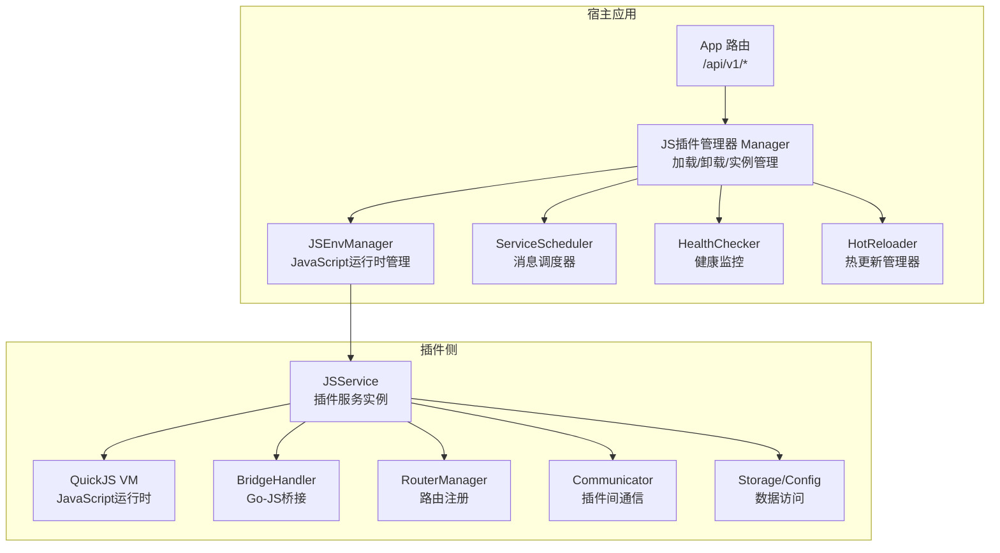
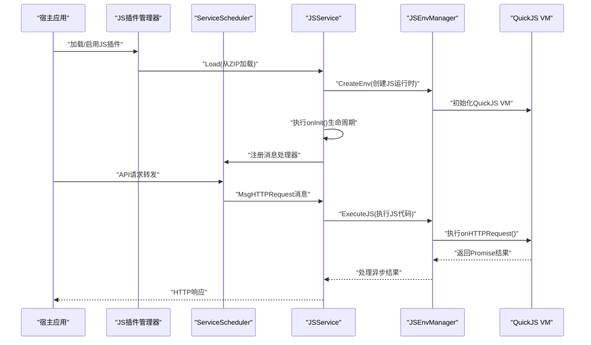
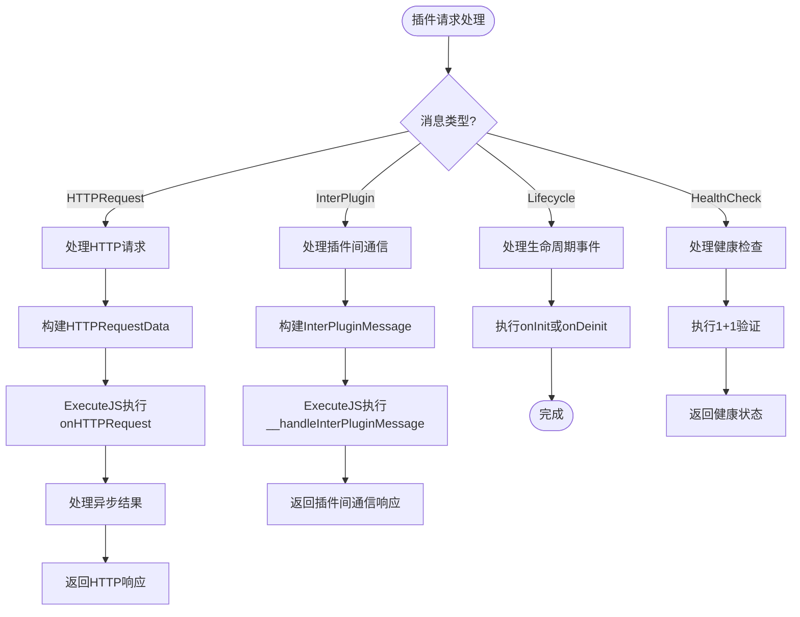
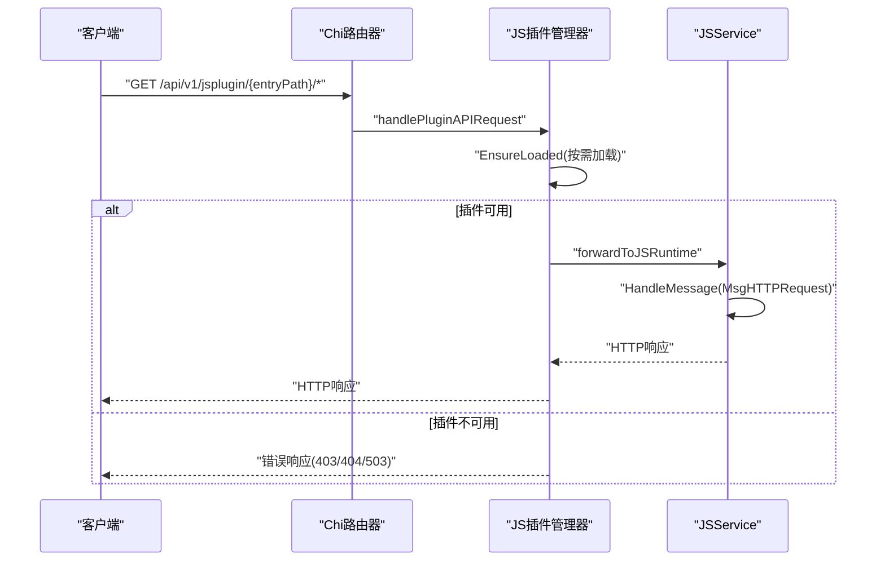
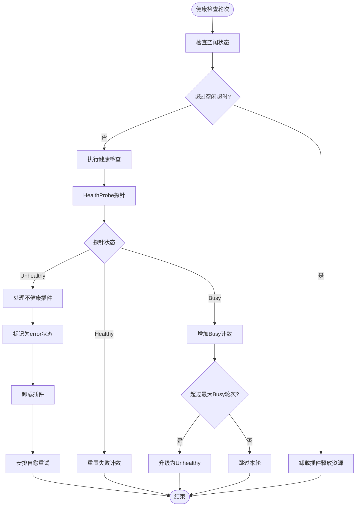
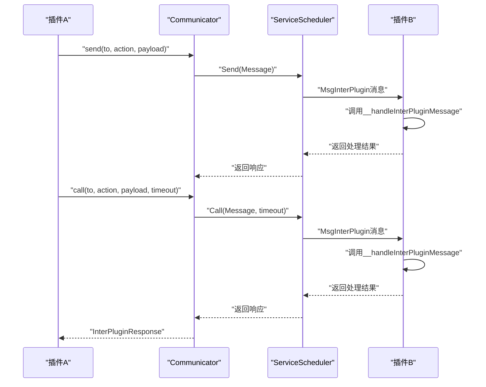
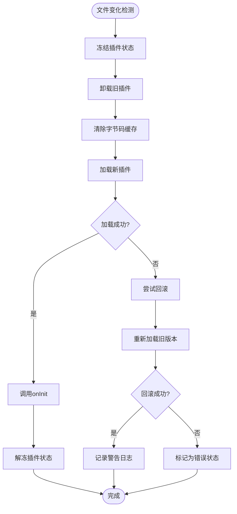
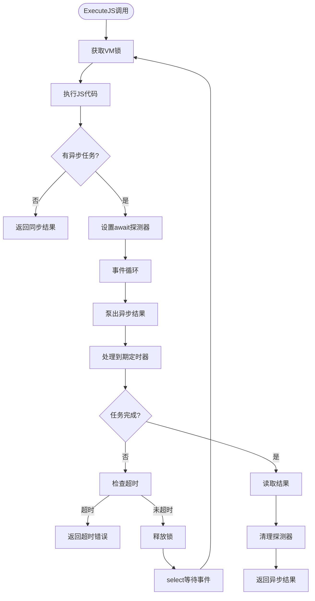
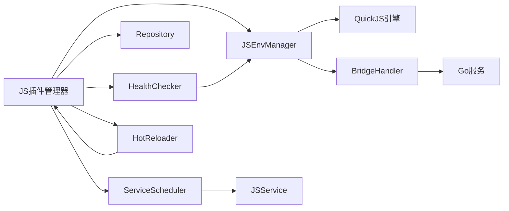

# 插件开发框架

<cite>
**本文档引用的文件**
- [internal/jsplugin/manager.go](file://internal/jsplugin/manager.go)
- [internal/jsplugin/service.go](file://internal/jsplugin/service.go)
- [internal/jsplugin/routes.go](file://internal/jsplugin/routes.go)
- [internal/jsplugin/communication.go](file://internal/jsplugin/communication.go)
- [internal/jsplugin/health.go](file://internal/jsplugin/health.go)
- [internal/jsplugin/hot_reload.go](file://internal/jsplugin/hot_reload.go)
- [internal/jsruntime/runtime.go](file://internal/jsruntime/runtime.go)
- [internal/jsplugin/plugin.go](file://internal/jsplugin/plugin.go)
- [jsplugins-src/songloft-jsplugin-lxmusic/src/main.ts](file://jsplugins-src/songloft-jsplugin-lxmusic/src/main.ts)
- [jsplugins-src/songloft-jsplugin-xiaomi/src/main.ts](file://jsplugins-src/songloft-jsplugin-xiaomi/src/main.ts)
- [jsplugins/lxmusic.json](file://jsplugins/lxmusic.json)
- [jsplugins/xiaomi.json](file://jsplugins/xiaomi.json)
- [internal/app/routers.go](file://internal/app/routers.go)
- [internal/handlers/plugin.go](file://internal/handlers/plugin.go)
- [internal/database/sqlite_plugin.go](file://internal/database/sqlite_plugin.go)
- [docs/js-plugin-development-guide.md](file://docs/js-plugin-development-guide.md)
- [internal/app/app.go](file://internal/app/app.go)
- [internal/services/config_service.go](file://internal/services/config_service.go)
- [internal/handlers/config.go](file://internal/handlers/config.go)
- [internal/database/schema.go](file://internal/database/schema.go)
- [internal/database/sqlite_config.go](file://internal/database/sqlite_config.go)
- [plugins/songloft-plugin-cloudflared/static/js/common.js](file://plugins/songloft-plugin-cloudflared/static/js/common.js)
- [plugins/songloft-plugin-cloudflared/static/js/app.js](file://plugins/songloft-plugin-cloudflared/static/js/app.js)
</cite>

## 更新摘要
**所做更改**
- 重大架构迁移：从WASM插件系统完全迁移到JavaScript插件系统
- 新增异步插件开发支持：支持async/await语法和Promise链
- 引入健康监控系统：自动健康检查、错误状态管理和自愈机制
- 实现插件间通信：支持插件间的异步消息传递和同步调用
- 添加热更新功能：支持插件的无感热更新和回滚
- 优化路由注册机制：支持更灵活的HTTP路由处理
- 增强静态资源服务：支持HTML注入和SPA路由

## 目录
1. [简介](#简介)
2. [项目结构](#项目结构)
3. [核心组件](#核心组件)
4. [架构总览](#架构总览)
5. [详细组件分析](#详细组件分析)
6. [依赖分析](#依赖分析)
7. [性能考虑](#性能考虑)
8. [故障排查指南](#故障排查指南)
9. [结论](#结论)
10. [附录](#附录)

## 简介
本文件面向插件开发者，系统性阐述 Songloft JavaScript 插件开发框架的接口定义、路由注册机制、异步插件开发、健康监控、插件间通信、热更新等功能。框架基于 QuickJS JavaScript 引擎，采用进程内运行时管理，提供稳定的生命周期管理、异步回调处理、静态资源服务以及丰富的插件间通信能力。

**更新** 插件开发框架已从WASM插件系统完全迁移到JavaScript插件系统，支持现代JavaScript开发方式，提供更强大的异步处理能力和更丰富的生态系统。

## 项目结构
围绕JavaScript插件开发的关键目录与文件如下：
- JS插件管理器：internal/jsplugin/manager.go
- JS插件服务：internal/jsplugin/service.go
- 路由注册与处理：internal/jsplugin/routes.go
- 插件间通信：internal/jsplugin/communication.go
- 健康监控：internal/jsplugin/health.go
- 热更新：internal/jsplugin/hot_reload.go
- JavaScript运行时：internal/jsruntime/runtime.go
- 插件元数据定义：internal/jsplugin/plugin.go
- 官方插件示例：jsplugins-src/songloft-jsplugin-*
- 插件发布配置：jsplugins/*



**图表来源**
- [internal/jsplugin/manager.go:32-53](file://internal/jsplugin/manager.go#L32-L53)
- [internal/jsplugin/service.go:61-71](file://internal/jsplugin/service.go#L61-L71)
- [internal/jsruntime/runtime.go:132-138](file://internal/jsruntime/runtime.go#L132-L138)
- [internal/jsplugin/health.go:56-71](file://internal/jsplugin/health.go#L56-L71)
- [internal/jsplugin/hot_reload.go:14-24](file://internal/jsplugin/hot_reload.go#L14-L24)

**章节来源**
- [internal/jsplugin/manager.go:32-53](file://internal/jsplugin/manager.go#L32-L53)
- [internal/jsplugin/service.go:61-71](file://internal/jsplugin/service.go#L61-L71)
- [internal/jsruntime/runtime.go:132-138](file://internal/jsruntime/runtime.go#L132-L138)

## 核心组件
- **JS插件管理器 Manager**：负责JS插件的加载、卸载、生命周期管理、资源清理与健康检查。
- **JSService**：代表一个运行中的JS插件实例，管理插件状态、消息处理和生命周期回调。
- **JSEnvManager**：管理多个JavaScript运行时环境，提供进程内运行时管理、异步任务处理和桥接回调。
- **ServiceScheduler**：消息调度器，负责插件间消息的分发和处理。
- **HealthChecker**：健康监控系统，提供自动健康检查、错误状态管理和自愈机制。
- **HotReloader**：热更新管理器，支持插件的无感热更新和回滚功能。
- **BridgeHandler**：Go-JS桥接处理器，提供数据访问、存储操作和配置管理能力。
- **Communicator**：插件间通信管理器，支持异步消息发送和同步调用。
- **异步插件开发**：支持async/await语法、Promise链和真正的异步处理。
- **健康监控系统**：自动检测插件状态，提供指数退避自愈机制。
- **插件间通信**：支持插件间的异步消息传递和同步调用，提供超时控制。
- **热更新功能**：支持插件文件变化的自动检测和无感热更新。

**更新** 新增JavaScript插件系统的核心组件，提供现代化的插件开发体验。

**章节来源**
- [internal/jsplugin/manager.go:32-53](file://internal/jsplugin/manager.go#L32-L53)
- [internal/jsplugin/service.go:61-71](file://internal/jsplugin/service.go#L61-L71)
- [internal/jsruntime/runtime.go:132-138](file://internal/jsruntime/runtime.go#L132-L138)
- [internal/jsplugin/health.go:56-71](file://internal/jsplugin/health.go#L56-L71)
- [internal/jsplugin/hot_reload.go:14-24](file://internal/jsplugin/hot_reload.go#L14-L24)

## 架构总览
下图展示JavaScript插件系统与传统WASM插件系统的架构差异，包括路由注册、HTTP调用、异步处理、健康监控和插件间通信。



**图表来源**
- [internal/jsplugin/manager.go:159-201](file://internal/jsplugin/manager.go#L159-L201)
- [internal/jsplugin/service.go:87-214](file://internal/jsplugin/service.go#L87-L214)
- [internal/jsruntime/runtime.go:295-429](file://internal/jsruntime/runtime.go#L295-L429)

## 详细组件分析

### JS插件管理器与生命周期
- **Manager**：JS插件系统的入口和协调器，负责插件的加载、卸载、健康检查和热更新。
- **JSService**：插件服务实例，管理插件状态、消息处理和生命周期回调。
- **生命周期管理**：
  - Load：从ZIP文件加载插件代码，创建JS运行时环境。
  - Init：执行插件的onInit()生命周期回调。
  - Deinit：执行插件的onDeinit()生命周期回调。
  - Stop：停止服务并销毁JS运行时环境。

```mermaid
classDiagram
class Manager {
+repo Repository
+packager PackageManager
+scheduler ServiceScheduler
+jsManager JSEnvManager
+services sync.Map
+pluginsDir string
+pluginsDataDir string
+router chi.Router
+db database.DB
+authService *services.AuthService
+pluginToken string
+healthChecker *HealthChecker
+hotReloader *HotReloader
+Start(ctx) error
+LoadPlugin(ctx, plugin) error
+UnloadPlugin(ctx, entryPath) error
+ReloadPlugin(ctx, entryPath) error
+EnablePlugin(ctx, id) error
+DisablePlugin(ctx, id) error
}
class JSService {
-plugin *JSPlugin
-envID string
-scheduler *ServiceScheduler
-jsManager *jsruntime.JSEnvManager
-bridgeHandler *BridgeHandler
-status ServiceStatus
-lastActive time.Time
-timerStop chan struct{}
+Load(pluginsDir, dataDir) error
+Init() error
+Deinit() error
+Stop() error
+HandleMessage(msg) *Message
}
class JSEnvManager {
-envs map[string]*JSEnv
-pluginEnvs map[int64]map[string]bool
-shutdownCh chan struct{}
+CreateEnv(envID, initCode, pluginID) error
+CreateEnvWithBytecode(envID, bootstrapCode, bytecode, pluginID) error
+ExecuteJS(envID, code, timeoutMs) (*ExecuteResult, error)
+ExecuteJSAndWaitEvents(envID, code, timeoutMs, waitEventNames) (*ExecuteResult, error)
+DestroyEnv(envID) error
+DestroyPluginEnvs(pluginID) error
}
Manager --> JSService : "管理"
Manager --> JSEnvManager : "使用"
JSService --> JSEnvManager : "执行JS代码"
```

**图表来源**
- [internal/jsplugin/manager.go:32-53](file://internal/jsplugin/manager.go#L32-L53)
- [internal/jsplugin/service.go:61-82](file://internal/jsplugin/service.go#L61-L82)
- [internal/jsruntime/runtime.go:132-149](file://internal/jsruntime/runtime.go#L132-L149)

**章节来源**
- [internal/jsplugin/manager.go:32-53](file://internal/jsplugin/manager.go#L32-L53)
- [internal/jsplugin/service.go:61-82](file://internal/jsplugin/service.go#L61-L82)
- [internal/jsruntime/runtime.go:132-149](file://internal/jsruntime/runtime.go#L132-L149)

### 异步插件开发与消息处理
- **异步支持**：插件函数支持async/await语法，JS运行时提供真正的异步处理能力。
- **消息处理**：JSService实现MessageHandler接口，支持HTTP请求、插件间通信、生命周期事件和健康检查消息。
- **异步事件循环**：JSEnvManager提供事件循环机制，处理Promise链和异步任务。
- **超时控制**：ExecuteJS方法支持超时控制，防止长时间阻塞。

**更新** 新增异步插件开发支持，提供现代化的JavaScript开发体验。



**图表来源**
- [internal/jsplugin/service.go:310-334](file://internal/jsplugin/service.go#L310-L334)
- [internal/jsplugin/service.go:370-424](file://internal/jsplugin/service.go#L370-L424)
- [internal/jsplugin/service.go:426-476](file://internal/jsplugin/service.go#L426-L476)
- [internal/jsplugin/service.go:478-500](file://internal/jsplugin/service.go#L478-L500)

**章节来源**
- [internal/jsplugin/service.go:310-334](file://internal/jsplugin/service.go#L310-L334)
- [internal/jsplugin/service.go:370-424](file://internal/jsplugin/service.go#L370-L424)
- [internal/jsplugin/service.go:426-476](file://internal/jsplugin/service.go#L426-L476)
- [internal/jsplugin/service.go:478-500](file://internal/jsplugin/service.go#L478-L500)

### 路由注册机制与HTTP处理
- **静态路由注册**：RegisterStaticRoutes注册静态资源路由，支持HTML注入和SPA路由。
- **API路由注册**：RegisterAPIRoutes注册API转发路由，支持按需懒加载。
- **请求处理流程**：handlePluginAPIRequest处理API请求，支持静态资源直通和动态请求转发。
- **路径规范化**：确保请求路径格式一致，支持插件SDK的路由处理。

**更新** 新增JavaScript插件系统的路由注册机制，支持更灵活的HTTP处理。



**图表来源**
- [internal/jsplugin/routes.go:57-146](file://internal/jsplugin/routes.go#L57-L146)
- [internal/jsplugin/routes.go:351-430](file://internal/jsplugin/routes.go#L351-L430)
- [internal/jsplugin/manager.go:316-368](file://internal/jsplugin/manager.go#L316-L368)

**章节来源**
- [internal/jsplugin/routes.go:57-146](file://internal/jsplugin/routes.go#L57-L146)
- [internal/jsplugin/routes.go:351-430](file://internal/jsplugin/routes.go#L351-L430)
- [internal/jsplugin/manager.go:316-368](file://internal/jsplugin/manager.go#L316-L368)

### 健康监控与自愈机制
- **健康检查**：HealthChecker定期检查插件状态，支持健康、不健康、空闲、忙碌四种状态。
- **错误处理**：连续失败达到阈值后，插件被标记为error状态并自动卸载。
- **自愈机制**：指数退避自愈，从1分钟到60分钟逐步延长重试间隔。
- **空闲管理**：长时间空闲的插件会被卸载以释放资源。

**更新** 新增健康监控系统，提供自动化的插件状态管理和自愈能力。



**图表来源**
- [internal/jsplugin/health.go:160-215](file://internal/jsplugin/health.go#L160-L215)
- [internal/jsplugin/health.go:217-246](file://internal/jsplugin/health.go#L217-L246)
- [internal/jsplugin/health.go:248-292](file://internal/jsplugin/health.go#L248-L292)
- [internal/jsplugin/health.go:328-396](file://internal/jsplugin/health.go#L328-L396)

**章节来源**
- [internal/jsplugin/health.go:160-215](file://internal/jsplugin/health.go#L160-L215)
- [internal/jsplugin/health.go:217-246](file://internal/jsplugin/health.go#L217-L246)
- [internal/jsplugin/health.go:248-292](file://internal/jsplugin/health.go#L248-L292)
- [internal/jsplugin/health.go:328-396](file://internal/jsplugin/health.go#L328-L396)

### 插件间通信系统
- **消息类型**：支持InterPluginMessage消息，包含发送方、接收方、动作和负载。
- **通信API**：提供send和call方法，支持异步发送和同步调用。
- **超时控制**：call方法支持超时控制，默认10秒超时。
- **事件循环**：插件间通信通过JSEnvManager的事件循环处理。

**更新** 新增插件间通信功能，支持插件间的异步消息传递和同步调用。



**图表来源**
- [internal/jsplugin/communication.go:38-58](file://internal/jsplugin/communication.go#L38-L58)
- [internal/jsplugin/communication.go:60-89](file://internal/jsplugin/communication.go#L60-L89)
- [internal/jsplugin/communication.go:91-142](file://internal/jsplugin/communication.go#L91-L142)

**章节来源**
- [internal/jsplugin/communication.go:38-58](file://internal/jsplugin/communication.go#L38-L58)
- [internal/jsplugin/communication.go:60-89](file://internal/jsplugin/communication.go#L60-L89)
- [internal/jsplugin/communication.go:91-142](file://internal/jsplugin/communication.go#L91-L142)

### 热更新与文件监控
- **热更新流程**：冻结消息→调用onDeinit→销毁旧VM→重新加载→创建新VM→调用onInit→解冻消息。
- **文件监控**：每30秒检查插件ZIP文件修改时间，自动触发热更新。
- **错误回滚**：新版本加载失败时自动回滚到旧版本。
- **无感更新**：热更新过程中插件状态保持可用，不影响其他插件。

**更新** 新增热更新功能，支持插件文件变化的自动检测和无感热更新。



**图表来源**
- [internal/jsplugin/hot_reload.go:26-89](file://internal/jsplugin/hot_reload.go#L26-L89)
- [internal/jsplugin/hot_reload.go:106-151](file://internal/jsplugin/hot_reload.go#L106-L151)

**章节来源**
- [internal/jsplugin/hot_reload.go:26-89](file://internal/jsplugin/hot_reload.go#L26-L89)
- [internal/jsplugin/hot_reload.go:106-151](file://internal/jsplugin/hot_reload.go#L106-L151)

### JavaScript运行时与异步处理
- **QuickJS引擎**：使用modernc.org/quickjs库，提供高性能的JavaScript执行环境。
- **异步事件循环**：ExecuteJS方法支持Promise链和异步任务处理。
- **桥接回调**：__go_bridge函数提供Go与JavaScript之间的数据交换。
- **超时控制**：支持wall-clock和JS引擎双重超时控制。

**更新** 新增JavaScript运行时管理，提供现代化的异步处理能力和桥接功能。



**图表来源**
- [internal/jsruntime/runtime.go:295-429](file://internal/jsruntime/runtime.go#L295-L429)
- [internal/jsruntime/runtime.go:431-444](file://internal/jsruntime/runtime.go#L431-L444)
- [internal/jsruntime/runtime.go:470-531](file://internal/jsruntime/runtime.go#L470-L531)

**章节来源**
- [internal/jsruntime/runtime.go:295-429](file://internal/jsruntime/runtime.go#L295-L429)
- [internal/jsruntime/runtime.go:431-444](file://internal/jsruntime/runtime.go#L431-L444)
- [internal/jsruntime/runtime.go:470-531](file://internal/jsruntime/runtime.go#L470-L531)

### 插件开发示例与最佳实践
- **开发步骤要点**：
  - 使用@songloft/plugin-sdk创建路由和处理函数。
  - 实现onInit、onDeinit、onHTTPRequest生命周期函数。
  - 使用async/await语法处理异步操作。
  - 通过songloft.log记录日志信息。
- **路由与认证**：
  - 使用createRouter()创建路由实例。
  - 静态资源与公开页面设为不需要认证。
  - API接口通常需要认证，由宿主应用处理。
- **数据访问**：
  - 通过BridgeHandler访问Go服务提供的数据。
  - 支持存储、歌曲、播放列表等数据操作。
- **插件间通信**：
  - 使用songloft.comm.send()异步发送消息。
  - 使用songloft.comm.call()同步调用其他插件。
  - 支持超时控制和错误处理。
- **热更新**：
  - 插件文件变化会自动触发热更新。
  - 支持无感更新，不影响其他插件运行。
- **错误处理**：
  - 使用try/catch处理异步操作错误。
  - 通过HealthChecker自动处理插件错误状态。

**更新** 新增JavaScript插件开发的最佳实践指导。

**章节来源**
- [jsplugins-src/songloft-jsplugin-lxmusic/src/main.ts:52-132](file://jsplugins-src/songloft-jsplugin-lxmusic/src/main.ts#L52-L132)
- [jsplugins-src/songloft-jsplugin-xiaomi/src/main.ts:40-132](file://jsplugins-src/songloft-jsplugin-xiaomi/src/main.ts#L40-L132)
- [internal/jsplugin/communication.go:91-142](file://internal/jsplugin/communication.go#L91-L142)

### 官方插件示例
**新增** Songloft提供了两个官方JavaScript插件示例，展示不同类型的插件开发模式：

#### 洛雪音乐插件 (lxmusic)
- **功能特性**：支持多个音乐平台的搜索、歌词获取、歌单提供和排行榜功能。
- **架构设计**：使用SourceManager管理音源，Registry注册各种服务，RuntimeManager处理运行时。
- **异步处理**：大量使用async/await处理网络请求和数据操作。
- **路由组织**：按功能模块划分路由处理器，支持搜索、音源、歌单、排行榜等。

#### 小米音箱插件 (xiaomi)
- **功能特性**：支持账户管理、设备控制、播放列表管理、定时任务、语音命令等功能。
- **架构设计**：复杂的多管理器架构，包括ConfigManager、AccountManager、AuthService等。
- **后台服务**：支持定时任务调度、对话监控、语音引擎等后台服务。
- **配置管理**：提供详细的配置管理系统，支持多种插件功能的开关控制。

**章节来源**
- [jsplugins-src/songloft-jsplugin-lxmusic/src/main.ts:1-132](file://jsplugins-src/songloft-jsplugin-lxmusic/src/main.ts#L1-L132)
- [jsplugins-src/songloft-jsplugin-xiaomi/src/main.ts:1-132](file://jsplugins-src/songloft-jsplugin-xiaomi/src/main.ts#L1-L132)

## 依赖分析
- **JS插件管理器**：依赖JSEnvManager、ServiceScheduler、Repository等组件。
- **JSEnvManager**：依赖quickjs JavaScript引擎，提供进程内运行时管理。
- **ServiceScheduler**：负责消息的分发和处理，支持超时控制。
- **HealthChecker**：依赖JSEnvManager进行健康探针，支持指数退避自愈。
- **HotReloader**：监控插件文件变化，支持无感热更新。
- **BridgeHandler**：提供Go与JavaScript之间的数据交换能力。



**图表来源**
- [internal/jsplugin/manager.go:32-68](file://internal/jsplugin/manager.go#L32-L68)
- [internal/jsruntime/runtime.go:132-149](file://internal/jsruntime/runtime.go#L132-L149)
- [internal/jsplugin/health.go:56-71](file://internal/jsplugin/health.go#L56-L71)
- [internal/jsplugin/hot_reload.go:14-24](file://internal/jsplugin/hot_reload.go#L14-L24)

**章节来源**
- [internal/jsplugin/manager.go:32-68](file://internal/jsplugin/manager.go#L32-L68)
- [internal/jsruntime/runtime.go:132-149](file://internal/jsruntime/runtime.go#L132-L149)
- [internal/jsplugin/health.go:56-71](file://internal/jsplugin/health.go#L56-L71)
- [internal/jsplugin/hot_reload.go:14-24](file://internal/jsplugin/hot_reload.go#L14-L24)

## 性能考虑
- **异步处理**：JavaScript插件支持真正的异步处理，避免阻塞主线程。
- **事件循环**：JSEnvManager提供高效的事件循环机制，处理Promise链和异步任务。
- **字节码缓存**：支持JavaScript字节码缓存，提升插件加载速度。
- **健康监控**：自动健康检查和自愈机制，提升系统稳定性。
- **空闲管理**：长时间空闲的插件会被卸载，释放系统资源。
- **热更新**：无感热更新，支持插件文件变化的自动检测和更新。
- **超时控制**：ExecuteJS方法支持超时控制，防止长时间阻塞。

**更新** 新增JavaScript插件系统的性能优化特性，包括异步处理、事件循环和字节码缓存。

**章节来源**
- [internal/jsruntime/runtime.go:295-429](file://internal/jsruntime/runtime.go#L295-L429)
- [internal/jsplugin/health.go:294-317](file://internal/jsplugin/health.go#L294-L317)
- [internal/jsplugin/hot_reload.go:106-151](file://internal/jsplugin/hot_reload.go#L106-L151)

## 故障排查指南
- **插件初始化失败**：
  - 检查插件ZIP文件是否完整，确保包含plugin.json和入口文件。
  - 确认onInit函数正确实现，避免异步操作阻塞。
  - 查看JSEnvManager的日志输出，定位初始化错误。
- **HTTP请求超时**：
  - 检查onHTTPRequest函数是否正确处理异步操作。
  - 确认ExecuteJS的超时设置是否合理。
  - 查看HealthChecker的健康状态，确认插件是否处于忙碌状态。
- **插件间通信失败**：
  - 确认目标插件是否已加载并运行。
  - 检查mimic.comm.call()的超时设置。
  - 查看插件间通信的日志输出。
- **热更新失败**：
  - 检查插件文件是否发生变化。
  - 确认新版本插件的兼容性。
  - 查看热更新的日志输出，定位失败原因。
- **健康检查失败**：
  - 检查插件的内存使用情况。
  - 确认插件是否长时间占用VM锁。
  - 查看HealthChecker的错误日志。

**更新** 新增JavaScript插件系统的故障排查指导，包括异步处理、通信和热更新相关的故障诊断。

**章节来源**
- [internal/jsplugin/service.go:216-236](file://internal/jsplugin/service.go#L216-L236)
- [internal/jsruntime/runtime.go:295-429](file://internal/jsruntime/runtime.go#L295-L429)
- [internal/jsplugin/communication.go:60-89](file://internal/jsplugin/communication.go#L60-L89)
- [internal/jsplugin/hot_reload.go:26-89](file://internal/jsplugin/hot_reload.go#L26-L89)
- [internal/jsplugin/health.go:248-292](file://internal/jsplugin/health.go#L248-L292)

## 结论
Songloft JavaScript插件开发框架通过现代化的架构设计，为插件开发者提供了强大而灵活的开发环境。基于QuickJS引擎的JavaScript运行时，支持真正的异步处理和Promise链，配合完善的健康监控、插件间通信和热更新机制，开发者可以构建高性能、高可用的插件应用。相比传统的WASM插件系统，JavaScript插件系统提供了更丰富的生态系统和更好的开发体验。

**更新** JavaScript插件系统已完全替代WASM插件系统，提供现代化的插件开发体验和更强大的功能支持。

## 附录
- **JS插件管理器**：internal/jsplugin/manager.go
- **JS插件服务**：internal/jsplugin/service.go
- **路由处理**：internal/jsplugin/routes.go
- **插件间通信**：internal/jsplugin/communication.go
- **健康监控**：internal/jsplugin/health.go
- **热更新**：internal/jsplugin/hot_reload.go
- **JavaScript运行时**：internal/jsruntime/runtime.go
- **插件元数据**：internal/jsplugin/plugin.go
- **洛雪音乐插件示例**：jsplugins-src/songloft-jsplugin-lxmusic/src/main.ts
- **小米音箱插件示例**：jsplugins-src/songloft-jsplugin-xiaomi/src/main.ts
- **插件发布配置**：jsplugins/lxmusic.json, jsplugins/xiaomi.json
- **官方插件示例模板**：songloft-jsplugin-lxmusic, songloft-jsplugin-xiaomi
- **插件开发规范**：docs/js-plugin-development-guide.md
- **路由与中间件配置**：internal/app/routers.go
- **插件管理HTTP接口**：internal/handlers/plugin.go
- **数据库插件模型与操作**：internal/database/sqlite_plugin.go
- **配置服务实现**：internal/services/config_service.go
- **配置数据库模式**：internal/database/schema.go
- **配置数据库操作**：internal/database/sqlite_config.go
- **服务器平台信息设置**：internal/app/app.go
- **前端平台信息查询**：plugins/songloft-plugin-cloudflared/static/js/common.js
- **平台映射配置**：plugins/songloft-plugin-cloudflared/static/js/app.js