# 插件架构概览

<cite>
**本文档引用的文件**
- [internal/plugins/manager.go](file://internal/plugins/manager.go)
- [internal/plugins/host.go](file://internal/plugins/host.go)
- [internal/plugins/plugin.go](file://internal/plugins/plugin.go)
- [internal/plugins/repository.go](file://internal/plugins/repository.go)
- [internal/jsruntime/runtime.go](file://internal/jsruntime/runtime.go)
- [internal/jsplugin/manager.go](file://internal/jsplugin/manager.go)
- [internal/jsplugin/service.go](file://internal/jsplugin/service.go)
- [internal/jsplugin/api_bridge.go](file://internal/jsplugin/api_bridge.go)
- [internal/jsplugin/communication.go](file://internal/jsplugin/communication.go)
- [internal/jsplugin/routes.go](file://internal/jsplugin/routes.go)
- [internal/jsplugin/permissions.go](file://internal/jsplugin/permissions.go)
- [internal/jsplugin/scheduler.go](file://internal/jsplugin/scheduler.go)
- [internal/jsplugin/hot_reload.go](file://internal/jsplugin/hot_reload.go)
- [plugin/api/plugin/base.go](file://plugin/api/plugin/base.go)
- [plugin/api/plugin/router.go](file://plugin/api/plugin/router.go)
- [plugin/api/plugin/timer.go](file://plugin/api/plugin/timer.go)
- [plugin/api/plugin/static_handler.go](file://plugin/api/plugin/static_handler.go)
- [plugin/api/pbplugin/plugin.proto](file://plugin/api/pbplugin/plugin.proto)
- [docs/js-plugin-development-guide.md](file://docs/js-plugin-development-guide.md)
- [docs/architecture.md](file://docs/architecture.md)
- [frontend/lib/features/home/presentation/widgets/plugin_grid.dart](file://frontend/lib/features/home/presentation/widgets/plugin_grid.dart)
- [internal/plugins/manager_test.go](file://internal/plugins/manager_test.go)
</cite>

## 更新摘要
**变更内容**
- 插件架构已从单一的WASM插件系统重构为混合架构，包含JavaScript插件系统和WASM插件系统
- 新增JavaScript插件管理器（JSManager），负责JS插件的加载、实例化和生命周期管理
- 新增ServiceScheduler消息调度系统，支持异步消息处理和同步调用
- 新增API桥接机制，提供存储、歌曲、歌单等宿主API的JS访问接口
- 新增插件间通信系统，支持异步消息发送和同步调用
- 新增热重载机制，支持插件的无损更新和错误回滚
- 新增权限控制系统，基于声明式权限模型的细粒度访问控制
- 增强静态文件服务的稳定性，包含HTML注入和路径清理优化
- 改进路由处理机制，支持静态资源服务和动态API调用

## 目录
1. [简介](#简介)
2. [项目结构](#项目结构)
3. [核心组件](#核心组件)
4. [架构总览](#架构总览)
5. [详细组件分析](#详细组件分析)
6. [JavaScript插件系统](#javascript插件系统)
7. [超时处理机制](#超时处理机制)
8. [自动恢复能力](#自动恢复能力)
9. [健康监控集成](#健康监控集成)
10. [WASM超时检测](#wasm超时检测)
11. [智能插件加载机制](#智能插件加载机制)
12. [路由路径清理优化](#路由路径清理优化)
13. [静态资源路由优化](#静态资源路由优化)
14. [优雅关闭机制](#优雅关闭机制)
15. [依赖关系分析](#依赖关系分析)
16. [性能考量](#性能考量)
17. [故障排查指南](#故障排查指南)
18. [结论](#结论)
19. [附录](#附录)

## 简介
本文件面向Songloft插件系统的开发者与维护者，系统性阐述插件架构的设计理念与实现细节，重点覆盖：
- WebAssembly运行时架构与隔离边界
- JavaScript插件系统架构与实现机制
- 插件生命周期管理与并发控制
- 宿主函数调用机制与路由/定时器回调
- 安全模型与资源限制策略
- 插件管理器（Manager）的设计模式与健康检查
- **新增**：JavaScript插件系统，基于QuickJS的轻量级插件实现
- **新增**：JS插件管理器（Manager），负责JS插件的加载、实例化和生命周期管理
- **新增**：ServiceScheduler消息调度系统，支持异步消息处理和同步调用
- **新增**：API桥接机制，提供存储、歌曲、歌单等宿主API的JS访问接口
- **新增**：插件间通信系统，支持异步消息发送和同步调用
- **新增**：权限控制系统，基于声明式权限模型的细粒度访问控制
- **新增**：路由处理机制，支持静态资源服务和动态API调用
- **新增**：热重载机制，支持插件的无损更新和错误回滚
- **新增**：静态文件服务优化，包含HTML注入和SPA回退机制
- 插件管理器（Manager）的设计模式与健康检查
- 插件与宿主系统的交互流程与数据交换

## 项目结构
Songloft插件系统由"宿主侧"与"插件侧"两部分组成，现已扩展为支持WASM插件和JavaScript插件两种类型：
- 宿主侧：负责插件加载、实例管理、路由注册、定时器调度、宿主函数调用、JS运行时管理、健康检查与资源回收
- 插件侧：支持WASM插件（Go程序）和JavaScript插件（JS程序），通过不同的接口与宿主交互

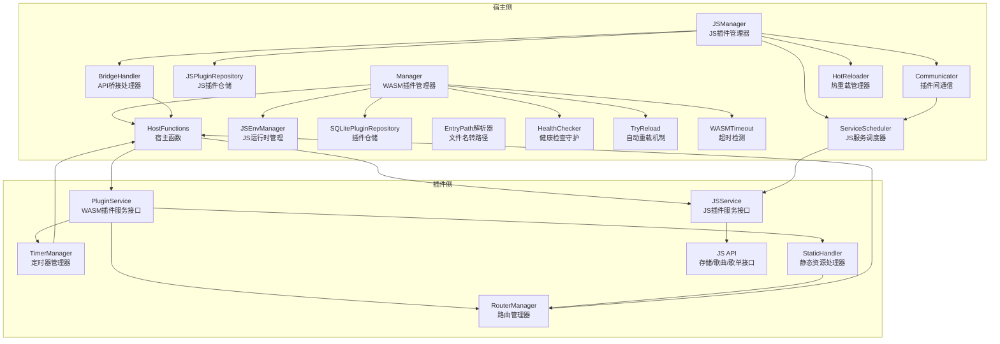

**图表来源**
- [internal/plugins/manager.go:34-47](file://internal/plugins/manager.go#L34-L47)
- [internal/plugins/host.go:65-73](file://internal/plugins/host.go#L65-L73)
- [internal/jsplugin/manager.go:19-37](file://internal/jsplugin/manager.go#L19-L37)
- [internal/jsplugin/service.go:59-69](file://internal/jsplugin/service.go#L59-L69)
- [internal/jsplugin/api_bridge.go:86-92](file://internal/jsplugin/api_bridge.go#L86-L92)
- [internal/jsplugin/communication.go:28-36](file://internal/jsplugin/communication.go#L28-L36)
- [internal/jsplugin/hot_reload.go:13-24](file://internal/jsplugin/hot_reload.go#L13-L24)

**章节来源**
- [docs/architecture.md:117-128](file://docs/architecture.md#L117-L128)

## 核心组件
- 插件管理器（Manager）：负责WASM插件加载、实例化、生命周期管理、超时与健康检查、资源回收，支持智能加载与WaitGroup协调
- **新增**：JS插件管理器（JSManager）：负责JS插件的加载、实例化、生命周期管理和服务调度，支持字节码缓存和热更新
- 宿主函数（HostFunctions）：提供路由调用、定时器注册/取消、JWT获取、JS环境创建/执行/销毁等能力
- 插件模型与仓储：定义插件状态、持久化与状态更新，支持文件修改时间追踪
- **新增**：JS插件模型（JSPlugin）：支持JS插件的元数据管理、权限控制和状态跟踪
- **新增**：JS插件仓储（JSPluginRepository）：提供JS插件的数据库操作接口
- JS运行时管理（cqjs）：进程内QuickJS环境，支持事件派发、同步HTTP、加解密、压缩等桥接函数
- 插件框架（BasePlugin/RouterManager/TimerManager）：封装生命周期与通用功能，插件通过注册实现业务逻辑
- **新增**：ServiceScheduler消息调度系统：管理JS插件服务的注册、消息分发和生命周期管理，支持异步消息处理和同步调用
- **新增**：API桥接处理器（BridgeHandler）：处理JS插件通过__go_bridge调用的宿主API请求
- **新增**：插件间通信器（Communicator）：管理JS插件间的异步消息发送和同步调用
- **新增**：健康检查守护（HealthChecker）：后台守护进程，定期扫描不健康插件并尝试重载
- **新增**：自动重载机制（TryReload）：通过tryReloadPlugin和冷却机制实现插件自动重载
- **新增**：WASM超时检测：通过isWASMTimeout函数精确识别WASM执行超时
- **新增**：超时处理机制：多种超时常量定义，覆盖初始化、回调、反初始化和关闭场景
- **新增**：EntryPath解析器：从插件文件名提取EntryPath，支持智能路径生成
- **新增**：WaitGroup协调机制：确保异步加载的可靠性和优雅关闭
- **新增**：热重载管理器（HotReloader）：支持插件的无损更新和错误回滚

**章节来源**
- [internal/plugins/manager.go:34-47](file://internal/plugins/manager.go#L34-L47)
- [internal/plugins/host.go:65-73](file://internal/plugins/host.go#L65-L73)
- [internal/jsplugin/manager.go:19-37](file://internal/jsplugin/manager.go#L19-L37)
- [internal/jsplugin/service.go:59-69](file://internal/jsplugin/service.go#L59-L69)
- [internal/jsplugin/api_bridge.go:86-92](file://internal/jsplugin/api_bridge.go#L86-L92)
- [internal/jsplugin/communication.go:28-36](file://internal/jsplugin/communication.go#L28-L36)
- [internal/jsplugin/hot_reload.go:13-24](file://internal/jsplugin/hot_reload.go#L13-L24)

## 架构总览
下图展示从"插件侧调用宿主函数"到"宿主侧执行回调"的完整流程，涵盖WASM插件和JS插件的交互路径，以及新增的超时处理和自动恢复机制。

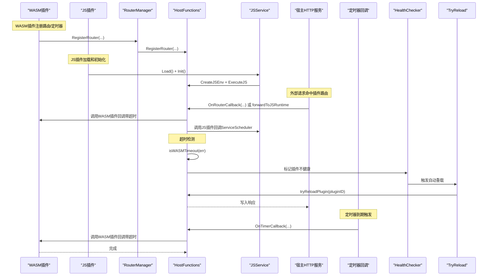

**图表来源**
- [plugin/api/plugin/router.go:53-80](file://plugin/api/plugin/router.go#L53-L80)
- [plugin/api/plugin/timer.go:42-59](file://plugin/api/plugin/timer.go#L42-L59)
- [internal/plugins/host.go:336-372](file://internal/plugins/host.go#L336-L372)
- [internal/plugins/host.go:443-476](file://internal/plugins/host.go#L443-L476)
- [internal/jsplugin/routes.go:231-279](file://internal/jsplugin/routes.go#L231-L279)
- [internal/jsplugin/service.go:272-296](file://internal/jsplugin/service.go#L272-296)

## 详细组件分析

### 插件管理器（Manager）设计模式
- 实例管理：以插件ID为键，维护插件实例、定时器与路由映射，支持并发安全访问
- 生命周期：加载（Load）、启用（Enable）、禁用（Disable）、移除（Remove）、关闭（Close）
- 超时与健康检查：为初始化、回调、反初始化、关闭分别设置超时；检测超时后标记实例不健康并异步禁用插件
- 资源回收：卸载时清理路由、销毁JS环境、调用Deinit、停止定时器、关闭实例
- **新增**：智能加载支持：通过文件修改时间检测跳过重复加载，提升启动性能
- **新增**：健康检查守护：后台定期扫描不健康插件并尝试重载
- **新增**：冷却机制：防止同一插件频繁重载，30秒冷却间隔

```mermaid
classDiagram
class Manager {
-repo : PluginRepository
-pluginsDir : string
-fsc : FSConfig
-instances : sync.Map
-hostFunctions : HostFunctions
-authService : AuthService
-serverPort : int
-jsRuntime : JSEnvManager
-loadingWg : WaitGroup
-reloadCooldown : sync.Map
-healthCheckDone : chan struct{}
+LoadAll()
+LoadAllAsync()
+EnablePlugin(id)
+DisablePlugin(id)
+RemovePlugin(id)
+GetInstance(id)
+Close()
+SyncPluginsFromDirectory()
+updatePluginInfo(plugin, fullPath)
+tryReloadPlugin(pluginID)
+startHealthChecker(interval)
}
class PluginInstance {
-Plugin : Plugin
-Instance : PluginService
-mu : Mutex
-timers : sync.Map
-routes : sync.Map
-healthy : atomic.Bool
+ClearTimers()
}
class HostFunctions {
-m : Manager
-router : chi.Mux
-routes : sync.Map
-pluginJWTToken : string
-jsRuntime : JSEnvManager
+RegisterRouter(...)
+RegisterDelayTimer(...)
+CallRouter(...)
+CreateJSEnv(...)
+ExecuteJS(...)
+DestroyJSEnv(...)
}
Manager --> PluginInstance : "管理"
Manager --> HostFunctions : "持有"
Manager --> HealthChecker : "启动"
Manager --> TryReload : "触发"
HostFunctions --> Manager : "反向引用"
```

**图表来源**
- [internal/plugins/manager.go:34-47](file://internal/plugins/manager.go#L34-L47)
- [internal/plugins/manager.go:66-74](file://internal/plugins/manager.go#L66-L74)
- [internal/plugins/host.go:65-73](file://internal/plugins/host.go#L65-L73)

**章节来源**
- [internal/plugins/manager.go:34-47](file://internal/plugins/manager.go#L34-L47)
- [internal/plugins/manager.go:66-74](file://internal/plugins/manager.go#L66-L74)
- [internal/plugins/manager.go:701-735](file://internal/plugins/manager.go#L701-L735)
- [internal/plugins/manager.go:737-762](file://internal/plugins/manager.go#L737-L762)

### JavaScript插件系统

#### JS插件管理器（JSManager）设计模式
JS插件管理器负责JS插件的完整生命周期管理：

- **插件加载**：从ZIP文件读取插件内容，验证哈希值，创建JS环境
- **服务注册**：将JS插件注册到ServiceScheduler，支持消息分发
- **字节码缓存**：优化插件加载性能，支持源码和字节码两种模式
- **热更新监控**：监控插件文件变化，支持自动重载
- **健康检查**：定期检查JS插件运行状态，支持自动恢复

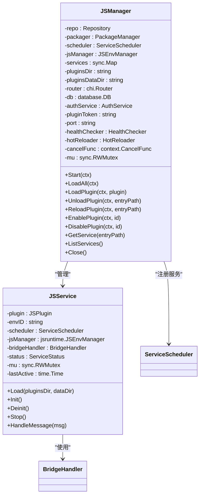

**图表来源**
- [internal/jsplugin/manager.go:19-37](file://internal/jsplugin/manager.go#L19-L37)
- [internal/jsplugin/service.go:59-69](file://internal/jsplugin/service.go#L59-L69)

#### JS插件服务（JSService）架构
JSService是JS插件的运行时实例，提供完整的生命周期管理和消息处理：

- **加载流程**：读取ZIP→验证哈希→解析入口文件→创建JS环境
- **初始化**：调用onInit()生命周期回调
- **消息处理**：支持HTTP请求、插件间通信、生命周期事件和健康检查
- **状态管理**：跟踪服务状态（ready/running/frozen/stopped）
- **资源清理**：调用onDeinit()并销毁JS环境

#### ServiceScheduler消息调度系统
ServiceScheduler是JS插件系统的核心消息处理机制：

- **消息类型**：HTTP请求、定时器触发、插件间通信、生命周期事件、宿主函数调用结果、健康检查
- **异步处理**：支持异步消息发送和同步调用，带超时控制
- **队列管理**：每个服务都有独立的消息队列，支持背压处理
- **工作线程**：为每个服务启动专用的worker协程，串行处理消息
- **超时控制**：默认30秒超时，支持自定义超时时间

```mermaid
classDiagram
class ServiceScheduler {
-services : map[string]*serviceEntry
-workerSize : int
-closed : atomic.Bool
+RegisterService(name, handler, queueSize)
+Send(msg)
+Call(ctx, target, source, msgType, data, timeout)
+UnregisterService(name, timeout)
+HasService(name)
+ServiceNames()
+Close()
}
class Message {
-ID : uint64
-Type : MessageType
-Source : string
-Target : string
-Session : uint64
-Data : interface{}
-RespChan : chan *Message
-Ctx : context.Context
}
class MessageHandler {
+HandleMessage(msg) *Message
}
ServiceScheduler --> Message : "处理"
ServiceScheduler --> MessageHandler : "委托"
```

**图表来源**
- [internal/jsplugin/scheduler.go:67-86](file://internal/jsplugin/scheduler.go#L67-L86)
- [internal/jsplugin/scheduler.go:40-55](file://internal/jsplugin/scheduler.go#L40-L55)

#### API桥接机制
JS插件通过BridgeHandler访问宿主提供的API：

- **存储API**：mimic.storage.get/set/delete/keys
- **歌曲API**：songloft.songs.list/getById/search
- **歌单API**：songloft.playlists.list/getById/getSongs
- **插件间通信**：mimic.comm.send/call/onMessage
- **权限控制**：基于声明的细粒度权限检查

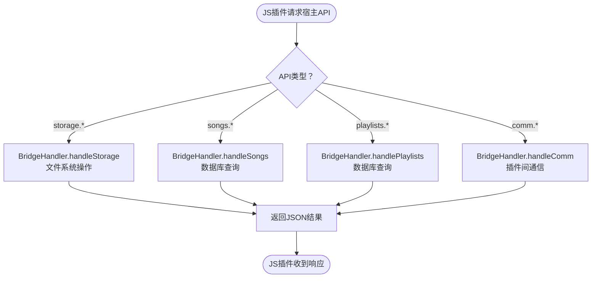

**图表来源**
- [internal/jsplugin/api_bridge.go:107-129](file://internal/jsplugin/api_bridge.go#L107-L129)
- [internal/jsplugin/api_bridge.go:167-240](file://internal/jsplugin/api_bridge.go#L167-240)
- [internal/jsplugin/api_bridge.go:253-330](file://internal/jsplugin/api_bridge.go#L253-L330)
- [internal/jsplugin/api_bridge.go:332-403](file://internal/jsplugin/api_bridge.go#L332-L403)

#### 插件间通信系统
JS插件支持异步消息发送和同步调用：

- **异步发送**：mimic.comm.send(target, action, payload)
- **同步调用**：mimic.comm.call(target, action, payload, timeoutMs)
- **消息处理**：通过onMessage注册处理器
- **超时控制**：默认10秒超时，支持自定义
- **权限验证**：需要inter-plugin权限

#### 权限控制系统
JS插件采用细粒度权限模型：

- **权限类型**：storage、songs.read、songs.write、playlists.read、playlists.write、inter-plugin、command
- **通配符支持**：如"playlists.*"可匹配所有歌单相关权限
- **权限验证**：在API调用时进行实时权限检查
- **权限声明**：插件在manifest中声明所需的权限

#### 热重载机制
JS插件支持无损热更新：

- **冻结状态**：更新前冻结插件状态，停止接收新消息
- **平滑切换**：调用onDeinit→销毁旧环境→重新加载→创建新环境→调用onInit
- **错误回滚**：新版本加载失败时自动回滚到旧版本
- **字节码缓存**：更新后清除字节码缓存，强制重新编译

**章节来源**
- [internal/jsplugin/manager.go:19-37](file://internal/jsplugin/manager.go#L19-L37)
- [internal/jsplugin/service.go:59-69](file://internal/jsplugin/service.go#L59-L69)
- [internal/jsplugin/api_bridge.go:86-92](file://internal/jsplugin/api_bridge.go#L86-L92)
- [internal/jsplugin/communication.go:28-36](file://internal/jsplugin/communication.go#L28-L36)
- [internal/jsplugin/scheduler.go:13-38](file://internal/jsplugin/scheduler.go#L13-L38)
- [internal/jsplugin/hot_reload.go:26-89](file://internal/jsplugin/hot_reload.go#L26-L89)
- [internal/jsplugin/permissions.go:8-35](file://internal/jsplugin/permissions.go#L8-L35)

### 宿主函数调用机制
- 路由调用（CallRouter）：宿主将插件请求转换为本地HTTP请求，附加插件专用JWT Token，返回状态码、头与体
- 路由注册（RegisterRouter）：插件通过RouterManager注册路由，宿主将其映射到/api/v1/plugin前缀并加入chi.Mux，**新增**：路径清理确保无重复斜杠
- 定时器注册/取消（RegisterDelayTimer/CancelDelayTimer）：插件通过TimerManager注册定时器，宿主在到期后回调插件
- JS环境管理：宿主提供创建、执行（支持等待事件）、销毁JS环境的能力，插件可在进程内快速执行脚本
- **新增**：JS插件路由转发：JS插件请求通过forwardToJSRuntime转发到对应的服务实例
- **新增**：超时处理：所有回调调用都带有超时保护，防止长时间阻塞
- **新增**：超时检测：通过isWASMTimeout函数精确识别WASM执行超时

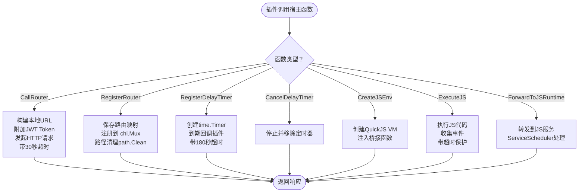

**图表来源**
- [internal/plugins/host.go:83-181](file://internal/plugins/host.go#L83-L181)
- [internal/plugins/host.go:200-248](file://internal/plugins/host.go#L200-L248)
- [internal/plugins/host.go:424-476](file://internal/plugins/host.go#L424-L476)
- [internal/plugins/host.go:538-635](file://internal/plugins/host.go#L538-L635)
- [internal/jsplugin/routes.go:231-279](file://internal/jsplugin/routes.go#L231-L279)

**章节来源**
- [internal/plugins/host.go:83-181](file://internal/plugins/host.go#L83-L181)
- [internal/plugins/host.go:200-248](file://internal/plugins/host.go#L200-L248)
- [internal/plugins/host.go:424-476](file://internal/plugins/host.go#L424-L476)
- [internal/plugins/host.go:538-635](file://internal/plugins/host.go#L538-L635)
- [internal/jsplugin/routes.go:231-279](file://internal/jsplugin/routes.go#L231-L279)

### 插件与宿主交互流程（路由）
- 插件侧：通过RouterManager注册路由，声明是否需要认证
- 宿主侧：将插件路由映射到/api/v1/plugin前缀，拦截请求后序列化HTTP请求，调用插件OnRouterCallback
- 插件回调：执行业务逻辑并返回状态码、头与体
- 宿主响应：将响应写回客户端
- **新增**：JS插件路由处理：通过ServiceScheduler分发到对应的服务实例
- **新增**：静态资源服务：JS插件支持静态文件服务和SPA路由回退
- **新增**：超时处理：所有路由回调都带有180秒超时保护
- **新增**：超时检测：通过isWASMTimeout函数检测超时并触发自动重载

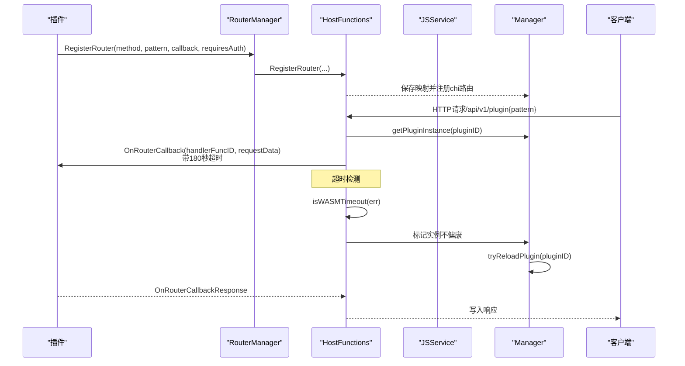

**图表来源**
- [plugin/api/plugin/router.go:53-80](file://plugin/api/plugin/router.go#L53-L80)
- [internal/plugins/host.go:200-248](file://internal/plugins/host.go#L200-L248)
- [internal/plugins/host.go:336-372](file://internal/plugins/host.go#L336-L372)
- [internal/jsplugin/routes.go:231-279](file://internal/jsplugin/routes.go#L231-L279)

**章节来源**
- [plugin/api/plugin/router.go:53-80](file://plugin/api/plugin/router.go#L53-L80)
- [internal/plugins/host.go:200-248](file://internal/plugins/host.go#L200-L248)
- [internal/plugins/host.go:336-372](file://internal/plugins/host.go#L336-L372)
- [internal/jsplugin/routes.go:231-279](file://internal/jsplugin/routes.go#L231-L279)

### 插件与宿主交互流程（定时器）
- 插件侧：通过TimerManager注册延迟定时器，返回定时器ID
- 宿主侧：为每个定时器创建time.Timer，到期后调用插件OnTimerCallback
- 插件回调：执行定时任务，完成后从本地映射中移除定时器
- **新增**：超时处理：所有定时器回调都带有180秒超时保护
- **新增**：超时检测：通过isWASMTimeout函数检测超时并触发自动重载

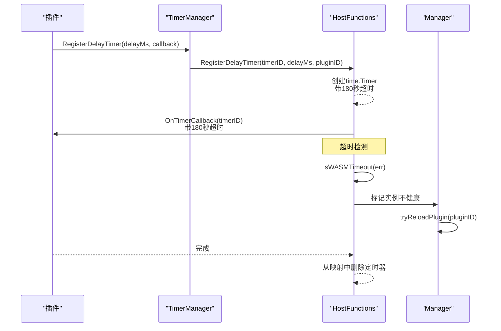

**图表来源**
- [plugin/api/plugin/timer.go:42-59](file://plugin/api/plugin/timer.go#L42-L59)
- [internal/plugins/host.go:424-476](file://internal/plugins/host.go#L424-L476)
- [internal/plugins/host.go:1060-1081](file://internal/plugins/host.go#L1060-L1081)

**章节来源**
- [plugin/api/plugin/timer.go:42-59](file://plugin/api/plugin/timer.go#L42-L59)
- [internal/plugins/host.go:424-476](file://internal/plugins/host.go#L424-L476)
- [internal/plugins/host.go:1060-1081](file://internal/plugins/host.go#L1060-L1081)

### 插件与宿主交互流程（JS环境）
- 插件侧：通过JS环境API创建、执行、销毁JS环境
- 宿主侧：JSEnvManager提供进程内QuickJS VM，注册桥接函数（事件派发、HTTP、加解密、压缩等）

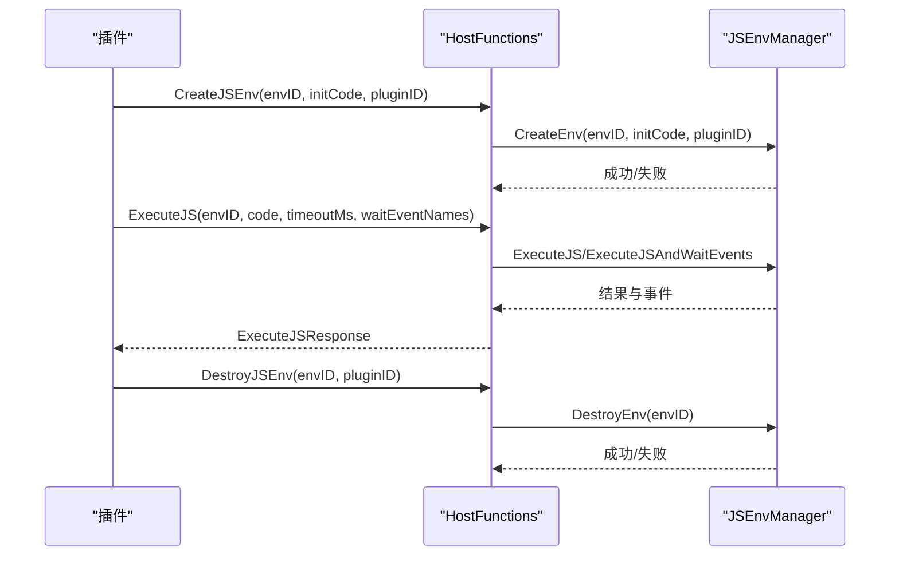

**图表来源**
- [internal/plugins/host.go:538-635](file://internal/plugins/host.go#L538-L635)
- [internal/jsruntime/runtime.go:71-126](file://internal/jsruntime/runtime.go#L71-L126)
- [internal/jsruntime/runtime.go:128-165](file://internal/jsruntime/runtime.go#L128-L165)
- [internal/jsruntime/runtime.go:167-258](file://internal/jsruntime/runtime.go#L167-L258)
- [internal/jsruntime/runtime.go:260-288](file://internal/jsruntime/runtime.go#L260-L288)

**章节来源**
- [internal/plugins/host.go:538-635](file://internal/plugins/host.go#L538-L635)
- [internal/jsruntime/runtime.go:71-126](file://internal/jsruntime/runtime.go#L71-L126)
- [internal/jsruntime/runtime.go:128-165](file://internal/jsruntime/runtime.go#L128-L165)
- [internal/jsruntime/runtime.go:167-258](file://internal/jsruntime/runtime.go#L167-L258)
- [internal/jsruntime/runtime.go:260-288](file://internal/jsruntime/runtime.go#L260-L288)

### 安全模型与资源限制
- 沙箱隔离：插件运行在WASM环境中，通过wazero实例化，启用CloseOnContextDone，在超时时自动中断执行
- **新增**：JS插件沙箱：运行在独立的QuickJS环境中，通过BridgeHandler提供受限的API访问
- 权限控制：路由注册支持requiresAuth；宿主在处理路由时校验JWT Token，支持从Header或URL查询参数读取
- **新增**：JS插件权限系统：基于声明的细粒度权限控制，支持存储、歌曲、歌单、插件间通信等权限
- 资源限制：统一超时配置（初始化、回调、反初始化、关闭）；JS执行设置默认超时；定时器与路由回调均受上下文超时保护
- 健康检查：检测超时后标记实例不健康并异步禁用插件，避免影响宿主稳定性
- **新增**：WASM超时检测：通过isWASMTimeout函数精确识别超时情况，包括标准context超时和wazero CloseOnContextDone产生的sys.ExitError
- **新增**：自动恢复：超时后自动触发插件重载，30秒冷却间隔防止频繁重载

**章节来源**
- [internal/plugins/manager.go:26-32](file://internal/plugins/manager.go#L26-L32)
- [internal/plugins/host.go:286-304](file://internal/plugins/host.go#L286-L304)
- [internal/plugins/host.go:398-404](file://internal/plugins/host.go#L398-L404)
- [internal/jsruntime/runtime.go:28-29](file://internal/jsruntime/runtime.go#L28-L29)
- [internal/jsplugin/permissions.go:8-21](file://internal/jsplugin/permissions.go#L8-L21)
- [internal/jsplugin/api_bridge.go:107-129](file://internal/jsplugin/api_bridge.go#L107-L129)

## 超时处理机制

### 超时常量定义
Songloft插件系统定义了四种不同类型的超时常量，分别用于不同的生命周期阶段：

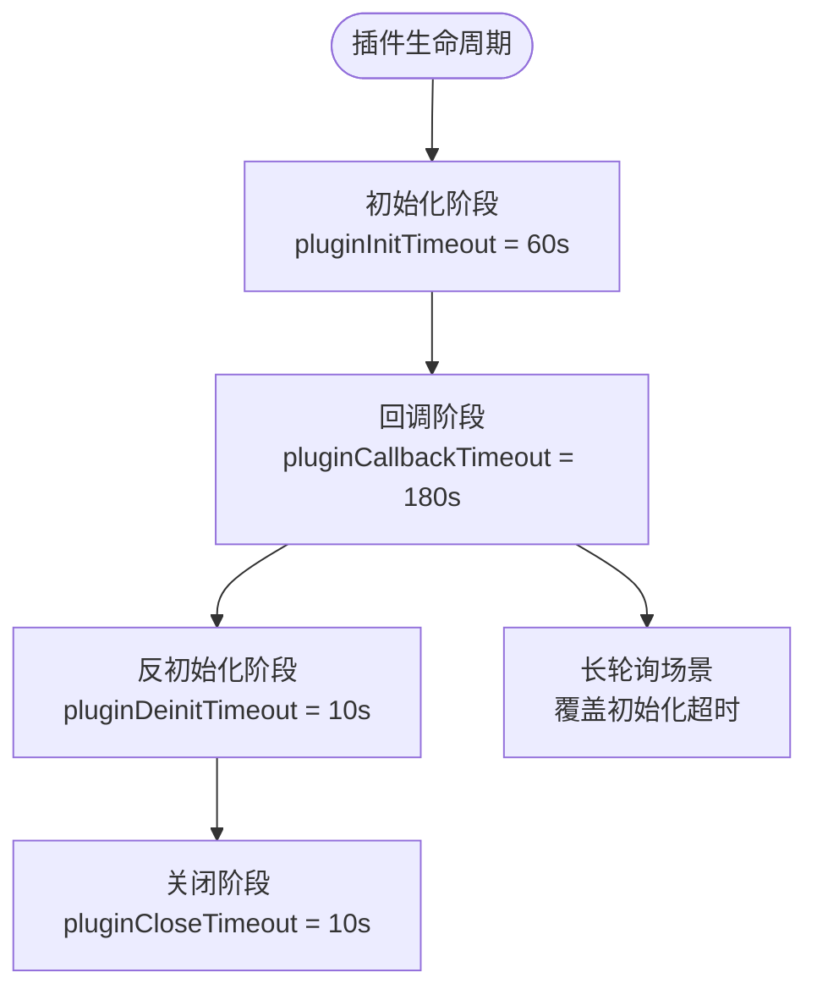

**图表来源**
- [internal/plugins/manager.go:26-32](file://internal/plugins/manager.go#L26-L32)

### 超时处理流程详解
超时处理机制贯穿插件生命周期的各个阶段：

1. **初始化超时**：插件初始化阶段最多等待60秒
2. **回调超时**：路由和定时器回调阶段最多等待180秒，覆盖长轮询场景
3. **反初始化超时**：插件反初始化阶段最多等待10秒
4. **关闭超时**：插件关闭阶段最多等待10秒

### 超时保护机制
所有插件调用都受到严格的超时保护：

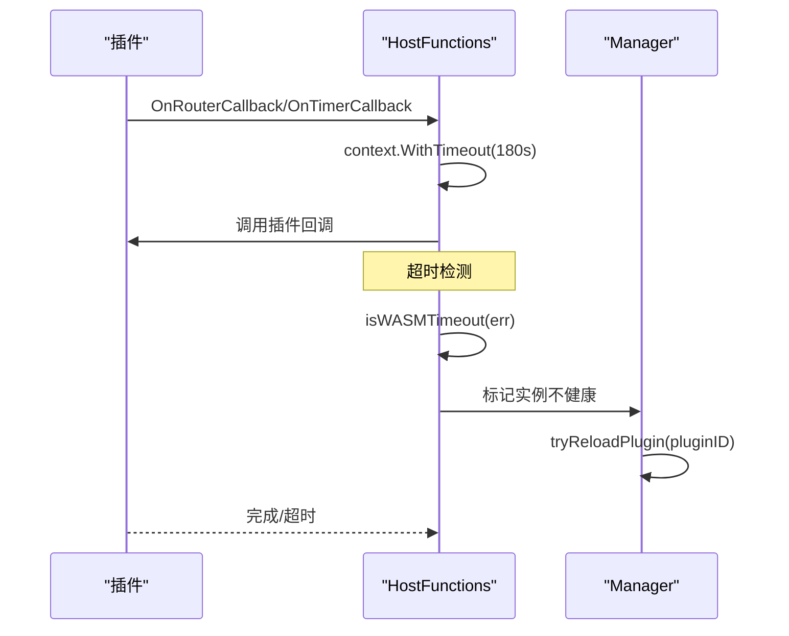

**图表来源**
- [internal/plugins/host.go:336-372](file://internal/plugins/host.go#L336-L372)
- [internal/plugins/host.go:443-476](file://internal/plugins/host.go#L443-L476)
- [internal/plugins/host.go:1060-1081](file://internal/plugins/host.go#L1060-L1081)

**章节来源**
- [internal/plugins/manager.go:26-32](file://internal/plugins/manager.go#L26-L32)
- [internal/plugins/host.go:336-372](file://internal/plugins/host.go#L336-L372)
- [internal/plugins/host.go:443-476](file://internal/plugins/host.go#L443-L476)
- [internal/plugins/host.go:1060-1081](file://internal/plugins/host.go#L1060-L1081)

## 自动恢复能力

### tryReloadPlugin自动重载机制
当插件发生超时或其他异常时，系统会自动尝试重载插件：

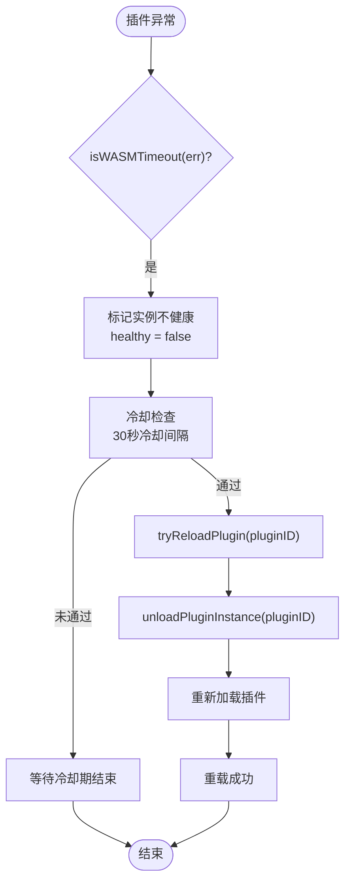

**图表来源**
- [internal/plugins/manager.go:701-735](file://internal/plugins/manager.go#L701-L735)

### 冷却机制设计
为了防止插件频繁重载导致系统不稳定，系统实现了30秒的冷却机制：

1. **冷却检查**：每次重载尝试前检查上次重载时间
2. **30秒间隔**：同一插件在30秒内不会重复重载
3. **并发安全**：使用sync.Map保存冷却时间戳
4. **自动清理**：冷却期过后自动允许再次重载

### 自动重载流程详解
自动重载包含以下关键步骤：

1. **异常检测**：通过isWASMTimeout函数检测WASM执行超时
2. **实例标记**：将不健康的插件实例标记为不健康状态
3. **冷却检查**：确保插件满足30秒冷却间隔要求
4. **卸载处理**：卸载旧的插件实例并清理所有资源
5. **重新加载**：从数据库重新加载插件并初始化
6. **状态更新**：更新插件状态为活跃状态

**章节来源**
- [internal/plugins/manager.go:701-735](file://internal/plugins/manager.go#L701-L735)
- [internal/plugins/host.go:1060-1081](file://internal/plugins/host.go#L1060-L1081)

## 健康监控集成

### HealthChecker后台守护进程
系统启动了一个专门的后台守护进程来监控插件健康状态：

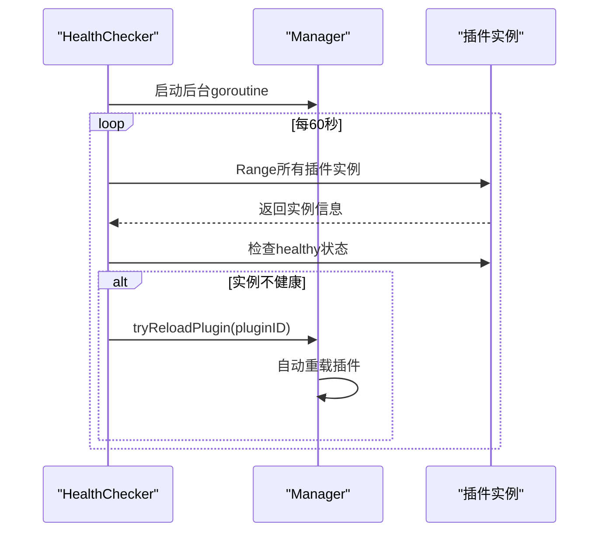

**图表来源**
- [internal/plugins/manager.go:737-762](file://internal/plugins/manager.go#L737-L762)

### 健康检查机制详解
健康检查守护进程的工作流程：

1. **定时扫描**：每60秒扫描一次所有插件实例
2. **状态检查**：检查每个插件实例的healthy标志位
3. **异常处理**：对于不健康的插件，触发自动重载
4. **守护停止**：通过healthCheckDone通道优雅停止守护进程
5. **资源清理**：关闭时清理所有相关资源

### 健康检查配置
- **扫描间隔**：60秒
- **冷却机制**：与tryReloadPlugin共享冷却机制
- **并发安全**：使用sync.Map保证并发访问安全
- **优雅关闭**：通过channel机制确保守护进程正确停止

**章节来源**
- [internal/plugins/manager.go:737-762](file://internal/plugins/manager.go#L737-L762)

## WASM超时检测

### isWASMTimeout超时检测函数
系统提供了精确的WASM超时检测机制：

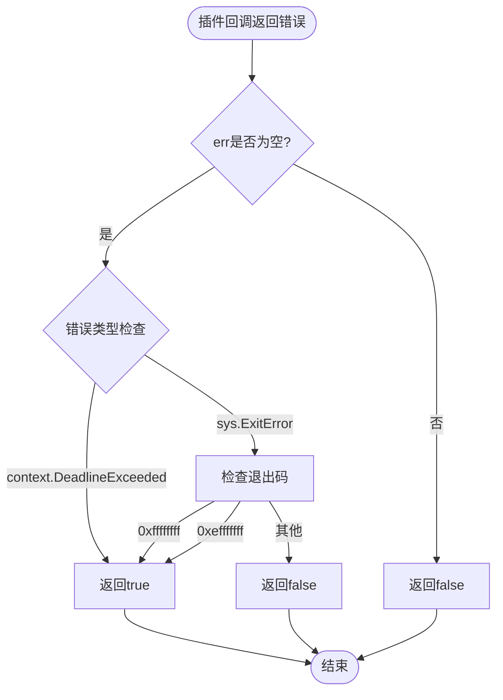

**图表来源**
- [internal/plugins/host.go:1060-1081](file://internal/plugins/host.go#L1060-L1081)

### 超时检测支持的错误类型
isWASMTimeout函数支持两种主要的超时检测：

1. **标准context超时**：context.DeadlineExceeded错误
2. **WASICloseOnContextDone超时**：sys.ExitError，包含特定的退出码
   - `sys.ExitCodeContextCanceled = 0xffffffff`
   - `sys.ExitCodeDeadlineExceeded = 0xefffffff`

### 超时检测的应用场景
超时检测在以下场景中发挥作用：

1. **路由回调超时**：检测插件OnRouterCallback调用超时
2. **定时器回调超时**：检测插件OnTimerCallback调用超时
3. **自动重载触发**：超时后自动触发插件重载
4. **健康状态更新**：标记插件为不健康状态

**章节来源**
- [internal/plugins/host.go:1060-1081](file://internal/plugins/host.go#L1060-L1081)

## 智能插件加载机制

### 文件修改时间检测优化
Songloft插件系统引入了智能加载机制，通过比较文件修改时间来避免重复加载：

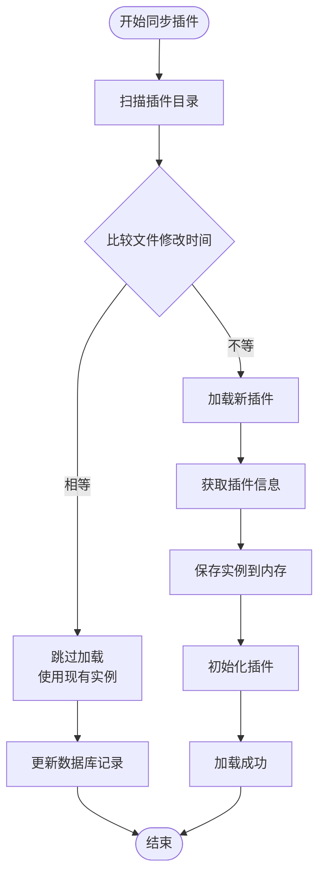

**图表来源**
- [internal/plugins/manager.go:402-431](file://internal/plugins/manager.go#L402-L431)
- [internal/plugins/manager.go:477-533](file://internal/plugins/manager.go#L477-L533)

### 智能加载流程详解
智能加载机制包含以下关键步骤：

1. **文件监控**：定期检查插件文件的修改时间戳
2. **差异检测**：比较当前修改时间与数据库记录的时间戳
3. **条件加载**：只有当文件发生变化时才重新加载插件
4. **实例复用**：文件未变化时复用现有插件实例，避免重复初始化

### 性能优化效果
- **启动速度提升**：跳过未变化插件的加载过程
- **资源节约**：避免重复创建WASM实例和初始化过程
- **数据库负载降低**：减少不必要的插件信息同步操作

**章节来源**
- [internal/plugins/manager.go:402-431](file://internal/plugins/manager.go#L402-L431)
- [internal/plugins/manager.go:477-533](file://internal/plugins/manager.go#L477-L533)

## 路由路径清理优化

### 路径规范化处理
宿主系统增强了路由路径的清理和规范化处理，确保路由注册的稳定性：

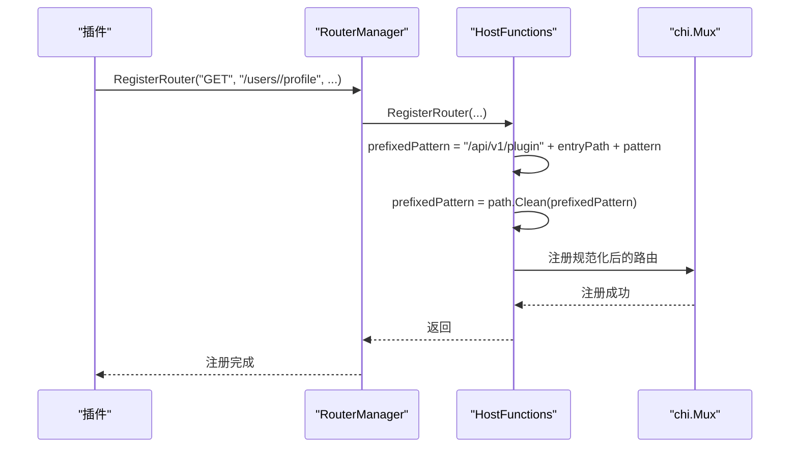

**图表来源**
- [internal/plugins/host.go:200-248](file://internal/plugins/host.go#L200-L248)

### 路径清理机制详解
路径清理机制包含以下处理步骤：

1. **前缀拼接**：自动拼接/api/v1/plugin和插件EntryPath
2. **重复斜杠清理**：使用path.Clean()移除重复的斜杠字符
3. **路径标准化**：确保最终路由路径格式统一
4. **兼容性保证**：支持各种路径组合场景

### 兼容性改进
- **多斜杠处理**：自动处理`//`、`///`等多余斜杠
- **相对路径解析**：正确处理`../`等相对路径引用
- **尾部斜杠处理**：统一处理路径末尾的斜杠情况

**章节来源**
- [internal/plugins/host.go:200-248](file://internal/plugins/host.go#L200-L248)

## 静态资源路由优化

### 静态文件路由映射改进
静态资源处理器优化了路由路径映射，特别是根目录index.html的处理：

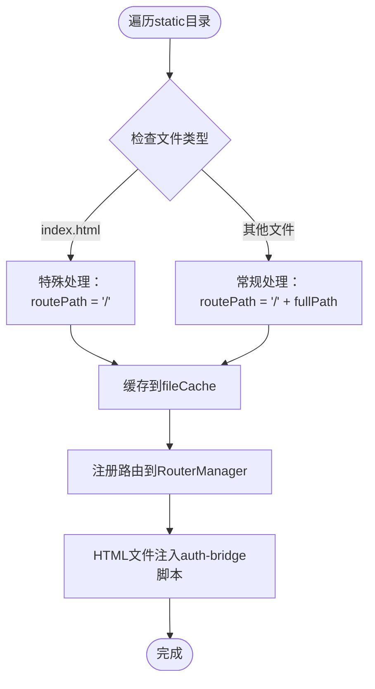

**图表来源**
- [plugin/api/plugin/static_handler.go:55-139](file://plugin/api/plugin/static_handler.go#L55-L139)

### 根目录映射优化
静态资源处理器改进了根目录文件的路由映射：

1. **index.html特殊处理**：将`static/index.html`映射到`/`路径
2. **其他文件常规处理**：将其他静态文件映射到`/static/...`路径
3. **缓存机制**：预加载所有静态文件内容到内存缓存
4. **MIME类型自动识别**：根据文件扩展名自动设置正确的Content-Type

### 前端集成优化
前端代码也相应调整了插件入口URL的构建方式：

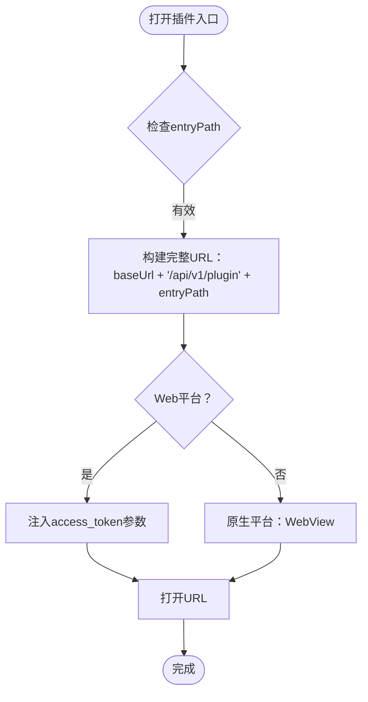

**图表来源**
- [frontend/lib/features/home/presentation/widgets/plugin_grid.dart:153-190](file://frontend/lib/features/home/presentation/widgets/plugin_grid.dart#L153-L190)

### JS插件静态文件服务优化
JS插件的静态文件服务进行了重大改进：

1. **HTML注入**：自动注入<base>标签和认证桥接脚本
2. **SPA支持**：支持单页应用的路由回退机制
3. **路径清理**：防止路径穿越攻击，确保安全访问
4. **缓存策略**：HTML文件no-cache，其他资源强缓存
5. **错误处理**：友好的404页面和日志记录

**章节来源**
- [plugin/api/plugin/static_handler.go:55-139](file://plugin/api/plugin/static_handler.go#L55-L139)
- [frontend/lib/features/home/presentation/widgets/plugin_grid.dart:153-190](file://frontend/lib/features/home/presentation/widgets/plugin_grid.dart#L153-L190)
- [internal/jsplugin/routes.go:38-62](file://internal/jsplugin/routes.go#L38-L62)
- [internal/jsplugin/routes.go:165-214](file://internal/jsplugin/routes.go#L165-L214)

## 优雅关闭机制

### WaitGroup在关闭过程中的作用
插件管理器的Close()方法利用WaitGroup确保优雅关闭：

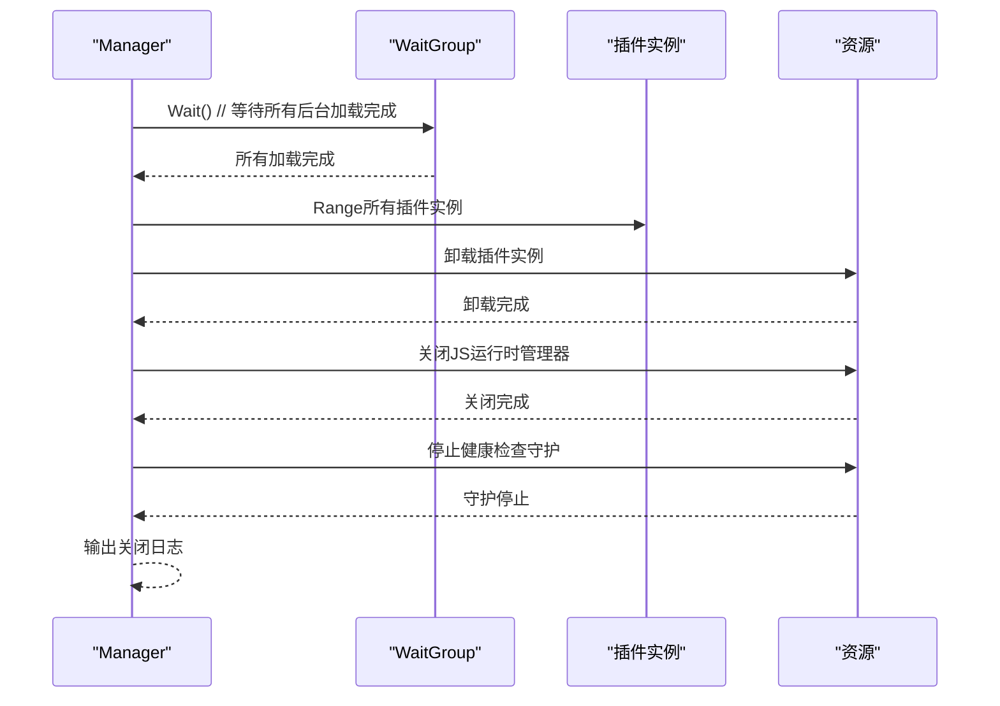

**图表来源**
- [internal/plugins/manager.go:764-789](file://internal/plugins/manager.go#L764-L789)

### 关闭流程详解
优雅关闭过程包含以下关键步骤：

1. **等待后台加载**：`loadingWg.Wait()`确保所有后台插件加载任务完成
2. **卸载插件实例**：遍历所有插件实例，执行清理操作
3. **销毁JS环境**：关闭所有插件创建的JS运行时环境
4. **停止健康检查**：关闭后台健康检查守护进程
5. **资源清理**：释放所有相关资源，确保系统稳定退出

**章节来源**
- [internal/plugins/manager.go:764-789](file://internal/plugins/manager.go#L764-L789)

## 依赖关系分析
- 插件框架（BasePlugin/RouterManager/TimerManager）定义了插件侧的标准接口与通用能力
- 宿主侧通过pbplugin协议与插件交互，HostFunctions提供路由、定时器、JS环境等宿主函数
- Manager负责插件生命周期与实例管理，Repository负责插件元数据持久化
- **新增**：JS插件管理器（JSManager）负责JS插件的加载、实例化和生命周期管理
- **新增**：ServiceScheduler管理JS插件服务的注册、消息分发和生命周期管理
- **新增**：BridgeHandler处理JS插件通过__go_bridge调用的宿主API请求
- **新增**：Communicator管理JS插件间的异步消息发送和同步调用
- **新增**：HealthChecker后台守护进程，定期扫描插件健康状态
- **新增**：TryReload自动重载机制，通过冷却机制防止频繁重载
- **新增**：WASM超时检测函数，精确识别WASM执行超时
- **新增**：超时处理机制，多种超时常量覆盖不同生命周期阶段
- **新增**：EntryPath解析器提供文件名到路径的智能转换
- **新增**：WaitGroup协调机制确保异步加载的可靠性和优雅关闭
- **新增**：HotReloader热重载管理器，支持插件的无损更新和错误回滚

```mermaid
graph LR
BP["BasePlugin"] --> RM["RouterManager"]
BP --> TM["TimerManager"]
BP --> SH["StaticHandler"]
RM --> HF["HostFunctions"]
TM --> HF
SH --> RM
HF --> PS["PluginService"]
HF --> JS["JSService"]
M["Manager"] --> HF
M --> REPO["SQLitePluginRepository"]
M --> JR["JSEnvManager"]
M --> WG["WaitGroup"]
M --> EP["EntryPath解析器"]
M --> HC["HealthChecker"]
M --> TR["TryReload"]
M --> WT["WASMTimeout"]
JSM["JSManager"] --> JScheduler["ServiceScheduler"]
JSM --> Bridge["BridgeHandler"]
JSM --> Comm["Communicator"]
JSM --> HR["HotReloader"]
JSM --> JSRepo["JSPluginRepository"]
JS --> JSAPI["JS API"]
JScheduler --> JS
Bridge --> HF
Comm --> JScheduler
```

**图表来源**
- [plugin/api/plugin/base.go:35-51](file://plugin/api/plugin/base.go#L35-L51)
- [plugin/api/plugin/router.go:26-46](file://plugin/api/plugin/router.go#L26-L46)
- [plugin/api/plugin/timer.go:17-29](file://plugin/api/plugin/timer.go#L17-L29)
- [plugin/api/plugin/static_handler.go:16-21](file://plugin/api/plugin/static_handler.go#L16-L21)
- [internal/plugins/host.go:65-73](file://internal/plugins/host.go#L65-L73)
- [internal/jsplugin/manager.go:19-37](file://internal/jsplugin/manager.go#L19-L37)
- [internal/jsplugin/service.go:59-69](file://internal/jsplugin/service.go#L59-L69)
- [internal/jsplugin/api_bridge.go:86-92](file://internal/jsplugin/api_bridge.go#L86-L92)
- [internal/jsplugin/communication.go:28-36](file://internal/jsplugin/communication.go#L28-L36)
- [internal/jsplugin/hot_reload.go:13-24](file://internal/jsplugin/hot_reload.go#L13-L24)

**章节来源**
- [plugin/api/plugin/base.go:35-51](file://plugin/api/plugin/base.go#L35-L51)
- [plugin/api/plugin/router.go:26-46](file://plugin/api/plugin/router.go#L26-L46)
- [plugin/api/plugin/timer.go:17-29](file://plugin/api/plugin/timer.go#L17-L29)
- [plugin/api/plugin/static_handler.go:16-21](file://plugin/api/plugin/static_handler.go#L16-L21)
- [internal/plugins/host.go:65-73](file://internal/plugins/host.go#L65-L73)
- [internal/jsplugin/manager.go:19-37](file://internal/jsplugin/manager.go#L19-L37)
- [internal/jsplugin/service.go:59-69](file://internal/jsplugin/service.go#L59-L69)
- [internal/jsplugin/api_bridge.go:86-92](file://internal/jsplugin/api_bridge.go#L86-L92)
- [internal/jsplugin/communication.go:28-36](file://internal/jsplugin/communication.go#L28-L36)
- [internal/jsplugin/hot_reload.go:13-24](file://internal/jsplugin/hot_reload.go#L13-L24)

## 性能考量
- WASM执行：通过wazero的CloseOnContextDone机制在超时中断执行，避免长时间阻塞
- JS执行：默认超时与事件等待机制，结合定时器微任务处理，提升脚本执行效率
- 路由与定时器：使用sync.Map与互斥锁保护关键路径，减少锁竞争
- 静态资源：插件侧静态处理器预加载至内存，减少磁盘IO
- **新增**：智能加载：通过文件修改时间检测跳过重复加载，显著提升启动性能
- **新增**：路径清理：使用path.Clean规范化路由路径，避免重复斜杠造成的性能问题
- **新增**：静态资源优化：根目录index.html特殊映射，简化前端访问路径
- **新增**：超时处理：多种超时常量确保不同阶段的合理超时设置
- **新增**：自动恢复：通过tryReloadPlugin和冷却机制实现插件自动恢复
- **新增**：健康监控：后台守护进程定期检查插件健康状态，预防性维护
- **新增**：字节码缓存：JS插件支持源码和字节码两种模式，优化加载性能
- **新增**：服务调度：JS插件通过ServiceScheduler实现高效的消息分发
- **新增**：权限检查：JS插件权限系统支持细粒度的访问控制
- **新增**：热重载优化：冻结状态下的无损更新，支持错误回滚
- **新增**：消息队列：ServiceScheduler的异步消息处理机制
- 异步加载：后台并行加载插件，显著提升启动性能；WaitGroup确保加载完成后再进行后续操作

**章节来源**
- [internal/plugins/manager.go:26-32](file://internal/plugins/manager.go#L26-L32)
- [internal/jsruntime/runtime.go:28-29](file://internal/jsruntime/runtime.go#L28-L29)
- [internal/jsruntime/runtime.go:394-431](file://internal/jsruntime/runtime.go#L394-L431)
- [plugin/api/plugin/static_handler.go:62-150](file://plugin/api/plugin/static_handler.go#L62-L150)
- [internal/plugins/manager.go:402-431](file://internal/plugins/manager.go#L402-L431)
- [internal/jsplugin/service.go:142-198](file://internal/jsplugin/service.go#L142-L198)
- [internal/jsplugin/permissions.go:37-53](file://internal/jsplugin/permissions.go#L37-L53)
- [internal/jsplugin/scheduler.go:25-28](file://internal/jsplugin/scheduler.go#L25-L28)

## 故障排查指南
- 路由回调超时：宿主检测到超时后会标记实例不健康并异步禁用插件，检查插件回调逻辑与外部依赖
- 定时器回调超时：与路由回调类似，宿主会停止定时器并清理映射
- 初始化失败：检查插件元数据、路由注册与宿主函数调用是否正确
- JS执行异常：确认环境创建、代码执行与事件等待参数配置是否合理
- **新增**：JS插件加载失败：检查ZIP文件完整性、哈希验证和字节码缓存
- **新增**：JS插件权限错误：确认插件声明的权限是否正确，检查权限验证逻辑
- **新增**：JS插件通信失败：检查插件间通信的发送方和接收方状态，验证消息格式
- **新增**：智能加载问题：检查文件修改时间检测逻辑，确认跳过加载的条件判断
- **新增**：路径清理问题：检查路由注册时的path.Clean调用，确保路径格式正确
- **新增**：静态资源访问问题：确认静态文件路由映射是否正确，特别是根目录index.html的处理
- **新增**：超时处理问题：检查超时常量设置是否合理，确认回调超时是否覆盖长轮询场景
- **新增**：自动重载问题：检查tryReloadPlugin是否正常工作，确认冷却机制是否生效
- **新增**：健康监控问题：检查HealthChecker守护进程是否正常运行，确认健康检查频率设置
- **新增**：WASM超时检测问题：检查isWASMTimeout函数是否正确识别不同类型的超时错误
- **新增**：ServiceScheduler问题：检查消息队列容量和超时设置，确认异步消息处理是否正常
- **新增**：热重载问题：检查冻结状态下的消息处理，确认错误回滚机制是否正常
- **新增**：BridgeHandler问题：检查权限检查和API调用是否正常
- 异步加载问题：检查WaitGroup是否正确使用，确保所有后台加载任务都能完成
- 优雅关闭失败：确认Close()方法是否正确等待WaitGroup，避免资源泄漏

**章节来源**
- [internal/plugins/host.go:286-304](file://internal/plugins/host.go#L286-L304)
- [internal/plugins/host.go:398-404](file://internal/plugins/host.go#L398-L404)
- [internal/plugins/manager.go:441-463](file://internal/plugins/manager.go#L441-L463)
- [internal/jsruntime/runtime.go:128-165](file://internal/jsruntime/runtime.go#L128-L165)
- [internal/jsplugin/manager.go:142-185](file://internal/jsplugin/manager.go#L142-L185)
- [internal/jsplugin/api_bridge.go:107-129](file://internal/jsplugin/api_bridge.go#L107-L129)
- [internal/jsplugin/communication.go:40-89](file://internal/jsplugin/communication.go#L40-89)
- [internal/plugins/manager.go:764-789](file://internal/plugins/manager.go#L764-L789)
- [internal/plugins/manager.go:402-431](file://internal/plugins/manager.go#L402-L431)
- [internal/plugins/manager.go:701-735](file://internal/plugins/manager.go#L701-L735)
- [internal/plugins/manager.go:737-762](file://internal/plugins/manager.go#L737-L762)
- [internal/plugins/host.go:1060-1081](file://internal/plugins/host.go#L1060-L1081)
- [internal/jsplugin/scheduler.go:198-245](file://internal/jsplugin/scheduler.go#L198-L245)
- [internal/jsplugin/hot_reload.go:26-89](file://internal/jsplugin/hot_reload.go#L26-L89)

## 结论
Songloft插件系统通过WASM与gRPC-Proto实现了强隔离与高扩展性的插件生态，现已扩展为支持WASM插件和JavaScript插件两种类型。宿主侧提供完善的生命周期管理、超时与健康检查、路由与定时器调度以及JS运行时能力，插件侧通过统一框架实现路由与定时器的注册与回调。

**最新架构特点**：
- **超时处理**：通过多种超时常量覆盖初始化、回调、反初始化和关闭场景
- **自动恢复**：通过tryReloadPlugin和冷却机制实现插件自动重载
- **健康监控**：后台守护进程定期检查插件健康状态，预防性维护系统稳定性
- **WASM超时检测**：通过isWASMTimeout函数精确识别不同类型的超时错误
- **智能加载**：通过文件修改时间检测跳过重复加载，显著提升启动性能
- **路径清理**：增强路由路径规范化处理，确保路由注册的稳定性
- **静态资源优化**：改进静态文件路由映射，特别是根目录index.html的处理
- **异步加载**：通过WaitGroup协调后台加载，显著提升启动性能
- **优雅关闭**：确保所有后台操作完成后再进行资源清理
- **健壮性**：完善的错误处理和超时机制，保证系统稳定性
- **JS插件系统**：基于QuickJS的轻量级插件实现，支持字节码缓存和热更新
- **服务调度**：JS插件通过ServiceScheduler实现高效的消息分发和生命周期管理
- **API桥接**：提供存储、歌曲、歌单等宿主API的JS访问接口
- **权限控制**：基于声明式权限模型的细粒度访问控制
- **插件通信**：支持异步消息发送和同步调用的插件间通信系统
- **热重载机制**：支持无损更新和错误回滚的插件热更新系统
- **消息队列**：ServiceScheduler的异步消息处理机制，支持背压控制

整体架构在保证安全性的同时，兼顾性能与易用性，适合构建可维护、可扩展的音乐服务插件体系。

## 附录
- 插件开发规范与最佳实践参见开发指南文档
- 插件协议定义参见pbplugin协议文件
- 超时常量验证测试参见manager_test.go

**章节来源**
- [docs/js-plugin-development-guide.md:100-135](file://docs/js-plugin-development-guide.md#L100-L135)
- [plugin/api/pbplugin/plugin.proto:9-26](file://plugin/api/pbplugin/plugin.proto#L9-L26)
- [plugin/api/pbplugin/plugin.proto:60-82](file://plugin/api/pbplugin/plugin.proto#L60-L82)
- [internal/plugins/manager_test.go:274-298](file://internal/plugins/manager_test.go#L274-L298)