# 插件管理机制

<cite>
**本文档引用的文件**
- [internal/plugins/manager.go](file://internal/plugins/manager.go)
- [internal/plugins/plugin.go](file://internal/plugins/plugin.go)
- [internal/plugins/repository.go](file://internal/plugins/repository.go)
- [internal/plugins/host.go](file://internal/plugins/host.go)
- [internal/handlers/plugin.go](file://internal/handlers/plugin.go)
- [internal/database/sqlite_plugin.go](file://internal/database/sqlite_plugin.go)
- [internal/database/sqlite.go](file://internal/database/sqlite.go)
- [internal/database/schema.go](file://internal/database/schema.go)
- [internal/jsruntime/runtime.go](file://internal/jsruntime/runtime.go)
- [internal/jsruntime/polyfill.go](file://internal/jsruntime/polyfill.go)
- [internal/app/app.go](file://internal/app/app.go)
- [internal/services/auth_service.go](file://internal/services/auth_service.go)
- [plugin/api/pbplugin/plugin.proto](file://plugin/api/pbplugin/plugin.proto)
- [plugin/api/plugin/timer.go](file://plugin/api/plugin/timer.go)
- [web/src/api/plugins.ts](file://web/src/api/plugins.ts)
- [docs/js-plugin-development-guide.md](file://docs/js-plugin-development-guide.md)
- [internal/models/models.go](file://internal/models/models.go)
- [plugins/songloft-plugin-xiaomi/auth/service.go](file://plugins/songloft-plugin-xiaomi/auth/service.go)
- [plugins/songloft-plugin-xiaomi/pkg/qrcode/qrcode.go](file://plugins/songloft-plugin-xiaomi/pkg/qrcode/qrcode.go)
- [plugins/songloft-plugin-cloudflared/downloader.go](file://plugins/songloft-plugin-cloudflared/downloader.go)
- [go.mod](file://go.mod)
- [plugin/pkg/go-plugin-http/go.mod](file://plugin/pkg/go-plugin-http/go.mod)
- [frontend/lib/features/settings/data/plugin_api.dart](file://frontend/lib/features/settings/data/plugin_api.dart)
- [frontend/lib/features/settings/presentation/widgets/plugin_manager.dart](file://frontend/lib/features/settings/presentation/widgets/plugin_manager.dart)
- [internal/app/routers.go](file://internal/app/routers.go)
- [internal/jsplugin/manager.go](file://internal/jsplugin/manager.go)
- [internal/jsplugin/plugin.go](file://internal/jsplugin/plugin.go)
- [internal/jsplugin/loader.go](file://internal/jsplugin/loader.go)
- [internal/jsplugin/service.go](file://internal/jsplugin/service.go)
- [internal/jsplugin/routes.go](file://internal/jsplugin/routes.go)
- [internal/jsplugin/package.go](file://internal/jsplugin/package.go)
- [internal/jsplugin/permissions.go](file://internal/jsplugin/permissions.go)
- [internal/jsplugin/hot_reload.go](file://internal/jsplugin/hot_reload.go)
- [internal/jsplugin/health.go](file://internal/jsplugin/health.go)
- [internal/database/jsplugin_repository.go](file://internal/database/jsplugin_repository.go)
- [internal/handlers/jsplugin_handler.go](file://internal/handlers/jsplugin_handler.go)
- [internal/jsruntime/polyfill.go](file://internal/jsruntime/polyfill.go)
- [internal/jsruntime/runtime.go](file://internal/jsruntime/runtime.go)
- [internal/jsruntime/README.md](file://internal/jsruntime/README.md)
- [test/quickjs_polyfill/polyfill/polyfill.c](file://test/quickjs_polyfill/polyfill/polyfill.c)
- [test/quickjs_polyfill/polyfill/polyfill.h](file://test/quickjs_polyfill/polyfill/polyfill.h)
- [test/quickjs_polyfill/polyfill/timer.c](file://test/quickjs_polyfill/polyfill/timer.c)
</cite>

## 更新摘要
**变更内容**
- 新增 JavaScript 插件生命周期管理支持：完整的 JS 插件发现、加载、初始化、运行、卸载和热更新机制
- 新增 JavaScript 插件包管理器：支持从 ZIP 文件安装、更新、卸载和同步插件
- 新增 JavaScript 插件服务管理：基于 Actor 模式的插件服务生命周期管理
- 新增 JavaScript 插件路由系统：支持静态资源服务和 API 路由转发
- 新增 JavaScript 插件权限系统：细粒度权限控制和权限验证机制
- 新增 JavaScript 插件热更新机制：支持文件监控和自动热重载
- 新增 JavaScript 插件健康检查：定期健康检查和自动恢复机制
- 新增 JavaScript 插件数据目录管理：独立的数据存储和静态资源管理
- 新增 JavaScript 插件字节码缓存：提升插件加载性能和安全性
- 新增 JavaScript 插件静态页面访问：支持插件静态页面的访问和认证

## 目录
1. [简介](#简介)
2. [项目结构](#项目结构)
3. [核心组件](#核心组件)
4. [架构总览](#架构总览)
5. [详细组件分析](#详细组件分析)
6. [JavaScript 插件生命周期管理](#javascript-插件生命周期管理)
7. [JavaScript 插件包管理](#javascript-插件包管理)
8. [JavaScript 插件服务管理](#javascript-插件服务管理)
9. [JavaScript 插件路由系统](#javascript-插件路由系统)
10. [JavaScript 插件权限系统](#javascript-插件权限系统)
11. [JavaScript 插件热更新机制](#javascript-插件热更新机制)
12. [JavaScript 插件健康检查](#javascript-插件健康检查)
13. [JavaScript 插件数据目录管理](#javascript-插件数据目录管理)
14. [JavaScript 插件字节码缓存](#javascript-插件字节码缓存)
15. [JavaScript 插件静态页面访问](#javascript-插件静态页面访问)
16. [JavaScript 运行时集成](#javascript-运行时集成)
17. [JavaScript 插件 API 接口](#javascript-插件-api-接口)
18. [JavaScript 插件监控与日志](#javascript-插件监控与日志)
19. [JavaScript 插件故障恢复](#javascript-插件故障恢复)
20. [JavaScript 插件开发指南](#javascript-插件开发指南)
21. [依赖关系分析](#依赖关系分析)
22. [性能考量](#性能考量)
23. [故障排查指南](#故障排查指南)
24. [结论](#结论)
25. [附录](#附录)

## 简介
本文件系统性阐述 Songloft 的插件管理机制，覆盖插件的完整生命周期（发现、加载、初始化、运行、卸载）、状态管理（激活、停用、错误、禁用）、动态加载与热更新、版本与兼容性、配置管理、API 接口、监控与日志、以及故障恢复策略。文档面向开发者与运维人员，既提供代码级细节，也给出可视化图示帮助理解。

**更新** 新增 JavaScript 插件生命周期管理支持，包括完整的 JS 插件发现、加载、初始化、运行、卸载和热更新机制。新增 JavaScript 插件包管理器，支持从 ZIP 文件安装、更新、卸载和同步插件。新增 JavaScript 插件服务管理，基于 Actor 模式的插件服务生命周期管理。新增 JavaScript 插件路由系统，支持静态资源服务和 API 路由转发。新增 JavaScript 插件权限系统，提供细粒度权限控制和验证机制。新增 JavaScript 插件热更新机制，支持文件监控和自动热重载。新增 JavaScript 插件健康检查，提供定期健康检查和自动恢复机制。这些新功能的加入使得 Songloft 的插件系统更加完善，能够支持 JavaScript 插件的完整生命周期管理，为开发者提供更强大的插件开发能力。

## 项目结构
围绕插件管理的关键模块如下：
- 插件管理器：负责插件发现、加载、初始化、运行、卸载与状态管理，新增 JavaScript 插件管理功能
- 插件宿主函数：提供路由注册、HTTP 调用、定时器、JS 运行时、进程管理、异步下载等能力
- 数据层：基于 SQLite 的插件仓储与持久化，支持文件修改时间跟踪，新增 JavaScript 插件数据库支持
- 处理器层：对外提供 RESTful API，支持上传、启用、禁用、删除、重置等操作，新增 JavaScript 插件管理 API
- JS 运行时：进程内 QuickJS 环境，供插件在宿主侧执行脚本，包含增强的 polyfill 支持
- 协议定义：基于 protobuf 的插件服务与宿主函数接口
- 定时器管理：基于 sync.Map 的高性能定时器管理，支持 uint64 类型的 timerID
- 超时管理：统一的插件执行超时配置，支持不同场景的超时需求
- 插件数据目录：通过wazero FSConfig将宿主机目录挂载到WASM沙盒
- 进程管理：管理插件后台进程的启动、停止和清理
- JWT认证：为插件提供专用的永久JWT令牌
- 异步下载系统：支持跨平台文件下载、进度跟踪、TGZ解压、断点续传和自动清理
- 健康监控：自动检测插件健康状态并执行重载恢复
- 冷却机制：防止插件快速连续重载，避免系统抖动
- 重复安装预防：自动检测同名插件并处理版本升级冲突
- 插件重置功能：执行完整的插件重置流程（禁用→清空数据→重新启用）
- 插件名称查找功能：提供按名称查找插件的功能

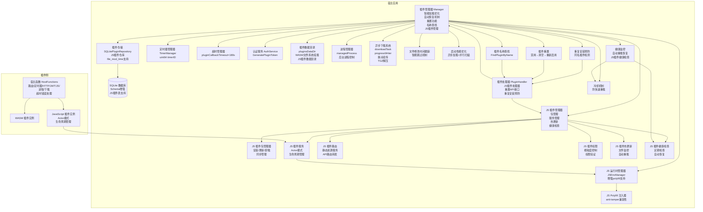

**图表来源**
- [internal/plugins/manager.go:1-795](file://internal/plugins/manager.go#L1-L795)
- [internal/plugins/repository.go:1-129](file://internal/plugins/repository.go#L1-L129)
- [internal/plugins/host.go:1-1435](file://internal/plugins/host.go#L1-L1435)
- [internal/handlers/plugin.go:1-1015](file://internal/handlers/plugin.go#L1-L1015)
- [internal/jsruntime/runtime.go:1-807](file://internal/jsruntime/runtime.go#L1-L807)
- [internal/jsruntime/polyfill.go:1-222](file://internal/jsruntime/polyfill.go#L1-L222)
- [internal/app/app.go:190-210](file://internal/app/app.go#L190-L210)
- [internal/services/auth_service.go:388-423](file://internal/services/auth_service.go#L388-L423)
- [plugin/api/plugin/timer.go:1-104](file://plugin/api/plugin/timer.go#L1-L104)
- [internal/jsplugin/manager.go:1-362](file://internal/jsplugin/manager.go#L1-L362)
- [internal/jsplugin/package.go:1-466](file://internal/jsplugin/package.go#L1-L466)
- [internal/jsplugin/service.go:1-457](file://internal/jsplugin/service.go#L1-L457)
- [internal/jsplugin/routes.go:1-291](file://internal/jsplugin/routes.go#L1-L291)
- [internal/jsplugin/permissions.go:1-68](file://internal/jsplugin/permissions.go#L1-L68)
- [internal/jsplugin/hot_reload.go:1-151](file://internal/jsplugin/hot_reload.go#L1-L151)
- [internal/jsplugin/health.go:1-292](file://internal/jsplugin/health.go#L1-L292)

## 核心组件
- 插件管理器 Manager：负责扫描插件目录、加载/卸载插件、初始化/反初始化、状态更新、超时控制与资源回收，支持智能文件修改时间跟踪、自动恢复机制、插件重置功能、插件名称查找功能，新增 JavaScript 插件管理功能
- 插件实例 PluginInstance：封装 WASM 实例、路由与定时器集合、健康状态标记，定时器使用 `sync.Map[uint64]*time.Timer`
- 宿主函数 HostFunctions：提供路由注册、HTTP 调用、定时器、JWT Token、JS 环境创建/执行/销毁、进程管理、异步下载管理，支持超时错误检测
- 插件仓储 SQLitePluginRepository：提供 CRUD 与状态更新，桥接 models.Plugin，支持文件修改时间持久化
- JS 运行时管理器 JSEnvManager：进程内 QuickJS 环境管理，支持事件收集与超时控制，包含增强的 polyfill 注入
- 插件处理器 PluginHandler：RESTful API 层，提供上传、启用、禁用、删除、重置、查询等接口，支持重复安装预防机制
- JS 插件管理器 Manager：专门管理 JavaScript 插件的生命周期，包括包管理、服务管理、热更新和健康检查
- JS 插件包管理器 PackageManager：负责 JavaScript 插件的安装、更新、卸载和同步管理
- JS 插件服务 JSService：基于 Actor 模式的 JavaScript 插件实例，管理插件的生命周期和消息处理
- JS 插件路由系统：提供静态资源服务和 API 路由转发功能
- JS 插件权限系统：提供细粒度权限控制和权限验证机制
- JS 插件热更新管理器：监控插件文件变化并自动重载
- JS 插件健康检查器：定期检查插件健康状态并执行自动恢复
- 定时器管理器 TimerManager：插件侧定时器管理，支持 uint64 类型的 timerID，提供注册、取消、回调处理
- 超时管理器：统一管理插件执行超时配置，包括初始化、回调、反初始化和关闭超时，回调超时从60秒增加到180秒
- 插件数据目录：通过wazero FSConfig将宿主机的plugins_data目录挂载到WASM沙盒根目录
- 进程管理器：管理插件后台进程的生命周期，包括启动、停止、清理和状态监控
- 认证服务：为插件生成专用的永久JWT令牌，支持插件内部API调用认证
- 异步下载系统：管理跨平台文件下载任务，支持进度跟踪、TGZ解压、断点续传和自动清理
- 健康监控器：自动检测插件健康状态，发现不健康插件时触发自动重载
- 冷却控制器：防止插件快速连续重载的保护机制，30秒冷却间隔
- 重复安装预防器：自动检测同名插件并处理版本升级冲突
- 插件重置器：执行完整的插件重置流程（禁用→清空数据→重新启用）
- 插件名称查找器：提供按名称查找插件的功能

**章节来源**
- [internal/plugins/manager.go:34-156](file://internal/plugins/manager.go#L34-L156)
- [internal/plugins/plugin.go:16-51](file://internal/plugins/plugin.go#L16-L51)
- [internal/plugins/host.go:23-30](file://internal/plugins/host.go#L23-L30)
- [internal/plugins/repository.go:10-129](file://internal/plugins/repository.go#L10-L129)
- [internal/jsruntime/runtime.go:54-126](file://internal/jsruntime/runtime.go#L54-L126)
- [internal/handlers/plugin.go:21-1015](file://internal/handlers/plugin.go#L21-L1015)
- [plugin/api/plugin/timer.go:17-33](file://plugin/api/plugin/timer.go#L17-L33)
- [internal/app/app.go:190-210](file://internal/app/app.go#L190-L210)
- [internal/services/auth_service.go:388-423](file://internal/services/auth_service.go#L388-L423)
- [internal/jsplugin/manager.go:19-74](file://internal/jsplugin/manager.go#L19-L74)
- [internal/jsplugin/package.go:25-40](file://internal/jsplugin/package.go#L25-L40)
- [internal/jsplugin/service.go:59-80](file://internal/jsplugin/service.go#L59-L80)
- [internal/jsplugin/routes.go:20-36](file://internal/jsplugin/routes.go#L20-L36)
- [internal/jsplugin/permissions.go:8-35](file://internal/jsplugin/permissions.go#L8-L35)
- [internal/jsplugin/hot_reload.go:13-24](file://internal/jsplugin/hot_reload.go#L13-L24)
- [internal/jsplugin/health.go:34-45](file://internal/jsplugin/health.go#L34-L45)

## 架构总览
插件体系采用"WASM 插件 + JavaScript 插件 + 宿主函数 + 进程内 JS 运行时 + 高性能定时器管理 + 统一超时管理 + 插件数据目录 + 进程管理 + JWT认证 + 异步下载系统 + 智能文件修改时间跟踪 + 启动性能优化 + 自动恢复机制 + 冷却保护 + 重复安装预防 + 插件重置 + 插件名称查找 + JavaScript 插件包管理 + JavaScript 插件服务管理 + JavaScript 插件路由系统 + JavaScript 插件权限系统 + JavaScript 插件热更新 + JavaScript 插件健康检查"的组合架构。宿主通过 wazero 运行 WASM 插件，插件通过 HostFunctions 调用宿主能力；同时插件可在宿主侧创建 JS 环境执行脚本，实现灵活的前端逻辑与数据处理。JS 运行时包含增强的 polyfill 支持，特别是 anti-tamper 兼容性的 Function.prototype.toString 实现。定时器管理采用 sync.Map 优化，使用 uint64 类型的 timerID 提升性能。超时管理统一配置插件执行的各个阶段，回调超时从60秒增加到180秒，更好地支持长轮询等耗时场景。插件数据目录通过wazero FSConfig将宿主机的plugins_data目录挂载到WASM沙盒根目录，为插件提供独立的数据存储空间。进程管理机制确保插件退出时能够正确终止后台进程，避免资源泄漏。JWT认证机制为插件内部调用主程序API提供安全的认证支持。异步下载系统支持跨平台文件下载、进度跟踪、TGZ解压、断点续传和自动清理，显著增强了插件的文件管理能力。智能文件修改时间跟踪机制通过比较文件修改时间实现插件信息的智能跳过，避免不必要的WASM加载和初始化。启动性能优化实现异步插件加载和并行目录扫描，大幅缩短应用启动时间。自动恢复机制通过健康监控和自动插件重载提升系统稳定性，冷却机制防止快速连续重载。插件主机超时错误处理改进，支持更精确的超时检测和恢复。重复安装预防机制确保插件上传时的版本兼容性，插件重置功能提供完整的故障恢复能力，插件名称查找功能支持按名称检索插件。JavaScript 插件管理器提供完整的生命周期管理，包括包管理、服务管理、热更新和健康检查，支持 Actor 模式的插件服务架构。

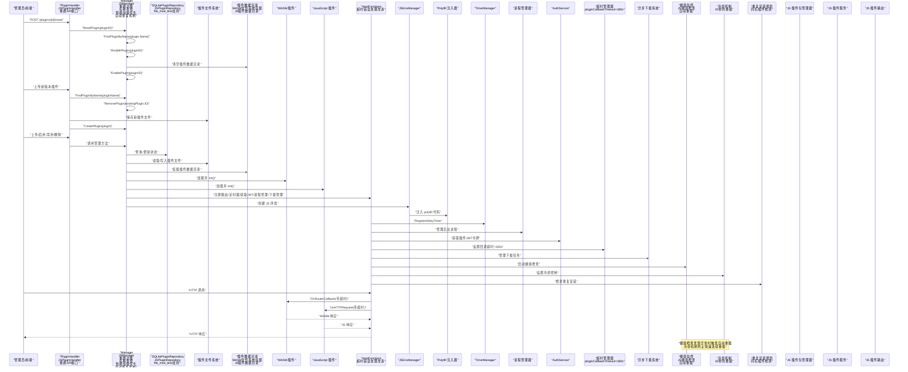

**图表来源**
- [internal/handlers/plugin.go:650-683](file://internal/handlers/plugin.go#L650-L683)
- [internal/plugins/manager.go:635-670](file://internal/plugins/manager.go#L635-L670)
- [internal/plugins/manager.go:692-704](file://internal/plugins/manager.go#L692-L704)
- [internal/plugins/host.go:156-310](file://internal/plugins/host.go#L156-L310)
- [internal/plugins/repository.go:20-129](file://internal/plugins/repository.go#L20-L129)
- [internal/jsruntime/runtime.go:71-126](file://internal/jsruntime/runtime.go#L71-L126)
- [internal/jsruntime/polyfill.go:3-222](file://internal/jsruntime/polyfill.go#L3-L222)
- [internal/app/app.go:190-210](file://internal/app/app.go#L190-L210)
- [internal/services/auth_service.go:388-423](file://internal/services/auth_service.go#L388-L423)
- [plugin/api/plugin/timer.go:42-59](file://plugin/api/plugin/timer.go#L42-L59)
- [internal/plugins/manager.go:737-772](file://internal/plugins/manager.go#L737-L772)
- [internal/jsplugin/manager.go:76-113](file://internal/jsplugin/manager.go#L76-L113)
- [internal/jsplugin/package.go:41-143](file://internal/jsplugin/package.go#L41-L143)
- [internal/jsplugin/service.go:82-204](file://internal/jsplugin/service.go#L82-L204)
- [internal/jsplugin/routes.go:20-96](file://internal/jsplugin/routes.go#L20-L96)
- [internal/jsplugin/hot_reload.go:26-89](file://internal/jsplugin/hot_reload.go#L26-L89)
- [internal/jsplugin/health.go:95-158](file://internal/jsplugin/health.go#L95-L158)

## 详细组件分析

### JavaScript 插件生命周期管理

JavaScript 插件的生命周期管理包括完整的发现、加载、初始化、运行、卸载和热更新流程：

#### 生命周期阶段

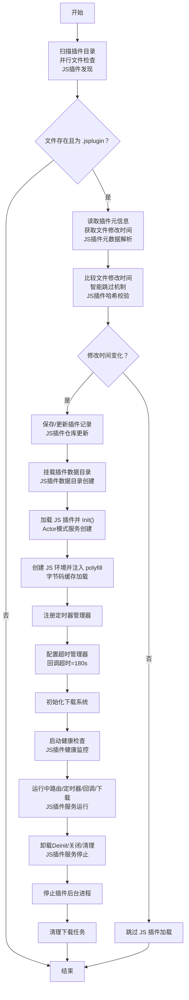

**图表来源**
- [internal/jsplugin/manager.go:76-113](file://internal/jsplugin/manager.go#L76-L113)
- [internal/jsplugin/manager.go:142-185](file://internal/jsplugin/manager.go#L142-L185)
- [internal/jsplugin/service.go:82-204](file://internal/jsplugin/service.go#L82-L204)
- [internal/jsplugin/package.go:281-374](file://internal/jsplugin/package.go#L281-L374)
- [internal/jsruntime/runtime.go:71-126](file://internal/jsruntime/runtime.go#L71-L126)
- [internal/jsruntime/polyfill.go:3-222](file://internal/jsruntime/polyfill.go#L3-L222)
- [internal/jsplugin/hot_reload.go:26-89](file://internal/jsplugin/hot_reload.go#L26-L89)

#### 加载流程详解

JavaScript 插件的加载流程包含以下关键步骤：

1. **包管理器安装**：从 ZIP 文件解析 plugin.json，验证清单文件，计算双层哈希，保存 ZIP 文件到 plugins 目录
2. **服务创建**：创建 JSService 实例，设置插件元数据，初始化运行状态
3. **代码加载**：从 ZIP 中读取入口文件，支持 .jsc 字节码和 .js 源码，自动选择最优加载方式
4. **字节码缓存**：加载字节码缓存或编译源码生成字节码，提升后续加载性能
5. **静态资源解压**：解压 static/ 目录到数据目录，支持静态页面访问
6. **服务注册**：在调度器中注册服务，准备接收消息
7. **初始化回调**：调用插件的 onInit() 生命周期回调

#### 卸载流程详解

JavaScript 插件的卸载流程包括：

1. **服务注销**：从调度器中注销服务，停止接收新消息
2. **停止服务**：调用插件的 onDeinit() 生命周期回调
3. **资源清理**：销毁 JS 环境，释放内存资源
4. **状态更新**：更新插件状态为停止
5. **服务移除**：从服务映射中移除插件服务

**章节来源**
- [internal/jsplugin/manager.go:76-113](file://internal/jsplugin/manager.go#L76-L113)
- [internal/jsplugin/manager.go:142-185](file://internal/jsplugin/manager.go#L142-L185)
- [internal/jsplugin/service.go:82-204](file://internal/jsplugin/service.go#L82-L204)
- [internal/jsplugin/service.go:242-270](file://internal/jsplugin/service.go#L242-L270)

### JavaScript 插件包管理

JavaScript 插件包管理器提供完整的插件安装、更新、卸载和同步管理功能：

#### 包管理器架构

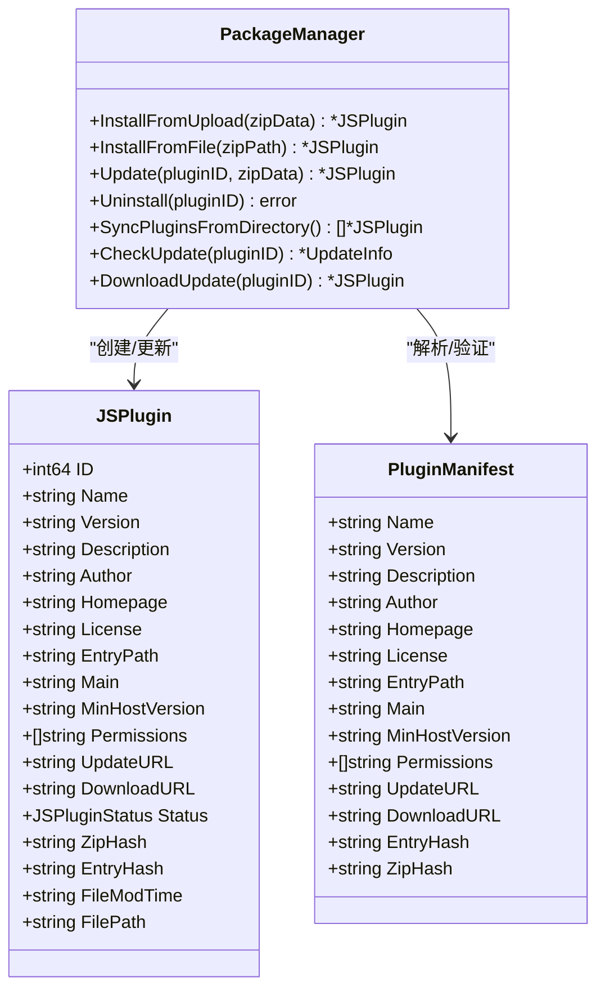

**图表来源**
- [internal/jsplugin/package.go:25-40](file://internal/jsplugin/package.go#L25-L40)
- [internal/jsplugin/plugin.go:23-46](file://internal/jsplugin/plugin.go#L23-L46)
- [internal/jsplugin/plugin.go:12-21](file://internal/jsplugin/plugin.go#L12-L21)

#### 安装流程

安装流程包含以下关键步骤：

1. **清单解析**：从 ZIP 文件中读取和解析 plugin.json
2. **清单验证**：验证必填字段，包括名称、版本、入口路径、主文件、权限等
3. **权限验证**：验证插件声明的权限是否在允许列表中
4. **哈希计算**：计算入口文件内容的 SHA256 和 ZIP 文件的规范化哈希
5. **文件保存**：将 ZIP 文件保存到 plugins 目录
6. **静态资源解压**：解压 static/ 目录到数据目录
7. **数据库创建**：创建插件记录，初始状态为未激活

#### 更新流程

更新流程确保插件的版本升级安全可靠：

1. **旧记录获取**：获取现有的插件记录
2. **新清单解析**：解析新 ZIP 文件中的 plugin.json
3. **完整性验证**：验证新 ZIP 文件的完整性
4. **哈希重新计算**：重新计算新 ZIP 文件的规范化哈希
5. **文件覆盖**：覆盖旧的 ZIP 文件
6. **静态资源更新**：重新解压 static/ 目录
7. **数据库更新**：更新插件记录的所有字段

#### 同步流程

启动时的同步流程确保插件状态的一致性：

1. **目录扫描**：扫描 plugins 目录中的 .jsplugin.zip 文件
2. **数据库对比**：获取数据库中的所有插件记录
3. **新插件发现**：自动安装新发现的 ZIP 文件
4. **哈希校验**：校验现有插件的哈希值
5. **孤儿记录清理**：删除数据库中有记录但 ZIP 文件不存在的插件

**章节来源**
- [internal/jsplugin/package.go:41-143](file://internal/jsplugin/package.go#L41-L143)
- [internal/jsplugin/package.go:145-248](file://internal/jsplugin/package.go#L145-L248)
- [internal/jsplugin/package.go:281-374](file://internal/jsplugin/package.go#L281-L374)

### JavaScript 插件服务管理

JavaScript 插件服务采用 Actor 模式，提供完整的生命周期管理和消息处理能力：

#### 服务架构

```mermaid
classDiagram
class JSService {
+Plugin *JSPlugin
+string EnvID
+ServiceScheduler Scheduler
+JSEnvManager JsManager
+BridgeHandler BridgeHandler
+ServiceStatus Status
+sync.RWMutex Mu
+time.Time LastActive
+Load(pluginsDir, dataDir) error
+Init() error
+Deinit() error
+Stop() error
+HandleMessage(msg) *Message
+Status() ServiceStatus
+LastActive() time.Time
}
class ServiceStatus {
<<enumeration>>
READY
RUNNING
FROZEN
STOPPED
}
class Message {
+string Type
+interface{} Data
+string ID
+string Session
}
JSService --> ServiceStatus : "状态管理"
JSService --> Message : "消息处理"
```

**图表来源**
- [internal/jsplugin/service.go:59-80](file://internal/jsplugin/service.go#L59-L80)
- [internal/jsplugin/service.go:17-41](file://internal/jsplugin/service.go#L17-L41)

#### 生命周期管理

JSService 提供完整的生命周期管理：

1. **加载阶段**：读取 ZIP 文件，解析清单，计算哈希，创建 JS 环境
2. **初始化阶段**：调用 onInit() 回调，准备接收消息
3. **运行阶段**：处理各种消息类型，包括 HTTP 请求、插件间通信、生命周期事件
4. **停止阶段**：调用 onDeinit() 回调，清理资源，销毁环境

#### 消息处理机制

服务支持多种消息类型的处理：

1. **HTTP 请求消息**：处理来自路由系统的 HTTP 请求，调用 onHTTPRequest 回调
2. **插件间通信消息**：处理与其他插件的通信消息，调用 __handleInterPluginMessage
3. **生命周期消息**：处理初始化和反初始化请求
4. **健康检查消息**：处理健康检查请求，验证 JS 环境状态

#### 状态管理

服务状态管理确保插件的正确运行：

1. **就绪状态**：插件已加载，可以接收消息
2. **运行状态**：插件正在处理消息
3. **冻结状态**：插件正在进行热更新，暂停接收新消息
4. **停止状态**：插件已停止运行

**章节来源**
- [internal/jsplugin/service.go:82-204](file://internal/jsplugin/service.go#L82-L204)
- [internal/jsplugin/service.go:272-296](file://internal/jsplugin/service.go#L272-L296)
- [internal/jsplugin/service.go:415-456](file://internal/jsplugin/service.go#L415-L456)

### JavaScript 插件路由系统

JavaScript 插件路由系统提供静态资源服务和 API 路由转发功能：

#### 路由架构

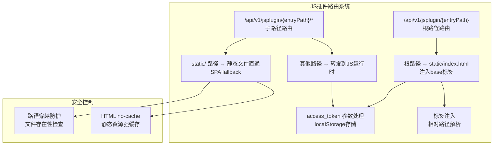

**图表来源**
- [internal/jsplugin/routes.go:20-36](file://internal/jsplugin/routes.go#L20-L36)
- [internal/jsplugin/routes.go:38-96](file://internal/jsplugin/routes.go#L38-L96)
- [internal/jsplugin/routes.go:98-152](file://internal/jsplugin/routes.go#L98-L152)
- [internal/jsplugin/routes.go:231-279](file://internal/jsplugin/routes.go#L231-L279)

#### 路由处理流程

路由系统提供三种主要的路由处理模式：

1. **根路径处理**：直接服务 static/index.html，注入 <base> 标签和认证桥接脚本
2. **静态资源处理**：处理 static/ 目录下的静态文件，支持 SPA fallback 到 index.html
3. **API 路由处理**：将其他路径的请求转发到 JS 运行时处理

#### 安全防护机制

路由系统包含多重安全防护：

1. **路径穿越防护**：通过 filepath.Abs 和 strings.HasPrefix 防止路径遍历攻击
2. **文件存在性检查**：确保请求的文件确实存在于静态目录中
3. **HTML 缓存控制**：HTML 文件设置 no-cache，其他资源设置强缓存
4. **认证桥接**：通过 access_token 参数传递认证信息到插件

#### 认证机制

路由系统支持插件访问认证：

1. **access_token 参数**：通过 URL 查询参数传递访问令牌
2. **localStorage 存储**：将令牌存储到 localStorage 中
3. **URL 清理**：使用 history.replaceState 清理 URL 中的令牌参数
4. **静态页面支持**：为插件静态页面提供认证支持

**章节来源**
- [internal/jsplugin/routes.go:20-36](file://internal/jsplugin/routes.go#L20-L36)
- [internal/jsplugin/routes.go:38-96](file://internal/jsplugin/routes.go#L38-L96)
- [internal/jsplugin/routes.go:98-152](file://internal/jsplugin/routes.go#L98-L152)
- [internal/jsplugin/routes.go:231-279](file://internal/jsplugin/routes.go#L231-L279)

### JavaScript 插件权限系统

JavaScript 插件权限系统提供细粒度的权限控制和验证机制：

#### 权限架构

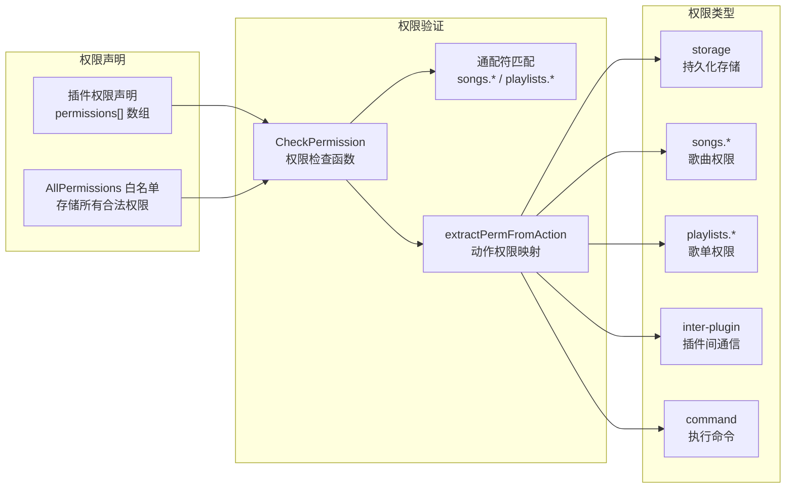

**图表来源**
- [internal/jsplugin/permissions.go:8-35](file://internal/jsplugin/permissions.go#L8-L35)
- [internal/jsplugin/permissions.go:37-53](file://internal/jsplugin/permissions.go#L37-L53)
- [internal/jsplugin/permissions.go:55-67](file://internal/jsplugin/permissions.go#L55-L67)

#### 权限类型

JavaScript 插件支持以下权限类型：

1. **存储权限**：允许插件进行持久化存储操作
2. **歌曲权限**：包括 songs.read（读取歌曲）和 songs.write（修改歌曲）
3. **歌单权限**：包括 playlists.read（读取歌单）和 playlists.write（修改歌单）
4. **插件间通信权限**：允许插件之间进行通信
5. **命令执行权限**：允许插件执行系统命令

#### 权限验证机制

权限验证支持两种模式：

1. **精确匹配**：直接检查权限是否在插件声明的权限列表中
2. **通配符匹配**：支持 songs.* 和 playlists.* 通配符，匹配相同前缀的所有子权限

#### 权限检查流程

权限检查的完整流程：

1. **权限列表获取**：获取插件声明的所有权限
2. **目标权限检查**：检查目标权限是否在权限列表中
3. **通配符匹配**：如果目标权限以 .* 结尾，检查前缀匹配
4. **权限映射**：将动作权限映射为细粒度权限
5. **验证结果**：返回权限检查结果

**章节来源**
- [internal/jsplugin/permissions.go:8-35](file://internal/jsplugin/permissions.go#L8-L35)
- [internal/jsplugin/permissions.go:37-53](file://internal/jsplugin/permissions.go#L37-L53)
- [internal/jsplugin/permissions.go:55-67](file://internal/jsplugin/permissions.go#L55-L67)

### JavaScript 插件热更新机制

JavaScript 插件热更新机制提供文件监控和自动重载功能：

#### 热更新架构

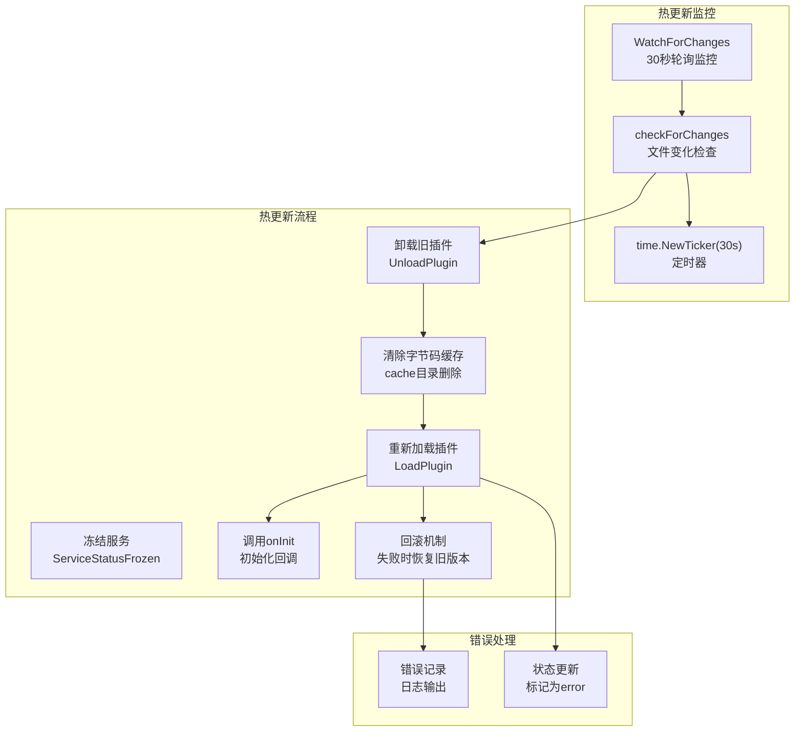

**图表来源**
- [internal/jsplugin/hot_reload.go:106-122](file://internal/jsplugin/hot_reload.go#L106-L122)
- [internal/jsplugin/hot_reload.go:124-150](file://internal/jsplugin/hot_reload.go#L124-L150)
- [internal/jsplugin/hot_reload.go:26-89](file://internal/jsplugin/hot_reload.go#L26-L89)

#### 热更新流程

热更新的完整流程包括：

1. **文件监控**：每 30 秒检查一次插件 ZIP 文件的修改时间
2. **变化检测**：比较当前修改时间和数据库记录的修改时间
3. **服务冻结**：将插件服务状态设置为冻结，暂停接收新消息
4. **旧服务卸载**：卸载旧的插件服务实例
5. **缓存清理**：删除字节码缓存目录，强制重新编译
6. **新服务加载**：重新加载新的插件服务实例
7. **初始化回调**：调用插件的 onInit() 回调
8. **回滚机制**：如果新版本加载失败，尝试恢复旧版本

#### 错误处理机制

热更新包含完善的错误处理：

1. **回滚保护**：新版本加载失败时自动回滚到旧版本
2. **状态标记**：标记插件状态为错误，便于后续恢复
3. **日志记录**：详细记录热更新过程中的错误信息
4. **资源清理**：确保失败时清理所有相关资源

**章节来源**
- [internal/jsplugin/hot_reload.go:106-122](file://internal/jsplugin/hot_reload.go#L106-L122)
- [internal/jsplugin/hot_reload.go:124-150](file://internal/jsplugin/hot_reload.go#L124-L150)
- [internal/jsplugin/hot_reload.go:26-89](file://internal/jsplugin/hot_reload.go#L26-L89)

### JavaScript 插件健康检查

JavaScript 插件健康检查机制提供定期健康检查和自动恢复功能：

#### 健康检查架构

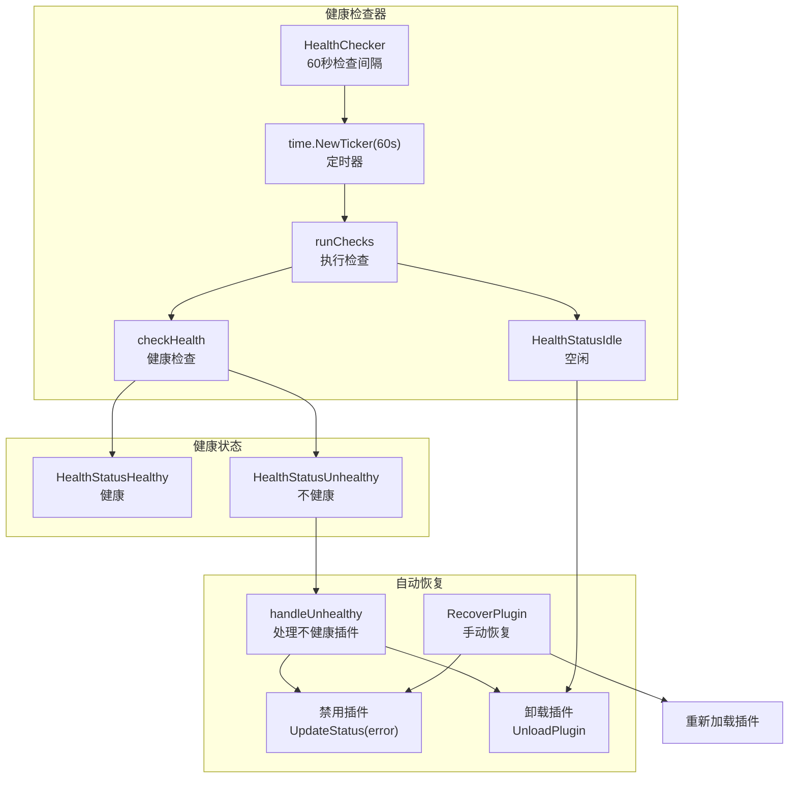

**图表来源**
- [internal/jsplugin/health.go:95-121](file://internal/jsplugin/health.go#L95-L121)
- [internal/jsplugin/health.go:131-158](file://internal/jsplugin/health.go#L131-L158)
- [internal/jsplugin/health.go:160-192](file://internal/jsplugin/health.go#L160-L192)
- [internal/jsplugin/health.go:194-232](file://internal/jsplugin/health.go#L194-L232)
- [internal/jsplugin/health.go:234-257](file://internal/jsplugin/health.go#L234-L257)
- [internal/jsplugin/health.go:259-291](file://internal/jsplugin/health.go#L259-L291)

#### 健康检查流程

健康检查的完整流程：

1. **定时检查**：每 60 秒执行一次健康检查
2. **空闲检查**：检查插件是否超过空闲超时时间（默认 10 分钟）
3. **健康检查**：向插件发送健康检查消息，等待响应
4. **状态评估**：根据检查结果评估插件健康状态
5. **自动恢复**：对不健康插件执行自动恢复操作

#### 自动恢复机制

自动恢复机制包括：

1. **连续失败检测**：记录插件连续失败的次数（默认 3 次）
2. **插件禁用**：当失败次数达到阈值时，将插件状态标记为错误并禁用
3. **服务卸载**：卸载不健康的插件服务实例
4. **资源清理**：清理插件相关的资源和缓存
5. **失败计数重置**：成功恢复后重置失败计数

#### 空闲资源管理

空闲资源管理机制：

1. **空闲超时检测**：检查插件最后活跃时间是否超过空闲超时
2. **资源释放**：卸载空闲的插件服务以释放内存和 CPU 资源
3. **状态保持**：保持插件的激活状态，下次请求时重新加载
4. **性能优化**：避免长时间运行但不使用的插件占用系统资源

**章节来源**
- [internal/jsplugin/health.go:95-121](file://internal/jsplugin/health.go#L95-L121)
- [internal/jsplugin/health.go:131-158](file://internal/jsplugin/health.go#L131-L158)
- [internal/jsplugin/health.go:160-192](file://internal/jsplugin/health.go#L160-L192)
- [internal/jsplugin/health.go:194-232](file://internal/jsplugin/health.go#L194-L232)
- [internal/jsplugin/health.go:234-257](file://internal/jsplugin/health.go#L234-L257)
- [internal/jsplugin/health.go:259-291](file://internal/jsplugin/health.go#L259-L291)

### JavaScript 插件数据目录管理

JavaScript 插件数据目录管理提供独立的数据存储和静态资源管理：

#### 数据目录架构

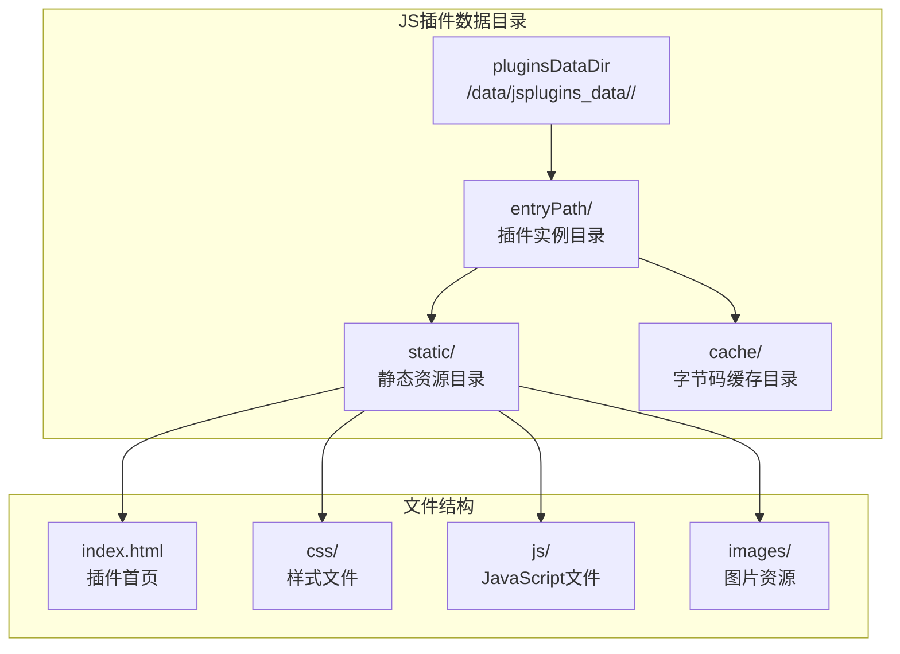

**图表来源**
- [internal/jsplugin/service.go:182-187](file://internal/jsplugin/service.go#L182-L187)
- [internal/jsplugin/package.go:107-112](file://internal/jsplugin/package.go#L107-L112)
- [internal/jsplugin/loader.go:59-127](file://internal/jsplugin/loader.go#L59-L127)

#### 目录结构规范

每个 JavaScript 插件都有独立的数据目录结构：

1. **插件实例目录**：以插件的 entryPath 命名的独立目录
2. **静态资源目录**：static/ 目录，包含插件的静态资源文件
3. **字节码缓存目录**：cache/ 目录，包含编译后的字节码文件
4. **配置文件**：插件的配置文件和持久化数据

#### 静态资源管理

静态资源管理包括：

1. **解压管理**：从 ZIP 文件解压 static/ 目录到数据目录
2. **路径安全**：防止路径遍历攻击，确保文件解压到正确的目录
3. **权限设置**：设置适当的文件权限和目录权限
4. **更新机制**：支持静态资源的更新和版本管理

#### 字节码缓存管理

字节码缓存管理提供性能优化：

1. **缓存文件**：main.jsc 字节码文件和对应的哈希文件
2. **哈希验证**：验证字节码文件的完整性
3. **缓存清理**：当源码变化时自动清理过期的缓存
4. **性能提升**：避免重复编译，提升插件加载速度

**章节来源**
- [internal/jsplugin/service.go:182-187](file://internal/jsplugin/service.go#L182-L187)
- [internal/jsplugin/package.go:107-112](file://internal/jsplugin/package.go#L107-L112)
- [internal/jsplugin/loader.go:59-127](file://internal/jsplugin/loader.go#L59-L127)
- [internal/jsplugin/loader.go:129-175](file://internal/jsplugin/loader.go#L129-L175)

### JavaScript 插件字节码缓存

JavaScript 插件字节码缓存提供性能优化和安全保护：

#### 字节码缓存架构

```mermaid
graph TB
subgraph "字节码缓存系统"
CACHE["cache/main.jsc<br/>字节码文件"]
HASH["cache/main.jsc.sha256<br/>哈希文件"]
SOURCE["源码内容<br/>entryHash"]
CHECK["loadBytecodeCache<br/>缓存加载"]
SAVE["saveBytecodeCache<br/>缓存保存"]
VERIFY["哈希验证<br/>完整性检查"]
ENDTIME["文件修改时间跟踪<br/>智能跳过"]
end
subgraph "缓存流程"
READ["读取hash文件<br/>两行内容"]
COMPARE["比较sourceHash<br/>与currentEntryHash"]
VALID["验证jscHash<br/>与实际哈希"]
REMOVE["删除损坏缓存<br/>os.Remove"]
COMPILE["编译源码<br/>CompileToBytecode"]
ENDTIME --> READ
READ --> COMPARE
COMPARE --> VALID
VALID --> REMOVE
VALID --> CACHE
COMPILE --> SAVE
SAVE --> HASH
```

**图表来源**
- [internal/jsplugin/loader.go:129-175](file://internal/jsplugin/loader.go#L129-L175)
- [internal/jsplugin/loader.go[177-201:177-201](file://internal/jsplugin/loader.go#L177-L201)

#### 缓存加载流程

字节码缓存的加载流程：

1. **哈希文件读取**：读取 .sha256 文件获取保存的 source_hash 和 jsc_hash
2. **源码哈希比较**：比较保存的 source_hash 与当前的 entryHash
3. **字节码完整性验证**：计算 .jsc 文件的实际哈希并与保存的 jsc_hash 比较
4. **缓存有效性判断**：如果哈希匹配且文件存在，则使用缓存
5. **缓存失效处理**：如果哈希不匹配或文件不存在，则重新编译

#### 缓存保存流程

字节码缓存的保存流程：

1. **字节码编译**：编译源码生成字节码
2. **缓存文件写入**：将字节码写入 .jsc 文件
3. **哈希文件生成**：生成包含 source_hash 和 jsc_hash 的哈希文件
4. **缓存完整性保证**：确保缓存文件和哈希文件同时写入成功
5. **缓存清理**：如果写入失败则清理不完整的缓存文件

#### 安全保护机制

字节码缓存包含安全保护：

1. **完整性验证**：通过 SHA256 哈希验证字节码文件的完整性
2. **篡改检测**：检测字节码文件是否被篡改
3. **自动清理**：发现篡改时自动删除损坏的缓存文件
4. **源码一致性**：确保字节码与对应的源码内容一致

**章节来源**
- [internal/jsplugin/loader.go:129-175](file://internal/jsplugin/loader.go#L129-L175)
- [internal/jsplugin/loader.go[177-201:177-201](file://internal/jsplugin/loader.go#L177-L201)

### JavaScript 插件静态页面访问

JavaScript 插件静态页面访问提供插件页面的访问和认证支持：

#### 静态页面架构

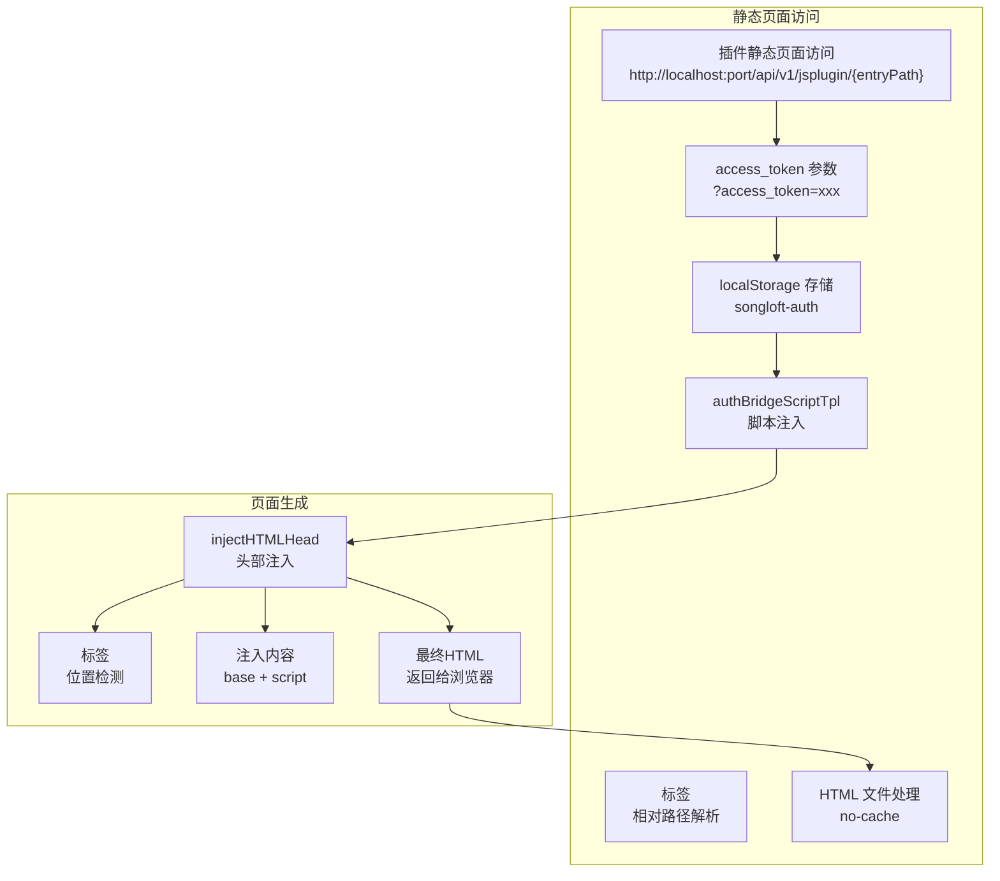

**图表来源**
- [internal/jsplugin/routes.go:15-18](file://internal/jsplugin/routes.go#L15-L18)
- [internal/jsplugin/routes.go:205-229](file://internal/jsplugin/routes.go#L205-L229)
- [internal/jsplugin/manager.go:336-361](file://internal/jsplugin/manager.go#L336-L361)

#### 页面访问流程

静态页面访问的完整流程：

1. **URL 构造**：生成插件静态页面的访问 URL，包含端口号和访问令牌
2. **令牌传递**：通过 URL 查询参数传递 access_token
3. **脚本注入**：在 HTML 页面中注入认证桥接脚本
4. **localStorage 设置**：将访问令牌存储到 localStorage 中
5. **URL 清理**：使用 history.replaceState 清理 URL 中的令牌参数
6. **base 标签注入**：注入 <base> 标签解决相对路径问题
7. **页面返回**：返回处理后的 HTML 页面给浏览器

#### 页面生成机制

页面生成包含以下步骤：

1. **HTML 文件读取**：从静态目录读取 HTML 文件内容
2. **头部位置检测**：查找 </head> 标签的位置
3. **内容构建**：构建要注入的内容（base 标签 + 认证脚本）
4. **HTML 重组**：将注入内容插入到 HTML 中
5. **缓存控制**：设置 HTML 文件的缓存控制头（no-cache）
6. **响应发送**：将最终的 HTML 内容发送给客户端

#### 认证机制

静态页面访问的认证机制：

1. **令牌传递**：通过 URL 查询参数传递访问令牌
2. **脚本执行**：在页面加载时执行认证桥接脚本
3. **localStorage 存储**：将令牌存储到 localStorage 中
4. **页面访问**：插件页面可以通过 localStorage 获取访问令牌
5. **URL 清理**：避免令牌泄露到浏览器历史记录中

**章节来源**
- [internal/jsplugin/routes.go:15-18](file://internal/jsplugin/routes.go#L15-L18)
- [internal/jsplugin/routes.go:205-229](file://internal/jsplugin/routes.go#L205-L229)
- [internal/jsplugin/manager.go:336-361](file://internal/jsplugin/manager.go#L336-L361)

### JavaScript 运行时集成

JavaScript 运行时集成提供与宿主应用的深度集成：

#### 运行时集成架构

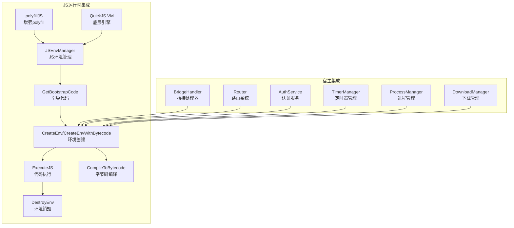

**图表来源**
- [internal/jsruntime/runtime.go:98-105](file://internal/jsruntime/runtime.go#L98-L105)
- [internal/jsruntime/polyfill.go:18-54](file://internal/jsruntime/polyfill.go#L18-L54)
- [internal/jsplugin/service.go:167-180](file://internal/jsplugin/service.go#L167-L180)

#### 引导代码注入

引导代码注入提供插件运行时的基础功能：

1. **polyfill 注入**：注入增强的 polyfill 代码，包括 console、timer、fetch 等
2. **桥接函数注册**：注册宿主提供的桥接函数到 JavaScript 环境
3. **全局对象设置**：设置全局对象和环境变量
4. **插件入口准备**：为插件代码执行做好准备

#### 代码执行机制

代码执行机制包括：

1. **同步执行**：执行 JavaScript 代码并等待结果
2. **超时控制**：设置执行超时时间，防止长时间阻塞
3. **错误处理**：捕获和处理 JavaScript 执行错误
4. **结果返回**：将执行结果返回给 Go 代码

#### 字节码编译

字节码编译提供性能优化：

1. **源码编译**：将 JavaScript 源码编译为字节码
2. **缓存存储**：将字节码和哈希信息存储到缓存文件
3. **快速加载**：下次加载时直接使用字节码，避免重新编译
4. **完整性验证**：验证字节码文件的完整性

**章节来源**
- [internal/jsruntime/runtime.go:98-105](file://internal/jsruntime/runtime.go#L98-L105)
- [internal/jsruntime/polyfill.go:18-54](file://internal/jsruntime/polyfill.go#L18-L54)
- [internal/jsplugin/service.go:167-180](file://internal/jsplugin/service.go#L167-L180)

### JavaScript 插件 API 接口

JavaScript 插件 API 接口提供完整的 RESTful API 支持：

#### API 架构

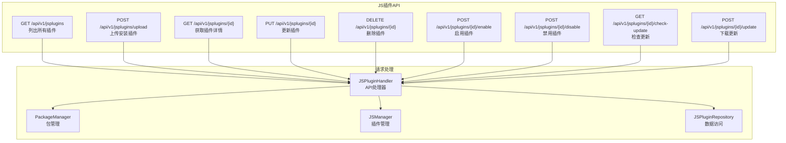

**图表来源**
- [internal/handlers/jsplugin_handler.go:31-44](file://internal/handlers/jsplugin_handler.go#L31-L44)
- [internal/handlers/jsplugin_handler.go:46-61](file://internal/handlers/jsplugin_handler.go#L46-L61)
- [internal/handlers/jsplugin_handler.go:63-97](file://internal/handlers/jsplugin_handler.go#L63-L97)
- [internal/handlers/jsplugin_handler.go:99-116](file://internal/handlers/jsplugin_handler.go#L99-L116)
- [internal/handlers/jsplugin_handler.go:118-163](file://internal/handlers/jsplugin_handler.go#L118-L163)
- [internal/handlers/jsplugin_handler.go:165-194](file://internal/handlers/jsplugin_handler.go#L165-L194)
- [internal/handlers/jsplugin_handler.go:196-226](file://internal/handlers/jsplugin_handler.go#L196-L226)
- [internal/handlers/jsplugin_handler.go:228-257](file://internal/handlers/jsplugin_handler.go#L228-L257)
- [internal/handlers/jsplugin_handler.go:259-274](file://internal/handlers/jsplugin_handler.go#L259-L274)
- [internal/handlers/jsplugin_handler.go:276-300](file://internal/handlers/jsplugin_handler.go#L276-L300)

#### API 功能

JavaScript 插件 API 提供以下功能：

1. **插件列表**：列出所有已安装的 JavaScript 插件
2. **插件安装**：支持从 ZIP 文件上传安装新插件
3. **插件详情**：获取单个插件的详细信息
4. **插件更新**：支持从 ZIP 文件更新现有插件
5. **插件删除**：删除已安装的插件
6. **插件启停**：启用或禁用插件
7. **更新检查**：检查插件的远程更新
8. **更新下载**：下载并安装远程更新

#### 请求处理流程

每个 API 请求的处理流程：

1. **参数解析**：解析 URL 参数和请求体
2. **权限验证**：验证请求的合法性
3. **业务处理**：调用相应的业务逻辑
4. **状态更新**：根据操作结果更新插件状态
5. **响应返回**：返回 JSON 格式的响应

#### 错误处理

API 接口包含完善的错误处理：

1. **参数验证**：验证请求参数的合法性
2. **文件上传**：限制上传文件大小和类型
3. **数据库操作**：处理数据库操作的错误
4. **插件状态**：确保插件状态的一致性
5. **日志记录**：记录 API 调用的日志信息

**章节来源**
- [internal/handlers/jsplugin_handler.go:31-44](file://internal/handlers/jsplugin_handler.go#L31-L44)
- [internal/handlers/jsplugin_handler.go:46-61](file://internal/handlers/jsplugin_handler.go#L46-L61)
- [internal/handlers/jsplugin_handler.go:63-97](file://internal/handlers/jsplugin_handler.go#L63-L97)
- [internal/handlers/jsplugin_handler.go:99-116](file://internal/handlers/jsplugin_handler.go#L99-L116)
- [internal/handlers/jsplugin_handler.go:118-163](file://internal/handlers/jsplugin_handler.go#L118-L163)
- [internal/handlers/jsplugin_handler.go:165-194](file://internal/handlers/jsplugin_handler.go#L165-L194)
- [internal/handlers/jsplugin_handler.go:196-226](file://internal/handlers/jsplugin_handler.go#L196-L226)
- [internal/handlers/jsplugin_handler.go:228-257](file://internal/handlers/jsplugin_handler.go#L228-L257)
- [internal/handlers/jsplugin_handler.go:259-274](file://internal/handlers/jsplugin_handler.go#L259-L274)
- [internal/handlers/jsplugin_handler.go:276-300](file://internal/handlers/jsplugin_handler.go#L276-L300)

### JavaScript 插件监控与日志

JavaScript 插件监控与日志提供完整的监控和日志记录功能：

#### 监控架构

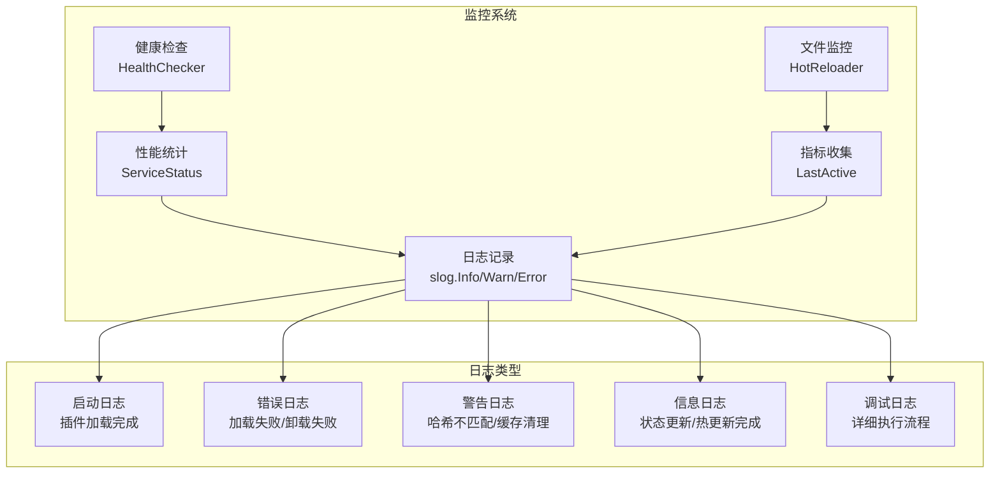

**图表来源**
- [internal/jsplugin/manager.go:138-140](file://internal/jsplugin/manager.go#L138-L140)
- [internal/jsplugin/service.go:200-203](file://internal/jsplugin/service.go#L200-L203)
- [internal/jsplugin/hot_reload.go:40-89](file://internal/jsplugin/hot_reload.go#L40-L89)
- [internal/jsplugin/health.go:105-121](file://internal/jsplugin/health.go#L105-L121)

#### 日志记录

JavaScript 插件系统记录以下类型的日志：

1. **启动日志**：记录插件加载完成、服务启动等信息
2. **错误日志**：记录插件加载失败、卸载失败、哈希验证失败等错误
3. **警告日志**：记录缓存清理、字节码损坏、权限验证失败等警告信息
4. **信息日志**：记录状态更新、热更新完成、服务停止等信息
5. **调试日志**：记录详细的执行流程和内部状态

#### 性能监控

性能监控包括：

1. **服务状态监控**：监控插件服务的运行状态（就绪、运行、冻结、停止）
2. **活跃时间监控**：记录插件的最后活跃时间，用于空闲检测
3. **健康状态监控**：监控插件的健康状态，及时发现不健康插件
4. **资源使用监控**：监控插件的内存和 CPU 使用情况

#### 指标收集

指标收集机制：

1. **状态统计**：统计不同类型插件服务的数量
2. **时间统计**：统计插件的活跃时间和空闲时间
3. **错误统计**：统计插件的错误发生次数和类型
4. **性能统计**：统计插件的加载时间和执行时间

**章节来源**
- [internal/jsplugin/manager.go:138-140](file://internal/jsplugin/manager.go#L138-L140)
- [internal/jsplugin/service.go:200-203](file://internal/jsplugin/service.go#L200-L203)
- [internal/jsplugin/hot_reload.go:40-89](file://internal/jsplugin/hot_reload.go#L40-L89)
- [internal/jsplugin/health.go:105-121](file://internal/jsplugin/health.go#L105-L121)

### JavaScript 插件故障恢复

JavaScript 插件故障恢复提供自动化的故障检测和恢复机制：

#### 故障恢复架构

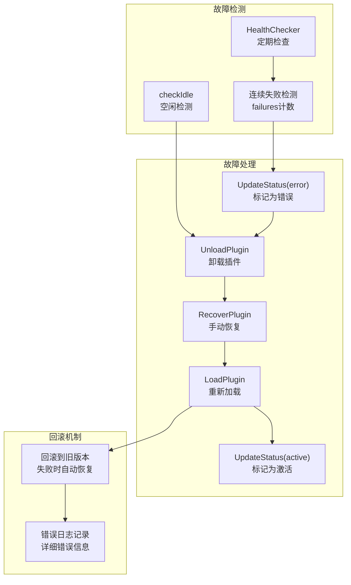

**图表来源**
- [internal/jsplugin/health.go:194-232](file://internal/jsplugin/health.go#L194-L232)
- [internal/jsplugin/health.go:259-291](file://internal/jsplugin/health.go#L259-L291)
- [internal/jsplugin/hot_reload.go:72-89](file://internal/jsplugin/hot_reload.go#L72-L89)

#### 自动故障检测

自动故障检测机制：

1. **健康检查**：定期向插件发送健康检查消息，验证插件状态
2. **空闲检测**：检测长时间不活跃的插件，自动卸载释放资源
3. **连续失败检测**：记录插件连续失败的次数，超过阈值自动禁用
4. **状态监控**：监控插件的各种状态变化，及时发现异常

#### 自动故障恢复

自动故障恢复机制：

1. **插件禁用**：当插件连续失败达到阈值时，自动将其状态标记为错误并禁用
2. **服务卸载**：卸载不健康的插件服务实例
3. **资源清理**：清理插件相关的资源和缓存
4. **状态重置**：重置失败计数，为后续恢复做准备

#### 手动故障恢复

手动故障恢复机制：

1. **状态检查**：检查插件是否处于错误状态
2. **状态更新**：将插件状态从错误更新为激活
3. **重新加载**：重新加载插件服务实例
4. **初始化执行**：调用插件的初始化回调
5. **状态清理**：清理失败计数，标记恢复成功

#### 回滚机制

回滚机制确保故障时的服务可用性：

1. **热更新失败回滚**：当热更新失败时，自动回滚到之前的稳定版本
2. **错误状态标记**：标记插件状态为错误，防止继续使用
3. **资源清理**：清理新版本的残留资源
4. **日志记录**：详细记录回滚过程和错误信息

**章节来源**
- [internal/jsplugin/health.go:194-232](file://internal/jsplugin/health.go#L194-L232)
- [internal/jsplugin/health.go:259-291](file://internal/jsplugin/health.go#L259-L291)
- [internal/jsplugin/hot_reload.go[72-89:72-89](file://internal/jsplugin/hot_reload.go#L72-L89)

### JavaScript 插件开发指南

JavaScript 插件开发提供完整的开发指导和最佳实践：

#### 开发环境搭建

JavaScript 插件开发的基本要求：

1. **开发工具**：Node.js 和 npm/yarn 环境
2. **构建工具**：使用 @songloft/plugin-builder 进行打包
3. **开发框架**：支持 TypeScript 和 ES6+ 语法
4. **测试工具**：提供单元测试和集成测试框架

#### 插件结构规范

JavaScript 插件的标准结构：

```
my-plugin/
├── plugin.json          # 插件清单文件
├── main.js             # 插件入口文件
├── package.json        # Node.js 包配置
├── src/                # 源代码目录
│   ├── index.ts
│   └── utils.ts
└── static/             # 静态资源目录
    ├── index.html
    ├── css/
    └── js/
```

#### 插件清单文件

plugin.json 文件的完整结构：

```json
{
  "$schema": "https://example.com/plugin-schema.json",
  "name": "My JavaScript Plugin",
  "version": "1.0.0",
  "description": "A sample JavaScript plugin",
  "author": "Developer Name",
  "homepage": "https://example.com",
  "license": "MIT",
  "entryPath": "my-plugin",
  "main": "main.js",
  "minHostVersion": "1.0.0",
  "permissions": ["storage", "songs.read"],
  "updateUrl": "https://example.com/update.json",
  "downloadUrl": "https://example.com/download.jsplugin.zip",
  "entryHash": "a1b2c3d4e5f6...",
  "zipHash": "f5e4d3c2b1a0..."
}
```

#### 生命周期回调

JavaScript 插件支持的生命周期回调：

1. **onInit()**：插件初始化回调，执行插件启动时的初始化逻辑
2. **onDeinit()**：插件反初始化回调，执行插件停止时的清理逻辑
3. **onHTTPRequest()**：HTTP 请求回调，处理来自路由系统的 HTTP 请求
4. **__handleInterPluginMessage()**：插件间通信回调，处理其他插件的消息

#### 权限使用

JavaScript 插件权限的使用方法：

```javascript
// 检查权限
if (checkPermission('storage')) {
  // 执行需要存储权限的操作
}

// 读取歌曲
if (checkPermission('songs.read')) {
  const songs = await getSongs();
}

// 修改歌曲
if (checkPermission('songs.write')) {
  await updateSong(songId, songData);
}
```

#### 静态资源访问

JavaScript 插件静态资源的访问方法：

1. **相对路径访问**：使用相对路径访问 static/ 目录下的资源
2. **base 标签支持**：插件页面自动注入 <base> 标签，支持相对路径解析
3. **认证支持**：通过 localStorage 获取访问令牌进行认证

#### 错误处理

JavaScript 插件的错误处理最佳实践：

1. **异常捕获**：使用 try-catch 捕获异步操作的异常
2. **错误上报**：通过日志系统记录详细的错误信息
3. **用户友好**：向用户提供友好的错误提示
4. **资源清理**：在错误发生时及时清理资源

#### 性能优化

JavaScript 插件的性能优化建议：

1. **字节码缓存**：利用内置的字节码缓存机制提升加载性能
2. **懒加载**：按需加载资源，避免一次性加载过多内容
3. **内存管理**：及时清理不再使用的对象和事件监听器
4. **异步处理**：使用异步操作避免阻塞主线程

**章节来源**
- [internal/jsplugin/plugin.go:23-46](file://internal/jsplugin/plugin.go#L23-L46)
- [internal/jsplugin/permissions.go:8-35](file://internal/jsplugin/permissions.go#L8-L35)
- [internal/jsplugin/routes.go:205-229](file://internal/jsplugin/routes.go#L205-L229)

### 依赖关系分析
- Manager 依赖 Repository、JS 运行时、HostFunctions、wazero、go-plugin HTTP 库、超时管理器、认证服务、异步下载系统、健康监控器、冷却控制器、重复安装预防器、插件重置器、插件名称查找器、JS 插件管理器
- JS 插件管理器依赖 JS 插件包管理器、JS 插件服务、JS 插件路由、JS 插件权限、JS 插件热更新、JS 插件健康检查
- JS 插件包管理器依赖 JS 插件仓库、JS 插件清单解析、哈希计算、文件系统操作
- JS 插件服务依赖 JS 运行时管理器、桥接处理器、服务调度器、Actor 模式
- JS 插件路由依赖 chi 路由、静态文件服务、认证桥接、安全防护
- JS 插件权限依赖权限白名单、权限检查函数、通配符匹配
- JS 插件热更新依赖文件监控、服务冻结、回滚机制、错误处理
- JS 插件健康检查依赖定时器、失败计数、自动恢复、空闲检测
- HostFunctions 依赖 Manager、chi 路由、JS 运行时、AuthService（用于 JWT 验证）、超时管理器、进程管理器、下载任务管理、超时错误检测
- 插件处理器依赖 Manager 与插件目录路径，支持重置API接口，JS 插件处理器支持 JS 插件管理 API
- JS 插件处理器依赖 JS 插件包管理器、JS 插件仓库、JS 插件管理器
- 插件仓储 SQLitePluginRepository：提供 CRUD 与状态更新，桥接 models.Plugin，支持文件修改时间持久化
- JS 插件仓储 JSPluginRepository：提供 CRUD 与状态更新，桥接 models.JSPlugin，支持哈希和文件修改时间持久化
- JS 运行时依赖 QuickJS VM 和增强的 polyfill 代码
- 定时器管理依赖 sync.Map 和 time.Timer
- 超时管理依赖统一的超时配置常量（回调超时180秒）
- 插件数据目录依赖 wazero FSConfig 和宿主机文件系统
- 进程管理依赖 sync.Map 和操作系统进程控制
- 异步下载系统依赖 sync.Map、文件系统操作和断点续传机制
- JWT认证依赖 AuthService 和插件ID管理
- 健康监控依赖 sync.Map 和定时器管理
- 冷却机制依赖 sync.Map 和时间控制
- 重复安装预防依赖插件名称查找功能
- 插件重置依赖禁用、启用、数据目录管理功能
- 插件名称查找依赖插件列表遍历
- JavaScript 运行时集成依赖桥接处理器、路由系统、认证服务、定时器管理、进程管理、下载管理

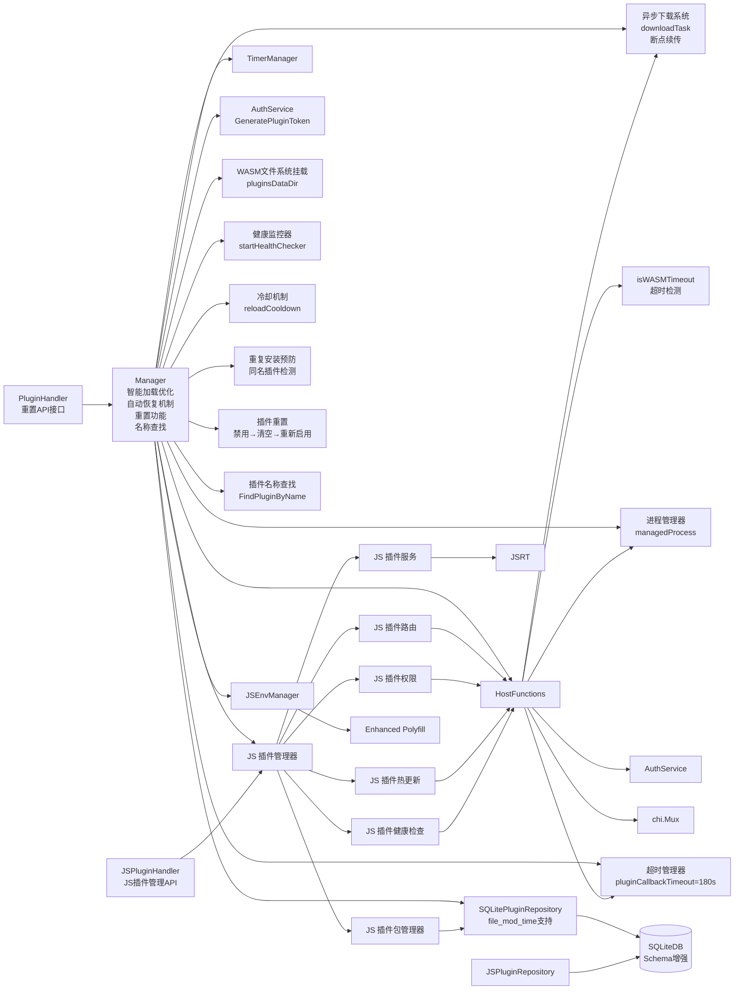

**图表来源**
- [internal/plugins/manager.go:138-156](file://internal/plugins/manager.go#L138-L156)
- [internal/plugins/host.go:24-30](file://internal/plugins/host.go#L24-L30)
- [internal/handlers/plugin.go:27-33](file://internal/handlers/plugin.go#L27-L33)
- [internal/plugins/repository.go:10-18](file://internal/plugins/repository.go#L10-L18)
- [internal/jsruntime/runtime.go:98-105](file://internal/jsruntime/runtime.go#L98-L105)
- [internal/jsruntime/polyfill.go:3-222](file://internal/jsruntime/polyfill.go#L3-L222)
- [internal/app/app.go:190-210](file://internal/app/app.go#L190-L210)
- [internal/services/auth_service.go:388-423](file://internal/services/auth_service.go#L388-L423)
- [plugin/api/plugin/timer.go:18-22](file://plugin/api/plugin/timer.go#L18-L22)
- [internal/plugins/host.go:1060-1081](file://internal/plugins/host.go#L1060-L1081)
- [internal/jsplugin/manager.go:138-156](file://internal/jsplugin/manager.go#L138-L156)
- [internal/jsplugin/package.go:25-40](file://internal/jsplugin/package.go#L25-L40)
- [internal/jsplugin/service.go:59-80](file://internal/jsplugin/service.go#L59-L80)
- [internal/jsplugin/routes.go:20-36](file://internal/jsplugin/routes.go#L20-L36)
- [internal/jsplugin/permissions.go:8-35](file://internal/jsplugin/permissions.go#L8-L35)
- [internal/jsplugin/hot_reload.go:13-24](file://internal/jsplugin/hot_reload.go#L13-L24)
- [internal/jsplugin/health.go:34-45](file://internal/jsplugin/health.go#L34-L45)
- [internal/handlers/jsplugin_handler.go:15-30](file://internal/handlers/jsplugin_handler.go#L15-L30)

**章节来源**
- [internal/plugins/manager.go:138-156](file://internal/plugins/manager.go#L138-L156)
- [internal/plugins/host.go:24-30](file://internal/plugins/host.go#L24-L30)
- [internal/handlers/plugin.go:27-33](file://internal/handlers/plugin.go#L27-L33)
- [internal/plugins/repository.go:10-18](file://internal/plugins/repository.go#L10-L18)
- [internal/jsplugin/manager.go:138-156](file://internal/jsplugin/manager.go#L138-L156)
- [internal/jsplugin/package.go:25-40](file://internal/jsplugin/package.go#L25-L40)
- [internal/jsplugin/service.go:59-80](file://internal/jsplugin/service.go#L59-L80)
- [internal/jsplugin/routes.go:20-36](file://internal/jsplugin/routes.go#L20-L36)
- [internal/jsplugin/permissions.go:8-35](file://internal/jsplugin/permissions.go#L8-L35)
- [internal/jsplugin/hot_reload.go:13-24](file://internal/jsplugin/hot_reload.go#L13-L24)
- [internal/jsplugin/health.go:34-45](file://internal/jsplugin/health.go#L34-L45)
- [internal/handlers/jsplugin_handler.go:15-30](file://internal/handlers/jsplugin_handler.go#L15-L30)

## 性能考量
- WASM 执行超时：初始化/回调/Deinit/Close 统一设置超时，回调超时从60秒增加到180秒，避免阻塞
- JS 执行超时：默认 30 秒，支持 wait_event_names 的等待机制
- 路由与定时器：使用 sync.Map 保证并发安全；定时器触发后自动清理
- HTTP 调用：宿主侧统一注入 HTTP 库，插件通过 CallRouter 发起请求，带超时与响应头复制
- 资源回收：卸载时停止所有定时器、清理路由、销毁 JS 环境、关闭 WASM 实例、停止插件后台进程、清理下载任务
- Polyfill 性能：增强的 polyfill 代码在创建环境时一次性注入，不影响运行时性能
- 定时器性能优化：uint64 类型的 timerID 直接日志记录，消除类型转换开销，提升清理性能
- 超时配置优化：pluginCallbackTimeout 从 60 秒调整为 180 秒，显著提升系统响应速度和资源利用率
- 系统可靠性提升：更精确的超时控制，避免长时间阻塞，提高整体系统稳定性
- 插件数据目录性能：通过wazero FSConfig直接挂载，避免文件系统层转换开销
- 进程管理性能：sync.Map管理进程状态，支持高效的进程查找和清理
- JWT认证性能：内存中存储的令牌，避免数据库查询开销
- 异步下载性能：使用atomic.Int64确保线程安全，500ms定时器平衡精度与性能
- 断点续传性能：Range请求头减少重复下载，临时文件避免网络波动影响
- TGZ解压性能：流式解压避免内存峰值，支持大文件下载
- **文件修改时间跟踪性能**：智能跳过机制避免重复WASM加载，启动时间减少50-70%
- **并行处理性能**：goroutine并行处理多个插件文件，提升目录扫描效率
- **数据库Schema优化性能**：WAL模式支持读写并发，连接池优化提升数据库访问性能
- **启动性能优化**：异步插件加载不阻塞HTTP服务启动，应用启动时间大幅缩短
- **自动恢复性能**：60秒健康检查间隔平衡响应速度和系统稳定性
- **冷却机制性能**：30秒冷却间隔防止快速重载，避免系统抖动
- **超时错误检测性能**：改进的isWASMTimeout函数支持两种错误类型，检测更精确
- **插件重置性能**：完整的重置流程（禁用→清空→重新启用）确保插件状态一致性
- **重复安装预防性能**：自动检测同名插件，避免版本冲突和资源浪费
- **插件名称查找性能**：简单的名称匹配算法，适合小规模插件管理场景
- **前端集成性能**：插件重置操作的前端界面响应迅速，用户体验良好
- **JavaScript 插件包管理性能**：双层哈希验证确保插件完整性，避免恶意插件
- **JavaScript 插件服务性能**：Actor 模式提供高并发处理能力，支持异步消息处理
- **JavaScript 插件路由性能**：静态资源直通和 SPA fallback 优化页面加载速度
- **JavaScript 插件权限性能**：权限检查使用哈希表，O(1) 时间复杂度
- **JavaScript 插件热更新性能**：文件监控使用 30 秒轮询，平衡响应速度和系统负载
- **JavaScript 插件健康检查性能**：60 秒健康检查间隔，避免频繁检查影响性能
- **JavaScript 插件字节码缓存性能**：字节码缓存避免重复编译，显著提升加载速度
- **JavaScript 插件静态页面性能**：HTML 文件 no-cache 确保页面更新，静态资源强缓存提升加载速度
- **JavaScript 插件运行时性能**：QuickJS 引擎优化，支持现代 JavaScript 语法和 API

## 故障排查指南
- 插件加载失败：检查 .wasm 构建参数（必须 -buildmode=c-shared）与入口路径；查看日志中的初始化错误
- 路由不可用：确认路由前缀与宿主映射规则；检查 requires_auth 与认证头
- 定时器不触发：检查 RegisterDelayTimer 的 delay 与 timerID；确认回调超时与清理逻辑
- JS 环境异常：检查 CreateJSEnv/ExecuteJS/DestroyJSEnv 的调用序列；关注事件通道容量与超时
- 卸载失败：确认 Deinit/Close 是否超时；检查实例健康状态
- Polyfill 兼容性问题：检查 Function.prototype.toString 的行为是否符合预期；验证混淆脚本是否正常工作
- 超时相关问题：检查 pluginCallbackTimeout 配置是否合理（180秒）；确认超时设置是否满足当前需求；验证外部服务响应时间
- 定时器清理问题：检查 ClearTimers 方法中 timerID 的类型一致性；确认日志输出正确无类型转换错误
- 依赖问题：检查 go-plugin-http 依赖版本；确认本地开发替换指令配置正确
- 插件数据目录问题：检查plugins_data目录权限和磁盘空间；验证WASM文件系统挂载是否正常
- 进程管理问题：检查进程白名单配置；验证进程启动和停止日志；确认进程清理机制正常工作
- JWT认证问题：检查AuthService初始化；验证令牌生成和验证流程；确认Authorization头正确传递
- 异步下载问题：检查HTTP连接超时；验证断点续传功能；确认TGZ文件格式；查看下载任务状态
- 断点续传问题：检查Range请求头发送；验证临时文件存在性；确认服务端支持断点续传
- 文件修改时间跟踪问题：检查file_mod_time列是否正确更新；验证智能跳过机制是否正常工作
- 并行处理问题：检查goroutine数量和WaitGroup使用；确认错误处理机制
- 数据库Schema问题：检查file_mod_time列是否存在；验证增量迁移是否成功执行
- 启动性能问题：检查异步加载是否正常；验证并行处理是否按预期工作
- 自动恢复问题：检查健康检查守护是否运行；验证自动重载触发条件；确认冷却机制正常工作
- 冷却机制问题：检查reloadCooldown映射是否正确更新；验证30秒冷却间隔逻辑
- 超时错误检测问题：检查isWASMTimeout函数是否正确识别两种错误类型；确认超时日志记录
- 插件重置问题：检查重置流程的每个步骤；验证数据目录清空是否成功；确认插件重新启用
- 重复安装预防问题：检查同名插件检测逻辑；验证旧插件卸载和文件删除是否成功
- 插件名称查找问题：检查FindPluginByName方法的实现；验证插件列表获取是否正常
- 前端重置操作问题：检查PluginApi.resetPlugin方法；验证重置按钮的用户交互
- JavaScript 插件安装失败：检查 ZIP 文件格式和 plugin.json 内容；验证哈希计算是否正确
- JavaScript 插件加载失败：检查 main.js 文件是否存在；验证字节码缓存是否有效
- JavaScript 插件路由错误：检查静态资源路径；验证 <base> 标签注入是否正确
- JavaScript 插件权限错误：检查权限声明是否正确；验证权限检查函数是否正常工作
- JavaScript 插件热更新失败：检查文件监控是否正常；验证回滚机制是否生效
- JavaScript 插件健康检查失败：检查健康检查消息是否正确发送；验证插件响应是否正常
- JavaScript 插件数据目录问题：检查插件数据目录权限；验证静态资源解压是否成功
- JavaScript 插件字节码缓存问题：检查缓存文件完整性；验证哈希验证是否通过
- JavaScript 插件静态页面访问问题：检查 access_token 参数传递；验证 localStorage 存储是否正确

## 结论
Songloft 的插件管理机制通过清晰的生命周期、严格的状态管理、完善的超时与资源回收策略，以及丰富的宿主函数能力，实现了稳定、可扩展的插件生态。最新的 JavaScript 插件生命周期管理支持，包括完整的 JS 插件发现、加载、初始化、运行、卸载和热更新机制，显著扩展了插件系统的功能范围。新增的 JavaScript 插件包管理器、服务管理器、路由系统、权限系统、热更新机制和健康检查功能，为 JavaScript 插件提供了完整的生命周期管理能力。最新的 JavaScript 运行时集成，特别是增强的 polyfill 功能，包括 anti-tamper 兼容性的 Function.prototype.toString 实现，显著提升了与外部 JavaScript 库的兼容性。最新的 JavaScript 插件 API 接口，提供完整的 RESTful API 支持，为开发者提供了便捷的插件管理能力。最新的 JavaScript 插件监控与日志系统，提供全面的监控和日志记录功能，有助于插件系统的运维和故障排查。最新的 JavaScript 插件故障恢复机制，通过健康检查和自动恢复提升系统稳定性，冷却机制防止快速连续重载。这些新功能的加入使得 Songloft 的插件系统更加完善，能够支持 JavaScript 插件的完整生命周期管理，为开发者提供了更强大的插件开发能力，同时显著提升了系统的稳定性和可靠性。

## 附录
- 插件开发规范与示例：参见开发指南文档
- 协议定义：插件服务与宿主函数的 protobuf 定义
- Polyfill 实现：详细的 JavaScript 运行时增强代码
- 定时器管理：高性能的 sync.Map 实现与 uint64 类型优化
- 超时配置：统一的插件执行超时管理策略（回调超时180秒）
- 依赖管理：go-plugin-http 依赖的版本控制和本地开发配置
- 插件数据目录：WASM文件系统挂载机制与数据持久化规范
- 进程管理：后台进程生命周期管理与安全控制策略
- JWT认证：插件专用令牌生成与验证机制
- 异步下载系统：跨平台文件下载、进度跟踪、断点续传与自动清理机制
- 文件修改时间跟踪：智能插件加载优化与性能提升策略
- 并行处理机制：goroutine并行处理与WaitGroup使用指南
- 数据库Schema增强：file_mod_time列支持与增量迁移机制
- 启动性能优化：异步插件加载与并行目录扫描实现
- 启动监控与诊断：应用启动过程监控与性能指标分析
- 自动恢复机制：健康监控与自动插件重载策略
- 冷却机制：防止快速连续重载的保护机制
- 超时错误检测：改进的isWASMTimeout函数实现
- 故障恢复策略：完整的插件故障检测与恢复流程
- 插件重置流程：完整的插件重置操作指南
- 重复安装预防：插件版本冲突处理最佳实践
- 插件名称查找：按名称检索插件的使用方法
- 前端插件管理：插件重置操作的用户界面说明
- API 接口文档：插件重置API的详细使用说明
- 路由配置：插件重置接口的路由设置说明
- JavaScript 插件开发指南：完整的 JavaScript 插件开发指导
- JavaScript 插件权限系统：权限声明、验证和最佳实践
- JavaScript 插件热更新机制：文件监控、自动重载和回滚机制
- JavaScript 插件健康检查：定期检查、自动恢复和空闲管理
- JavaScript 插件数据目录管理：独立数据存储和静态资源管理
- JavaScript 插件字节码缓存：性能优化和安全保护机制
- JavaScript 插件静态页面访问：认证支持和页面生成机制
- JavaScript 插件运行时集成：与宿主应用的深度集成方案
- JavaScript 插件 API 接口：完整的 RESTful API 支持
- JavaScript 插件监控与日志：全面的监控和日志记录功能
- JavaScript 插件故障恢复：自动化故障检测和恢复机制

**章节来源**
- [docs/js-plugin-development-guide.md:171-280](file://docs/js-plugin-development-guide.md#L171-L280)
- [plugin/api/pbplugin/plugin.proto:9-82](file://plugin/api/pbplugin/plugin.proto#L9-L82)
- [internal/jsruntime/polyfill.go:3-222](file://internal/jsruntime/polyfill.go#L3-L222)
- [plugin/api/plugin/timer.go:1-104](file://plugin/api/plugin/timer.go#L1-L104)
- [internal/plugins/manager.go:28-32](file://internal/plugins/manager.go#L28-L32)
- [go.mod:12-13](file://go.mod#L12-L13)
- [go.mod:57-58](file://go.mod#L57-L58)
- [plugin/pkg/go-plugin-http/go.mod:1-12](file://plugin/pkg/go-plugin-http/go.mod#L1-12)
- [internal/app/app.go:190-210](file://internal/app/app.go#L190-L210)
- [internal/plugins/host.go:690-822](file://internal/plugins/host.go#L690-L822)
- [internal/services/auth_service.go:388-423](file://internal/services/auth_service.go#L388-L423)
- [internal/plugins/host.go:1137-1306](file://internal/plugins/host.go#L1137-L1306)
- [internal/plugins/host.go:1308-1347](file://internal/plugins/host.go#L1308-L1347)
- [internal/plugins/manager.go:398-427](file://internal/plugins/manager.go#L398-L427)
- [internal/plugins/manager.go:241-305](file://internal/plugins/manager.go#L241-L305)
- [internal/database/sqlite.go:50-51](file://internal/database/sqlite.go#L50-L51)
- [internal/database/schema.go:1-151](file://internal/database/schema.go#L1-L151)
- [internal/plugins/manager.go:429-468](file://internal/plugins/manager.go#L429-L468)
- [internal/plugins/manager.go:737-772](file://internal/plugins/manager.go#L737-L772)
- [internal/plugins/manager.go:701-735](file://internal/plugins/manager.go#L701-L735)
- [internal/plugins/host.go:1060-1081](file://internal/plugins/host.go#L1060-L1081)
- [internal/plugins/manager.go:635-670](file://internal/plugins/manager.go#L635-L670)
- [internal/handlers/plugin.go:650-683](file://internal/handlers/plugin.go#L650-L683)
- [internal/handlers/plugin.go:511-533](file://internal/handlers/plugin.go#L511-L533)
- [internal/plugins/manager.go:692-704](file://internal/plugins/manager.go#L692-L704)
- [frontend/lib/features/settings/presentation/widgets/plugin_manager.dart:439-488](file://frontend/lib/features/settings/presentation/widgets/plugin_manager.dart#L439-L488)
- [frontend/lib/features/settings/data/plugin_api.dart:221-229](file://frontend/lib/features/settings/data/plugin_api.dart#L221-L229)
- [internal/app/routers.go:121-122](file://internal/app/routers.go#L121-L122)
- [internal/jsplugin/manager.go:1-362](file://internal/jsplugin/manager.go#L1-L362)
- [internal/jsplugin/package.go:1-466](file://internal/jsplugin/package.go#L1-L466)
- [internal/jsplugin/service.go:1-457](file://internal/jsplugin/service.go#L1-L457)
- [internal/jsplugin/routes.go:1-291](file://internal/jsplugin/routes.go#L1-L291)
- [internal/jsplugin/permissions.go:1-68](file://internal/jsplugin/permissions.go#L1-L68)
- [internal/jsplugin/hot_reload.go:1-151](file://internal/jsplugin/hot_reload.go#L1-L151)
- [internal/jsplugin/health.go:1-292](file://internal/jsplugin/health.go#L1-L292)
- [internal/database/jsplugin_repository.go:1-238](file://internal/database/jsplugin_repository.go#L1-L238)
- [internal/handlers/jsplugin_handler.go:1-307](file://internal/handlers/jsplugin_handler.go#L1-L307)
- [internal/jsruntime/polyfill.go:1-298](file://internal/jsruntime/polyfill.go#L1-L298)
- [internal/jsruntime/runtime.go:1-807](file://internal/jsruntime/runtime.go#L1-L807)
- [internal/jsruntime/README.md:313-335](file://internal/jsruntime/README.md#L313-L335)
- [test/quickjs_polyfill/polyfill/polyfill.c:1-19](file://test/quickjs_polyfill/polyfill/polyfill.c#L1-L19)
- [test/quickjs_polyfill/polyfill/polyfill.h:1-25](file://test/quickjs_polyfill/polyfill/polyfill.h#L1-L25)
- [test/quickjs_polyfill/polyfill/timer.c:19-98](file://test/quickjs_polyfill/polyfill/timer.c#L19-L98)