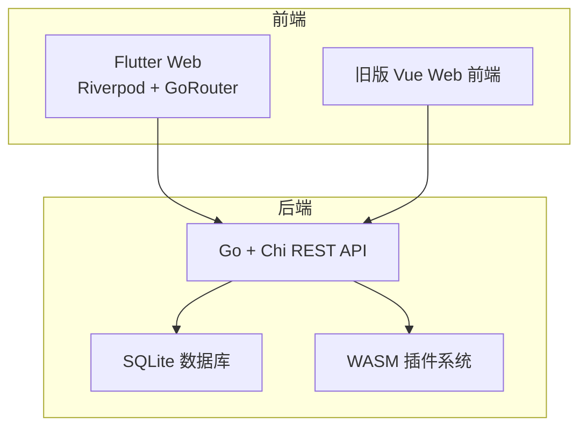
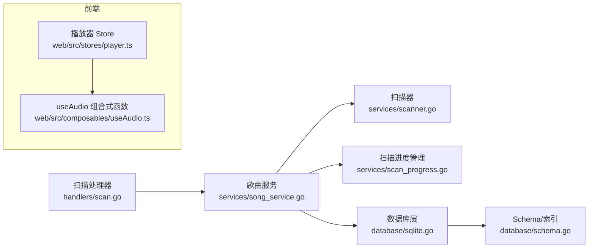
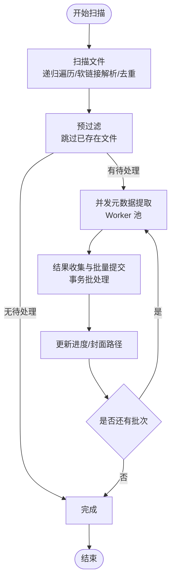
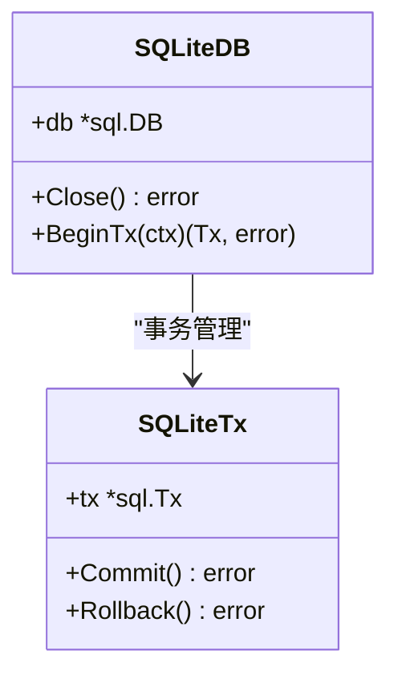
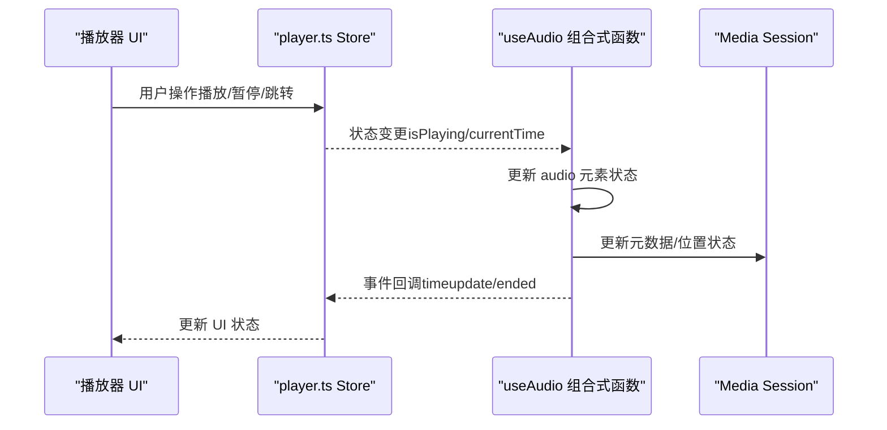
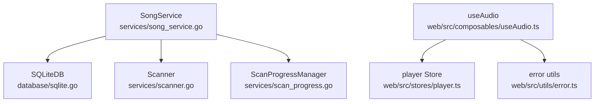

# 性能问题排查

<cite>
**本文引用的文件**
- [main.go](file://main.go)
- [architecture.md](file://docs/architecture.md)
- [scanner.go](file://internal/services/scanner.go)
- [scan_progress.go](file://internal/services/scan_progress.go)
- [song_service.go](file://internal/services/song_service.go)
- [scan.go](file://internal/handlers/scan.go)
- [sqlite.go](file://internal/database/sqlite.go)
- [schema.go](file://internal/database/schema.go)
- [player.ts](file://web/src/stores/player.ts)
- [useAudio.ts](file://web/src/composables/useAudio.ts)
- [error.ts](file://web/src/utils/error.ts)
- [benchmark.yml](file://.github/workflows/benchmark.yml)
</cite>

## 目录
1. [简介](#简介)
2. [项目结构](#项目结构)
3. [核心组件](#核心组件)
4. [架构总览](#架构总览)
5. [详细组件分析](#详细组件分析)
6. [依赖分析](#依赖分析)
7. [性能考量](#性能考量)
8. [故障排查指南](#故障排查指南)
9. [结论](#结论)
10. [附录](#附录)

## 简介
本指南聚焦 Songloft 在音频扫描、数据库、播放性能以及前端渲染与响应性方面的性能问题排查与优化。通过对后端扫描流水线、数据库连接池与索引、前端播放器与状态管理的深入分析，给出可落地的优化建议、监控指标与基准测试方法，帮助定位瓶颈并制定调优策略。

## 项目结构
Songloft 采用前后端分离架构：后端为 Go + Chi REST API，数据库为 SQLite；前端为 Flutter Web（主要前端）与旧版 Vue Web 前端。后端通过嵌入式静态资源提供前端页面，前后端同域访问，减少跨域与代理开销。

图表来源
- [architecture.md:13-37](file://docs/architecture.md#L13-L37)

章节来源
- [architecture.md:1-248](file://docs/architecture.md#L1-L248)

## 核心组件
- 音频扫描与导入流水线：扫描器负责遍历目录、识别音频文件；服务层进行并发元数据提取、批量入库与事务提交；进度管理器提供状态与取消能力。
- 数据库层：SQLite 配置 WAL、busy_timeout、cache_size 等参数，连接池限制并发，Schema 定义索引与触发器。
- 播放器与前端状态：前端使用 Pinia Store 管理播放状态，useAudio 组合式函数封装 HTMLAudioElement 事件与 Media Session，实现播放控制、缓冲与错误处理。
- 监控与基准：前端错误上报工具；GitHub Actions 基准工作流用于后端性能回归。

章节来源
- [scanner.go:11-177](file://internal/services/scanner.go#L11-L177)
- [song_service.go:181-552](file://internal/services/song_service.go#L181-L552)
- [scan_progress.go:44-209](file://internal/services/scan_progress.go#L44-L209)
- [sqlite.go:22-80](file://internal/database/sqlite.go#L22-L80)
- [schema.go:4-149](file://internal/database/schema.go#L4-L149)
- [player.ts:1-302](file://web/src/stores/player.ts#L1-L302)
- [useAudio.ts:32-418](file://web/src/composables/useAudio.ts#L32-L418)
- [error.ts:1-42](file://web/src/utils/error.ts#L1-L42)
- [benchmark.yml:1-62](file://.github/workflows/benchmark.yml#L1-L62)

## 架构总览
后端整体采用“Handlers -> Services -> Database”的分层，扫描流程贯穿“扫描 -> 并发提取 -> 批量入库 -> 事务提交”，并提供进度与取消机制。前端播放器通过 Store 与组合式函数协调播放行为与 UI 响应。

图表来源
- [scan.go:10-94](file://internal/handlers/scan.go#L10-L94)
- [song_service.go:181-552](file://internal/services/song_service.go#L181-L552)
- [scanner.go:30-177](file://internal/services/scanner.go#L30-L177)
- [scan_progress.go:44-209](file://internal/services/scan_progress.go#L44-L209)
- [sqlite.go:22-80](file://internal/database/sqlite.go#L22-L80)
- [schema.go:4-149](file://internal/database/schema.go#L4-L149)
- [player.ts:1-302](file://web/src/stores/player.ts#L1-L302)
- [useAudio.ts:32-418](file://web/src/composables/useAudio.ts#L32-L418)

## 详细组件分析

### 音频扫描与导入流水线
- 扫描阶段：递归遍历目录，解析软链接，去重访问，按扩展名过滤，支持取消上下文。
- 预过滤：基于现有本地歌曲路径快速跳过已存在文件，减少后续处理。
- 并发提取：Worker 池并发提取元数据，生产者-消费者管道推进，避免阻塞。
- 批量入库：固定批次大小聚合结果，事务一次性提交，减少磁盘写放大与锁竞争。
- 进度与取消：统一的状态机与取消通道，支持取消中状态与最终清理。

图表来源
- [scanner.go:30-177](file://internal/services/scanner.go#L30-L177)
- [song_service.go:215-376](file://internal/services/song_service.go#L215-L376)
- [scan_progress.go:74-134](file://internal/services/scan_progress.go#L74-L134)

章节来源
- [scanner.go:30-177](file://internal/services/scanner.go#L30-L177)
- [song_service.go:181-552](file://internal/services/song_service.go#L181-L552)
- [scan_progress.go:44-209](file://internal/services/scan_progress.go#L44-L209)

### 数据库性能与索引策略
- 连接池配置：最大打开连接数、空闲连接数、连接最大生命周期，平衡吞吐与资源占用。
- WAL 模式与参数：WAL 提升读写并发；busy_timeout 降低 SQLITE_BUSY；cache_size 减少磁盘 IO；foreign_keys 保证一致性。
- Schema 与索引：针对 songs、playlists、playlist_songs、configs、auth_tokens、plugins 建立常用查询字段索引，触发器自动更新 updated_at。
- 迁移兼容：对 playlists 新增 cover_path 字段，避免重复执行报错。

图表来源
- [sqlite.go:12-80](file://internal/database/sqlite.go#L12-L80)

章节来源
- [sqlite.go:22-80](file://internal/database/sqlite.go#L22-L80)
- [schema.go:4-149](file://internal/database/schema.go#L4-L149)

### 播放器与前端状态管理
- Store 状态：当前歌曲、播放列表、索引、播放状态、音量、时间轴、播放模式、移动端 UI 状态、播放列表侧边栏。
- 计算属性：根据播放模式与列表长度判断上一首/下一首可用性。
- 播放控制：播放/暂停、上一首/下一首、随机/顺序/单曲循环、清空/移除、跳转、设置音量。
- 媒体会话：注册播放控制动作，更新元数据与位置状态，提升通知栏与锁屏控制体验。
- 音频事件：ended、timeupdate、loadedmetadata、error、waiting、stalled、canplay、playing；重试机制与错误分类处理。
- 错误上报：withErrorReport 包装异步函数，主动上报错误至 Tracely 监控平台。

图表来源
- [player.ts:64-222](file://web/src/stores/player.ts#L64-L222)
- [useAudio.ts:174-320](file://web/src/composables/useAudio.ts#L174-L320)

章节来源
- [player.ts:1-302](file://web/src/stores/player.ts#L1-L302)
- [useAudio.ts:32-418](file://web/src/composables/useAudio.ts#L32-L418)
- [error.ts:1-42](file://web/src/utils/error.ts#L1-L42)

## 依赖分析
- 后端依赖：Chi 路由、SQLite 驱动、插件系统（WASM）、标签解析库（元数据提取）。
- 前端依赖：Pinia 状态管理、Vue 响应式系统、Media Session API、Tracely 错误上报。
- 扫描服务与数据库：扫描服务在事务中批量写入，减少锁竞争；数据库层 WAL 与连接池参数影响并发与稳定性。

图表来源
- [song_service.go:16-32](file://internal/services/song_service.go#L16-L32)
- [sqlite.go:12-21](file://internal/database/sqlite.go#L12-L21)
- [scanner.go:18-28](file://internal/services/scanner.go#L18-L28)
- [scan_progress.go:44-49](file://internal/services/scan_progress.go#L44-L49)
- [useAudio.ts:32-418](file://web/src/composables/useAudio.ts#L32-L418)
- [player.ts:1-302](file://web/src/stores/player.ts#L1-L302)
- [error.ts:1-42](file://web/src/utils/error.ts#L1-L42)

章节来源
- [song_service.go:16-32](file://internal/services/song_service.go#L16-L32)
- [sqlite.go:12-21](file://internal/database/sqlite.go#L12-L21)
- [scanner.go:18-28](file://internal/services/scanner.go#L18-L28)
- [scan_progress.go:44-49](file://internal/services/scan_progress.go#L44-L49)
- [useAudio.ts:32-418](file://web/src/composables/useAudio.ts#L32-L418)
- [player.ts:1-302](file://web/src/stores/player.ts#L1-L302)
- [error.ts:1-42](file://web/src/utils/error.ts#L1-L42)

## 性能考量

### 音频扫描性能优化
- 扫描速度优化
  - 预过滤：利用现有本地歌曲路径映射快速跳过已存在文件，显著减少后续处理。
  - 并发提取：Worker 数量与输入/输出通道容量平衡，避免背压与过度竞争。
  - 批量提交：固定批次大小，事务一次性提交，降低磁盘写放大与锁竞争。
- 内存使用控制
  - 避免在扫描阶段持有大对象；及时释放中间结果；合理设置通道容量。
  - 预分配 map 容量，减少扩容开销。
- 并发处理策略
  - 元数据提取与数据库写入采用流水线模式，生产者-消费者解耦。
  - 取消通道贯穿全流程，确保快速响应用户取消。

章节来源
- [song_service.go:215-376](file://internal/services/song_service.go#L215-L376)
- [scan_progress.go:74-134](file://internal/services/scan_progress.go#L74-L134)

### 数据库性能瓶颈与优化
- 查询优化
  - 利用索引覆盖常见查询字段（如 songs.type、songs.title、songs.artist、playlists.type、configs.key 等）。
  - 对于高频统计与列表查询，尽量使用带索引的过滤条件。
- 索引策略
  - 现有索引覆盖了常用过滤与排序字段；可根据实际查询模式评估是否新增复合索引。
- 连接池配置
  - 连接池大小适配硬件与并发场景；WAL 模式下读写并发提升明显，注意写操作串行化带来的竞争。
- 事务与批处理
  - 批量写入事务减少 fsync 次数与 WAL 刷写开销；失败时回滚，避免脏数据。

章节来源
- [schema.go:89-104](file://internal/database/schema.go#L89-L104)
- [sqlite.go:36-41](file://internal/database/sqlite.go#L36-L41)
- [song_service.go:378-485](file://internal/services/song_service.go#L378-L485)

### 播放性能优化
- 缓冲策略
  - 监听 waiting/stalled 事件，必要时触发重试加载；避免长时间停滞。
  - 控制重试次数上限，防止无限重试导致卡顿。
- 解码优化
  - 优先使用浏览器原生解码能力；避免在 UI 线程做重型计算。
- 内存管理
  - 及时移除事件监听器，避免内存泄漏；播放结束后暂停并释放资源。
- 媒体会话
  - 更新元数据与位置状态，减少 UI 与通知栏的闪烁与空白。

章节来源
- [useAudio.ts:243-300](file://web/src/composables/useAudio.ts#L243-L300)
- [useAudio.ts:322-347](file://web/src/composables/useAudio.ts#L322-L347)
- [useAudio.ts:392-406](file://web/src/composables/useAudio.ts#L392-L406)

### 前端性能诊断
- 渲染性能
  - 使用计算属性与细粒度状态更新，避免不必要的重渲染。
  - 控制播放列表侧边栏与移动端播放器的显示/隐藏逻辑，减少 DOM 变更。
- 内存泄漏检测
  - 确保在组件卸载时移除所有事件监听器；Store 持久化仅保留必要状态。
- UI 响应性优化
  - 将耗时操作（如封面保存）放入后台任务；UI 仅订阅必要状态。

章节来源
- [player.ts:1-302](file://web/src/stores/player.ts#L1-L302)
- [useAudio.ts:392-406](file://web/src/composables/useAudio.ts#L392-L406)

### 性能监控与基准测试
- 监控指标
  - 后端：扫描总耗时、导入/跳过/失败文件数、平均元数据提取耗时、数据库事务提交耗时。
  - 前端：音频加载时间、缓冲等待次数与时长、播放卡顿次数、错误上报量。
- 基准测试
  - 使用 GitHub Actions 基准工作流运行 Go 基准测试，输出内存与 CPU 指标，便于回归对比。

章节来源
- [benchmark.yml:1-62](file://.github/workflows/benchmark.yml#L1-L62)

## 故障排查指南

### 扫描卡顿/崩溃
- 现象：扫描长时间无进展、内存持续增长、偶发崩溃。
- 排查要点：
  - 检查扫描进度状态与取消通道是否正常；确认预过滤是否生效。
  - 观察元数据提取阶段的错误日志，定位特定文件或格式问题。
  - 确认数据库事务是否频繁失败与回滚。
- 优化建议：
  - 增加取消检查频率；优化通道容量与 Worker 数量。
  - 对异常文件降级处理（记录失败并继续）。

章节来源
- [scan_progress.go:136-154](file://internal/services/scan_progress.go#L136-L154)
- [song_service.go:298-325](file://internal/services/song_service.go#L298-L325)
- [song_service.go:380-485](file://internal/services/song_service.go#L380-L485)

### 数据库写入慢
- 现象：导入大量文件时写入缓慢、锁等待增多。
- 排查要点：
  - 检查 WAL 模式与 busy_timeout 是否生效；连接池是否过大导致写竞争。
  - 查看事务提交耗时与失败率。
- 优化建议：
  - 调整批次大小与连接池参数；确保索引未被频繁重建。

章节来源
- [sqlite.go:22-41](file://internal/database/sqlite.go#L22-L41)
- [song_service.go:378-485](file://internal/services/song_service.go#L378-L485)

### 播放卡顿/加载失败
- 现象：播放开始延迟、缓冲等待、播放中断。
- 排查要点：
  - 检查 waiting/stalled 事件触发频率与原因；网络波动或 Service Worker 缓存问题。
  - 校验音频 URL 生成与鉴权有效性。
- 优化建议：
  - 限制重试次数与间隔；在网络错误时主动降级或提示用户。

章节来源
- [useAudio.ts:243-300](file://web/src/composables/useAudio.ts#L243-L300)
- [useAudio.ts:322-347](file://web/src/composables/useAudio.ts#L322-L347)
- [useAudio.ts:154-172](file://web/src/composables/useAudio.ts#L154-L172)

### 前端内存泄漏
- 现象：页面切换后内存不降、UI 卡顿。
- 排查要点：
  - 确认组件卸载时移除了所有事件监听器；Store 持久化未造成额外引用。
- 优化建议：
  - 使用 onUnmounted 生命周期清理；避免在 Store 中缓存大型对象。

章节来源
- [useAudio.ts:392-406](file://web/src/composables/useAudio.ts#L392-L406)
- [player.ts:297-302](file://web/src/stores/player.ts#L297-L302)

## 结论
Songloft 的性能优化围绕“扫描流水线并发化、数据库事务批处理、前端事件与状态精细化”展开。通过合理的索引、连接池与 WAL 参数配置，结合前端媒体会话与事件处理策略，可在不同设备与网络环境下获得稳定流畅的体验。建议持续运行基准测试与错误上报，形成闭环的性能治理。

## 附录

### 性能调优最佳实践
- 扫描侧
  - 预过滤优先、并发提取与批处理结合；通道容量与 Worker 数量按 CPU 核心数与 I/O 特性调优。
- 数据库侧
  - WAL + 适当 busy_timeout + cache_size；连接池大小与事务批大小平衡吞吐与延迟。
- 播放侧
  - 事件驱动的缓冲与重试；媒体会话元数据与位置状态及时更新；避免 UI 线程阻塞。

### 常见陷阱与规避
- 扫描阶段持有大对象或未及时释放，导致内存峰值过高。
- 数据库事务过大或频繁失败，引发锁等待与回滚成本上升。
- 前端未移除事件监听器，造成内存泄漏与 UI 卡顿。
- 过度重试或无上限重试，导致播放器卡顿与资源浪费。