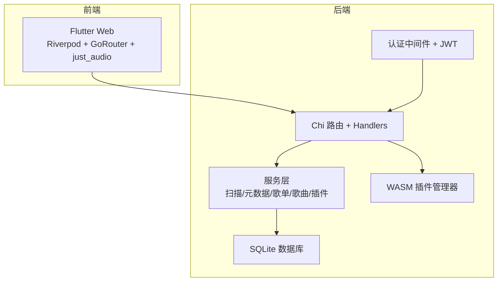
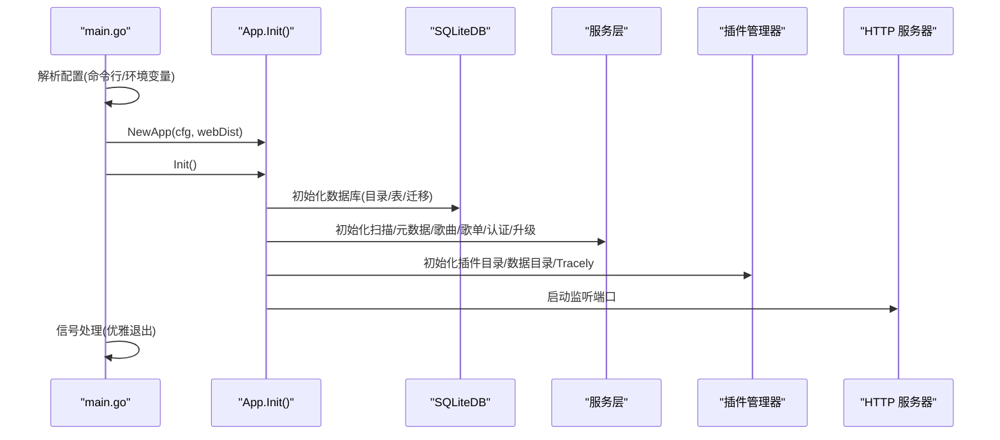
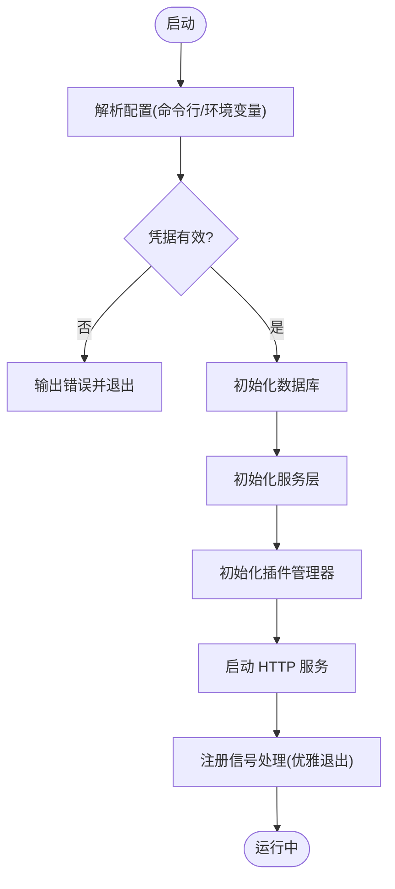
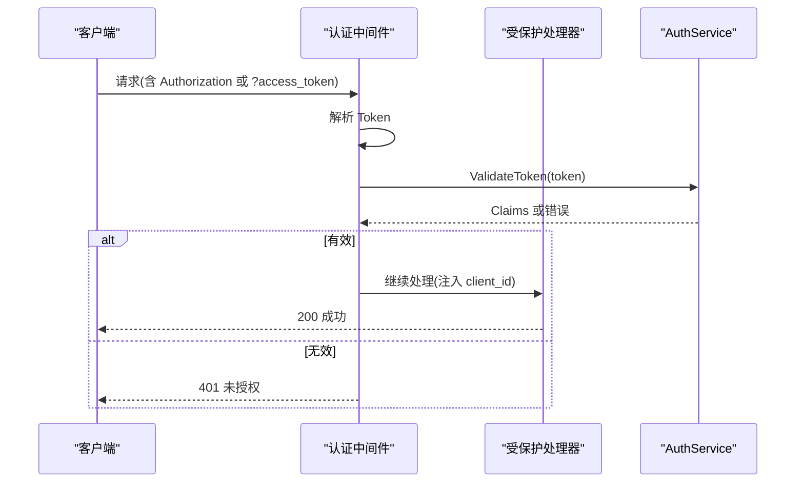
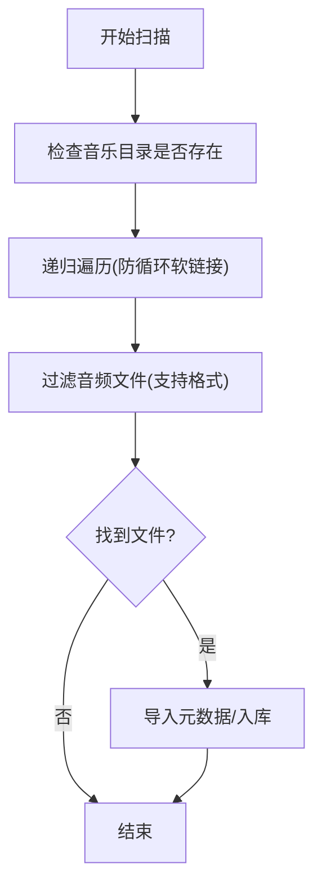
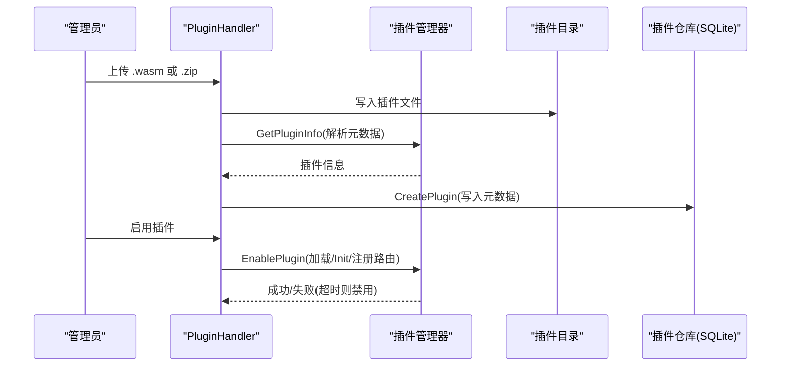
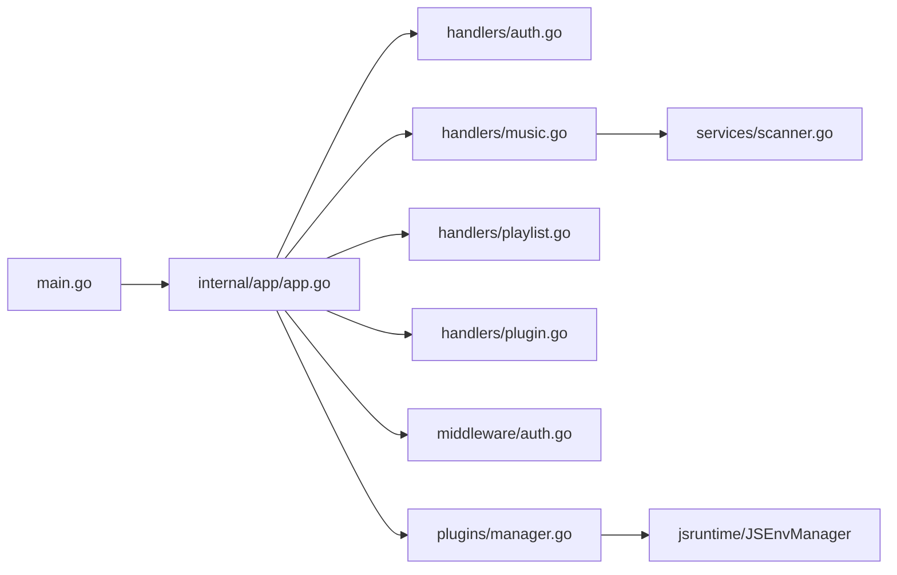

# 故障排除与调试

<cite>
**本文引用的文件**
- [README.md](file://README.md)
- [docs/FAQ.md](file://docs/FAQ.md)
- [docs/architecture.md](file://docs/architecture.md)
- [internal/app/app.go](file://internal/app/app.go)
- [main.go](file://main.go)
- [internal/handlers/auth.go](file://internal/handlers/auth.go)
- [internal/handlers/music.go](file://internal/handlers/music.go)
- [internal/handlers/playlist.go](file://internal/handlers/playlist.go)
- [internal/handlers/plugin.go](file://internal/handlers/plugin.go)
- [internal/handlers/response.go](file://internal/handlers/response.go)
- [internal/middleware/auth.go](file://internal/middleware/auth.go)
- [internal/plugins/manager.go](file://internal/plugins/manager.go)
- [internal/services/scanner.go](file://internal/services/scanner.go)
- [test/INTEGRATION_TEST_SETUP.md](file://test/INTEGRATION_TEST_SETUP.md)
</cite>

## 目录
1. [简介](#简介)
2. [项目结构](#项目结构)
3. [核心组件](#核心组件)
4. [架构总览](#架构总览)
5. [详细组件分析](#详细组件分析)
6. [依赖分析](#依赖分析)
7. [性能考量](#性能考量)
8. [故障排除指南](#故障排除指南)
9. [结论](#结论)
10. [附录](#附录)

## 简介
本指南面向 Songloft 项目的运维与开发人员，聚焦于启动问题、音频播放问题、插件问题与性能问题的诊断与修复；提供日志分析、性能分析、插件调试与前端调试的实操方法；解释错误分类与异常处理策略，并给出开发调试环境配置与问题报告模板，帮助快速定位与解决实际运行中的各类问题。

## 项目结构
Songloft 采用前后端分离架构：后端为 Go + Chi 路由，前端为 Flutter Web（同域嵌入）。后端提供 RESTful API、JWT 认证、SQLite 数据库、WASM 插件系统与结构化日志；前端负责播放器、UI 与交互。

图示来源
- [docs/architecture.md:13-37](file://docs/architecture.md#L13-L37)
- [internal/app/app.go:27-52](file://internal/app/app.go#L27-L52)

章节来源
- [docs/architecture.md:13-37](file://docs/architecture.md#L13-L37)
- [README.md:398-441](file://README.md#L398-L441)

## 核心组件
- 应用入口与配置解析：负责解析命令行与环境变量、初始化数据库、服务层、插件管理器与路由，并启动 HTTP 服务。
- 认证与中间件：提供 JWT 双 Token 认证、支持 Header 与 URL 查询参数两种方式携带 Token。
- 音频与媒体：扫描本地音频、提取元数据、封面管理、远程歌曲与电台支持。
- 歌单与歌曲：增删改查、排序、自动创建、清理无效条目。
- 插件系统：WASM 插件上传、启用/禁用、生命周期管理、路由注册与回调超时控制。
- 日志与可观测性：结构化日志、Tracely 前端监控。

章节来源
- [internal/app/app.go:64-227](file://internal/app/app.go#L64-L227)
- [internal/middleware/auth.go:11-51](file://internal/middleware/auth.go#L11-L51)
- [internal/handlers/music.go:29-102](file://internal/handlers/music.go#L29-L102)
- [internal/handlers/playlist.go:27-81](file://internal/handlers/playlist.go#L27-L81)
- [internal/handlers/plugin.go:35-57](file://internal/handlers/plugin.go#L35-L57)
- [internal/plugins/manager.go:34-61](file://internal/plugins/manager.go#L34-L61)

## 架构总览
后端启动流程与关键依赖关系如下：

图示来源
- [main.go:30-63](file://main.go#L30-L63)
- [internal/app/app.go:64-227](file://internal/app/app.go#L64-L227)

章节来源
- [main.go:30-63](file://main.go#L30-L63)
- [internal/app/app.go:64-227](file://internal/app/app.go#L64-L227)

## 详细组件分析

### 启动与配置组件
- 配置解析优先级：命令行参数 > 环境变量；缺失管理员凭据会直接报错。
- 数据库初始化：自动创建目录、初始化数据库与表结构；JWT 密钥首次运行自动生成并落库。
- 插件目录与数据目录：自动创建并同步磁盘与数据库；Tracely 监控初始化。
- 优雅退出：捕获 SIGINT/SIGTERM，关闭数据库与插件实例。

图示来源
- [internal/app/app.go:287-352](file://internal/app/app.go#L287-L352)
- [internal/app/app.go:64-227](file://internal/app/app.go#L64-L227)
- [main.go:46-56](file://main.go#L46-L56)

章节来源
- [internal/app/app.go:287-352](file://internal/app/app.go#L287-L352)
- [internal/app/app.go:64-227](file://internal/app/app.go#L64-L227)
- [main.go:46-56](file://main.go#L46-L56)

### 认证与中间件
- 认证中间件支持两种 Token 源：Authorization: Bearer ... 与 URL 查询参数 access_token。
- 登录/刷新/登出接口返回结构化错误；令牌列表与撤销接口支持分页与过滤。
- 未携带或无效 Token 时返回 401，错误响应包含错误信息与可选细节。

图示来源
- [internal/middleware/auth.go:11-51](file://internal/middleware/auth.go#L11-L51)
- [internal/handlers/auth.go:27-62](file://internal/handlers/auth.go#L27-L62)
- [internal/handlers/response.go:8-24](file://internal/handlers/response.go#L8-L24)

章节来源
- [internal/middleware/auth.go:11-51](file://internal/middleware/auth.go#L11-L51)
- [internal/handlers/auth.go:27-62](file://internal/handlers/auth.go#L27-L62)
- [internal/handlers/response.go:8-24](file://internal/handlers/response.go#L8-L24)

### 音频与媒体组件
- 歌曲管理：分页、类型过滤、关键词搜索、批量删除、远程歌曲与电台添加、封面读取与缓存。
- 扫描器：递归扫描目录、软链接防护、排除目录、音频格式判断、文件信息提取。
- 清理无效本地歌曲：删除数据库中不存在的记录并清理封面文件。

图示来源
- [internal/services/scanner.go:30-48](file://internal/services/scanner.go#L30-L48)
- [internal/services/scanner.go:50-114](file://internal/services/scanner.go#L50-L114)
- [internal/services/scanner.go:116-134](file://internal/services/scanner.go#L116-L134)

章节来源
- [internal/handlers/music.go:29-102](file://internal/handlers/music.go#L29-L102)
- [internal/services/scanner.go:30-177](file://internal/services/scanner.go#L30-L177)

### 歌单组件
- 歌单 CRUD、按类型过滤、分页、最后播放时间 touch、歌曲增删改与重新排序。
- 自动创建歌单：根据目录结构生成歌单，支持是否包含子目录选项。

章节来源
- [internal/handlers/playlist.go:27-81](file://internal/handlers/playlist.go#L27-L81)
- [internal/handlers/playlist.go:246-309](file://internal/handlers/playlist.go#L246-L309)
- [internal/handlers/playlist.go:443-473](file://internal/handlers/playlist.go#L443-L473)

### 插件组件
- 插件上传：支持 .wasm 单文件与 .zip 批量导入，自动提取插件元数据并写入数据库。
- 生命周期：启用/禁用/删除；加载时初始化并带超时；异常时自动禁用并清理资源。
- 路由与回调：插件可注册路由到主程序；JS 运行时管理器支持插件内 JS 环境；回调超时保护。
- 资源清理：反初始化、定时器清理、实例关闭、插件文件删除。

图示来源
- [internal/handlers/plugin.go:92-134](file://internal/handlers/plugin.go#L92-L134)
- [internal/handlers/plugin.go:219-289](file://internal/handlers/plugin.go#L219-L289)
- [internal/plugins/manager.go:500-523](file://internal/plugins/manager.go#L500-L523)
- [internal/plugins/manager.go:403-463](file://internal/plugins/manager.go#L403-L463)

章节来源
- [internal/handlers/plugin.go:92-134](file://internal/handlers/plugin.go#L92-L134)
- [internal/handlers/plugin.go:219-289](file://internal/handlers/plugin.go#L219-L289)
- [internal/plugins/manager.go:26-32](file://internal/plugins/manager.go#L26-L32)
- [internal/plugins/manager.go:500-523](file://internal/plugins/manager.go#L500-L523)

## 依赖分析
- 启动阶段：main.go -> app.ParseConfig -> app.Init -> 启动 HTTP 服务。
- 认证链路：中间件解析 Token -> AuthService 验证 -> 上下文注入 -> 处理器执行。
- 插件链路：Handler -> Manager -> WASM 实例 -> Host Functions -> JS Runtime。
- 扫描链路：Handler -> Scanner -> 文件系统 -> MetadataExtractor -> 数据库。

图示来源
- [main.go:30-63](file://main.go#L30-L63)
- [internal/app/app.go:64-227](file://internal/app/app.go#L64-L227)
- [internal/handlers/auth.go:15-25](file://internal/handlers/auth.go#L15-L25)
- [internal/handlers/music.go:17-27](file://internal/handlers/music.go#L17-L27)
- [internal/handlers/playlist.go:15-25](file://internal/handlers/playlist.go#L15-L25)
- [internal/handlers/plugin.go:21-33](file://internal/handlers/plugin.go#L21-L33)
- [internal/middleware/auth.go:11-12](file://internal/middleware/auth.go#L11-L12)
- [internal/plugins/manager.go:14-24](file://internal/plugins/manager.go#L14-L24)
- [internal/services/scanner.go:11-21](file://internal/services/scanner.go#L11-L21)

章节来源
- [main.go:30-63](file://main.go#L30-L63)
- [internal/app/app.go:64-227](file://internal/app/app.go#L64-L227)

## 性能考量
- 分页与限制：歌曲/歌单列表默认分页上限，防止过大查询导致性能问题。
- 扫描优化：软链接防护与排除目录，避免无效 IO；扫描过程支持上下文取消。
- 插件超时：初始化/回调/反初始化均有超时保护，异常自动禁用并清理资源。
- 缓存策略：封面图片返回带缓存头，减少重复请求。

章节来源
- [internal/handlers/music.go:61-64](file://internal/handlers/music.go#L61-L64)
- [internal/services/scanner.go:50-114](file://internal/services/scanner.go#L50-L114)
- [internal/plugins/manager.go:26-32](file://internal/plugins/manager.go#L26-L32)
- [internal/handlers/music.go:420-423](file://internal/handlers/music.go#L420-L423)

## 故障排除指南

### 启动问题
- 症状：启动即退出或报错
  - 可能原因：缺少管理员用户名/密码；数据库目录不可写；端口占用。
  - 诊断步骤：
    - 检查命令行参数与环境变量是否正确传入。
    - 确认数据库路径存在且可写。
    - 使用 netstat/lsof 检查端口占用。
  - 修复建议：补齐 -username/-password 或设置 ADMIN_USERNAME/ADMIN_PASSWORD；修正 DB_PATH/LISTEN_PORT；更换端口。
  
章节来源
- [internal/app/app.go:287-352](file://internal/app/app.go#L287-L352)
- [internal/app/app.go:75-81](file://internal/app/app.go#L75-L81)
- [README.md:354-385](file://README.md#L354-L385)

### 音频播放问题
- 症状：无法播放或封面缺失
  - 可能原因：文件格式不受支持；路径配置错误；权限不足；封面文件不存在。
  - 诊断步骤：
    - 确认扫描配置中的支持格式包含该文件扩展名。
    - 检查音乐目录路径与排除目录配置。
    - 确认文件权限可读。
    - 检查封面文件是否存在与可读。
  - 修复建议：调整扫描配置；修正路径；修复权限；确认封面存储目录存在。
  
章节来源
- [docs/FAQ.md:50-62](file://docs/FAQ.md#L50-L62)
- [internal/services/scanner.go:116-134](file://internal/services/scanner.go#L116-L134)
- [internal/handlers/music.go:356-424](file://internal/handlers/music.go#L356-L424)

### 插件问题
- 症状：插件上传失败、启用后立即失效、回调超时
  - 可能原因：上传文件非 .wasm 或 .zip；zip 内无 .wasm；插件初始化/回调超时；实例不健康。
  - 诊断步骤：
    - 检查上传文件扩展名与 zip 内容。
    - 查看插件管理器日志，确认 Init 是否超时。
    - 观察插件状态是否被自动禁用。
  - 修复建议：使用正确的文件格式；确保插件实现 Init 逻辑；缩短回调耗时；排查插件死循环。
  
章节来源
- [internal/handlers/plugin.go:92-134](file://internal/handlers/plugin.go#L92-L134)
- [internal/handlers/plugin.go:219-289](file://internal/handlers/plugin.go#L219-L289)
- [internal/plugins/manager.go:26-32](file://internal/plugins/manager.go#L26-L32)
- [internal/plugins/manager.go:137-147](file://internal/plugins/manager.go#L137-L147)

### 认证与权限问题
- 症状：401 未授权；令牌无效；无法访问受保护接口
  - 可能原因：缺少 Authorization 头或 access_token；Token 过期或被撤销；中间件未正确注入。
  - 诊断步骤：
    - 确认请求头 Authorization: Bearer <token> 或 URL ?access_token=<token>。
    - 使用 /auth/tokens 列表确认令牌状态。
    - 检查中间件是否生效。
  - 修复建议：重新登录获取新 Token；刷新 Token；检查中间件链路。
  
章节来源
- [internal/middleware/auth.go:11-51](file://internal/middleware/auth.go#L11-L51)
- [internal/handlers/auth.go:136-195](file://internal/handlers/auth.go#L136-L195)

### 性能问题
- 症状：扫描缓慢、接口响应慢、CPU/IO 高
  - 可能原因：扫描目录层级过深/过多文件；排除目录配置不当；插件回调阻塞。
  - 诊断步骤：
    - 使用 top/htop 观察 CPU/IO。
    - 检查扫描配置与排除目录。
    - 关闭插件观察性能变化。
  - 修复建议：合理设置排除目录；分批扫描；优化插件回调逻辑。
  
章节来源
- [internal/services/scanner.go:50-114](file://internal/services/scanner.go#L50-L114)
- [internal/plugins/manager.go:26-32](file://internal/plugins/manager.go#L26-L32)

### 日志与调试
- 日志位置与级别：使用结构化日志，启动时打印版本、提交、构建时间与端口；关键事件与错误均记录。
- 常用调试点：
  - 启动阶段：数据库初始化、JWT 密钥生成、插件目录创建与同步。
  - 运行阶段：插件加载/启用/禁用、扫描与导入、封面读取。
- 建议：
  - 开启详细日志级别，结合 Tracely 监控查看异常趋势。
  - 对插件回调设置超时并记录耗时，定位慢回调。

章节来源
- [internal/app/app.go:64-227](file://internal/app/app.go#L64-L227)
- [internal/plugins/manager.go:137-147](file://internal/plugins/manager.go#L137-L147)

### 前端调试
- Flutter Web 前端与后端同域部署，使用 Riverpod 状态管理与 GoRouter 路由。
- 常见问题：跨域、静态资源回退、播放器初始化失败。
- 建议：
  - 确认前端构建产物嵌入与路由回退配置。
  - 使用浏览器开发者工具 Network/Console 定位接口与资源问题。
  - 检查播放器初始化与音频解码库兼容性。

章节来源
- [docs/architecture.md:16-37](file://docs/architecture.md#L16-L37)

### 开发调试环境配置
- 环境变量与命令行参数优先级：命令行 > 环境变量。
- 常用参数：端口、数据库路径、管理员凭据。
- Docker 部署注意事项：确保绝对路径挂载音乐与数据目录。

章节来源
- [internal/app/app.go:287-352](file://internal/app/app.go#L287-L352)
- [docs/FAQ.md:16-24](file://docs/FAQ.md#L16-L24)

### 常用调试工具与技巧
- 日志：slog 结构化输出，结合 Tracely。
- 性能：pprof（Go 标准库）、浏览器性能面板、插件回调耗时统计。
- 插件：wazero 运行时上下文取消、超时控制、实例健康检查。
- 集成测试：ffmpeg/ffprobe 安装与验证，测试覆盖率生成。

章节来源
- [test/INTEGRATION_TEST_SETUP.md:112-139](file://test/INTEGRATION_TEST_SETUP.md#L112-L139)

### 用户反馈问题处理流程
- 收集信息：版本、配置、日志片段、复现步骤、环境信息。
- 分类与定级：启动/认证/播放/插件/性能等类别。
- 诊断与修复：对照本指南逐项排查，必要时开启更详细日志。
- 验证与回退：修复后回归测试，保留回滚方案。
- 报告模板（建议）：
  - 问题摘要、期望行为、实际行为
  - 环境信息（系统、架构、版本、配置）
  - 复现步骤
  - 日志与截图
  - 影响范围与紧急程度

章节来源
- [docs/FAQ.md:121-125](file://docs/FAQ.md#L121-L125)

## 结论
通过结构化日志、完善的中间件与服务层、严格的插件超时与健康检查机制，Songloft 在启动、认证、音频处理与插件扩展方面具备较强的可诊断性与可维护性。遵循本指南的诊断流程与修复建议，可高效定位并解决大多数运行时问题。

## 附录

### 常见错误与处理策略
- 启动失败（缺少凭据）：补齐命令行或环境变量。
- 数据库不可写：修正 DB_PATH 权限或路径。
- 插件初始化超时：优化插件 Init 逻辑，缩短回调。
- 认证失败：检查 Token 来源与有效性，必要时刷新或撤销。

章节来源
- [internal/app/app.go:287-352](file://internal/app/app.go#L287-L352)
- [internal/plugins/manager.go:441-463](file://internal/plugins/manager.go#L441-L463)
- [internal/middleware/auth.go:11-51](file://internal/middleware/auth.go#L11-L51)