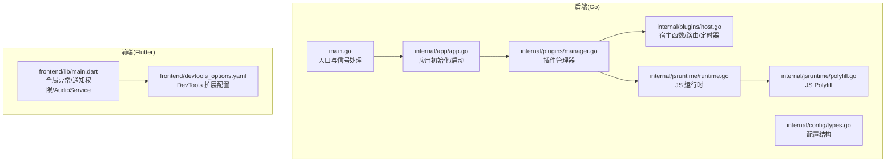
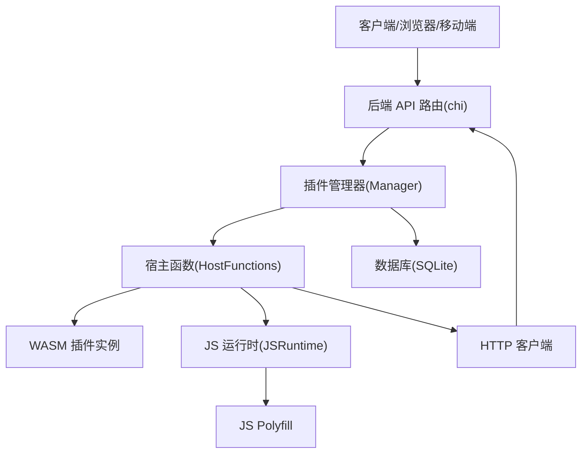
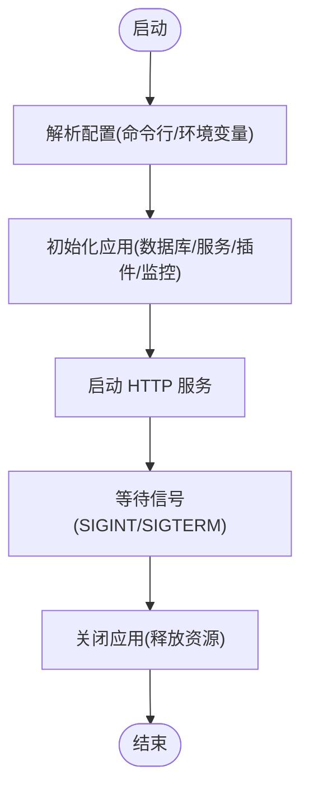
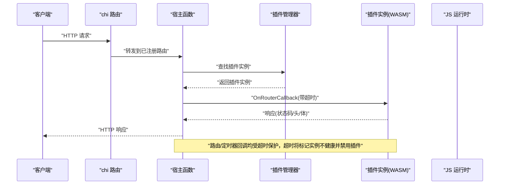
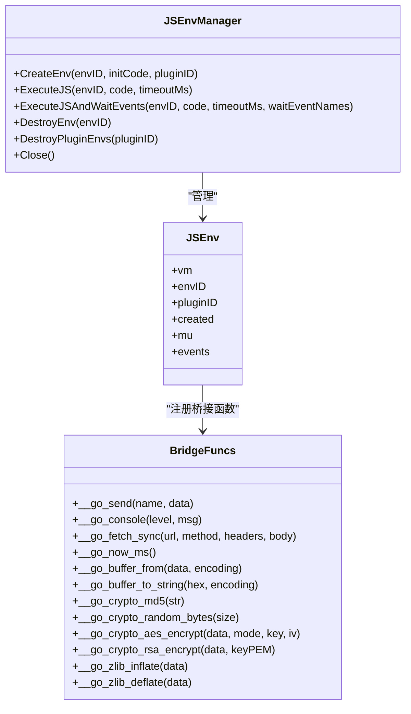
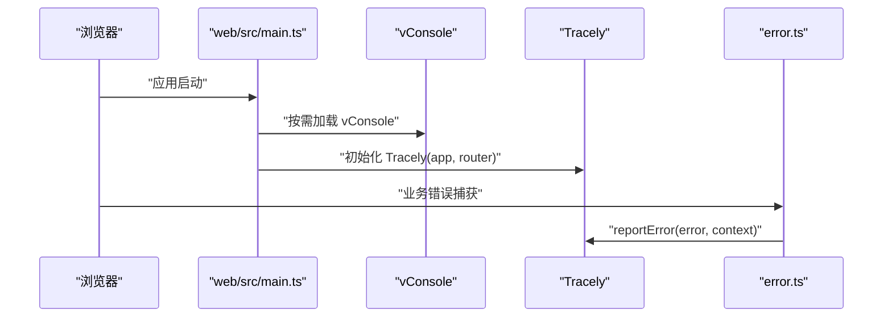
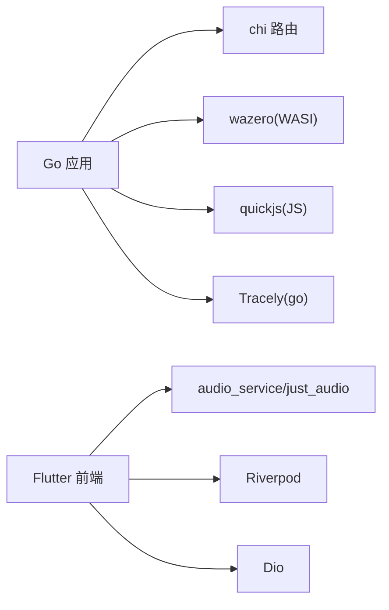

# 调试技巧

<cite>
**本文引用的文件**
- [main.go](file://main.go)
- [app.go](file://internal/app/app.go)
- [types.go](file://internal/config/types.go)
- [manager.go](file://internal/plugins/manager.go)
- [host.go](file://internal/plugins/host.go)
- [runtime.go](file://internal/jsruntime/runtime.go)
- [polyfill.go](file://internal/jsruntime/polyfill.go)
- [README.md](file://internal/jsruntime/README.md)
- [main.dart](file://frontend/lib/main.dart)
- [devtools_options.yaml](file://frontend/devtools_options.yaml)
- [js-plugin-development-guide.md](file://docs/js-plugin-development-guide.md)
- [benchmark.yml](file://.github/workflows/benchmark.yml)
</cite>

## 更新摘要
**所做更改**
- 移除了临时调试日志增强功能的相关内容
- 更新了插件调试流程，移除了临时调试相关的说明
- 修正了前端调试工具的使用说明，去除了过时的功能描述
- 更新了性能分析部分，反映了当前可用的调试工具

## 目录
1. [简介](#简介)
2. [项目结构](#项目结构)
3. [核心组件](#核心组件)
4. [架构总览](#架构总览)
5. [详细组件分析](#详细组件分析)
6. [依赖分析](#依赖分析)
7. [性能考虑](#性能考虑)
8. [故障排查指南](#故障排查指南)
9. [结论](#结论)
10. [附录](#附录)

## 简介
本指南面向 Songloft 的开发者与运维人员，聚焦"调试技巧与工具使用"。内容覆盖：
- 后端日志级别与输出、前端控制台调试、插件运行时调试
- 性能分析方法：Go 应用基准测试、Flutter 应用 DevTools、音频播放性能优化
- 插件调试流程：WASM 插件调试、宿主函数调用调试、插件生命周期调试
- 前端调试工具：浏览器开发者工具、Flutter DevTools 使用要点
- 调试环境配置、断点设置、变量检查等实用技巧

## 项目结构
Songloft 采用前后端分离与插件化架构：
- 后端：Go 语言实现，基于 chi 路由，内置插件管理器与 WASM 运行时
- 前端：Flutter（移动端/桌面/Web）与 Vue（Web 控制台）双前端
- 插件：WASM 插件通过宿主函数与后端交互，支持路由注册、定时器、JS 运行时等

**图表来源**
- [main.go:30-63](file://main.go#L30-L63)
- [app.go:64-227](file://internal/app/app.go#L64-L227)
- [manager.go:149-168](file://internal/plugins/manager.go#L149-L168)
- [host.go:24-30](file://internal/plugins/host.go#L24-L30)
- [runtime.go:62-69](file://internal/jsruntime/runtime.go#L62-L69)
- [polyfill.go:1-222](file://internal/jsruntime/polyfill.go#L1-L222)
- [main.dart:23-108](file://frontend/lib/main.dart#L23-L108)
- [devtools_options.yaml:1-4](file://frontend/devtools_options.yaml#L1-L4)

**章节来源**
- [main.go:30-63](file://main.go#L30-L63)
- [app.go:64-227](file://internal/app/app.go#L64-L227)
- [types.go:3-9](file://internal/config/types.go#L3-L9)
- [manager.go:149-168](file://internal/plugins/manager.go#L149-L168)
- [host.go:24-30](file://internal/plugins/host.go#L24-L30)
- [runtime.go:62-69](file://internal/jsruntime/runtime.go#L62-L69)
- [polyfill.go:1-222](file://internal/jsruntime/polyfill.go#L1-L222)
- [main.dart:23-108](file://frontend/lib/main.dart#L23-L108)
- [devtools_options.yaml:1-4](file://frontend/devtools_options.yaml#L1-L4)

## 核心组件
- 应用入口与信号处理：负责解析配置、初始化应用、优雅关闭
- 应用初始化：数据库、服务层、插件管理器、Tracely 监控初始化、路由装配
- 插件管理器：WASM 加载、实例生命周期、路由注册、定时器、JS 环境管理
- 宿主函数：HTTP 调用、路由回调、定时器回调、JWT Token、JS 运行时桥接
- JS 运行时：QuickJS 环境、事件桥接、polyfill、加密/压缩等内置函数
- 前端调试：Flutter 全局异常、通知权限、AudioService 初始化降级；Vue 控制台 vConsole、Tracely、错误上报

**章节来源**
- [main.go:30-63](file://main.go#L30-L63)
- [app.go:64-227](file://internal/app/app.go#L64-L227)
- [manager.go:380-463](file://internal/plugins/manager.go#L380-L463)
- [host.go:40-138](file://internal/plugins/host.go#L40-L138)
- [runtime.go:71-126](file://internal/jsruntime/runtime.go#L71-L126)
- [polyfill.go:1-222](file://internal/jsruntime/polyfill.go#L1-L222)
- [main.dart:23-108](file://frontend/lib/main.dart#L23-L108)

## 架构总览
后端通过 chi 路由对外提供 API，插件以 WASM 形式运行，借助宿主函数与后端交互。前端通过浏览器或移动端访问后端 API，控制台前端使用 vConsole 与 Tracely 辅助调试。

**图表来源**
- [app.go:219-221](file://internal/app/app.go#L219-L221)
- [manager.go:149-168](file://internal/plugins/manager.go#L149-L168)
- [host.go:40-138](file://internal/plugins/host.go#L40-L138)
- [runtime.go:62-69](file://internal/jsruntime/runtime.go#L62-L69)
- [polyfill.go:1-222](file://internal/jsruntime/polyfill.go#L1-L222)

## 详细组件分析

### 后端日志与配置
- 日志：使用标准 slog，初始化时设置文本处理器，便于在终端查看
- 配置：命令行参数与环境变量组合，支持端口、数据库路径、管理员凭据
- 优雅关闭：监听 SIGINT/SIGTERM，调用应用 Close 释放资源

**图表来源**
- [main.go:30-63](file://main.go#L30-L63)
- [app.go:64-227](file://internal/app/app.go#L64-L227)
- [types.go:3-9](file://internal/config/types.go#L3-L9)

**章节来源**
- [main.go:30-63](file://main.go#L30-L63)
- [app.go:64-227](file://internal/app/app.go#L64-L227)
- [types.go:3-9](file://internal/config/types.go#L3-L9)

### 插件管理与宿主函数
- 插件管理器负责加载 WASM、初始化/反初始化、路由注册、定时器管理、JS 环境生命周期
- 宿主函数提供 HTTP 调用、路由回调、定时器回调、JWT Token 获取、JS 环境创建/销毁
- 超时与健康检查：路由/定时器回调带超时，超时判定通过 context 与 wazero 退出码识别，不健康实例会被禁用

**图表来源**
- [host.go:218-317](file://internal/plugins/host.go#L218-L317)
- [manager.go:403-463](file://internal/plugins/manager.go#L403-L463)
- [host.go:575-596](file://internal/plugins/host.go#L575-L596)

**章节来源**
- [manager.go:149-168](file://internal/plugins/manager.go#L149-L168)
- [host.go:40-138](file://internal/plugins/host.go#L40-L138)
- [host.go:218-317](file://internal/plugins/host.go#L218-L317)
- [manager.go:403-463](file://internal/plugins/manager.go#L403-L463)

### JS 运行时与桥接
- 环境管理：创建/销毁 JS 环境，串行化 VM 访问，事件通道缓冲
- 内置 polyfill：console/fetch/timer/Buffer/crypto/zlib/URL 等
- Go 桥接函数：__go_send/__go_console/__go_fetch_sync 等，实现 JS 与 Go 的双向通信
- 执行模式：ExecuteJS 与 ExecuteJSAndWaitEvents，支持等待特定事件

**图表来源**
- [runtime.go:54-69](file://internal/jsruntime/runtime.go#L54-L69)
- [runtime.go:71-126](file://internal/jsruntime/runtime.go#L71-L126)
- [runtime.go:481-572](file://internal/jsruntime/runtime.go#L481-L572)
- [polyfill.go:1-222](file://internal/jsruntime/polyfill.go#L1-L222)

**章节来源**
- [runtime.go:54-69](file://internal/jsruntime/runtime.go#L54-L69)
- [runtime.go:71-126](file://internal/jsruntime/runtime.go#L71-L126)
- [runtime.go:481-572](file://internal/jsruntime/runtime.go#L481-L572)
- [polyfill.go:1-222](file://internal/jsruntime/polyfill.go#L1-L222)

### 前端调试：Flutter 与 Vue
- Flutter：全局异常捕获、平台错误处理、Android 通知权限请求、AudioService 初始化降级保护
- Vue 控制台：vConsole 移动端调试、Tracely 前端监控初始化、错误上报工具

**图表来源**
- [main.dart:26-97](file://frontend/lib/main.dart#L26-L97)

**章节来源**
- [main.dart:26-97](file://frontend/lib/main.dart#L26-L97)

## 依赖分析
- 后端依赖：chi 路由、wazero WASI、quickjs JS 运行时、Tracely 监控
- 前端依赖：Flutter 生态、audio_service、Riverpod、Dio、just_audio；Vue 控制台依赖 vconsole、Tracely SDK

**图表来源**
- [app.go:22-24](file://internal/app/app.go#L22-L24)
- [manager.go:20-24](file://internal/plugins/manager.go#L20-L24)
- [runtime.go:25](file://internal/jsruntime/runtime.go#L25)
- [main.dart:4-16](file://frontend/lib/main.dart#L4-L16)

**章节来源**
- [app.go:22-24](file://internal/app/app.go#L22-L24)
- [manager.go:20-24](file://internal/plugins/manager.go#L20-L24)
- [runtime.go:25](file://internal/jsruntime/runtime.go#L25)
- [main.dart:4-16](file://frontend/lib/main.dart#L4-L16)

## 性能考虑
- Go 基准测试：通过 GitHub Actions 工作流执行基准测试，输出结果并可上传工件
- Flutter DevTools：启用共享偏好扩展，辅助诊断 UI、网络、性能问题
- Vue 控制台：开发模式下启用 vConsole，Tracely 捕获前端错误与路由变化
- 缓存策略：Vite PWA 配置区分插件静态资源、静态资源、API 缓存策略，避免拦截媒体会话状态

**章节来源**
- [benchmark.yml:38-46](file://.github/workflows/benchmark.yml#L38-L46)
- [devtools_options.yaml:1-4](file://frontend/devtools_options.yaml#L1-L4)
- [main.dart:26-97](file://frontend/lib/main.dart#L26-L97)

## 故障排查指南
- 后端日志
  - 使用标准 slog 输出，启动时打印版本、提交、构建时间与端口
  - 配置解析失败、初始化失败、关闭失败均有明确错误日志
- 插件超时与禁用
  - 路由/定时器回调超时会标记实例不健康并禁用插件，检查插件逻辑与网络调用
  - 通过宿主函数的 CallRouter 与 HTTP 客户端超时控制，避免阻塞
- JS 运行时
  - ExecuteJS/ExecuteJSAndWaitEvents 支持超时与事件等待，注意事件通道缓冲上限
  - __go_console 统一输出 JS 日志，便于定位问题
- 前端错误
  - Flutter 全局异常与平台错误处理，避免白屏
  - Vue 控制台使用 vConsole 与 Tracely，结合 withErrorReport 主动上报

**章节来源**
- [main.go:34-62](file://main.go#L34-L62)
- [app.go:64-81](file://internal/app/app.go#L64-L81)
- [host.go:294-304](file://internal/plugins/host.go#L294-L304)
- [host.go:387-407](file://internal/plugins/host.go#L387-L407)
- [runtime.go:128-165](file://internal/jsruntime/runtime.go#L128-L165)
- [runtime.go:495-505](file://internal/jsruntime/runtime.go#L495-L505)
- [main.dart:26-34](file://frontend/lib/main.dart#L26-L34)

## 结论
本指南梳理了 Songloft 的调试体系：后端基于 slog 的日志、前端基于 vConsole/Tracely 的可观测性、插件基于 WASM 与宿主函数的隔离调试。配合 DevTools、基准测试与缓存策略，可系统性提升问题定位与性能优化效率。

## 附录

### 调试环境配置与工具清单
- 后端
  - 日志：使用标准 slog，启动日志包含版本、构建信息与端口
  - 信号处理：SIGINT/SIGTERM 优雅关闭
  - 配置：命令行参数与环境变量组合
- 前端(Flutter)
  - 全局异常捕获与平台错误处理
  - Android 通知权限请求与降级保护
  - AudioService 初始化降级
- 前端(Vue)
  - vConsole 移动端调试
  - Tracely 前端监控初始化
  - withErrorReport 错误上报工具

**章节来源**
- [main.go:30-63](file://main.go#L30-L63)
- [app.go:64-227](file://internal/app/app.go#L64-L227)
- [main.dart:26-97](file://frontend/lib/main.dart#L26-L97)

### 插件调试流程（WASM/宿主/生命周期）
- 构建与加载
  - 使用 -buildmode=c-shared 构建 WASM 插件
  - 通过插件管理器加载、Init 初始化、Deinit 反初始化
- 路由与定时器
  - 宿主函数注册路由，插件回调带超时保护
  - 定时器注册/取消，回调同样受超时保护
- JS 运行时
  - 插件可创建/销毁 JS 环境，执行 JS 代码并等待事件
  - __go_* 桥接函数实现 JS 与 Go 的通信

**章节来源**
- [js-plugin-development-guide.md:25-35](file://docs/js-plugin-development-guide.md#L25-L35)
- [manager.go:403-463](file://internal/plugins/manager.go#L403-L463)
- [host.go:156-197](file://internal/plugins/host.go#L156-L197)
- [host.go:368-415](file://internal/plugins/host.go#L368-L415)
- [runtime.go:71-126](file://internal/jsruntime/runtime.go#L71-L126)
- [polyfill.go:1-222](file://internal/jsruntime/polyfill.go#L1-L222)