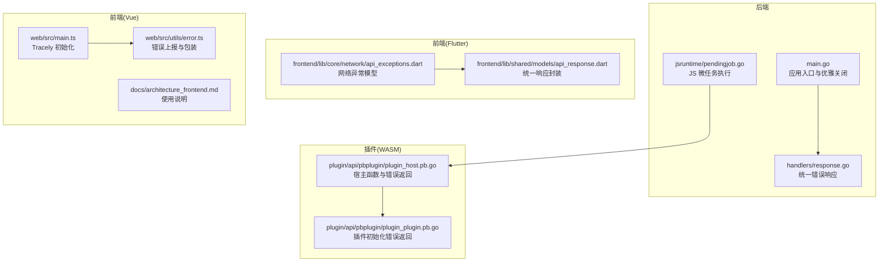
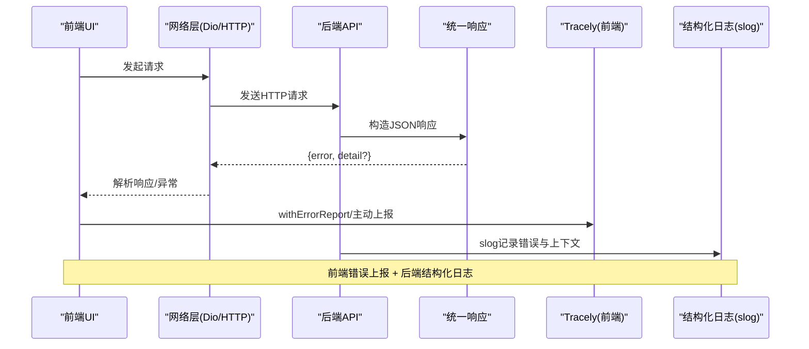
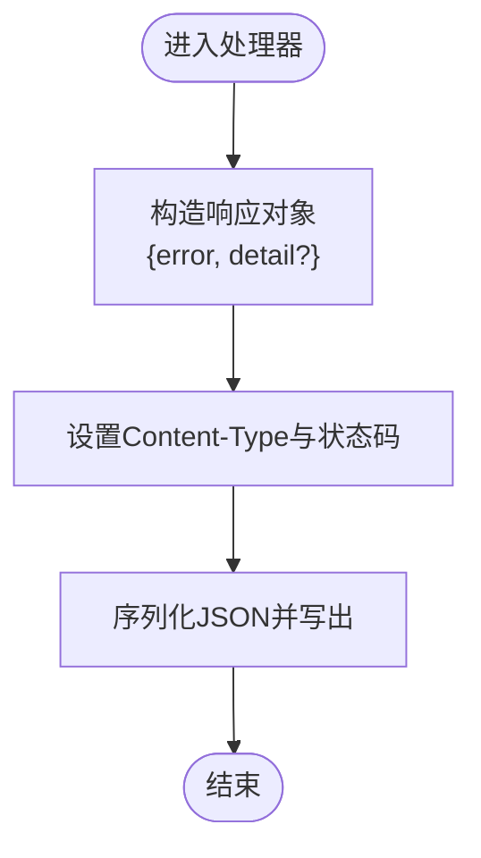
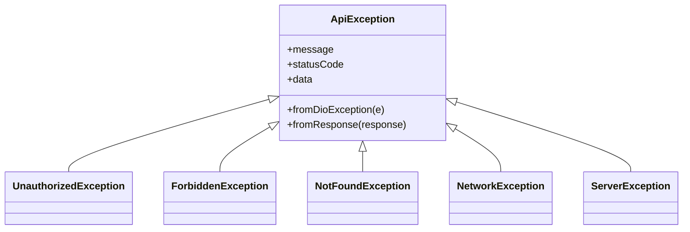
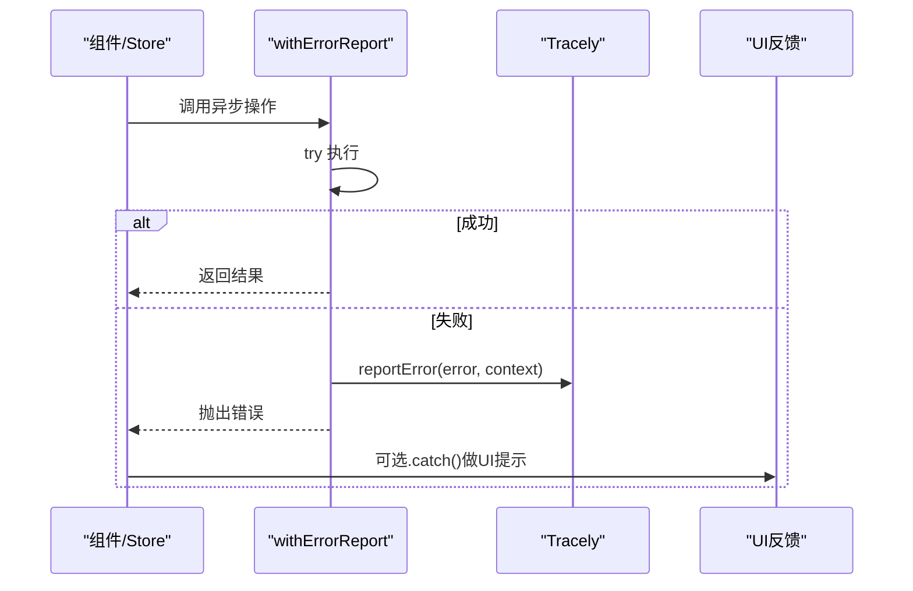
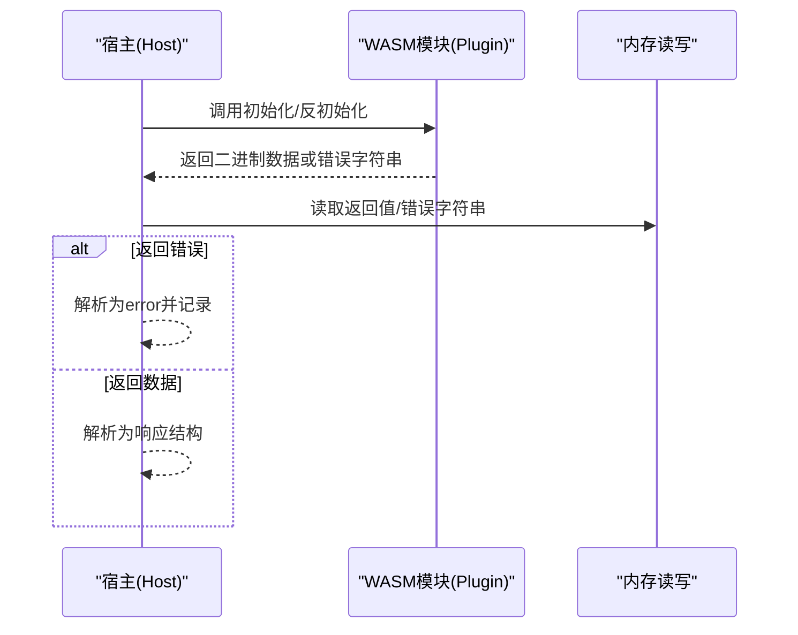
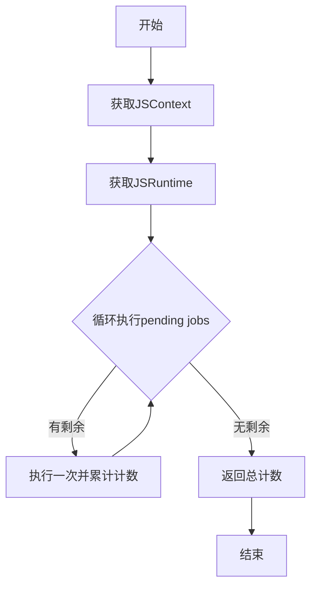
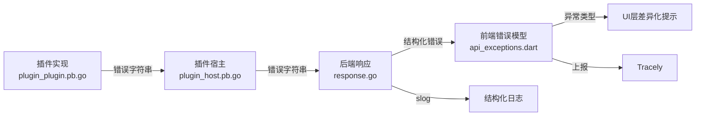

# 错误处理

<cite>
**本文引用的文件**
- [main.go](file://main.go)
- [internal/handlers/response.go](file://internal/handlers/response.go)
- [frontend/lib/core/network/api_exceptions.dart](file://frontend/lib/core/network/api_exceptions.dart)
- [frontend/lib/shared/models/api_response.dart](file://frontend/lib/shared/models/api_response.dart)
- [web/src/utils/error.ts](file://web/src/utils/error.ts)
- [web/src/main.ts](file://web/src/main.ts)
- [docs/architecture_frontend.md](file://docs/architecture_frontend.md)
- [internal/jsruntime/pendingjob.go](file://internal/jsruntime/pendingjob.go)
- [plugin/api/pbplugin/plugin_host.pb.go](file://plugin/api/pbplugin/plugin_host.pb.go)
- [plugin/api/pbplugin/plugin_plugin.pb.go](file://plugin/api/pbplugin/plugin_plugin.pb.go)
- [internal/plugins/manager_test.go](file://internal/plugins/manager_test.go)
</cite>

## 目录
1. [简介](#简介)
2. [项目结构](#项目结构)
3. [核心组件](#核心组件)
4. [架构总览](#架构总览)
5. [详细组件分析](#详细组件分析)
6. [依赖分析](#依赖分析)
7. [性能考虑](#性能考虑)
8. [故障排查指南](#故障排查指南)
9. [结论](#结论)
10. [附录](#附录)

## 简介
本指南聚焦 Songloft 的错误处理与异常管理，覆盖前端与后端的错误分类、错误代码语义、统一响应格式、错误上报与监控、日志采集与分析、异常恢复策略（降级、重试、优雅关闭）、用户提示设计与最佳实践，以及监控告警配置建议。目标是帮助开发者与运维人员建立一致、可追溯、可恢复的错误管理体系。

## 项目结构
Songloft 采用前后端分离架构：
- 后端：Go + Chi 路由，提供 RESTful API；统一错误响应格式；结构化日志；优雅关闭。
- 前端：Flutter/Dart（移动端/Web）与 Vue（Web 控制台），统一网络异常模型与错误上报；Tracely 前端监控接入。
- 插件系统：基于 WASM 的插件宿主与插件交互协议，错误通过协议返回并在宿主侧处理。

**图表来源**
- [main.go:30-63](file://main.go#L30-L63)
- [internal/handlers/response.go:8-24](file://internal/handlers/response.go#L8-L24)
- [frontend/lib/core/network/api_exceptions.dart:15-94](file://frontend/lib/core/network/api_exceptions.dart#L15-L94)
- [frontend/lib/shared/models/api_response.dart:24-50](file://frontend/lib/shared/models/api_response.dart#L24-L50)
- [web/src/main.ts:30-41](file://web/src/main.ts#L30-L41)
- [web/src/utils/error.ts:6-41](file://web/src/utils/error.ts#L6-L41)
- [plugin/api/pbplugin/plugin_host.pb.go:449-509](file://plugin/api/pbplugin/plugin_host.pb.go#L449-L509)
- [plugin/api/pbplugin/plugin_plugin.pb.go:55-77](file://plugin/api/pbplugin/plugin_plugin.pb.go#L55-L77)

**章节来源**
- [main.go:30-63](file://main.go#L30-L63)
- [internal/handlers/response.go:8-24](file://internal/handlers/response.go#L8-L24)
- [frontend/lib/core/network/api_exceptions.dart:15-94](file://frontend/lib/core/network/api_exceptions.dart#L15-L94)
- [frontend/lib/shared/models/api_response.dart:24-50](file://frontend/lib/shared/models/api_response.dart#L24-L50)
- [web/src/main.ts:30-41](file://web/src/main.ts#L30-L41)
- [web/src/utils/error.ts:6-41](file://web/src/utils/error.ts#L6-L41)
- [plugin/api/pbplugin/plugin_host.pb.go:449-509](file://plugin/api/pbplugin/plugin_host.pb.go#L449-L509)
- [plugin/api/pbplugin/plugin_plugin.pb.go:55-77](file://plugin/api/pbplugin/plugin_plugin.pb.go#L55-L77)

## 核心组件
- 统一错误响应（后端）：统一 JSON 错误格式，包含错误消息与可选详细信息，便于前端解析与展示。
- Flutter 网络异常模型：按 Dio 异常类型与 HTTP 状态码分类，映射为领域化的异常类型，便于 UI 层差异化处理。
- 前端错误上报与包装：Tracely 初始化与错误上报；withErrorReport 自动上报并重新抛出，避免重复样板代码。
- WASM 插件错误处理：宿主与插件通过协议返回错误字符串，宿主侧统一解析并记录。
- 优雅关闭：信号处理与资源回收，降低停机风险。

**章节来源**
- [internal/handlers/response.go:15-24](file://internal/handlers/response.go#L15-L24)
- [frontend/lib/core/network/api_exceptions.dart:15-94](file://frontend/lib/core/network/api_exceptions.dart#L15-L94)
- [web/src/utils/error.ts:6-41](file://web/src/utils/error.ts#L6-L41)
- [web/src/main.ts:30-41](file://web/src/main.ts#L30-L41)
- [plugin/api/pbplugin/plugin_host.pb.go:499-501](file://plugin/api/pbplugin/plugin_host.pb.go#L499-L501)
- [plugin/api/pbplugin/plugin_plugin.pb.go:63-69](file://plugin/api/pbplugin/plugin_plugin.pb.go#L63-L69)
- [main.go:46-56](file://main.go#L46-L56)

## 架构总览
下图展示了从前端到后端再到插件系统的错误处理与监控链路。

**图表来源**
- [frontend/lib/core/network/api_exceptions.dart:15-94](file://frontend/lib/core/network/api_exceptions.dart#L15-L94)
- [internal/handlers/response.go:15-24](file://internal/handlers/response.go#L15-L24)
- [web/src/utils/error.ts:6-41](file://web/src/utils/error.ts#L6-L41)
- [main.go:34-62](file://main.go#L34-L62)

## 详细组件分析

### 统一错误响应（后端）
- 规范：统一返回 JSON，包含错误消息；当存在底层错误时，附加 detail 字段。
- 作用：保证前后端契约稳定，便于前端统一解析与 UI 展示。
- 场景：鉴权失败、资源不存在、服务器内部错误等。

**图表来源**
- [internal/handlers/response.go:8-24](file://internal/handlers/response.go#L8-L24)

**章节来源**
- [internal/handlers/response.go:8-24](file://internal/handlers/response.go#L8-L24)

### Flutter 网络异常模型
- 分类依据：
  - Dio 异常类型：超时、连接错误、证书错误、响应错误、取消、未知。
  - HTTP 状态码：401/403/404 与 5xx 服务器错误。
- 映射规则：将具体错误映射为领域化异常类型，便于 UI 层区分提示与引导。
- 响应解析：优先从后端返回的 error/detail/message 字段提取可读信息。

**图表来源**
- [frontend/lib/core/network/api_exceptions.dart:4-144](file://frontend/lib/core/network/api_exceptions.dart#L4-L144)

**章节来源**
- [frontend/lib/core/network/api_exceptions.dart:15-94](file://frontend/lib/core/network/api_exceptions.dart#L15-L94)

### 前端错误上报与包装
- Tracely 初始化：在应用启动时注入全局 tracely 实例，用于捕获错误与路由变化。
- 错误上报：reportError 主动上报被捕获的错误，确保 catch 块内的错误也能被监控平台记录。
- 包装函数：withErrorReport 自动包裹异步操作，统一上报并重新抛出，减少重复代码。

**图表来源**
- [web/src/utils/error.ts:6-41](file://web/src/utils/error.ts#L6-L41)
- [web/src/main.ts:30-41](file://web/src/main.ts#L30-L41)
- [docs/architecture_frontend.md:397-449](file://docs/architecture_frontend.md#L397-L449)

**章节来源**
- [web/src/utils/error.ts:6-41](file://web/src/utils/error.ts#L6-L41)
- [web/src/main.ts:30-41](file://web/src/main.ts#L30-L41)
- [docs/architecture_frontend.md:397-449](file://docs/architecture_frontend.md#L397-L449)

### WASM 插件错误处理
- 插件初始化/反初始化：当插件返回错误字符串时，宿主侧将其解析为 Go error 并记录。
- 宿主函数调用：路由调用与定时器注册等通过协议传递，错误同样以字符串形式返回，宿主侧统一处理。
- 健康状态：插件实例健康状态可被跟踪与查询，不健康实例拒绝新请求，避免放大故障。

**图表来源**
- [plugin/api/pbplugin/plugin_host.pb.go:449-509](file://plugin/api/pbplugin/plugin_host.pb.go#L449-L509)
- [plugin/api/pbplugin/plugin_plugin.pb.go:55-77](file://plugin/api/pbplugin/plugin_plugin.pb.go#L55-L77)
- [internal/plugins/manager_test.go:129-138](file://internal/plugins/manager_test.go#L129-L138)

**章节来源**
- [plugin/api/pbplugin/plugin_host.pb.go:449-509](file://plugin/api/pbplugin/plugin_host.pb.go#L449-L509)
- [plugin/api/pbplugin/plugin_plugin.pb.go:55-77](file://plugin/api/pbplugin/plugin_plugin.pb.go#L55-L77)
- [internal/plugins/manager_test.go:129-138](file://internal/plugins/manager_test.go#L129-L138)

### JS 运行时微任务处理
- 作用：在 WASM 插件环境中，处理 Promise 微任务队列，避免异步任务堆积导致的阻塞。
- 行为：循环执行 pending jobs，限制最大次数，返回执行数量，便于诊断性能问题。

**图表来源**
- [internal/jsruntime/pendingjob.go:21-65](file://internal/jsruntime/pendingjob.go#L21-L65)

**章节来源**
- [internal/jsruntime/pendingjob.go:21-65](file://internal/jsruntime/pendingjob.go#L21-L65)

## 依赖分析
- 前端依赖 Tracely SDK 进行错误上报；与 Axios/Dio 的异常模型耦合度低，便于替换。
- 后端依赖 slog 输出结构化日志；与响应格式解耦，便于对接不同监控系统。
- 插件系统通过协议约定错误返回格式，宿主侧集中处理，降低插件实现复杂度。

**图表来源**
- [frontend/lib/core/network/api_exceptions.dart:15-94](file://frontend/lib/core/network/api_exceptions.dart#L15-L94)
- [web/src/utils/error.ts:6-41](file://web/src/utils/error.ts#L6-L41)
- [internal/handlers/response.go:15-24](file://internal/handlers/response.go#L15-L24)
- [plugin/api/pbplugin/plugin_host.pb.go:499-501](file://plugin/api/pbplugin/plugin_host.pb.go#L499-L501)
- [plugin/api/pbplugin/plugin_plugin.pb.go:63-69](file://plugin/api/pbplugin/plugin_plugin.pb.go#L63-L69)

**章节来源**
- [frontend/lib/core/network/api_exceptions.dart:15-94](file://frontend/lib/core/network/api_exceptions.dart#L15-L94)
- [web/src/utils/error.ts:6-41](file://web/src/utils/error.ts#L6-L41)
- [internal/handlers/response.go:15-24](file://internal/handlers/response.go#L15-L24)
- [plugin/api/pbplugin/plugin_host.pb.go:499-501](file://plugin/api/pbplugin/plugin_host.pb.go#L499-L501)
- [plugin/api/pbplugin/plugin_plugin.pb.go:63-69](file://plugin/api/pbplugin/plugin_plugin.pb.go#L63-L69)

## 性能考虑
- 前端错误上报：避免在高频错误场景中重复上报相同上下文，可在 UI 层做去抖或聚合。
- 后端日志：结构化日志包含关键字段（如错误、状态码、耗时），建议结合采样策略控制日志量。
- 插件微任务：定期检查 executePendingJobs 的执行次数，若持续偏高，需排查插件异步任务是否过多。
- 网络异常：对超时与重试策略进行限流与退避，防止雪崩效应。

[本节为通用指导，无需“章节来源”]

## 故障排查指南

### 错误分类与识别
- 系统错误（后端）：通常为 5xx，表示服务器内部错误或不可预期异常。后端统一返回 JSON 错误与可选 detail。
- 业务错误（后端）：如鉴权失败（401/403）、资源不存在（404），前端映射为领域化异常类型，便于 UI 提示。
- 网络错误（前端）：Dio 异常类型（超时、连接错误、证书错误、取消、未知）与 HTTP 状态码共同决定异常类型。
- 插件错误（WASM）：插件初始化/反初始化或路由调用返回错误字符串，宿主侧统一解析为 error 并记录。

**章节来源**
- [internal/handlers/response.go:15-24](file://internal/handlers/response.go#L15-L24)
- [frontend/lib/core/network/api_exceptions.dart:15-94](file://frontend/lib/core/network/api_exceptions.dart#L15-L94)
- [plugin/api/pbplugin/plugin_host.pb.go:499-501](file://plugin/api/pbplugin/plugin_host.pb.go#L499-L501)
- [plugin/api/pbplugin/plugin_plugin.pb.go:63-69](file://plugin/api/pbplugin/plugin_plugin.pb.go#L63-L69)

### 错误代码与含义
- 401 未授权：前端映射为 UnauthorizedException，提示登录过期或未登录。
- 403 禁止访问：前端映射为 ForbiddenException，提示权限不足。
- 404 未找到：前端映射为 NotFoundException，提示资源不存在。
- 500/502/503/504 服务器错误：前端映射为 ServerException，提示服务器错误或网关错误。

**章节来源**
- [frontend/lib/core/network/api_exceptions.dart:59-93](file://frontend/lib/core/network/api_exceptions.dart#L59-L93)

### 标准化处理流程
- 前端：
  - 使用 withErrorReport 包裹异步操作，自动上报并重新抛出。
  - 对于需要 UI 反馈的场景，使用 .catch() 展示提示。
  - 在拦截器中统一处理 HTTP 错误，避免重复上报。
- 后端：
  - 统一使用 respondError 返回 JSON 错误，包含 error 与 detail。
  - 记录结构化日志，包含错误、状态码、请求路径、用户标识等。
- 插件：
  - 初始化/反初始化或调用失败时返回错误字符串，宿主侧解析并记录。

**章节来源**
- [web/src/utils/error.ts:6-41](file://web/src/utils/error.ts#L6-L41)
- [docs/architecture_frontend.md:397-449](file://docs/architecture_frontend.md#L397-L449)
- [internal/handlers/response.go:15-24](file://internal/handlers/response.go#L15-L24)
- [plugin/api/pbplugin/plugin_host.pb.go:499-501](file://plugin/api/pbplugin/plugin_host.pb.go#L499-L501)

### 错误日志分析方法
- 前端：Tracely 收集错误堆栈、上下文、路由信息；结合 withErrorReport 的 context 字段定位问题。
- 后端：slog 输出结构化日志，包含 error、detail、statusCode、path、method、userID 等；建议接入集中式日志系统进行检索与聚合。
- 插件：宿主侧记录插件 ID、调用接口、错误字符串；必要时开启更细粒度的日志级别。

**章节来源**
- [web/src/utils/error.ts:6-41](file://web/src/utils/error.ts#L6-L41)
- [main.go:34-62](file://main.go#L34-L62)
- [plugin/api/pbplugin/plugin_host.pb.go:499-501](file://plugin/api/pbplugin/plugin_host.pb.go#L499-L501)

### 异常恢复策略
- 服务降级：对非关键接口在上游故障时返回兜底数据或简化响应，保障核心功能可用。
- 重试机制：对瞬时性网络错误（如超时、502/504）进行指数退避重试，设置最大重试次数与超时上限。
- 优雅关闭：接收 SIGINT/SIGTERM 信号后，停止接受新请求，等待在途请求完成并释放资源。
- 插件隔离：对不健康插件实例拒绝新请求，允许其自愈或重启，避免影响其他插件与宿主稳定性。

**章节来源**
- [main.go:46-56](file://main.go#L46-L56)
- [internal/plugins/manager_test.go:129-138](file://internal/plugins/manager_test.go#L129-L138)

### 用户友好提示设计
- 明确可读：优先使用后端返回的 error/detail/message，避免内部技术术语。
- 分级提示：区分网络错误、鉴权错误、业务错误与服务器错误，分别给出对应的操作建议。
- 可恢复：对可重试的错误提供“重试”按钮或自动重试；对不可恢复的错误提供“联系支持”入口。
- 一致性：UI 组件库统一错误样式与文案模板，避免多处散落的文案差异。

[本节为通用指导，无需“章节来源”]

### 监控与告警配置建议
- 前端：Tracely 配置应用 ID/Secret 与上报主机；按错误类型与上下文聚合告警阈值；对高频错误触发即时告警。
- 后端：slog 输出到集中日志系统；基于错误码、路由、用户 ID 等维度聚合；对 5xx 错误与异常峰值设置告警。
- 插件：对插件初始化/调用失败率设置阈值告警；记录插件健康状态变化事件。

**章节来源**
- [web/src/main.ts:30-41](file://web/src/main.ts#L30-L41)
- [main.go:34-62](file://main.go#L34-L62)
- [plugin/api/pbplugin/plugin_host.pb.go:499-501](file://plugin/api/pbplugin/plugin_host.pb.go#L499-L501)

## 结论
Songloft 的错误处理体系通过前后端统一的异常模型、结构化日志与前端监控平台，实现了可观测、可恢复、可治理的错误管理闭环。遵循本文的分类、流程与最佳实践，可显著提升系统的稳定性与用户体验。

[本节为总结，无需“章节来源”]

## 附录

### 常见错误场景与处理要点
- 登录态失效：前端捕获 401，跳转登录页并提示重新登录。
- 权限不足：前端捕获 403，提示无权限并引导至权限申请或切换账号。
- 资源不存在：前端捕获 404，提示资源已删除或链接失效。
- 网络波动：前端捕获网络异常，提示检查网络或稍后重试。
- 服务器错误：前端捕获 5xx，提示稍后重试并附带错误码。
- 插件异常：宿主记录错误字符串，提示插件异常并提供禁用/重载选项。

**章节来源**
- [frontend/lib/core/network/api_exceptions.dart:59-93](file://frontend/lib/core/network/api_exceptions.dart#L59-L93)
- [plugin/api/pbplugin/plugin_host.pb.go:499-501](file://plugin/api/pbplugin/plugin_host.pb.go#L499-L501)