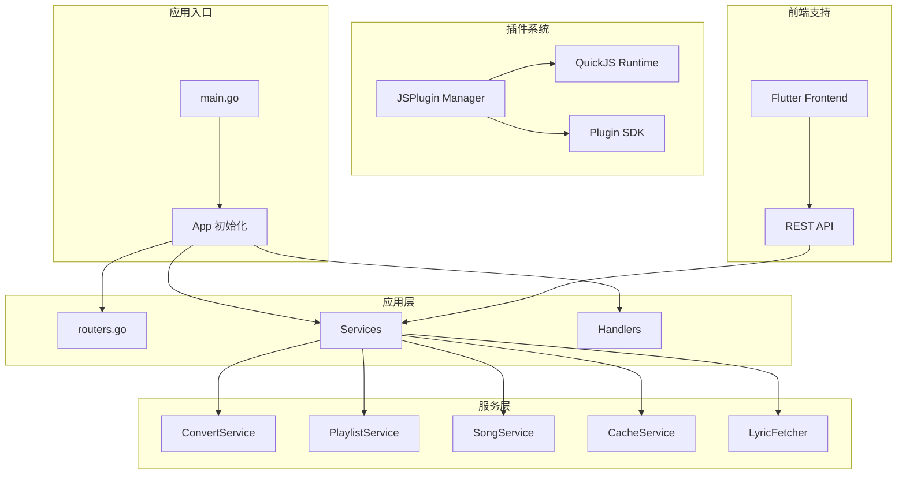
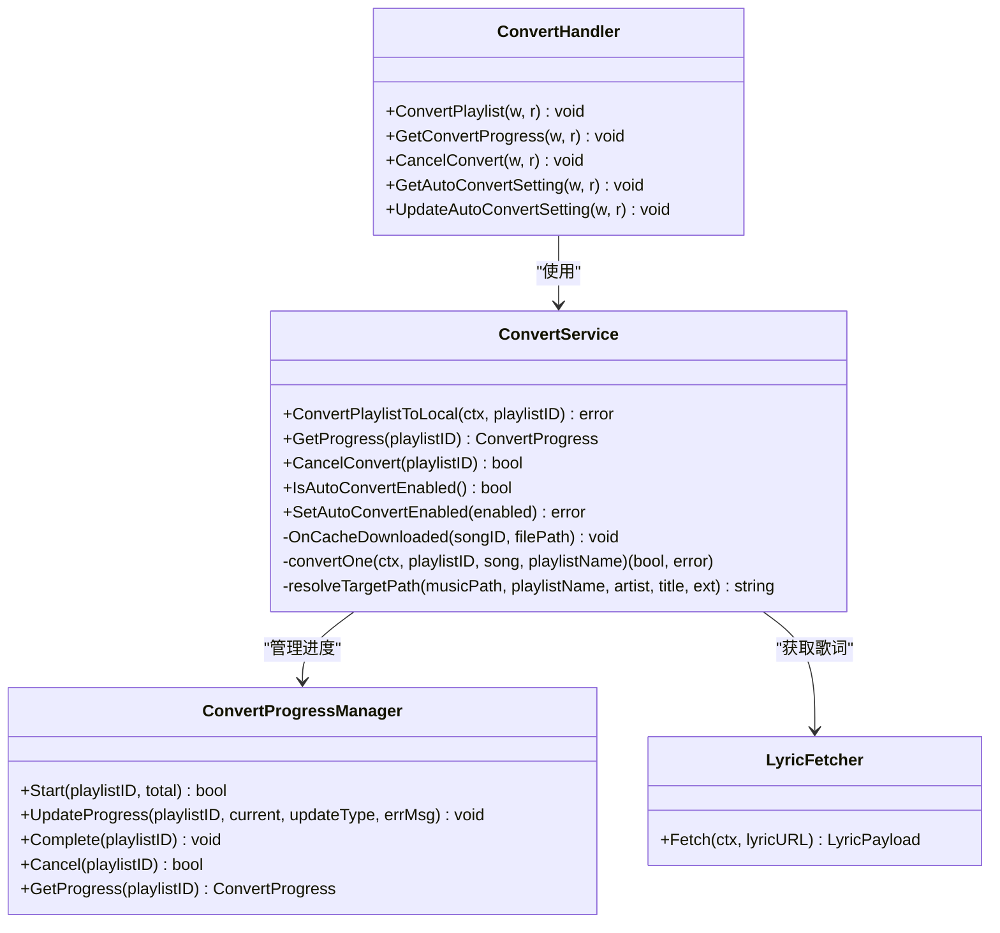
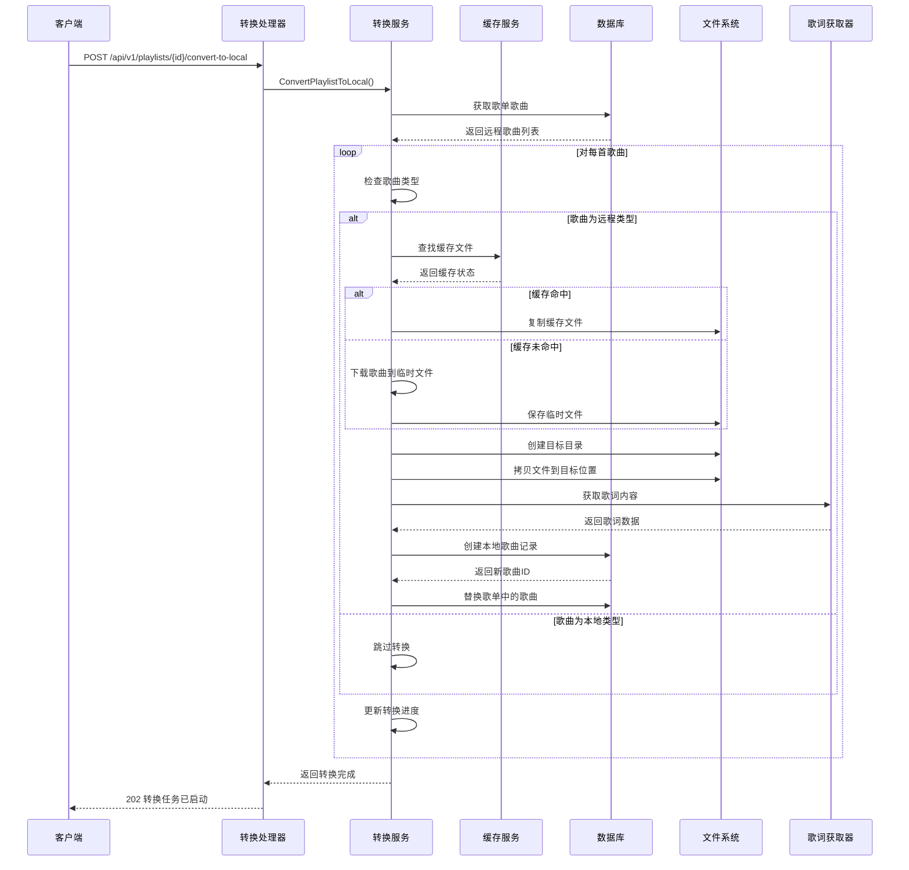
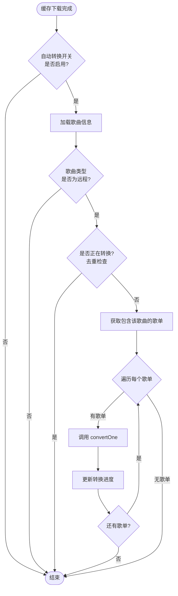
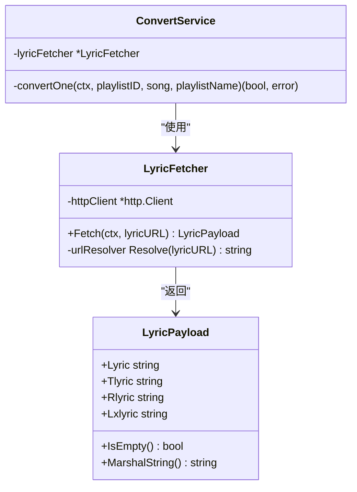
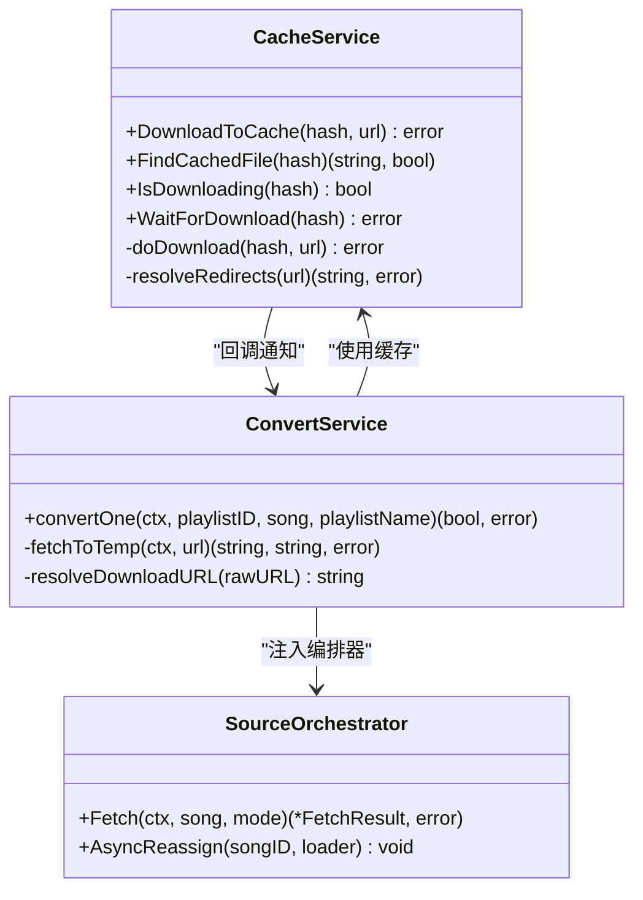
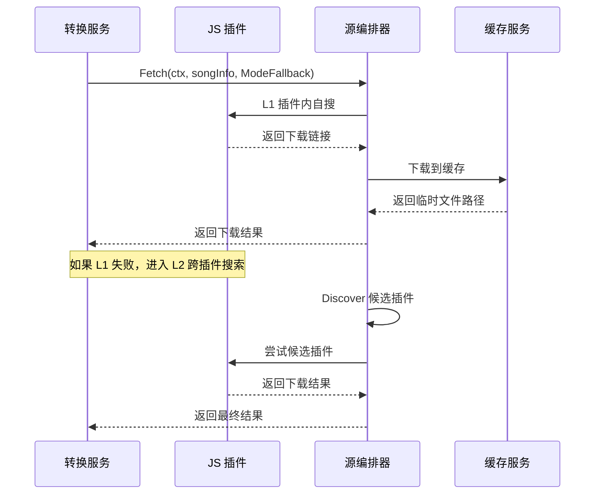

# 网络到本地歌曲转换系统

<cite>
**本文档引用的文件**
- [main.go](file://main.go)
- [README.md](file://README.md)
- [app.go](file://internal/app/app.go)
- [routers.go](file://internal/app/routers.go)
- [convert.go](file://internal/handlers/convert.go)
- [convert_service.go](file://internal/services/convert_service.go)
- [convert_progress.go](file://internal/services/convert_progress.go)
- [cache_service.go](file://internal/services/cache_service.go)
- [orchestrator.go](file://internal/services/source/orchestrator.go)
- [manager.go](file://internal/jsplugin/manager.go)
- [lyric_fetcher.go](file://internal/services/lyric_fetcher.go)
- [lyric.go](file://internal/models/lyric.go)
- [errors.go](file://internal/services/source/errors.go)
- [architecture.md](file://docs/architecture.md)
- [main.ts](file://jsplugins-src/songloft-jsplugin-lxmusic/src/main.ts)
</cite>

## 更新摘要
**变更内容**
- 更新了自动转换功能的增强说明，包括并发控制和去重机制
- 新增了改进的歌词获取逻辑和更好的错误处理机制
- 增强了转换进度管理和错误详情显示
- 完善了缓存服务的集成和优化

## 目录
1. [简介](#简介)
2. [项目结构](#项目结构)
3. [核心组件](#核心组件)
4. [架构总览](#架构总览)
5. [详细组件分析](#详细组件分析)
6. [依赖关系分析](#依赖关系分析)
7. [性能考虑](#性能考虑)
8. [故障排除指南](#故障排除指南)
9. [结论](#结论)

## 简介

Songloft 是一个自托管的轻量级音乐服务器，专注于将网络歌曲转换为本地可播放的音频文件。该系统基于 Go 语言开发，采用前后端分离架构，支持多种音频格式和丰富的插件生态系统。

系统的核心功能包括：
- **网络歌曲到本地转换**：将在线音乐下载并转换为本地文件
- **智能缓存管理**：基于哈希的音乐文件缓存系统
- **插件扩展架构**：基于 QuickJS 的动态音源扩展
- **跨平台支持**：支持多种操作系统和设备类型
- **自动网络播放列表转换**：缓存完成后自动触发转换
- **改进的歌词获取逻辑**：支持多格式歌词解析和存储
- **更好的错误处理**：详细的错误分类和处理机制

## 项目结构

Songloft 采用模块化的项目结构，主要分为以下几个核心部分：



**图表来源**
- [main.go:45-79](file://main.go#L45-L79)
- [app.go:51-312](file://internal/app/app.go#L51-L312)

**章节来源**
- [README.md:424-476](file://README.md#L424-L476)
- [architecture.md:77-112](file://docs/architecture.md#L77-L112)

## 核心组件

### 应用架构组件

系统采用分层架构设计，主要包括以下核心组件：

1. **应用入口层**：负责应用初始化、配置解析和资源管理
2. **路由层**：处理 HTTP 请求路由和中间件
3. **处理器层**：实现具体的业务逻辑处理
4. **服务层**：封装业务逻辑和数据访问
5. **插件系统**：提供动态音源扩展能力

### 转换服务组件

转换服务是系统的核心功能模块，负责将网络歌曲转换为本地文件：



**图表来源**
- [convert_service.go:60-116](file://internal/services/convert_service.go#L60-L116)
- [convert.go:14-22](file://internal/handlers/convert.go#L14-L22)
- [convert_progress.go:52-63](file://internal/services/convert_progress.go#L52-L63)
- [lyric_fetcher.go:20-31](file://internal/services/lyric_fetcher.go#L20-L31)

**章节来源**
- [convert_service.go:86-116](file://internal/services/convert_service.go#L86-L116)
- [convert.go:19-22](file://internal/handlers/convert.go#L19-L22)

## 架构总览

Songloft 采用现代化的微服务架构，结合了传统三层架构的优势：

```mermaid
graph TB
subgraph "客户端层"
FE[Flutter 客户端]
WEB[Web 浏览器]
MOBILE[移动应用]
end
subgraph "API 网关层"
ROUTER[Chi Router]
AUTH[JWT 认证]
CORS[CORS 中间件]
end
subgraph "业务逻辑层"
CONVERT[转换服务]
CACHE[缓存服务]
PLAYLIST[歌单服务]
SONG[歌曲服务]
LYRIC[歌词获取器]
END
subgraph "数据访问层"
SQLITE[SQLite 数据库]
FS[文件系统]
end
subgraph "插件扩展层"
JSPLUGIN[JS 插件管理器]
QUICKJS[QuickJS 运行时]
SDK[插件 SDK]
end
FE --> ROUTER
WEB --> ROUTER
MOBILE --> ROUTER
ROUTER --> AUTH
AUTH --> CONVERT
AUTH --> CACHE
AUTH --> PLAYLIST
AUTH --> SONG
AUTH --> LYRIC
CONVERT --> SQLITE
CACHE --> SQLITE
PLAYLIST --> SQLITE
SONG --> SQLITE
CONVERT --> FS
CACHE --> FS
CONVERT --> JSPLUGIN
CONVERT --> LYRIC
JSPLUGIN --> QUICKJS
JSPLUGIN --> SDK
```

**图表来源**
- [architecture.md:14-47](file://docs/architecture.md#L14-L47)
- [app.go:30-49](file://internal/app/app.go#L30-L49)

## 详细组件分析

### 转换服务工作流程

转换服务实现了完整的网络歌曲到本地文件的转换流程：



**图表来源**
- [convert.go:29-67](file://internal/handlers/convert.go#L29-L67)
- [convert_service.go:170-201](file://internal/services/convert_service.go#L170-L201)

### 自动转换机制

系统支持自动转换功能，当缓存下载完成后自动触发转换：



**图表来源**
- [convert_service.go:470-520](file://internal/services/convert_service.go#L470-L520)
- [convert_progress.go:76-98](file://internal/services/convert_progress.go#L76-L98)

### 改进的歌词获取逻辑

系统实现了改进的歌词获取逻辑，支持多种格式和更好的错误处理：



**图表来源**
- [lyric_fetcher.go:14-31](file://internal/services/lyric_fetcher.go#L14-L31)
- [lyric.go:8-18](file://internal/models/lyric.go#L8-L18)
- [convert_service.go:361-382](file://internal/services/convert_service.go#L361-L382)

### 缓存系统集成

转换服务与缓存系统深度集成，实现了高效的文件管理：



**图表来源**
- [cache_service.go:48-91](file://internal/services/cache_service.go#L48-L91)
- [convert_service.go:118-122](file://internal/services/convert_service.go#L118-L122)
- [orchestrator.go:46-72](file://internal/services/source/orchestrator.go#L46-L72)

**章节来源**
- [convert_service.go:279-468](file://internal/services/convert_service.go#L279-L468)
- [cache_service.go:157-189](file://internal/services/cache_service.go#L157-L189)

### JS 插件系统集成

系统通过 JS 插件扩展音源能力，转换服务支持插件驱动的下载：



**图表来源**
- [orchestrator.go:88-142](file://internal/services/source/orchestrator.go#L88-L142)
- [manager.go:158-200](file://internal/jsplugin/manager.go#L158-L200)

**章节来源**
- [convert_service.go:317-339](file://internal/services/convert_service.go#L317-L339)
- [manager.go:92-129](file://internal/jsplugin/manager.go#L92-L129)

## 依赖关系分析

系统采用了清晰的依赖层次结构，实现了良好的模块解耦：

```mermaid
graph TB
subgraph "外部依赖"
CHI[Chi Router v5.2.4]
SQLITE[modernc.org/sqlite]
JWT[golang-jwt/jwt v5]
QUICKJS[modernc.org/quickjs]
TAG[hanxi/tag]
end
subgraph "内部模块"
APP[App 层]
HANDLER[Handlers]
SERVICE[Services]
DATABASE[Database]
JSP[JSP Manager]
end
subgraph "业务模块"
CONVERT[Convert Service]
CACHE[Cache Service]
PLAYLIST[Playlist Service]
SONG[Song Service]
LYRIC[Lyric Fetcher]
END
CHI --> HANDLER
SQLITE --> DATABASE
JWT --> HANDLER
QUICKJS --> JSP
TAG --> SONG
HANDLER --> SERVICE
SERVICE --> DATABASE
SERVICE --> CACHE
SERVICE --> CONVERT
SERVICE --> PLAYLIST
SERVICE --> SONG
SERVICE --> LYRIC
APP --> HANDLER
APP --> SERVICE
APP --> JSP
```

**图表来源**
- [architecture.md:49-76](file://docs/architecture.md#L49-L76)
- [app.go:3-28](file://internal/app/app.go#L3-L28)

**章节来源**
- [README.md:491-498](file://README.md#L491-L498)
- [app.go:288-310](file://internal/app/app.go#L288-L310)

## 性能考虑

### 并发控制

系统在多个层面实现了并发控制，确保转换过程的稳定性和效率：

1. **自动转换并发限制**：使用信号量限制同时进行的自动转换任务数量
2. **下载限速**：通过随机抖动实现防风控的下载速率控制
3. **缓存并发管理**：使用 inflight 机制避免重复下载
4. **转换进度并发**：使用互斥锁保护进度状态的更新

### 内存管理

- **临时文件管理**：转换过程中产生的临时文件会在完成后自动清理
- **内存限制**：通过 GOMEMLIMIT 环境变量控制内存使用
- **垃圾回收优化**：调整 GC 百分比以平衡性能和内存占用
- **歌词数据限制**：限制歌词响应大小防止内存爆炸

### 存储优化

- **文件系统缓存**：利用操作系统的文件系统缓存提高读写性能
- **目录结构优化**：采用两级目录结构避免单目录文件过多
- **元数据写入**：支持多种音频格式的元数据写入，提升文件完整性
- **缓存淘汰策略**：实现 LRU 淘汰算法优化缓存空间使用

## 故障排除指南

### 常见问题及解决方案

1. **转换任务无法启动**
   - 检查歌单是否包含远程歌曲
   - 确认转换服务是否正确初始化
   - 查看日志中是否有权限错误

2. **转换进度停滞**
   - 检查网络连接状态
   - 验证目标目录的写入权限
   - 确认磁盘空间充足

3. **文件名冲突**
   - 系统会自动处理文件名冲突，添加数字后缀
   - 检查文件名长度限制（180字节）

4. **歌词获取失败**
   - 检查歌词 URL 是否有效
   - 验证歌词服务的可用性
   - 查看歌词响应格式是否符合预期

### 调试技巧

- **启用详细日志**：通过结构化日志追踪转换过程
- **监控转换进度**：使用进度查询接口实时监控转换状态
- **检查缓存状态**：验证缓存服务是否正常工作
- **查看错误详情**：利用进度中的错误列表定位具体问题

**章节来源**
- [convert_service.go:470-520](file://internal/services/convert_service.go#L470-L520)
- [convert_progress.go:201-219](file://internal/services/convert_progress.go#L201-L219)

## 结论

Songloft 的网络到本地歌曲转换系统展现了现代音乐服务器的先进设计理念。通过模块化的架构设计、完善的插件扩展机制、高效的缓存管理和改进的错误处理，系统能够稳定地处理大规模的音乐转换任务。

系统的主要优势包括：

1. **高度可扩展性**：基于插件的音源扩展架构
2. **强大的转换能力**：支持多种音频格式和转换策略
3. **优秀的用户体验**：提供进度监控和自动转换功能
4. **可靠的稳定性**：完善的错误处理和恢复机制
5. **智能歌词处理**：支持多格式歌词解析和存储
6. **高效的缓存管理**：优化的缓存策略和淘汰算法

未来的发展方向可以包括：
- 进一步优化转换性能和资源利用率
- 增强插件生态系统的功能和易用性
- 扩展对更多音频格式的支持
- 提升用户界面的交互体验
- 增强错误诊断和自动修复能力