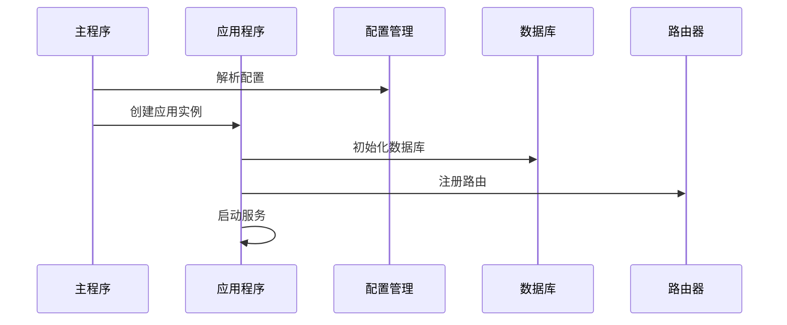
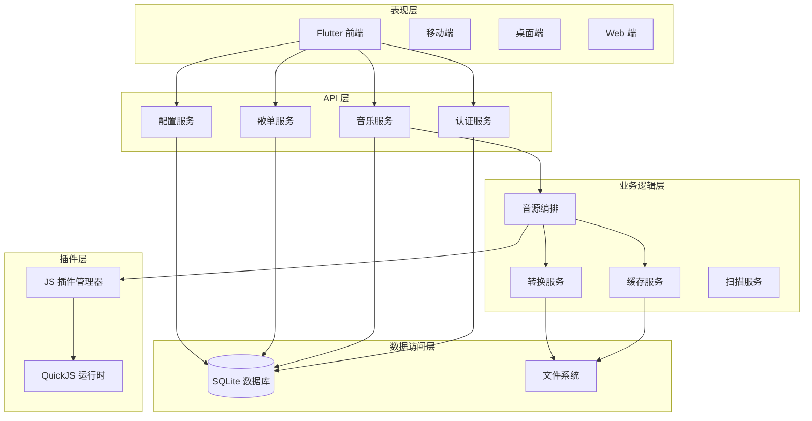
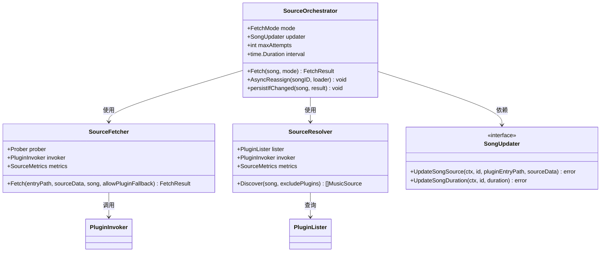
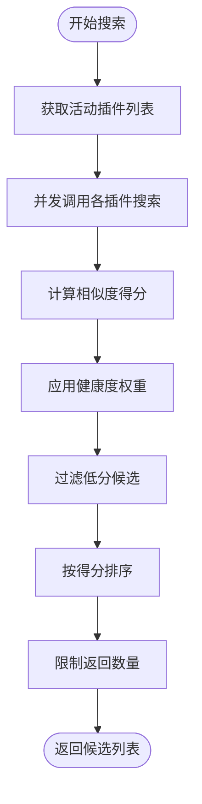
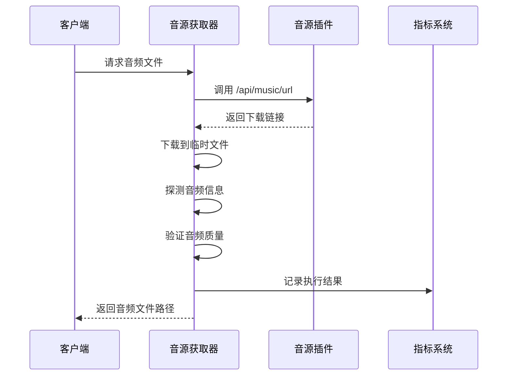
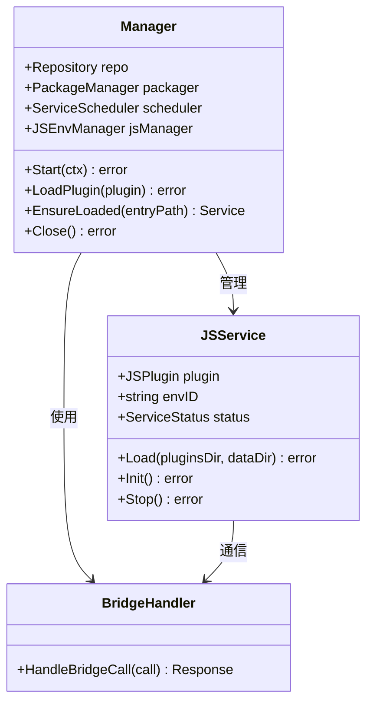
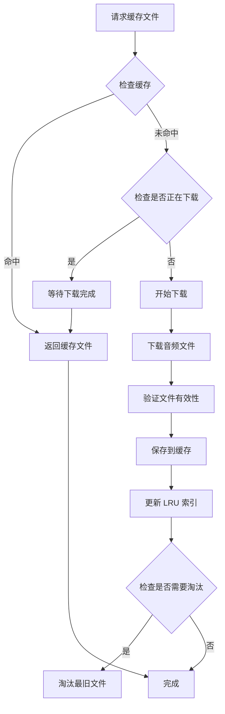
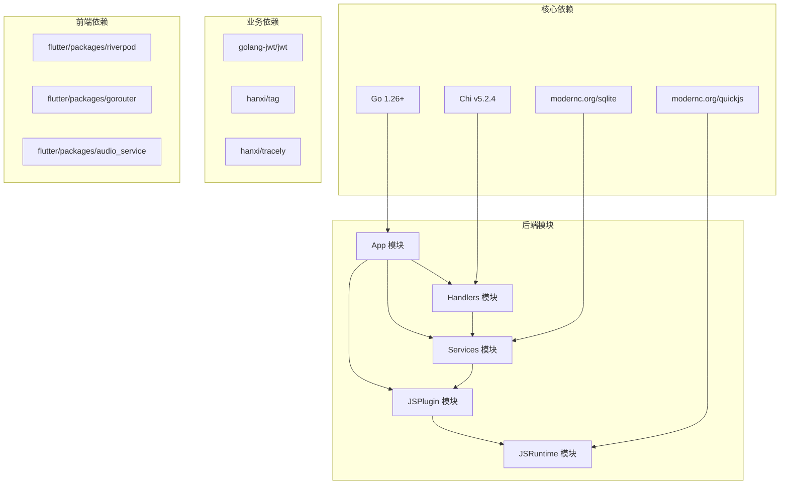

# 音频源编排框架

<cite>
**本文档引用的文件**
- [main.go](file://main.go)
- [app.go](file://internal/app/app.go)
- [orchestrator.go](file://internal/services/source/orchestrator.go)
- [resolver.go](file://internal/services/source/resolver.go)
- [fetcher.go](file://internal/services/source/fetcher.go)
- [metrics.go](file://internal/services/source/metrics.go)
- [manager.go](file://internal/jsplugin/manager.go)
- [service.go](file://internal/jsplugin/service.go)
- [plugin.go](file://internal/jsplugin/plugin.go)
- [music.go](file://internal/handlers/music.go)
- [cache_service.go](file://internal/services/cache_service.go)
- [architecture.md](file://docs/architecture.md)
- [architecture_backend.md](file://docs/architecture_backend.md)
- [main.dart](file://frontend/lib/main.dart)
</cite>

## 目录
1. [简介](#简介)
2. [项目结构](#项目结构)
3. [核心组件](#核心组件)
4. [架构概览](#架构概览)
5. [详细组件分析](#详细组件分析)
6. [依赖关系分析](#依赖关系分析)
7. [性能考虑](#性能考虑)
8. [故障排除指南](#故障排除指南)
9. [结论](#结论)

## 简介

Songloft 音频源编排框架是一个基于 Go 语言开发的自托管本地音乐服务器，采用前后端分离架构。该框架的核心特点是通过 JS 插件系统实现了高度可扩展的音源编排能力，支持多种音乐平台的音源接入和统一管理。

框架的主要特性包括：
- **JS 插件系统**：基于 QuickJS 的脚本插件架构，支持动态扩展音源能力
- **音源编排**：通过 Fetcher、Resolver、Orchestrator 三层架构实现音源的智能选择和切换
- **缓存机制**：按 hash 缓存网络歌曲，支持并发下载去重和 LRU 淘汰
- **健康监控**：实时监控音源健康状况，自动降级和切换
- **跨平台支持**：前后端分离，支持多种平台部署

## 项目结构

Songloft 项目采用清晰的分层架构设计，主要分为以下几个层次：

```mermaid
graph TB
subgraph "前端层"
FE[Flutter 前端]
UI[用户界面]
Audio[音频播放]
end
subgraph "后端层"
API[HTTP API 服务]
Handler[请求处理器]
Service[业务逻辑层]
DB[(SQLite 数据库)]
end
subgraph "插件层"
JSPlugin[JS 插件系统]
JSEnv[QuickJS 运行时]
Bridge[桥接层]
end
FE --> API
UI --> Handler
Audio --> Handler
Handler --> Service
Service --> DB
Service --> JSPlugin
JSPlugin --> JSEnv
JSEnv --> Bridge
```

**图表来源**
- [architecture.md:14-47](file://docs/architecture.md#L14-L47)
- [architecture_backend.md:19-59](file://docs/architecture_backend.md#L19-L59)

**章节来源**
- [architecture.md:1-205](file://docs/architecture.md#L1-L205)
- [architecture_backend.md:1-241](file://docs/architecture_backend.md#L1-L241)

## 核心组件

### 应用程序入口

应用程序从 `main.go` 启动，负责初始化配置、数据库连接和路由注册。

**图表来源**
- [main.go:45-78](file://main.go#L45-L78)
- [app.go:75-312](file://internal/app/app.go#L75-L312)

### 音源编排系统

音源编排系统是框架的核心，包含三个主要组件：

1. **Fetcher**：负责从音源获取音频文件
2. **Resolver**：负责音源发现和评分
3. **Orchestrator**：负责音源编排和切换

**章节来源**
- [main.go:1-79](file://main.go#L1-L79)
- [app.go:228-257](file://internal/app/app.go#L228-L257)

## 架构概览

Songloft 采用了经典的分层架构设计，确保了良好的可维护性和扩展性：

**图表来源**
- [architecture.md:14-47](file://docs/architecture.md#L14-L47)
- [architecture_backend.md:19-59](file://docs/architecture_backend.md#L19-L59)

## 详细组件分析

### 音源编排器 (SourceOrchestrator)

音源编排器是整个音源系统的核心，负责协调多个音源的访问和切换。

**图表来源**
- [orchestrator.go:46-72](file://internal/services/source/orchestrator.go#L46-L72)
- [fetcher.go:77-95](file://internal/services/source/fetcher.go#L77-L95)
- [resolver.go:54-87](file://internal/services/source/resolver.go#L54-L87)

音源编排器支持两种工作模式：

1. **ModeStrict（严格模式）**：仅尝试主音源，失败立即返回
2. **ModeFallback（回退模式）**：全链路回退，包括主源、L1 自搜和 L2 跨插件

**章节来源**
- [orchestrator.go:12-23](file://internal/services/source/orchestrator.go#L12-L23)
- [orchestrator.go:88-142](file://internal/services/source/orchestrator.go#L88-L142)

### 音源解析器 (SourceResolver)

音源解析器负责在多个音源插件中搜索相同的歌曲，并根据相似度和健康度进行评分。

**图表来源**
- [resolver.go:110-207](file://internal/services/source/resolver.go#L110-L207)

解析器的关键特性包括：
- **并发搜索**：同时向多个音源插件发送搜索请求
- **相似度计算**：基于标题、艺术家和时长的综合评分
- **健康度加权**：对健康度高的音源给予更高权重
- **结果缓存**：短期 LRU 缓存避免重复搜索

**章节来源**
- [resolver.go:14-46](file://internal/services/source/resolver.go#L14-L46)
- [resolver.go:110-207](file://internal/services/source/resolver.go#L110-L207)

### 音源获取器 (SourceFetcher)

音源获取器负责从具体的音源插件获取音频文件，并进行质量验证。

**图表来源**
- [fetcher.go:133-242](file://internal/services/source/fetcher.go#L133-L242)

获取器的验证流程包括：
1. **插件调用**：调用音源插件的音乐 URL 接口
2. **HTTP 下载**：下载音频文件到临时文件
3. **音频探测**：使用 ffprobe 探测音频技术参数
4. **质量验证**：验证音频文件的有效性

**章节来源**
- [fetcher.go:133-242](file://internal/services/source/fetcher.go#L133-L242)

### JS 插件管理系统

JS 插件管理系统提供了完整的插件生命周期管理，包括加载、健康检查和热更新。

**图表来源**
- [manager.go:32-53](file://internal/jsplugin/manager.go#L32-L53)
- [service.go:60-82](file://internal/jsplugin/service.go#L60-L82)

插件管理器的关键功能：
- **懒加载**：按需加载插件，避免不必要的资源消耗
- **健康检查**：定期检查插件运行状态
- **热更新**：监控插件文件变化，自动重新加载
- **并发控制**：避免同一插件的重复加载

**章节来源**
- [manager.go:92-129](file://internal/jsplugin/manager.go#L92-L129)
- [manager.go:310-373](file://internal/jsplugin/manager.go#L310-L373)

### 缓存服务

缓存服务实现了高效的音频文件缓存机制，支持并发下载去重和智能淘汰。

**图表来源**
- [cache_service.go:106-134](file://internal/services/cache_service.go#L106-L134)
- [cache_service.go:157-189](file://internal/services/cache_service.go#L157-L189)

缓存服务的核心特性：
- **并发去重**：避免相同文件的重复下载
- **LRU 淘汰**：智能淘汰最久未使用的文件
- **大小限制**：可配置的最大缓存大小
- **异步清理**：后台自动清理过期文件

**章节来源**
- [cache_service.go:48-91](file://internal/services/cache_service.go#L48-L91)
- [cache_service.go:559-663](file://internal/services/cache_service.go#L559-L663)

## 依赖关系分析

框架的依赖关系遵循清晰的分层设计，确保了模块间的低耦合和高内聚。

**图表来源**
- [architecture.md:51-62](file://docs/architecture.md#L51-L62)
- [architecture_backend.md:3-13](file://docs/architecture_backend.md#L3-L13)

**章节来源**
- [architecture.md:51-62](file://docs/architecture.md#L51-L62)
- [architecture_backend.md:175-183](file://docs/architecture_backend.md#L175-L183)

## 性能考虑

### 内存管理

框架采用了多项内存优化策略：

1. **内存软限制**：默认设置 2GB 内存软限制，防止 OOM
2. **频繁 GC**：将 GC 目标百分比设置为 50%，减少内存峰值
3. **并发去重**：使用 singleflight 避免重复加载插件

### 网络优化

1. **并发下载**：支持多个音源的并发下载
2. **重定向解析**：智能解析 URL 重定向，提高下载成功率
3. **超时控制**：合理的超时设置平衡响应速度和稳定性

### 缓存策略

1. **LRU 淘汰**：使用最大堆算法高效实现 LRU 淘汰
2. **智能预加载**：基于访问模式的智能预加载
3. **大小限制**：可配置的缓存大小限制

## 故障排除指南

### 常见问题

1. **插件加载失败**
   - 检查插件文件完整性
   - 验证插件权限配置
   - 查看插件日志输出

2. **音源获取失败**
   - 检查网络连接
   - 验证音源插件状态
   - 查看健康度指标

3. **缓存文件损坏**
   - 清理缓存目录
   - 检查磁盘空间
   - 重新下载文件

### 调试技巧

1. **启用详细日志**：查看详细的执行日志
2. **监控健康度**：关注音源健康度变化
3. **性能分析**：使用 Go pprof 分析性能瓶颈

**章节来源**
- [manager.go:385-433](file://internal/jsplugin/manager.go#L385-L433)
- [metrics.go:104-140](file://internal/services/source/metrics.go#L104-L140)

## 结论

Songloft 音频源编排框架通过精心设计的架构和丰富的功能特性，为用户提供了强大而灵活的音乐管理解决方案。框架的核心优势包括：

1. **高度可扩展**：通过 JS 插件系统轻松扩展新的音源
2. **智能编排**：自动选择最优音源，支持健康度监控和自动切换
3. **高效缓存**：智能缓存机制提升用户体验
4. **跨平台支持**：前后端分离设计支持多种平台部署

该框架适合需要自托管音乐服务的个人用户和小型团队，既保证了功能的完整性，又保持了良好的性能和可维护性。随着插件生态的不断完善，Songloft 将能够支持更多的音乐平台和服务。