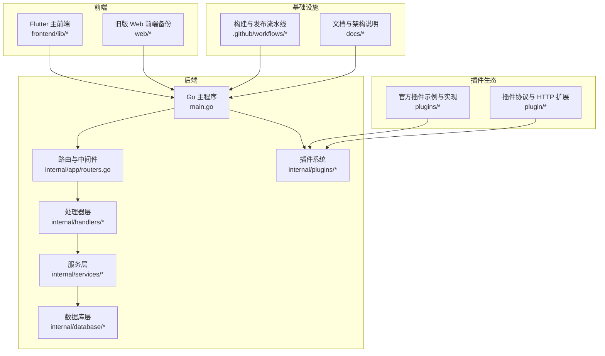
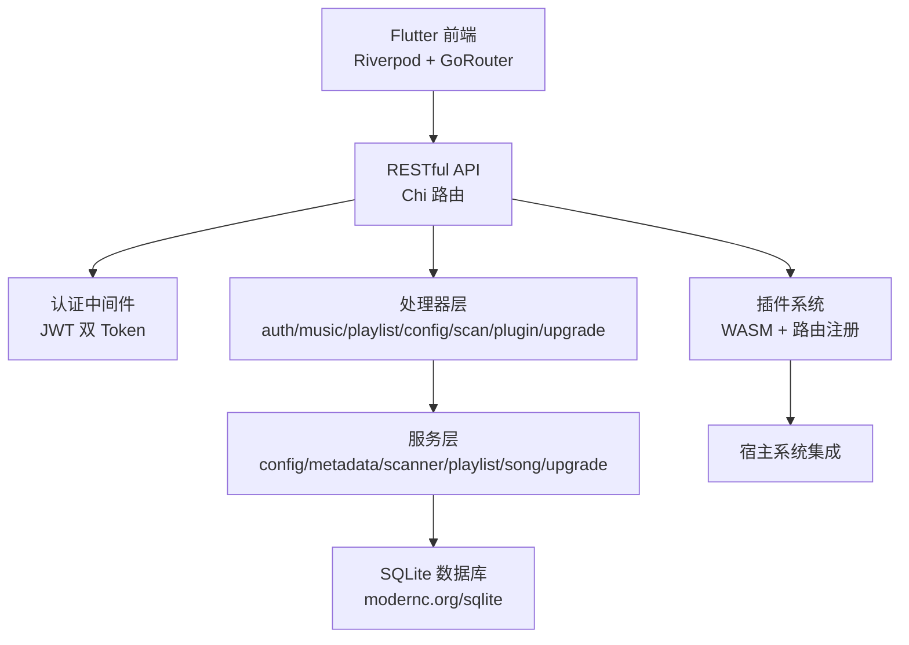
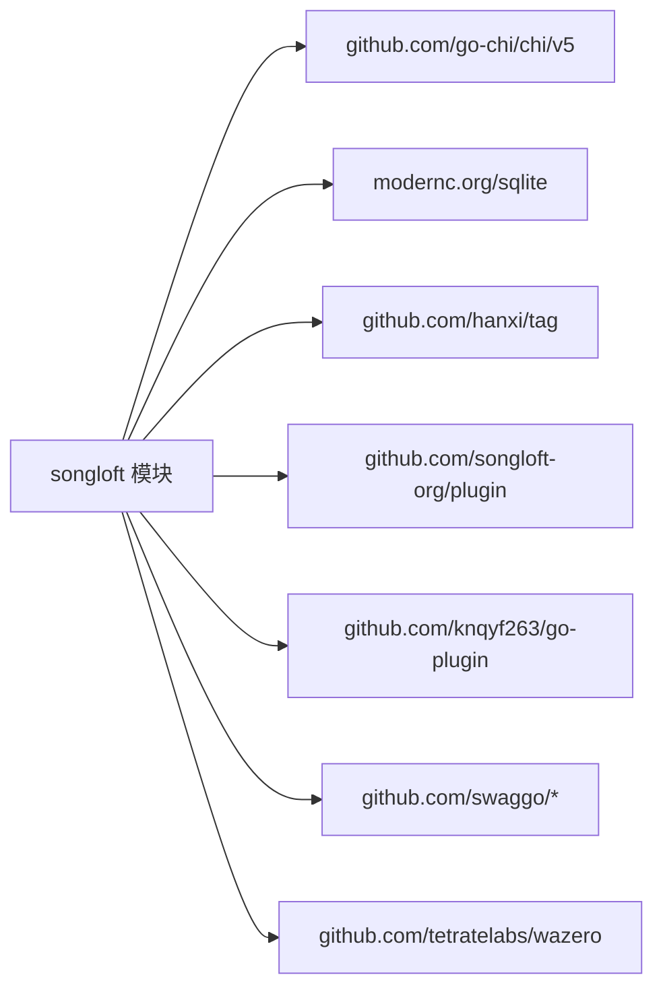
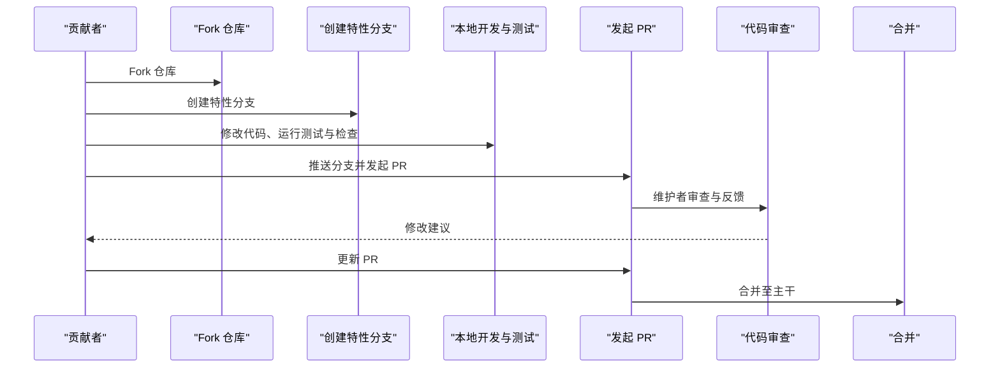
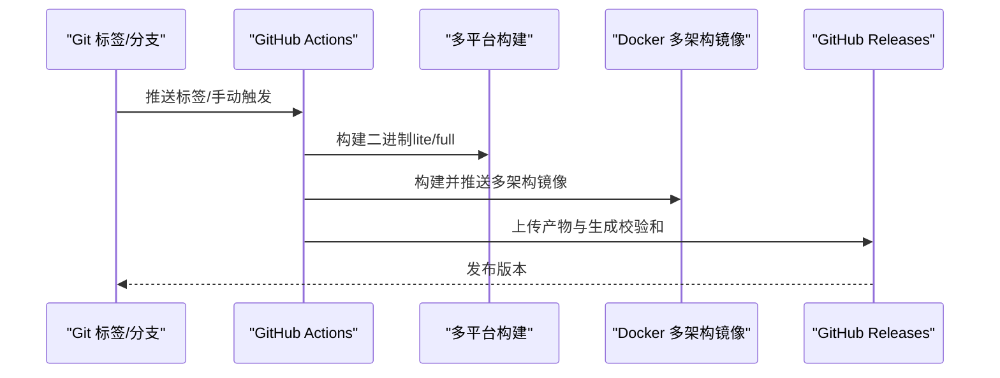

# 社区与贡献

<cite>
**本文引用的文件**
- [README.md](file://README.md)
- [quick-start.md](file://docs/quick-start.md)
- [architecture.md](file://docs/architecture.md)
- [js-plugin-development-guide.md](file://docs/js-plugin-development-guide.md)
- [.github/workflows/lint.yml](file://.github/workflows/lint.yml)
- [.github/workflows/test.yml](file://.github/workflows/test.yml)
- [.github/workflows/release.yml](file://.github/workflows/release.yml)
- [go.mod](file://go.mod)
- [CHANGELOG.md](file://CHANGELOG.md)
- [todo.md](file://todo.md)
</cite>

## 目录
1. [简介](#简介)
2. [项目结构](#项目结构)
3. [核心组件](#核心组件)
4. [架构总览](#架构总览)
5. [详细组件分析](#详细组件分析)
6. [依赖分析](#依赖分析)
7. [性能考虑](#性能考虑)
8. [故障排查指南](#故障排查指南)
9. [结论](#结论)
10. [附录](#附录)

## 简介
本指南面向希望参与 Songloft 项目的开发者与用户，系统阐述贡献流程（代码贡献、文档贡献、问题报告与功能请求）、社区资源（讨论区、问题跟踪、版本发布与社区插件）、治理结构与决策流程、社区规范、新贡献者入门、开发环境设置、首次贡献建议、代码审查流程、社区活动与推广方式，以及许可证与法律声明、知识产权注意事项。内容基于仓库内现有文档与工作流进行整理，确保可操作与可追溯。

## 项目结构
Songloft 采用前后端分离架构，后端为 Go + Chi，前端包含 Flutter 主前端与旧版 Web 前端；同时提供插件体系与多平台构建发布流水线。整体结构与关键模块如下：

图表来源
- [architecture.md](file://docs/architecture.md)
- [README.md](file://README.md)

章节来源
- [architecture.md](file://docs/architecture.md)
- [README.md](file://README.md)

## 核心组件
- 后端核心：基于 Chi 路由、JWT 认证、SQLite 存储、WASM 插件系统，提供 RESTful API。
- 前端核心：Flutter 跨平台前端为主，支持 Web/移动端/桌面端；旧版 Web 前端为历史备份。
- 插件体系：基于 WebAssembly 的插件协议与 HTTP 扩展，支持路由注册、静态资源托管、定时器与生命周期管理。
- 质量与发布：通过 GitHub Actions 实现代码质量检查、测试矩阵、多平台二进制与 Docker 多架构镜像构建、发布归档与校验和生成。

章节来源
- [architecture.md](file://docs/architecture.md)
- [js-plugin-development-guide.md](file://docs/js-plugin-development-guide.md)
- [.github/workflows/lint.yml](file://.github/workflows/lint.yml)
- [.github/workflows/test.yml](file://.github/workflows/test.yml)
- [.github/workflows/release.yml](file://.github/workflows/release.yml)

## 架构总览
后端采用“处理器 -> 服务 -> 数据库”的分层设计，配合中间件与插件系统实现扩展能力；前端通过同域嵌入模式与后端交互，提供一致的用户体验。

图表来源
- [architecture.md](file://docs/architecture.md)

章节来源
- [architecture.md](file://docs/architecture.md)

## 详细组件分析

### 贡献流程（代码/文档/问题/功能）
- 代码贡献
  - Fork 仓库，创建特性分支，运行代码检查与测试，提交并发起 PR。
  - 参考贡献指南步骤与 Makefile 常用命令，确保格式化、vet、lint、测试通过。
- 文档贡献
  - 文档位于 docs/ 目录，遵循既有文档风格与结构；更新后可直接提交 PR。
- 问题报告
  - 使用 Issues 模板（如适用）描述复现步骤、期望行为、实际行为与环境信息。
- 功能请求
  - 在 Issues 中提出，说明背景、使用场景与预期收益，维护者将评估并纳入路线图。

章节来源
- [README.md](file://README.md)

### 社区资源
- 讨论与支持
  - GitHub Issues：问题反馈与技术支持。
  - 微信群/QQ 群：交流与答疑。
- 问题跟踪
  - 使用 GitHub Issues 进行问题分类与跟踪。
- 版本发布
  - GitHub Releases：发布二进制、Docker 镜像与校验和。
- 社区插件
  - 官方插件示例与实现位于 plugins/，插件协议位于 plugin/ 与 songloft-plugin/。

章节来源
- [quick-start.md](file://docs/quick-start.md)
- [CHANGELOG.md](file://CHANGELOG.md)

### 治理结构与决策流程
- 仓库治理
  - 采用 GitHub 管理，通过 PR 与审核流程推进变更。
  - 质量门禁：代码质量检查、测试矩阵、覆盖率上报。
- 决策流程
  - 重大变更建议在 Issues 中讨论，形成共识后再实施。
  - 发布由 CI 自动化完成，版本号与发布类型由标签或分支触发。

章节来源
- [.github/workflows/lint.yml](file://.github/workflows/lint.yml)
- [.github/workflows/test.yml](file://.github/workflows/test.yml)
- [.github/workflows/release.yml](file://.github/workflows/release.yml)

### 社区规范
- 代码规范
  - gofmt 格式化、go vet、golangci-lint 检查。
  - 单元测试与集成测试覆盖。
- 行为规范
  - 尊重他人、保持友善与专业，遵守开源社区礼仪。
  - 遵守许可证条款，尊重知识产权。

章节来源
- [.github/workflows/lint.yml](file://.github/workflows/lint.yml)
- [.github/workflows/test.yml](file://.github/workflows/test.yml)

### 新贡献者入门
- 开发环境设置
  - Go 1.26+、FFmpeg（可选，用于精确音频参数）、SQLite（内置）。
  - Makefile 提供常用命令：构建、测试、运行、Swagger 文档生成。
- 第一次贡献建议
  - 从文档完善、小 bug 修复入手，逐步熟悉项目结构与工作流。
  - 阅读架构文档与插件开发指南，理解前后端交互与插件机制。
- 代码审查流程
  - 提交 PR 后，维护者将进行代码审查与测试验证，按反馈修改直至合并。

章节来源
- [README.md](file://README.md)
- [architecture.md](file://docs/architecture.md)
- [js-plugin-development-guide.md](file://docs/js-plugin-development-guide.md)

### 参与社区活动与推广
- 分享使用经验：在 Issues 或讨论渠道分享使用技巧与反馈。
- 推广项目：Star 项目、转发给有需要的朋友、撰写使用文章。
- 贡献插件：基于官方插件协议开发扩展，提升生态丰富度。

章节来源
- [quick-start.md](file://docs/quick-start.md)

### 许可证与法律声明
- 许可证
  - 本项目采用 MIT 许可证，详见 LICENSE 文件。
- 法律声明
  - 使用本项目时，请遵守相关法律法规与许可证条款。
- 知识产权
  - 项目依赖的第三方组件（如 hanxi/tag、sqlite 等）各自具有相应许可，请在使用时遵循其许可条款。

章节来源
- [README.md](file://README.md)
- [go.mod](file://go.mod)

## 依赖分析
- 核心依赖
  - 路由：github.com/go-chi/chi/v5
  - 数据库：modernc.org/sqlite（纯 Go 实现）
  - 元数据提取：github.com/hanxi/tag（fork，增强编码检测）
  - 插件与 WASM：github.com/knqyf263/go-plugin、github.com/songloft-org/plugin、github.com/tetratelabs/wazero
  - Swagger：github.com/swaggo/http-swagger、github.com/swaggo/swag
- 外部工具
  - ffprobe（可选，用于精确音频参数）

图表来源
- [go.mod](file://go.mod)

章节来源
- [go.mod](file://go.mod)

## 性能考虑
- 插件系统采用 WASM，具备实例隔离与路由注册能力，适合扩展但需避免阻塞与滥用定时器。
- 前端与后端同域部署，减少跨域与网络开销；静态资源通过嵌入与 SPA 回退策略优化加载。
- 数据库层使用接口抽象，便于测试与替换；SQLite 纯 Go 实现，部署简单且性能稳定。

章节来源
- [architecture.md](file://docs/architecture.md)

## 故障排查指南
- 常见问题定位
  - 使用 Makefile 的测试与检查命令快速定位问题。
  - 查看 Swagger 文档与 API 列表，确认接口与认证流程。
- 版本与发布
  - 使用版本检查命令或 API 获取当前版本信息。
  - 校验下载文件的完整性，使用 checksums.txt 进行验证。
- 插件问题
  - 遵循插件开发规范，确保构建参数与路由前缀正确。
  - 使用日志记录与错误上下文，便于定位问题。

章节来源
- [README.md](file://README.md)
- [quick-start.md](file://docs/quick-start.md)
- [js-plugin-development-guide.md](file://docs/js-plugin-development-guide.md)

## 结论
Songloft 项目通过清晰的架构、完善的质量门禁与发布流水线、开放的社区协作机制，为贡献者提供了高效、可追溯的参与路径。建议新贡献者从文档与小改动入手，逐步深入理解插件体系与前后端交互，共同推动项目演进。

## 附录

### 贡献流程时序图（代码贡献）

图表来源
- [README.md](file://README.md)
- [.github/workflows/lint.yml](file://.github/workflows/lint.yml)
- [.github/workflows/test.yml](file://.github/workflows/test.yml)

### 发布流程时序图（CI 自动化）

图表来源
- [.github/workflows/release.yml](file://.github/workflows/release.yml)