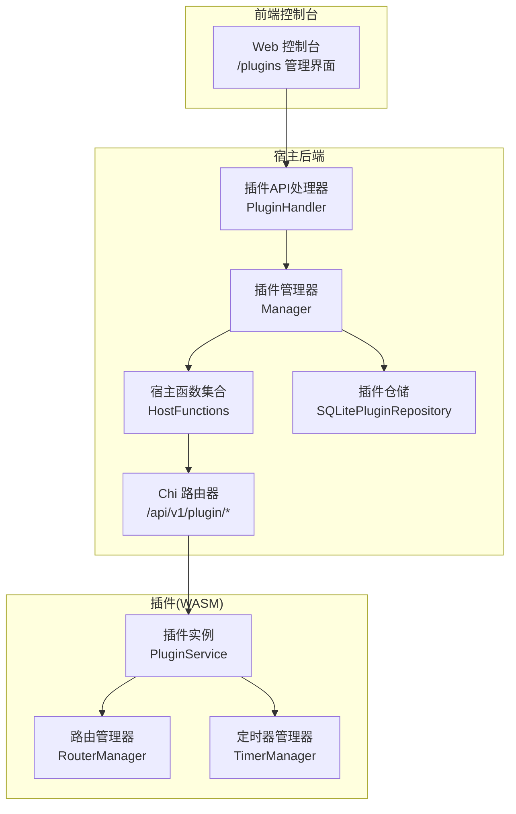
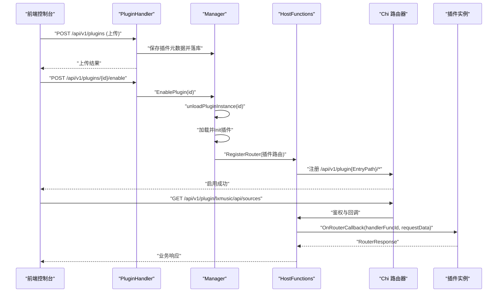
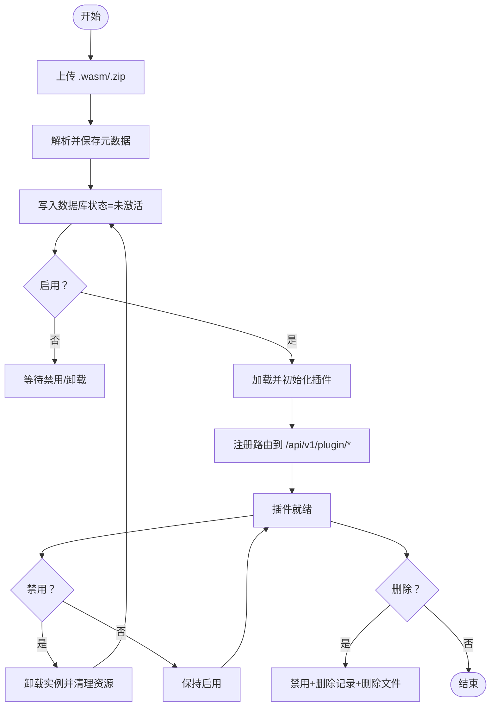
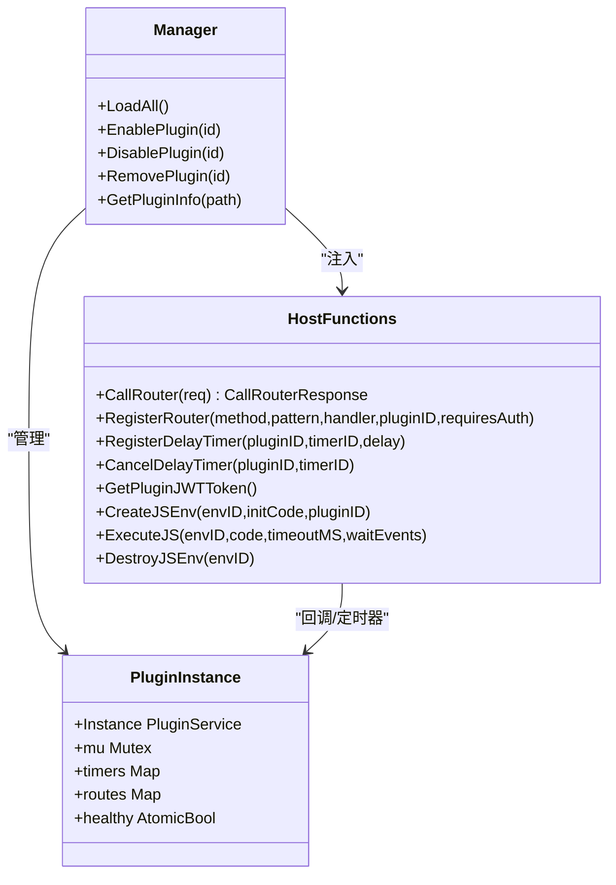
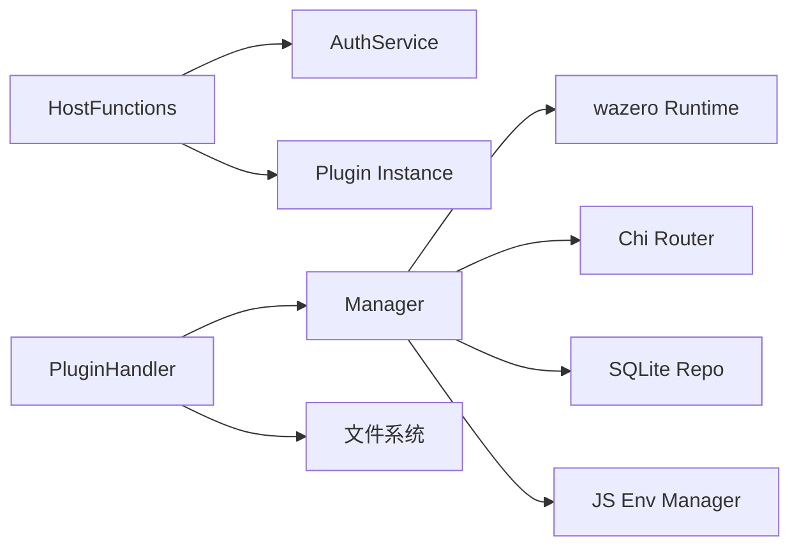

# 扩展性设计

<cite>
**本文引用的文件**
- [README.md](file://README.md)
- [docs/js-plugin-development-guide.md](file://docs/js-plugin-development-guide.md)
- [internal/plugins/host.go](file://internal/plugins/host.go)
- [internal/plugins/manager.go](file://internal/plugins/manager.go)
- [internal/plugins/plugin.go](file://internal/plugins/plugin.go)
- [internal/plugins/repository.go](file://internal/plugins/repository.go)
- [internal/handlers/plugin.go](file://internal/handlers/plugin.go)
- [internal/app/router_dev.go](file://internal/app/router_dev.go)
- [internal/app/router_prod.go](file://internal/app/router_prod.go)
- [plugins/songloft-plugin-lxmusic/main.go](file://plugins/songloft-plugin-lxmusic/main.go)
</cite>

## 目录
1. [简介](#简介)
2. [项目结构](#项目结构)
3. [核心组件](#核心组件)
4. [架构总览](#架构总览)
5. [详细组件分析](#详细组件分析)
6. [依赖分析](#依赖分析)
7. [性能考虑](#性能考虑)
8. [故障排查指南](#故障排查指南)
9. [结论](#结论)
10. [附录](#附录)

## 简介
本设计文档聚焦 Songloft 的扩展性架构，围绕“插件系统”“API 接口扩展机制”“模块化设计原则”展开，系统阐述插件生命周期管理（上传、安装、启用、禁用、卸载）、插件与宿主系统的集成方式（主机函数调用、路由注册机制）、最小化改动原则与最佳实践、扩展点识别与设计模式应用、向后兼容性与版本管理策略，并提供可落地的扩展示例与实现指南。

## 项目结构
Songloft 采用分层与模块化结合的组织方式：
- 宿主侧（Go 后端）：插件管理器、插件宿主函数、路由与中间件、业务服务与数据库层、API 处理器。
- 插件侧（WASM）：遵循统一的生命周期与路由注册规范，通过宿主提供的主机函数与宿主通信。
- 前端侧（Web 控制台）：提供插件上传、启用/禁用、列表管理等操作入口；Swagger 文档在开发环境可用。

图表来源
- [internal/plugins/manager.go:34-44](file://internal/plugins/manager.go#L34-L44)
- [internal/plugins/host.go:23-30](file://internal/plugins/host.go#L23-L30)
- [internal/handlers/plugin.go:21-33](file://internal/handlers/plugin.go#L21-L33)

章节来源
- [README.md:250-353](file://README.md#L250-L353)
- [internal/app/router_dev.go:13-18](file://internal/app/router_dev.go#L13-L18)
- [internal/app/router_prod.go:6-9](file://internal/app/router_prod.go#L6-L9)

## 核心组件
- 插件管理器（Manager）：负责插件加载、初始化、路由注册、定时器调度、实例健康状态管理、启用/禁用/卸载与资源清理。
- 宿主函数（HostFunctions）：向插件暴露主机能力（路由调用、注册路由、定时器、JS 环境、插件专用 JWT Token 等），并实现路由鉴权与回调转发。
- 插件仓储（Repository）：基于 SQLite 的插件元数据持久化，支持 CRUD 与状态更新。
- 插件处理器（PluginHandler）：对外提供 REST API，实现插件上传（单文件与 ZIP 批量）、删除、启用/禁用、查询等。
- 插件示例（songloft-plugin-lxmusic）：展示插件生命周期、路由注册、静态资源托管、定时器使用与业务处理器集成。

章节来源
- [internal/plugins/manager.go:34-44](file://internal/plugins/manager.go#L34-L44)
- [internal/plugins/host.go:23-30](file://internal/plugins/host.go#L23-L30)
- [internal/plugins/repository.go:10-18](file://internal/plugins/repository.go#L10-L18)
- [internal/handlers/plugin.go:21-33](file://internal/handlers/plugin.go#L21-L33)
- [plugins/songloft-plugin-lxmusic/main.go:28-46](file://plugins/songloft-plugin-lxmusic/main.go#L28-L46)

## 架构总览
插件系统采用“WASM 插件 + 宿主管理”的架构：
- 插件以 .wasm 形式存在，宿主通过 wazero 加载并在 WASI 环境中运行。
- 插件通过路由管理器向宿主注册路由，宿主将这些路由统一挂载到 /api/v1/plugin/{plugin_entry_path} 前缀下。
- 插件可通过宿主函数发起对宿主内部路由的调用，实现跨模块协作。
- 插件可注册延迟定时器，实现后台任务调度。
- 插件可创建/销毁 JS 运行时环境，实现前端交互与宿主的 JS 互操作。

图表来源
- [internal/handlers/plugin.go:104-134](file://internal/handlers/plugin.go#L104-L134)
- [internal/plugins/manager.go:488-511](file://internal/plugins/manager.go#L488-L511)
- [internal/plugins/host.go:156-197](file://internal/plugins/host.go#L156-L197)

## 详细组件分析

### 插件生命周期管理
- 上传：支持 .wasm 与 .zip（批量）上传，ZIP 内自动递归查找 .wasm 并导入。
- 安装：从插件文件读取元数据（名称、版本、入口路径等），写入数据库，状态初始为未激活。
- 启用：卸载旧实例（若存在），更新状态为激活，加载并初始化插件，注册路由，注入插件专用 JWT Token。
- 禁用：更新状态为未激活，卸载实例，清理路由与 JS 环境。
- 卸载：禁用 + 删除数据库记录 + 删除磁盘文件。
- 反初始化：在健康实例上执行插件 Deinit，释放资源；不健康实例跳过。

图表来源
- [internal/handlers/plugin.go:104-134](file://internal/handlers/plugin.go#L104-L134)
- [internal/plugins/manager.go:367-451](file://internal/plugins/manager.go#L367-L451)
- [internal/plugins/manager.go:488-539](file://internal/plugins/manager.go#L488-L539)

章节来源
- [internal/handlers/plugin.go:92-134](file://internal/handlers/plugin.go#L92-L134)
- [internal/plugins/manager.go:367-539](file://internal/plugins/manager.go#L367-L539)

### 宿主函数与路由集成
- 路由注册：插件通过路由管理器注册路由，宿主将其转换为 /api/v1/plugin{EntryPath}/* 并注入 Chi 路由器。
- 路由回调：宿主根据路由键与鉴权标志，执行认证校验后调用插件 OnRouterCallback，插件返回 RouterResponse。
- 路由调用：插件通过 CallRouter 发起对宿主内部路由的 HTTP 调用，自动附加插件专用 JWT Token。
- 鉴权策略：若路由声明 requireAuth=true，则从 Authorization 头或 URL 查询参数 access_token 校验 JWT。
- 定时器：插件注册延迟定时器，宿主在超时上下文中触发 OnTimerCallback，并在触发后移除定时器。
- JS 环境：插件可创建/销毁 JS 环境，执行代码或等待事件，实现前端交互。

图表来源
- [internal/plugins/host.go:23-30](file://internal/plugins/host.go#L23-L30)
- [internal/plugins/manager.go:34-44](file://internal/plugins/manager.go#L34-L44)
- [internal/plugins/manager.go:63-71](file://internal/plugins/manager.go#L63-L71)

章节来源
- [internal/plugins/host.go:156-310](file://internal/plugins/host.go#L156-L310)
- [internal/plugins/host.go:361-439](file://internal/plugins/host.go#L361-L439)
- [internal/plugins/host.go:441-559](file://internal/plugins/host.go#L441-L559)

### 插件与宿主的集成方式
- 路由注册机制：插件在 Init 中调用路由管理器注册路由，宿主将 EntryPath 与 /api/v1/plugin 前缀组合，形成最终路由。
- 主机函数调用：插件通过 CallRouter 对宿主内部路由发起请求，自动携带插件专用 JWT Token，便于内部鉴权。
- 静态资源托管：插件可使用 StaticHandler 自动注册 static 目录下全部静态资源，前端访问需使用 /api/v1/plugin/{plugin_name}/static/... 路径。
- 定时器与后台任务：插件使用 RegisterDelayTimer 实现后台任务，宿主在超时上下文中触发回调。
- JS 互操作：插件通过 CreateJSEnv/ExecuteJS/DestroyJSEnv 管理 JS 环境，实现前端交互与宿主的 JS 通信。

章节来源
- [docs/js-plugin-development-guide.md:37-67](file://docs/js-plugin-development-guide.md#L37-L67)
- [docs/js-plugin-development-guide.md:281-347](file://docs/js-plugin-development-guide.md#L281-L347)
- [docs/js-plugin-development-guide.md:349-386](file://docs/js-plugin-development-guide.md#L349-L386)
- [docs/js-plugin-development-guide.md:438-491](file://docs/js-plugin-development-guide.md#L438-L491)
- [plugins/songloft-plugin-lxmusic/main.go:63-141](file://plugins/songloft-plugin-lxmusic/main.go#L63-L141)

### API 接口扩展机制
- 插件管理 API：提供 /api/v1/plugins 的上传、查询、删除、启用/禁用等接口，前端控制台通过这些接口管理插件。
- Swagger 文档：开发环境启用 Swagger UI，生产环境禁用，避免包体膨胀与安全风险。
- 路由前缀：插件路由统一挂载在 /api/v1/plugin/{plugin_entry_path} 下，避免冲突并保持清晰的命名空间。

章节来源
- [README.md:338-345](file://README.md#L338-L345)
- [internal/handlers/plugin.go:35-90](file://internal/handlers/plugin.go#L35-L90)
- [internal/app/router_dev.go:13-18](file://internal/app/router_dev.go#L13-L18)
- [internal/app/router_prod.go:6-9](file://internal/app/router_prod.go#L6-L9)

### 最小化改动原则与最佳实践
- 最小化改动：新增功能尽量通过插件扩展，不修改宿主核心代码；插件内部通过路由管理器注册新路由，不侵入宿主路由表。
- 生命周期一致性：严格遵循 init → Init → 处理请求 → Deinit 的生命周期，确保资源正确释放。
- 路由命名规范：使用小写与连字符，以插件 EntryPath 为前缀，RESTful 风格设计。
- 认证策略：静态资源与公开页面 requireAuth=false，API 接口通常 requireAuth=true。
- 错误处理：插件返回 RouterResponse 时，统一设置状态码与 Content-Type，便于前端处理。
- 并发与性能：WASM 环境单线程，避免 goroutine，使用定时器替代后台任务；合理设置超时，防止阻塞。

章节来源
- [docs/js-plugin-development-guide.md:281-347](file://docs/js-plugin-development-guide.md#L281-L347)
- [docs/js-plugin-development-guide.md:349-386](file://docs/js-plugin-development-guide.md#L349-L386)
- [docs/js-plugin-development-guide.md:585-613](file://docs/js-plugin-development-guide.md#L585-L613)

### 扩展点识别与设计模式
- 扩展点
  - 插件生命周期扩展点：Init/Deinit、路由注册、定时器注册。
  - 宿主函数扩展点：CallRouter、RegisterRouter、RegisterDelayTimer、JS 环境管理。
  - 数据持久化扩展点：插件元数据存储于 SQLite，支持 CRUD 与状态更新。
- 设计模式
  - 管理器模式：Manager 统一管理插件生命周期与实例状态。
  - 仓储模式：Repository 封装插件元数据的持久化细节。
  - 路由适配器：HostFunctions 将插件路由适配到宿主路由器，统一鉴权与回调。
  - 超时与中断：wazero 的 CloseOnContextDone 与自定义 isWASMTimeout 检测，保障稳定性。

章节来源
- [internal/plugins/manager.go:34-44](file://internal/plugins/manager.go#L34-L44)
- [internal/plugins/repository.go:10-18](file://internal/plugins/repository.go#L10-L18)
- [internal/plugins/host.go:156-310](file://internal/plugins/host.go#L156-L310)
- [internal/plugins/host.go:561-582](file://internal/plugins/host.go#L561-L582)

### 向后兼容性与版本管理
- 语义化版本：遵循 MAJOR.MINOR.PATCH，破坏性变更提升主版本号。
- 插件版本：插件在 GetPluginInfo 中返回 Version，宿主在同步与导入时更新数据库记录。
- 构建参数：WASM 构建必须使用 -buildmode=c-shared，否则运行时会失败。
- 升级策略：插件更新版本后重新构建上传，宿主自动替换旧版本并重新加载。

章节来源
- [docs/js-plugin-development-guide.md:660-700](file://docs/js-plugin-development-guide.md#L660-L700)
- [internal/plugins/manager.go:191-213](file://internal/plugins/manager.go#L191-L213)

### 扩展示例与实现指南
- 示例插件：songloft-plugin-lxmusic 展示了音源管理、搜索导入、播放 URL 获取、静态资源托管与定时器使用。
- 实现步骤
  - 定义插件元数据：在 GetPluginInfo 返回名称、版本、描述、作者、主页与 EntryPath。
  - 初始化：在 Init 中初始化业务组件、处理器与静态资源，注册路由。
  - 处理器：实现 HTTP 处理函数，返回 RouterResponse。
  - 清理：在 Deinit 中释放资源。
  - 上传与启用：通过前端控制台上传 .wasm 或 .zip，启用后即可访问插件路由。

章节来源
- [plugins/songloft-plugin-lxmusic/main.go:48-141](file://plugins/songloft-plugin-lxmusic/main.go#L48-L141)
- [docs/js-plugin-development-guide.md:171-279](file://docs/js-plugin-development-guide.md#L171-L279)

## 依赖分析
- 插件管理器依赖
  - wazero 运行时与 WASI 预览版导入，注入 HTTP Library。
  - Chi 路由器，统一挂载插件路由。
  - SQLite 仓储，持久化插件元数据。
  - JS 运行时管理器，提供 JS 环境。
- 插件处理器依赖
  - 插件管理器，提供上传、启用/禁用、删除等操作。
  - 文件系统，处理 .wasm 与 .zip 上传与解压。
- 宿主函数依赖
  - AuthService，生成插件专用 JWT Token。
  - 插件实例，回调插件 OnRouterCallback/OnTimerCallback。

图表来源
- [internal/plugins/manager.go:137-189](file://internal/plugins/manager.go#L137-L189)
- [internal/plugins/host.go:23-30](file://internal/plugins/host.go#L23-L30)
- [internal/handlers/plugin.go:21-33](file://internal/handlers/plugin.go#L21-L33)

章节来源
- [internal/plugins/manager.go:137-189](file://internal/plugins/manager.go#L137-L189)
- [internal/plugins/host.go:47-61](file://internal/plugins/host.go#L47-L61)
- [internal/handlers/plugin.go:104-134](file://internal/handlers/plugin.go#L104-L134)

## 性能考虑
- 超时控制：插件初始化、回调、反初始化、关闭均设置超时，防止阻塞与资源泄露。
- WASM 并发保护：通过互斥锁保护插件实例，避免并发访问导致栈溢出。
- 路由鉴权：鉴权失败快速返回，减少无效调用。
- JS 事件等待：ExecuteJS 支持等待事件，避免轮询带来的 CPU 占用。
- 静态资源：StaticHandler 自动注册，减少重复路由配置与维护成本。

章节来源
- [internal/plugins/manager.go:26-32](file://internal/plugins/manager.go#L26-L32)
- [internal/plugins/host.go:284-296](file://internal/plugins/host.go#L284-L296)
- [internal/plugins/host.go:490-532](file://internal/plugins/host.go#L490-L532)

## 故障排查指南
- 插件初始化失败：检查构建参数是否为 -buildmode=c-shared；确认 Init 中资源初始化顺序与错误处理。
- 路由 401 未认证：确认路由 requireAuth 标志，检查前端请求是否携带 Bearer Token 或 URL 查询参数 access_token。
- CallRouter 失败：检查宿主端口配置与路由前缀，确认插件专用 JWT Token 是否有效。
- 定时器未触发：确认 RegisterDelayTimer 的 timerID 与 delay 毫秒值，检查宿主回调上下文超时。
- JS 环境异常：确认 CreateJSEnv/ExecuteJS/DestroyJSEnv 的调用顺序与环境 ID，避免重复创建或遗漏销毁。

章节来源
- [docs/js-plugin-development-guide.md:25-35](file://docs/js-plugin-development-guide.md#L25-L35)
- [internal/plugins/host.go:40-138](file://internal/plugins/host.go#L40-L138)
- [internal/plugins/host.go:361-439](file://internal/plugins/host.go#L361-L439)
- [internal/plugins/host.go:488-559](file://internal/plugins/host.go#L488-L559)

## 结论
Songloft 的扩展性设计以“WASM 插件 + 宿主管理”为核心，通过标准化的生命周期、路由注册与主机函数调用，实现了高内聚、低耦合的模块化扩展。依托 SQLite 仓储与 Chi 路由器，插件可在不侵入宿主核心的前提下实现功能扩展；通过 Swagger 文档与前端控制台，开发者可以高效地完成插件的上传、启用与管理。配合最小化改动原则、设计模式与版本管理策略，Songloft 为持续演进与生态扩展提供了坚实基础。

## 附录
- 开发环境启用 Swagger UI：开发构建包含 Swagger，生产构建禁用。
- 插件上传格式：支持 .wasm 单文件与 .zip 压缩包（批量导入）。
- 路由前缀：插件路由统一挂载在 /api/v1/plugin/{plugin_entry_path} 下。

章节来源
- [internal/app/router_dev.go:13-18](file://internal/app/router_dev.go#L13-L18)
- [internal/app/router_prod.go:6-9](file://internal/app/router_prod.go#L6-L9)
- [internal/handlers/plugin.go:121-126](file://internal/handlers/plugin.go#L121-L126)