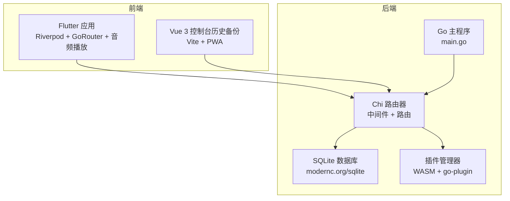
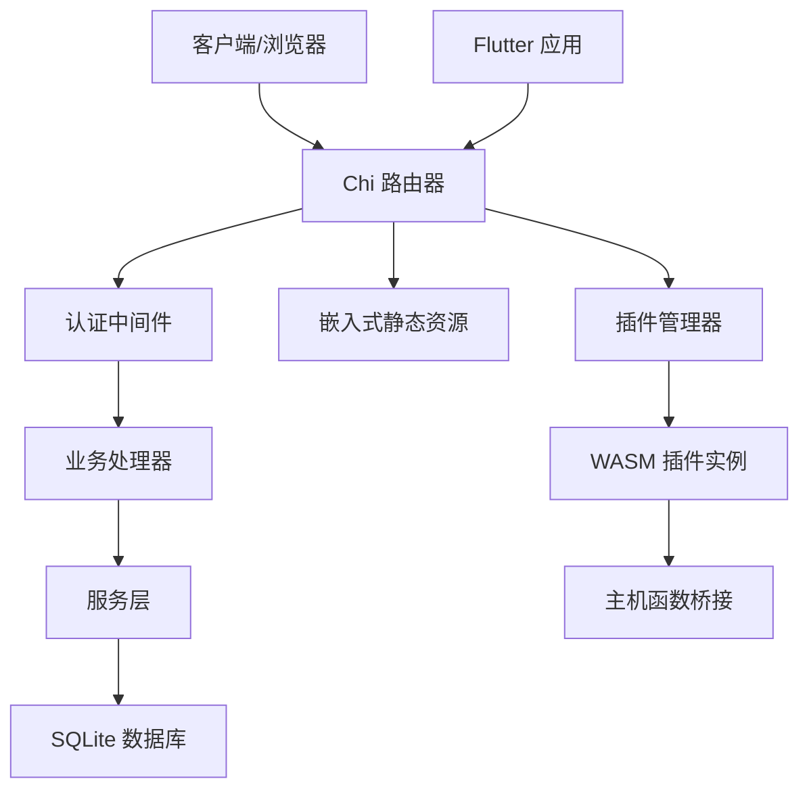
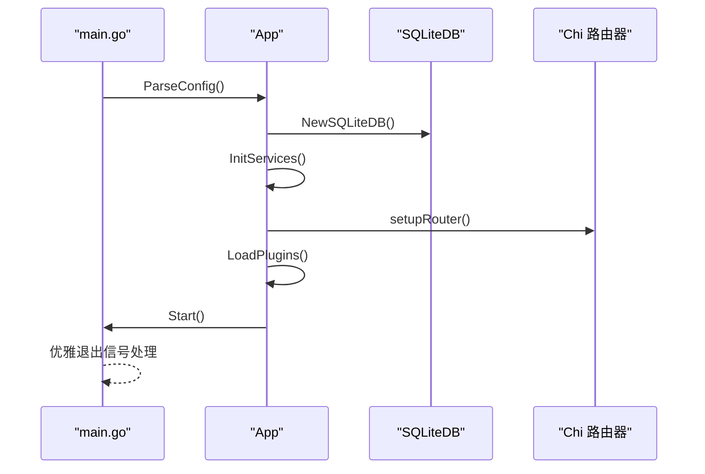
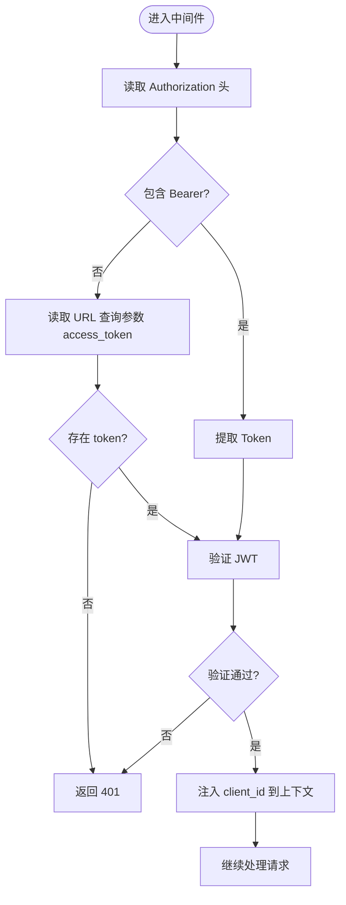
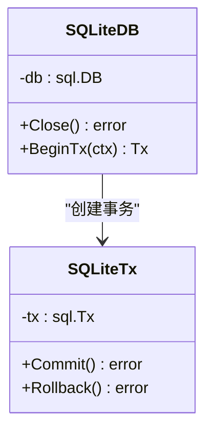
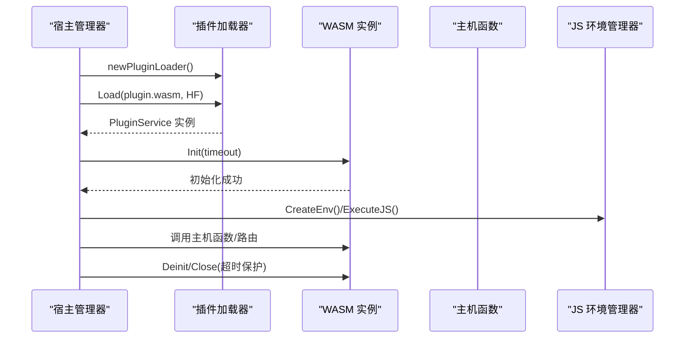
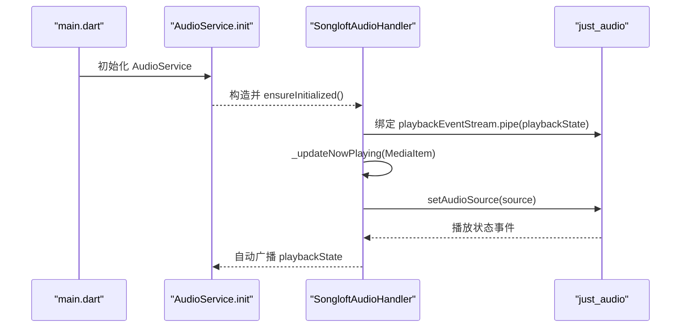
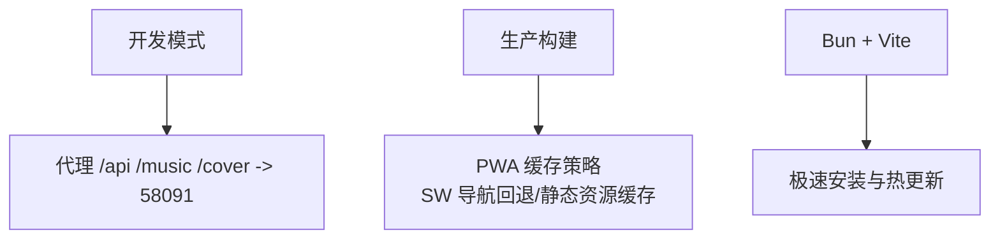
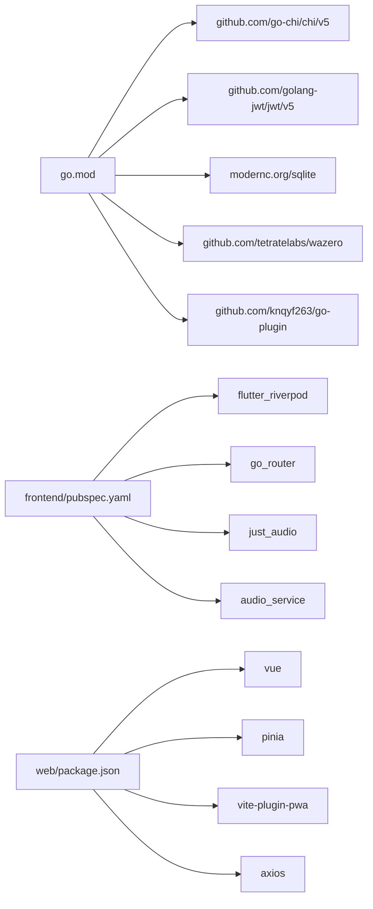

# 技术架构详解

<cite>
**本文档引用的文件**
- [main.go](file://main.go)
- [go.mod](file://go.mod)
- [internal/app/app.go](file://internal/app/app.go)
- [frontend/lib/main.dart](file://frontend/lib/main.dart)
- [web/vite.config.ts](file://web/vite.config.ts)
- [internal/middleware/auth.go](file://internal/middleware/auth.go)
- [internal/database/sqlite.go](file://internal/database/sqlite.go)
- [internal/plugins/manager.go](file://internal/plugins/manager.go)
- [frontend/pubspec.yaml](file://frontend/pubspec.yaml)
- [web/package.json](file://web/package.json)
- [internal/jsruntime/runtime.go](file://internal/jsruntime/runtime.go)
- [internal/services/auth_service.go](file://internal/services/auth_service.go)
- [web/src/main.ts](file://web/src/main.ts)
- [frontend/lib/core/audio/audio_service.dart](file://frontend/lib/core/audio/audio_service.dart)
- [docs/architecture.md](file://docs/architecture.md)
</cite>

## 目录
1. [简介](#简介)
2. [项目结构](#项目结构)
3. [核心组件](#核心组件)
4. [架构总览](#架构总览)
5. [详细组件分析](#详细组件分析)
6. [依赖关系分析](#依赖关系分析)
7. [性能考量](#性能考量)
8. [故障排查指南](#故障排查指南)
9. [结论](#结论)
10. [附录](#附录)

## 简介
本文件面向 Songloft 项目的开发者与运维人员，系统性梳理后端 Go + Chi + SQLite 技术栈、前端 Flutter + Riverpod + GoRouter + 音频播放技术、中间件模式与认证机制、现代化构建工具链（Bun + Vite）、以及插件系统（WebAssembly + go-plugin）的底层实现与设计权衡。文档以“代码级可视化”和“分层讲解”的方式呈现，既适合深入研究，也便于快速上手。

## 项目结构
Songloft 采用前后端分离架构，后端以 Go + Chi 为核心，数据库为 SQLite；前端以 Flutter 为主要跨平台入口，同时保留 Vue 3 Web 控制台作为历史备份。项目通过嵌入式静态资源与中间件模式实现“同域访问”，提升开发与部署效率。

图表来源
- [main.go:30-63](file://main.go#L30-L63)
- [internal/app/app.go:44-53](file://internal/app/app.go#L44-L53)
- [internal/middleware/auth.go:11-51](file://internal/middleware/auth.go#L11-L51)
- [internal/database/sqlite.go:22-53](file://internal/database/sqlite.go#L22-L53)
- [internal/plugins/manager.go:149-168](file://internal/plugins/manager.go#L149-L168)

章节来源
- [docs/architecture.md:13-37](file://docs/architecture.md#L13-L37)
- [main.go:30-63](file://main.go#L30-L63)
- [internal/app/app.go:64-227](file://internal/app/app.go#L64-L227)

## 核心组件
- 后端核心：Go 1.26 + Chi v5.2.4 + SQLite，提供 REST API、认证、插件系统与静态资源嵌入。
- 前端核心：Flutter 3.29+ + Dart 3.7+，Riverpod 状态管理 + GoRouter 路由 + just_audio + audio_service 音频播放。
- 构建工具链：Bun + Vite，提供极速安装与热更新体验。
- 插件系统：基于 WebAssembly（WASI）与 go-plugin，结合 wazero 运行时与进程内 QuickJS，实现沙箱化扩展。

章节来源
- [go.mod:3-21](file://go.mod#L3-L21)
- [frontend/pubspec.yaml:7-42](file://frontend/pubspec.yaml#L7-L42)
- [web/package.json:14-33](file://web/package.json#L14-L33)
- [internal/plugins/manager.go:149-168](file://internal/plugins/manager.go#L149-L168)

## 架构总览
后端通过 Chi 路由器聚合各 Handler，中间件负责认证与上下文注入；服务层封装业务逻辑，数据库层基于 SQLite（modernc.org/sqlite）。前端 Flutter 通过 Riverpod 管理状态，GoRouter 负责导航，音频播放由 just_audio + audio_service 驱动。插件系统以 WASM 形式运行，通过 go-plugin 与宿主交互，宿主提供 HTTP 库与主机函数桥接。

图表来源
- [internal/middleware/auth.go:11-51](file://internal/middleware/auth.go#L11-L51)
- [internal/app/app.go:206-219](file://internal/app/app.go#L206-L219)
- [internal/database/sqlite.go:22-53](file://internal/database/sqlite.go#L22-L53)
- [internal/plugins/manager.go:170-201](file://internal/plugins/manager.go#L170-L201)

## 详细组件分析

### 后端：应用启动与配置
- 启动流程：解析命令行与环境变量配置 → 初始化数据库与服务 → 设置路由 → 启动 HTTP 服务。
- 配置来源：命令行参数、环境变量（ADMIN_USERNAME/PASSWORD/LISTEN_PORT/DB_PATH），核心凭据优先命令行，其余配置存储于数据库 config 表。
- 优雅退出：监听系统信号，关闭应用资源。

图表来源
- [main.go:30-63](file://main.go#L30-L63)
- [internal/app/app.go:64-227](file://internal/app/app.go#L64-L227)
- [internal/database/sqlite.go:22-53](file://internal/database/sqlite.go#L22-L53)

章节来源
- [main.go:30-63](file://main.go#L30-L63)
- [internal/app/app.go:287-352](file://internal/app/app.go#L287-L352)

### 认证中间件与服务
- 中间件策略：优先从 Authorization 头解析 Bearer Token，若为空则回退到 URL 查询参数 access_token（适配图片/音频等无法自定义 Header 的场景）。
- 服务实现：JWT HS256 签名，支持 Access/Refresh 双 Token，内存缓存 + 数据库撤销检查，插件系统专用永久 Token（不入库）。
- 上下文注入：通过请求上下文注入 client_id，供下游使用。

图表来源
- [internal/middleware/auth.go:11-51](file://internal/middleware/auth.go#L11-L51)
- [internal/services/auth_service.go:326-371](file://internal/services/auth_service.go#L326-L371)

章节来源
- [internal/middleware/auth.go:11-51](file://internal/middleware/auth.go#L11-L51)
- [internal/services/auth_service.go:24-73](file://internal/services/auth_service.go#L24-L73)

### 数据库与存储
- 驱动：modernc.org/sqlite，纯 Go 实现，无 CGO 依赖。
- 连接优化：WAL 模式、busy_timeout、synchronous=NORMAL、cache_size、外键约束。
- 连接池：最大打开连接 10，空闲 5，最长存活 30 分钟。
- 迁移：为 playlists 表追加 cover_path 字段（兼容旧版本）。

图表来源
- [internal/database/sqlite.go:12-80](file://internal/database/sqlite.go#L12-L80)

章节来源
- [internal/database/sqlite.go:22-53](file://internal/database/sqlite.go#L22-L53)

### 插件系统（WebAssembly + go-plugin）
- 运行时：wazero + WASI Snapshot Preview1，启用 CloseOnContextDone 以支持超时中断。
- 加载器：pbplugin.NewPluginServicePlugin，注入 HTTP Library（go-plugin-http），统一插件生命周期。
- 管理器：支持插件目录扫描、元数据同步、实例加载/卸载、定时器与路由注册、JS 环境管理（进程内 QuickJS）。
- 安全与隔离：实例健康状态标记、超时保护、不健康实例跳过 Deinit、插件数据目录挂载为只读根文件系统。

图表来源
- [internal/plugins/manager.go:170-201](file://internal/plugins/manager.go#L170-L201)
- [internal/plugins/manager.go:441-463](file://internal/plugins/manager.go#L441-L463)
- [internal/jsruntime/runtime.go:71-126](file://internal/jsruntime/runtime.go#L71-L126)

章节来源
- [internal/plugins/manager.go:149-168](file://internal/plugins/manager.go#L149-L168)
- [internal/jsruntime/runtime.go:574-635](file://internal/jsruntime/runtime.go#L574-L635)

### 前端：Flutter 应用与音频播放
- 入口与全局配置：全局异常捕获、嵌入模式自动识别、Android 通知权限请求、AudioService 初始化降级保护。
- 音频播放：SongloftAudioHandler 基于 audio_service + just_audio，使用 .pipe() 直接绑定 playbackState，避免中间状态丢失；支持本地歌曲（通过 /music 路由 + access_token）与网络歌曲（代理 URL）。
- 状态与路由：ProviderScope 注入 AudioHandler，MaterialApp.router + GoRouter 路由配置。

图表来源
- [frontend/lib/main.dart:23-108](file://frontend/lib/main.dart#L23-L108)
- [frontend/lib/core/audio/audio_service.dart:16-110](file://frontend/lib/core/audio/audio_service.dart#L16-L110)
- [frontend/lib/core/audio/audio_service.dart:153-214](file://frontend/lib/core/audio/audio_service.dart#L153-L214)

章节来源
- [frontend/lib/main.dart:23-108](file://frontend/lib/main.dart#L23-L108)
- [frontend/lib/core/audio/audio_service.dart:16-110](file://frontend/lib/core/audio/audio_service.dart#L16-L110)

### 前端：Vue 3 控制台与构建工具链
- 构建工具：Vite + @vitejs/plugin-vue + @nuxt/ui + vite-plugin-pwa，支持 PWA、自动更新、导航回退与缓存策略。
- 代理配置：开发模式下将 /api、/music、/cover 代理至后端 58091 端口。
- 前端监控：Tracely SDK 初始化，全局挂载供拦截器使用。

图表来源
- [web/vite.config.ts:163-182](file://web/vite.config.ts#L163-L182)
- [web/vite.config.ts:11-99](file://web/vite.config.ts#L11-L99)
- [web/src/main.ts:30-41](file://web/src/main.ts#L30-L41)

章节来源
- [web/vite.config.ts:8-191](file://web/vite.config.ts#L8-L191)
- [web/package.json:14-33](file://web/package.json#L14-L33)

## 依赖关系分析
- 后端依赖：Chi v5.2.4、SQLite 驱动、JWT、go-plugin、wazero、Tracely SDK 等。
- 前端 Flutter 依赖：Riverpod、GoRouter、Dio、just_audio、audio_service、permission_handler、shared_preferences 等。
- 前端 Web 依赖：Vue 3、Pinia、@nuxt/ui、vite-plugin-pwa、axios、Tracely SDK 等。

图表来源
- [go.mod:5-21](file://go.mod#L5-L21)
- [frontend/pubspec.yaml:11-42](file://frontend/pubspec.yaml#L11-L42)
- [web/package.json:14-33](file://web/package.json#L14-L33)

章节来源
- [go.mod:3-58](file://go.mod#L3-L58)
- [frontend/pubspec.yaml:7-60](file://frontend/pubspec.yaml#L7-L60)
- [web/package.json:1-35](file://web/package.json#L1-L35)

## 性能考量
- 数据库性能：WAL 模式 + 适度连接池 + 外键约束，兼顾并发读写与一致性；Schema 初始化与迁移在连接建立时完成。
- 插件执行：wazero 启用 CloseOnContextDone，配合超时常量（Init/Callback/Deinit/Close）保障稳定性；实例健康状态与不健康跳过 Deinit，避免阻塞。
- 前端音频：audio_service 的 .pipe() 模式直接绑定 playbackState，减少中间状态丢失；just_audio 的 fire-and-forget 播放避免阻塞。
- 构建体验：Bun 安装速度远超 npm，Vite HMR 几乎即时，生产构建自动代码分割与 PWA 缓存策略优化首屏与离线体验。

## 故障排查指南
- 认证失败
  - 检查 Authorization 头或 URL 查询参数 access_token 是否正确传递。
  - 若为图片/音频资源，确认使用 access_token 查询参数。
  - 查看服务端日志与中间件返回的错误信息。
  
  章节来源
  - [internal/middleware/auth.go:17-30](file://internal/middleware/auth.go#L17-L30)

- 插件加载失败
  - 确认 .wasm 文件可读且符合 go-plugin 协议。
  - 查看初始化超时日志，必要时增大超时或优化插件初始化逻辑。
  - 检查插件目录权限与挂载的只读文件系统配置。
  
  章节来源
  - [internal/plugins/manager.go:441-463](file://internal/plugins/manager.go#L441-L463)
  - [internal/plugins/manager.go:170-201](file://internal/plugins/manager.go#L170-L201)

- 音频播放异常
  - 确认 AudioService 初始化成功，必要时启用降级路径。
  - 检查本地歌曲 URL 是否包含 access_token，网络歌曲是否通过代理 URL。
  - 关注 playbackState 与 processingState 流的日志，定位状态不一致问题。
  
  章节来源
  - [frontend/lib/main.dart:65-97](file://frontend/lib/main.dart#L65-L97)
  - [frontend/lib/core/audio/audio_service.dart:153-214](file://frontend/lib/core/audio/audio_service.dart#L153-L214)

- 数据库连接问题
  - 检查 DB_PATH 是否可写，目录是否存在。
  - 查看 SQLite 连接池配置与 WAL 模式参数是否生效。
  
  章节来源
  - [internal/database/sqlite.go:22-53](file://internal/database/sqlite.go#L22-L53)

## 结论
Songloft 的技术架构以“轻量化、可扩展、易维护”为目标：后端采用 Go + Chi + SQLite，结合中间件与服务层清晰分层；前端以 Flutter 为主，辅以 Vue 3 控制台，统一通过嵌入式静态资源与同域访问提升开发与部署效率；插件系统以 WASM + go-plugin 为基础，提供强隔离与生命周期管理。现代化构建工具链（Bun + Vite）进一步提升了开发体验与产物质量。整体设计在性能、安全性与可扩展性之间取得良好平衡。

## 附录
- 技术选型对比与权衡
  - Go vs Java/Node：Go 在并发与部署简洁性上更优，Chi 在路由与中间件生态成熟；SQLite 适合轻量场景，modernc.org/sqlite 无 CGO 降低部署复杂度。
  - Flutter vs React Native：统一代码库跨平台，Riverpod + GoRouter 提供现代状态与路由管理；音频播放采用 just_audio + audio_service，适配多平台通知栏控制。
  - Vite vs Webpack：Vite 的 HMR 与构建速度显著提升开发体验；PWA 缓存策略优化用户体验与离线能力。
  - 插件系统：WASM + go-plugin 提供强隔离与跨语言扩展能力；wazero + QuickJS 在进程内提供 JS 能力与主机函数桥接。