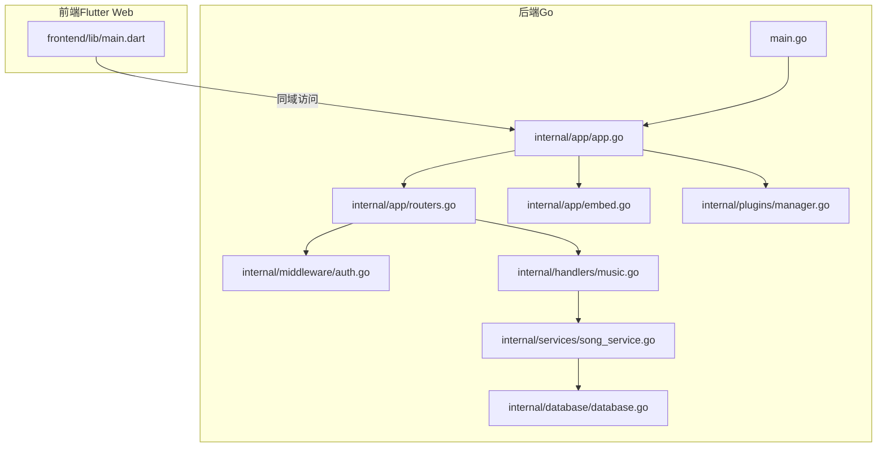
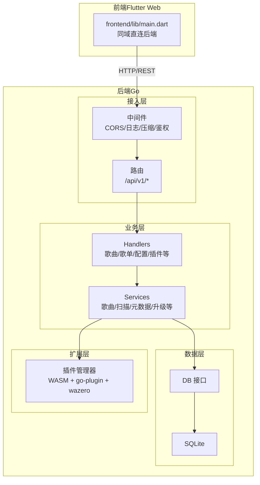
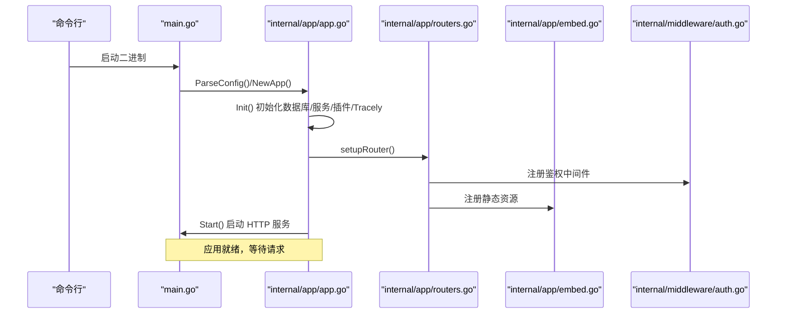
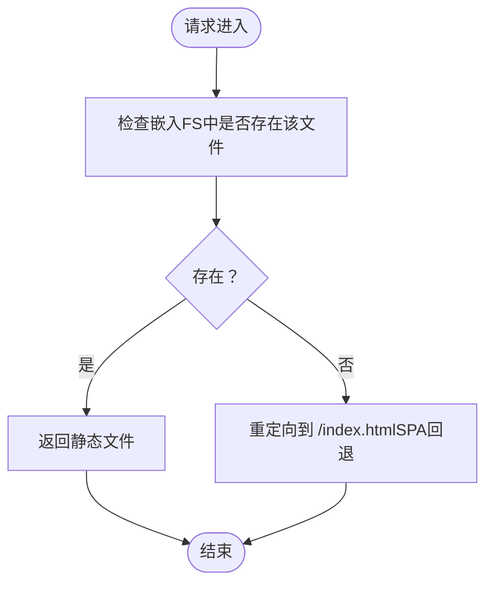
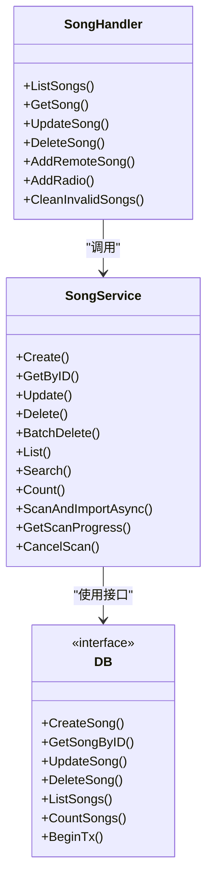
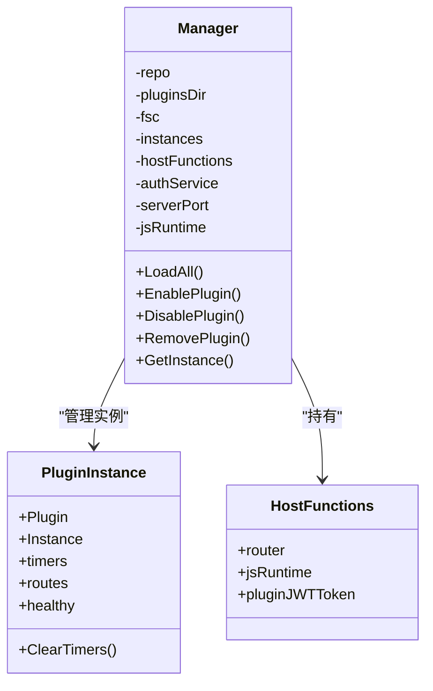
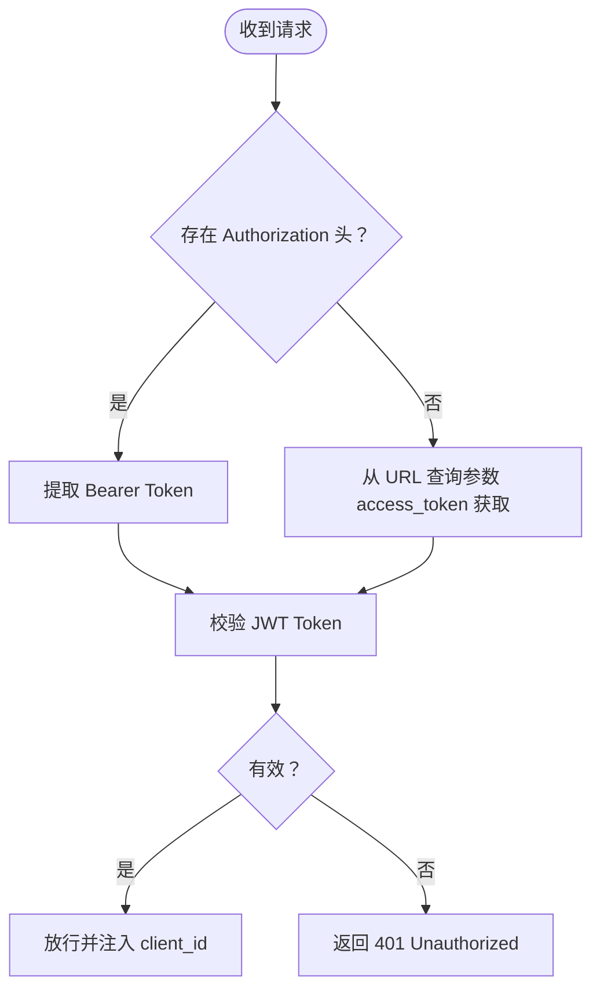
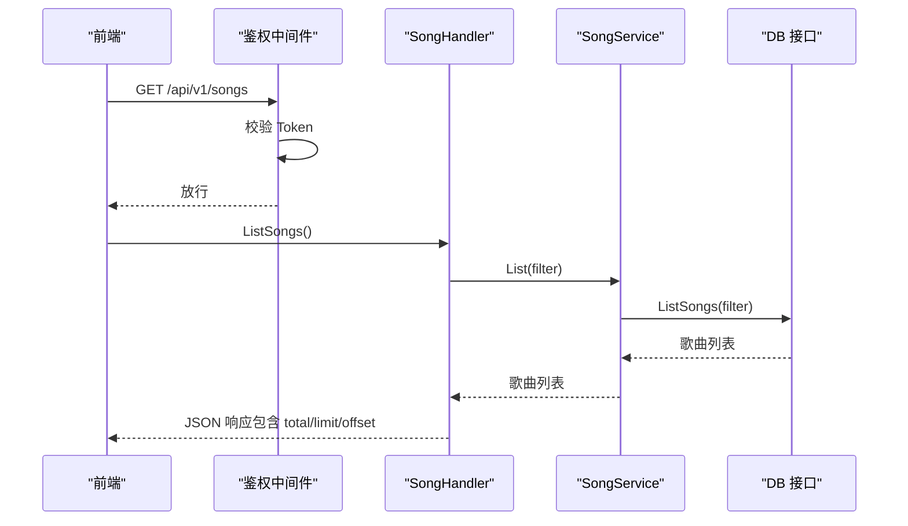
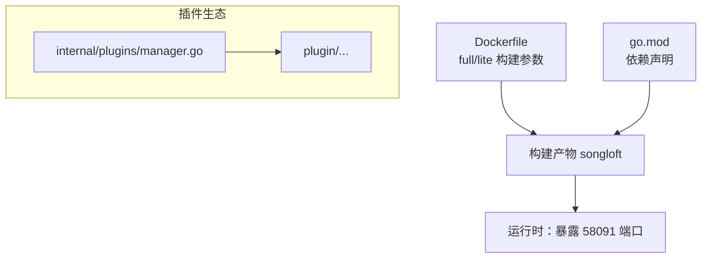

# 整体架构概览

<cite>
**本文引用的文件**
- [main.go](file://main.go)
- [app.go](file://internal/app/app.go)
- [embed.go](file://internal/app/embed.go)
- [routers.go](file://internal/app/routers.go)
- [architecture.md](file://docs/architecture.md)
- [manager.go](file://internal/plugins/manager.go)
- [song_service.go](file://internal/services/song_service.go)
- [music.go](file://internal/handlers/music.go)
- [database.go](file://internal/database/database.go)
- [auth.go](file://internal/middleware/auth.go)
- [web_embed.go](file://web_embed.go)
- [web_embed_full.go](file://web_embed_full.go)
- [Dockerfile](file://Dockerfile)
- [go.mod](file://go.mod)
- [main.dart](file://frontend/lib/main.dart)
</cite>

## 目录
1. [简介](#简介)
2. [项目结构](#项目结构)
3. [核心组件](#核心组件)
4. [架构总览](#架构总览)
5. [详细组件分析](#详细组件分析)
6. [依赖关系分析](#依赖关系分析)
7. [性能考量](#性能考量)
8. [故障排查指南](#故障排查指南)
9. [结论](#结论)
10. [附录](#附录)

## 简介
本项目采用前后端分离架构，后端为 Go 语言实现的 HTTP 服务，前端为 Flutter Web 应用。后端通过 go:embed 将前端构建产物嵌入二进制，实现“同域直连”的访问模式；同时提供 REST API 供前端调用。后端采用分层架构：Handlers -> Services -> Database，职责清晰、可测试性强。插件系统基于 WebAssembly（WASM）实现，通过 go-plugin 与 wazero 运行时集成，支持插件的生命周期管理、路由注册与定时器等能力，并与核心系统深度集成。

## 项目结构
- 后端入口与应用初始化：main.go -> internal/app/app.go
- 路由与中间件：internal/app/routers.go、internal/middleware/auth.go
- 静态资源嵌入：internal/app/embed.go、web_embed*.go
- 业务层：internal/services/*（如歌曲服务）
- 数据层：internal/database/*（接口定义）
- 插件系统：internal/plugins/*
- 前端（Flutter Web）：frontend/lib/main.dart
- 构建与打包：Dockerfile、go.mod

**图表来源**
- [main.go:30-63](file://main.go#L30-L63)
- [app.go:44-227](file://internal/app/app.go#L44-L227)
- [routers.go:20-116](file://internal/app/routers.go#L20-L116)
- [embed.go:10-39](file://internal/app/embed.go#L10-L39)
- [auth.go:11-51](file://internal/middleware/auth.go#L11-L51)
- [database.go:8-64](file://internal/database/database.go#L8-L64)
- [song_service.go:16-32](file://internal/services/song_service.go#L16-L32)
- [music.go:17-27](file://internal/handlers/music.go#L17-L27)
- [manager.go:34-44](file://internal/plugins/manager.go#L34-L44)

**章节来源**
- [main.go:30-63](file://main.go#L30-L63)
- [app.go:44-227](file://internal/app/app.go#L44-L227)
- [routers.go:20-116](file://internal/app/routers.go#L20-L116)
- [embed.go:10-39](file://internal/app/embed.go#L10-L39)
- [auth.go:11-51](file://internal/middleware/auth.go#L11-L51)
- [database.go:8-64](file://internal/database/database.go#L8-L64)
- [song_service.go:16-32](file://internal/services/song_service.go#L16-L32)
- [music.go:17-27](file://internal/handlers/music.go#L17-L27)
- [manager.go:34-44](file://internal/plugins/manager.go#L34-L44)

## 核心组件
- 应用入口与初始化：负责解析配置、初始化数据库、服务层、插件管理器、路由与静态资源注册，并启动 HTTP 服务。
- 路由与中间件：统一注册 API v1 路由组、CORS、日志、panic 捕获、压缩、鉴权中间件等。
- 静态资源嵌入：通过 go:embed 将前端构建产物嵌入二进制，支持 SPA 路由回退。
- 业务服务：以歌曲服务为例，封装扫描、元数据提取、批量导入、清理无效歌曲等业务逻辑。
- 数据层接口：定义统一的数据库接口与事务抽象，便于测试与替换实现。
- 插件系统：基于 WASM 的插件管理器，支持生命周期、路由注册、定时器、JS 运行时、超时与健康检查等。

**章节来源**
- [app.go:64-227](file://internal/app/app.go#L64-L227)
- [routers.go:136-249](file://internal/app/routers.go#L136-L249)
- [embed.go:10-39](file://internal/app/embed.go#L10-L39)
- [song_service.go:16-32](file://internal/services/song_service.go#L16-L32)
- [database.go:8-64](file://internal/database/database.go#L8-L64)
- [manager.go:34-44](file://internal/plugins/manager.go#L34-L44)

## 架构总览
后端采用 Handlers -> Services -> Database 的分层架构，配合中间件实现统一的安全与可观测性。前端 Flutter Web 与后端同域部署，通过嵌入的静态资源与 API 通信，实现零跨域与低延迟访问。插件系统以 WASM 为载体，提供可扩展的功能模块，与核心系统通过 Host 函数与路由集成。

**图表来源**
- [main.dart:36-47](file://frontend/lib/main.dart#L36-L47)
- [routers.go:136-249](file://internal/app/routers.go#L136-L249)
- [music.go:17-27](file://internal/handlers/music.go#L17-L27)
- [song_service.go:16-32](file://internal/services/song_service.go#L16-L32)
- [database.go:8-64](file://internal/database/database.go#L8-L64)
- [manager.go:34-44](file://internal/plugins/manager.go#L34-L44)

## 详细组件分析

### 启动流程与控制流
- main.go：解析配置、创建 App、初始化、启动 HTTP 服务、信号处理。
- internal/app/app.go：初始化数据库、服务层、插件管理器、Tracely 客户端、路由与静态资源。
- internal/app/routers.go：注册基础中间件与 API v1 路由组，含鉴权组与公开接口。
- internal/app/embed.go：注册前端静态资源服务，支持 SPA 路由回退。
- internal/middleware/auth.go：鉴权中间件，支持 Header 与 URL 查询参数两种方式。

**图表来源**
- [main.go:30-63](file://main.go#L30-L63)
- [app.go:64-227](file://internal/app/app.go#L64-L227)
- [routers.go:20-116](file://internal/app/routers.go#L20-L116)
- [embed.go:10-39](file://internal/app/embed.go#L10-L39)
- [auth.go:11-51](file://internal/middleware/auth.go#L11-L51)

**章节来源**
- [main.go:30-63](file://main.go#L30-L63)
- [app.go:64-227](file://internal/app/app.go#L64-L227)
- [routers.go:20-116](file://internal/app/routers.go#L20-L116)
- [embed.go:10-39](file://internal/app/embed.go#L10-L39)
- [auth.go:11-51](file://internal/middleware/auth.go#L11-L51)

### 静态资源嵌入与同域访问策略
- web_embed.go（lite 构建）与 web_embed_full.go（full 构建）分别定义嵌入的前端目录。
- internal/app/embed.go 将嵌入的前端资源挂载到根路径，支持 SPA 路由回退（当请求的文件不存在时返回 index.html）。
- 前端在嵌入模式下直接使用当前页面的 origin 作为后端 API 地址，实现同域直连，避免跨域与代理配置。

**图表来源**
- [embed.go:10-39](file://internal/app/embed.go#L10-L39)
- [web_embed.go:9-11](file://web_embed.go#L9-L11)
- [web_embed_full.go:9-11](file://web_embed_full.go#L9-L11)
- [main.dart:36-47](file://frontend/lib/main.dart#L36-L47)

**章节来源**
- [embed.go:10-39](file://internal/app/embed.go#L10-L39)
- [web_embed.go:9-11](file://web_embed.go#L9-L11)
- [web_embed_full.go:9-11](file://web_embed_full.go#L9-L11)
- [main.dart:36-47](file://frontend/lib/main.dart#L36-L47)

### 分层架构：Handlers -> Services -> Database
- Handlers：接收 HTTP 请求，解析参数，调用 Services，组装响应。
- Services：封装业务逻辑，协调数据库与外部工具（如元数据提取、扫描器）。
- Database：定义统一接口与事务抽象，便于测试与替换实现。

**图表来源**
- [music.go:17-27](file://internal/handlers/music.go#L17-L27)
- [song_service.go:16-32](file://internal/services/song_service.go#L16-L32)
- [database.go:8-64](file://internal/database/database.go#L8-L64)

**章节来源**
- [music.go:17-27](file://internal/handlers/music.go#L17-L27)
- [song_service.go:16-32](file://internal/services/song_service.go#L16-L32)
- [database.go:8-64](file://internal/database/database.go#L8-L64)

### 插件系统架构与集成
- 插件管理器：负责插件的加载、初始化、生命周期管理、路由注册、定时器、JS 运行时、超时与健康检查。
- WASM 运行时：使用 wazero，注入 HTTP 库，支持插件在受限环境中执行。
- Host 函数：提供与后端核心的交互能力（如生成插件专用 JWT、注册路由、JS 环境管理）。
- 与核心系统集成：插件可注册自定义路由到主程序，可调用主程序 API，支持定时器与回调。

**图表来源**
- [manager.go:34-44](file://internal/plugins/manager.go#L34-L44)
- [manager.go:63-71](file://internal/plugins/manager.go#L63-L71)
- [manager.go:162-166](file://internal/plugins/manager.go#L162-L166)

**章节来源**
- [manager.go:34-44](file://internal/plugins/manager.go#L34-L44)
- [manager.go:149-201](file://internal/plugins/manager.go#L149-L201)
- [manager.go:379-463](file://internal/plugins/manager.go#L379-L463)

### 认证与安全中间件
- 鉴权中间件支持从 Authorization 头或 URL 查询参数（access_token）获取 Bearer Token。
- 对于图片/音频等无法自定义 Header 的场景，允许通过 URL 查询参数传递 access_token。
- 未提供认证信息或无效 Token 时返回 401。

**图表来源**
- [auth.go:11-51](file://internal/middleware/auth.go#L11-L51)

**章节来源**
- [auth.go:11-51](file://internal/middleware/auth.go#L11-L51)

### API 工作流示例：歌曲列表
- 前端发起 GET /api/v1/songs，携带分页与筛选参数。
- 鉴权中间件校验 Token。
- SongHandler 解析参数并调用 SongService.List。
- SongService 查询数据库并返回结果。
- 响应包含歌曲列表与总数。

**图表来源**
- [music.go:29-102](file://internal/handlers/music.go#L29-L102)
- [song_service.go:148-155](file://internal/services/song_service.go#L148-L155)
- [database.go:19-20](file://internal/database/database.go#L19-L20)

**章节来源**
- [music.go:29-102](file://internal/handlers/music.go#L29-L102)
- [song_service.go:148-155](file://internal/services/song_service.go#L148-L155)
- [database.go:19-20](file://internal/database/database.go#L19-L20)

## 依赖关系分析
- 构建与打包：Dockerfile 支持 full 与 lite 两种构建模式，通过构建参数选择是否嵌入完整前端。
- 依赖声明：go.mod 指定后端依赖，包括数据库驱动、JWT、CORS、Swagger、WASM 运行时等。
- 插件生态：插件模块与后端模块通过 go.mod replace 进行本地替换，便于开发调试。

**图表来源**
- [Dockerfile:35-43](file://Dockerfile#L35-L43)
- [Dockerfile:64-77](file://Dockerfile#L64-L77)
- [go.mod:5-21](file://go.mod#L5-L21)
- [manager.go:170-201](file://internal/plugins/manager.go#L170-L201)

**章节来源**
- [Dockerfile:35-43](file://Dockerfile#L35-L43)
- [Dockerfile:64-77](file://Dockerfile#L64-L77)
- [go.mod:5-21](file://go.mod#L5-L21)
- [manager.go:170-201](file://internal/plugins/manager.go#L170-L201)

## 性能考量
- 压缩传输：启用 gzip 压缩中间件，对 JS/WASM/CSS/JSON 等静态资源进行压缩，显著减少传输体积。
- 静态资源同域：前端与后端同域部署，避免跨域带来的额外握手与安全限制，提升首屏与交互性能。
- 扫描与导入优化：歌曲扫描采用预过滤、并发元数据提取、批量数据库写入与事务提交，减少磁盘 IO 与锁竞争。
- 插件隔离：WASM 实例非线程安全，使用互斥锁保护；超时控制与健康检查保障稳定性。
- 日志与可观测：全局 panic 捕获与 Tracely 上报，便于定位问题。

**章节来源**
- [routers.go:136-149](file://internal/app/routers.go#L136-L149)
- [song_service.go:215-220](file://internal/services/song_service.go#L215-L220)
- [song_service.go:378-485](file://internal/services/song_service.go#L378-L485)
- [manager.go:26-32](file://internal/plugins/manager.go#L26-L32)
- [app.go:206-217](file://internal/app/app.go#L206-L217)

## 故障排查指南
- 启动失败：检查配置解析与数据库初始化日志，确认 DB 路径与权限。
- 静态资源 404：确认嵌入的前端目录是否正确（lite/full），以及 SPA 回退逻辑是否生效。
- 鉴权失败：确认请求头 Authorization 或 URL 查询参数 access_token 是否正确，Token 是否过期或被撤销。
- 插件异常：查看插件初始化/Deinit 超时日志，确认 WASM 实例健康状态与定时器清理情况。
- CORS 问题：确认 AllowOriginFunc 的域名匹配规则，确保本地与局域网访问正常。

**章节来源**
- [app.go:64-81](file://internal/app/app.go#L64-L81)
- [embed.go:10-39](file://internal/app/embed.go#L10-L39)
- [auth.go:11-51](file://internal/middleware/auth.go#L11-L51)
- [manager.go:86-135](file://internal/plugins/manager.go#L86-L135)
- [routers.go:177-236](file://internal/app/routers.go#L177-L236)

## 结论
Songloft 项目通过前后端分离与同域直连，结合 go:embed 的静态资源嵌入策略，实现了简洁高效的交付方式。后端采用清晰的分层架构与中间件体系，具备良好的可维护性与可扩展性。插件系统以 WASM 为核心，提供了强大的扩展能力与与核心系统的深度集成。整体架构在性能、安全与可运维方面均体现了成熟的设计与工程实践。

## 附录
- 架构文档参考：docs/architecture.md
- 前端入口参考：frontend/lib/main.dart
- 构建与运行参考：Dockerfile、go.mod

**章节来源**
- [architecture.md:13-37](file://docs/architecture.md#L13-L37)
- [main.dart:36-47](file://frontend/lib/main.dart#L36-L47)
- [Dockerfile:35-43](file://Dockerfile#L35-L43)
- [go.mod:5-21](file://go.mod#L5-L21)