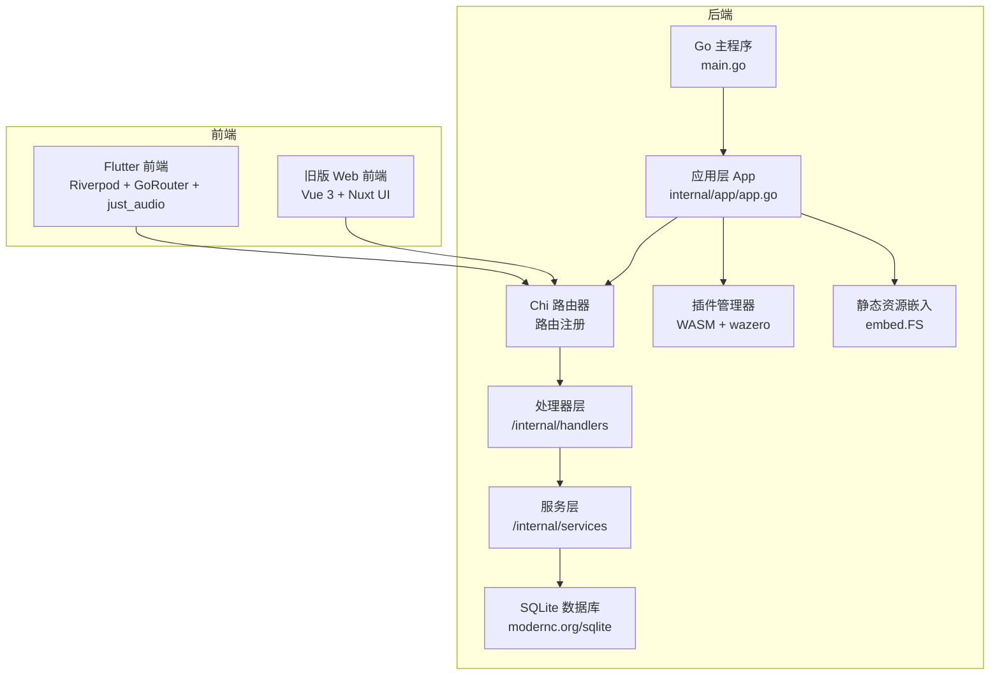
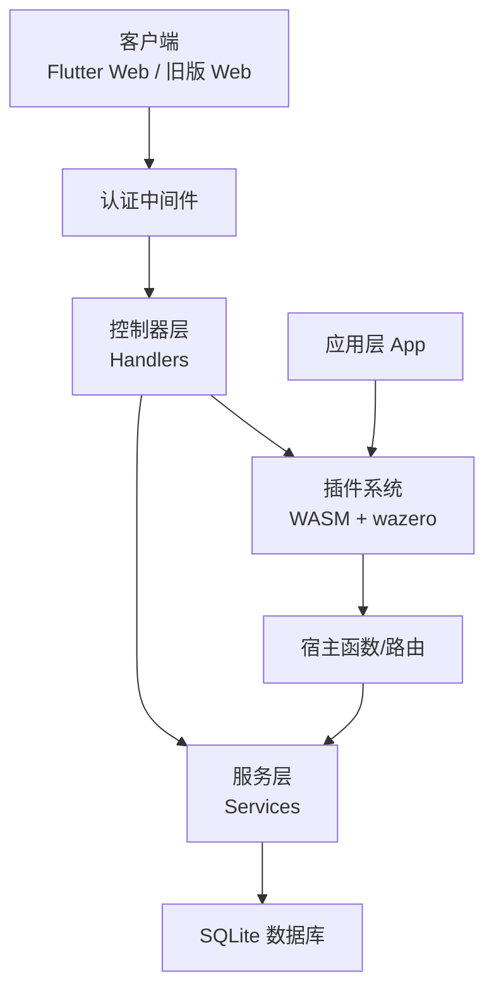
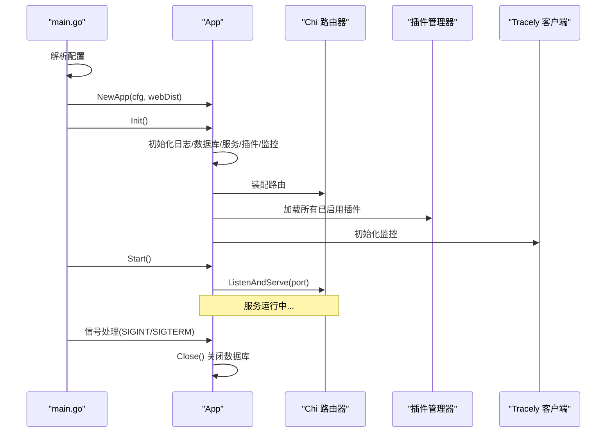
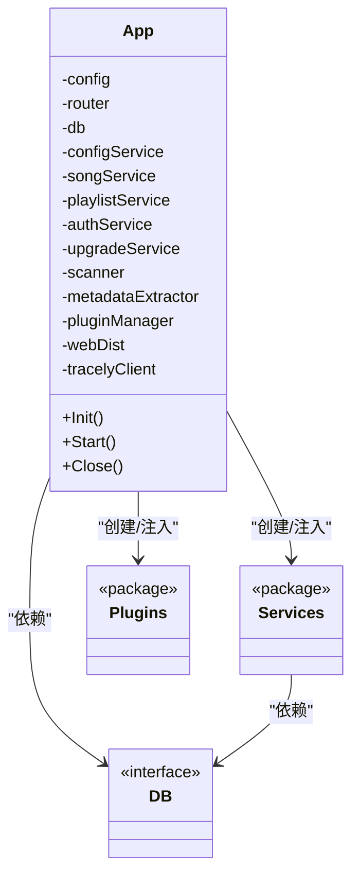
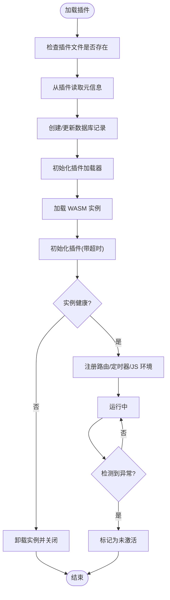
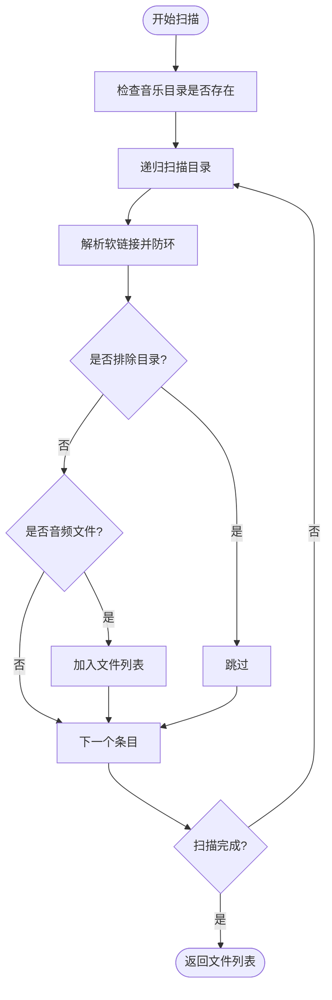
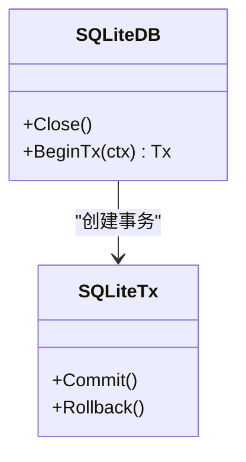
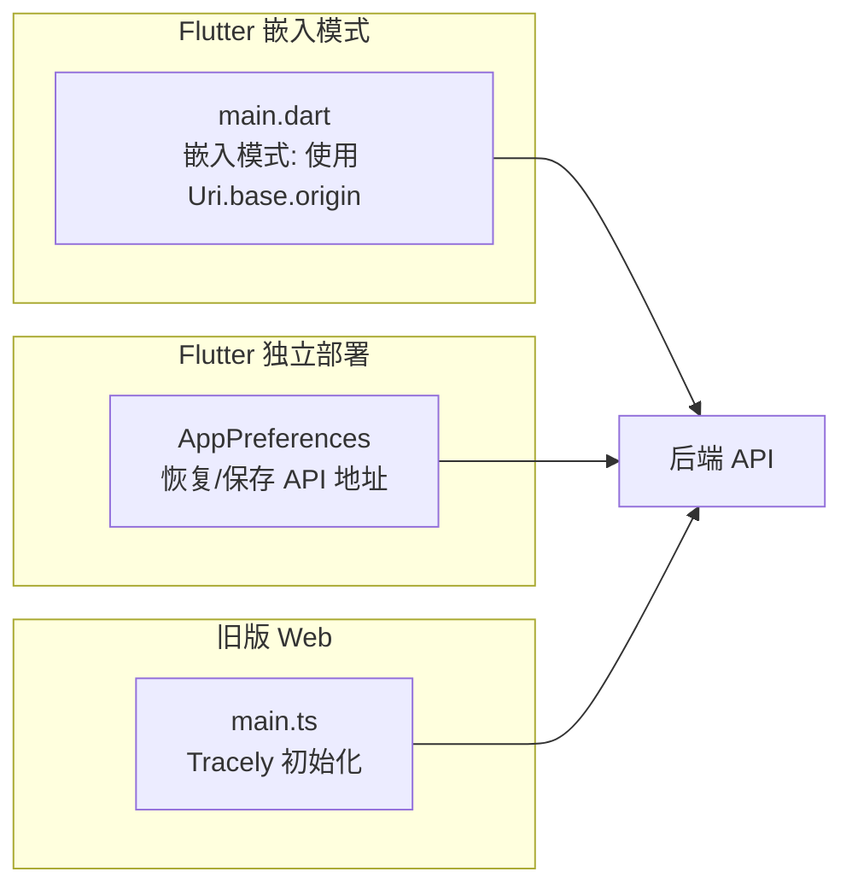

# 系统架构设计

<cite>
**本文引用的文件**   
- [README.md](file://README.md)
- [architecture.md](file://docs/architecture.md)
- [architecture_frontend.md](file://docs/architecture_frontend.md)
- [main.go](file://main.go)
- [internal/app/app.go](file://internal/app/app.go)
- [internal/app/router_dev.go](file://internal/app/router_dev.go)
- [internal/app/router_prod.go](file://internal/app/router_prod.go)
- [internal/plugins/manager.go](file://internal/plugins/manager.go)
- [internal/services/scanner.go](file://internal/services/scanner.go)
- [internal/database/sqlite.go](file://internal/database/sqlite.go)
- [frontend/lib/main.dart](file://frontend/lib/main.dart)
- [web/src/main.ts](file://web/src/main.ts)
- [go.mod](file://go.mod)
- [frontend/pubspec.yaml](file://frontend/pubspec.yaml)
- [web/package.json](file://web/package.json)
</cite>

## 目录
1. [简介](#简介)
2. [项目结构](#项目结构)
3. [核心组件](#核心组件)
4. [架构总览](#架构总览)
5. [详细组件分析](#详细组件分析)
6. [依赖分析](#依赖分析)
7. [性能考量](#性能考量)
8. [故障排查指南](#故障排查指南)
9. [结论](#结论)
10. [附录](#附录)

## 简介
本文件面向 Songloft 的系统架构设计，聚焦整体架构模式（分层架构、微服务风格的插件系统、事件驱动与异步处理）、应用启动流程、依赖注入与生命周期管理、前后端分离与 API 设计、数据流设计、技术决策与权衡、基础设施与可扩展性、部署拓扑、以及安全性、监控与灾备等跨领域关注点。文档同时给出系统边界图与组件交互图，帮助读者快速理解系统如何协同工作。

## 项目结构
Songloft 采用前后端分离架构：
- 后端：Go + Chi 路由，提供 RESTful API、认证、数据库、插件系统与静态资源嵌入。
- 前端：Flutter 跨平台前端（主要前端，支持 Web/Android/iOS/macOS/Windows/Linux），通过嵌入式静态资源与后端同域部署；旧版 Web 前端（Vue 3 + Nuxt UI）位于 /web，已被 Flutter Web 替代。
- 插件系统：基于 WebAssembly（WASM）的插件架构，支持动态加载、路由注册、定时器、JS 运行时与宿主函数调用。
- 数据库：SQLite（modernc.org/sqlite），纯 Go 实现，无需 CGO。
- 监控：Tracely 前端监控 SDK（Vue 侧）与后端 Tracely 客户端（Go 侧）。

图表来源
- [main.go:30-63](file://main.go#L30-L63)
- [internal/app/app.go:27-53](file://internal/app/app.go#L27-L53)
- [internal/app/app.go:64-227](file://internal/app/app.go#L64-L227)
- [internal/plugins/manager.go:149-168](file://internal/plugins/manager.go#L149-L168)
- [internal/database/sqlite.go:22-53](file://internal/database/sqlite.go#L22-L53)

章节来源
- [README.md:398-442](file://README.md#L398-L442)
- [docs/architecture.md:13-37](file://docs/architecture.md#L13-L37)

## 核心组件
- 应用入口与生命周期
  - main.go：解析配置、创建应用实例、初始化、启动 HTTP 服务、信号处理与优雅关闭。
  - internal/app/app.go：应用初始化（日志、数据库、服务、插件、监控）、路由装配、启动与关闭。
- 路由与中间件
  - 路由注册在应用初始化阶段完成；开发/生产环境分别注册 Swagger。
- 服务层
  - 认证、歌曲、歌单、配置、扫描、升级等服务，均通过构造函数注入依赖。
- 数据层
  - SQLite 数据库，WAL 模式、连接池、事务封装。
- 插件系统
  - 基于 wazero 的 WASM 运行时，支持插件生命周期、路由注册、定时器、JS 环境管理、宿主函数调用。
- 前端
  - Flutter：嵌入模式下与后端同域，自动使用当前页面 origin；AudioService 初始化与权限处理。
  - 旧版 Web：Vue 3 + Nuxt UI，Pinia + 持久化，Axios，PWA 与 vConsole 调试。

章节来源
- [main.go:30-63](file://main.go#L30-L63)
- [internal/app/app.go:64-227](file://internal/app/app.go#L64-L227)
- [internal/app/router_dev.go:13-18](file://internal/app/router_dev.go#L13-L18)
- [internal/app/router_prod.go:6-9](file://internal/app/router_prod.go#L6-L9)
- [internal/database/sqlite.go:22-53](file://internal/database/sqlite.go#L22-L53)
- [internal/plugins/manager.go:149-168](file://internal/plugins/manager.go#L149-L168)
- [frontend/lib/main.dart:23-108](file://frontend/lib/main.dart#L23-L108)
- [web/src/main.ts:20-41](file://web/src/main.ts#L20-L41)

## 架构总览
Songloft 采用“前后端分离 + 插件化”的混合架构：
- 分层架构：表现层（前端）、控制器层（后端 Handlers）、服务层（Services）、数据层（SQLite）。
- 微服务风格（插件系统）：通过 WASM 插件实现功能扩展，插件拥有独立生命周期、路由与资源隔离。
- 事件驱动与异步：扫描任务、插件定时器、升级流程等采用异步与超时控制。
- API 设计：RESTful，明确鉴权策略（JWT 双 Token），Swagger 文档（开发环境）。
- 数据流：前端发起请求 → 中间件鉴权 → 控制器处理 → 服务层业务逻辑 → 数据库持久化 → 返回响应。

图表来源
- [docs/architecture.md:13-37](file://docs/architecture.md#L13-L37)
- [internal/app/app.go:64-227](file://internal/app/app.go#L64-L227)
- [internal/plugins/manager.go:149-168](file://internal/plugins/manager.go#L149-L168)

## 详细组件分析

### 启动流程与生命周期
- 启动阶段
  - main.go 解析命令行与环境变量，创建 App 实例并调用 Init。
  - Init 完成日志初始化、数据库连接与目录准备、服务层初始化、插件管理器初始化、Tracely 监控初始化、路由装配与插件加载。
  - Start 启动 HTTP 服务，绑定端口。
- 优雅关闭
  - 注册 OS 信号（SIGINT/SIGTERM），接收信号后调用 Close 关闭数据库连接。
- 开发/生产差异
  - 开发环境注册 Swagger 路由；生产环境不注册。

图表来源
- [main.go:30-63](file://main.go#L30-L63)
- [internal/app/app.go:64-227](file://internal/app/app.go#L64-L227)
- [internal/app/app.go:229-241](file://internal/app/app.go#L229-L241)

章节来源
- [main.go:30-63](file://main.go#L30-L63)
- [internal/app/app.go:64-227](file://internal/app/app.go#L64-L227)
- [internal/app/router_dev.go:13-18](file://internal/app/router_dev.go#L13-L18)
- [internal/app/router_prod.go:6-9](file://internal/app/router_prod.go#L6-L9)

### 依赖注入与中间件模式
- 依赖注入
  - App 构造函数注入配置与嵌入式静态资源；Init 中通过构造函数注入数据库、服务、插件管理器等。
  - 服务层通过构造函数注入数据库接口与工具（如 MetadataExtractor、Scanner）。
- 中间件模式
  - 认证中间件包装下一个处理器，统一鉴权逻辑。
- 依赖关系
  - Handlers 依赖 Services；Services 依赖数据库接口；插件通过宿主函数与服务层交互。

图表来源
- [internal/app/app.go:27-53](file://internal/app/app.go#L27-L53)
- [internal/app/app.go:146-174](file://internal/app/app.go#L146-L174)

章节来源
- [internal/app/app.go:27-53](file://internal/app/app.go#L27-L53)
- [internal/app/app.go:146-174](file://internal/app/app.go#L146-L174)

### 插件系统（微服务风格）
- 插件生命周期
  - 加载：从目录扫描、读取插件信息、创建/更新数据库记录、加载 WASM 实例、初始化。
  - 运行：注册路由、定时器、JS 环境；健康检查与超时保护。
  - 卸载：清理路由、销毁 JS 环境、Deinit、关闭实例、清除定时器。
  - 禁用：标记状态、卸载实例、必要时异步禁用不健康插件。
- 运行时与宿主
  - wazero 运行时，WASI 初始化与 HTTP Library 注入；宿主函数桥接插件与后端。
- 超时与并发
  - 初始化/回调/反初始化/关闭均有超时控制；WASM 实例非线程安全，使用互斥保护。

图表来源
- [internal/plugins/manager.go:227-281](file://internal/plugins/manager.go#L227-L281)
- [internal/plugins/manager.go:403-463](file://internal/plugins/manager.go#L403-L463)
- [internal/plugins/manager.go:86-135](file://internal/plugins/manager.go#L86-L135)

章节来源
- [internal/plugins/manager.go:149-168](file://internal/plugins/manager.go#L149-L168)
- [internal/plugins/manager.go:227-281](file://internal/plugins/manager.go#L227-L281)
- [internal/plugins/manager.go:403-463](file://internal/plugins/manager.go#L403-L463)

### 文件扫描与元数据提取
- 扫描器
  - 递归扫描目录，支持软链接与排除目录；按扩展名判断音频文件。
- 元数据提取
  - 使用 hanxi/tag 提取封面与元数据；ffprobe 用于精确音频参数（时长、比特率、采样率）。
- 进度与取消
  - 扫描过程支持上下文取消，避免长时间阻塞。

图表来源
- [internal/services/scanner.go:30-114](file://internal/services/scanner.go#L30-L114)
- [internal/services/scanner.go:116-134](file://internal/services/scanner.go#L116-L134)

章节来源
- [internal/services/scanner.go:30-114](file://internal/services/scanner.go#L30-L114)
- [internal/services/scanner.go:116-134](file://internal/services/scanner.go#L116-L134)

### 数据库与事务
- 连接与优化
  - 使用 modernc.org/sqlite，WAL 模式、busy_timeout、synchronous、cache_size、外键约束。
  - 连接池：最大打开 10，空闲 5，最长存活 30 分钟。
- 事务
  - BeginTx 返回 Tx 接口，支持 Commit/Rollback。
- 迁移
  - 建表后对 playlists 表追加 cover_path 字段。

图表来源
- [internal/database/sqlite.go:12-53](file://internal/database/sqlite.go#L12-L53)
- [internal/database/sqlite.go:60-79](file://internal/database/sqlite.go#L60-L79)

章节来源
- [internal/database/sqlite.go:12-53](file://internal/database/sqlite.go#L12-L53)
- [internal/database/sqlite.go:60-79](file://internal/database/sqlite.go#L60-L79)

### 前端架构与部署模式
- Flutter 前端
  - 嵌入模式：与后端同域，自动使用当前页面 origin；AudioService 初始化与权限处理。
  - 独立部署：从本地存储恢复用户配置的 API 地址，支持运行时修改。
- 旧版 Web 前端
  - Vue 3 + Nuxt UI，Pinia + 持久化，Axios，PWA 与 vConsole 调试。
- 监控
  - Vue 侧使用 Tracely SDK 初始化监控，挂载到全局供拦截器使用。

图表来源
- [frontend/lib/main.dart:36-47](file://frontend/lib/main.dart#L36-L47)
- [frontend/lib/main.dart:65-97](file://frontend/lib/main.dart#L65-L97)
- [web/src/main.ts:30-41](file://web/src/main.ts#L30-L41)

章节来源
- [frontend/lib/main.dart:23-108](file://frontend/lib/main.dart#L23-L108)
- [docs/architecture_frontend.md:185-214](file://docs/architecture_frontend.md#L185-L214)
- [web/src/main.ts:30-41](file://web/src/main.ts#L30-L41)

## 依赖分析
- 技术栈与版本
  - Go 1.26，Chi v5.2.4，SQLite3（modernc.org/sqlite），JWT 认证，hanxi/tag，ffprobe（可选），WASM 插件（wazero），Tracely 监控。
- 第三方依赖
  - go.mod 明确列出核心依赖与替换路径（如 hanxi/tag 与 go-plugin-http）。
- 前端依赖
  - Flutter：Riverpod、GoRouter、just_audio、audio_service、dio、shared_preferences 等。
  - 旧版 Web：Vue 3、Pinia、Axios、Nuxt UI、Tailwind CSS、vite-plugin-pwa、vconsole 等。

```mermaid
graph TB
Go["Go 1.26"] --> Chi["Chi v5.2.4"]
Go --> SQLite["modernc.org/sqlite"]
Go --> JWT["golang-jwt/jwt/v5"]
Go --> Tag["hanxi/tag"]
Go --> Wazero["tetratelabs/wazero"]
Go --> TracelyGo["hanxi/tracely/sdk/go/tracely"]
Flutter["Flutter/Dart"] --> Riverpod["flutter_riverpod"]
Flutter --> GoRouter["go_router"]
Flutter --> JustAudio["just_audio"]
Flutter --> AudioService["audio_service"]
Flutter --> Dio["dio"]
Flutter --> SP["shared_preferences"]
Web["Vue 3/Pinia"] --> Axios["axios"]
Web --> NuxtUI["@nuxt/ui"]
Web --> Tailwind["tailwindcss"]
Web --> PWA["vite-plugin-pwa"]
Web --> VConsole["vconsole"]
```

图表来源
- [go.mod:5-21](file://go.mod#L5-L21)
- [frontend/pubspec.yaml:11-42](file://frontend/pubspec.yaml#L11-L42)
- [web/package.json:14-33](file://web/package.json#L14-L33)

章节来源
- [go.mod:5-21](file://go.mod#L5-L21)
- [frontend/pubspec.yaml:11-42](file://frontend/pubspec.yaml#L11-L42)
- [web/package.json:14-33](file://web/package.json#L14-L33)

## 性能考量
- 数据库性能
  - WAL 模式提升并发读写；busy_timeout 与连接池参数平衡吞吐与锁竞争。
- 插件性能
  - WASM 实例超时控制与健康检查，避免插件阻塞；wazero CloseOnContextDone 在上下文取消时中断执行。
- 前端性能
  - Flutter 路由懒加载与响应式主题；旧版 Web 使用按需构建与 PWA 缓存策略（静态资源缓存优先，API 网络优先，音乐文件仅网络）。
- 元数据提取
  - hanxi/tag 无需 ffmpeg，部署更简单；ffprobe 仅用于精确参数。

章节来源
- [internal/database/sqlite.go:24-40](file://internal/database/sqlite.go#L24-L40)
- [internal/plugins/manager.go:26-32](file://internal/plugins/manager.go#L26-L32)
- [docs/architecture.md:97-128](file://docs/architecture.md#L97-L128)
- [docs/architecture_frontend.md:273-298](file://docs/architecture_frontend.md#L273-L298)

## 故障排查指南
- 启动失败
  - 检查配置解析（命令行参数与环境变量优先级）、数据库路径与权限、端口占用。
- 插件异常
  - 观察初始化/回调超时日志；不健康插件会被禁用；检查插件目录权限与文件完整性。
- 数据库问题
  - WAL 模式下连接池与 busy_timeout；确认外键约束与迁移是否成功。
- 前端无法访问后端
  - 嵌入模式应同域；独立部署检查 API 地址保存与持久化；确认 CORS 配置（如启用）。
- 监控与日志
  - 后端使用 slog；前端 Tracely SDK 初始化与错误上报；Swagger（开发环境）辅助定位接口问题。

章节来源
- [internal/app/app.go:287-352](file://internal/app/app.go#L287-L352)
- [internal/plugins/manager.go:137-147](file://internal/plugins/manager.go#L137-L147)
- [internal/database/sqlite.go:24-40](file://internal/database/sqlite.go#L24-L40)
- [web/src/main.ts:30-41](file://web/src/main.ts#L30-L41)

## 结论
Songloft 通过清晰的分层架构、可扩展的插件系统与前后端分离设计，实现了轻量、易部署、可维护且具备良好扩展性的音乐服务器。JWT 双 Token 认证、SQLite 纯 Go 实现、WASM 插件与 Tracely 监控共同构成了系统的安全、可观测与可演进能力。建议在生产环境中严格遵循配置优先级、数据库 WAL 优化与插件超时治理，持续完善监控与灾备策略。

## 附录
- API 设计与认证
  - RESTful 接口、Swagger（开发环境）、JWT 双 Token（Access/Refresh）、令牌撤销与管理。
- 部署拓扑
  - 标准部署（前后端同域，嵌入式静态资源）与独立部署（前端静态托管，后端 API 可变）。
- 基础设施需求
  - Go 1.26+，SQLite（内置），可选 ffprobe；Docker 支持；Tracely 监控（后端/前端）。

章节来源
- [README.md:251-352](file://README.md#L251-L352)
- [docs/architecture.md:13-37](file://docs/architecture.md#L13-L37)
- [docs/architecture.md:39-50](file://docs/architecture.md#L39-L50)