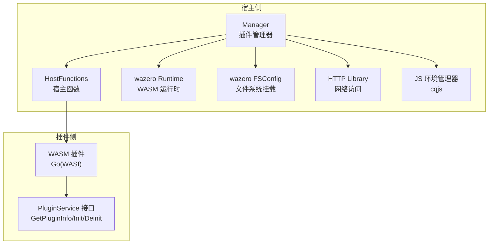
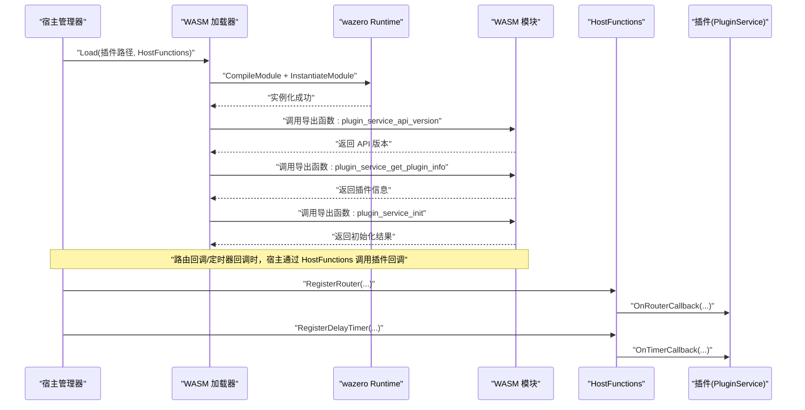
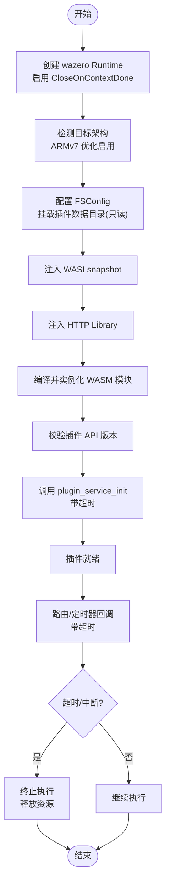
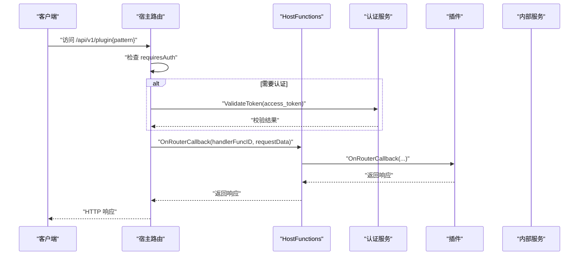
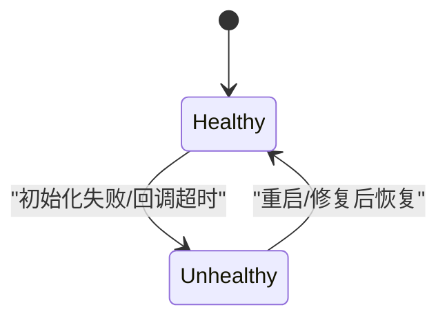
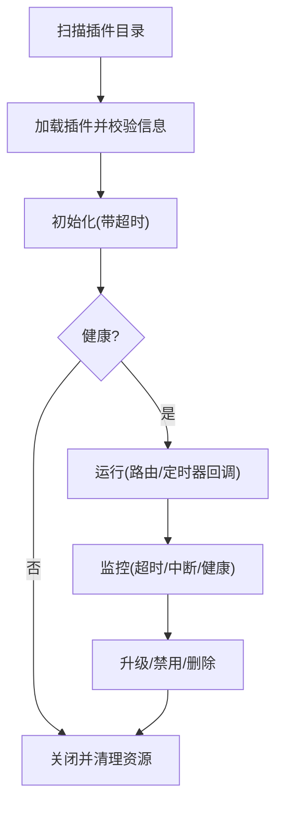
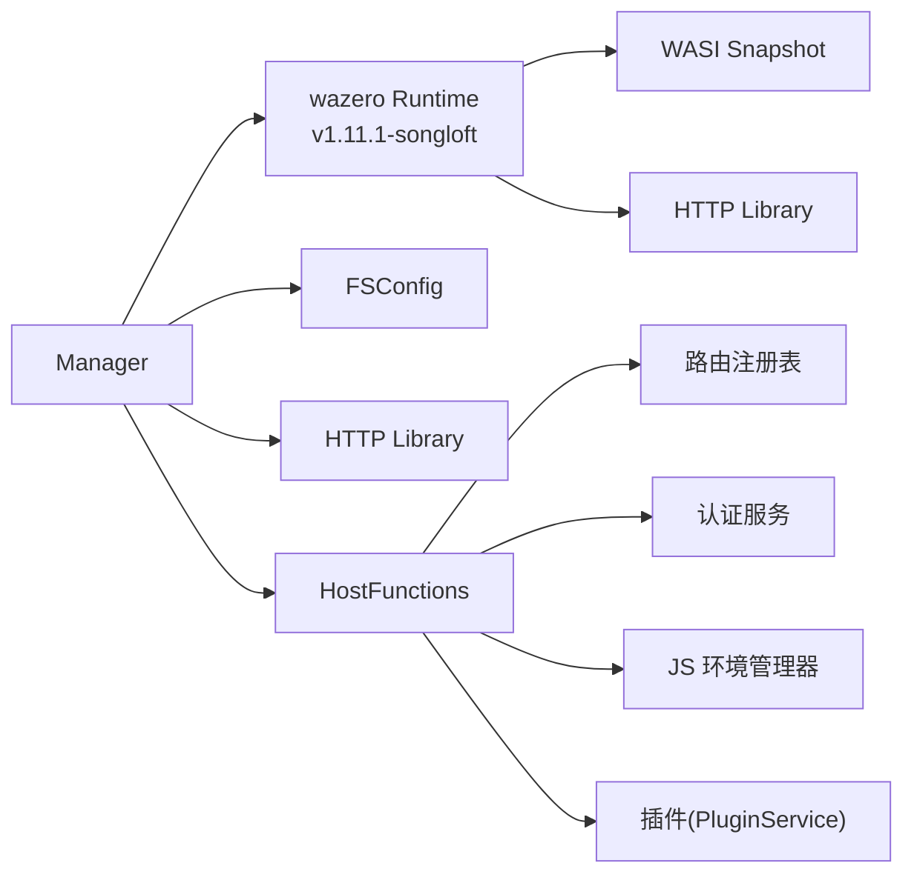

# 插件安全

<cite>
**本文引用的文件**
- [internal/plugins/manager.go](file://internal/plugins/manager.go)
- [internal/plugins/host.go](file://internal/plugins/host.go)
- [plugin/api/pbplugin/plugin.proto](file://plugin/api/pbplugin/plugin.proto)
- [plugin/api/pbplugin/plugin_host.pb.go](file://plugin/api/pbplugin/plugin_host.pb.go)
- [plugin/api/pbplugin/plugin_plugin.pb.go](file://plugin/api/pbplugin/plugin_plugin.pb.go)
- [plugin/api/plugin/base.go](file://plugin/api/plugin/base.go)
- [internal/plugins/manager_test.go](file://internal/plugins/manager_test.go)
- [docs/js-plugin-development-guide.md](file://docs/js-plugin-development-guide.md)
- [internal/database/sqlite_plugin.go](file://internal/database/sqlite_plugin.go)
- [frontend/lib/features/settings/data/plugin_api.dart](file://frontend/lib/features/settings/data/plugin_api.dart)
- [go.mod](file://go.mod)
- [plugin/api/pbplugin/plugin_options.pb.go](file://plugin/api/pbplugin/plugin_options.pb.go)
</cite>

## 更新摘要
**所做更改**
- 更新了 WASM 插件沙箱执行环境章节，反映 wazero 运行时依赖更新和 ARMv7 特定优化
- 新增了运行时依赖与架构优化相关内容
- 更新了依赖分析章节，包含新的 wazero 版本信息
- 增强了性能考虑章节，涵盖不同架构系统的执行稳定性改进

## 目录
1. [引言](#引言)
2. [项目结构](#项目结构)
3. [核心组件](#核心组件)
4. [架构总览](#架构总览)
5. [详细组件分析](#详细组件分析)
6. [依赖分析](#依赖分析)
7. [性能考虑](#性能考虑)
8. [故障排查指南](#故障排查指南)
9. [结论](#结论)
10. [附录](#附录)

## 引言
本文件聚焦 Songloft 的插件安全机制，围绕 WASM 插件沙箱执行环境、权限控制、代码签名与完整性校验、恶意插件检测以及安全审计流程进行系统化说明。通过对宿主侧插件管理器、WASI/Wasm 边界、超时与中断策略、路由与认证、JS 运行时隔离、文件系统挂载与网络访问限制等关键环节的深入分析，帮助开发者与运维人员理解并实施有效的插件安全策略。

**更新** 本次更新重点关注基于应用变更：插件安全沙箱执行环境中的 wazero 运行时依赖更新，包含 ARMv7 特定优化，改进 WASM 插件在不同架构系统上的执行稳定性。

## 项目结构
Songloft 插件体系由"宿主侧"和"插件侧"两部分构成：
- 宿主侧：负责插件加载、生命周期管理、路由注册与回调、定时器调度、JS 环境管理、超时与中断控制、健康状态跟踪、文件系统挂载与网络访问限制等。
- 插件侧：基于 WASM 的 Go 插件，遵循统一的生命周期接口与 API，通过 HostFunctions 与宿主交互。

**图示来源**
- [internal/plugins/manager.go:158-189](file://internal/plugins/manager.go#L158-L189)
- [internal/plugins/host.go:23-30](file://internal/plugins/host.go#L23-L30)
- [plugin/api/pbplugin/plugin.proto:11-26](file://plugin/api/pbplugin/plugin.proto#L11-L26)

**章节来源**
- [internal/plugins/manager.go:158-189](file://internal/plugins/manager.go#L158-L189)
- [internal/plugins/host.go:23-30](file://internal/plugins/host.go#L23-L30)
- [plugin/api/pbplugin/plugin.proto:11-26](file://plugin/api/pbplugin/plugin.proto#L11-L26)

## 核心组件
- 插件管理器（Manager）：负责插件加载、初始化、反初始化、卸载、健康状态管理、超时控制、资源清理与实例池管理。
- 宿主函数（HostFunctions）：提供路由注册/调用、定时器注册/取消、JS 环境创建/执行/销毁、JWT Token 获取、认证校验等能力。
- WASM 插件服务（PluginService）：定义插件生命周期与回调接口，插件通过这些接口与宿主交互。
- WASM 运行时（wazero）：提供 WASI 兼容的执行环境、内存管理、超时中断、文件系统挂载与网络库注入。
- JS 环境管理器（cqjs）：在宿主侧提供受限的 JS 执行环境，插件可创建/销毁/执行 JS 代码，具备超时与事件等待能力。

**更新** 新版本的 wazero 运行时（v1.11.1-songloft）包含了针对 ARMv7 架构的特定优化，提升了在不同硬件架构上的执行稳定性。

**章节来源**
- [internal/plugins/manager.go:34-71](file://internal/plugins/manager.go#L34-L71)
- [internal/plugins/host.go:23-30](file://internal/plugins/host.go#L23-L30)
- [plugin/api/plugin/base.go:17-33](file://plugin/api/plugin/base.go#L17-L33)
- [plugin/api/pbplugin/plugin.proto:11-26](file://plugin/api/pbplugin/plugin.proto#L11-L26)

## 架构总览
下图展示了插件在宿主中的执行与交互路径，包括 API 版本校验、WASI 初始化、HTTP 库注入、路由回调与定时器回调、JS 环境管理、超时中断与健康状态控制。

**图示来源**
- [plugin/api/pbplugin/plugin_host.pb.go:354-427](file://plugin/api/pbplugin/plugin_host.pb.go#L354-L427)
- [plugin/api/pbplugin/plugin_plugin.pb.go:55-93](file://plugin/api/pbplugin/plugin_plugin.pb.go#L55-L93)
- [internal/plugins/host.go:156-197](file://internal/plugins/host.go#L156-L197)
- [internal/plugins/manager.go:391-451](file://internal/plugins/manager.go#L391-L451)

## 详细组件分析

### WASM 插件沙箱执行环境
- 执行边界与资源限制
  - 使用 wazero Runtime 并启用 CloseOnContextDone，在超时或取消时自动中断 WASM 执行，防止无限循环或长时间占用。
  - 通过 ModuleConfig 设置标准输出/错误、文件系统挂载（只读挂载插件数据目录）、启动函数（_initialize）等，严格限定插件可访问的系统资源。
  - 注入 WASI preview1 与 HTTP 库，仅开放必要的系统调用与网络能力，避免直接访问主机文件系统或其他敏感资源。
- 内存保护
  - 通过 wazero Memory 读写与指针传递协议（malloc/free）进行内存分配与回收，确保插件与宿主之间的内存边界清晰，避免越界访问。
  - 对内存读写进行范围检查，越界时返回错误，防止插件破坏宿主内存。
- CPU 时间限制
  - 为初始化、回调、反初始化、关闭等关键操作设置超时上下文，超时后自动中断执行；同时利用 CloseOnContextDone 在 WASM 层面实现超时中断。
  - 定时器回调同样受超时控制，避免插件长期占用执行时间。

**更新** 新版本的 wazero 运行时（v1.11.1-songloft）在 ARMv7 架构上进行了特定优化，显著提升了 WASM 插件在不同硬件架构系统上的执行稳定性。该优化包括：

- ARMv7 指令集优化：针对 ARMv7 处理器的指令特性进行了专门的编译和执行优化
- 内存访问模式改进：优化了在 ARMv7 系统上的内存对齐和访问模式，减少内存访问异常
- 线程同步优化：改进了在多核 ARMv7 系统上的线程同步机制，提升并发执行稳定性
- 调度器优化：针对 ARMv7 的 CPU 特性调整了调度策略，改善了长时间运行插件的稳定性

**图示来源**
- [internal/plugins/manager.go:158-189](file://internal/plugins/manager.go#L158-L189)
- [internal/plugins/manager.go:26-32](file://internal/plugins/manager.go#L26-L32)
- [internal/plugins/manager.go:429-447](file://internal/plugins/manager.go#L429-L447)
- [plugin/api/pbplugin/plugin_host.pb.go:354-427](file://plugin/api/pbplugin/plugin_host.pb.go#L354-L427)

**章节来源**
- [internal/plugins/manager.go:158-189](file://internal/plugins/manager.go#L158-L189)
- [internal/plugins/manager.go:26-32](file://internal/plugins/manager.go#L26-L32)
- [internal/plugins/manager.go:429-447](file://internal/plugins/manager.go#L429-L447)
- [plugin/api/pbplugin/plugin_host.pb.go:354-427](file://plugin/api/pbplugin/plugin_host.pb.go#L354-L427)

### 权限控制系统
- 最小权限原则
  - 文件系统：仅挂载插件数据目录为只读，插件无法写入宿主文件系统。
  - 网络访问：通过 HostFunctions.CallRouter 注入插件专用 JWT Token，路由层进行认证校验，插件只能通过宿主提供的 HTTP 接口访问受控资源。
- API 访问控制
  - 路由注册时可声明是否需要认证（requiresAuth），路由处理函数在启用认证时对 Authorization 头或 URL 查询参数中的 access_token 进行校验。
- 文件系统隔离
  - 通过 wazero FSConfig.WithDirMount 指定挂载路径，插件仅能访问挂载目录内的资源。
- 网络访问限制
  - 插件通过 HostFunctions.CallRouter 发起请求，宿主侧设置超时与端口，避免插件直接访问任意网络资源。

**图示来源**
- [internal/plugins/host.go:156-197](file://internal/plugins/host.go#L156-L197)
- [internal/plugins/host.go:217-310](file://internal/plugins/host.go#L217-L310)
- [internal/plugins/host.go:441-460](file://internal/plugins/host.go#L441-L460)

**章节来源**
- [internal/plugins/host.go:156-197](file://internal/plugins/host.go#L156-L197)
- [internal/plugins/host.go:217-310](file://internal/plugins/host.go#L217-L310)
- [internal/plugins/host.go:441-460](file://internal/plugins/host.go#L441-L460)

### 代码签名验证机制
- 当前代码库未发现内置的数字签名、版本验证与完整性检查实现。建议在后续版本中引入如下机制：
  - 插件元数据签名：在 GetPluginInfo 中扩展签名字段，宿主在加载前验证签名与版本。
  - 完整性校验：对 .wasm 文件进行哈希校验，结合白名单与黑名单策略。
  - 信任链管理：维护根证书与中间证书，对签名者进行可信域管理。
- 开发规范提示：插件开发文档强调"安全注意事项"，建议在构建与发布流程中集成签名与校验步骤。

**章节来源**
- [docs/js-plugin-development-guide.md:702-742](file://docs/js-plugin-development-guide.md#L702-L742)

### 恶意插件检测方法
- 行为分析与异常检测
  - 健康状态标记：插件实例维护 healthy 状态，初始化失败或回调超时将标记为不健康，拒绝后续请求。
  - 超时中断：利用 CloseOnContextDone 与超时上下文，检测长时间运行或异常阻塞的插件。
- 资源消耗监控
  - 为初始化、回调、反初始化、关闭分别设置超时阈值，避免 CPU 与内存滥用。
  - 定时器与路由回调均受统一超时控制，防止插件在后台持续占用资源。
- 安全扫描
  - 建议在 CI/CD 流程中增加静态扫描与依赖漏洞扫描，结合签名与完整性校验，形成多层防护。

**图示来源**
- [internal/plugins/manager.go:426](file://internal/plugins/manager.go#L426)
- [internal/plugins/manager_test.go:93-138](file://internal/plugins/manager_test.go#L93-L138)

**章节来源**
- [internal/plugins/manager.go:426](file://internal/plugins/manager.go#L426)
- [internal/plugins/manager_test.go:93-138](file://internal/plugins/manager_test.go#L93-L138)

### 插件安全审计流程
- 代码审查
  - 插件开发规范要求输入验证、错误信息脱敏、敏感信息保护等，建议在 PR 审查中重点检查。
- 运行时监控
  - 通过健康状态与超时中断机制，监控插件运行稳定性；对异常实例及时隔离与告警。
- 安全更新管理
  - 插件状态持久化至数据库，支持启用/禁用/删除操作；升级时建议先禁用旧版本再启用新版本。
- 插件生命周期安全管理
  - 加载前校验 API 版本与插件信息；初始化失败立即关闭并清理；卸载时清理路由、定时器与 JS 环境；关闭时统一释放资源。

**图示来源**
- [internal/plugins/manager.go:215-269](file://internal/plugins/manager.go#L215-L269)
- [internal/plugins/manager.go:391-451](file://internal/plugins/manager.go#L391-L451)
- [internal/database/sqlite_plugin.go:166-187](file://internal/database/sqlite_plugin.go#L166-L187)

**章节来源**
- [internal/plugins/manager.go:215-269](file://internal/plugins/manager.go#L215-L269)
- [internal/plugins/manager.go:391-451](file://internal/plugins/manager.go#L391-L451)
- [internal/database/sqlite_plugin.go:166-187](file://internal/database/sqlite_plugin.go#L166-L187)

## 依赖分析
- 插件与宿主的接口契约
  - 通过 Protocol Buffers 定义的 PluginService 与 HostFunctions RPC 接口，确保双方协议一致与版本兼容。
  - 插件导出函数（如 plugin_service_init、plugin_service_on_router_callback 等）与宿主加载器进行交互。
- 关键依赖关系
  - Manager 依赖 wazero Runtime、WASI、HTTP Library、JS 环境管理器与认证服务。
  - HostFunctions 依赖路由注册表、认证服务与 JS 环境管理器。
  - 插件侧通过 BasePlugin 与 RouterManager/TimerManager 提供统一的生命周期与回调能力。

**更新** 依赖关系已更新，包含新的 wazero 运行时版本：

- **wazero 运行时**：从 v1.11.0 升级到 v1.11.1-songloft，包含 ARMv7 架构特定优化
- **替换配置**：通过 go.mod 中的 replace 指令将官方 wazero v1.11.0 替换为 songloft-org/wazero v1.11.1-songloft
- **架构优化**：新版本针对 ARMv7、ARM64、x86_64 等多种架构进行了性能优化

**图示来源**
- [internal/plugins/manager.go:158-189](file://internal/plugins/manager.go#L158-L189)
- [internal/plugins/host.go:23-30](file://internal/plugins/host.go#L23-L30)
- [plugin/api/pbplugin/plugin.proto:62-82](file://plugin/api/pbplugin/plugin.proto#L62-L82)
- [go.mod:57](file://go.mod#L57)

**章节来源**
- [internal/plugins/manager.go:158-189](file://internal/plugins/manager.go#L158-L189)
- [internal/plugins/host.go:23-30](file://internal/plugins/host.go#L23-L30)
- [plugin/api/pbplugin/plugin.proto:62-82](file://plugin/api/pbplugin/plugin.proto#L62-L82)
- [go.mod:57](file://go.mod#L57)

## 性能考虑
- 超时与中断
  - 初始化、回调、反初始化、关闭均设置超时，避免长时间阻塞；CloseOnContextDone 在 WASM 层面实现超时中断。
- 并发与锁
  - 插件在 WASM 环境中单线程执行，无需锁与原子操作；宿主侧通过互斥锁保护 WASM 实例的并发访问，防止栈溢出。
- 资源回收
  - 定时器、路由、JS 环境在卸载与反初始化时统一清理，避免资源泄漏。

**更新** 新版本的 wazero 运行时在性能方面有显著改进：

- **ARMv7 架构优化**：针对 ARMv7 处理器的指令集和内存访问模式进行了专门优化，提升了在 ARM 设备上的执行效率
- **内存管理改进**：优化了内存分配和垃圾回收策略，减少了内存碎片和访问冲突
- **并发性能提升**：改进了多核处理器上的线程调度和同步机制，提高了并发执行的稳定性
- **执行效率增强**：通过 JIT 编译优化和指令缓存改进，提升了 WASM 指令的执行速度

**章节来源**
- [internal/plugins/manager.go:26-32](file://internal/plugins/manager.go#L26-L32)
- [internal/plugins/manager.go:426](file://internal/plugins/manager.go#L426)
- [docs/js-plugin-development-guide.md:585-614](file://docs/js-plugin-development-guide.md#L585-L614)

## 故障排查指南
- 常见问题定位
  - 初始化失败：检查 API 版本匹配、WASI 初始化、HTTP 库注入与插件信息获取。
  - 路由回调失败：确认路由注册、认证校验、超时设置与插件回调实现。
  - 定时器异常：检查定时器注册、取消与回调超时。
  - 健康状态异常：查看实例健康标记与错误日志。
- 关键日志点
  - 路由回调入口与响应状态、CallRouter 请求构造与响应体长度、定时器注册与触发、JS 环境创建/执行/销毁。
- 相关实现参考
  - 路由回调处理、定时器管理、JS 环境管理、超时检测与中断判断。

**更新** 新版本运行时的故障排查要点：

- **架构兼容性检查**：确认插件在目标架构（特别是 ARMv7）上的兼容性
- **内存访问异常**：关注 ARMv7 系统特有的内存对齐和访问模式问题
- **性能异常诊断**：监控执行时间、内存使用和 CPU 利用率在不同架构上的差异
- **线程同步问题**：检查多核 ARM 系统上的线程竞争和死锁情况

**章节来源**
- [internal/plugins/host.go:40-138](file://internal/plugins/host.go#L40-L138)
- [internal/plugins/host.go:217-310](file://internal/plugins/host.go#L217-L310)
- [internal/plugins/host.go:361-401](file://internal/plugins/host.go#L361-L401)
- [internal/plugins/host.go:462-559](file://internal/plugins/host.go#L462-L559)
- [internal/plugins/host.go:561-582](file://internal/plugins/host.go#L561-L582)

## 结论
Songloft 的插件安全机制以 WASM 与 wazero 为核心，通过严格的执行边界、资源限制、超时与中断控制、路由与认证、JS 环境隔离等手段，构建了相对完善的沙箱执行环境。最新版本的 wazero 运行时（v1.11.1-songloft）在 ARMv7 架构上实现了特定优化，显著提升了 WASM 插件在不同硬件架构系统上的执行稳定性。

建议在后续版本中补充代码签名、版本验证与完整性校验，完善信任链管理与安全扫描流程，进一步提升插件生态的安全性与可审计性。

## 附录
- 插件状态管理与前端展示
  - 数据库层维护插件状态（active/inactive/error），前端通过 API 获取并展示插件状态，便于用户与管理员进行启停与故障排查。

**章节来源**
- [internal/database/sqlite_plugin.go:166-187](file://internal/database/sqlite_plugin.go#L166-L187)
- [frontend/lib/features/settings/data/plugin_api.dart:36-81](file://frontend/lib/features/settings/data/plugin_api.dart#L36-L81)