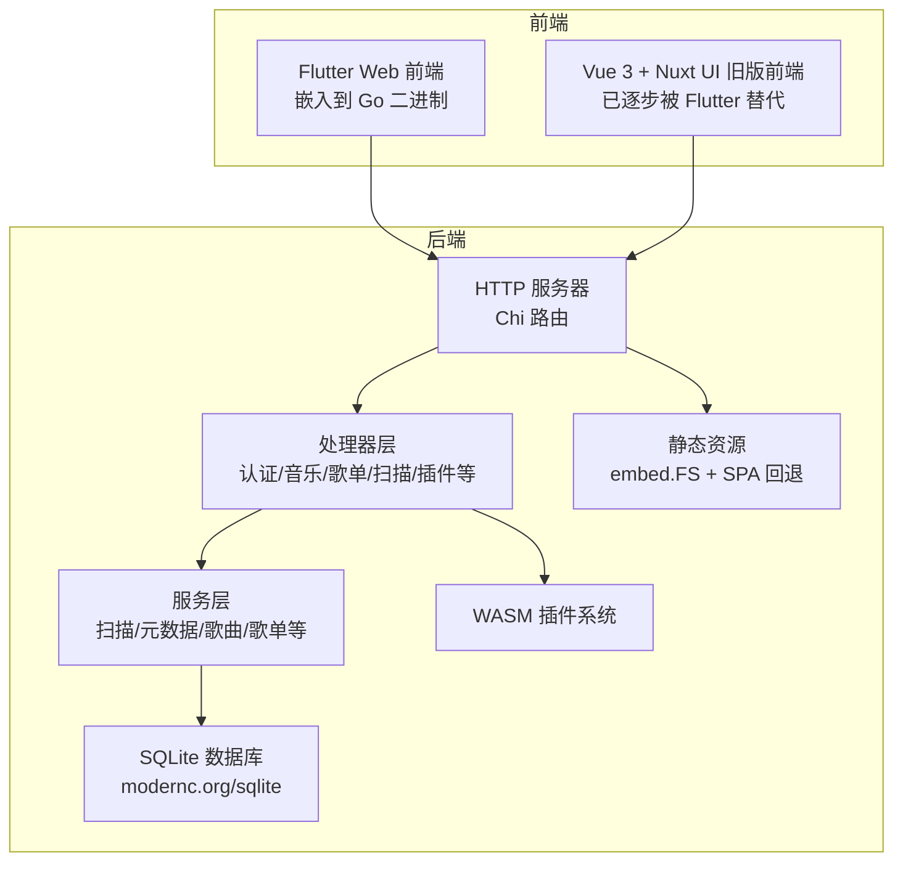
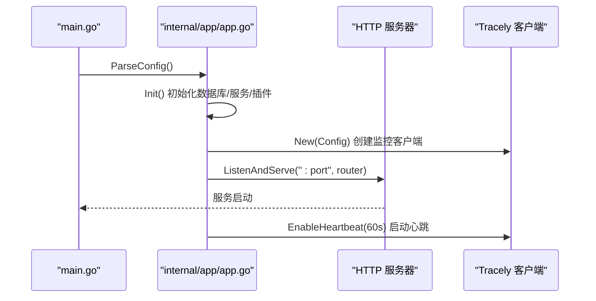
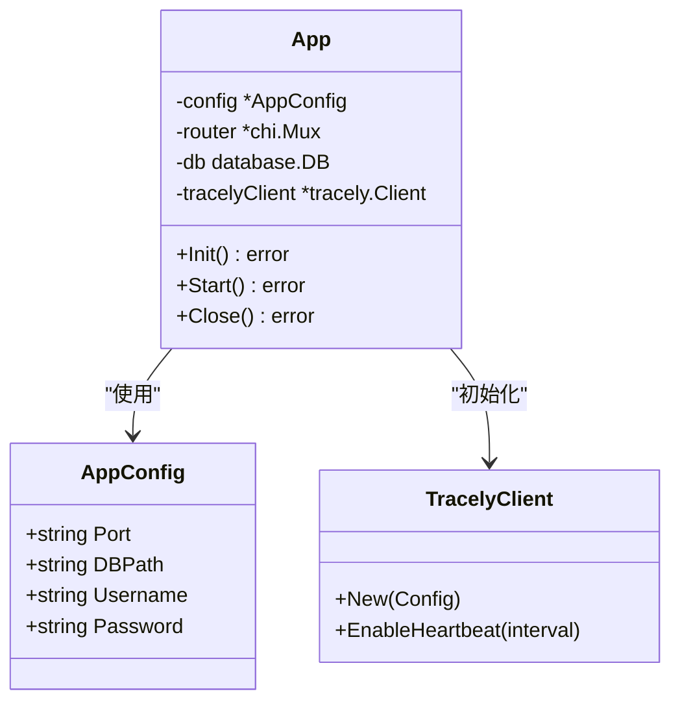
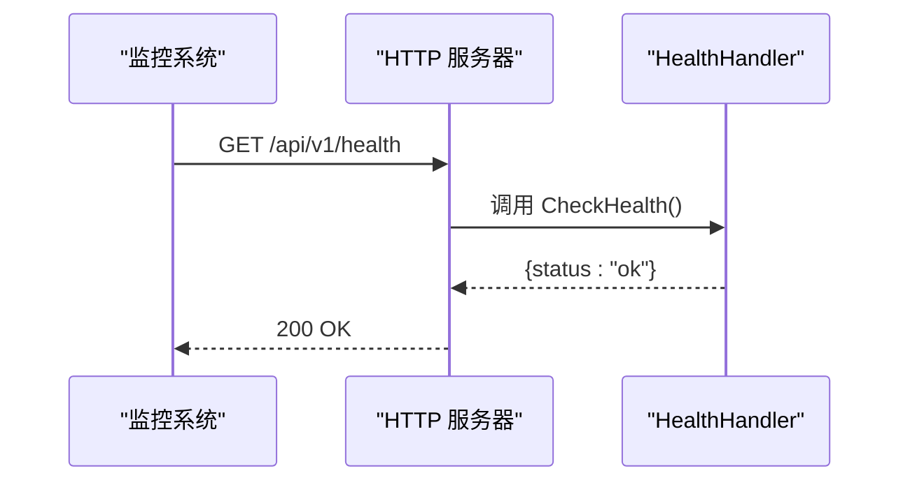
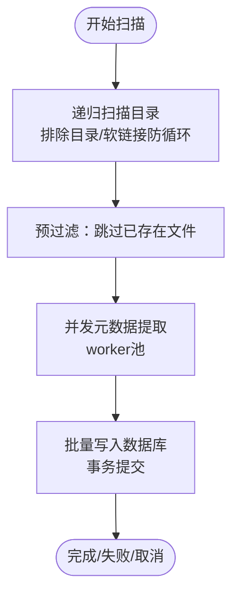
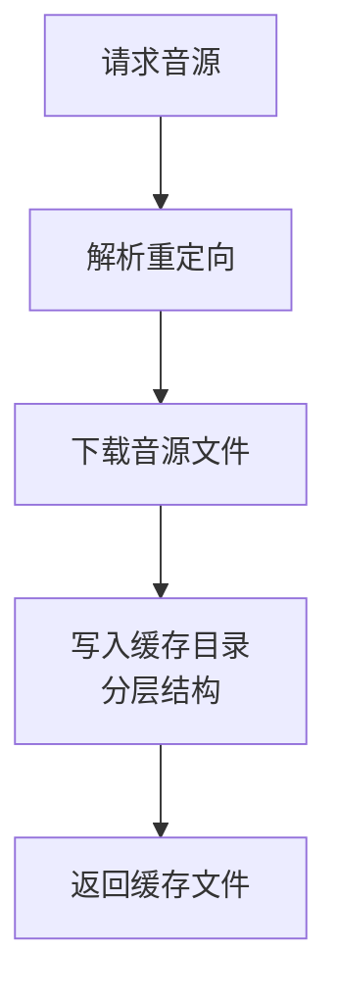
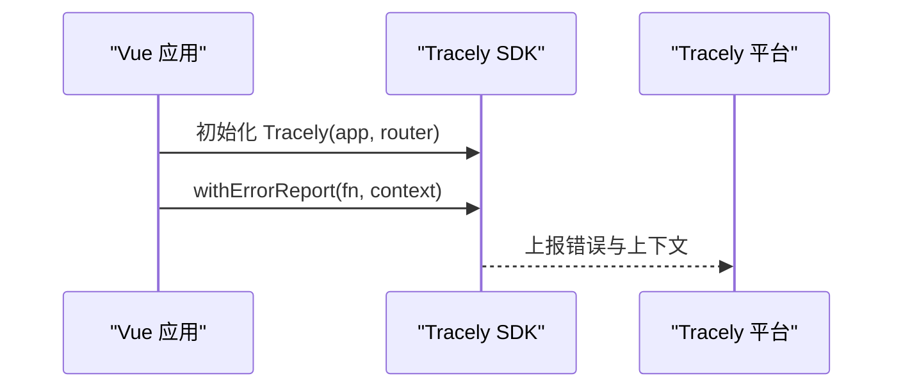
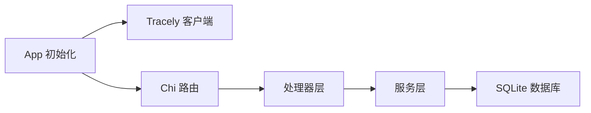

# 系统资源监控

<cite>
**本文引用的文件**
- [main.go](file://main.go)
- [app.go](file://internal/app/app.go)
- [health.go](file://internal/handlers/health.go)
- [types.go](file://internal/config/types.go)
- [scanner.go](file://internal/services/scanner.go)
- [song_service.go](file://internal/services/song_service.go)
- [scan_progress.go](file://internal/services/scan_progress.go)
- [metadata.go](file://internal/services/metadata.go)
- [cache.go](file://plugins/songloft-plugin-lxmusic/handlers/cache.go)
- [error.ts](file://web/src/utils/error.ts)
- [main.ts](file://web/src/main.ts)
- [architecture.md](file://docs/architecture.md)
- [README.md](file://README.md)
</cite>

## 目录
1. [简介](#简介)
2. [项目结构](#项目结构)
3. [核心组件](#核心组件)
4. [架构总览](#架构总览)
5. [详细组件分析](#详细组件分析)
6. [依赖分析](#依赖分析)
7. [性能考虑](#性能考虑)
8. [故障排查指南](#故障排查指南)
9. [结论](#结论)
10. [附录](#附录)

## 简介
本指南面向在 Go 应用中实现系统资源监控的需求，结合 Songloft 项目的现有架构与组件，提供一套可落地的监控方案。重点涵盖：
- 如何在 Go 应用中采集 CPU 使用率、内存占用、goroutine 数量、垃圾回收统计等指标
- 如何监控磁盘空间使用情况，特别是音乐文件存储目录与封面缓存目录
- 如何监控网络层面的连接数、并发请求处理能力与带宽使用
- 如何将监控数据发送至 Tracely 监控平台进行集中分析
- 如何在前端侧通过 Tracely SDK 捕获错误与性能数据

## 项目结构
Songloft 采用前后端分离架构，后端基于 Go + Chi 路由，前端包含 Flutter Web 与 Vue 3（已逐步被 Flutter 替代）。应用通过嵌入静态资源提供 Web 控制台，并通过 REST API 提供音乐管理能力。

图表来源
- [architecture.md](file://docs/architecture.md)
- [main.go](file://main.go)
- [app.go](file://internal/app/app.go)

章节来源
- [architecture.md](file://docs/architecture.md)
- [README.md](file://README.md)
- [main.go](file://main.go)
- [app.go](file://internal/app/app.go)

## 核心组件
- 应用入口与配置解析：负责解析命令行参数与环境变量，初始化应用并启动 HTTP 服务器
- 应用初始化与监控客户端：在初始化阶段创建 Tracely 监控客户端，开启心跳上报与版本标签
- 健康检查处理器：提供 /api/v1/health 接口，便于外部探活与监控
- 扫描与元数据服务：负责本地音乐扫描、并发元数据提取与批量入库，涉及 CPU/IO 密集型任务
- 插件缓存与磁盘 I/O：插件缓存目录用于音源下载与缓存，影响磁盘空间与 I/O
- 前端 Tracely SDK：在浏览器侧初始化 Tracely，上报错误与性能数据

章节来源
- [main.go](file://main.go)
- [app.go](file://internal/app/app.go)
- [health.go](file://internal/handlers/health.go)
- [scanner.go](file://internal/services/scanner.go)
- [song_service.go](file://internal/services/song_service.go)
- [metadata.go](file://internal/services/metadata.go)
- [cache.go](file://plugins/songloft-plugin-lxmusic/handlers/cache.go)
- [error.ts](file://web/src/utils/error.ts)
- [main.ts](file://web/src/main.ts)

## 架构总览
下图展示了应用启动、路由注册与监控集成的关键流程：

图表来源
- [main.go](file://main.go)
- [app.go](file://internal/app/app.go)

章节来源
- [main.go](file://main.go)
- [app.go](file://internal/app/app.go)

## 详细组件分析

### 应用启动与监控初始化
- 配置解析：支持命令行参数与环境变量，优先级明确
- 应用初始化：创建数据库、服务层、插件管理器，并初始化 Tracely 监控客户端
- HTTP 服务器：绑定端口并启动监听
- 监控客户端：配置 AppID、AppSecret、Host、心跳间隔与版本标签

图表来源
- [types.go](file://internal/config/types.go)
- [app.go](file://internal/app/app.go)

章节来源
- [types.go](file://internal/config/types.go)
- [app.go](file://internal/app/app.go)

### 健康检查与可观测性
- 健康检查接口：提供 /api/v1/health，返回服务健康状态
- 建议：在外部监控系统中定期探测该接口，结合 Tracely 心跳与错误上报，形成端到端可观测性

图表来源
- [health.go](file://internal/handlers/health.go)

章节来源
- [health.go](file://internal/handlers/health.go)

### 扫描与元数据提取：CPU/IO 密集场景
- 扫描器：递归扫描音乐目录，支持排除目录与软链接防循环
- 元数据提取：优先使用 tag 库提取基础元数据，辅以 ffprobe 获取精确技术参数（时长、比特率、采样率）
- 并发与批处理：扫描流程采用 worker 池并发提取元数据，批量写入数据库，减少磁盘 fsync 次数与 WAL 刷写开销

图表来源
- [scanner.go](file://internal/services/scanner.go)
- [song_service.go](file://internal/services/song_service.go)
- [metadata.go](file://internal/services/metadata.go)

章节来源
- [scanner.go](file://internal/services/scanner.go)
- [song_service.go](file://internal/services/song_service.go)
- [metadata.go](file://internal/services/metadata.go)

### 插件缓存与磁盘 I/O
- 缓存目录：插件缓存采用分层目录结构，避免单目录文件过多
- 下载与缓存：解析重定向后下载音源，写入缓存并返回响应
- 磁盘空间监控：建议定期统计缓存目录与音乐目录的占用，设置阈值告警

图表来源
- [cache.go](file://plugins/songloft-plugin-lxmusic/handlers/cache.go)

章节来源
- [cache.go](file://plugins/songloft-plugin-lxmusic/handlers/cache.go)

### 前端错误与性能上报
- Tracely SDK 初始化：在浏览器侧初始化 Tracely，传入应用标识与主机地址
- 错误上报：提供 reportError 与 withErrorReport 工具，自动上报捕获的错误
- 建议：在关键业务流程（如播放、搜索、导入）包裹 withErrorReport，提升前端可观测性

图表来源
- [main.ts](file://web/src/main.ts)
- [error.ts](file://web/src/utils/error.ts)

章节来源
- [main.ts](file://web/src/main.ts)
- [error.ts](file://web/src/utils/error.ts)

## 依赖分析
- 应用依赖 Chi 路由、SQLite 驱动、JWT 认证、WASM 插件系统与 Tracely 监控
- 监控客户端在应用初始化阶段创建，支持心跳与标签（版本）

图表来源
- [app.go](file://internal/app/app.go)
- [architecture.md](file://docs/architecture.md)

章节来源
- [app.go](file://internal/app/app.go)
- [architecture.md](file://docs/architecture.md)

## 性能考虑
- 扫描与导入：采用 worker 池并发提取元数据，批量事务写入，减少磁盘 IO 与锁竞争
- 元数据提取：优先使用 tag 库，ffprobe 仅用于精确技术参数，平衡性能与准确性
- 插件缓存：分层目录结构避免单目录文件过多，提升文件系统性能
- 建议：在高负载场景下，适当调整 worker 数量与批处理大小，结合监控指标动态调优

章节来源
- [song_service.go](file://internal/services/song_service.go)
- [metadata.go](file://internal/services/metadata.go)
- [cache.go](file://plugins/songloft-plugin-lxmusic/handlers/cache.go)

## 故障排查指南
- 健康检查：通过 /api/v1/health 快速判断服务状态
- 日志与错误：后端使用 slog 输出结构化日志；前端通过 Tracely SDK 主动上报错误
- 扫描异常：关注扫描进度管理器的状态与错误信息，结合日志定位失败原因
- 磁盘空间：定期检查音乐目录与封面/缓存目录的占用，设置阈值告警

章节来源
- [health.go](file://internal/handlers/health.go)
- [scan_progress.go](file://internal/services/scan_progress.go)
- [error.ts](file://web/src/utils/error.ts)

## 结论
通过在应用初始化阶段集成 Tracely 监控客户端、在关键业务流程中埋点日志与错误上报，并结合磁盘空间与网络层面的观测指标，Songloft 能够实现端到端的系统资源监控。建议在生产环境中持续关注 CPU/内存/Goroutine/垃圾回收、磁盘空间与网络连接等关键指标，配合 Tracely 平台进行集中分析与告警。

## 附录
- 监控指标建议
  - CPU 使用率：通过系统级监控工具采集
  - 内存占用：使用 runtime 包获取内存统计信息，关注 Alloc、Sys、NumGC 等指标
  - Goroutine 数量：通过 runtime.NumGoroutine() 获取
  - 垃圾回收统计：通过 runtime.ReadMemStats() 获取 GC 相关统计
  - 磁盘空间：针对音乐目录、封面缓存目录与插件数据目录进行定期统计
  - 网络监控：关注 HTTP 服务器连接数、并发请求处理能力与带宽使用情况
- 代码示例路径（不展示具体代码内容）
  - 应用初始化与监控客户端创建：[app.go](file://internal/app/app.go)
  - 健康检查接口：[health.go](file://internal/handlers/health.go)
  - 扫描与元数据提取流程：[scanner.go](file://internal/services/scanner.go)、[song_service.go](file://internal/services/song_service.go)、[metadata.go](file://internal/services/metadata.go)
  - 插件缓存与磁盘 I/O：[cache.go](file://plugins/songloft-plugin-lxmusic/handlers/cache.go)
  - 前端 Tracely SDK 初始化与错误上报：[main.ts](file://web/src/main.ts)、[error.ts](file://web/src/utils/error.ts)