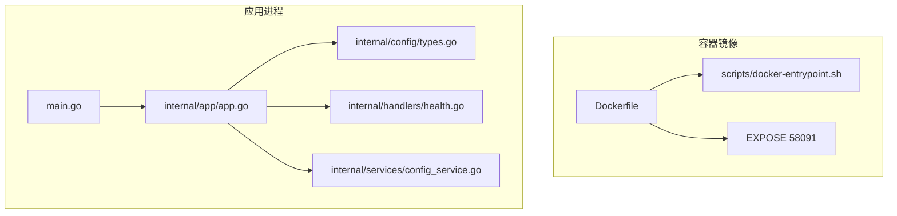
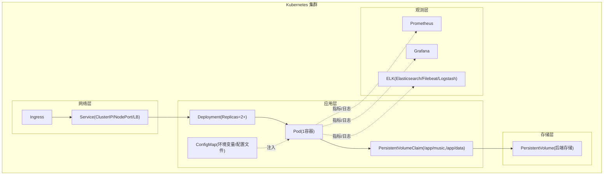
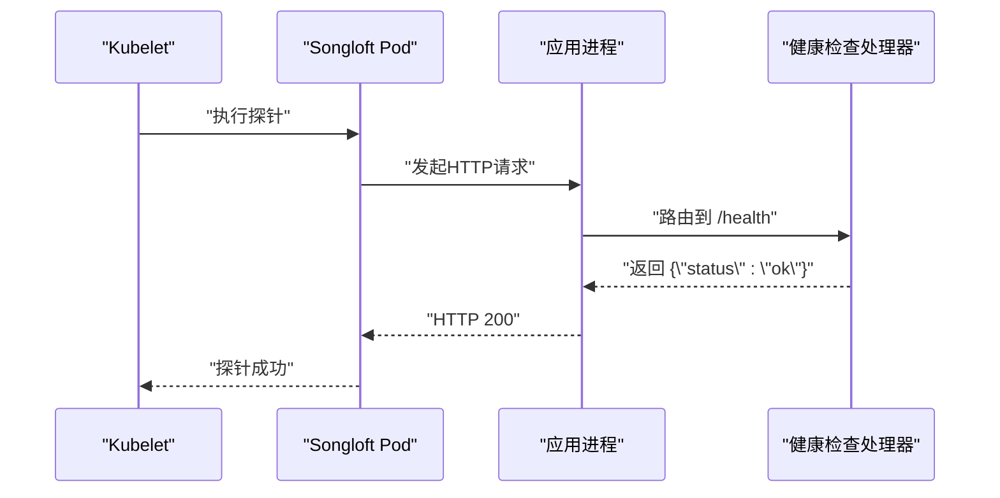
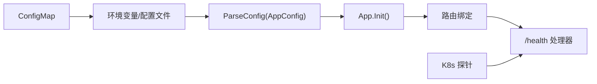

# Kubernetes 部署

<cite>
**本文引用的文件**
- [Dockerfile](file://Dockerfile)
- [scripts/docker-entrypoint.sh](file://scripts/docker-entrypoint.sh)
- [main.go](file://main.go)
- [internal/app/app.go](file://internal/app/app.go)
- [internal/config/types.go](file://internal/config/types.go)
- [internal/handlers/health.go](file://internal/handlers/health.go)
- [internal/services/config_service.go](file://internal/services/config_service.go)
- [docs/quick-start.md](file://docs/quick-start.md)
</cite>

## 目录
1. [简介](#简介)
2. [项目结构](#项目结构)
3. [核心组件](#核心组件)
4. [架构总览](#架构总览)
5. [详细组件分析](#详细组件分析)
6. [依赖关系分析](#依赖关系分析)
7. [性能考虑](#性能考虑)
8. [故障排查指南](#故障排查指南)
9. [结论](#结论)
10. [附录](#附录)

## 简介
本指南面向在 Kubernetes 中部署 Songloft 的运维与开发者，提供从 Deployment、Service、ConfigMap、PersistentVolume 到 Ingress、Helm Chart 以及监控与日志的全栈实践建议。内容基于代码仓库中的容器镜像构建、应用启动流程、端口暴露、健康检查与配置管理能力进行设计，确保在集群中实现高可用、可滚动升级、可观测与可维护。

## 项目结构
- 容器镜像与入口脚本
  - Dockerfile 定义了基础镜像、多阶段构建、二进制复制、卷挂载点与端口暴露。
  - docker-entrypoint.sh 提供二进制热替换升级能力，便于镜像版本更新时的平滑升级。
- 应用启动与配置
  - main.go 作为入口，调用内部应用初始化与启动逻辑。
  - internal/app/app.go 负责解析配置、初始化数据库、服务与插件管理器，并绑定路由。
  - internal/config/types.go 定义应用配置结构。
- 运行时与健康检查
  - EXPOSE 58091 暴露服务端口；docker-entrypoint.sh 在启动前完成版本比对与热替换。
  - 内置健康检查接口 /health 用于存活/就绪探针。
- 配置管理
  - ConfigService 提供键值与 JSON 配置的读写与缓存，支持运行时配置更新。
- 快速开始与端口说明
  - docs/quick-start.md 提供端口、环境变量与运行示例，便于映射到 Kubernetes 的 Service 与探针配置。

**图示来源**
- [Dockerfile:64](file://Dockerfile#L64)
- [scripts/docker-entrypoint.sh:1-127](file://scripts/docker-entrypoint.sh#L1-L127)
- [main.go:30-64](file://main.go#L30-L64)
- [internal/app/app.go:28-53](file://internal/app/app.go#L28-L53)
- [internal/config/types.go:3-9](file://internal/config/types.go#L3-L9)
- [internal/handlers/health.go:15-27](file://internal/handlers/health.go#L15-L27)
- [internal/services/config_service.go:15-27](file://internal/services/config_service.go#L15-L27)

**章节来源**
- [Dockerfile:1-77](file://Dockerfile#L1-L77)
- [scripts/docker-entrypoint.sh:1-127](file://scripts/docker-entrypoint.sh#L1-L127)
- [main.go:1-64](file://main.go#L1-L64)
- [internal/app/app.go:1-353](file://internal/app/app.go#L1-L353)
- [internal/config/types.go:1-10](file://internal/config/types.go#L1-L10)
- [internal/handlers/health.go:1-28](file://internal/handlers/health.go#L1-L28)
- [internal/services/config_service.go:1-198](file://internal/services/config_service.go#L1-L198)
- [docs/quick-start.md:175-206](file://docs/quick-start.md#L175-L206)

## 核心组件
- 应用容器
  - 基于 Alpine 的最小镜像，内置证书与时区；暴露 58091 端口；声明 /app/music 与 /app/data 两个卷。
  - 入口脚本负责镜像内二进制与数据目录二进制的版本对比与热替换，保证镜像更新时的数据持久化与平滑升级。
- 应用启动与配置
  - main.go 调用 ParseConfig 解析命令行与环境变量，随后初始化应用并启动 HTTP 服务。
  - internal/app/app.go 负责数据库初始化、服务层装配、插件管理器与路由绑定；默认监听端口来自配置。
- 健康检查
  - 提供 /health 接口，可用于 Kubernetes 的 liveness/readiness 探针。
- 配置管理
  - ConfigService 支持键值与 JSON 配置的读写与缓存，适合通过 ConfigMap 动态注入配置键并在运行时更新。

**章节来源**
- [Dockerfile:45-77](file://Dockerfile#L45-L77)
- [scripts/docker-entrypoint.sh:76-127](file://scripts/docker-entrypoint.sh#L76-L127)
- [main.go:30-64](file://main.go#L30-L64)
- [internal/app/app.go:64-227](file://internal/app/app.go#L64-L227)
- [internal/handlers/health.go:15-27](file://internal/handlers/health.go#L15-L27)
- [internal/services/config_service.go:15-198](file://internal/services/config_service.go#L15-L198)

## 架构总览
下图展示 Songloft 在 Kubernetes 中的典型部署形态：Deployment 管理 Pod 副本与滚动更新；Service 对外暴露；Ingress 接收外部流量；ConfigMap 管理配置；PersistentVolumeClaim 提供持久化存储。

[本图为概念性示意，不直接映射具体源文件，故不提供“图示来源”]

## 详细组件分析

### Deployment 配置要点
- 副本数与滚动更新
  - 建议副本数 ≥ 2，结合滚动更新策略实现零停机升级。
  - 使用分阶段滚动更新，配合 readinessProbe 保障流量只在就绪后接入。
- 资源限制
  - CPU/内存 requests/limits 建议根据实际负载压测结果设定，避免突发流量导致 OOM 或调度失败。
- 健康检查
  - livenessProbe: 指向 /health，间隔与超时合理设置，失败阈值适中。
  - readinessProbe: 指向 /health，确保应用完全启动后再接收流量。
- 环境变量与配置
  - 使用 ConfigMap 注入 ADMIN_USERNAME、ADMIN_PASSWORD、LISTEN_PORT、DB_PATH 等。
  - 若需动态配置，可通过 ConfigMap 管理键值并在运行时通过 API 更新。
- 卷与持久化
  - 挂载 PVC 到 /app/music 与 /app/data，确保音乐文件与应用数据持久化。
- 安全与网络
  - 限制容器权限，使用非 root 用户（若镜像允许）；开启 NetworkPolicy 控制入站/出站。

[本节为通用实践说明，不直接分析具体源文件，故不提供“章节来源”]

### Service 配置方案
- ClusterIP
  - 默认集群内访问，适合与 Ingress 或同集群其他组件通信。
- NodePort
  - 便于快速调试与临时访问，生产环境建议配合防火墙策略。
- LoadBalancer
  - 在云厂商环境中自动分配公网 IP，适合对外暴露。
- 端口映射与流量路由
  - Service 端口映射到 Pod 的 58091 端口；若使用 Ingress，可配置路径前缀或主机名路由。

[本节为通用实践说明，不直接分析具体源文件，故不提供“章节来源”]

### ConfigMap 管理
- 环境变量注入
  - 通过 envFrom 或 env 将 ConfigMap 注入容器环境变量，覆盖默认值。
- 配置文件挂载
  - 将 ConfigMap 以文件形式挂载到应用可读取的配置路径，实现配置热更新（需应用支持）。
- 动态配置更新
  - 应用侧支持 JSON/键值配置读写与缓存，可结合 ConfigMap 与 API 实现运行时更新。

**章节来源**
- [internal/services/config_service.go:15-198](file://internal/services/config_service.go#L15-L198)
- [docs/quick-start.md:175-186](file://docs/quick-start.md#L175-L186)

### PersistentVolume 与 PersistentVolumeClaim
- 存储类选择
  - 根据后端存储类型（NFS、云盘、本地盘）选择合适的 StorageClass。
- 容量设置
  - /app/music 与 /app/data 的 PVC 容量应满足音乐库规模与日志/缓存增长预期。
- 数据持久化策略
  - 建议将 /app/data 与插件数据目录纳入持久化，避免重启丢失配置与插件状态。
- 卷回收策略
  - 生产环境建议使用 Retain 策略，防止误删数据。

[本节为通用实践说明，不直接分析具体源文件，故不提供“章节来源”]

### Ingress 配置示例
- TLS 终止
  - 在 Ingress 上配置 TLS Secret，实现 HTTPS 终止与证书管理。
- 路径路由
  - 将 /api/* 路径转发至 Service；若前端与后端分离，可分别配置静态资源与 API 路由。
- 负载均衡
  - 结合 Service 的会话亲和性与 Pod 副本数，确保请求稳定分发。

[本节为通用实践说明，不直接分析具体源文件，故不提供“章节来源”]

### Helm Chart 开发指南
- 模板化部署
  - 将 Deployment、Service、Ingress、ConfigMap、PVC/PV、RBAC 等抽象为可配置模板。
- 值文件管理
  - 使用 values.yaml 管理副本数、镜像、资源、探针、Ingress 与存储参数；通过 values.prod.yaml 管理生产环境差异化。
- 版本升级
  - 采用滚动升级策略，结合 pre-upgrade/post-upgrade Hook 执行数据库迁移或配置迁移。
- 可观测性集成
  - 通过注解或独立 CRD 部署 Prometheus Operator、Grafana 与 ELK Stack，采集指标与日志。

[本节为通用实践说明，不直接分析具体源文件，故不提供“章节来源”]

### 健康检查与探针序列图

**图示来源**
- [internal/handlers/health.go:15-27](file://internal/handlers/health.go#L15-L27)
- [internal/app/app.go:229-241](file://internal/app/app.go#L229-L241)

## 依赖关系分析
- 容器镜像与应用进程
  - Dockerfile 定义端口与卷；入口脚本负责二进制热替换；应用启动后绑定路由并提供 /health。
- 配置链路
  - ConfigMap → 环境变量/配置文件 → 应用配置解析 → ConfigService 缓存与读写。
- 健康检查链路
  - K8s 探针 → 应用路由 → 健康处理器 → 返回状态。

**图示来源**
- [Dockerfile:64](file://Dockerfile#L64)
- [scripts/docker-entrypoint.sh:120-127](file://scripts/docker-entrypoint.sh#L120-L127)
- [main.go:30-64](file://main.go#L30-L64)
- [internal/app/app.go:287-352](file://internal/app/app.go#L287-L352)
- [internal/handlers/health.go:15-27](file://internal/handlers/health.go#L15-L27)

**章节来源**
- [Dockerfile:45-77](file://Dockerfile#L45-L77)
- [scripts/docker-entrypoint.sh:76-127](file://scripts/docker-entrypoint.sh#L76-L127)
- [main.go:30-64](file://main.go#L30-L64)
- [internal/app/app.go:287-352](file://internal/app/app.go#L287-L352)
- [internal/handlers/health.go:15-27](file://internal/handlers/health.go#L15-L27)

## 性能考虑
- 资源配额
  - 根据音乐扫描、封面提取与插件运行时负载压测设定 requests/limits，避免突发流量导致 OOM。
- 存储性能
  - 选择高性能存储类；将 /app/music 与 /app/data 分离，减少 IO 竞争。
- 网络与连接
  - 合理设置探针间隔与超时，避免频繁探测影响吞吐；Ingress 层面开启连接复用与压缩。
- 插件与运行时
  - 插件数量与复杂度会影响内存占用；建议在独立命名空间隔离插件资源。

[本节为通用指导，不直接分析具体源文件，故不提供“章节来源”]

## 故障排查指南
- 健康检查失败
  - 检查 /health 是否可达；确认探针超时与失败阈值设置；查看 Pod 日志定位异常。
- 升级后无法访问
  - 核对滚动更新策略与探针配置；确认入口脚本热替换是否成功；检查 ConfigMap/环境变量变更。
- 数据丢失或异常
  - 核对 PVC 绑定与存储类；确认 /app/data 与插件数据目录已正确挂载；检查备份与恢复流程。
- 配置不生效
  - 确认 ConfigMap 键名与应用期望一致；检查 ConfigService 缓存与 API 更新流程。

**章节来源**
- [internal/handlers/health.go:15-27](file://internal/handlers/health.go#L15-L27)
- [scripts/docker-entrypoint.sh:76-127](file://scripts/docker-entrypoint.sh#L76-L127)
- [internal/services/config_service.go:114-139](file://internal/services/config_service.go#L114-L139)

## 结论
通过将 Songloft 的容器化能力与 Kubernetes 的编排优势结合，可以实现高可用、可扩展且可观测的音乐服务。建议以 ConfigMap 管理配置、以 PVC 提供持久化、以 Ingress 实现外部访问，并通过 Helm 实现模板化与版本化管理。配合 Prometheus/Grafana 与 ELK，形成完善的监控与日志体系，保障线上稳定运行。

[本节为总结性内容，不直接分析具体源文件，故不提供“章节来源”]

## 附录
- 端口与环境变量参考
  - 端口：58091（EXPOSE）
  - 环境变量：ADMIN_USERNAME、ADMIN_PASSWORD、LISTEN_PORT、DB_PATH
- 快速开始参考
  - Docker 运行示例与环境变量说明可参考快速开始文档。

**章节来源**
- [Dockerfile:64](file://Dockerfile#L64)
- [docs/quick-start.md:175-206](file://docs/quick-start.md#L175-L206)