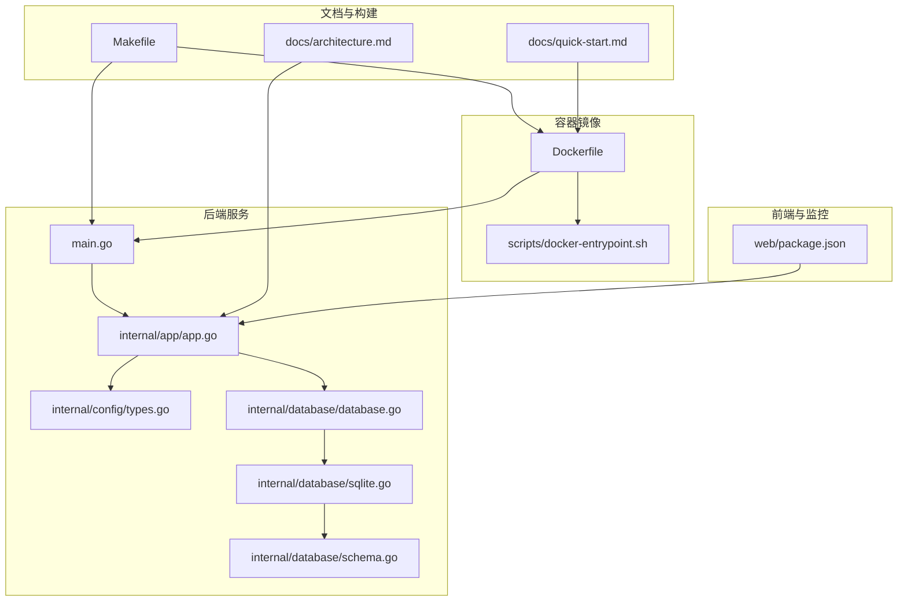
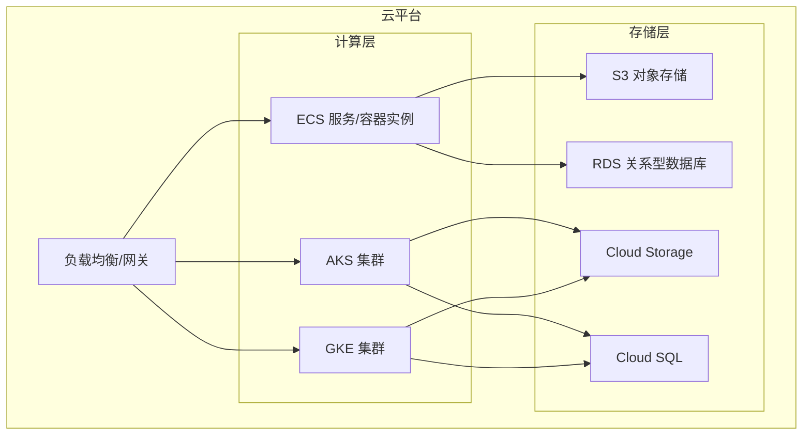
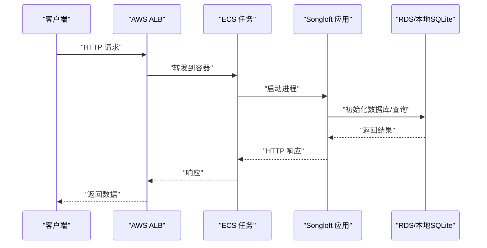
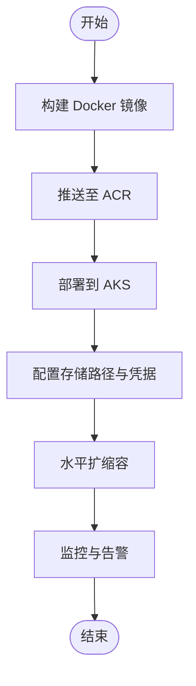
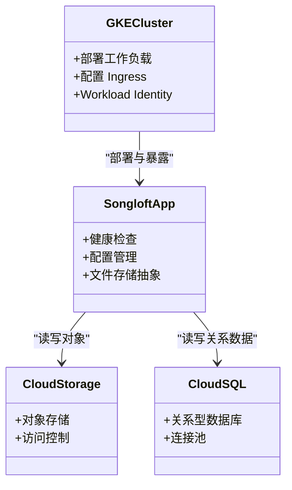
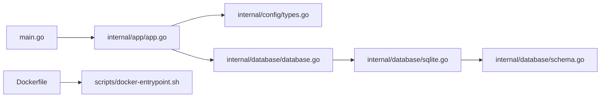

# 云平台部署

<cite>
**本文引用的文件**
- [README.md](file://README.md)
- [Dockerfile](file://Dockerfile)
- [scripts/docker-entrypoint.sh](file://scripts/docker-entrypoint.sh)
- [Makefile](file://Makefile)
- [main.go](file://main.go)
- [internal/app/app.go](file://internal/app/app.go)
- [internal/config/types.go](file://internal/config/types.go)
- [internal/database/database.go](file://internal/database/database.go)
- [internal/database/schema.go](file://internal/database/schema.go)
- [internal/database/sqlite.go](file://internal/database/sqlite.go)
- [docs/architecture.md](file://docs/architecture.md)
- [docs/quick-start.md](file://docs/quick-start.md)
- [web/package.json](file://web/package.json)
</cite>

## 目录
1. [简介](#简介)
2. [项目结构](#项目结构)
3. [核心组件](#核心组件)
4. [架构总览](#架构总览)
5. [详细组件分析](#详细组件分析)
6. [依赖分析](#依赖分析)
7. [性能考虑](#性能考虑)
8. [故障排查指南](#故障排查指南)
9. [结论](#结论)
10. [附录](#附录)

## 简介
本指南面向在云平台上部署 Songloft 的工程师与运维人员，提供覆盖 AWS、Azure、Google Cloud 的多云部署方案，以及云原生（Serverless、微服务、自动扩缩容）与安全、成本优化、监控告警的完整实践建议。Songloft 是一个基于 Go + Chi 的轻量级音乐服务器，内置 SQLite 数据库存储、JWT 双 Token 认证、WASM 插件系统，并提供 Docker 容器化与嵌入式前端的部署能力。本文将结合仓库中的配置与架构文档，给出可落地的云平台部署蓝图。

## 项目结构
- 后端主程序与路由：main.go、internal/app/app.go
- 配置与数据库：internal/config/types.go、internal/database/*
- Docker 与入口脚本：Dockerfile、scripts/docker-entrypoint.sh
- 构建与发布：Makefile
- 架构与快速开始文档：docs/architecture.md、docs/quick-start.md
- 前端与监控：web/package.json（Tracely SDK）

**图示来源**
- [Dockerfile:1-77](file://Dockerfile#L1-L77)
- [scripts/docker-entrypoint.sh:1-127](file://scripts/docker-entrypoint.sh#L1-L127)
- [main.go:1-64](file://main.go#L1-L64)
- [internal/app/app.go:1-353](file://internal/app/app.go#L1-L353)
- [internal/config/types.go:1-10](file://internal/config/types.go#L1-L10)
- [internal/database/database.go:1-118](file://internal/database/database.go#L1-L118)
- [internal/database/sqlite.go:1-80](file://internal/database/sqlite.go#L1-L80)
- [internal/database/schema.go:1-149](file://internal/database/schema.go#L1-L149)
- [Makefile:1-325](file://Makefile#L1-L325)
- [docs/architecture.md:1-248](file://docs/architecture.md#L1-L248)
- [docs/quick-start.md:1-333](file://docs/quick-start.md#L1-L333)
- [web/package.json:1-35](file://web/package.json#L1-L35)

**章节来源**
- [docs/architecture.md:13-37](file://docs/architecture.md#L13-L37)
- [docs/quick-start.md:126-173](file://docs/quick-start.md#L126-L173)
- [Dockerfile:45-77](file://Dockerfile#L45-L77)

## 核心组件
- 应用入口与配置解析：main.go、internal/app/app.go、internal/config/types.go
- 数据库层：internal/database/database.go、internal/database/sqlite.go、internal/database/schema.go
- 容器镜像与启动：Dockerfile、scripts/docker-entrypoint.sh
- 构建与发布：Makefile
- 前端与监控：web/package.json（Tracely SDK）

关键点：
- 监听端口默认 58091，可通过命令行或环境变量配置
- 数据库存储路径可配置，初始化时自动创建目录与表结构
- Docker 镜像暴露 58091 端口，挂载 /app/music 与 /app/data
- 入口脚本支持镜像内二进制热替换升级

**章节来源**
- [internal/app/app.go:287-352](file://internal/app/app.go#L287-L352)
- [internal/config/types.go:3-9](file://internal/config/types.go#L3-L9)
- [internal/database/sqlite.go:22-53](file://internal/database/sqlite.go#L22-L53)
- [internal/database/schema.go:4-149](file://internal/database/schema.go#L4-L149)
- [Dockerfile:64-77](file://Dockerfile#L64-L77)
- [scripts/docker-entrypoint.sh:76-127](file://scripts/docker-entrypoint.sh#L76-L127)
- [Makefile:280-290](file://Makefile#L280-L290)

## 架构总览
后端采用“嵌入式前端 + REST API”的架构，前端资源可嵌入二进制，亦可独立部署。数据库为 SQLite，适合单实例部署；在云上可结合对象存储与关系型数据库实现高可用与弹性。

[本图为概念性架构示意，不直接映射具体源文件，故不附“图示来源”]

## 详细组件分析

### AWS 部署方案
- EC2 实例配置
  - 使用 Docker 镜像运行，挂载音乐与数据目录，暴露 58091 端口
  - 安全组开放 58091，必要时配合 WAF/ALB
- ECS 容器服务部署
  - 使用 AWS ECS/Fargate，任务定义中设置环境变量与卷挂载
  - 健康检查指向 /api/v1/health
- S3 存储配置
  - 将音乐文件与封面存储迁移至 S3，后端通过配置管理读取路径
  - 注意：当前代码默认使用本地文件系统，需扩展文件存储抽象以适配 S3
- RDS 数据库连接
  - 若需共享数据库或高可用，可将 SQLite 迁移至 RDS MySQL/PostgreSQL
  - 需要替换数据库驱动与连接字符串，并迁移表结构

[本图为概念性流程示意，不直接映射具体源文件，故不附“图示来源”]

### Azure 部署策略
- AKS 集群部署
  - 使用 Helm/ARM 模板部署，配置服务类型为 LoadBalancer 或 Ingress
  - 健康检查指向 /api/v1/health
- Azure Container Registry 配置
  - 构建镜像并推送至 ACR，集群拉取最新镜像
- Azure Storage 设置
  - 将音乐与封面迁移至 Blob Storage，后端通过配置管理读取路径
  - 需要扩展文件存储抽象以适配 Azure Blob

[本图为概念性流程示意，不直接映射具体源文件，故不附“图示来源”]

### Google Cloud 部署选项
- GKE 集群配置
  - 使用 Workload Identity 与 Secret Manager 管理敏感信息
  - 配置 Ingress/LoadBalancer，健康检查指向 /api/v1/health
- Cloud Storage
  - 将音乐与封面迁移至 Cloud Storage，后端通过配置管理读取路径
- Cloud SQL 连接
  - 将 SQLite 迁移至 Cloud SQL，替换数据库驱动与连接字符串

[本图为概念性类图示意，不直接映射具体源文件，故不附“图示来源”]

### 云原生部署方案
- Serverless 部署
  - 将后端适配为无状态服务，结合 API Gateway + Lambda/Cloud Run
  - 数据库存储迁移至托管数据库（RDS/Azure Database/Cloud SQL）
- 微服务架构
  - 将插件系统与媒体处理拆分为独立服务，通过消息队列或 gRPC 通信
- 自动扩缩容配置
  - 基于 CPU/内存与 QPS 的 HPA 策略，结合 PodDisruptionBudget 保证可用性

[本节为概念性说明，不直接分析具体源文件，故不附“章节来源”]

### 安全配置
- IAM 权限设置
  - ECS/AKS/GKE 使用最小权限原则，仅授予必要的对象存储与数据库访问权限
- 网络安全组/防火墙
  - 仅开放 58091 端口，配合 WAF/ALB 限制来源 IP
- 密钥管理
  - 使用云平台密钥管理服务（KMS/Key Vault/Secret Manager）存储 JWT 密钥、数据库凭据与第三方 API 密钥

[本节为通用安全实践，不直接分析具体源文件，故不附“章节来源”]

### 成本优化策略
- 资源调度
  - 使用 HPA/自动扩缩容，避免过度配置
- 自动关机
  - 非高峰时段停止开发/测试环境实例
- 预留实例使用
  - 生产环境使用预留实例或 Spot 实例（结合容忍度）

[本节为通用成本优化实践，不直接分析具体源文件，故不附“章节来源”]

### 监控与告警
- CloudWatch/Azure Monitor/Stackdriver 集成
  - 收集应用日志、指标与分布式追踪
- Tracely 集成
  - 前端已集成 Tracely SDK，后端可扩展埋点与上报

**章节来源**
- [web/package.json:14-24](file://web/package.json#L14-L24)
- [docs/architecture.md:129-134](file://docs/architecture.md#L129-L134)

## 依赖分析
- 配置与启动
  - main.go 调用 app.ParseConfig 与 app.NewApp，随后初始化数据库与服务层
- 数据库初始化
  - internal/database/sqlite.go 通过 DSN 参数启用 WAL、设置连接池与超时
  - internal/database/schema.go 定义表结构与索引，并初始化内置歌单与默认配置
- 容器与入口
  - Dockerfile 暴露 58091 端口并挂载 /app/music 与 /app/data
  - scripts/docker-entrypoint.sh 支持二进制热替换升级

**图示来源**
- [main.go:30-63](file://main.go#L30-L63)
- [internal/app/app.go:64-227](file://internal/app/app.go#L64-L227)
- [internal/config/types.go:3-9](file://internal/config/types.go#L3-L9)
- [internal/database/database.go:8-64](file://internal/database/database.go#L8-L64)
- [internal/database/sqlite.go:22-53](file://internal/database/sqlite.go#L22-L53)
- [internal/database/schema.go:4-149](file://internal/database/schema.go#L4-L149)
- [Dockerfile:64-77](file://Dockerfile#L64-L77)
- [scripts/docker-entrypoint.sh:76-127](file://scripts/docker-entrypoint.sh#L76-L127)

**章节来源**
- [internal/app/app.go:64-227](file://internal/app/app.go#L64-L227)
- [internal/database/sqlite.go:22-53](file://internal/database/sqlite.go#L22-L53)
- [internal/database/schema.go:4-149](file://internal/database/schema.go#L4-L149)
- [Dockerfile:64-77](file://Dockerfile#L64-L77)

## 性能考虑
- 数据库优化
  - WAL 模式提升并发读写性能，合理设置连接池与超时
  - 索引覆盖常用查询（歌曲标题、艺术家、歌单标签等）
- 容器与网络
  - 使用 SSD 存储与合适的实例规格，确保 I/O 与网络吞吐
  - 启用 GZIP/压缩与 CDN（若前端独立部署）
- 扩展性
  - 通过水平扩展与缓存（Redis）提升并发能力
  - 将静态资源与封面缓存至对象存储，减轻后端压力

[本节为通用性能建议，不直接分析具体源文件，故不附“章节来源”]

## 故障排查指南
- 健康检查
  - 访问 /api/v1/health 确认服务可用
- 日志与追踪
  - 检查容器日志与云平台监控面板
  - 前端 Tracely SDK 已集成，可用于前端性能与错误追踪
- 数据库问题
  - 确认数据库文件路径与权限，检查 WAL 文件与锁状态
- 升级与回滚
  - docker-entrypoint.sh 支持镜像内二进制热替换，升级失败可回滚到备份版本

**章节来源**
- [docs/quick-start.md:208-225](file://docs/quick-start.md#L208-L225)
- [web/package.json:14-24](file://web/package.json#L14-L24)
- [scripts/docker-entrypoint.sh:76-127](file://scripts/docker-entrypoint.sh#L76-L127)
- [internal/database/sqlite.go:22-53](file://internal/database/sqlite.go#L22-L53)

## 结论
本指南基于 Songloft 的现有架构与容器化能力，给出了在 AWS、Azure、Google Cloud 上的部署蓝图与云原生实践建议。对于需要高可用与弹性扩展的场景，建议将 SQLite 迁移至托管数据库，将音乐与封面迁移至对象存储，并通过 Kubernetes/Serverless 实现弹性伸缩与可观测性。同时，完善 IAM 权限、网络安全与密钥管理，结合监控告警与成本优化策略，可显著提升系统的稳定性与性价比。

## 附录
- 端口与卷
  - 端口：58091
  - 卷：/app/music（音乐）、/app/data（应用数据）
- 环境变量
  - ADMIN_USERNAME、ADMIN_PASSWORD、LISTEN_PORT、DB_PATH
- 健康检查
  - /api/v1/health

**章节来源**
- [Dockerfile:64-77](file://Dockerfile#L64-L77)
- [internal/app/app.go:287-352](file://internal/app/app.go#L287-L352)
- [docs/quick-start.md:208-225](file://docs/quick-start.md#L208-L225)