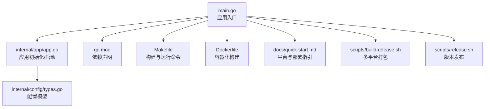
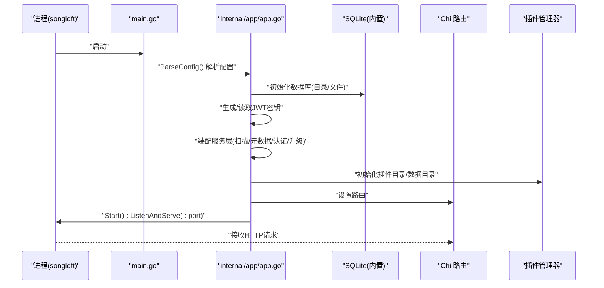
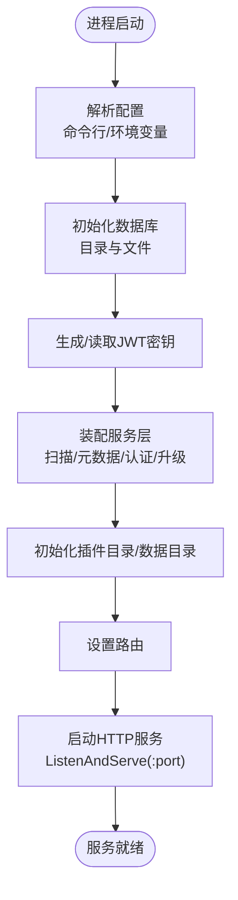
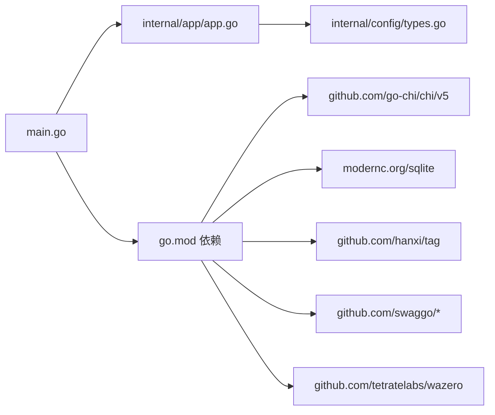

# 传统部署

<cite>
**本文引用的文件**
- [README.md](file://README.md)
- [go.mod](file://go.mod)
- [main.go](file://main.go)
- [Makefile](file://Makefile)
- [internal/app/app.go](file://internal/app/app.go)
- [internal/config/types.go](file://internal/config/types.go)
- [Dockerfile](file://Dockerfile)
- [docs/quick-start.md](file://docs/quick-start.md)
- [scripts/build-release.sh](file://scripts/build-release.sh)
- [scripts/release.sh](file://scripts/release.sh)
</cite>

## 目录
1. [简介](#简介)
2. [项目结构](#项目结构)
3. [核心组件](#核心组件)
4. [架构总览](#架构总览)
5. [详细组件分析](#详细组件分析)
6. [依赖关系分析](#依赖关系分析)
7. [性能考虑](#性能考虑)
8. [故障排查指南](#故障排查指南)
9. [结论](#结论)
10. [附录](#附录)

## 简介
本指南面向希望在传统环境中直接部署 Songloft 的用户，提供从源码编译到二进制部署、手动安装与服务注册、以及跨平台（Linux、Windows、macOS）部署命令与注意事项的全流程说明。同时包含部署前环境检查、依赖验证、防火墙与 SELinux 配置建议，以及部署后的服务状态、端口监听与基础功能验证方法。

## 项目结构
- 顶层入口与构建：main.go、Makefile、go.mod
- 应用初始化与路由：internal/app/app.go
- 配置模型：internal/config/types.go
- 快速开始与平台支持：docs/quick-start.md
- Docker 构建与运行：Dockerfile
- 发布与多平台打包：scripts/build-release.sh、scripts/release.sh

图表来源
- [main.go:1-64](file://main.go#L1-L64)
- [internal/app/app.go:1-353](file://internal/app/app.go#L1-L353)
- [internal/config/types.go:1-10](file://internal/config/types.go#L1-L10)
- [go.mod:1-58](file://go.mod#L1-L58)
- [Makefile:1-325](file://Makefile#L1-L325)
- [Dockerfile:1-77](file://Dockerfile#L1-L77)
- [docs/quick-start.md:1-333](file://docs/quick-start.md#L1-L333)
- [scripts/build-release.sh:1-475](file://scripts/build-release.sh#L1-L475)
- [scripts/release.sh:1-245](file://scripts/release.sh#L1-L245)

章节来源
- [README.md:1-479](file://README.md#L1-L479)
- [go.mod:1-58](file://go.mod#L1-L58)
- [Makefile:1-325](file://Makefile#L1-L325)

## 核心组件
- 应用入口与生命周期：main.go 负责解析配置、初始化应用并启动 HTTP 服务；支持优雅退出信号处理。
- 应用初始化与配置：internal/app/app.go 负责数据库初始化、JWT 密钥生成、服务层装配、插件管理器初始化、Tracely 监控初始化，并设置路由。
- 配置模型：internal/config/types.go 定义应用配置字段（端口、数据库路径、管理员用户名、密码）。
- 构建与运行：Makefile 提供 build/build-prod/build-all 等目标，支持开发/生产、lite/full 两套构建变体。
- Docker 化：Dockerfile 基于 Alpine，内置证书与时区，拷贝二进制与入口脚本，暴露端口并定义卷挂载点。

章节来源
- [main.go:30-63](file://main.go#L30-L63)
- [internal/app/app.go:64-227](file://internal/app/app.go#L64-L227)
- [internal/config/types.go:3-9](file://internal/config/types.go#L3-L9)
- [Makefile:80-175](file://Makefile#L80-L175)
- [Dockerfile:45-77](file://Dockerfile#L45-L77)

## 架构总览
下图展示从进程启动到服务对外提供 API 的关键步骤，以及配置来源与依赖关系。

图表来源
- [main.go:30-63](file://main.go#L30-L63)
- [internal/app/app.go:64-227](file://internal/app/app.go#L64-L227)

## 详细组件分析

### 组件一：配置解析与启动流程
- 配置来源优先级：命令行参数 > 环境变量；支持 -username/-password/-port/-db/-help/-version。
- 默认端口：58091；数据库默认路径 data/songloft.db。
- 启动行为：初始化日志、数据库、JWT 密钥、服务层、插件管理器、Tracely 监控，随后启动 HTTP 服务。

图表来源
- [internal/app/app.go:287-352](file://internal/app/app.go#L287-L352)
- [internal/app/app.go:64-227](file://internal/app/app.go#L64-L227)

章节来源
- [internal/app/app.go:287-352](file://internal/app/app.go#L287-L352)
- [internal/config/types.go:3-9](file://internal/config/types.go#L3-L9)

### 组件二：构建与运行（Makefile）
- 开发构建：make build（dev 标签，不嵌入前端）、make build-full（dev+full 标签，嵌入前端）。
- 生产构建：make build-prod（不嵌入前端）、make build-prod-full（嵌入前端）。
- 多平台：make build-linux-prod / build-windows-prod / build-darwin-prod 及其 full 版本。
- 运行：make run（开发）、make run-prod（生产）。
- 其他：deps、tidy、test、test-coverage、lint、swagger、docker-build、docker-run 等。

章节来源
- [Makefile:80-175](file://Makefile#L80-L175)
- [Makefile:231-241](file://Makefile#L231-L241)
- [Makefile:280-290](file://Makefile#L280-L290)

### 组件三：Docker 构建与运行
- 构建阶段：Alpine 基础镜像，安装编译依赖与 upx，使用缓存挂载加速；根据 FULL_BUILD 参数选择构建完整版或 lite 版本。
- 运行阶段：拷贝二进制与入口脚本，设置时区与证书，暴露端口 58091，定义 /app/music 与 /app/data 卷，设置默认环境变量。
- 运行命令：docker run -p 58091:58091 -v ... -e ...

章节来源
- [Dockerfile:1-77](file://Dockerfile#L1-L77)

### 组件四：发布与多平台打包
- scripts/build-release.sh：构建前端嵌入版本、多平台二进制（lite/full）、生成 version.json、构建 Docker 镜像（含缓存）、生成 checksums.txt、创建/更新 GitHub Release、推送 Docker Hub。
- scripts/release.sh：版本号升级、更新 Makefile/main.go/web/package.json/CHANGELOG.md、打 tag、调用 build-release.sh。

章节来源
- [scripts/build-release.sh:1-475](file://scripts/build-release.sh#L1-L475)
- [scripts/release.sh:1-245](file://scripts/release.sh#L1-L245)

## 依赖关系分析
- 语言与框架：Go 1.26；Chi v5 路由；SQLite（modernc.org/sqlite，纯 Go）。
- 元数据与音频：hanxi/tag（dhowden/tag fork）；ffprobe（可选，用于精确音频参数）。
- Swagger：swaggo/swag 与 http-swagger，开发环境可用。
- WASM 插件：wazero；go-plugin 与 go-plugin-http。

图表来源
- [go.mod:5-21](file://go.mod#L5-L21)
- [main.go:3-9](file://main.go#L3-L9)
- [internal/app/app.go:3-25](file://internal/app/app.go#L3-L25)

章节来源
- [go.mod:1-58](file://go.mod#L1-L58)
- [README.md:453-464](file://README.md#L453-L464)

## 性能考虑
- 生产构建默认启用 -s -w 链接器标志，减少二进制体积；若安装 UPX，构建脚本会自动压缩（部分平台）。
- Docker 镜像使用缓存挂载加速编译，建议在 CI 中复用缓存目录以提升速度。
- 建议在生产环境使用 systemd 等服务管理器托管进程，结合资源限制与健康检查。

章节来源
- [Makefile:13-22](file://Makefile#L13-L22)
- [Makefile:96-116](file://Makefile#L96-L116)
- [scripts/build-release.sh:200-284](file://scripts/build-release.sh#L200-L284)

## 故障排查指南
- 端口占用：确认 58091 未被占用；如需变更，通过命令行参数或环境变量设置端口。
- 权限问题：二进制需可执行；数据目录与音乐目录需具备读写权限。
- 数据库初始化失败：检查 DB_PATH 所在目录是否存在且可写。
- JWT 密钥异常：首次启动会自动生成；如需重置，可删除相关配置或重建数据库。
- Swagger 文档不可用：生产构建默认不包含 Swagger；需使用开发构建或执行 swagger 目标。
- Docker 运行异常：确认镜像标签、卷挂载路径正确；检查容器日志与主机防火墙。

章节来源
- [internal/app/app.go:69-81](file://internal/app/app.go#L69-L81)
- [internal/app/app.go:244-267](file://internal/app/app.go#L244-L267)
- [Makefile:295-303](file://Makefile#L295-L303)
- [Dockerfile:66-77](file://Dockerfile#L66-L77)

## 结论
通过本指南，您可以在 Linux、Windows、macOS 上完成 Songloft 的传统部署：从源码编译到二进制运行，从预编译包下载到手动安装与服务注册。建议在生产环境使用 systemd 管理服务、配置防火墙与 SELinux 规则，并结合健康检查与日志监控保障稳定运行。

## 附录

### 部署前环境检查清单
- 操作系统与架构：Linux / macOS / Windows，x86_64 / ARM64 / ARMv7。
- Go 版本：1.26+（Makefile 要求 1.25.6+，项目 go.mod 1.26）。
- 可选依赖：ffprobe（用于精确音频参数，不安装也可运行）。
- 磁盘空间：预留数据库与音乐目录空间。
- 防火墙：开放 58091 端口；SELinux：如启用，确保进程可绑定 58091 并读写挂载目录。

章节来源
- [README.md:19-23](file://README.md#L19-L23)
- [go.mod:3](file://go.mod#L3)
- [Makefile:37](file://Makefile#L37)

### 源码编译与可执行文件生成
- 使用 Makefile：
  - 开发构建：make build（lite，不嵌入前端）；make build-full（嵌入前端）。
  - 生产构建：make build-prod（lite）；make build-prod-full（嵌入前端）。
  - 多平台：make build-linux-prod / build-windows-prod / build-darwin-prod 及其 full 版本。
- 交叉编译：make build-cross GOOS=... GOARCH=... OUTPUT=... [EXTRA_TAGS=full]。
- 依赖管理：make deps / make tidy；版本检查：make version。
- Swagger 文档：make swagger（开发环境）。

章节来源
- [Makefile:80-175](file://Makefile#L80-L175)
- [Makefile:176-187](file://Makefile#L176-L187)
- [Makefile:268-279](file://Makefile#L268-L279)
- [Makefile:295-303](file://Makefile#L295-L303)

### 二进制文件部署方式
- 预编译包下载：参考 docs/quick-start.md 的“平台支持”与“二进制文件”章节，按平台与架构选择完整版（-full）或精简版。
- 权限设置：Linux/macOS 需为二进制添加执行权限；Windows 直接运行 exe。
- 运行配置：通过命令行参数或环境变量设置管理员账号、密码、端口与数据库路径；或使用默认值。

章节来源
- [docs/quick-start.md:33-125](file://docs/quick-start.md#L33-L125)
- [docs/quick-start.md:175-207](file://docs/quick-start.md#L175-L207)
- [internal/app/app.go:287-352](file://internal/app/app.go#L287-L352)

### 手动安装部署步骤
- 目录结构建议：
  - music：音乐文件目录（可挂载外部存储）
  - data：应用数据目录（包含数据库与插件数据）
- 配置文件设置：
  - 命令行参数：-username/-password/-port/-db/-help/-version
  - 环境变量：ADMIN_USERNAME、ADMIN_PASSWORD、LISTEN_PORT、DB_PATH
- 服务注册与开机自启：
  - Linux：使用 systemd 创建服务单元，设置 ExecStart 指向二进制，配置 WorkingDirectory、Environment、Volume。
  - Windows：使用 sc 创建服务或使用 NSSM；设置启动参数与工作目录。
  - macOS：使用 launchd 创建 plist，设置 Program、WorkingDirectory、Environment。
- 防火墙与 SELinux：
  - 开放 58091 端口；SELinux 如启用，配置端口策略与目录上下文（semanage、restorecon）。

章节来源
- [docs/quick-start.md:175-207](file://docs/quick-start.md#L175-L207)
- [internal/app/app.go:69-81](file://internal/app/app.go#L69-L81)

### 不同操作系统部署命令与注意事项
- Linux / macOS：
  - 下载完整版：wget .../songloft-linux-amd64-full 或 songloft-darwin-amd64-full
  - 添加执行权限：chmod +x
  - 创建目录：mkdir -p music data
  - 运行：./songloft-... 或 ./songloft-...-full
- Windows：
  - 下载 songloft-windows-amd64-full.exe
  - 创建 music、data 目录
  - 运行：.\songloft-windows-amd64-full.exe
- 注意事项：
  - 端口冲突时修改 -port 或 LISTEN_PORT
  - 首次运行会生成数据库与 JWT 密钥
  - 若需嵌入前端，使用 -full 版本

章节来源
- [docs/quick-start.md:93-125](file://docs/quick-start.md#L93-L125)
- [docs/quick-start.md:112-124](file://docs/quick-start.md#L112-L124)

### 部署后验证方法
- 服务状态检查：systemctl status（Linux）、launchctl（macOS）、sc query（Windows）。
- 端口监听验证：ss -tulnp | grep 58091 或 netstat -an | grep 58091。
- 基本功能测试：
  - 登录：curl -X POST http://localhost:58091/api/v1/auth/login -H "Content-Type: application/json" -d '{"username":"admin","password":"your_secure_password"}'
  - 获取版本：curl http://localhost:58091/api/v1/version
  - 健康检查：curl http://localhost:58091/api/v1/health
  - Swagger（开发构建）：访问 http://localhost:58091/swagger/index.html

章节来源
- [README.md:251-353](file://README.md#L251-L353)
- [Makefile:295-303](file://Makefile#L295-L303)