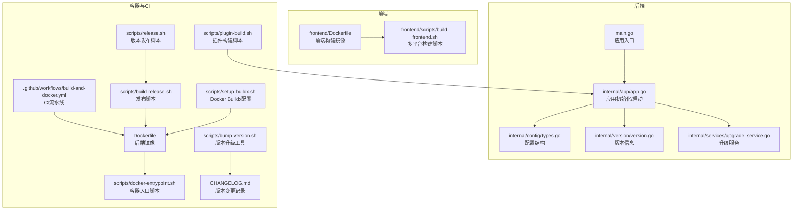
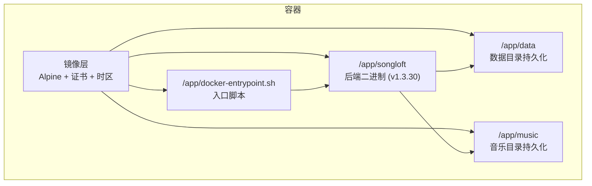
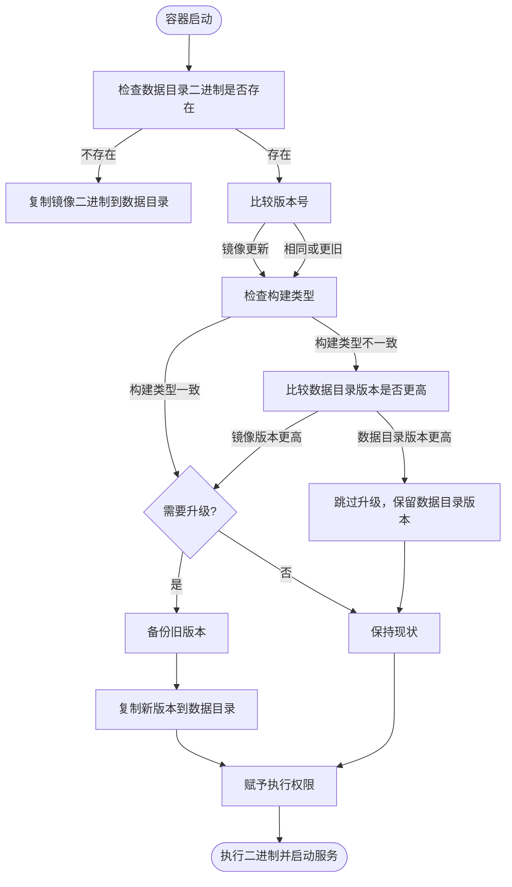
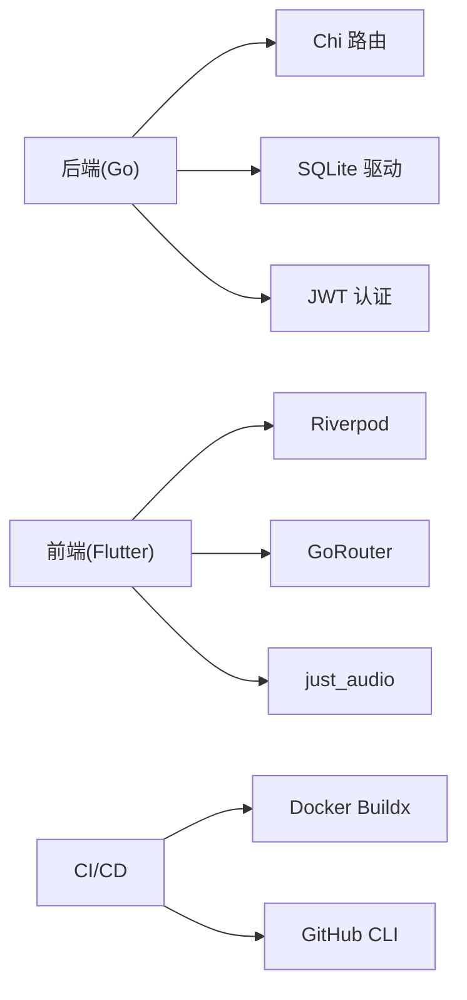
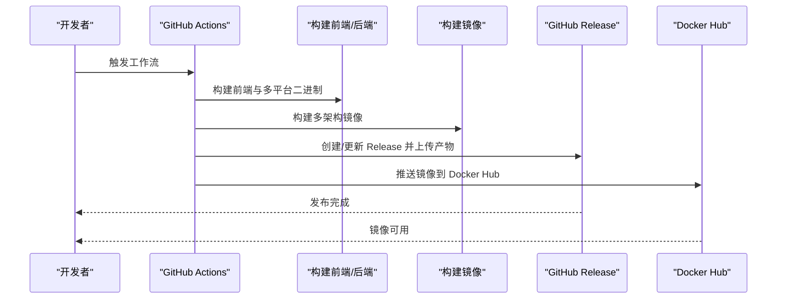

# 部署选项

<cite>
**本文引用的文件**
- [Makefile](file://Makefile)
- [.github/workflows/build-and-docker.yml](file://.github/workflows/build-and-docker.yml)
- [scripts/docker-entrypoint.sh](file://scripts/docker-entrypoint.sh)
- [main.go](file://main.go)
- [internal/app/app.go](file://internal/app/app.go)
- [internal/config/types.go](file://internal/config/types.go)
- [frontend/Dockerfile](file://frontend/Dockerfile)
- [docs/quick-start.md](file://docs/quick-start.md)
- [docs/architecture.md](file://docs/architecture.md)
- [scripts/build-release.sh](file://scripts/build-release.sh)
- [scripts/release.sh](file://scripts/release.sh)
- [frontend/scripts/build-frontend.sh](file://frontend/scripts/build-frontend.sh)
- [internal/version/version.go](file://internal/version/version.go)
- [CHANGELOG.md](file://CHANGELOG.md)
- [scripts/bump-version.sh](file://scripts/bump-version.sh)
- [scripts/setup-buildx.sh](file://scripts/setup-buildx.sh)
- [scripts/plugin-build.sh](file://scripts/plugin-build.sh)
- [frontend/scripts/docker-build-frontend.sh](file://frontend/scripts/docker-build-frontend.sh)
- [internal/services/upgrade_service.go](file://internal/services/upgrade_service.go)
- [internal/models/models.go](file://internal/models/models.go)
</cite>

## 更新摘要
**变更内容**
- Docker入口脚本升级决策逻辑重大改进：增加了更智能的版本比较算法和构建类型一致性检查
- 新增版本比较函数，支持语义化版本号的逐段比较和特殊版本处理
- 增强构建类型检测机制，确保full/lite构建类型的兼容性
- 改进热升级安全性，防止不兼容的构建类型互相替换
- 完善升级决策流程，提供更清晰的升级/跳过原因说明

## 目录
1. [简介](#简介)
2. [项目结构](#项目结构)
3. [核心组件](#核心组件)
4. [架构总览](#架构总览)
5. [详细组件分析](#详细组件分析)
6. [依赖分析](#依赖分析)
7. [性能考虑](#性能考虑)
8. [故障排查指南](#故障排查指南)
9. [结论](#结论)
10. [附录](#附录)

## 简介
本指南面向运维与开发团队，提供 Songloft 的多种部署选项与最佳实践，覆盖传统部署（源码编译、二进制部署、手动安装）、Docker 容器化部署、Kubernetes 编排部署以及云平台（AWS/Azure/Google Cloud）部署策略，并给出不同环境（开发/测试/生产）的配置差异、部署前准备、环境变量、数据库初始化与启动验证流程。

## 项目结构
- 后端为 Go 语言实现，使用 Chi 路由与 SQLite 数据库，支持 WebAssembly 插件系统。
- 前端采用 Flutter Web，支持嵌入到后端二进制或独立部署。
- 提供 Dockerfile 与 GitHub Actions 工作流，支持多平台二进制与 Docker 镜像构建。
- 提供 Makefile 与脚本工具，简化构建、发布与容器入口流程。



**图表来源**
- [main.go:11-12](file://main.go#L11-L12)
- [internal/app/app.go:44-241](file://internal/app/app.go#L44-L241)
- [internal/config/types.go:3-9](file://internal/config/types.go#L3-L9)
- [internal/version/version.go:1-19](file://internal/version/version.go#L1-L19)
- [internal/services/upgrade_service.go:33-53](file://internal/services/upgrade_service.go#L33-L53)
- [frontend/Dockerfile:1-86](file://frontend/Dockerfile#L1-L86)
- [frontend/scripts/build-frontend.sh:1-544](file://frontend/scripts/build-frontend.sh#L1-L544)
- [Dockerfile:1-77](file://Dockerfile#L1-L77)
- [scripts/docker-entrypoint.sh:1-161](file://scripts/docker-entrypoint.sh#L1-L161)
- [.github/workflows/build-and-docker.yml:1-356](file://.github/workflows/build-and-docker.yml#L1-L356)
- [scripts/build-release.sh:1-475](file://scripts/build-release.sh#L1-L475)
- [scripts/release.sh:1-245](file://scripts/release.sh#L1-L245)
- [scripts/bump-version.sh:1-265](file://scripts/bump-version.sh#L1-L265)
- [CHANGELOG.md:1-220](file://CHANGELOG.md#L1-L220)
- [scripts/setup-buildx.sh:1-112](file://scripts/setup-buildx.sh#L1-L112)
- [scripts/plugin-build.sh:1-39](file://scripts/plugin-build.sh#L1-L39)

**章节来源**
- [docs/architecture.md:13-37](file://docs/architecture.md#L13-L37)
- [docs/quick-start.md:33-82](file://docs/quick-start.md#L33-L82)

## 核心组件
- 应用入口与启动：负责解析配置、初始化数据库与服务、启动 HTTP 服务并优雅退出。
- 配置解析：支持命令行参数与环境变量，优先级明确。
- 版本管理：版本信息通过编译时注入，支持完整版本显示。
- 容器入口：支持镜像内二进制热替换升级，保障版本一致性与平滑升级。
- Docker 镜像：多阶段构建，包含后端二进制与前端资源（完整版），并提供最小化运行时。
- CI/CD：自动化构建多平台二进制与 Docker 镜像，支持发布到 GitHub Release 与 Docker Hub。
- 构建系统：统一使用 Makefile 的 `build-cross` 目标进行跨平台构建，增强构建流程的一致性和可维护性。
- 升级服务：提供完整的热升级和回退机制，支持Docker环境下的智能升级决策。

**章节来源**
- [main.go:30-63](file://main.go#L30-L63)
- [internal/app/app.go:287-352](file://internal/app/app.go#L287-L352)
- [internal/config/types.go:3-9](file://internal/config/types.go#L3-L9)
- [internal/version/version.go:10-18](file://internal/version/version.go#L10-L18)
- [scripts/docker-entrypoint.sh:14-161](file://scripts/docker-entrypoint.sh#L14-L161)
- [Dockerfile:4-77](file://Dockerfile#L4-L77)
- [.github/workflows/build-and-docker.yml:293-356](file://.github/workflows/build-and-docker.yml#L293-L356)
- [internal/services/upgrade_service.go:33-53](file://internal/services/upgrade_service.go#L33-L53)

## 架构总览
后端采用"嵌入式前端资源"的完整版（full）与"精简版"（lite）两种形态：
- 完整版：将 Flutter Web 前端资源嵌入到 Go 二进制中，通过 embed.FS 提供静态资源与 SPA 回退。
- 精简版：不嵌入前端，需配合独立前端部署或 Flutter 客户端使用。



**图表来源**
- [Dockerfile:45-77](file://Dockerfile#L45-L77)
- [scripts/docker-entrypoint.sh:7-161](file://scripts/docker-entrypoint.sh#L7-L161)

**章节来源**
- [docs/architecture.md:13-37](file://docs/architecture.md#L13-L37)
- [docs/quick-start.md:22-32](file://docs/quick-start.md#L22-L32)

## 详细组件分析

### 传统部署方式

#### 源码编译部署
- 依赖：Go 版本要求与模块依赖。
- 构建目标：开发版（lite/full）、生产版（lite/full），支持交叉编译与 UPX 压缩。
- 关键步骤：
  - 下载依赖：go mod download
  - 构建二进制：make build 或 make build-prod；完整版使用 -tags full
  - 交叉编译：make build-cross GOOS=... GOARCH=... [EXTRA_TAGS=full]
- 运行：./songloft [-username/-password/-port/-db]，或通过环境变量 ADMIN_USERNAME/ADMIN_PASSWORD/LISTEN_PORT/DB_PATH。

**更新** 构建系统现已现代化，统一使用 Makefile 的 `build-cross` 目标进行跨平台构建，增强了构建流程的一致性和可维护性。同时添加了 GOAMD64=v1 指令集支持以提高硬件兼容性。

**章节来源**
- [Makefile:13-116](file://Makefile#L13-L116)
- [Makefile:176-186](file://Makefile#L176-L186)
- [Makefile:231-241](file://Makefile#L231-L241)
- [Makefile:178-188](file://Makefile#L178-L188)
- [Makefile:3-3](file://Makefile#L3-L3)
- [internal/app/app.go:287-352](file://internal/app/app.go#L287-L352)

#### 二进制文件部署
- 适用场景：快速上线、无需编译环境。
- 版本选择：完整版（-full，自带前端）与精简版（无前端），当前版本为 1.3.30。
- 步骤：
  - 下载对应平台二进制（Linux/Windows/macOS，x86_64/ARM64/ARMv7）。
  - 创建 music 与 data 目录。
  - 运行二进制，或使用 systemd/systemd 安装为服务。
- 验证：访问 http://localhost:58091（完整版），或使用 API 获取版本信息。

**章节来源**
- [docs/quick-start.md:33-82](file://docs/quick-start.md#L33-L82)
- [docs/quick-start.md:93-124](file://docs/quick-start.md#L93-L124)
- [docs/quick-start.md:175-206](file://docs/quick-start.md#L175-L206)

#### 手动安装部署
- 适合离线环境或定制化部署。
- 步骤要点：
  - 准备目录：music（音乐文件）、data（应用数据）、logs（日志，可选）。
  - 配置环境变量或命令行参数，确保管理员凭据与端口正确。
  - 初始化数据库：首次启动会自动创建数据库与目录。
  - 启动服务并扫描音乐库，随后在 Web 界面或 Flutter 客户端中使用。

**章节来源**
- [internal/app/app.go:64-82](file://internal/app/app.go#L64-L82)
- [docs/quick-start.md:175-206](file://docs/quick-start.md#L175-L206)

### Docker 部署方案

#### Dockerfile 构建过程
- 多阶段构建：
  - 第一阶段：golang:1.26-alpine，安装编译依赖，下载 Go 模块，缓存依赖层。
  - 第二阶段：Alpine 运行时，安装证书与时区，复制 ffprobe 与后端二进制，创建 /app/music 与 /app/data 目录。
- 构建参数：
  - FULL_BUILD：控制是否构建完整版（嵌入前端）。
  - GOPROXY：可选代理，加速依赖下载。
  - GIT_COMMIT/BUILD_TIME：注入版本信息。
- 入口与卷：
  - ENTRYPOINT 使用 scripts/docker-entrypoint.sh。
  - VOLUME 定义 /app/music 与 /app/data，建议映射到宿主机持久化目录。

**章节来源**
- [Dockerfile:1-77](file://Dockerfile#L1-L77)

#### 镜像优化策略
- 缓存优化：利用 BuildKit 与缓存挂载（GOMODCACHE/GOCACHE），提升重复构建速度。
- 体积优化：Alpine 基础镜像 + UPX 压缩（生产构建时可选）。
- 多架构：使用 buildx 构建 linux/amd64, linux/arm64, linux/arm/v7。
- 代理加速：通过 GOPROXY 减少网络波动影响。

**章节来源**
- [.github/workflows/build-and-docker.yml:317-356](file://.github/workflows/build-and-docker.yml#L317-L356)
- [Makefile:96-116](file://Makefile#L96-L116)

#### 容器配置与卷挂载
- 端口：58091（可通过环境变量 LISTEN_PORT 覆盖）。
- 环境变量：
  - ADMIN_USERNAME/ADMIN_PASSWORD：管理员账号密码。
  - IN_DOCKER：标记容器环境。
  - 其他：TZ（时区）、MUSIC_DIR/DATA_DIR（可通过挂载替代）。
- 卷：
  - /app/music：音乐文件目录（建议映射宿主机目录）。
  - /app/data：应用数据目录（数据库、插件数据、封面缓存等）。

**章节来源**
- [Dockerfile:66-77](file://Dockerfile#L66-L77)
- [scripts/docker-entrypoint.sh:1-161](file://scripts/docker-entrypoint.sh#L1-L161)
- [docs/quick-start.md:175-186](file://docs/quick-start.md#L175-L186)

#### 容器入口脚本（热升级）

**更新** Docker入口脚本已大幅改进升级决策逻辑，增加了更智能的版本比较和构建类型一致性检查，显著增强了热升级的安全性和可靠性。

- 功能概述：对比镜像内与数据目录中二进制版本，若镜像版本更新则热替换，同时保留备份。
- 新增版本比较函数：支持语义化版本号的逐段比较，处理特殊版本（dev/unknown）和版本后缀（如-beta）。
- 构建类型一致性检查：确保full/lite构建类型的兼容性，防止不兼容类型互相替换。
- 智能升级决策：根据版本比较结果和构建类型差异，提供精确的升级/跳过判断。



**图表来源**
- [scripts/docker-entrypoint.sh:116-146](file://scripts/docker-entrypoint.sh#L116-L146)

**章节来源**
- [scripts/docker-entrypoint.sh:14-161](file://scripts/docker-entrypoint.sh#L14-L161)

### Kubernetes 部署架构
以下为典型部署清单的结构说明（概念性，不绑定具体文件）：
- Deployment：
  - 镜像：songloft/songloft:v1.3.30
  - 环境变量：ADMIN_USERNAME、ADMIN_PASSWORD、LISTEN_PORT、DB_PATH（可选）
  - 卷：使用 PVC 挂载 /app/data；音乐目录可使用 PV/PVC 或只读共享存储。
  - 资源限制：CPU/内存请求与限制，健康探针（就绪/存活）。
- Service：
  - ClusterIP/NodePort/LoadBalancer，暴露 58091 端口。
- ConfigMap：
  - 存放运行时配置（如端口、日志级别等，若后端支持）。
- PersistentVolume/PersistentVolumeClaim：
  - 为 /app/data 提供持久化存储，建议使用 SSD 或高性能存储类。

```mermaid
graph TB
subgraph "K8s"
SVC["Service<br/>ClusterIP/NodePort"]
DEP["Deployment<br/>Pod x N (v1.3.30)"]
CM["ConfigMap<br/>运行时配置"]
PVC["PersistentVolumeClaim<br/>/app/data"]
PV["PersistentVolume<br/>后端存储"]
end
SVC <- --> DEP
DEP --> PVC
PVC --> PV
DEP --> CM
```

[本图为概念性示意，不对应具体源文件]

### 云平台部署选项
- AWS：
  - EC2：使用 systemd 安装二进制或 Docker 容器；使用 EBS 挂载持久化存储。
  - ECS/EKS：使用 Docker 镜像，结合 ECS/EKS Service 与 EFS/PersistentVolume。
  - S3：用于归档日志或备份（需自定义脚本）。
- Azure：
  - VM/ACI/aks-engine/AKS：与 AWS 类似，使用托管磁盘/PersistentVolume。
  - Azure Files：可作为共享存储挂载到 /app/music。
- Google Cloud：
  - GCE/GKE：使用 Container Registry 镜像，Persistent Disk/PersistentVolume。
  - Cloud Storage：日志与备份归档。

[本节为通用云平台策略说明，不直接分析具体源文件]

### 不同环境的最佳实践与配置差异
- 开发环境：
  - 使用 -tags dev 构建，开启调试日志；端口可调整为 58091 或更高。
  - 环境变量：ADMIN_USERNAME/ADMIN_PASSWORD/DB_PATH/LISTEN_PORT。
- 测试环境：
  - 使用完整版（-full）或独立前端部署，便于 UI 测试。
  - 引入只读音乐目录与独立数据卷，避免污染生产数据。
- 生产环境：
  - 使用生产构建（UPX 压缩可选），固定版本标签 v1.3.30，启用健康检查。
  - 使用只读音乐目录与独立数据卷，定期备份 /app/data。
  - 使用反向代理（Nginx/Caddy）与 TLS 终止，暴露 80/443。

**章节来源**
- [Makefile:18-22](file://Makefile#L18-L22)
- [Makefile:92-116](file://Makefile#L92-L116)
- [docs/quick-start.md:175-186](file://docs/quick-start.md#L175-L186)

### 部署前准备
- 系统要求：Linux/macOS/Windows，架构 x86_64/ARM64/ARMv7；可选 ffprobe（用于音频技术参数）。
- 权限与目录：
  - 创建 music 与 data 目录，确保运行用户具有读写权限。
  - 若使用 Docker，确保宿主机挂载目录权限正确。
- 环境变量：
  - ADMIN_USERNAME、ADMIN_PASSWORD（必填）
  - LISTEN_PORT（默认 58091）
  - DB_PATH（默认 data/songloft.db）

**章节来源**
- [docs/quick-start.md:287-292](file://docs/quick-start.md#L287-L292)
- [docs/quick-start.md:175-186](file://docs/quick-start.md#L175-L186)
- [internal/app/app.go:317-351](file://internal/app/app.go#L317-L351)

### 环境变量配置
- ADMIN_USERNAME/ADMIN_PASSWORD：管理员账号密码，优先使用命令行参数，其次环境变量。
- LISTEN_PORT：监听端口，默认 58091。
- DB_PATH：数据库文件路径，默认 data/songloft.db。
- IN_DOCKER：容器环境标记。
- TZ：时区（容器内默认 Asia/Shanghai）。

**章节来源**
- [internal/app/app.go:278-284](file://internal/app/app.go#L278-L284)
- [internal/app/app.go:317-351](file://internal/app/app.go#L317-L351)
- [Dockerfile:49-71](file://Dockerfile#L49-L71)

### 数据库初始化
- 首次启动会自动创建数据库目录与文件。
- 初始化流程：
  - 确保 DB_PATH 所在目录存在且可写。
  - 初始化 SQLite 数据库与表结构。
  - 生成 JWT 密钥并保存到配置表。
  - 创建插件目录与插件数据目录。

**章节来源**
- [internal/app/app.go:64-82](file://internal/app/app.go#L64-L82)
- [internal/app/app.go:244-267](file://internal/app/app.go#L244-L267)
- [internal/app/app.go:175-190](file://internal/app/app.go#L175-L190)

### 启动验证流程
- 健康检查：访问 /api/v1/version 或 /api/v1/health（如存在）。
- 登录验证：POST /api/v1/auth/login 获取 Bearer Token。
- 功能验证：获取歌曲列表与歌单列表，确认扫描与播放功能正常。
- Docker 验证：进入容器检查 /app/data 与 /app/music 卷挂载情况。

**章节来源**
- [docs/quick-start.md:226-256](file://docs/quick-start.md#L226-L256)
- [docs/quick-start.md:258-269](file://docs/quick-start.md#L258-L269)

### 升级服务与热升级机制

**新增** Songloft 提供了完整的热升级和回退机制，特别针对Docker环境进行了优化。

- 升级服务架构：
  - UpgradeService：负责版本检查、下载、测试和替换的完整流程。
  - 支持稳定版（stable）和测试版（dev）两种升级通道。
  - 智能版本比较：优先使用Git提交哈希，其次使用版本号比较。
- 升级流程：
  1. 检查可用更新（FetchVersionInfo）
  2. 下载新版本二进制文件（DownloadBinary）
  3. 测试新版本可用性（TestBinary）
  4. 备份当前版本
  5. 原子替换二进制文件
  6. 设置执行权限并重启服务
- 回退机制：
  - ResetToBaseImage：将容器底包复制回数据目录，确保服务恢复。
  - 支持完整的回退流程，包括备份、替换和重启。
- 进度监控：
  - UpgradeProgress：提供详细的升级进度状态和百分比。
  - 支持实时轮询获取升级状态。
- Docker环境优化：
  - 自动检测底包构建类型（full/lite）。
  - 智能处理构建类型不一致的情况。
  - 提供清晰的升级/跳过原因说明。

**章节来源**
- [internal/services/upgrade_service.go:33-53](file://internal/services/upgrade_service.go#L33-L53)
- [internal/services/upgrade_service.go:129-147](file://internal/services/upgrade_service.go#L129-L147)
- [internal/services/upgrade_service.go:278-338](file://internal/services/upgrade_service.go#L278-L338)
- [internal/services/upgrade_service.go:400-457](file://internal/services/upgrade_service.go#L400-L457)
- [internal/models/models.go:278-295](file://internal/models/models.go#L278-L295)

## 依赖分析
- 后端依赖：
  - Go 标准库、Chi 路由、SQLite 驱动、JWT 认证、Tracely 监控。
- 前端依赖：
  - Flutter 生态（Riverpod、GoRouter、just_audio），构建工具链（Bun/Vite）。
- CI/CD 依赖：
  - Docker Buildx、GitHub CLI、fastforge（用于前端打包，非必需）。



[本图为概念性依赖示意，不对应具体源文件]

**章节来源**
- [docs/architecture.md:97-200](file://docs/architecture.md#L97-L200)
- [frontend/scripts/build-frontend.sh:64-96](file://frontend/scripts/build-frontend.sh#L64-L96)

## 性能考虑
- 构建优化：使用缓存挂载与多阶段构建，减少重复下载与编译时间。
- 运行优化：UPX 压缩可减小二进制体积，但需权衡兼容性；Alpine 运行时减少镜像体积。
- 存储优化：将 /app/data 挂载到高性能存储；音乐目录可使用只读共享存储以提升并发读取性能。
- 网络优化：反向代理缓存静态资源（完整版嵌入前端资源），减少后端压力。

[本节为通用性能建议，不直接分析具体源文件]

## 故障排查指南
- 启动失败：
  - 检查管理员凭据是否通过命令行或环境变量正确传入。
  - 检查 DB_PATH 目录权限与磁盘空间。
- 端口占用：
  - 修改 LISTEN_PORT 或释放 58091 端口。
- Docker 卷问题：
  - 确认 /app/music 与 /app/data 挂载路径与权限正确。
  - 容器入口脚本会自动备份旧版本，若升级失败可回滚。
- 健康检查失败：
  - 使用 /api/v1/version 或 /api/v1/health（如存在）验证服务状态。
  - 查看容器日志与后端日志。
- 升级失败：
  - 检查网络连接和GitHub代理配置。
  - 查看升级进度和错误信息。
  - 使用回退功能恢复到底包版本。

**章节来源**
- [internal/app/app.go:317-351](file://internal/app/app.go#L317-L351)
- [scripts/docker-entrypoint.sh:116-146](file://scripts/docker-entrypoint.sh#L116-L146)
- [docs/quick-start.md:258-269](file://docs/quick-start.md#L258-L269)
- [internal/services/upgrade_service.go:278-338](file://internal/services/upgrade_service.go#L278-L338)

## 结论
Songloft 提供灵活的部署选项：既可直接使用二进制快速上线，也可通过 Docker 与 Kubernetes 实现标准化与弹性扩展。借助 CI/CD 流水线，可自动化构建多平台产物与镜像，并通过版本发布脚本实现稳定发布。针对不同环境，建议采用差异化配置与安全加固策略，确保服务的稳定性与可维护性。最新的Docker入口脚本升级决策逻辑改进，显著提升了热升级的安全性和可靠性，为生产环境提供了更好的保障。

## 附录

### A. CI/CD 与发布流程
- GitHub Actions：
  - 构建前端（Bun/Vite）与多平台后端二进制。
  - 构建 Docker 镜像（多架构），并推送到 Docker Hub。
  - 发布到 GitHub Release，包含校验和文件。
- 发布脚本：
  - scripts/release.sh：升级版本号、更新文档与 CHANGELOG、创建 Git Tag。
  - scripts/build-release.sh：构建二进制、Docker 镜像、生成校验和、创建/更新 Release。



**图表来源**
- [.github/workflows/build-and-docker.yml:29-356](file://.github/workflows/build-and-docker.yml#L29-L356)
- [scripts/build-release.sh:301-343](file://scripts/build-release.sh#L301-L343)
- [scripts/build-release.sh:347-420](file://scripts/build-release.sh#L347-L420)

**章节来源**
- [.github/workflows/build-and-docker.yml:29-356](file://.github/workflows/build-and-docker.yml#L29-L356)
- [scripts/release.sh:112-215](file://scripts/release.sh#L112-L215)
- [scripts/build-release.sh:165-285](file://scripts/build-release.sh#L165-L285)

### B. 前端构建与嵌入
- 前端 Dockerfile：提供 Flutter SDK 与 Android SDK，支持 web/linux/android 构建。
- build-frontend.sh：统一的多平台构建脚本，支持 standalone 与 embedded 两种模式。
- 嵌入模式：通过 -tags full 构建完整版，将 Flutter Web 资源嵌入到后端二进制。

**章节来源**
- [frontend/Dockerfile:1-86](file://frontend/Dockerfile#L1-L86)
- [frontend/scripts/build-frontend.sh:1-544](file://frontend/scripts/build-frontend.sh#L1-L544)
- [Makefile:86-116](file://Makefile#L86-L116)

### C. 版本管理与升级
- 版本信息：当前版本 1.3.30，通过 internal/version/version.go 注入。
- 升级工具：scripts/bump-version.sh 支持自动版本升级与 Git Tag 创建。
- 变更记录：CHANGELOG.md 记录每次版本更新的内容与日期。

**章节来源**
- [internal/version/version.go:1-19](file://internal/version/version.go#L1-L19)
- [scripts/bump-version.sh:1-265](file://scripts/bump-version.sh#L1-L265)
- [CHANGELOG.md:1-220](file://CHANGELOG.md#L1-L220)

### D. 构建系统现代化与指令集兼容性

#### 统一跨平台构建
- 构建目标：`build-cross` 统一处理所有平台的交叉编译任务
- 参数支持：GOOS、GOARCH、GOARM、EXTRA_TAGS、OUTPUT
- 兼容性增强：GOAMD64=v1 指令集支持，提高硬件兼容性

#### CI/CD 构建配置
- GitHub Actions：统一使用 GOAMD64=v1 进行构建
- 多架构矩阵：linux/amd64, linux/arm64, linux/arm/v7, darwin/amd64, darwin/arm64, windows/amd64, windows/arm64
- 自动压缩：对支持的平台自动使用 UPX 压缩

**章节来源**
- [Makefile:178-188](file://Makefile#L178-L188)
- [Makefile:3-3](file://Makefile#L3-L3)
- [.github/workflows/build-and-docker.yml:149-175](file://.github/workflows/build-and-docker.yml#L149-L175)
- [scripts/setup-buildx.sh:1-112](file://scripts/setup-buildx.sh#L1-L112)

### E. Docker Buildx 配置与优化

#### Buildx 配置脚本
- 缓存优化：支持本地缓存目录配置
- 代理支持：可配置 HTTP/HTTPS 代理
- 多架构构建：支持 linux/amd64, linux/arm64, linux/arm/v7
- 构建加速：通过缓存和并行构建提升效率

**章节来源**
- [scripts/setup-buildx.sh:1-112](file://scripts/setup-buildx.sh#L1-L112)

### F. 插件构建与管理

#### 插件构建系统
- 统一构建：scripts/plugin-build.sh 统一管理插件构建
- 自动发现：支持自动发现和构建所有插件
- 输出管理：自动将构建产物复制到 data/plugins 目录

**章节来源**
- [scripts/plugin-build.sh:1-39](file://scripts/plugin-build.sh#L1-L39)

### G. Docker入口脚本升级决策逻辑详解

**新增** Docker入口脚本的升级决策逻辑经过重大改进，提供了更智能和安全的升级机制。

#### 版本比较算法
- 语义化版本号比较：支持主版本、次版本、修订版本的逐段比较。
- 特殊版本处理：dev、unknown等特殊版本的智能识别和处理。
- 版本后缀支持：正确处理版本号后缀（如-beta、-rc等）。
- 逐段比较：使用awk进行精确的版本号比较，避免字符串比较的误差。

#### 构建类型一致性检查
- 构建类型检测：自动检测full和lite两种构建类型的差异。
- 类型兼容性：确保full版本不会被lite版本替换，反之亦然。
- 智能回退：当检测到构建类型不一致时，根据版本高低决定是否回退。

#### 升级决策流程
- 多层次判断：首先比较版本号，其次检查构建类型。
- 条件升级：只有在版本更新或构建类型变更时才进行升级。
- 安全回退：当数据目录版本更高时，优先保留现有版本。
- 清晰反馈：提供详细的升级/跳过原因，便于故障排查。

#### 热升级安全保障
- 原子替换：使用备份机制确保升级过程的原子性。
- 执行权限：自动设置正确的执行权限。
- 完整备份：升级前创建完整的备份文件。
- 失败回滚：升级失败时自动回滚到备份版本。

**章节来源**
- [scripts/docker-entrypoint.sh:14-161](file://scripts/docker-entrypoint.sh#L14-L161)
- [scripts/docker-entrypoint.sh:116-146](file://scripts/docker-entrypoint.sh#L116-L146)