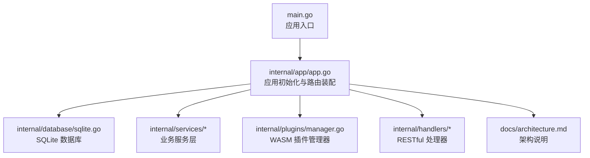
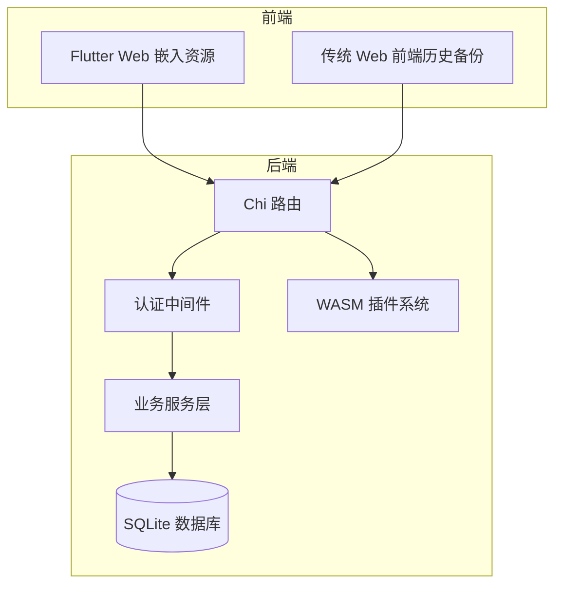
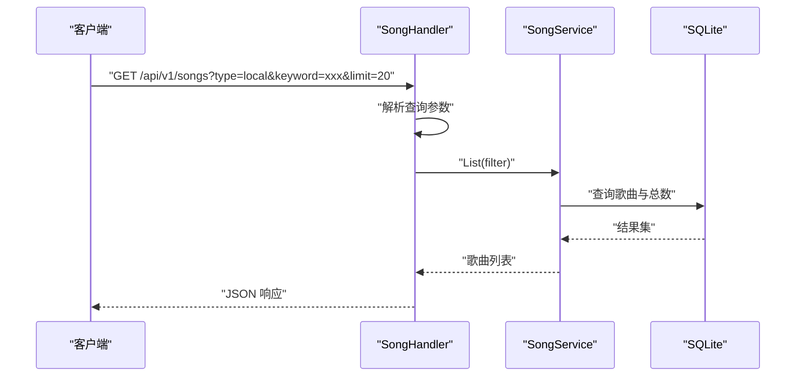
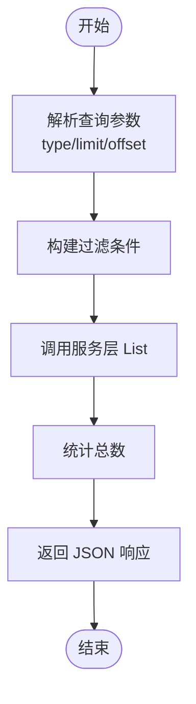
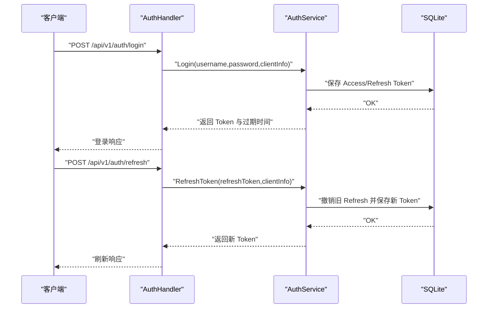
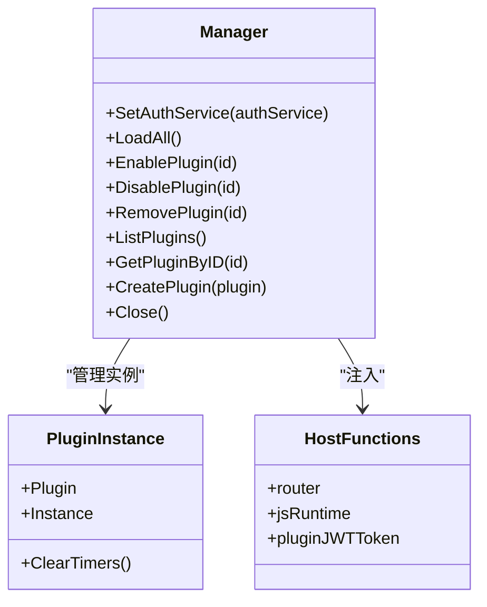
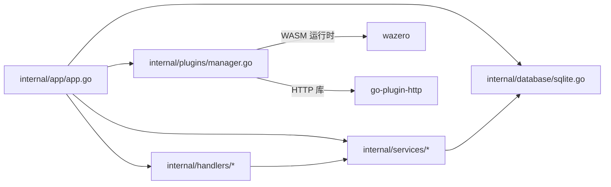

# 核心特性

<cite>
**本文引用的文件**
- [README.md](file://README.md)
- [main.go](file://main.go)
- [docs/architecture.md](file://docs/architecture.md)
- [docs/js-plugin-development-guide.md](file://docs/js-plugin-development-guide.md)
- [internal/app/app.go](file://internal/app/app.go)
- [internal/database/sqlite.go](file://internal/database/sqlite.go)
- [internal/plugins/manager.go](file://internal/plugins/manager.go)
- [internal/services/auth_service.go](file://internal/services/auth_service.go)
- [internal/services/scanner.go](file://internal/services/scanner.go)
- [pkg/tag/tag.go](file://pkg/tag/tag.go)
- [Dockerfile](file://Dockerfile)
- [internal/handlers/music.go](file://internal/handlers/music.go)
- [internal/handlers/playlist.go](file://internal/handlers/playlist.go)
- [internal/handlers/auth.go](file://internal/handlers/auth.go)
- [internal/handlers/plugin.go](file://internal/handlers/plugin.go)
</cite>

## 目录
1. [简介](#简介)
2. [项目结构](#项目结构)
3. [核心组件](#核心组件)
4. [架构总览](#架构总览)
5. [详细组件分析](#详细组件分析)
6. [依赖分析](#依赖分析)
7. [性能考虑](#性能考虑)
8. [故障排查指南](#故障排查指南)
9. [结论](#结论)
10. [附录](#附录)

## 简介
Songloft 是一个基于 Go 与 Chi 路由框架的轻量级音乐服务器，提供本地音乐文件扫描、元数据提取、歌单管理、JWT 双 Token 认证、RESTful API、Docker 支持、SQLite 数据库、灵活配置、WASM 插件系统与令牌管理等能力。其整体采用前后端分离架构，后端通过嵌入式前端资源提供同域访问，结合 WebAssembly 插件实现高度可扩展的功能扩展。

## 项目结构
- 后端核心位于 internal/，包含应用初始化、数据库、服务层、插件管理、认证与业务处理器。
- 前端资源通过 go:embed 嵌入，支持 Flutter Web 与传统 Web 前端（已逐步迁移至 Flutter Web）。
- Dockerfile 提供容器化构建与运行方案，支持挂载音乐与数据目录。

图表来源
- [main.go:30-63](file://main.go#L30-L63)
- [internal/app/app.go:64-227](file://internal/app/app.go#L64-L227)
- [docs/architecture.md:13-37](file://docs/architecture.md#L13-L37)

章节来源
- [README.md:25-38](file://README.md#L25-L38)
- [docs/architecture.md:13-37](file://docs/architecture.md#L13-L37)
- [main.go:30-63](file://main.go#L30-L63)

## 核心组件
- 音乐管理：扫描本地音乐、提取元数据、支持多种音频格式，提供歌曲增删改查与封面访问。
- 歌单管理：支持普通歌单与电台歌单，提供自动按目录创建歌单、歌曲排序与批量操作。
- JWT 认证：双 Token（Access/Refresh）机制，支持登录、刷新、登出与令牌撤销管理。
- RESTful API：Swagger 集成，提供健康检查、版本信息、扫描进度、插件管理等接口。
- Docker 支持：官方 Dockerfile 与脚本，支持多架构构建与挂载卷。
- 多格式支持：基于 dhowden/tag fork（hanxi/tag）提取元数据，支持 MP3、FLAC、WAV、APE、OGG、M4A 等。
- SQLite 数据库：modernc.org/sqlite 纯 Go 实现，内置 WAL、超时与缓存优化。
- 灵活配置：命令行参数与环境变量优先级明确，配置存储于数据库。
- WASM 插件系统：基于 wazero 的 WebAssembly 插件，支持生命周期管理、路由注册、定时器与 JS 环境。
- 令牌管理：查看与撤销活跃令牌，支持按类型与分页查询。

章节来源
- [README.md:25-38](file://README.md#L25-L38)
- [internal/handlers/music.go:29-102](file://internal/handlers/music.go#L29-L102)
- [internal/handlers/playlist.go:27-81](file://internal/handlers/playlist.go#L27-L81)
- [internal/services/auth_service.go:94-164](file://internal/services/auth_service.go#L94-L164)
- [internal/plugins/manager.go:149-168](file://internal/plugins/manager.go#L149-L168)
- [internal/database/sqlite.go:22-53](file://internal/database/sqlite.go#L22-L53)
- [pkg/tag/tag.go:29-75](file://pkg/tag/tag.go#L29-L75)
- [Dockerfile:45-77](file://Dockerfile#L45-L77)

## 架构总览
后端采用“处理器 -> 服务层 -> 数据库”的分层设计，插件通过 WASM 在宿主环境中运行，共享 HTTP 库与路由注册能力。前端资源通过嵌入式文件系统提供，支持同域访问与 SPA 回退。

图表来源
- [docs/architecture.md:13-37](file://docs/architecture.md#L13-L37)
- [internal/app/app.go:196-227](file://internal/app/app.go#L196-L227)

章节来源
- [docs/architecture.md:13-37](file://docs/architecture.md#L13-L37)

## 详细组件分析

### 音乐管理
- 功能要点
  - 列表分页、关键词搜索、类型过滤。
  - 远程歌曲与电台添加。
  - 封面图片读取与缓存。
  - 清理无效本地歌曲（文件不存在且删除封面）。
- 技术实现
  - 处理器解析查询参数，调用服务层执行过滤与统计。
  - 元数据提取基于 hanxi/tag，支持多种格式识别与封面提取。
  - 封面读取时根据扩展名设置 Content-Type，并启用缓存。
- 使用场景
  - 快速检索与播放本地音乐。
  - 管理远程流媒体与电台。
  - 批量维护与清理无效条目。

图表来源
- [internal/handlers/music.go:29-102](file://internal/handlers/music.go#L29-L102)
- [internal/database/sqlite.go:22-53](file://internal/database/sqlite.go#L22-L53)

章节来源
- [internal/handlers/music.go:29-102](file://internal/handlers/music.go#L29-L102)
- [pkg/tag/tag.go:29-75](file://pkg/tag/tag.go#L29-L75)

### 歌单管理
- 功能要点
  - 列表分页、类型过滤、自动创建歌单（按目录结构）。
  - 歌曲增删、批量添加、重新排序。
  - 触摸更新（记录最后播放时间）。
- 技术实现
  - 处理器负责参数解析与分页控制，服务层封装多对多关系与排序逻辑。
  - 自动创建歌单基于扫描器的文件发现与目录结构分析。
- 使用场景
  - 按专辑/艺人/目录自动组织歌单。
  - 播放后记录播放时间，便于回顾。

图表来源
- [internal/handlers/playlist.go:27-81](file://internal/handlers/playlist.go#L27-L81)

章节来源
- [internal/handlers/playlist.go:27-81](file://internal/handlers/playlist.go#L27-L81)
- [internal/services/scanner.go:30-48](file://internal/services/scanner.go#L30-L48)

### JWT 认证与令牌管理
- 功能要点
  - 登录获取 Access/Refresh 双 Token，Access 7 天，Refresh 30 天。
  - 刷新 Token 时撤销旧 Token 并发放新 Token。
  - 登出撤销当前会话的 Access/Refresh Token。
  - 列表查看与撤销指定令牌，支持按类型与分页。
- 技术实现
  - 使用内存缓存加速 Token 校验与撤销状态判断。
  - 插件系统支持生成“永久”插件专用 Token（仅内存，不落库）。
- 使用场景
  - 安全访问受保护接口。
  - 管理多设备登录状态与撤销异常会话。

图表来源
- [internal/handlers/auth.go:27-134](file://internal/handlers/auth.go#L27-L134)
- [internal/services/auth_service.go:94-324](file://internal/services/auth_service.go#L94-L324)

章节来源
- [internal/handlers/auth.go:27-134](file://internal/handlers/auth.go#L27-L134)
- [internal/services/auth_service.go:94-324](file://internal/services/auth_service.go#L94-L324)

### RESTful API 与 Swagger
- 功能要点
  - 公开接口（无需认证）：欢迎页、健康检查、版本信息、Swagger UI。
  - 认证管理：登录、刷新、登出、令牌列表与撤销。
  - 歌曲管理：列表、详情、更新、删除、远程/电台添加、封面读取、清理无效歌曲。
  - 歌单管理：列表、详情、创建/更新/删除、触摸、歌曲管理、自动创建。
  - 配置管理：增删改查配置项。
  - 扫描管理：异步扫描、进度查询、取消。
  - 插件管理：上传（.wasm/.zip）、启用/禁用、删除、查看。
  - 升级管理（Docker 环境）：版本检查、开始升级、进度查询。
- 使用场景
  - 通过 Swagger 交互式查看与测试 API。
  - 通过脚本或前端调用实现自动化运维与播放器集成。

章节来源
- [README.md:286-352](file://README.md#L286-L352)

### Docker 支持
- 功能要点
  - 多阶段构建，Go 1.26 Alpine 基础镜像，安装证书与时区。
  - 预置 ffprobe，便于精确音频参数提取。
  - 暴露 58091 端口，支持挂载音乐与数据目录。
  - 环境变量 ADMIN_USERNAME/PASSWORD/IN_DOCKER 控制初始配置。
- 使用场景
  - 快速部署与横向扩展，配合反向代理与持久化存储。

章节来源
- [Dockerfile:45-77](file://Dockerfile#L45-L77)

### 多格式支持与元数据提取
- 功能要点
  - 支持 MP3、FLAC、WAV、APE、OGG、M4A 等格式。
  - 基于 hanxi/tag（dhowden/tag fork）进行格式识别与封面提取。
  - 可选 ffprobe 用于精确时长、比特率、采样率等技术参数。
- 使用场景
  - 适配多样化的本地音乐库，统一元数据展示。

章节来源
- [pkg/tag/tag.go:29-75](file://pkg/tag/tag.go#L29-L75)
- [README.md:34](file://README.md#L34)

### SQLite 数据库
- 功能要点
  - modernc.org/sqlite 纯 Go 实现，无需 CGO。
  - WAL 模式、busy_timeout、synchronous、cache_size 等参数优化。
  - 建表、迁移（如 playlists 表新增 cover_path 字段）。
- 使用场景
  - 轻量级、零依赖、易部署的持久化存储。

章节来源
- [internal/database/sqlite.go:22-53](file://internal/database/sqlite.go#L22-L53)

### 灵活配置
- 功能要点
  - 命令行参数（-username/-password/-port/-db）优先级高于环境变量。
  - 环境变量：ADMIN_USERNAME、ADMIN_PASSWORD、LISTEN_PORT、DB_PATH。
  - 配置存储于数据库（如音乐路径、扫描配置、ffprobe 路径、封面存储路径）。
- 使用场景
  - 开发与生产环境差异化配置，支持容器化部署。

章节来源
- [internal/app/app.go:287-352](file://internal/app/app.go#L287-L352)
- [README.md:354-385](file://README.md#L354-L385)

### WASM 插件系统
- 功能要点
  - 基于 wazero 的 WebAssembly 插件运行时，注入 HTTP Library。
  - 生命周期：注册、初始化、运行、反初始化。
  - 路由注册、静态资源托管、定时器、JS 环境管理。
  - 插件目录扫描与同步、启用/禁用/删除、上传（.wasm/.zip）。
  - 插件专用永久 Token（仅内存，不落库）。
- 使用场景
  - 动态扩展功能（如第三方源接入、工具面板等），无需重启主程序。

图表来源
- [internal/plugins/manager.go:34-168](file://internal/plugins/manager.go#L34-L168)

章节来源
- [docs/js-plugin-development-guide.md:100-135](file://docs/js-plugin-development-guide.md#L100-L135)
- [internal/plugins/manager.go:149-168](file://internal/plugins/manager.go#L149-L168)

### 令牌管理
- 功能要点
  - 列出当前用户活跃令牌（支持类型过滤与分页）。
  - 撤销指定令牌（记录撤销者与原因）。
  - 登出时撤销当前会话的 Access/Refresh Token。
- 使用场景
  - 安全审计与异常处置，保障多终端登录安全。

章节来源
- [internal/handlers/auth.go:136-236](file://internal/handlers/auth.go#L136-L236)
- [internal/services/auth_service.go:373-386](file://internal/services/auth_service.go#L373-L386)

## 依赖分析
- 外部依赖
  - 路由：github.com/go-chi/chi/v5
  - 数据库：modernc.org/sqlite（纯 Go）
  - 元数据：github.com/hanxi/tag（dhowden/tag fork）
  - JWT：github.com/golang-jwt/jwt/v5
  - WASM：github.com/tetratelabs/wazero
  - 插件 HTTP 库：github.com/songloft-org/plugin/pkg/go-plugin-http
- 内部模块
  - handlers：RESTful 处理器
  - services：业务服务层（扫描、元数据、认证、升级等）
  - database：SQLite 接口与实现
  - plugins：插件管理器与宿主函数
  - app：应用初始化与路由装配

图表来源
- [internal/app/app.go:64-227](file://internal/app/app.go#L64-L227)
- [internal/plugins/manager.go:170-201](file://internal/plugins/manager.go#L170-L201)

章节来源
- [internal/app/app.go:64-227](file://internal/app/app.go#L64-L227)
- [internal/plugins/manager.go:170-201](file://internal/plugins/manager.go#L170-L201)

## 性能考虑
- 数据库优化
  - WAL 模式提升并发读写性能，设置 busy_timeout 与 cache_size 降低锁竞争与磁盘 IO。
  - 事务封装与连接池参数（最大打开/空闲连接、生命周期）。
- 插件执行
  - 超时保护（初始化/回调/反初始化/关闭），避免插件异常阻塞。
  - 实例隔离与健康状态标记，异常插件自动禁用。
- 元数据提取
  - hanxi/tag 无需 ffmpeg，部署更简单；ffprobe 仅用于精确技术参数。
- 前端资源
  - 嵌入式静态资源与 SPA 回退，减少跨域与二次请求。

章节来源
- [internal/database/sqlite.go:22-53](file://internal/database/sqlite.go#L22-L53)
- [internal/plugins/manager.go:26-32](file://internal/plugins/manager.go#L26-L32)
- [pkg/tag/tag.go:29-75](file://pkg/tag/tag.go#L29-L75)

## 故障排查指南
- 认证相关
  - 登录失败：检查用户名/密码是否正确，确认已通过命令行或环境变量配置管理员凭据。
  - 刷新失败：确认 Refresh Token 未被撤销且未过期。
  - 登出后仍可访问：确认已撤销 Access/Refresh Token，检查缓存清理协程是否正常。
- 插件相关
  - 插件上传失败：检查文件扩展名（.wasm/.zip），确认 zip 内包含至少一个 .wasm 文件。
  - 插件启用失败：查看初始化超时与错误日志，确认插件实现符合规范。
  - 插件异常被禁用：检查日志中的超时与错误信息，定位插件问题。
- 数据库相关
  - 连接失败：确认数据库文件路径与权限，检查 WAL/锁配置。
  - 表结构异常：确认迁移（如 playlists.cover_path）已执行。
- Docker 相关
  - 端口冲突：调整 EXPOSE 端口或映射。
  - 权限问题：确认挂载目录权限与 SELinux/AppArmor 配置。

章节来源
- [internal/handlers/auth.go:27-134](file://internal/handlers/auth.go#L27-L134)
- [internal/plugins/manager.go:403-463](file://internal/plugins/manager.go#L403-L463)
- [internal/database/sqlite.go:22-53](file://internal/database/sqlite.go#L22-L53)
- [Dockerfile:45-77](file://Dockerfile#L45-L77)

## 结论
Songloft 通过清晰的分层架构与插件化设计，实现了从音乐管理到认证与扩展的完整能力闭环。WASM 插件系统显著提升了可扩展性，SQLite 与 Hanxi/Tag 的组合兼顾了易用性与性能。结合 Docker 支持与灵活配置，Songloft 能够满足个人与小型团队的本地音乐服务需求，并为后续功能扩展提供稳定基础。

## 附录
- 快速开始与 API 使用示例见 README 的“使用认证”与“API 接口”章节。
- 插件开发规范与最佳实践见 docs/js-plugin-development-guide.md。

章节来源
- [README.md:97-142](file://README.md#L97-L142)
- [README.md:251-352](file://README.md#L251-L352)
- [docs/js-plugin-development-guide.md:17-80](file://docs/js-plugin-development-guide.md#L17-L80)