# 系统架构概览

<cite>
**本文档引用的文件**
- [main.go](file://main.go)
- [app.go](file://internal/app/app.go)
- [routers.go](file://internal/app/routers.go)
- [auth.go](file://internal/middleware/auth.go)
- [music.go](file://internal/handlers/music.go)
- [types.go](file://internal/config/types.go)
- [manager.go](file://internal/plugins/manager.go)
- [runtime.go](file://internal/jsruntime/runtime.go)
- [auth_service.go](file://internal/services/auth_service.go)
- [database.go](file://internal/database/database.go)
- [architecture.md](file://docs/architecture.md)
- [architecture_frontend.md](file://docs/architecture_frontend.md)
- [main.dart](file://frontend/lib/main.dart)
- [app_router.dart](file://frontend/lib/core/router/app_router.dart)
- [app_config.dart](file://frontend/lib/config/app_config.dart)
- [home_page.dart](file://frontend/lib/features/home/presentation/home_page.dart)
</cite>

## 目录
1. [简介](#简介)
2. [项目结构](#项目结构)
3. [核心组件](#核心组件)
4. [架构总览](#架构总览)
5. [详细组件分析](#详细组件分析)
6. [依赖关系分析](#依赖关系分析)
7. [性能考虑](#性能考虑)
8. [故障排除指南](#故障排除指南)
9. [结论](#结论)

## 简介
Songloft 是一个前后端分离的音乐管理系统，采用 Go 后端 + Flutter 前端 + WASM 插件系统的架构设计。项目提供了本地音乐管理、网络歌曲、电台播放和歌单管理等核心功能，同时通过插件系统实现高度可扩展的功能模块。

## 项目结构
Songloft 项目采用清晰的分层架构，主要分为以下层次：

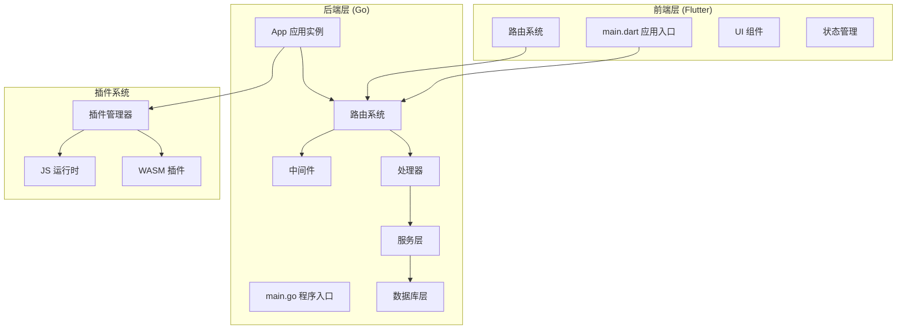

**图表来源**
- [main.go:30-63](file://main.go#L30-L63)
- [app.go:27-52](file://internal/app/app.go#L27-L52)
- [routers.go:20-26](file://internal/app/routers.go#L20-L26)

**章节来源**
- [architecture.md:13-37](file://docs/architecture.md#L13-L37)
- [main.go:1-64](file://main.go#L1-L64)
- [app.go:1-353](file://internal/app/app.go#L1-L353)

## 核心组件

### 应用入口与生命周期管理
应用程序采用简洁的入口点设计，通过 main 函数完成配置解析、应用初始化和优雅关闭：

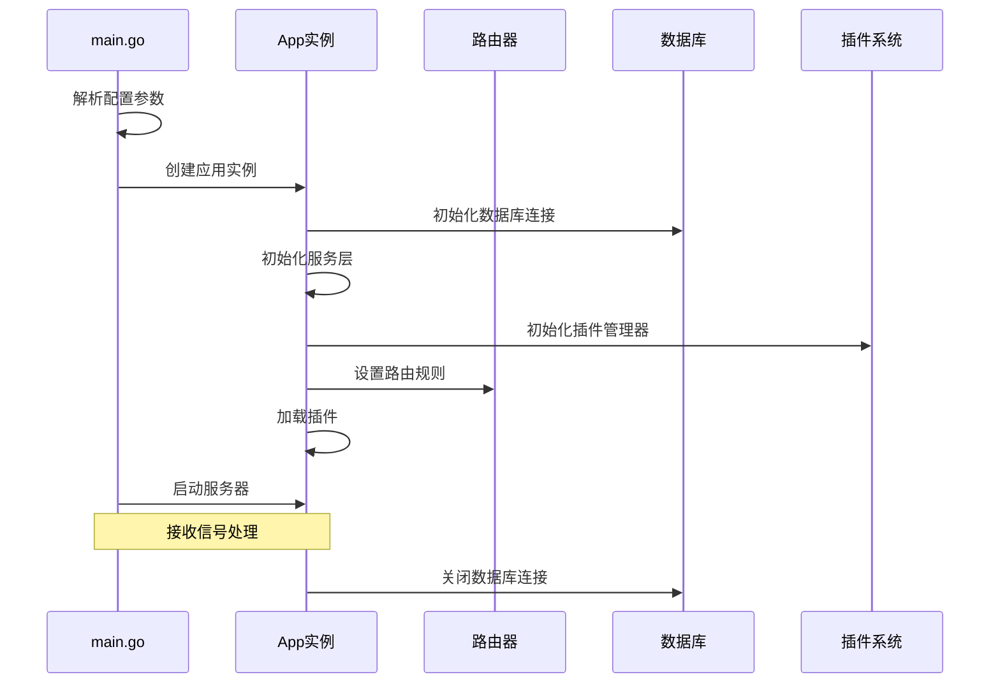

**图表来源**
- [main.go:30-63](file://main.go#L30-L63)
- [app.go:64-227](file://internal/app/app.go#L64-L227)

### 配置管理系统
应用采用多层配置管理策略：

| 配置层级 | 存储位置 | 用途 | 更新方式 |
|---------|----------|------|----------|
| 核心配置 | 命令行参数/环境变量 | 端口、数据库路径、管理员凭据 | 启动时解析 |
| 运行时配置 | SQLite 数据库 config 表 | 音乐路径、扫描配置、封面存储路径 | 动态更新 |
| 插件配置 | 插件数据目录 | 插件特定配置 | 插件内部管理 |

**章节来源**
- [app.go:83-144](file://internal/app/app.go#L83-L144)
- [types.go:3-9](file://internal/config/types.go#L3-L9)

### 安全认证体系
系统采用 JWT 双 Token 认证机制，提供完整的安全防护：

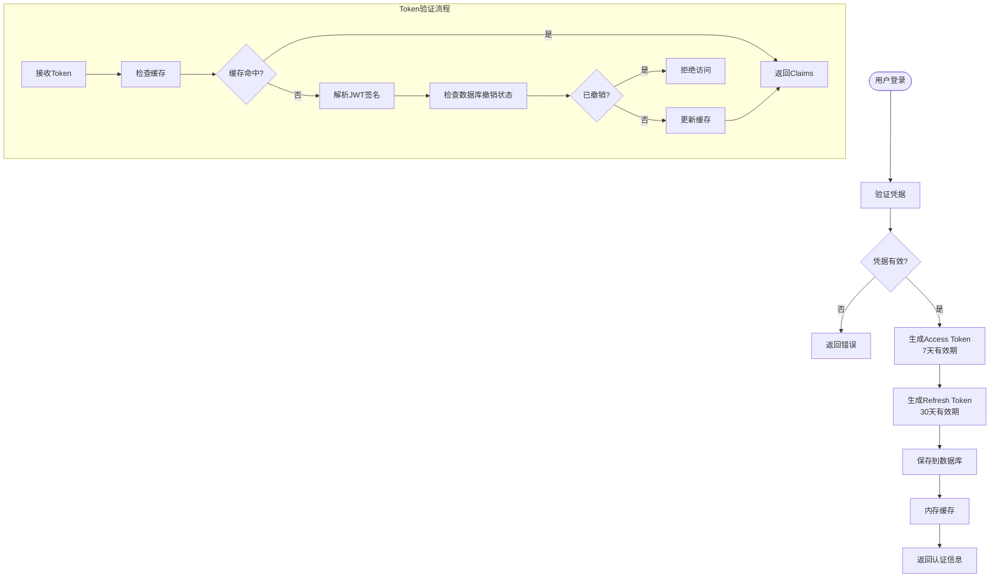

**图表来源**
- [auth_service.go:94-164](file://internal/services/auth_service.go#L94-L164)
- [auth_service.go:326-371](file://internal/services/auth_service.go#L326-L371)

**章节来源**
- [auth_service.go:17-32](file://internal/services/auth_service.go#L17-L32)
- [auth_service.go:388-423](file://internal/services/auth_service.go#L388-L423)

## 架构总览

### 分层架构设计
Songloft 采用经典的三层架构模式：

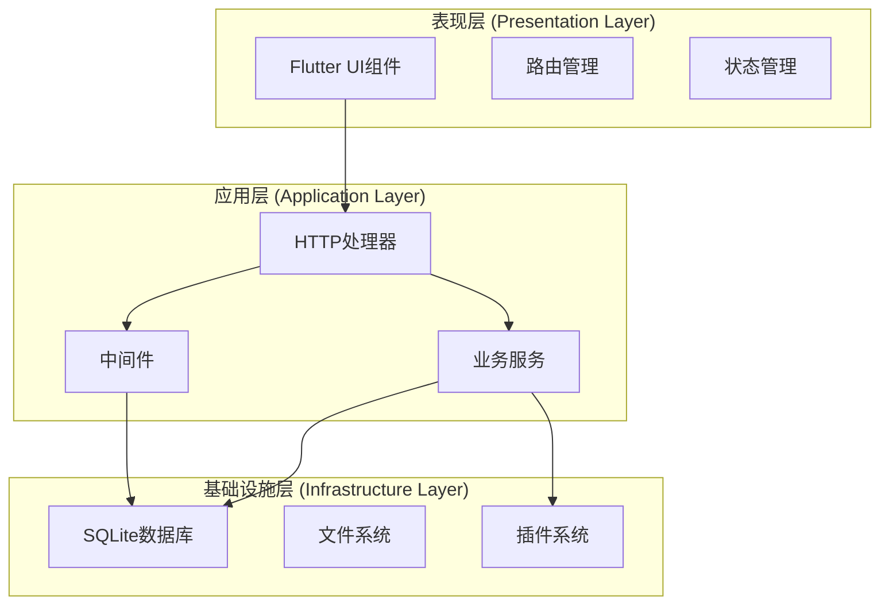

**图表来源**
- [architecture.md:42-51](file://docs/architecture.md#L42-L51)
- [routers.go:28-116](file://internal/app/routers.go#L28-L116)

### 中间件模式实现
系统采用中间件模式实现横切关注点：

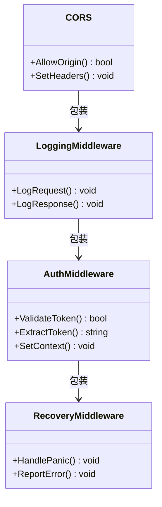

**图表来源**
- [auth.go:11-51](file://internal/middleware/auth.go#L11-L51)
- [routers.go:136-248](file://internal/app/routers.go#L136-L248)

**章节来源**
- [auth.go:11-51](file://internal/middleware/auth.go#L11-L51)
- [routers.go:118-134](file://internal/app/routers.go#L118-L134)

## 详细组件分析

### 后端应用架构
后端采用 App 模式，通过依赖注入实现松耦合设计：

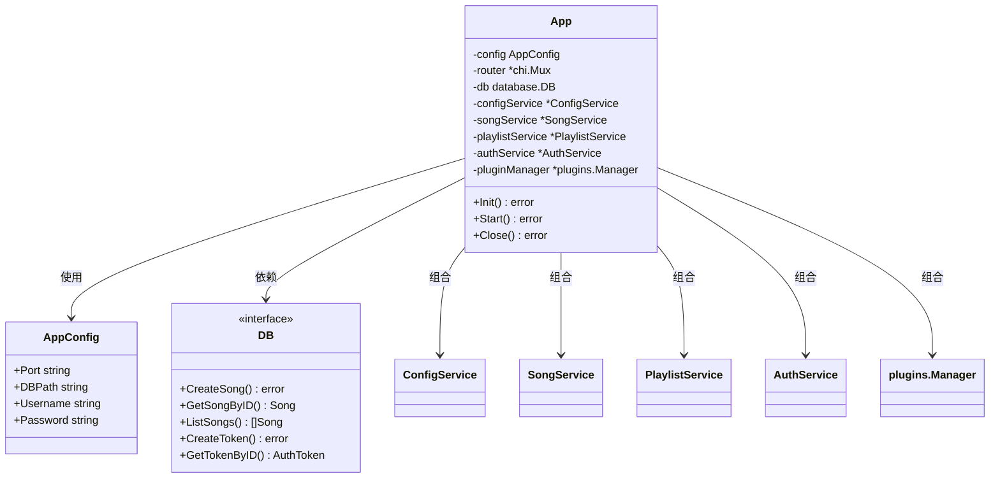

**图表来源**
- [app.go:27-42](file://internal/app/app.go#L27-L42)
- [types.go:3-9](file://internal/config/types.go#L3-L9)

**章节来源**
- [app.go:27-52](file://internal/app/app.go#L27-L52)
- [database.go:8-64](file://internal/database/database.go#L8-L64)

### 插件系统架构
Songloft 的插件系统是其核心扩展能力，采用 WASM 技术实现：

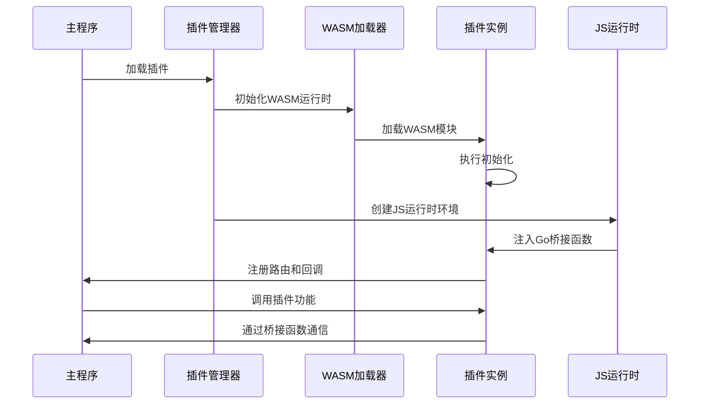

**图表来源**
- [manager.go:149-201](file://internal/plugins/manager.go#L149-L201)
- [manager.go:403-463](file://internal/plugins/manager.go#L403-L463)

**章节来源**
- [manager.go:34-44](file://internal/plugins/manager.go#L34-L44)
- [runtime.go:54-69](file://internal/jsruntime/runtime.go#L54-L69)

### 前端架构设计
Flutter 前端采用现代架构模式：

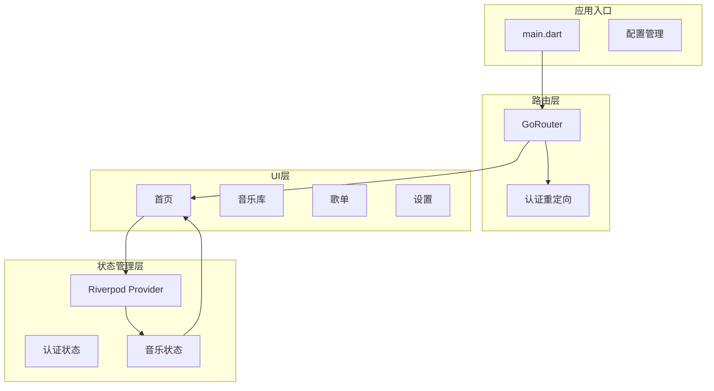

**图表来源**
- [main.dart:23-108](file://frontend/lib/main.dart#L23-L108)
- [app_router.dart:37-169](file://frontend/lib/core/router/app_router.dart#L37-L169)

**章节来源**
- [main.dart:23-108](file://frontend/lib/main.dart#L23-L108)
- [app_router.dart:16-25](file://frontend/lib/core/router/app_router.dart#L16-L25)

### 数据流设计
系统采用清晰的数据流向：

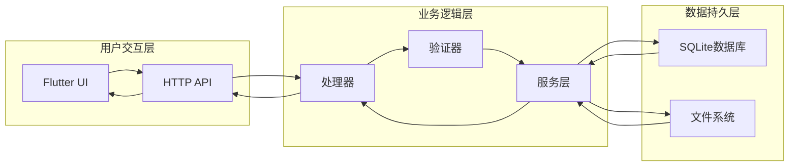

**图表来源**
- [music.go:29-102](file://internal/handlers/music.go#L29-L102)
- [auth.go:12-51](file://internal/middleware/auth.go#L12-L51)

**章节来源**
- [music.go:17-27](file://internal/handlers/music.go#L17-L27)
- [database.go:8-118](file://internal/database/database.go#L8-L118)

## 依赖关系分析

### 组件依赖图
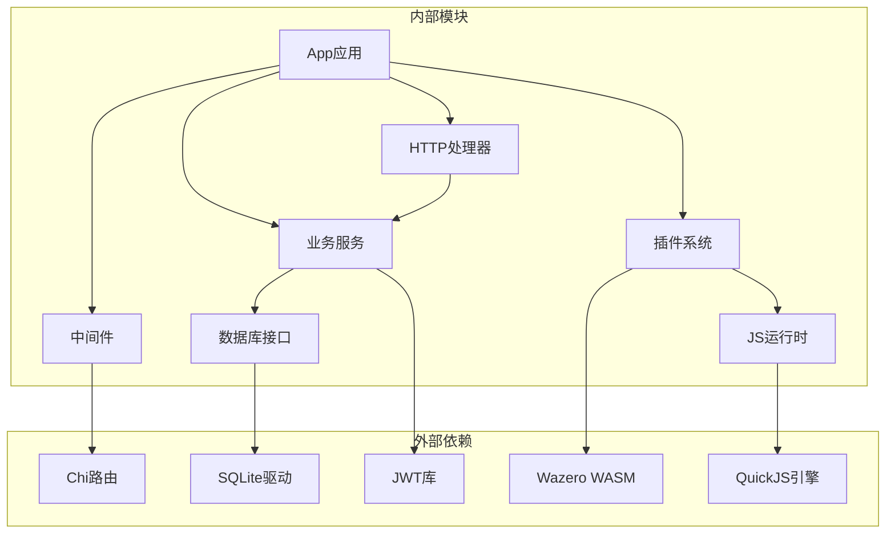

**图表来源**
- [app.go:3-25](file://internal/app/app.go#L3-L25)
- [manager.go:3-24](file://internal/plugins/manager.go#L3-L24)

### 关键依赖注入模式
系统采用构造函数注入实现依赖管理：

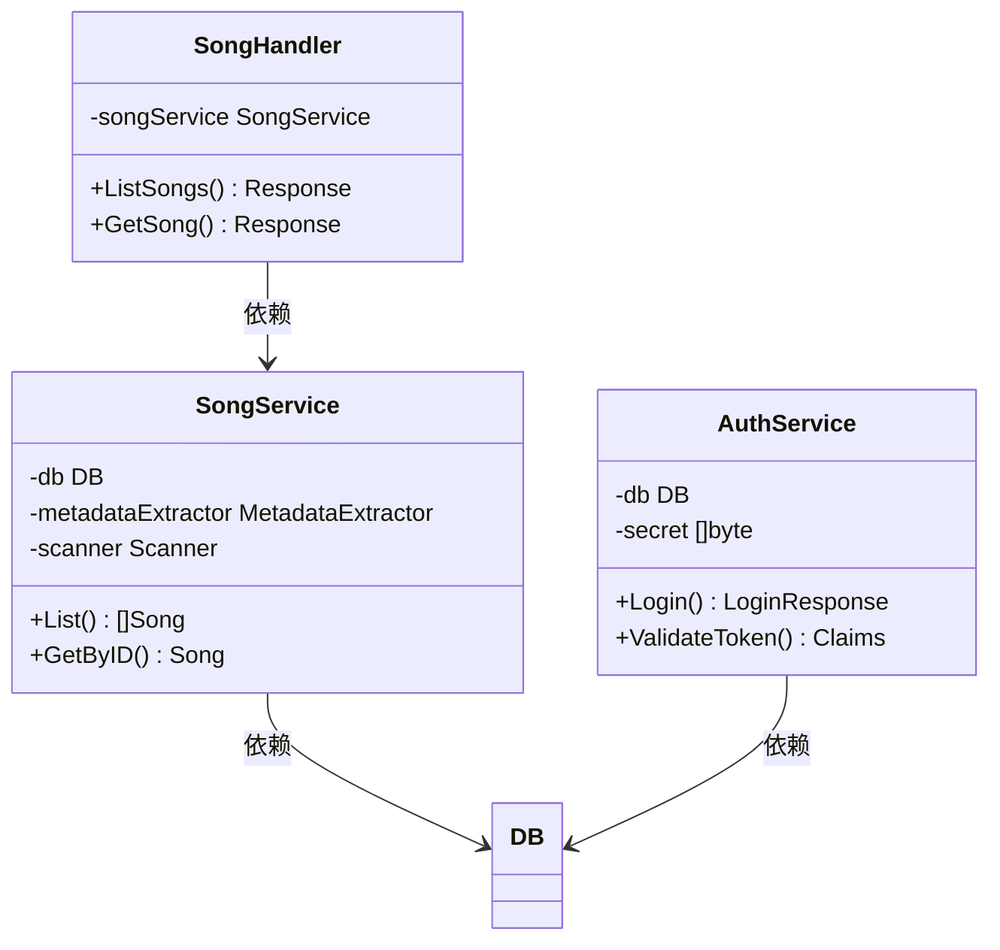

**图表来源**
- [music.go:17-27](file://internal/handlers/music.go#L17-L27)
- [auth_service.go:24-32](file://internal/services/auth_service.go#L24-L32)

**章节来源**
- [music.go:22-27](file://internal/handlers/music.go#L22-L27)
- [auth_service.go:48-73](file://internal/services/auth_service.go#L48-L73)

## 性能考虑
- **压缩传输**: 启用 Gzip 压缩中间件，减少静态资源传输体积
- **缓存策略**: 静态资源长期缓存，API 请求短时缓存
- **连接池**: 数据库连接池管理，避免频繁连接开销
- **插件隔离**: WASM 实现插件隔离，防止插件影响主程序稳定性
- **内存管理**: JS 运行时环境按需创建和销毁，避免内存泄漏

## 故障排除指南

### 常见问题诊断
1. **认证失败**: 检查 JWT 密钥生成和缓存机制
2. **插件加载失败**: 验证 WASM 文件完整性，检查插件元数据
3. **数据库连接问题**: 确认数据库文件路径和权限
4. **跨域问题**: 配置 CORS 策略，验证来源域名

### 日志和监控
- 使用 slog 结构化日志记录
- Tracely 监控错误和性能指标
- Panic 捕获和上报机制

**章节来源**
- [routers.go:155-172](file://internal/app/routers.go#L155-L172)
- [app.go:55-62](file://internal/app/app.go#L55-L62)

## 结论
Songloft 项目展现了优秀的软件架构设计，通过清晰的分层结构、依赖注入模式和中间件机制，实现了高内聚、低耦合的系统架构。插件系统的引入进一步增强了系统的扩展性和可维护性。前后端分离的设计使得系统具有良好的用户体验和开发效率。整体架构为后续功能扩展和性能优化奠定了坚实基础。