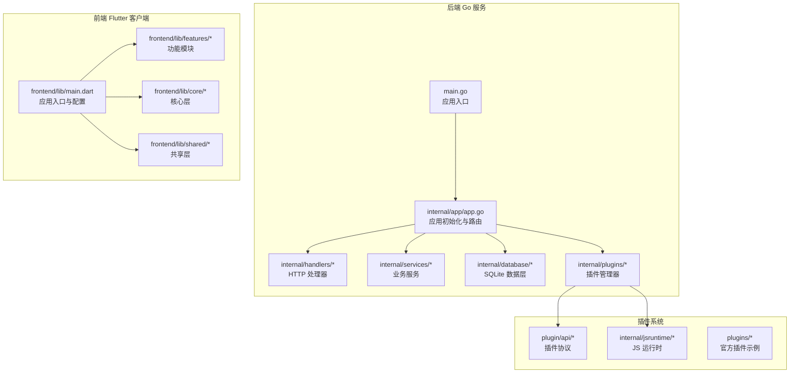
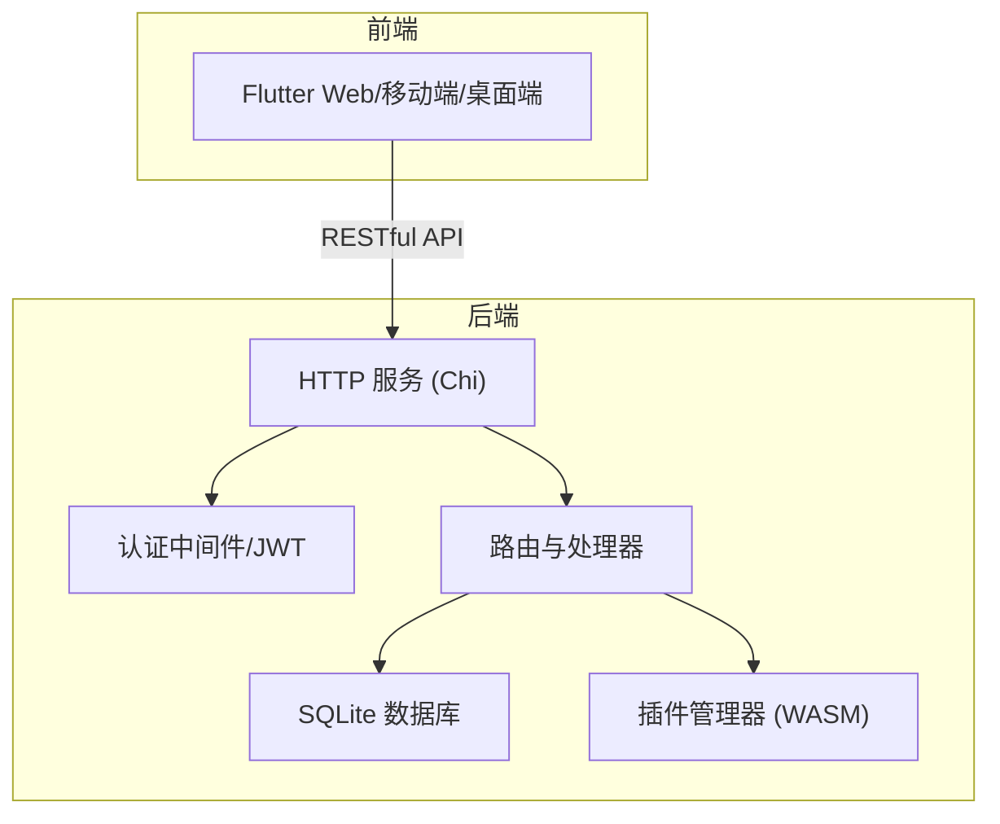
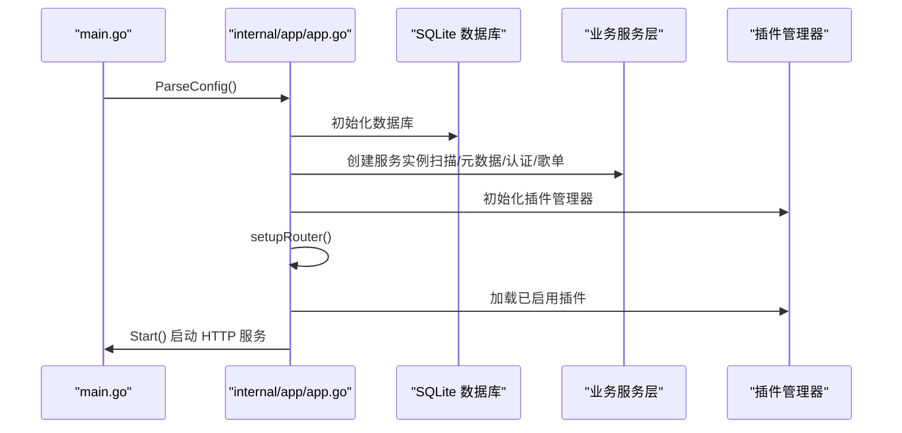
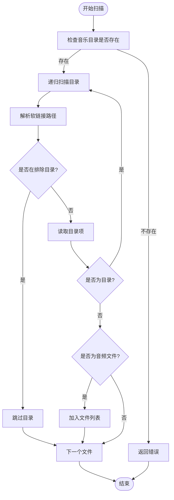
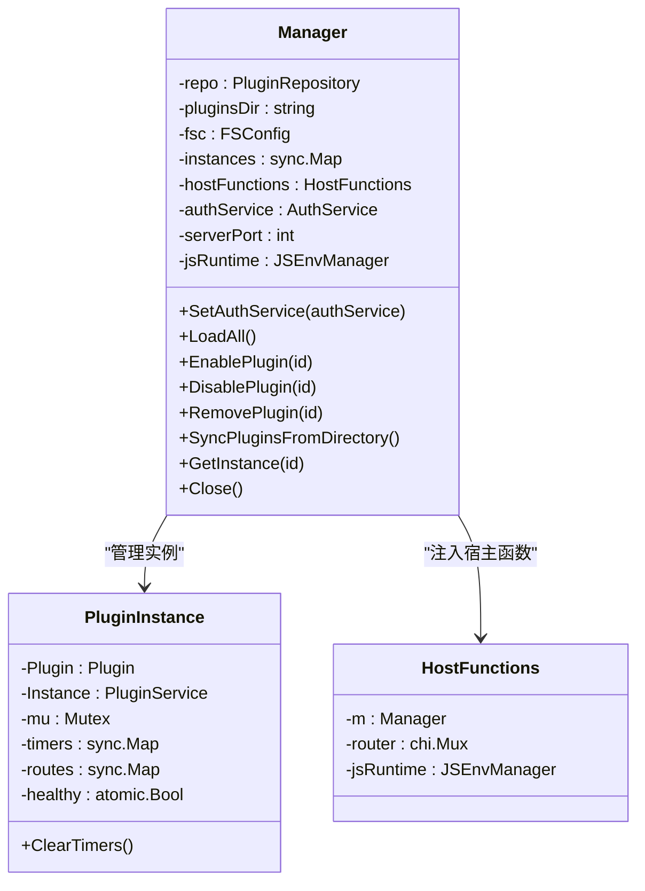
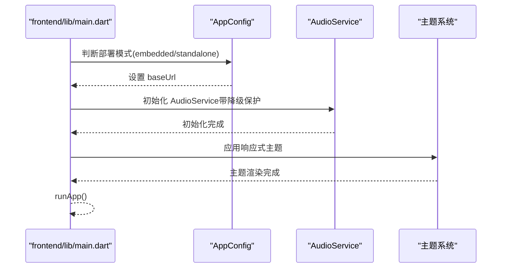
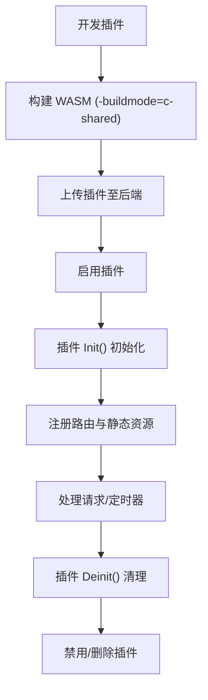
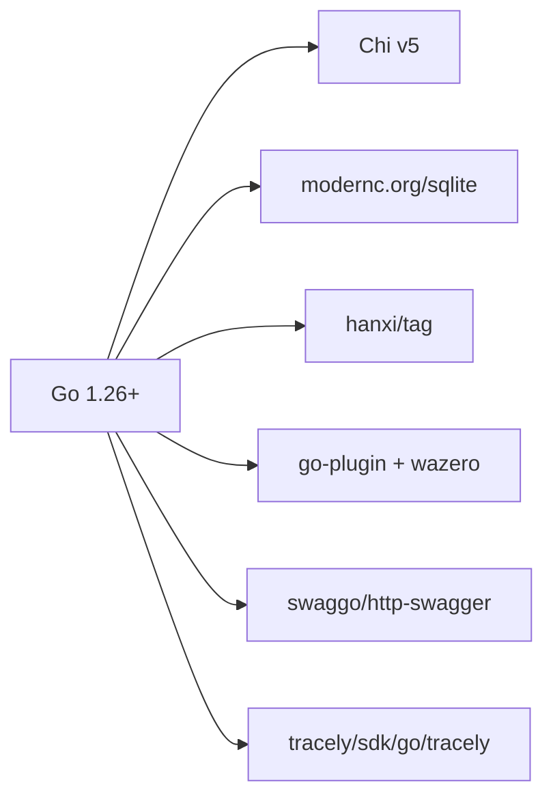

# 项目概述

<cite>
**本文档引用的文件**
- [README.md](file://README.md)
- [main.go](file://main.go)
- [go.mod](file://go.mod)
- [frontend/README.md](file://frontend/README.md)
- [docs/architecture.md](file://docs/architecture.md)
- [docs/quick-start.md](file://docs/quick-start.md)
- [internal/app/app.go](file://internal/app/app.go)
- [internal/plugins/manager.go](file://internal/plugins/manager.go)
- [internal/services/scanner.go](file://internal/services/scanner.go)
- [frontend/lib/main.dart](file://frontend/lib/main.dart)
- [web/src/main.ts](file://web/src/main.ts)
- [docs/js-plugin-development-guide.md](file://docs/js-plugin-development-guide.md)
- [internal/version/version.go](file://internal/version/version.go)
- [docs/FAQ.md](file://docs/FAQ.md)
- [todo.md](file://todo.md)
</cite>

## 目录
1. [简介](#简介)
2. [项目结构](#项目结构)
3. [核心组件](#核心组件)
4. [架构总览](#架构总览)
5. [详细组件分析](#详细组件分析)
6. [依赖分析](#依赖分析)
7. [性能考虑](#性能考虑)
8. [故障排查指南](#故障排查指南)
9. [结论](#结论)
10. [附录](#附录)

## 简介
Songloft 是一个基于 Go 与 Flutter 的全栈音乐管理应用，定位为轻量级、跨平台、可插拔的本地音乐服务器与播放器组合。项目通过 Go 后端提供高性能的音乐扫描、元数据提取、歌单管理与认证体系，并通过 Flutter 前端提供跨平台播放体验；同时引入基于 WebAssembly 的插件系统，实现功能的动态扩展与解耦。

- 核心目标
  - 提供本地音乐文件的扫描、元数据提取与歌单管理能力
  - 通过 JWT 双 Token 认证保障 API 安全
  - 以 Flutter 构建跨平台播放器，覆盖移动端、桌面端与 Web
  - 通过 WASM 插件系统实现功能扩展与生态共建

- 主要特性
  - 音乐管理：本地扫描、元数据提取（标题、艺术家、专辑、封面、歌词等）、歌单管理
  - 认证与安全：JWT 双 Token（Access/Refresh）认证，支持令牌撤销与管理
  - 跨平台前端：iOS、Android、macOS、Windows、Linux、Web
  - 插件化架构：基于 WebAssembly 的插件系统，支持路由、定时器、静态资源与宿主交互
  - 轻量化与易部署：SQLite 内置、Docker 支持、纯 Go 实现（CGO-free）

- 目标用户
  - 个人音乐爱好者与发烧友：希望在多平台上统一管理本地音乐
  - 开发者与运维：需要可扩展、可嵌入的音乐服务与播放器
  - 团队与企业：需要稳定、可定制的音乐服务基础设施

**章节来源**
- [README.md:10-39](file://README.md#L10-L39)
- [docs/architecture.md:13-37](file://docs/architecture.md#L13-L37)

## 项目结构
项目采用前后端分离架构，后端 Go 服务负责数据与业务逻辑，前端 Flutter 客户端负责播放与交互，插件系统通过 WASM 动态扩展功能。整体结构如下：

**图表来源**
- [main.go:30-63](file://main.go#L30-L63)
- [internal/app/app.go:44-226](file://internal/app/app.go#L44-L226)
- [frontend/lib/main.dart:23-108](file://frontend/lib/main.dart#L23-L108)

**章节来源**
- [docs/architecture.md:39-51](file://docs/architecture.md#L39-L51)
- [frontend/README.md:90-118](file://frontend/README.md#L90-L118)

## 核心组件
- 应用入口与初始化
  - main.go 负责解析配置、初始化应用、启动 HTTP 服务与信号处理
  - internal/app/app.go 负责数据库、服务层、插件管理器与路由装配
- 业务服务
  - 文件扫描服务：递归扫描音乐目录，支持软链接与排除目录
  - 元数据提取：基于 dhowden/tag fork（hanxi/tag）提取封面与元数据
  - 认证服务：JWT 双 Token 管理与刷新
  - 歌单与歌曲服务：增删改查与排序
- 插件系统
  - 基于 wazero 的 WASM 运行时，支持插件生命周期、路由注册、定时器与 JS 环境
  - 插件通过 go-plugin 协议与宿主通信，支持静态资源与 API 路由
- 前端 Flutter
  - 响应式布局与多平台播放器，支持后台播放与通知栏
  - 支持嵌入模式（与 Go 后端同域）与独立部署模式（可配置后端地址）

**章节来源**
- [main.go:30-63](file://main.go#L30-L63)
- [internal/app/app.go:64-226](file://internal/app/app.go#L64-L226)
- [internal/services/scanner.go:30-177](file://internal/services/scanner.go#L30-L177)
- [internal/plugins/manager.go:149-586](file://internal/plugins/manager.go#L149-L586)
- [frontend/lib/main.dart:23-108](file://frontend/lib/main.dart#L23-L108)

## 架构总览
Songloft 采用“后端 Go + 前端 Flutter + 插件系统”的三层架构。后端提供 RESTful API 与插件托管，前端通过统一的 API 进行数据与播放控制，插件通过 WASM 在宿主环境中运行并扩展功能。

**图表来源**
- [docs/architecture.md:15-37](file://docs/architecture.md#L15-L37)
- [internal/app/app.go:27-42](file://internal/app/app.go#L27-L42)

**章节来源**
- [docs/architecture.md:13-37](file://docs/architecture.md#L13-L37)

## 详细组件分析

### 后端应用初始化流程
后端应用启动时，解析配置、初始化数据库、创建服务层实例、装配路由与插件管理器，并启动 HTTP 服务。

**图表来源**
- [main.go:30-63](file://main.go#L30-L63)
- [internal/app/app.go:64-226](file://internal/app/app.go#L64-L226)

**章节来源**
- [main.go:30-63](file://main.go#L30-L63)
- [internal/app/app.go:64-226](file://internal/app/app.go#L64-L226)

### 文件扫描与元数据提取
扫描器递归遍历音乐目录，识别音频文件并提取元数据，支持多种格式与排除规则。

**图表来源**
- [internal/services/scanner.go:30-177](file://internal/services/scanner.go#L30-L177)

**章节来源**
- [internal/services/scanner.go:30-177](file://internal/services/scanner.go#L30-L177)

### 插件系统与 WASM 执行
插件管理器负责插件的加载、初始化、路由注册与生命周期管理，使用 wazero 提供 WASM 运行时，支持定时器与 JS 环境。

**图表来源**
- [internal/plugins/manager.go:34-168](file://internal/plugins/manager.go#L34-L168)
- [internal/plugins/manager.go:465-586](file://internal/plugins/manager.go#L465-L586)

**章节来源**
- [internal/plugins/manager.go:149-586](file://internal/plugins/manager.go#L149-L586)

### 前端应用入口与部署模式
前端应用支持嵌入模式（与 Go 后端同域）与独立部署模式（可配置后端地址），并初始化音频服务与主题系统。

**图表来源**
- [frontend/lib/main.dart:36-108](file://frontend/lib/main.dart#L36-L108)

**章节来源**
- [frontend/lib/main.dart:23-108](file://frontend/lib/main.dart#L23-L108)

### 插件开发与协议
插件开发遵循统一协议，通过 go-plugin 与宿主通信，支持路由注册、静态资源、定时器与响应辅助函数。

**图表来源**
- [docs/js-plugin-development-guide.md:25-67](file://docs/js-plugin-development-guide.md#L25-L67)
- [docs/js-plugin-development-guide.md:171-280](file://docs/js-plugin-development-guide.md#L171-L280)

**章节来源**
- [docs/js-plugin-development-guide.md:17-800](file://docs/js-plugin-development-guide.md#L17-L800)

## 依赖分析
- 核心依赖
  - Go Web 框架：Chi v5
  - 数据库：SQLite3（modernc.org/sqlite，CGO-free）
  - 元数据提取：hanxi/tag（dhowden/tag fork）
  - 插件系统：knqyf263/go-plugin、wazero、go-plugin-http
  - 前端监控：Tracely SDK
- 外部工具
  - ffprobe（可选，用于精确音频技术参数）

**图表来源**
- [go.mod:5-21](file://go.mod#L5-L21)

**章节来源**
- [go.mod:1-58](file://go.mod#L1-L58)

## 性能考虑
- 轻量化与低依赖
  - SQLite 纯 Go 实现，无需 CGO，部署简单
  - 元数据提取使用 dhowden/tag fork，增强编码检测，减少外部依赖
- WASM 插件隔离
  - 插件实例隔离，超时保护与健康检查，避免影响宿主稳定性
- 前端性能
  - Flutter 原生渲染，音频服务降级保护，提升用户体验
- 扫描与元数据
  - 扫描器支持软链接与排除目录，避免重复扫描与无效目录

[本节为通用性能讨论，无需特定文件分析]

## 故障排查指南
- 常见问题
  - Docker 卷路径需使用绝对路径
  - 端口冲突与默认端口 58091
  - ffprobe 非必需，但可提供更精确的音频参数
- 版本与升级
  - 通过命令行或 API 查看版本信息
  - 升级后如遇异常，可删除数据库文件后重启（会丢失用户数据）
- API 认证
  - 使用登录接口获取 access_token，后续请求在 Header 中携带 Authorization: Bearer

**章节来源**
- [docs/FAQ.md:16-91](file://docs/FAQ.md#L16-L91)
- [docs/quick-start.md:258-282](file://docs/quick-start.md#L258-L282)

## 结论
Songloft 通过 Go 与 Flutter 的组合，实现了轻量、跨平台、可扩展的音乐管理与播放解决方案。其插件化架构与纯 Go 的数据库实现，使其在部署与维护上具备显著优势；同时，完善的认证体系与前端播放体验，满足了从个人用户到开发团队的多样化需求。未来可进一步完善插件生态与前端交互细节，持续提升用户体验与扩展能力。

[本节为总结性内容，无需特定文件分析]

## 附录
- 快速开始
  - 二进制与 Docker 部署、API 使用与版本查看
- 社区与生态
  - 官方插件示例与开发规范
- 发展历程与版本信息
  - 版本号、提交信息与构建时间由内部 version 包提供

**章节来源**
- [docs/quick-start.md:83-282](file://docs/quick-start.md#L83-L282)
- [docs/js-plugin-development-guide.md:17-800](file://docs/js-plugin-development-guide.md#L17-L800)
- [internal/version/version.go:10-19](file://internal/version/version.go#L10-L19)
- [todo.md:1-14](file://todo.md#L1-L14)