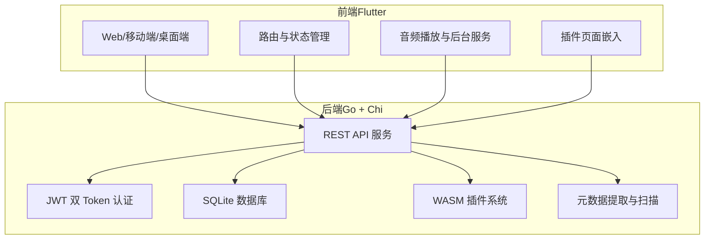
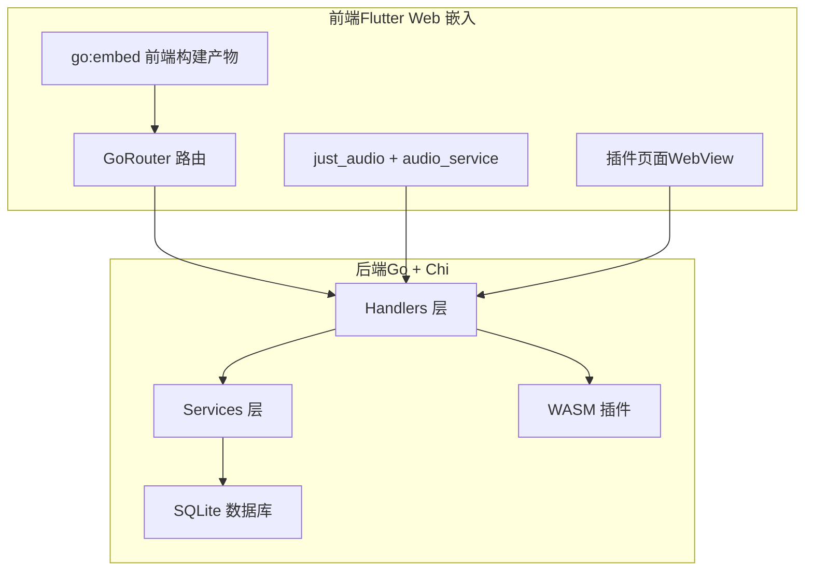
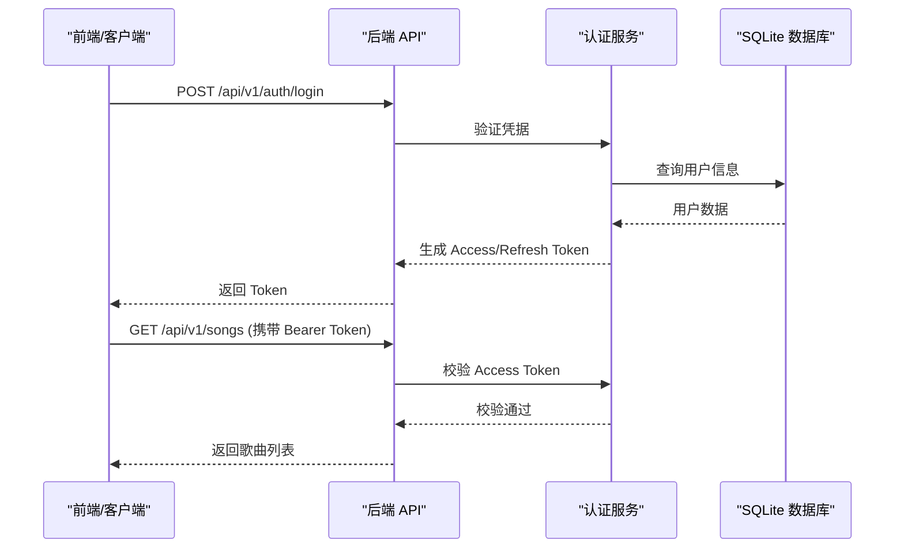
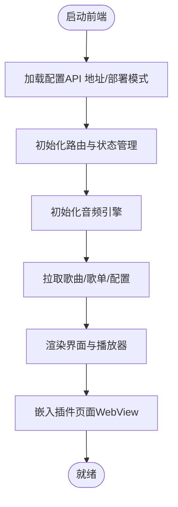
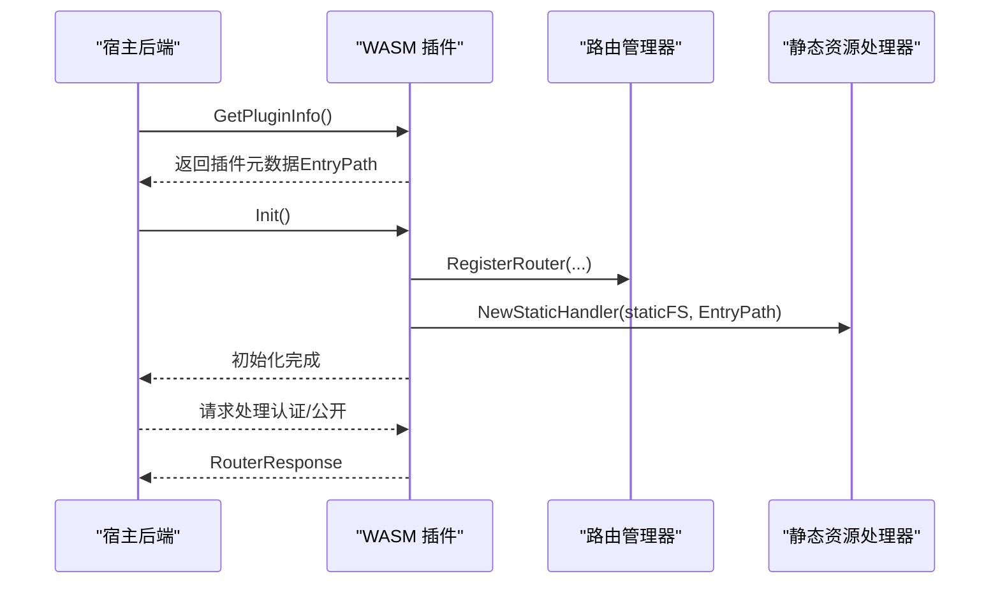
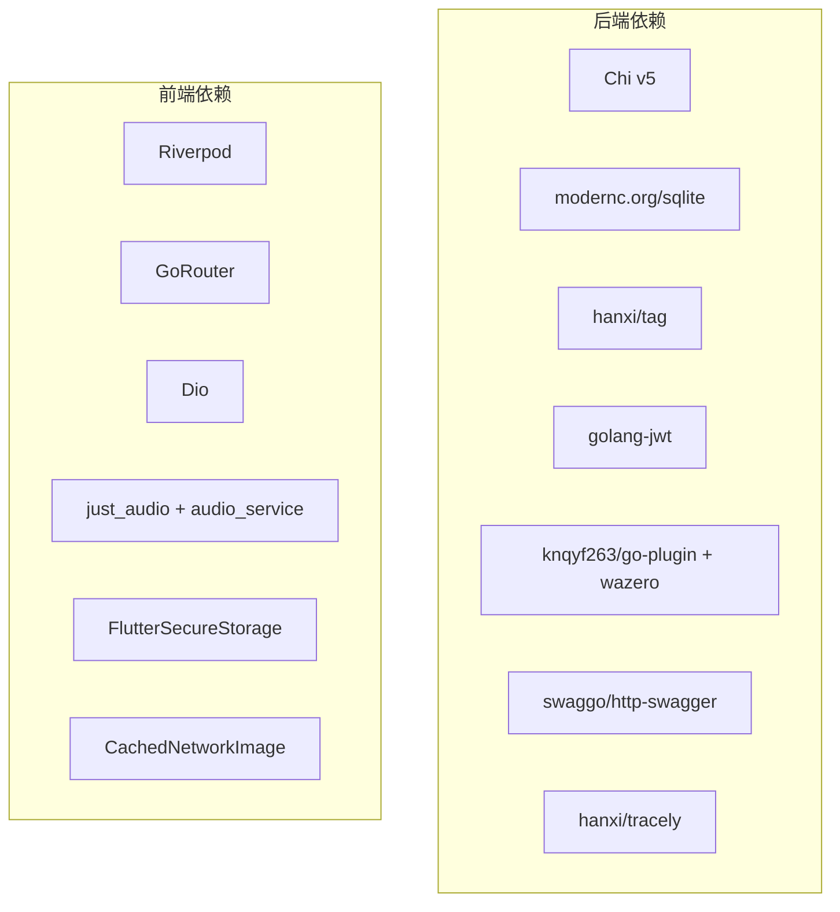

# 项目简介

<cite>
**本文引用的文件**
- [README.md](file://README.md)
- [main.go](file://main.go)
- [frontend/README.md](file://frontend/README.md)
- [docs/quick-start.md](file://docs/quick-start.md)
- [docs/architecture.md](file://docs/architecture.md)
- [docs/js-plugin-development-guide.md](file://docs/js-plugin-development-guide.md)
- [go.mod](file://go.mod)
- [frontend/pubspec.yaml](file://frontend/pubspec.yaml)
- [CHANGELOG.md](file://CHANGELOG.md)
- [plugins/songloft-plugin-lxmusic/main.go](file://plugins/songloft-plugin-lxmusic/main.go)
</cite>

## 目录
1. [引言](#引言)
2. [项目结构](#项目结构)
3. [核心组件](#核心组件)
4. [架构总览](#架构总览)
5. [详细组件分析](#详细组件分析)
6. [依赖分析](#依赖分析)
7. [性能考量](#性能考量)
8. [故障排查指南](#故障排查指南)
9. [结论](#结论)
10. [附录](#附录)

## 引言
Songloft 是一个基于 Go 与 Flutter 的全栈音乐管理应用，致力于为用户提供轻量、稳定、跨平台且可扩展的本地音乐管理与播放体验。项目采用前后端分离架构：后端使用 Go + Chi 提供高性能 REST API，并内置 SQLite 数据库；前端使用 Flutter 构建跨平台播放器，覆盖 Web、iOS、Android、macOS、Windows、Linux 等多端。项目强调“轻量级设计、跨平台支持、插件化架构”，通过 WebAssembly 插件系统实现功能扩展，同时提供 Docker 化部署与一键式发布能力。

Songloft 的价值主张在于：
- 轻量与易用：零依赖部署、最小化资源占用、开箱即用的完整版发行包
- 跨平台一致体验：一套代码适配多端，提供桌面与移动端优化
- 可扩展生态：基于 WASM 的插件体系，支持第三方能力接入
- 开源与社区驱动：MIT 许可证，持续迭代，欢迎贡献

## 项目结构
项目采用模块化与分层架构，后端与前端分别独立维护，通过 REST API 通信。后端负责音乐扫描、元数据提取、歌单管理、认证与插件生命周期管理；前端提供播放器、歌单与设置界面，并支持插件页面嵌入。

图表来源
- [docs/architecture.md](file://docs/architecture.md)
- [frontend/README.md](file://frontend/README.md)
- [README.md](file://README.md)

章节来源
- [docs/architecture.md](file://docs/architecture.md)
- [README.md](file://README.md)
- [frontend/README.md](file://frontend/README.md)

## 核心组件
- 后端服务（Go + Chi）
  - REST API：提供认证、歌曲、歌单、配置、扫描、插件、升级等接口
  - 认证：JWT 双 Token（Access/Refresh），支持令牌列表与撤销
  - 数据库：SQLite（modernc.org/sqlite），纯 Go 实现，无需 CGO
  - 元数据：基于 hanxi/tag 提取封面与元数据，ffprobe 可选用于精确音频参数
  - 插件：WASM 插件系统，支持路由注册、静态资源、定时器与生命周期管理
- 前端（Flutter）
  - 跨平台播放器：just_audio + audio_service，支持本地与网络歌曲、后台播放
  - 界面与交互：Riverpod + GoRouter，响应式布局，支持 TV 适配
  - 插件页面：通过 WebView 嵌入插件静态资源与路由
- 部署与发布
  - Docker 镜像：完整版/精简版，支持多架构
  - 发行包：各平台二进制与安装包，支持 standalone/embedded 模式

章节来源
- [README.md](file://README.md)
- [frontend/README.md](file://frontend/README.md)
- [docs/architecture.md](file://docs/architecture.md)
- [go.mod](file://go.mod)

## 架构总览
Songloft 采用“前端嵌入式部署 + 后端 API”的整体架构。Flutter Web 前端可被嵌入到 Go 二进制中，与后端同域访问，实现零配置部署；同时支持独立部署模式，允许用户手动配置后端地址。后端通过 Chi 路由分发请求至各处理器，服务层封装业务逻辑，数据库层提供持久化能力，插件系统通过 WASM 实现扩展。

图表来源
- [docs/architecture.md](file://docs/architecture.md)
- [main.go](file://main.go)

章节来源
- [docs/architecture.md](file://docs/architecture.md)
- [main.go](file://main.go)

## 详细组件分析

### 后端服务（Go + Chi）
- REST API 设计
  - 认证管理：登录、刷新、登出、令牌列表与撤销
  - 歌曲管理：增删改查、远程歌曲与电台支持、清理无效歌曲
  - 歌单管理：创建、编辑、删除、歌曲增删与重排、自动创建
  - 配置管理：键值配置、JSON 格式、动态更新
  - 扫描管理：异步扫描、进度查询、取消扫描
  - 插件管理：上传、启用/禁用、删除、信息查询
  - 升级管理：版本检查、升级流程与进度（Docker 环境）
- 认证与安全
  - JWT 双 Token 机制，Access Token 7 天，Refresh Token 30 天
  - 支持查看与撤销活跃令牌，保障会话安全
- 数据库与元数据
  - SQLite 作为唯一持久化存储，表结构覆盖歌曲、歌单、配置、令牌与插件
  - 元数据提取使用 hanxi/tag，支持多种音频格式；ffprobe 可选用于精确参数
- 插件系统（WASM）
  - 生命周期：注册 → 初始化 → 运行 → 反初始化
  - 路由注册、静态资源自动注册、定时器、认证开关
  - 插件可注册自定义路由并与宿主交互

图表来源
- [README.md](file://README.md)
- [docs/architecture.md](file://docs/architecture.md)

章节来源
- [README.md](file://README.md)
- [docs/architecture.md](file://docs/architecture.md)

### 前端播放器（Flutter）
- 跨平台播放器
  - 基于 just_audio 与 audio_service，支持本地与网络歌曲、后台播放
  - 桌面/移动端/TV 适配，响应式布局与自适应导航
- 界面与功能
  - 首页、歌库、歌单、设置、播放器与迷你播放器
  - 主题切换（亮/暗/跟随系统）、播放模式、搜索与分页
- 插件页面嵌入
  - 通过 WebView 加载插件静态资源与路由，遵循 /api/v1/plugin/{name}/ 前缀规范

图表来源
- [frontend/README.md](file://frontend/README.md)
- [frontend/pubspec.yaml](file://frontend/pubspec.yaml)

章节来源
- [frontend/README.md](file://frontend/README.md)
- [frontend/pubspec.yaml](file://frontend/pubspec.yaml)

### 插件系统（WASM）
- 开发规范
  - 必须使用 -buildmode=c-shared 构建 WASM
  - 路由注册使用 EntryPath，前端访问需加 /api/v1/plugin/{name}/ 前缀
  - 静态资源使用 NewStaticHandler 自动注册
  - 生命周期：GetPluginInfo → Init → Deinit
- 能力范围
  - 路由注册、定时器、日志、响应辅助函数、认证开关
  - 插件可注册自定义页面与 API，与宿主共享数据库与配置
- 示例：洛雪音源插件
  - 支持多个音乐平台搜索器注册、音源管理、URL 映射与播放 URL 获取
  - 通过定时器异步加载已启用音源，避免阻塞初始化

图表来源
- [docs/js-plugin-development-guide.md](file://docs/js-plugin-development-guide.md)
- [plugins/songloft-plugin-lxmusic/main.go](file://plugins/songloft-plugin-lxmusic/main.go)

章节来源
- [docs/js-plugin-development-guide.md](file://docs/js-plugin-development-guide.md)
- [plugins/songloft-plugin-lxmusic/main.go](file://plugins/songloft-plugin-lxmusic/main.go)

## 依赖分析
- 后端依赖
  - Web 框架：Chi v5（路由）
  - 认证：JWT（golang-jwt）
  - 数据库：modernc.org/sqlite（纯 Go）
  - 元数据：hanxi/tag（dhowden/tag fork，增强编码检测）
  - 插件：knqyf263/go-plugin + wazero（WASM 运行时）
  - 文档：swaggo/http-swagger + swag
  - 监控：hanxi/tracely
- 前端依赖
  - 状态管理：Riverpod
  - 路由：GoRouter
  - HTTP：Dio + JWT 拦截器
  - 音频：just_audio + audio_service
  - 本地存储：SharedPreferences + FlutterSecureStorage
  - 图片缓存：CachedNetworkImage

图表来源
- [go.mod](file://go.mod)
- [frontend/pubspec.yaml](file://frontend/pubspec.yaml)

章节来源
- [go.mod](file://go.mod)
- [frontend/pubspec.yaml](file://frontend/pubspec.yaml)

## 性能考量
- 轻量化与零依赖
  - SQLite 纯 Go 实现，无需 CGO，部署简单
  - 元数据提取使用 hanxi/tag，避免 ffmpeg 依赖
  - WASM 插件运行在沙箱内，隔离性强，资源占用可控
- 扫描与元数据提取
  - 异步扫描与进度追踪，避免阻塞主线程
  - ffprobe 可选，仅在需要精确音频参数时启用
- 前端性能
  - Riverpod 状态管理与懒加载，提升首屏与交互性能
  - Tailwind CSS 按需生成，减少样式体积
- 插件性能
  - 插件生命周期与定时器管理，避免阻塞宿主
  - 静态资源自动注册，减少路由与 MIME 类型配置成本

## 故障排查指南
- 常见问题
  - 插件构建失败：确保使用 -buildmode=c-shared 构建 WASM
  - 路由路径错误：前端访问需加 /api/v1/plugin/{name}/ 前缀
  - CORS 问题：确认前端与后端同域部署或正确配置 CORS
  - 认证失败：检查 Access/Refresh Token 是否过期，必要时使用刷新接口
- 快速定位
  - 查看 Swagger 文档（开发环境）定位接口与参数
  - 使用健康检查与版本接口确认服务状态
  - 查看日志（slog）定位错误上下文与堆栈

章节来源
- [docs/quick-start.md](file://docs/quick-start.md)
- [docs/js-plugin-development-guide.md](file://docs/js-plugin-development-guide.md)

## 结论
Songloft 以“轻量、跨平台、可扩展”为核心设计理念，结合 Go 的高性能与 Flutter 的多端一致性，为个人与家庭用户提供一体化的音乐管理与播放体验。通过 WASM 插件系统，Songloft 构建起开放的生态，鼓励社区贡献与二次开发。项目采用 MIT 许可证，持续迭代，欢迎开发者与用户共同参与。

## 附录
- 版本与发布
  - 当前版本：1.2.7（见变更日志）
  - 发布策略：语义化版本，支持 Docker 与多平台二进制
- 快速开始
  - 完整版（-full）开箱即用，精简版（无后缀）适合配合 Flutter 客户端或独立部署
  - Docker 镜像：完整版/精简版，支持多架构
- 社区与支持
  - Issues 与微信群/QQ 群提供技术支持与交流渠道

章节来源
- [CHANGELOG.md](file://CHANGELOG.md)
- [docs/quick-start.md](file://docs/quick-start.md)
- [README.md](file://README.md)